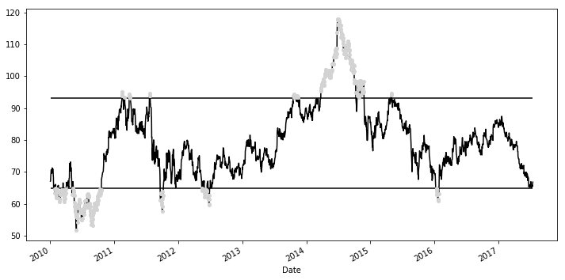
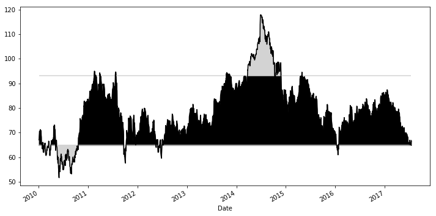
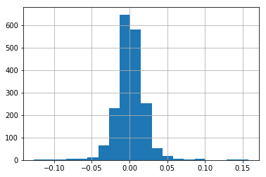
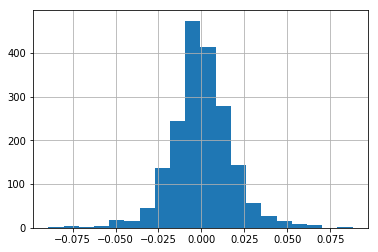
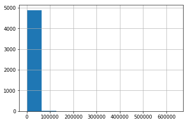
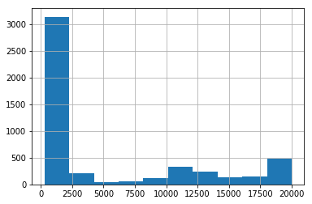

# Praktik Big Data Pertemuan 12


```python
import pandas as pd
import numpy as np
```


```python
college = pd.read_csv('data/college.csv', index_col='INSTNM')
city = college['CITY']
city.head()
```


    INSTNM
    Alabama A & M University                   Normal
    University of Alabama at Birmingham    Birmingham
    Amridge University                     Montgomery
    University of Alabama in Huntsville    Huntsville
    Alabama State University               Montgomery
    Name: CITY, dtype: object


```python
import pandas as pd
import numpy as np
```


```python
college = pd.read_csv('data/college.csv', index_col='INSTNM')
city = college['CITY']
city.iloc[3]
```


    'Huntsville'


```python

```


```python
import pandas as pd
import numpy as np
```


```python
college = pd.read_csv('data/college.csv', index_col='INSTNM')
city = college['CITY']
city.iloc[[10,20,30]]
```


    INSTNM
    Birmingham Southern College                            Birmingham
    George C Wallace State Community College-Hanceville    Hanceville
    Judson College                                             Marion
    Name: CITY, dtype: object


```python

```


```python
import pandas as pd
import numpy as np
```


```python
college = pd.read_csv('data/college.csv', index_col='INSTNM')
city = college['CITY']
city.iloc[4:50:10]
```


    INSTNM
    Alabama State University              Montgomery
    Enterprise State Community College    Enterprise
    Heritage Christian University           Florence
    Marion Military Institute                 Marion
    Reid State Technical College           Evergreen
    Name: CITY, dtype: object


```python

```


```python
import pandas as pd
import numpy as np
```


```python
college = pd.read_csv('data/college.csv', index_col='INSTNM')
city = college['CITY']
city.loc['Heritage Christian University']
```


    'Florence'


```python

```


```python
import pandas as pd
import numpy as np
```


```python
college = pd.read_csv('data/college.csv', index_col='INSTNM')
city = college['CITY']
np.random.seed(1)
labels = list(np.random.choice(city.index, 4))
labels
```


    ['Northwest HVAC/R Training Center',
     'California State University-Dominguez Hills',
     'Lower Columbia College',
     'Southwest Acupuncture College-Boulder']


```python

```


```python
import pandas as pd
import numpy as np
```


```python
college = pd.read_csv('data/college.csv', index_col='INSTNM')
city = college['CITY']
np.random.seed(1)
labels = list(np.random.choice(city.index, 4))
city.loc[labels]
```


    INSTNM
    Northwest HVAC/R Training Center                Spokane
    California State University-Dominguez Hills      Carson
    Lower Columbia College                         Longview
    Southwest Acupuncture College-Boulder           Boulder
    Name: CITY, dtype: object


```python

```


```python
import pandas as pd
import numpy as np
```


```python
college = pd.read_csv('data/college.csv', index_col='INSTNM')
city = college['CITY']
np.random.seed(1)
labels = list(np.random.choice(city.index, 4))
city.loc['Alabama State University':'Reid State Technical College':10]
```


    INSTNM
    Alabama State University              Montgomery
    Enterprise State Community College    Enterprise
    Heritage Christian University           Florence
    Marion Military Institute                 Marion
    Reid State Technical College           Evergreen
    Name: CITY, dtype: object


```python

```


```python
import pandas as pd
import numpy as np
```


```python
college = pd.read_csv('data/college.csv', index_col='INSTNM')
city = college['CITY']
np.random.seed(1)
labels = list(np.random.choice(city.index, 4))
city.loc['Alabama State University':'Reid State Technical College':10]
```


    INSTNM
    Alabama State University              Montgomery
    Enterprise State Community College    Enterprise
    Heritage Christian University           Florence
    Marion Military Institute                 Marion
    Reid State Technical College           Evergreen
    Name: CITY, dtype: object


```python

```


```python
import pandas as pd
import numpy as np
```


```python
college = pd.read_csv('data/college.csv', index_col='INSTNM')
city = college['CITY']
city.iloc[[3]]
```


    INSTNM
    University of Alabama in Huntsville    Huntsville
    Name: CITY, dtype: object


```python

```


```python
import pandas as pd
import numpy as np
```


```python
college = pd.read_csv('data/college.csv', index_col='INSTNM')
city = college['CITY']
city.loc['Reid State Technical College':'Alabama State University':10]
```


    INSTNM
    University of Alabama in Huntsville    Huntsville
    Name: CITY, dtype: object


```python

```


```python
import pandas as pd
import numpy as np
```


```python
college = pd.read_csv('data/college.csv', index_col='INSTNM')
city = college['CITY']
city.loc['Reid State Technical College':'Alabama State University':-10]
```


    INSTNM
    Reid State Technical College           Evergreen
    Marion Military Institute                 Marion
    Heritage Christian University           Florence
    Enterprise State Community College    Enterprise
    Alabama State University              Montgomery
    Name: CITY, dtype: object


```python

```


```python
import pandas as pd
import numpy as np
```


```python
college = pd.read_csv('data/college.csv', index_col='INSTNM')
college.head()
```


<div>
<style scoped>
    .dataframe tbody tr th:only-of-type {
        vertical-align: middle;
    }

    .dataframe tbody tr th {
        vertical-align: top;
    }

    .dataframe thead th {
        text-align: right;
    }
</style>
<table border="1" class="dataframe">
  <thead>
    <tr style="text-align: right;">
      <th></th>
      <th>CITY</th>
      <th>STABBR</th>
      <th>HBCU</th>
      <th>MENONLY</th>
      <th>WOMENONLY</th>
      <th>RELAFFIL</th>
      <th>SATVRMID</th>
      <th>SATMTMID</th>
      <th>DISTANCEONLY</th>
      <th>UGDS</th>
      <th>...</th>
      <th>UGDS_2MOR</th>
      <th>UGDS_NRA</th>
      <th>UGDS_UNKN</th>
      <th>PPTUG_EF</th>
      <th>CURROPER</th>
      <th>PCTPELL</th>
      <th>PCTFLOAN</th>
      <th>UG25ABV</th>
      <th>MD_EARN_WNE_P10</th>
      <th>GRAD_DEBT_MDN_SUPP</th>
    </tr>
    <tr>
      <th>INSTNM</th>
      <th></th>
      <th></th>
      <th></th>
      <th></th>
      <th></th>
      <th></th>
      <th></th>
      <th></th>
      <th></th>
      <th></th>
      <th></th>
      <th></th>
      <th></th>
      <th></th>
      <th></th>
      <th></th>
      <th></th>
      <th></th>
      <th></th>
      <th></th>
      <th></th>
    </tr>
  </thead>
  <tbody>
    <tr>
      <th>Alabama A &amp; M University</th>
      <td>Normal</td>
      <td>AL</td>
      <td>1.0</td>
      <td>0.0</td>
      <td>0.0</td>
      <td>0</td>
      <td>424.0</td>
      <td>420.0</td>
      <td>0.0</td>
      <td>4206.0</td>
      <td>...</td>
      <td>0.0000</td>
      <td>0.0059</td>
      <td>0.0138</td>
      <td>0.0656</td>
      <td>1</td>
      <td>0.7356</td>
      <td>0.8284</td>
      <td>0.1049</td>
      <td>30300</td>
      <td>33888</td>
    </tr>
    <tr>
      <th>University of Alabama at Birmingham</th>
      <td>Birmingham</td>
      <td>AL</td>
      <td>0.0</td>
      <td>0.0</td>
      <td>0.0</td>
      <td>0</td>
      <td>570.0</td>
      <td>565.0</td>
      <td>0.0</td>
      <td>11383.0</td>
      <td>...</td>
      <td>0.0368</td>
      <td>0.0179</td>
      <td>0.0100</td>
      <td>0.2607</td>
      <td>1</td>
      <td>0.3460</td>
      <td>0.5214</td>
      <td>0.2422</td>
      <td>39700</td>
      <td>21941.5</td>
    </tr>
    <tr>
      <th>Amridge University</th>
      <td>Montgomery</td>
      <td>AL</td>
      <td>0.0</td>
      <td>0.0</td>
      <td>0.0</td>
      <td>1</td>
      <td>NaN</td>
      <td>NaN</td>
      <td>1.0</td>
      <td>291.0</td>
      <td>...</td>
      <td>0.0000</td>
      <td>0.0000</td>
      <td>0.2715</td>
      <td>0.4536</td>
      <td>1</td>
      <td>0.6801</td>
      <td>0.7795</td>
      <td>0.8540</td>
      <td>40100</td>
      <td>23370</td>
    </tr>
    <tr>
      <th>University of Alabama in Huntsville</th>
      <td>Huntsville</td>
      <td>AL</td>
      <td>0.0</td>
      <td>0.0</td>
      <td>0.0</td>
      <td>0</td>
      <td>595.0</td>
      <td>590.0</td>
      <td>0.0</td>
      <td>5451.0</td>
      <td>...</td>
      <td>0.0172</td>
      <td>0.0332</td>
      <td>0.0350</td>
      <td>0.2146</td>
      <td>1</td>
      <td>0.3072</td>
      <td>0.4596</td>
      <td>0.2640</td>
      <td>45500</td>
      <td>24097</td>
    </tr>
    <tr>
      <th>Alabama State University</th>
      <td>Montgomery</td>
      <td>AL</td>
      <td>1.0</td>
      <td>0.0</td>
      <td>0.0</td>
      <td>0</td>
      <td>425.0</td>
      <td>430.0</td>
      <td>0.0</td>
      <td>4811.0</td>
      <td>...</td>
      <td>0.0098</td>
      <td>0.0243</td>
      <td>0.0137</td>
      <td>0.0892</td>
      <td>1</td>
      <td>0.7347</td>
      <td>0.7554</td>
      <td>0.1270</td>
      <td>26600</td>
      <td>33118.5</td>
    </tr>
  </tbody>
</table>
<p>5 rows × 26 columns</p>
</div>


```python

```


```python
import pandas as pd
import numpy as np
```


```python
college = pd.read_csv('data/college.csv', index_col='INSTNM')
pd.options.display.max_rows = 6
college.iloc[60]
```


    CITY                  Anchorage
    STABBR                       AK
    HBCU                          0
                            ...    
    UG25ABV                  0.4386
    MD_EARN_WNE_P10           42500
    GRAD_DEBT_MDN_SUPP      19449.5
    Name: University of Alaska Anchorage, Length: 26, dtype: object


```python

```


```python
import pandas as pd
import numpy as np
```


```python
college = pd.read_csv('data/college.csv', index_col='INSTNM')
pd.options.display.max_rows = 6
college.loc['University of Alaska Anchorage']
```


    CITY                  Anchorage
    STABBR                       AK
    HBCU                          0
                            ...    
    UG25ABV                  0.4386
    MD_EARN_WNE_P10           42500
    GRAD_DEBT_MDN_SUPP      19449.5
    Name: University of Alaska Anchorage, Length: 26, dtype: object


```python

```


```python
import pandas as pd
import numpy as np
```


```python
college = pd.read_csv('data/college.csv', index_col='INSTNM')
pd.options.display.max_rows = 6
college.iloc[[60, 99, 3]]
```


<div>
<style scoped>
    .dataframe tbody tr th:only-of-type {
        vertical-align: middle;
    }

    .dataframe tbody tr th {
        vertical-align: top;
    }

    .dataframe thead th {
        text-align: right;
    }
</style>
<table border="1" class="dataframe">
  <thead>
    <tr style="text-align: right;">
      <th></th>
      <th>CITY</th>
      <th>STABBR</th>
      <th>HBCU</th>
      <th>MENONLY</th>
      <th>WOMENONLY</th>
      <th>RELAFFIL</th>
      <th>SATVRMID</th>
      <th>SATMTMID</th>
      <th>DISTANCEONLY</th>
      <th>UGDS</th>
      <th>...</th>
      <th>UGDS_2MOR</th>
      <th>UGDS_NRA</th>
      <th>UGDS_UNKN</th>
      <th>PPTUG_EF</th>
      <th>CURROPER</th>
      <th>PCTPELL</th>
      <th>PCTFLOAN</th>
      <th>UG25ABV</th>
      <th>MD_EARN_WNE_P10</th>
      <th>GRAD_DEBT_MDN_SUPP</th>
    </tr>
    <tr>
      <th>INSTNM</th>
      <th></th>
      <th></th>
      <th></th>
      <th></th>
      <th></th>
      <th></th>
      <th></th>
      <th></th>
      <th></th>
      <th></th>
      <th></th>
      <th></th>
      <th></th>
      <th></th>
      <th></th>
      <th></th>
      <th></th>
      <th></th>
      <th></th>
      <th></th>
      <th></th>
    </tr>
  </thead>
  <tbody>
    <tr>
      <th>University of Alaska Anchorage</th>
      <td>Anchorage</td>
      <td>AK</td>
      <td>0.0</td>
      <td>0.0</td>
      <td>0.0</td>
      <td>0</td>
      <td>NaN</td>
      <td>NaN</td>
      <td>0.0</td>
      <td>12865.0</td>
      <td>...</td>
      <td>0.0980</td>
      <td>0.0181</td>
      <td>0.0457</td>
      <td>0.4539</td>
      <td>1</td>
      <td>0.2385</td>
      <td>0.2647</td>
      <td>0.4386</td>
      <td>42500</td>
      <td>19449.5</td>
    </tr>
    <tr>
      <th>International Academy of Hair Design</th>
      <td>Tempe</td>
      <td>AZ</td>
      <td>0.0</td>
      <td>0.0</td>
      <td>0.0</td>
      <td>0</td>
      <td>NaN</td>
      <td>NaN</td>
      <td>0.0</td>
      <td>188.0</td>
      <td>...</td>
      <td>0.0160</td>
      <td>0.0000</td>
      <td>0.0638</td>
      <td>0.0000</td>
      <td>0</td>
      <td>0.7185</td>
      <td>0.7346</td>
      <td>0.3905</td>
      <td>22200</td>
      <td>10556</td>
    </tr>
    <tr>
      <th>University of Alabama in Huntsville</th>
      <td>Huntsville</td>
      <td>AL</td>
      <td>0.0</td>
      <td>0.0</td>
      <td>0.0</td>
      <td>0</td>
      <td>595.0</td>
      <td>590.0</td>
      <td>0.0</td>
      <td>5451.0</td>
      <td>...</td>
      <td>0.0172</td>
      <td>0.0332</td>
      <td>0.0350</td>
      <td>0.2146</td>
      <td>1</td>
      <td>0.3072</td>
      <td>0.4596</td>
      <td>0.2640</td>
      <td>45500</td>
      <td>24097</td>
    </tr>
  </tbody>
</table>
<p>3 rows × 26 columns</p>
</div>


```python

```


```python
import pandas as pd
import numpy as np
```


```python
college = pd.read_csv('data/college.csv', index_col='INSTNM')
labels = ['University of Alaska Anchorage',
          'International Academy of Hair Design',
          'University of Alabama in Huntsville']
college.loc[labels]
```


<div>
<style scoped>
    .dataframe tbody tr th:only-of-type {
        vertical-align: middle;
    }

    .dataframe tbody tr th {
        vertical-align: top;
    }

    .dataframe thead th {
        text-align: right;
    }
</style>
<table border="1" class="dataframe">
  <thead>
    <tr style="text-align: right;">
      <th></th>
      <th>CITY</th>
      <th>STABBR</th>
      <th>HBCU</th>
      <th>MENONLY</th>
      <th>WOMENONLY</th>
      <th>RELAFFIL</th>
      <th>SATVRMID</th>
      <th>SATMTMID</th>
      <th>DISTANCEONLY</th>
      <th>UGDS</th>
      <th>...</th>
      <th>UGDS_2MOR</th>
      <th>UGDS_NRA</th>
      <th>UGDS_UNKN</th>
      <th>PPTUG_EF</th>
      <th>CURROPER</th>
      <th>PCTPELL</th>
      <th>PCTFLOAN</th>
      <th>UG25ABV</th>
      <th>MD_EARN_WNE_P10</th>
      <th>GRAD_DEBT_MDN_SUPP</th>
    </tr>
    <tr>
      <th>INSTNM</th>
      <th></th>
      <th></th>
      <th></th>
      <th></th>
      <th></th>
      <th></th>
      <th></th>
      <th></th>
      <th></th>
      <th></th>
      <th></th>
      <th></th>
      <th></th>
      <th></th>
      <th></th>
      <th></th>
      <th></th>
      <th></th>
      <th></th>
      <th></th>
      <th></th>
    </tr>
  </thead>
  <tbody>
    <tr>
      <th>University of Alaska Anchorage</th>
      <td>Anchorage</td>
      <td>AK</td>
      <td>0.0</td>
      <td>0.0</td>
      <td>0.0</td>
      <td>0</td>
      <td>NaN</td>
      <td>NaN</td>
      <td>0.0</td>
      <td>12865.0</td>
      <td>...</td>
      <td>0.0980</td>
      <td>0.0181</td>
      <td>0.0457</td>
      <td>0.4539</td>
      <td>1</td>
      <td>0.2385</td>
      <td>0.2647</td>
      <td>0.4386</td>
      <td>42500</td>
      <td>19449.5</td>
    </tr>
    <tr>
      <th>International Academy of Hair Design</th>
      <td>Tempe</td>
      <td>AZ</td>
      <td>0.0</td>
      <td>0.0</td>
      <td>0.0</td>
      <td>0</td>
      <td>NaN</td>
      <td>NaN</td>
      <td>0.0</td>
      <td>188.0</td>
      <td>...</td>
      <td>0.0160</td>
      <td>0.0000</td>
      <td>0.0638</td>
      <td>0.0000</td>
      <td>0</td>
      <td>0.7185</td>
      <td>0.7346</td>
      <td>0.3905</td>
      <td>22200</td>
      <td>10556</td>
    </tr>
    <tr>
      <th>University of Alabama in Huntsville</th>
      <td>Huntsville</td>
      <td>AL</td>
      <td>0.0</td>
      <td>0.0</td>
      <td>0.0</td>
      <td>0</td>
      <td>595.0</td>
      <td>590.0</td>
      <td>0.0</td>
      <td>5451.0</td>
      <td>...</td>
      <td>0.0172</td>
      <td>0.0332</td>
      <td>0.0350</td>
      <td>0.2146</td>
      <td>1</td>
      <td>0.3072</td>
      <td>0.4596</td>
      <td>0.2640</td>
      <td>45500</td>
      <td>24097</td>
    </tr>
  </tbody>
</table>
<p>3 rows × 26 columns</p>
</div>


```python

```


```python
import pandas as pd
import numpy as np
```


```python
college = pd.read_csv('data/college.csv', index_col='INSTNM')
labels = ['University of Alaska Anchorage',
          'International Academy of Hair Design',
          'University of Alabama in Huntsville']
college.iloc[99:102]
```


<div>
<style scoped>
    .dataframe tbody tr th:only-of-type {
        vertical-align: middle;
    }

    .dataframe tbody tr th {
        vertical-align: top;
    }

    .dataframe thead th {
        text-align: right;
    }
</style>
<table border="1" class="dataframe">
  <thead>
    <tr style="text-align: right;">
      <th></th>
      <th>CITY</th>
      <th>STABBR</th>
      <th>HBCU</th>
      <th>MENONLY</th>
      <th>WOMENONLY</th>
      <th>RELAFFIL</th>
      <th>SATVRMID</th>
      <th>SATMTMID</th>
      <th>DISTANCEONLY</th>
      <th>UGDS</th>
      <th>...</th>
      <th>UGDS_2MOR</th>
      <th>UGDS_NRA</th>
      <th>UGDS_UNKN</th>
      <th>PPTUG_EF</th>
      <th>CURROPER</th>
      <th>PCTPELL</th>
      <th>PCTFLOAN</th>
      <th>UG25ABV</th>
      <th>MD_EARN_WNE_P10</th>
      <th>GRAD_DEBT_MDN_SUPP</th>
    </tr>
    <tr>
      <th>INSTNM</th>
      <th></th>
      <th></th>
      <th></th>
      <th></th>
      <th></th>
      <th></th>
      <th></th>
      <th></th>
      <th></th>
      <th></th>
      <th></th>
      <th></th>
      <th></th>
      <th></th>
      <th></th>
      <th></th>
      <th></th>
      <th></th>
      <th></th>
      <th></th>
      <th></th>
    </tr>
  </thead>
  <tbody>
    <tr>
      <th>International Academy of Hair Design</th>
      <td>Tempe</td>
      <td>AZ</td>
      <td>0.0</td>
      <td>0.0</td>
      <td>0.0</td>
      <td>0</td>
      <td>NaN</td>
      <td>NaN</td>
      <td>0.0</td>
      <td>188.0</td>
      <td>...</td>
      <td>0.0160</td>
      <td>0.0000</td>
      <td>0.0638</td>
      <td>0.0000</td>
      <td>0</td>
      <td>0.7185</td>
      <td>0.7346</td>
      <td>0.3905</td>
      <td>22200</td>
      <td>10556</td>
    </tr>
    <tr>
      <th>GateWay Community College</th>
      <td>Phoenix</td>
      <td>AZ</td>
      <td>0.0</td>
      <td>0.0</td>
      <td>0.0</td>
      <td>0</td>
      <td>NaN</td>
      <td>NaN</td>
      <td>0.0</td>
      <td>5211.0</td>
      <td>...</td>
      <td>0.0127</td>
      <td>0.0161</td>
      <td>0.0702</td>
      <td>0.7465</td>
      <td>1</td>
      <td>0.3270</td>
      <td>0.2189</td>
      <td>0.5832</td>
      <td>29800</td>
      <td>7283</td>
    </tr>
    <tr>
      <th>Mesa Community College</th>
      <td>Mesa</td>
      <td>AZ</td>
      <td>0.0</td>
      <td>0.0</td>
      <td>0.0</td>
      <td>0</td>
      <td>NaN</td>
      <td>NaN</td>
      <td>0.0</td>
      <td>19055.0</td>
      <td>...</td>
      <td>0.0205</td>
      <td>0.0257</td>
      <td>0.0682</td>
      <td>0.6457</td>
      <td>1</td>
      <td>0.3423</td>
      <td>0.2207</td>
      <td>0.4010</td>
      <td>35200</td>
      <td>8000</td>
    </tr>
  </tbody>
</table>
<p>3 rows × 26 columns</p>
</div>


```python

```


```python
import pandas as pd
import numpy as np
```


```python
college = pd.read_csv('data/college.csv', index_col='INSTNM')
start = 'International Academy of Hair Design'
stop = 'Mesa Community College'
college.loc[start:stop]
```


<div>
<style scoped>
    .dataframe tbody tr th:only-of-type {
        vertical-align: middle;
    }

    .dataframe tbody tr th {
        vertical-align: top;
    }

    .dataframe thead th {
        text-align: right;
    }
</style>
<table border="1" class="dataframe">
  <thead>
    <tr style="text-align: right;">
      <th></th>
      <th>CITY</th>
      <th>STABBR</th>
      <th>HBCU</th>
      <th>MENONLY</th>
      <th>WOMENONLY</th>
      <th>RELAFFIL</th>
      <th>SATVRMID</th>
      <th>SATMTMID</th>
      <th>DISTANCEONLY</th>
      <th>UGDS</th>
      <th>...</th>
      <th>UGDS_2MOR</th>
      <th>UGDS_NRA</th>
      <th>UGDS_UNKN</th>
      <th>PPTUG_EF</th>
      <th>CURROPER</th>
      <th>PCTPELL</th>
      <th>PCTFLOAN</th>
      <th>UG25ABV</th>
      <th>MD_EARN_WNE_P10</th>
      <th>GRAD_DEBT_MDN_SUPP</th>
    </tr>
    <tr>
      <th>INSTNM</th>
      <th></th>
      <th></th>
      <th></th>
      <th></th>
      <th></th>
      <th></th>
      <th></th>
      <th></th>
      <th></th>
      <th></th>
      <th></th>
      <th></th>
      <th></th>
      <th></th>
      <th></th>
      <th></th>
      <th></th>
      <th></th>
      <th></th>
      <th></th>
      <th></th>
    </tr>
  </thead>
  <tbody>
    <tr>
      <th>International Academy of Hair Design</th>
      <td>Tempe</td>
      <td>AZ</td>
      <td>0.0</td>
      <td>0.0</td>
      <td>0.0</td>
      <td>0</td>
      <td>NaN</td>
      <td>NaN</td>
      <td>0.0</td>
      <td>188.0</td>
      <td>...</td>
      <td>0.0160</td>
      <td>0.0000</td>
      <td>0.0638</td>
      <td>0.0000</td>
      <td>0</td>
      <td>0.7185</td>
      <td>0.7346</td>
      <td>0.3905</td>
      <td>22200</td>
      <td>10556</td>
    </tr>
    <tr>
      <th>GateWay Community College</th>
      <td>Phoenix</td>
      <td>AZ</td>
      <td>0.0</td>
      <td>0.0</td>
      <td>0.0</td>
      <td>0</td>
      <td>NaN</td>
      <td>NaN</td>
      <td>0.0</td>
      <td>5211.0</td>
      <td>...</td>
      <td>0.0127</td>
      <td>0.0161</td>
      <td>0.0702</td>
      <td>0.7465</td>
      <td>1</td>
      <td>0.3270</td>
      <td>0.2189</td>
      <td>0.5832</td>
      <td>29800</td>
      <td>7283</td>
    </tr>
    <tr>
      <th>Mesa Community College</th>
      <td>Mesa</td>
      <td>AZ</td>
      <td>0.0</td>
      <td>0.0</td>
      <td>0.0</td>
      <td>0</td>
      <td>NaN</td>
      <td>NaN</td>
      <td>0.0</td>
      <td>19055.0</td>
      <td>...</td>
      <td>0.0205</td>
      <td>0.0257</td>
      <td>0.0682</td>
      <td>0.6457</td>
      <td>1</td>
      <td>0.3423</td>
      <td>0.2207</td>
      <td>0.4010</td>
      <td>35200</td>
      <td>8000</td>
    </tr>
  </tbody>
</table>
<p>3 rows × 26 columns</p>
</div>


```python

```


```python
import pandas as pd
import numpy as np
```


```python
college = pd.read_csv('data/college.csv', index_col='INSTNM')
start = 'International Academy of Hair Design'
stop = 'Mesa Community College'
college.iloc[[60, 99, 3]].index.tolist()
```


    ['University of Alaska Anchorage',
     'International Academy of Hair Design',
     'University of Alabama in Huntsville']


```python

```


```python
import pandas as pd
import numpy as np
```


```python
college = pd.read_csv('data/college.csv', index_col='INSTNM')
college.iloc[:3, :4]
```


<div>
<style scoped>
    .dataframe tbody tr th:only-of-type {
        vertical-align: middle;
    }

    .dataframe tbody tr th {
        vertical-align: top;
    }

    .dataframe thead th {
        text-align: right;
    }
</style>
<table border="1" class="dataframe">
  <thead>
    <tr style="text-align: right;">
      <th></th>
      <th>CITY</th>
      <th>STABBR</th>
      <th>HBCU</th>
      <th>MENONLY</th>
    </tr>
    <tr>
      <th>INSTNM</th>
      <th></th>
      <th></th>
      <th></th>
      <th></th>
    </tr>
  </thead>
  <tbody>
    <tr>
      <th>Alabama A &amp; M University</th>
      <td>Normal</td>
      <td>AL</td>
      <td>1.0</td>
      <td>0.0</td>
    </tr>
    <tr>
      <th>University of Alabama at Birmingham</th>
      <td>Birmingham</td>
      <td>AL</td>
      <td>0.0</td>
      <td>0.0</td>
    </tr>
    <tr>
      <th>Amridge University</th>
      <td>Montgomery</td>
      <td>AL</td>
      <td>0.0</td>
      <td>0.0</td>
    </tr>
  </tbody>
</table>
</div>


```python

```


```python
import pandas as pd
import numpy as np
```


```python
college = pd.read_csv('data/college.csv', index_col='INSTNM')
college.loc[:'Amridge University', :'MENONLY']
```


<div>
<style scoped>
    .dataframe tbody tr th:only-of-type {
        vertical-align: middle;
    }

    .dataframe tbody tr th {
        vertical-align: top;
    }

    .dataframe thead th {
        text-align: right;
    }
</style>
<table border="1" class="dataframe">
  <thead>
    <tr style="text-align: right;">
      <th></th>
      <th>CITY</th>
      <th>STABBR</th>
      <th>HBCU</th>
      <th>MENONLY</th>
    </tr>
    <tr>
      <th>INSTNM</th>
      <th></th>
      <th></th>
      <th></th>
      <th></th>
    </tr>
  </thead>
  <tbody>
    <tr>
      <th>Alabama A &amp; M University</th>
      <td>Normal</td>
      <td>AL</td>
      <td>1.0</td>
      <td>0.0</td>
    </tr>
    <tr>
      <th>University of Alabama at Birmingham</th>
      <td>Birmingham</td>
      <td>AL</td>
      <td>0.0</td>
      <td>0.0</td>
    </tr>
    <tr>
      <th>Amridge University</th>
      <td>Montgomery</td>
      <td>AL</td>
      <td>0.0</td>
      <td>0.0</td>
    </tr>
  </tbody>
</table>
</div>


```python

```


```python
import pandas as pd
import numpy as np
```


```python
college = pd.read_csv('data/college.csv', index_col='INSTNM')
college.iloc[:, [4,6]].head()
```


<div>
<style scoped>
    .dataframe tbody tr th:only-of-type {
        vertical-align: middle;
    }

    .dataframe tbody tr th {
        vertical-align: top;
    }

    .dataframe thead th {
        text-align: right;
    }
</style>
<table border="1" class="dataframe">
  <thead>
    <tr style="text-align: right;">
      <th></th>
      <th>WOMENONLY</th>
      <th>SATVRMID</th>
    </tr>
    <tr>
      <th>INSTNM</th>
      <th></th>
      <th></th>
    </tr>
  </thead>
  <tbody>
    <tr>
      <th>Alabama A &amp; M University</th>
      <td>0.0</td>
      <td>424.0</td>
    </tr>
    <tr>
      <th>University of Alabama at Birmingham</th>
      <td>0.0</td>
      <td>570.0</td>
    </tr>
    <tr>
      <th>Amridge University</th>
      <td>0.0</td>
      <td>NaN</td>
    </tr>
    <tr>
      <th>University of Alabama in Huntsville</th>
      <td>0.0</td>
      <td>595.0</td>
    </tr>
    <tr>
      <th>Alabama State University</th>
      <td>0.0</td>
      <td>425.0</td>
    </tr>
  </tbody>
</table>
</div>


```python

```


```python
import pandas as pd
import numpy as np
```


```python
college = pd.read_csv('data/college.csv', index_col='INSTNM')
college.loc[:, ['WOMENONLY', 'SATVRMID']]
```


<div>
<style scoped>
    .dataframe tbody tr th:only-of-type {
        vertical-align: middle;
    }

    .dataframe tbody tr th {
        vertical-align: top;
    }

    .dataframe thead th {
        text-align: right;
    }
</style>
<table border="1" class="dataframe">
  <thead>
    <tr style="text-align: right;">
      <th></th>
      <th>WOMENONLY</th>
      <th>SATVRMID</th>
    </tr>
    <tr>
      <th>INSTNM</th>
      <th></th>
      <th></th>
    </tr>
  </thead>
  <tbody>
    <tr>
      <th>Alabama A &amp; M University</th>
      <td>0.0</td>
      <td>424.0</td>
    </tr>
    <tr>
      <th>University of Alabama at Birmingham</th>
      <td>0.0</td>
      <td>570.0</td>
    </tr>
    <tr>
      <th>Amridge University</th>
      <td>0.0</td>
      <td>NaN</td>
    </tr>
    <tr>
      <th>University of Alabama in Huntsville</th>
      <td>0.0</td>
      <td>595.0</td>
    </tr>
    <tr>
      <th>Alabama State University</th>
      <td>0.0</td>
      <td>425.0</td>
    </tr>
    <tr>
      <th>The University of Alabama</th>
      <td>0.0</td>
      <td>555.0</td>
    </tr>
    <tr>
      <th>Central Alabama Community College</th>
      <td>0.0</td>
      <td>NaN</td>
    </tr>
    <tr>
      <th>Athens State University</th>
      <td>0.0</td>
      <td>NaN</td>
    </tr>
    <tr>
      <th>Auburn University at Montgomery</th>
      <td>0.0</td>
      <td>486.0</td>
    </tr>
    <tr>
      <th>Auburn University</th>
      <td>0.0</td>
      <td>575.0</td>
    </tr>
    <tr>
      <th>Birmingham Southern College</th>
      <td>0.0</td>
      <td>560.0</td>
    </tr>
    <tr>
      <th>Chattahoochee Valley Community College</th>
      <td>0.0</td>
      <td>NaN</td>
    </tr>
    <tr>
      <th>Concordia College Alabama</th>
      <td>0.0</td>
      <td>420.0</td>
    </tr>
    <tr>
      <th>South University-Montgomery</th>
      <td>0.0</td>
      <td>NaN</td>
    </tr>
    <tr>
      <th>Enterprise State Community College</th>
      <td>0.0</td>
      <td>NaN</td>
    </tr>
    <tr>
      <th>James H Faulkner State Community College</th>
      <td>0.0</td>
      <td>NaN</td>
    </tr>
    <tr>
      <th>Faulkner University</th>
      <td>0.0</td>
      <td>NaN</td>
    </tr>
    <tr>
      <th>Gadsden State Community College</th>
      <td>0.0</td>
      <td>NaN</td>
    </tr>
    <tr>
      <th>New Beginning College of Cosmetology</th>
      <td>0.0</td>
      <td>NaN</td>
    </tr>
    <tr>
      <th>George C Wallace State Community College-Dothan</th>
      <td>0.0</td>
      <td>NaN</td>
    </tr>
    <tr>
      <th>George C Wallace State Community College-Hanceville</th>
      <td>0.0</td>
      <td>NaN</td>
    </tr>
    <tr>
      <th>George C Wallace State Community College-Selma</th>
      <td>0.0</td>
      <td>NaN</td>
    </tr>
    <tr>
      <th>Herzing University-Birmingham</th>
      <td>0.0</td>
      <td>NaN</td>
    </tr>
    <tr>
      <th>Huntingdon College</th>
      <td>0.0</td>
      <td>510.0</td>
    </tr>
    <tr>
      <th>Heritage Christian University</th>
      <td>0.0</td>
      <td>NaN</td>
    </tr>
    <tr>
      <th>J F Drake State Community and Technical College</th>
      <td>0.0</td>
      <td>NaN</td>
    </tr>
    <tr>
      <th>Jacksonville State University</th>
      <td>0.0</td>
      <td>495.0</td>
    </tr>
    <tr>
      <th>Jefferson Davis Community College</th>
      <td>0.0</td>
      <td>NaN</td>
    </tr>
    <tr>
      <th>Jefferson State Community College</th>
      <td>0.0</td>
      <td>NaN</td>
    </tr>
    <tr>
      <th>John C Calhoun State Community College</th>
      <td>0.0</td>
      <td>NaN</td>
    </tr>
    <tr>
      <th>...</th>
      <td>...</td>
      <td>...</td>
    </tr>
    <tr>
      <th>Strayer University-Lawrenceville</th>
      <td>NaN</td>
      <td>NaN</td>
    </tr>
    <tr>
      <th>Strayer University-Piscataway</th>
      <td>NaN</td>
      <td>NaN</td>
    </tr>
    <tr>
      <th>Utah County Campus</th>
      <td>NaN</td>
      <td>NaN</td>
    </tr>
    <tr>
      <th>L'esprit Academy - Royal Oak</th>
      <td>NaN</td>
      <td>NaN</td>
    </tr>
    <tr>
      <th>National Career Institute - Jersey City Branch</th>
      <td>NaN</td>
      <td>NaN</td>
    </tr>
    <tr>
      <th>Strayer University-Cobb Campus</th>
      <td>NaN</td>
      <td>NaN</td>
    </tr>
    <tr>
      <th>Strayer University-Morrow Campus</th>
      <td>NaN</td>
      <td>NaN</td>
    </tr>
    <tr>
      <th>Strayer University-Roswell Campus</th>
      <td>NaN</td>
      <td>NaN</td>
    </tr>
    <tr>
      <th>Strayer University-Douglasville Campus</th>
      <td>NaN</td>
      <td>NaN</td>
    </tr>
    <tr>
      <th>Strayer University-Lithonia Campus</th>
      <td>NaN</td>
      <td>NaN</td>
    </tr>
    <tr>
      <th>Strayer University-Savannah Campus</th>
      <td>NaN</td>
      <td>NaN</td>
    </tr>
    <tr>
      <th>Strayer University-Augusta Campus</th>
      <td>NaN</td>
      <td>NaN</td>
    </tr>
    <tr>
      <th>Strayer University-Columbus</th>
      <td>NaN</td>
      <td>NaN</td>
    </tr>
    <tr>
      <th>Strayer University-Columbia Campus</th>
      <td>NaN</td>
      <td>NaN</td>
    </tr>
    <tr>
      <th>Strayer University-Charleston Campus</th>
      <td>NaN</td>
      <td>NaN</td>
    </tr>
    <tr>
      <th>Strayer University-Irving</th>
      <td>NaN</td>
      <td>NaN</td>
    </tr>
    <tr>
      <th>Strayer University-Katy</th>
      <td>NaN</td>
      <td>NaN</td>
    </tr>
    <tr>
      <th>Strayer University-Northwest Houston</th>
      <td>NaN</td>
      <td>NaN</td>
    </tr>
    <tr>
      <th>Strayer University-Plano</th>
      <td>NaN</td>
      <td>NaN</td>
    </tr>
    <tr>
      <th>Strayer University-Cedar Hill</th>
      <td>NaN</td>
      <td>NaN</td>
    </tr>
    <tr>
      <th>Strayer University-North Dallas</th>
      <td>NaN</td>
      <td>NaN</td>
    </tr>
    <tr>
      <th>Strayer University-San Antonio</th>
      <td>NaN</td>
      <td>NaN</td>
    </tr>
    <tr>
      <th>Strayer University-Stafford</th>
      <td>NaN</td>
      <td>NaN</td>
    </tr>
    <tr>
      <th>WestMed College - Merced</th>
      <td>NaN</td>
      <td>NaN</td>
    </tr>
    <tr>
      <th>Vantage College</th>
      <td>NaN</td>
      <td>NaN</td>
    </tr>
    <tr>
      <th>SAE Institute of Technology  San Francisco</th>
      <td>NaN</td>
      <td>NaN</td>
    </tr>
    <tr>
      <th>Rasmussen College - Overland Park</th>
      <td>NaN</td>
      <td>NaN</td>
    </tr>
    <tr>
      <th>National Personal Training Institute of Cleveland</th>
      <td>NaN</td>
      <td>NaN</td>
    </tr>
    <tr>
      <th>Bay Area Medical Academy - San Jose Satellite Location</th>
      <td>NaN</td>
      <td>NaN</td>
    </tr>
    <tr>
      <th>Excel Learning Center-San Antonio South</th>
      <td>NaN</td>
      <td>NaN</td>
    </tr>
  </tbody>
</table>
<p>7535 rows × 2 columns</p>
</div>


```python

```


```python
import pandas as pd
import numpy as np
```


```python
college = pd.read_csv('data/college.csv', index_col='INSTNM')
college.iloc[[100, 200], [7, 15]]
```


<div>
<style scoped>
    .dataframe tbody tr th:only-of-type {
        vertical-align: middle;
    }

    .dataframe tbody tr th {
        vertical-align: top;
    }

    .dataframe thead th {
        text-align: right;
    }
</style>
<table border="1" class="dataframe">
  <thead>
    <tr style="text-align: right;">
      <th></th>
      <th>SATMTMID</th>
      <th>UGDS_NHPI</th>
    </tr>
    <tr>
      <th>INSTNM</th>
      <th></th>
      <th></th>
    </tr>
  </thead>
  <tbody>
    <tr>
      <th>GateWay Community College</th>
      <td>NaN</td>
      <td>0.0029</td>
    </tr>
    <tr>
      <th>American Baptist Seminary of the West</th>
      <td>NaN</td>
      <td>NaN</td>
    </tr>
  </tbody>
</table>
</div>


```python

```


```python
import pandas as pd
import numpy as np
```


```python
college = pd.read_csv('data/college.csv', index_col='INSTNM')
rows = ['GateWay Community College', 'American Baptist Seminary of the West']
columns = ['SATMTMID', 'UGDS_NHPI']
college.loc[rows, columns]
```


<div>
<style scoped>
    .dataframe tbody tr th:only-of-type {
        vertical-align: middle;
    }

    .dataframe tbody tr th {
        vertical-align: top;
    }

    .dataframe thead th {
        text-align: right;
    }
</style>
<table border="1" class="dataframe">
  <thead>
    <tr style="text-align: right;">
      <th></th>
      <th>SATMTMID</th>
      <th>UGDS_NHPI</th>
    </tr>
    <tr>
      <th>INSTNM</th>
      <th></th>
      <th></th>
    </tr>
  </thead>
  <tbody>
    <tr>
      <th>GateWay Community College</th>
      <td>NaN</td>
      <td>0.0029</td>
    </tr>
    <tr>
      <th>American Baptist Seminary of the West</th>
      <td>NaN</td>
      <td>NaN</td>
    </tr>
  </tbody>
</table>
</div>


```python

```


```python
import pandas as pd
import numpy as np
```


```python
college = pd.read_csv('data/college.csv', index_col='INSTNM')
college.iloc[5, -4]
```


    0.401


```python

```


```python
import pandas as pd
import numpy as np
```


```python
college = pd.read_csv('data/college.csv', index_col='INSTNM')
college.loc['The University of Alabama', 'PCTFLOAN']
```


    0.401


```python

```


```python
import pandas as pd
import numpy as np
```


```python
college = pd.read_csv('data/college.csv', index_col='INSTNM')
college.iloc[90:80:-2, 5]
```


    INSTNM
    Empire Beauty School-Flagstaff     0
    Charles of Italy Beauty College    0
    Central Arizona College            0
    University of Arizona              0
    Arizona State University-Tempe     0
    Name: RELAFFIL, dtype: int64


```python

```


```python
import pandas as pd
import numpy as np
```


```python
college = pd.read_csv('data/college.csv', index_col='INSTNM')
start = 'Empire Beauty School-Flagstaff'
stop = 'Arizona State University-Tempe'
college.loc[start:stop:-2, 'RELAFFIL']
```


    INSTNM
    Empire Beauty School-Flagstaff     0
    Charles of Italy Beauty College    0
    Central Arizona College            0
    University of Arizona              0
    Arizona State University-Tempe     0
    Name: RELAFFIL, dtype: int64


```python

```


```python
import pandas as pd
import numpy as np
```


```python
college = pd.read_csv('data/college.csv', index_col='INSTNM')
col_start = college.columns.get_loc('UGDS_WHITE')
col_end = college.columns.get_loc('UGDS_UNKN') + 1
col_start, col_end
```


    (10, 19)


```python

```


```python
import pandas as pd
import numpy as np
```


```python
college = pd.read_csv('data/college.csv', index_col='INSTNM')
col_start = college.columns.get_loc('UGDS_WHITE')
col_end = college.columns.get_loc('UGDS_UNKN') + 1
college.iloc[:5, col_start:col_end]
```


<div>
<style scoped>
    .dataframe tbody tr th:only-of-type {
        vertical-align: middle;
    }

    .dataframe tbody tr th {
        vertical-align: top;
    }

    .dataframe thead th {
        text-align: right;
    }
</style>
<table border="1" class="dataframe">
  <thead>
    <tr style="text-align: right;">
      <th></th>
      <th>UGDS_WHITE</th>
      <th>UGDS_BLACK</th>
      <th>UGDS_HISP</th>
      <th>UGDS_ASIAN</th>
      <th>UGDS_AIAN</th>
      <th>UGDS_NHPI</th>
      <th>UGDS_2MOR</th>
      <th>UGDS_NRA</th>
      <th>UGDS_UNKN</th>
    </tr>
    <tr>
      <th>INSTNM</th>
      <th></th>
      <th></th>
      <th></th>
      <th></th>
      <th></th>
      <th></th>
      <th></th>
      <th></th>
      <th></th>
    </tr>
  </thead>
  <tbody>
    <tr>
      <th>Alabama A &amp; M University</th>
      <td>0.0333</td>
      <td>0.9353</td>
      <td>0.0055</td>
      <td>0.0019</td>
      <td>0.0024</td>
      <td>0.0019</td>
      <td>0.0000</td>
      <td>0.0059</td>
      <td>0.0138</td>
    </tr>
    <tr>
      <th>University of Alabama at Birmingham</th>
      <td>0.5922</td>
      <td>0.2600</td>
      <td>0.0283</td>
      <td>0.0518</td>
      <td>0.0022</td>
      <td>0.0007</td>
      <td>0.0368</td>
      <td>0.0179</td>
      <td>0.0100</td>
    </tr>
    <tr>
      <th>Amridge University</th>
      <td>0.2990</td>
      <td>0.4192</td>
      <td>0.0069</td>
      <td>0.0034</td>
      <td>0.0000</td>
      <td>0.0000</td>
      <td>0.0000</td>
      <td>0.0000</td>
      <td>0.2715</td>
    </tr>
    <tr>
      <th>University of Alabama in Huntsville</th>
      <td>0.6988</td>
      <td>0.1255</td>
      <td>0.0382</td>
      <td>0.0376</td>
      <td>0.0143</td>
      <td>0.0002</td>
      <td>0.0172</td>
      <td>0.0332</td>
      <td>0.0350</td>
    </tr>
    <tr>
      <th>Alabama State University</th>
      <td>0.0158</td>
      <td>0.9208</td>
      <td>0.0121</td>
      <td>0.0019</td>
      <td>0.0010</td>
      <td>0.0006</td>
      <td>0.0098</td>
      <td>0.0243</td>
      <td>0.0137</td>
    </tr>
  </tbody>
</table>
</div>


```python

```


```python
import pandas as pd
import numpy as np
```


```python
college = pd.read_csv('data/college.csv', index_col='INSTNM')
row_start = college.index[10]
row_end = college.index[15]
college.loc[row_start:row_end, 'UGDS_WHITE':'UGDS_UNKN']
```


<div>
<style scoped>
    .dataframe tbody tr th:only-of-type {
        vertical-align: middle;
    }

    .dataframe tbody tr th {
        vertical-align: top;
    }

    .dataframe thead th {
        text-align: right;
    }
</style>
<table border="1" class="dataframe">
  <thead>
    <tr style="text-align: right;">
      <th></th>
      <th>UGDS_WHITE</th>
      <th>UGDS_BLACK</th>
      <th>UGDS_HISP</th>
      <th>UGDS_ASIAN</th>
      <th>UGDS_AIAN</th>
      <th>UGDS_NHPI</th>
      <th>UGDS_2MOR</th>
      <th>UGDS_NRA</th>
      <th>UGDS_UNKN</th>
    </tr>
    <tr>
      <th>INSTNM</th>
      <th></th>
      <th></th>
      <th></th>
      <th></th>
      <th></th>
      <th></th>
      <th></th>
      <th></th>
      <th></th>
    </tr>
  </thead>
  <tbody>
    <tr>
      <th>Birmingham Southern College</th>
      <td>0.7983</td>
      <td>0.1102</td>
      <td>0.0195</td>
      <td>0.0517</td>
      <td>0.0102</td>
      <td>0.0000</td>
      <td>0.0051</td>
      <td>0.0000</td>
      <td>0.0051</td>
    </tr>
    <tr>
      <th>Chattahoochee Valley Community College</th>
      <td>0.4661</td>
      <td>0.4372</td>
      <td>0.0492</td>
      <td>0.0127</td>
      <td>0.0023</td>
      <td>0.0035</td>
      <td>0.0151</td>
      <td>0.0000</td>
      <td>0.0139</td>
    </tr>
    <tr>
      <th>Concordia College Alabama</th>
      <td>0.0280</td>
      <td>0.8758</td>
      <td>0.0373</td>
      <td>0.0093</td>
      <td>0.0000</td>
      <td>0.0000</td>
      <td>0.0031</td>
      <td>0.0466</td>
      <td>0.0000</td>
    </tr>
    <tr>
      <th>South University-Montgomery</th>
      <td>0.3046</td>
      <td>0.6054</td>
      <td>0.0153</td>
      <td>0.0153</td>
      <td>0.0153</td>
      <td>0.0096</td>
      <td>0.0000</td>
      <td>0.0019</td>
      <td>0.0326</td>
    </tr>
    <tr>
      <th>Enterprise State Community College</th>
      <td>0.6408</td>
      <td>0.2435</td>
      <td>0.0509</td>
      <td>0.0202</td>
      <td>0.0081</td>
      <td>0.0029</td>
      <td>0.0254</td>
      <td>0.0012</td>
      <td>0.0069</td>
    </tr>
    <tr>
      <th>James H Faulkner State Community College</th>
      <td>0.6979</td>
      <td>0.2259</td>
      <td>0.0320</td>
      <td>0.0084</td>
      <td>0.0177</td>
      <td>0.0014</td>
      <td>0.0152</td>
      <td>0.0007</td>
      <td>0.0009</td>
    </tr>
  </tbody>
</table>
</div>


```python

```


```python
import pandas as pd
import numpy as np
```


```python
college = pd.read_csv('data/college.csv', index_col='INSTNM')
cn = 'Texas A & M University-College Station'
college.loc[cn, 'UGDS_WHITE']
```


    0.6609999999999999


```python

```


```python
import pandas as pd
import numpy as np
```


```python
college = pd.read_csv('data/college.csv', index_col='INSTNM')
cn = 'Texas A & M University-College Station'
college.at[cn, 'UGDS_WHITE']
```


    0.6609999999999999


```python

```


```python
import pandas as pd
import numpy as np
```


```python
college = pd.read_csv('data/college.csv', index_col='INSTNM')
cn = 'Texas A & M University-College Station'
%timeit college.loc[cn, 'UGDS_WHITE']
```

    20.5 µs ± 73.6 ns per loop (mean ± std. dev. of 7 runs, 10000 loops each)


```python

```


```python
import pandas as pd
import numpy as np
```


```python
college = pd.read_csv('data/college.csv', index_col='INSTNM')
cn = 'Texas A & M University-College Station'
%timeit college.at[cn, 'UGDS_WHITE']
```

    12.8 µs ± 389 ns per loop (mean ± std. dev. of 7 runs, 100000 loops each)


```python

```


```python
import pandas as pd
import numpy as np
```


```python
college = pd.read_csv('data/college.csv', index_col='INSTNM')
cn = 'Texas A & M University-College Station'
row_num = college.index.get_loc(cn)
col_num = college.columns.get_loc('UGDS_WHITE')
row_num, col_num
```


    (3765, 10)


```python

```


```python
import pandas as pd
import numpy as np
```


```python
college = pd.read_csv('data/college.csv', index_col='INSTNM')
cn = 'Texas A & M University-College Station'
row_num = college.index.get_loc(cn)
col_num = college.columns.get_loc('UGDS_WHITE')
%timeit college.iloc[row_num, col_num]
```

    21.8 µs ± 190 ns per loop (mean ± std. dev. of 7 runs, 10000 loops each)


```python

```


```python
import pandas as pd
import numpy as np
```


```python
college = pd.read_csv('data/college.csv', index_col='INSTNM')
cn = 'Texas A & M University-College Station'
row_num = college.index.get_loc(cn)
col_num = college.columns.get_loc('UGDS_WHITE')
%timeit college.iat[row_num, col_num]
```

    13.4 µs ± 403 ns per loop (mean ± std. dev. of 7 runs, 100000 loops each)


```python

```


```python
import pandas as pd
import numpy as np
```


```python
college = pd.read_csv('data/college.csv', index_col='INSTNM')
cn = 'Texas A & M University-College Station'
row_num = college.index.get_loc(cn)
col_num = college.columns.get_loc('UGDS_WHITE')
%timeit college.iloc[5, col_num]
```

    21.8 µs ± 218 ns per loop (mean ± std. dev. of 7 runs, 10000 loops each)


```python

```


```python
import pandas as pd
import numpy as np
```


```python
college = pd.read_csv('data/college.csv', index_col='INSTNM')
cn = 'Texas A & M University-College Station'
row_num = college.index.get_loc(cn)
col_num = college.columns.get_loc('UGDS_WHITE')
%timeit college.iat[5, col_num]
```

    13.4 µs ± 415 ns per loop (mean ± std. dev. of 7 runs, 100000 loops each)


```python

```


```python
import pandas as pd
import numpy as np
```


```python
college = pd.read_csv('data/college.csv', index_col='INSTNM')
state = college['STABBR']
state.iat[1000]
```


    'IL'


```python

```


```python
import pandas as pd
import numpy as np
```


```python
college = pd.read_csv('data/college.csv', index_col='INSTNM')
college[10:20:2]
```


<div>
<style scoped>
    .dataframe tbody tr th:only-of-type {
        vertical-align: middle;
    }

    .dataframe tbody tr th {
        vertical-align: top;
    }

    .dataframe thead th {
        text-align: right;
    }
</style>
<table border="1" class="dataframe">
  <thead>
    <tr style="text-align: right;">
      <th></th>
      <th>CITY</th>
      <th>STABBR</th>
      <th>HBCU</th>
      <th>MENONLY</th>
      <th>WOMENONLY</th>
      <th>RELAFFIL</th>
      <th>SATVRMID</th>
      <th>SATMTMID</th>
      <th>DISTANCEONLY</th>
      <th>UGDS</th>
      <th>...</th>
      <th>UGDS_2MOR</th>
      <th>UGDS_NRA</th>
      <th>UGDS_UNKN</th>
      <th>PPTUG_EF</th>
      <th>CURROPER</th>
      <th>PCTPELL</th>
      <th>PCTFLOAN</th>
      <th>UG25ABV</th>
      <th>MD_EARN_WNE_P10</th>
      <th>GRAD_DEBT_MDN_SUPP</th>
    </tr>
    <tr>
      <th>INSTNM</th>
      <th></th>
      <th></th>
      <th></th>
      <th></th>
      <th></th>
      <th></th>
      <th></th>
      <th></th>
      <th></th>
      <th></th>
      <th></th>
      <th></th>
      <th></th>
      <th></th>
      <th></th>
      <th></th>
      <th></th>
      <th></th>
      <th></th>
      <th></th>
      <th></th>
    </tr>
  </thead>
  <tbody>
    <tr>
      <th>Birmingham Southern College</th>
      <td>Birmingham</td>
      <td>AL</td>
      <td>0.0</td>
      <td>0.0</td>
      <td>0.0</td>
      <td>1</td>
      <td>560.0</td>
      <td>560.0</td>
      <td>0.0</td>
      <td>1180.0</td>
      <td>...</td>
      <td>0.0051</td>
      <td>0.0000</td>
      <td>0.0051</td>
      <td>0.0017</td>
      <td>1</td>
      <td>0.1920</td>
      <td>0.4809</td>
      <td>0.0152</td>
      <td>44200</td>
      <td>27000</td>
    </tr>
    <tr>
      <th>Concordia College Alabama</th>
      <td>Selma</td>
      <td>AL</td>
      <td>1.0</td>
      <td>0.0</td>
      <td>0.0</td>
      <td>1</td>
      <td>420.0</td>
      <td>400.0</td>
      <td>0.0</td>
      <td>322.0</td>
      <td>...</td>
      <td>0.0031</td>
      <td>0.0466</td>
      <td>0.0000</td>
      <td>0.1056</td>
      <td>1</td>
      <td>0.8667</td>
      <td>0.9333</td>
      <td>0.2367</td>
      <td>19900</td>
      <td>PrivacySuppressed</td>
    </tr>
    <tr>
      <th>Enterprise State Community College</th>
      <td>Enterprise</td>
      <td>AL</td>
      <td>0.0</td>
      <td>0.0</td>
      <td>0.0</td>
      <td>0</td>
      <td>NaN</td>
      <td>NaN</td>
      <td>0.0</td>
      <td>1729.0</td>
      <td>...</td>
      <td>0.0254</td>
      <td>0.0012</td>
      <td>0.0069</td>
      <td>0.3823</td>
      <td>1</td>
      <td>0.4895</td>
      <td>0.2263</td>
      <td>0.3399</td>
      <td>24600</td>
      <td>8273</td>
    </tr>
    <tr>
      <th>Faulkner University</th>
      <td>Montgomery</td>
      <td>AL</td>
      <td>0.0</td>
      <td>0.0</td>
      <td>0.0</td>
      <td>1</td>
      <td>NaN</td>
      <td>NaN</td>
      <td>0.0</td>
      <td>2367.0</td>
      <td>...</td>
      <td>0.0173</td>
      <td>0.0182</td>
      <td>0.0258</td>
      <td>0.2302</td>
      <td>1</td>
      <td>0.5812</td>
      <td>0.7253</td>
      <td>0.4589</td>
      <td>37200</td>
      <td>22000</td>
    </tr>
    <tr>
      <th>New Beginning College of Cosmetology</th>
      <td>Albertville</td>
      <td>AL</td>
      <td>0.0</td>
      <td>0.0</td>
      <td>0.0</td>
      <td>0</td>
      <td>NaN</td>
      <td>NaN</td>
      <td>0.0</td>
      <td>115.0</td>
      <td>...</td>
      <td>0.0000</td>
      <td>0.0000</td>
      <td>0.0000</td>
      <td>0.0783</td>
      <td>1</td>
      <td>0.8224</td>
      <td>0.8553</td>
      <td>0.3933</td>
      <td>NaN</td>
      <td>5500</td>
    </tr>
  </tbody>
</table>
<p>5 rows × 26 columns</p>
</div>


```python

```


```python
import pandas as pd
import numpy as np
```


```python
college = pd.read_csv('data/college.csv', index_col='INSTNM')
city = college['CITY']
city[10:20:2]
```


    INSTNM
    Birmingham Southern College              Birmingham
    Concordia College Alabama                     Selma
    Enterprise State Community College       Enterprise
    Faulkner University                      Montgomery
    New Beginning College of Cosmetology    Albertville
    Name: CITY, dtype: object


```python

```


```python
import pandas as pd
import numpy as np
```


```python
college = pd.read_csv('data/college.csv', index_col='INSTNM')
city = college['CITY']
college.index[4001]
```


    'Spokane Community College'


```python

```


```python
import pandas as pd
import numpy as np
```


```python
college = pd.read_csv('data/college.csv', index_col='INSTNM')
city = college['CITY']
start = 'Mesa Community College'
stop = 'Spokane Community College'
college[start:stop:1500]
```


<div>
<style scoped>
    .dataframe tbody tr th:only-of-type {
        vertical-align: middle;
    }

    .dataframe tbody tr th {
        vertical-align: top;
    }

    .dataframe thead th {
        text-align: right;
    }
</style>
<table border="1" class="dataframe">
  <thead>
    <tr style="text-align: right;">
      <th></th>
      <th>CITY</th>
      <th>STABBR</th>
      <th>HBCU</th>
      <th>MENONLY</th>
      <th>WOMENONLY</th>
      <th>RELAFFIL</th>
      <th>SATVRMID</th>
      <th>SATMTMID</th>
      <th>DISTANCEONLY</th>
      <th>UGDS</th>
      <th>...</th>
      <th>UGDS_2MOR</th>
      <th>UGDS_NRA</th>
      <th>UGDS_UNKN</th>
      <th>PPTUG_EF</th>
      <th>CURROPER</th>
      <th>PCTPELL</th>
      <th>PCTFLOAN</th>
      <th>UG25ABV</th>
      <th>MD_EARN_WNE_P10</th>
      <th>GRAD_DEBT_MDN_SUPP</th>
    </tr>
    <tr>
      <th>INSTNM</th>
      <th></th>
      <th></th>
      <th></th>
      <th></th>
      <th></th>
      <th></th>
      <th></th>
      <th></th>
      <th></th>
      <th></th>
      <th></th>
      <th></th>
      <th></th>
      <th></th>
      <th></th>
      <th></th>
      <th></th>
      <th></th>
      <th></th>
      <th></th>
      <th></th>
    </tr>
  </thead>
  <tbody>
    <tr>
      <th>Mesa Community College</th>
      <td>Mesa</td>
      <td>AZ</td>
      <td>0.0</td>
      <td>0.0</td>
      <td>0.0</td>
      <td>0</td>
      <td>NaN</td>
      <td>NaN</td>
      <td>0.0</td>
      <td>19055.0</td>
      <td>...</td>
      <td>0.0205</td>
      <td>0.0257</td>
      <td>0.0682</td>
      <td>0.6457</td>
      <td>1</td>
      <td>0.3423</td>
      <td>0.2207</td>
      <td>0.4010</td>
      <td>35200</td>
      <td>8000</td>
    </tr>
    <tr>
      <th>Hair Academy Inc-New Carrollton</th>
      <td>New Carrollton</td>
      <td>MD</td>
      <td>0.0</td>
      <td>0.0</td>
      <td>0.0</td>
      <td>0</td>
      <td>NaN</td>
      <td>NaN</td>
      <td>0.0</td>
      <td>504.0</td>
      <td>...</td>
      <td>0.0000</td>
      <td>0.0000</td>
      <td>0.0000</td>
      <td>0.4683</td>
      <td>1</td>
      <td>0.9756</td>
      <td>1.0000</td>
      <td>0.5882</td>
      <td>15200</td>
      <td>9666</td>
    </tr>
    <tr>
      <th>National College of Natural Medicine</th>
      <td>Portland</td>
      <td>OR</td>
      <td>0.0</td>
      <td>0.0</td>
      <td>0.0</td>
      <td>0</td>
      <td>NaN</td>
      <td>NaN</td>
      <td>0.0</td>
      <td>NaN</td>
      <td>...</td>
      <td>NaN</td>
      <td>NaN</td>
      <td>NaN</td>
      <td>NaN</td>
      <td>1</td>
      <td>NaN</td>
      <td>NaN</td>
      <td>NaN</td>
      <td>NaN</td>
      <td>PrivacySuppressed</td>
    </tr>
  </tbody>
</table>
<p>3 rows × 26 columns</p>
</div>


```python

```


```python
import pandas as pd
import numpy as np
```


```python
college = pd.read_csv('data/college.csv', index_col='INSTNM')
city = college['CITY']
start = 'Mesa Community College'
stop = 'Spokane Community College'
city[start:stop:1500]
```


    INSTNM
    Mesa Community College                            Mesa
    Hair Academy Inc-New Carrollton         New Carrollton
    National College of Natural Medicine          Portland
    Name: CITY, dtype: object


```python

```


```python
import pandas as pd
import numpy as np
```


```python
college = pd.read_csv('data/college.csv', index_col='INSTNM')
city = college['CITY']
start = 'Mesa Community College'
stop = 'Spokane Community College'
first_ten_instnm = college.index[:10]
college.loc[first_ten_instnm, ['CITY', 'STABBR']]
```


<div>
<style scoped>
    .dataframe tbody tr th:only-of-type {
        vertical-align: middle;
    }

    .dataframe tbody tr th {
        vertical-align: top;
    }

    .dataframe thead th {
        text-align: right;
    }
</style>
<table border="1" class="dataframe">
  <thead>
    <tr style="text-align: right;">
      <th></th>
      <th>CITY</th>
      <th>STABBR</th>
    </tr>
    <tr>
      <th>INSTNM</th>
      <th></th>
      <th></th>
    </tr>
  </thead>
  <tbody>
    <tr>
      <th>Alabama A &amp; M University</th>
      <td>Normal</td>
      <td>AL</td>
    </tr>
    <tr>
      <th>University of Alabama at Birmingham</th>
      <td>Birmingham</td>
      <td>AL</td>
    </tr>
    <tr>
      <th>Amridge University</th>
      <td>Montgomery</td>
      <td>AL</td>
    </tr>
    <tr>
      <th>University of Alabama in Huntsville</th>
      <td>Huntsville</td>
      <td>AL</td>
    </tr>
    <tr>
      <th>Alabama State University</th>
      <td>Montgomery</td>
      <td>AL</td>
    </tr>
    <tr>
      <th>The University of Alabama</th>
      <td>Tuscaloosa</td>
      <td>AL</td>
    </tr>
    <tr>
      <th>Central Alabama Community College</th>
      <td>Alexander City</td>
      <td>AL</td>
    </tr>
    <tr>
      <th>Athens State University</th>
      <td>Athens</td>
      <td>AL</td>
    </tr>
    <tr>
      <th>Auburn University at Montgomery</th>
      <td>Montgomery</td>
      <td>AL</td>
    </tr>
    <tr>
      <th>Auburn University</th>
      <td>Auburn</td>
      <td>AL</td>
    </tr>
  </tbody>
</table>
</div>


```python

```


```python
import pandas as pd
import numpy as np
```


```python
college = pd.read_csv('data/college.csv', index_col='INSTNM')
college.loc['Sp':'Su']
```


    ---------------------------------------------------------------------------

    ValueError                                Traceback (most recent call last)

    ~/miniconda3/lib/python3.6/site-packages/pandas/core/indexes/base.py in get_slice_bound(self, label, side, kind)
       4240             try:
    -> 4241                 return self._searchsorted_monotonic(label, side)
       4242             except ValueError:


    ~/miniconda3/lib/python3.6/site-packages/pandas/core/indexes/base.py in _searchsorted_monotonic(self, label, side)
       4199 
    -> 4200         raise ValueError('index must be monotonic increasing or decreasing')
       4201 


    ValueError: index must be monotonic increasing or decreasing

    
    During handling of the above exception, another exception occurred:


    KeyError                                  Traceback (most recent call last)

    <ipython-input-35-c11a801177de> in <module>
          1 college = pd.read_csv('data/college.csv', index_col='INSTNM')
    ----> 2 college.loc['Sp':'Su']
    

    ~/miniconda3/lib/python3.6/site-packages/pandas/core/indexing.py in __getitem__(self, key)
       1476 
       1477             maybe_callable = com._apply_if_callable(key, self.obj)
    -> 1478             return self._getitem_axis(maybe_callable, axis=axis)
       1479 
       1480     def _is_scalar_access(self, key):


    ~/miniconda3/lib/python3.6/site-packages/pandas/core/indexing.py in _getitem_axis(self, key, axis)
       1864         if isinstance(key, slice):
       1865             self._validate_key(key, axis)
    -> 1866             return self._get_slice_axis(key, axis=axis)
       1867         elif com.is_bool_indexer(key):
       1868             return self._getbool_axis(key, axis=axis)


    ~/miniconda3/lib/python3.6/site-packages/pandas/core/indexing.py in _get_slice_axis(self, slice_obj, axis)
       1509         labels = obj._get_axis(axis)
       1510         indexer = labels.slice_indexer(slice_obj.start, slice_obj.stop,
    -> 1511                                        slice_obj.step, kind=self.name)
       1512 
       1513         if isinstance(indexer, slice):


    ~/miniconda3/lib/python3.6/site-packages/pandas/core/indexes/base.py in slice_indexer(self, start, end, step, kind)
       4105         """
       4106         start_slice, end_slice = self.slice_locs(start, end, step=step,
    -> 4107                                                  kind=kind)
       4108 
       4109         # return a slice


    ~/miniconda3/lib/python3.6/site-packages/pandas/core/indexes/base.py in slice_locs(self, start, end, step, kind)
       4306         start_slice = None
       4307         if start is not None:
    -> 4308             start_slice = self.get_slice_bound(start, 'left', kind)
       4309         if start_slice is None:
       4310             start_slice = 0


    ~/miniconda3/lib/python3.6/site-packages/pandas/core/indexes/base.py in get_slice_bound(self, label, side, kind)
       4242             except ValueError:
       4243                 # raise the original KeyError
    -> 4244                 raise err
       4245 
       4246         if isinstance(slc, np.ndarray):


    ~/miniconda3/lib/python3.6/site-packages/pandas/core/indexes/base.py in get_slice_bound(self, label, side, kind)
       4236         # we need to look up the label
       4237         try:
    -> 4238             slc = self._get_loc_only_exact_matches(label)
       4239         except KeyError as err:
       4240             try:


    ~/miniconda3/lib/python3.6/site-packages/pandas/core/indexes/base.py in _get_loc_only_exact_matches(self, key)
       4205         get_slice_bound.
       4206         """
    -> 4207         return self.get_loc(key)
       4208 
       4209     def get_slice_bound(self, label, side, kind):


    ~/miniconda3/lib/python3.6/site-packages/pandas/core/indexes/base.py in get_loc(self, key, method, tolerance)
       3078                 return self._engine.get_loc(key)
       3079             except KeyError:
    -> 3080                 return self._engine.get_loc(self._maybe_cast_indexer(key))
       3081 
       3082         indexer = self.get_indexer([key], method=method, tolerance=tolerance)


    pandas/_libs/index.pyx in pandas._libs.index.IndexEngine.get_loc()


    pandas/_libs/index.pyx in pandas._libs.index.IndexEngine.get_loc()


    pandas/_libs/hashtable_class_helper.pxi in pandas._libs.hashtable.PyObjectHashTable.get_item()


    pandas/_libs/hashtable_class_helper.pxi in pandas._libs.hashtable.PyObjectHashTable.get_item()


    KeyError: 'Sp'


```python

```


```python
import pandas as pd
import numpy as np
```


```python
college = pd.read_csv('data/college.csv', index_col='INSTNM')
college = college.sort_index()
college.head()
```


<div>
<style scoped>
    .dataframe tbody tr th:only-of-type {
        vertical-align: middle;
    }

    .dataframe tbody tr th {
        vertical-align: top;
    }

    .dataframe thead th {
        text-align: right;
    }
</style>
<table border="1" class="dataframe">
  <thead>
    <tr style="text-align: right;">
      <th></th>
      <th>CITY</th>
      <th>STABBR</th>
      <th>HBCU</th>
      <th>MENONLY</th>
      <th>WOMENONLY</th>
      <th>RELAFFIL</th>
      <th>SATVRMID</th>
      <th>SATMTMID</th>
      <th>DISTANCEONLY</th>
      <th>UGDS</th>
      <th>...</th>
      <th>UGDS_2MOR</th>
      <th>UGDS_NRA</th>
      <th>UGDS_UNKN</th>
      <th>PPTUG_EF</th>
      <th>CURROPER</th>
      <th>PCTPELL</th>
      <th>PCTFLOAN</th>
      <th>UG25ABV</th>
      <th>MD_EARN_WNE_P10</th>
      <th>GRAD_DEBT_MDN_SUPP</th>
    </tr>
    <tr>
      <th>INSTNM</th>
      <th></th>
      <th></th>
      <th></th>
      <th></th>
      <th></th>
      <th></th>
      <th></th>
      <th></th>
      <th></th>
      <th></th>
      <th></th>
      <th></th>
      <th></th>
      <th></th>
      <th></th>
      <th></th>
      <th></th>
      <th></th>
      <th></th>
      <th></th>
      <th></th>
    </tr>
  </thead>
  <tbody>
    <tr>
      <th>A &amp; W Healthcare Educators</th>
      <td>New Orleans</td>
      <td>LA</td>
      <td>0.0</td>
      <td>0.0</td>
      <td>0.0</td>
      <td>0</td>
      <td>NaN</td>
      <td>NaN</td>
      <td>0.0</td>
      <td>40.0</td>
      <td>...</td>
      <td>0.0000</td>
      <td>0.0000</td>
      <td>0.0000</td>
      <td>0.1250</td>
      <td>1</td>
      <td>0.7018</td>
      <td>0.8596</td>
      <td>0.6667</td>
      <td>NaN</td>
      <td>19022.5</td>
    </tr>
    <tr>
      <th>A T Still University of Health Sciences</th>
      <td>Kirksville</td>
      <td>MO</td>
      <td>0.0</td>
      <td>0.0</td>
      <td>0.0</td>
      <td>0</td>
      <td>NaN</td>
      <td>NaN</td>
      <td>0.0</td>
      <td>NaN</td>
      <td>...</td>
      <td>NaN</td>
      <td>NaN</td>
      <td>NaN</td>
      <td>NaN</td>
      <td>1</td>
      <td>NaN</td>
      <td>NaN</td>
      <td>NaN</td>
      <td>219800</td>
      <td>PrivacySuppressed</td>
    </tr>
    <tr>
      <th>ABC Beauty Academy</th>
      <td>Garland</td>
      <td>TX</td>
      <td>0.0</td>
      <td>0.0</td>
      <td>0.0</td>
      <td>0</td>
      <td>NaN</td>
      <td>NaN</td>
      <td>0.0</td>
      <td>30.0</td>
      <td>...</td>
      <td>0.0000</td>
      <td>0.0000</td>
      <td>0.0000</td>
      <td>0.0000</td>
      <td>0</td>
      <td>0.7857</td>
      <td>0.0000</td>
      <td>0.8286</td>
      <td>NaN</td>
      <td>PrivacySuppressed</td>
    </tr>
    <tr>
      <th>ABC Beauty College Inc</th>
      <td>Arkadelphia</td>
      <td>AR</td>
      <td>0.0</td>
      <td>0.0</td>
      <td>0.0</td>
      <td>0</td>
      <td>NaN</td>
      <td>NaN</td>
      <td>0.0</td>
      <td>38.0</td>
      <td>...</td>
      <td>0.0000</td>
      <td>0.0000</td>
      <td>0.0000</td>
      <td>0.2105</td>
      <td>1</td>
      <td>0.9815</td>
      <td>1.0000</td>
      <td>0.4688</td>
      <td>PrivacySuppressed</td>
      <td>16500</td>
    </tr>
    <tr>
      <th>AI Miami International University of Art and Design</th>
      <td>Miami</td>
      <td>FL</td>
      <td>0.0</td>
      <td>0.0</td>
      <td>0.0</td>
      <td>0</td>
      <td>NaN</td>
      <td>NaN</td>
      <td>0.0</td>
      <td>2778.0</td>
      <td>...</td>
      <td>0.0018</td>
      <td>0.0025</td>
      <td>0.4644</td>
      <td>0.2185</td>
      <td>1</td>
      <td>0.5507</td>
      <td>0.6966</td>
      <td>0.3262</td>
      <td>29900</td>
      <td>31000</td>
    </tr>
  </tbody>
</table>
<p>5 rows × 26 columns</p>
</div>


```python

```


```python
import pandas as pd
import numpy as np
```


```python
college = pd.read_csv('data/college.csv', index_col='INSTNM')
college = college.sort_index()
pd.options.display.max_rows = 6
college.loc['Sp':'Su']
```


<div>
<style scoped>
    .dataframe tbody tr th:only-of-type {
        vertical-align: middle;
    }

    .dataframe tbody tr th {
        vertical-align: top;
    }

    .dataframe thead th {
        text-align: right;
    }
</style>
<table border="1" class="dataframe">
  <thead>
    <tr style="text-align: right;">
      <th></th>
      <th>CITY</th>
      <th>STABBR</th>
      <th>HBCU</th>
      <th>MENONLY</th>
      <th>WOMENONLY</th>
      <th>RELAFFIL</th>
      <th>SATVRMID</th>
      <th>SATMTMID</th>
      <th>DISTANCEONLY</th>
      <th>UGDS</th>
      <th>...</th>
      <th>UGDS_2MOR</th>
      <th>UGDS_NRA</th>
      <th>UGDS_UNKN</th>
      <th>PPTUG_EF</th>
      <th>CURROPER</th>
      <th>PCTPELL</th>
      <th>PCTFLOAN</th>
      <th>UG25ABV</th>
      <th>MD_EARN_WNE_P10</th>
      <th>GRAD_DEBT_MDN_SUPP</th>
    </tr>
    <tr>
      <th>INSTNM</th>
      <th></th>
      <th></th>
      <th></th>
      <th></th>
      <th></th>
      <th></th>
      <th></th>
      <th></th>
      <th></th>
      <th></th>
      <th></th>
      <th></th>
      <th></th>
      <th></th>
      <th></th>
      <th></th>
      <th></th>
      <th></th>
      <th></th>
      <th></th>
      <th></th>
    </tr>
  </thead>
  <tbody>
    <tr>
      <th>Spa Tech Institute-Ipswich</th>
      <td>Ipswich</td>
      <td>MA</td>
      <td>0.0</td>
      <td>0.0</td>
      <td>0.0</td>
      <td>0</td>
      <td>NaN</td>
      <td>NaN</td>
      <td>0.0</td>
      <td>37.0</td>
      <td>...</td>
      <td>0.000</td>
      <td>0.0</td>
      <td>0.0541</td>
      <td>0.4054</td>
      <td>1</td>
      <td>0.2656</td>
      <td>0.3906</td>
      <td>0.7907</td>
      <td>21500</td>
      <td>6333</td>
    </tr>
    <tr>
      <th>Spa Tech Institute-Plymouth</th>
      <td>Plymouth</td>
      <td>MA</td>
      <td>0.0</td>
      <td>0.0</td>
      <td>0.0</td>
      <td>0</td>
      <td>NaN</td>
      <td>NaN</td>
      <td>0.0</td>
      <td>153.0</td>
      <td>...</td>
      <td>0.000</td>
      <td>0.0</td>
      <td>0.2484</td>
      <td>0.3399</td>
      <td>1</td>
      <td>0.3716</td>
      <td>0.4266</td>
      <td>0.6250</td>
      <td>21500</td>
      <td>6333</td>
    </tr>
    <tr>
      <th>Spa Tech Institute-Westboro</th>
      <td>Westboro</td>
      <td>MA</td>
      <td>0.0</td>
      <td>0.0</td>
      <td>0.0</td>
      <td>0</td>
      <td>NaN</td>
      <td>NaN</td>
      <td>0.0</td>
      <td>90.0</td>
      <td>...</td>
      <td>0.000</td>
      <td>0.0</td>
      <td>0.0222</td>
      <td>0.5778</td>
      <td>1</td>
      <td>0.3409</td>
      <td>0.4545</td>
      <td>0.6882</td>
      <td>21500</td>
      <td>6333</td>
    </tr>
    <tr>
      <th>...</th>
      <td>...</td>
      <td>...</td>
      <td>...</td>
      <td>...</td>
      <td>...</td>
      <td>...</td>
      <td>...</td>
      <td>...</td>
      <td>...</td>
      <td>...</td>
      <td>...</td>
      <td>...</td>
      <td>...</td>
      <td>...</td>
      <td>...</td>
      <td>...</td>
      <td>...</td>
      <td>...</td>
      <td>...</td>
      <td>...</td>
      <td>...</td>
    </tr>
    <tr>
      <th>Stylemaster College of Hair Design</th>
      <td>Longview</td>
      <td>WA</td>
      <td>0.0</td>
      <td>0.0</td>
      <td>0.0</td>
      <td>0</td>
      <td>NaN</td>
      <td>NaN</td>
      <td>0.0</td>
      <td>77.0</td>
      <td>...</td>
      <td>0.013</td>
      <td>0.0</td>
      <td>0.0000</td>
      <td>0.0000</td>
      <td>1</td>
      <td>0.8036</td>
      <td>0.7024</td>
      <td>0.4510</td>
      <td>17000</td>
      <td>13320</td>
    </tr>
    <tr>
      <th>Styles and Profiles Beauty College</th>
      <td>Selmer</td>
      <td>TN</td>
      <td>0.0</td>
      <td>0.0</td>
      <td>0.0</td>
      <td>0</td>
      <td>NaN</td>
      <td>NaN</td>
      <td>0.0</td>
      <td>31.0</td>
      <td>...</td>
      <td>0.000</td>
      <td>0.0</td>
      <td>0.0000</td>
      <td>0.0000</td>
      <td>1</td>
      <td>0.8182</td>
      <td>0.7955</td>
      <td>0.2400</td>
      <td>PrivacySuppressed</td>
      <td>PrivacySuppressed</td>
    </tr>
    <tr>
      <th>Styletrends Barber and Hairstyling Academy</th>
      <td>Rock Hill</td>
      <td>SC</td>
      <td>0.0</td>
      <td>0.0</td>
      <td>0.0</td>
      <td>0</td>
      <td>NaN</td>
      <td>NaN</td>
      <td>0.0</td>
      <td>45.0</td>
      <td>...</td>
      <td>0.000</td>
      <td>0.0</td>
      <td>0.0000</td>
      <td>0.5556</td>
      <td>0</td>
      <td>1.0000</td>
      <td>1.0000</td>
      <td>0.3529</td>
      <td>PrivacySuppressed</td>
      <td>9495.5</td>
    </tr>
  </tbody>
</table>
<p>201 rows × 26 columns</p>
</div>


```python

```


```python
import pandas as pd
import numpy as np
```


```python
college = pd.read_csv('data/college.csv', index_col='INSTNM')
college = college.sort_index()
pd.options.display.max_rows = 6
college = college.sort_index(ascending=False)
college.index.is_monotonic_decreasing
```


    True


```python

```


```python
import pandas as pd
import numpy as np
```


```python
college = pd.read_csv('data/college.csv', index_col='INSTNM')
college = college.sort_index()
pd.options.display.max_rows = 6
college = college.sort_index(ascending=False)
college.loc['E':'B']
```


<div>
<style scoped>
    .dataframe tbody tr th:only-of-type {
        vertical-align: middle;
    }

    .dataframe tbody tr th {
        vertical-align: top;
    }

    .dataframe thead th {
        text-align: right;
    }
</style>
<table border="1" class="dataframe">
  <thead>
    <tr style="text-align: right;">
      <th></th>
      <th>CITY</th>
      <th>STABBR</th>
      <th>HBCU</th>
      <th>MENONLY</th>
      <th>WOMENONLY</th>
      <th>RELAFFIL</th>
      <th>SATVRMID</th>
      <th>SATMTMID</th>
      <th>DISTANCEONLY</th>
      <th>UGDS</th>
      <th>...</th>
      <th>UGDS_2MOR</th>
      <th>UGDS_NRA</th>
      <th>UGDS_UNKN</th>
      <th>PPTUG_EF</th>
      <th>CURROPER</th>
      <th>PCTPELL</th>
      <th>PCTFLOAN</th>
      <th>UG25ABV</th>
      <th>MD_EARN_WNE_P10</th>
      <th>GRAD_DEBT_MDN_SUPP</th>
    </tr>
    <tr>
      <th>INSTNM</th>
      <th></th>
      <th></th>
      <th></th>
      <th></th>
      <th></th>
      <th></th>
      <th></th>
      <th></th>
      <th></th>
      <th></th>
      <th></th>
      <th></th>
      <th></th>
      <th></th>
      <th></th>
      <th></th>
      <th></th>
      <th></th>
      <th></th>
      <th></th>
      <th></th>
    </tr>
  </thead>
  <tbody>
    <tr>
      <th>Dyersburg State Community College</th>
      <td>Dyersburg</td>
      <td>TN</td>
      <td>0.0</td>
      <td>0.0</td>
      <td>0.0</td>
      <td>0</td>
      <td>NaN</td>
      <td>NaN</td>
      <td>0.0</td>
      <td>2001.0</td>
      <td>...</td>
      <td>0.0185</td>
      <td>0.0010</td>
      <td>0.0085</td>
      <td>0.4423</td>
      <td>1</td>
      <td>0.4921</td>
      <td>0.2493</td>
      <td>0.3097</td>
      <td>26800</td>
      <td>7475</td>
    </tr>
    <tr>
      <th>Dutchess Community College</th>
      <td>Poughkeepsie</td>
      <td>NY</td>
      <td>0.0</td>
      <td>0.0</td>
      <td>0.0</td>
      <td>0</td>
      <td>NaN</td>
      <td>NaN</td>
      <td>0.0</td>
      <td>6885.0</td>
      <td>...</td>
      <td>0.0446</td>
      <td>0.0129</td>
      <td>0.0049</td>
      <td>0.3312</td>
      <td>1</td>
      <td>0.2464</td>
      <td>0.1936</td>
      <td>0.1806</td>
      <td>32500</td>
      <td>10250</td>
    </tr>
    <tr>
      <th>Dutchess BOCES-Practical Nursing Program</th>
      <td>Poughkeepsie</td>
      <td>NY</td>
      <td>0.0</td>
      <td>0.0</td>
      <td>0.0</td>
      <td>0</td>
      <td>NaN</td>
      <td>NaN</td>
      <td>0.0</td>
      <td>155.0</td>
      <td>...</td>
      <td>0.0581</td>
      <td>0.0000</td>
      <td>0.0000</td>
      <td>0.7548</td>
      <td>1</td>
      <td>0.5294</td>
      <td>0.6275</td>
      <td>0.5430</td>
      <td>36500</td>
      <td>9500</td>
    </tr>
    <tr>
      <th>...</th>
      <td>...</td>
      <td>...</td>
      <td>...</td>
      <td>...</td>
      <td>...</td>
      <td>...</td>
      <td>...</td>
      <td>...</td>
      <td>...</td>
      <td>...</td>
      <td>...</td>
      <td>...</td>
      <td>...</td>
      <td>...</td>
      <td>...</td>
      <td>...</td>
      <td>...</td>
      <td>...</td>
      <td>...</td>
      <td>...</td>
      <td>...</td>
    </tr>
    <tr>
      <th>BJ's Beauty &amp; Barber College</th>
      <td>Auburn</td>
      <td>WA</td>
      <td>0.0</td>
      <td>0.0</td>
      <td>0.0</td>
      <td>0</td>
      <td>NaN</td>
      <td>NaN</td>
      <td>0.0</td>
      <td>28.0</td>
      <td>...</td>
      <td>0.0714</td>
      <td>0.0000</td>
      <td>0.0714</td>
      <td>0.0000</td>
      <td>1</td>
      <td>0.5192</td>
      <td>0.6154</td>
      <td>0.2917</td>
      <td>NaN</td>
      <td>PrivacySuppressed</td>
    </tr>
    <tr>
      <th>BIR Training Center</th>
      <td>Chicago</td>
      <td>IL</td>
      <td>0.0</td>
      <td>0.0</td>
      <td>0.0</td>
      <td>0</td>
      <td>NaN</td>
      <td>NaN</td>
      <td>0.0</td>
      <td>2132.0</td>
      <td>...</td>
      <td>0.0000</td>
      <td>0.0000</td>
      <td>0.0000</td>
      <td>0.1806</td>
      <td>0</td>
      <td>0.6700</td>
      <td>0.6998</td>
      <td>0.6741</td>
      <td>PrivacySuppressed</td>
      <td>15394</td>
    </tr>
    <tr>
      <th>B M Spurr School of Practical Nursing</th>
      <td>Glen Dale</td>
      <td>WV</td>
      <td>0.0</td>
      <td>0.0</td>
      <td>0.0</td>
      <td>0</td>
      <td>NaN</td>
      <td>NaN</td>
      <td>0.0</td>
      <td>31.0</td>
      <td>...</td>
      <td>0.0000</td>
      <td>0.0000</td>
      <td>0.0000</td>
      <td>0.0000</td>
      <td>1</td>
      <td>0.4722</td>
      <td>0.0000</td>
      <td>0.4444</td>
      <td>PrivacySuppressed</td>
      <td>PrivacySuppressed</td>
    </tr>
  </tbody>
</table>
<p>1411 rows × 26 columns</p>
</div>


```python

```


```python
import pandas as pd
import numpy as np
import matplotlib.pyplot as plt

%matplotlib inline
```


```python
pd.options.display.max_columns = 50
movie = pd.read_csv('data/movie.csv', index_col='movie_title')
movie.head()
```


<div>
<style scoped>
    .dataframe tbody tr th:only-of-type {
        vertical-align: middle;
    }

    .dataframe tbody tr th {
        vertical-align: top;
    }

    .dataframe thead th {
        text-align: right;
    }
</style>
<table border="1" class="dataframe">
  <thead>
    <tr style="text-align: right;">
      <th></th>
      <th>color</th>
      <th>director_name</th>
      <th>num_critic_for_reviews</th>
      <th>duration</th>
      <th>director_facebook_likes</th>
      <th>actor_3_facebook_likes</th>
      <th>actor_2_name</th>
      <th>actor_1_facebook_likes</th>
      <th>gross</th>
      <th>genres</th>
      <th>actor_1_name</th>
      <th>num_voted_users</th>
      <th>cast_total_facebook_likes</th>
      <th>actor_3_name</th>
      <th>facenumber_in_poster</th>
      <th>plot_keywords</th>
      <th>movie_imdb_link</th>
      <th>num_user_for_reviews</th>
      <th>language</th>
      <th>country</th>
      <th>content_rating</th>
      <th>budget</th>
      <th>title_year</th>
      <th>actor_2_facebook_likes</th>
      <th>imdb_score</th>
      <th>aspect_ratio</th>
      <th>movie_facebook_likes</th>
    </tr>
    <tr>
      <th>movie_title</th>
      <th></th>
      <th></th>
      <th></th>
      <th></th>
      <th></th>
      <th></th>
      <th></th>
      <th></th>
      <th></th>
      <th></th>
      <th></th>
      <th></th>
      <th></th>
      <th></th>
      <th></th>
      <th></th>
      <th></th>
      <th></th>
      <th></th>
      <th></th>
      <th></th>
      <th></th>
      <th></th>
      <th></th>
      <th></th>
      <th></th>
      <th></th>
    </tr>
  </thead>
  <tbody>
    <tr>
      <th>Avatar</th>
      <td>Color</td>
      <td>James Cameron</td>
      <td>723.0</td>
      <td>178.0</td>
      <td>0.0</td>
      <td>855.0</td>
      <td>Joel David Moore</td>
      <td>1000.0</td>
      <td>760505847.0</td>
      <td>Action|Adventure|Fantasy|Sci-Fi</td>
      <td>CCH Pounder</td>
      <td>886204</td>
      <td>4834</td>
      <td>Wes Studi</td>
      <td>0.0</td>
      <td>avatar|future|marine|native|paraplegic</td>
      <td>http://www.imdb.com/title/tt0499549/?ref_=fn_t...</td>
      <td>3054.0</td>
      <td>English</td>
      <td>USA</td>
      <td>PG-13</td>
      <td>237000000.0</td>
      <td>2009.0</td>
      <td>936.0</td>
      <td>7.9</td>
      <td>1.78</td>
      <td>33000</td>
    </tr>
    <tr>
      <th>Pirates of the Caribbean: At World's End</th>
      <td>Color</td>
      <td>Gore Verbinski</td>
      <td>302.0</td>
      <td>169.0</td>
      <td>563.0</td>
      <td>1000.0</td>
      <td>Orlando Bloom</td>
      <td>40000.0</td>
      <td>309404152.0</td>
      <td>Action|Adventure|Fantasy</td>
      <td>Johnny Depp</td>
      <td>471220</td>
      <td>48350</td>
      <td>Jack Davenport</td>
      <td>0.0</td>
      <td>goddess|marriage ceremony|marriage proposal|pi...</td>
      <td>http://www.imdb.com/title/tt0449088/?ref_=fn_t...</td>
      <td>1238.0</td>
      <td>English</td>
      <td>USA</td>
      <td>PG-13</td>
      <td>300000000.0</td>
      <td>2007.0</td>
      <td>5000.0</td>
      <td>7.1</td>
      <td>2.35</td>
      <td>0</td>
    </tr>
    <tr>
      <th>Spectre</th>
      <td>Color</td>
      <td>Sam Mendes</td>
      <td>602.0</td>
      <td>148.0</td>
      <td>0.0</td>
      <td>161.0</td>
      <td>Rory Kinnear</td>
      <td>11000.0</td>
      <td>200074175.0</td>
      <td>Action|Adventure|Thriller</td>
      <td>Christoph Waltz</td>
      <td>275868</td>
      <td>11700</td>
      <td>Stephanie Sigman</td>
      <td>1.0</td>
      <td>bomb|espionage|sequel|spy|terrorist</td>
      <td>http://www.imdb.com/title/tt2379713/?ref_=fn_t...</td>
      <td>994.0</td>
      <td>English</td>
      <td>UK</td>
      <td>PG-13</td>
      <td>245000000.0</td>
      <td>2015.0</td>
      <td>393.0</td>
      <td>6.8</td>
      <td>2.35</td>
      <td>85000</td>
    </tr>
    <tr>
      <th>The Dark Knight Rises</th>
      <td>Color</td>
      <td>Christopher Nolan</td>
      <td>813.0</td>
      <td>164.0</td>
      <td>22000.0</td>
      <td>23000.0</td>
      <td>Christian Bale</td>
      <td>27000.0</td>
      <td>448130642.0</td>
      <td>Action|Thriller</td>
      <td>Tom Hardy</td>
      <td>1144337</td>
      <td>106759</td>
      <td>Joseph Gordon-Levitt</td>
      <td>0.0</td>
      <td>deception|imprisonment|lawlessness|police offi...</td>
      <td>http://www.imdb.com/title/tt1345836/?ref_=fn_t...</td>
      <td>2701.0</td>
      <td>English</td>
      <td>USA</td>
      <td>PG-13</td>
      <td>250000000.0</td>
      <td>2012.0</td>
      <td>23000.0</td>
      <td>8.5</td>
      <td>2.35</td>
      <td>164000</td>
    </tr>
    <tr>
      <th>Star Wars: Episode VII - The Force Awakens</th>
      <td>NaN</td>
      <td>Doug Walker</td>
      <td>NaN</td>
      <td>NaN</td>
      <td>131.0</td>
      <td>NaN</td>
      <td>Rob Walker</td>
      <td>131.0</td>
      <td>NaN</td>
      <td>Documentary</td>
      <td>Doug Walker</td>
      <td>8</td>
      <td>143</td>
      <td>NaN</td>
      <td>0.0</td>
      <td>NaN</td>
      <td>http://www.imdb.com/title/tt5289954/?ref_=fn_t...</td>
      <td>NaN</td>
      <td>NaN</td>
      <td>NaN</td>
      <td>NaN</td>
      <td>NaN</td>
      <td>NaN</td>
      <td>12.0</td>
      <td>7.1</td>
      <td>NaN</td>
      <td>0</td>
    </tr>
  </tbody>
</table>
</div>


```python

```


```python
import pandas as pd
import numpy as np
import matplotlib.pyplot as plt

%matplotlib inline
```


```python
pd.options.display.max_columns = 50
movie = pd.read_csv('data/movie.csv', index_col='movie_title')
movie_2_hours = movie['duration'] > 120
movie_2_hours.head(10)
```


    movie_title
    Avatar                                       True
    Pirates of the Caribbean: At World's End     True
    Spectre                                      True
                                                ...  
    Tangled                                     False
    Avengers: Age of Ultron                      True
    Harry Potter and the Half-Blood Prince       True
    Name: duration, Length: 10, dtype: bool


```python

```


```python
import pandas as pd
import numpy as np
import matplotlib.pyplot as plt

%matplotlib inline
```


```python
pd.options.display.max_columns = 50
movie = pd.read_csv('data/movie.csv', index_col='movie_title')
movie_2_hours = movie['duration'] > 120
movie_2_hours.sum()
```


    1039


```python

```


```python
import pandas as pd
import numpy as np
import matplotlib.pyplot as plt

%matplotlib inline
```


```python
pd.options.display.max_columns = 50
movie = pd.read_csv('data/movie.csv', index_col='movie_title')
movie_2_hours = movie['duration'] > 120
movie_2_hours.mean()
```


    0.2113506916192026


```python

```


```python
import pandas as pd
import numpy as np
import matplotlib.pyplot as plt

%matplotlib inline
```


```python
pd.options.display.max_columns = 50
movie = pd.read_csv('data/movie.csv', index_col='movie_title')
movie_2_hours = movie['duration'] > 120
movie_2_hours.describe()
```


    count      4916
    unique        2
    top       False
    freq       3877
    Name: duration, dtype: object


```python

```


```python
import pandas as pd
import numpy as np
import matplotlib.pyplot as plt

%matplotlib inline
```


```python
pd.options.display.max_columns = 50
movie = pd.read_csv('data/movie.csv', index_col='movie_title')
movie_2_hours = movie['duration'] > 120
movie['duration'].dropna().gt(120).mean()
```


    0.21199755152009794


```python

```


```python
import pandas as pd
import numpy as np
import matplotlib.pyplot as plt

%matplotlib inline
```


```python
pd.options.display.max_columns = 50
movie = pd.read_csv('data/movie.csv', index_col='movie_title')
movie_2_hours = movie['duration'] > 120
movie_2_hours.value_counts(normalize=True)
```


    False    0.788649
    True     0.211351
    Name: duration, dtype: float64


```python

```


```python
import pandas as pd
import numpy as np
import matplotlib.pyplot as plt

%matplotlib inline
```


```python
pd.options.display.max_columns = 50
movie = pd.read_csv('data/movie.csv', index_col='movie_title')
movie_2_hours = movie['duration'] > 120
actors = movie[['actor_1_facebook_likes', 'actor_2_facebook_likes']].dropna()
(actors['actor_1_facebook_likes'] > actors['actor_2_facebook_likes']).mean()
```


    0.9777687130328371


```python

```


```python
import pandas as pd
import numpy as np
import matplotlib.pyplot as plt

%matplotlib inline
```


```python
pd.options.display.max_columns = 50
movie = pd.read_csv('data/movie.csv', index_col='movie_title')
movie.head()
```


<div>
<style scoped>
    .dataframe tbody tr th:only-of-type {
        vertical-align: middle;
    }

    .dataframe tbody tr th {
        vertical-align: top;
    }

    .dataframe thead th {
        text-align: right;
    }
</style>
<table border="1" class="dataframe">
  <thead>
    <tr style="text-align: right;">
      <th></th>
      <th>color</th>
      <th>director_name</th>
      <th>num_critic_for_reviews</th>
      <th>duration</th>
      <th>director_facebook_likes</th>
      <th>actor_3_facebook_likes</th>
      <th>actor_2_name</th>
      <th>actor_1_facebook_likes</th>
      <th>gross</th>
      <th>genres</th>
      <th>actor_1_name</th>
      <th>num_voted_users</th>
      <th>cast_total_facebook_likes</th>
      <th>actor_3_name</th>
      <th>facenumber_in_poster</th>
      <th>plot_keywords</th>
      <th>movie_imdb_link</th>
      <th>num_user_for_reviews</th>
      <th>language</th>
      <th>country</th>
      <th>content_rating</th>
      <th>budget</th>
      <th>title_year</th>
      <th>actor_2_facebook_likes</th>
      <th>imdb_score</th>
      <th>aspect_ratio</th>
      <th>movie_facebook_likes</th>
    </tr>
    <tr>
      <th>movie_title</th>
      <th></th>
      <th></th>
      <th></th>
      <th></th>
      <th></th>
      <th></th>
      <th></th>
      <th></th>
      <th></th>
      <th></th>
      <th></th>
      <th></th>
      <th></th>
      <th></th>
      <th></th>
      <th></th>
      <th></th>
      <th></th>
      <th></th>
      <th></th>
      <th></th>
      <th></th>
      <th></th>
      <th></th>
      <th></th>
      <th></th>
      <th></th>
    </tr>
  </thead>
  <tbody>
    <tr>
      <th>Avatar</th>
      <td>Color</td>
      <td>James Cameron</td>
      <td>723.0</td>
      <td>178.0</td>
      <td>0.0</td>
      <td>855.0</td>
      <td>Joel David Moore</td>
      <td>1000.0</td>
      <td>760505847.0</td>
      <td>Action|Adventure|Fantasy|Sci-Fi</td>
      <td>CCH Pounder</td>
      <td>886204</td>
      <td>4834</td>
      <td>Wes Studi</td>
      <td>0.0</td>
      <td>avatar|future|marine|native|paraplegic</td>
      <td>http://www.imdb.com/title/tt0499549/?ref_=fn_t...</td>
      <td>3054.0</td>
      <td>English</td>
      <td>USA</td>
      <td>PG-13</td>
      <td>237000000.0</td>
      <td>2009.0</td>
      <td>936.0</td>
      <td>7.9</td>
      <td>1.78</td>
      <td>33000</td>
    </tr>
    <tr>
      <th>Pirates of the Caribbean: At World's End</th>
      <td>Color</td>
      <td>Gore Verbinski</td>
      <td>302.0</td>
      <td>169.0</td>
      <td>563.0</td>
      <td>1000.0</td>
      <td>Orlando Bloom</td>
      <td>40000.0</td>
      <td>309404152.0</td>
      <td>Action|Adventure|Fantasy</td>
      <td>Johnny Depp</td>
      <td>471220</td>
      <td>48350</td>
      <td>Jack Davenport</td>
      <td>0.0</td>
      <td>goddess|marriage ceremony|marriage proposal|pi...</td>
      <td>http://www.imdb.com/title/tt0449088/?ref_=fn_t...</td>
      <td>1238.0</td>
      <td>English</td>
      <td>USA</td>
      <td>PG-13</td>
      <td>300000000.0</td>
      <td>2007.0</td>
      <td>5000.0</td>
      <td>7.1</td>
      <td>2.35</td>
      <td>0</td>
    </tr>
    <tr>
      <th>Spectre</th>
      <td>Color</td>
      <td>Sam Mendes</td>
      <td>602.0</td>
      <td>148.0</td>
      <td>0.0</td>
      <td>161.0</td>
      <td>Rory Kinnear</td>
      <td>11000.0</td>
      <td>200074175.0</td>
      <td>Action|Adventure|Thriller</td>
      <td>Christoph Waltz</td>
      <td>275868</td>
      <td>11700</td>
      <td>Stephanie Sigman</td>
      <td>1.0</td>
      <td>bomb|espionage|sequel|spy|terrorist</td>
      <td>http://www.imdb.com/title/tt2379713/?ref_=fn_t...</td>
      <td>994.0</td>
      <td>English</td>
      <td>UK</td>
      <td>PG-13</td>
      <td>245000000.0</td>
      <td>2015.0</td>
      <td>393.0</td>
      <td>6.8</td>
      <td>2.35</td>
      <td>85000</td>
    </tr>
    <tr>
      <th>The Dark Knight Rises</th>
      <td>Color</td>
      <td>Christopher Nolan</td>
      <td>813.0</td>
      <td>164.0</td>
      <td>22000.0</td>
      <td>23000.0</td>
      <td>Christian Bale</td>
      <td>27000.0</td>
      <td>448130642.0</td>
      <td>Action|Thriller</td>
      <td>Tom Hardy</td>
      <td>1144337</td>
      <td>106759</td>
      <td>Joseph Gordon-Levitt</td>
      <td>0.0</td>
      <td>deception|imprisonment|lawlessness|police offi...</td>
      <td>http://www.imdb.com/title/tt1345836/?ref_=fn_t...</td>
      <td>2701.0</td>
      <td>English</td>
      <td>USA</td>
      <td>PG-13</td>
      <td>250000000.0</td>
      <td>2012.0</td>
      <td>23000.0</td>
      <td>8.5</td>
      <td>2.35</td>
      <td>164000</td>
    </tr>
    <tr>
      <th>Star Wars: Episode VII - The Force Awakens</th>
      <td>NaN</td>
      <td>Doug Walker</td>
      <td>NaN</td>
      <td>NaN</td>
      <td>131.0</td>
      <td>NaN</td>
      <td>Rob Walker</td>
      <td>131.0</td>
      <td>NaN</td>
      <td>Documentary</td>
      <td>Doug Walker</td>
      <td>8</td>
      <td>143</td>
      <td>NaN</td>
      <td>0.0</td>
      <td>NaN</td>
      <td>http://www.imdb.com/title/tt5289954/?ref_=fn_t...</td>
      <td>NaN</td>
      <td>NaN</td>
      <td>NaN</td>
      <td>NaN</td>
      <td>NaN</td>
      <td>NaN</td>
      <td>12.0</td>
      <td>7.1</td>
      <td>NaN</td>
      <td>0</td>
    </tr>
  </tbody>
</table>
</div>


```python

```


```python
import pandas as pd
import numpy as np
import matplotlib.pyplot as plt

%matplotlib inline
```


```python
pd.options.display.max_columns = 50
movie = pd.read_csv('data/movie.csv', index_col='movie_title')
criteria1 = movie.imdb_score > 8
criteria2 = movie.content_rating == 'PG-13'
criteria3 = (movie.title_year < 2000) | (movie.title_year >= 2010)

criteria2.head()
```


    movie_title
    Avatar                                         True
    Pirates of the Caribbean: At World's End       True
    Spectre                                        True
    The Dark Knight Rises                          True
    Star Wars: Episode VII - The Force Awakens    False
    Name: content_rating, dtype: bool


```python

```


```python
import pandas as pd
import numpy as np
import matplotlib.pyplot as plt

%matplotlib inline
```


```python
pd.options.display.max_columns = 50
movie = pd.read_csv('data/movie.csv', index_col='movie_title')
criteria1 = movie.imdb_score > 8
criteria2 = movie.content_rating == 'PG-13'
criteria3 = (movie.title_year < 2000) | (movie.title_year >= 2010)

criteria_final = criteria1 & criteria2 & criteria3
criteria_final.head()
```


    movie_title
    Avatar                                        False
    Pirates of the Caribbean: At World's End      False
    Spectre                                       False
    The Dark Knight Rises                          True
    Star Wars: Episode VII - The Force Awakens    False
    dtype: bool


```python

```


```python
import pandas as pd
import numpy as np
import matplotlib.pyplot as plt

%matplotlib inline
```


```python
pd.options.display.max_columns = 50
movie = pd.read_csv('data/movie.csv', index_col='movie_title')
criteria1 = movie.imdb_score > 8
criteria2 = movie.content_rating == 'PG-13'
criteria3 = (movie.title_year < 2000) | (movie.title_year >= 2010)

criteria_final = criteria1 & criteria2 & criteria3
movie.title_year < 2000 | movie.title_year > 2009
```


    ---------------------------------------------------------------------------

    TypeError                                 Traceback (most recent call last)

    ~/miniconda3/lib/python3.6/site-packages/pandas/core/ops.py in na_op(x, y)
       1303         try:
    -> 1304             result = op(x, y)
       1305         except TypeError:


    ~/miniconda3/lib/python3.6/site-packages/pandas/core/ops.py in ror_(left, right)
        152 def ror_(left, right):
    --> 153     return operator.or_(right, left)
        154 


    TypeError: ufunc 'bitwise_or' not supported for the input types, and the inputs could not be safely coerced to any supported types according to the casting rule ''safe''

    
    During handling of the above exception, another exception occurred:


    ValueError                                Traceback (most recent call last)

    ~/miniconda3/lib/python3.6/site-packages/pandas/core/ops.py in na_op(x, y)
       1320                 try:
    -> 1321                     result = libops.scalar_binop(x, y, op)
       1322                 except:


    pandas/_libs/ops.pyx in pandas._libs.ops.scalar_binop()


    ValueError: Buffer dtype mismatch, expected 'Python object' but got 'double'

    
    During handling of the above exception, another exception occurred:


    TypeError                                 Traceback (most recent call last)

    <ipython-input-51-ba663c330dac> in <module>
          6 
          7 criteria_final = criteria1 & criteria2 & criteria3
    ----> 8 movie.title_year < 2000 | movie.title_year > 2009
    

    ~/miniconda3/lib/python3.6/site-packages/pandas/core/ops.py in wrapper(self, other)
       1358                       is_integer_dtype(np.asarray(other)) else fill_bool)
       1359 
    -> 1360             res_values = na_op(self.values, other)
       1361             unfilled = self._constructor(res_values, index=self.index)
       1362             return filler(unfilled).__finalize__(self)


    ~/miniconda3/lib/python3.6/site-packages/pandas/core/ops.py in na_op(x, y)
       1324                                     "with a scalar of type [{typ}]"
       1325                                     .format(dtype=x.dtype,
    -> 1326                                             typ=type(y).__name__))
       1327 
       1328         return result


    TypeError: cannot compare a dtyped [float64] array with a scalar of type [bool]


```python

```


```python
import pandas as pd
import numpy as np
import matplotlib.pyplot as plt

%matplotlib inline
```


```python
movie = pd.read_csv('data/movie.csv', index_col='movie_title')

crit_a1 = movie.imdb_score > 8
crit_a2 = movie.content_rating == 'PG-13'
crit_a3 = (movie.title_year < 2000) | (movie.title_year > 2009)
final_crit_a = crit_a1 & crit_a2 & crit_a3
```


```python
crit_b1 = movie.imdb_score < 5
crit_b2 = movie.content_rating == 'R'
crit_b3 = (movie.title_year >= 2000) & (movie.title_year <= 2010)
final_crit_b = crit_b1 & crit_b2 & crit_b3
```


```python
final_crit_all = final_crit_a | final_crit_b
final_crit_all.head()
```


    movie_title
    Avatar                                        False
    Pirates of the Caribbean: At World's End      False
    Spectre                                       False
    The Dark Knight Rises                          True
    Star Wars: Episode VII - The Force Awakens    False
    dtype: bool


```python

```


```python
import pandas as pd
import numpy as np
import matplotlib.pyplot as plt

%matplotlib inline
```


```python
movie = pd.read_csv('data/movie.csv', index_col='movie_title')

crit_a1 = movie.imdb_score > 8
crit_a2 = movie.content_rating == 'PG-13'
crit_a3 = (movie.title_year < 2000) | (movie.title_year > 2009)
final_crit_a = crit_a1 & crit_a2 & crit_a3
```


```python
crit_b1 = movie.imdb_score < 5
crit_b2 = movie.content_rating == 'R'
crit_b3 = (movie.title_year >= 2000) & (movie.title_year <= 2010)
final_crit_b = crit_b1 & crit_b2 & crit_b3
```


```python
final_crit_all = final_crit_a | final_crit_b
movie[final_crit_all].head()
```


<div>
<style scoped>
    .dataframe tbody tr th:only-of-type {
        vertical-align: middle;
    }

    .dataframe tbody tr th {
        vertical-align: top;
    }

    .dataframe thead th {
        text-align: right;
    }
</style>
<table border="1" class="dataframe">
  <thead>
    <tr style="text-align: right;">
      <th></th>
      <th>color</th>
      <th>director_name</th>
      <th>num_critic_for_reviews</th>
      <th>duration</th>
      <th>director_facebook_likes</th>
      <th>actor_3_facebook_likes</th>
      <th>actor_2_name</th>
      <th>actor_1_facebook_likes</th>
      <th>gross</th>
      <th>genres</th>
      <th>actor_1_name</th>
      <th>num_voted_users</th>
      <th>cast_total_facebook_likes</th>
      <th>actor_3_name</th>
      <th>facenumber_in_poster</th>
      <th>plot_keywords</th>
      <th>movie_imdb_link</th>
      <th>num_user_for_reviews</th>
      <th>language</th>
      <th>country</th>
      <th>content_rating</th>
      <th>budget</th>
      <th>title_year</th>
      <th>actor_2_facebook_likes</th>
      <th>imdb_score</th>
      <th>aspect_ratio</th>
      <th>movie_facebook_likes</th>
    </tr>
    <tr>
      <th>movie_title</th>
      <th></th>
      <th></th>
      <th></th>
      <th></th>
      <th></th>
      <th></th>
      <th></th>
      <th></th>
      <th></th>
      <th></th>
      <th></th>
      <th></th>
      <th></th>
      <th></th>
      <th></th>
      <th></th>
      <th></th>
      <th></th>
      <th></th>
      <th></th>
      <th></th>
      <th></th>
      <th></th>
      <th></th>
      <th></th>
      <th></th>
      <th></th>
    </tr>
  </thead>
  <tbody>
    <tr>
      <th>The Dark Knight Rises</th>
      <td>Color</td>
      <td>Christopher Nolan</td>
      <td>813.0</td>
      <td>164.0</td>
      <td>22000.0</td>
      <td>23000.0</td>
      <td>Christian Bale</td>
      <td>27000.0</td>
      <td>448130642.0</td>
      <td>Action|Thriller</td>
      <td>Tom Hardy</td>
      <td>1144337</td>
      <td>106759</td>
      <td>Joseph Gordon-Levitt</td>
      <td>0.0</td>
      <td>deception|imprisonment|lawlessness|police offi...</td>
      <td>http://www.imdb.com/title/tt1345836/?ref_=fn_t...</td>
      <td>2701.0</td>
      <td>English</td>
      <td>USA</td>
      <td>PG-13</td>
      <td>250000000.0</td>
      <td>2012.0</td>
      <td>23000.0</td>
      <td>8.5</td>
      <td>2.35</td>
      <td>164000</td>
    </tr>
    <tr>
      <th>The Avengers</th>
      <td>Color</td>
      <td>Joss Whedon</td>
      <td>703.0</td>
      <td>173.0</td>
      <td>0.0</td>
      <td>19000.0</td>
      <td>Robert Downey Jr.</td>
      <td>26000.0</td>
      <td>623279547.0</td>
      <td>Action|Adventure|Sci-Fi</td>
      <td>Chris Hemsworth</td>
      <td>995415</td>
      <td>87697</td>
      <td>Scarlett Johansson</td>
      <td>3.0</td>
      <td>alien invasion|assassin|battle|iron man|soldier</td>
      <td>http://www.imdb.com/title/tt0848228/?ref_=fn_t...</td>
      <td>1722.0</td>
      <td>English</td>
      <td>USA</td>
      <td>PG-13</td>
      <td>220000000.0</td>
      <td>2012.0</td>
      <td>21000.0</td>
      <td>8.1</td>
      <td>1.85</td>
      <td>123000</td>
    </tr>
    <tr>
      <th>Captain America: Civil War</th>
      <td>Color</td>
      <td>Anthony Russo</td>
      <td>516.0</td>
      <td>147.0</td>
      <td>94.0</td>
      <td>11000.0</td>
      <td>Scarlett Johansson</td>
      <td>21000.0</td>
      <td>407197282.0</td>
      <td>Action|Adventure|Sci-Fi</td>
      <td>Robert Downey Jr.</td>
      <td>272670</td>
      <td>64798</td>
      <td>Chris Evans</td>
      <td>0.0</td>
      <td>based on comic book|knife|marvel cinematic uni...</td>
      <td>http://www.imdb.com/title/tt3498820/?ref_=fn_t...</td>
      <td>1022.0</td>
      <td>English</td>
      <td>USA</td>
      <td>PG-13</td>
      <td>250000000.0</td>
      <td>2016.0</td>
      <td>19000.0</td>
      <td>8.2</td>
      <td>2.35</td>
      <td>72000</td>
    </tr>
    <tr>
      <th>Guardians of the Galaxy</th>
      <td>Color</td>
      <td>James Gunn</td>
      <td>653.0</td>
      <td>121.0</td>
      <td>571.0</td>
      <td>3000.0</td>
      <td>Vin Diesel</td>
      <td>14000.0</td>
      <td>333130696.0</td>
      <td>Action|Adventure|Sci-Fi</td>
      <td>Bradley Cooper</td>
      <td>682155</td>
      <td>32438</td>
      <td>Djimon Hounsou</td>
      <td>3.0</td>
      <td>bounty hunter|outer space|raccoon|talking anim...</td>
      <td>http://www.imdb.com/title/tt2015381/?ref_=fn_t...</td>
      <td>1097.0</td>
      <td>English</td>
      <td>USA</td>
      <td>PG-13</td>
      <td>170000000.0</td>
      <td>2014.0</td>
      <td>14000.0</td>
      <td>8.1</td>
      <td>2.35</td>
      <td>96000</td>
    </tr>
    <tr>
      <th>Interstellar</th>
      <td>Color</td>
      <td>Christopher Nolan</td>
      <td>712.0</td>
      <td>169.0</td>
      <td>22000.0</td>
      <td>6000.0</td>
      <td>Anne Hathaway</td>
      <td>11000.0</td>
      <td>187991439.0</td>
      <td>Adventure|Drama|Sci-Fi</td>
      <td>Matthew McConaughey</td>
      <td>928227</td>
      <td>31488</td>
      <td>Mackenzie Foy</td>
      <td>1.0</td>
      <td>black hole|father daughter relationship|saving...</td>
      <td>http://www.imdb.com/title/tt0816692/?ref_=fn_t...</td>
      <td>2725.0</td>
      <td>English</td>
      <td>USA</td>
      <td>PG-13</td>
      <td>165000000.0</td>
      <td>2014.0</td>
      <td>11000.0</td>
      <td>8.6</td>
      <td>2.35</td>
      <td>349000</td>
    </tr>
  </tbody>
</table>
</div>


```python

```


```python
import pandas as pd
import numpy as np
import matplotlib.pyplot as plt

%matplotlib inline
```


```python
movie = pd.read_csv('data/movie.csv', index_col='movie_title')

crit_a1 = movie.imdb_score > 8
crit_a2 = movie.content_rating == 'PG-13'
crit_a3 = (movie.title_year < 2000) | (movie.title_year > 2009)
final_crit_a = crit_a1 & crit_a2 & crit_a3
```


```python
crit_b1 = movie.imdb_score < 5
crit_b2 = movie.content_rating == 'R'
crit_b3 = (movie.title_year >= 2000) & (movie.title_year <= 2010)
final_crit_b = crit_b1 & crit_b2 & crit_b3
```


```python
final_crit_all = final_crit_a | final_crit_b
cols = ['imdb_score', 'content_rating', 'title_year']
movie_filtered = movie.loc[final_crit_all, cols]
movie_filtered.head(10)
```


<div>
<style scoped>
    .dataframe tbody tr th:only-of-type {
        vertical-align: middle;
    }

    .dataframe tbody tr th {
        vertical-align: top;
    }

    .dataframe thead th {
        text-align: right;
    }
</style>
<table border="1" class="dataframe">
  <thead>
    <tr style="text-align: right;">
      <th></th>
      <th>imdb_score</th>
      <th>content_rating</th>
      <th>title_year</th>
    </tr>
    <tr>
      <th>movie_title</th>
      <th></th>
      <th></th>
      <th></th>
    </tr>
  </thead>
  <tbody>
    <tr>
      <th>The Dark Knight Rises</th>
      <td>8.5</td>
      <td>PG-13</td>
      <td>2012.0</td>
    </tr>
    <tr>
      <th>The Avengers</th>
      <td>8.1</td>
      <td>PG-13</td>
      <td>2012.0</td>
    </tr>
    <tr>
      <th>Captain America: Civil War</th>
      <td>8.2</td>
      <td>PG-13</td>
      <td>2016.0</td>
    </tr>
    <tr>
      <th>...</th>
      <td>...</td>
      <td>...</td>
      <td>...</td>
    </tr>
    <tr>
      <th>Town &amp; Country</th>
      <td>4.4</td>
      <td>R</td>
      <td>2001.0</td>
    </tr>
    <tr>
      <th>Sex and the City 2</th>
      <td>4.3</td>
      <td>R</td>
      <td>2010.0</td>
    </tr>
    <tr>
      <th>Rollerball</th>
      <td>3.0</td>
      <td>R</td>
      <td>2002.0</td>
    </tr>
  </tbody>
</table>
<p>10 rows × 3 columns</p>
</div>


```python

```


```python
import pandas as pd
import numpy as np
import matplotlib.pyplot as plt

%matplotlib inline
```


```python
movie = pd.read_csv('data/movie.csv', index_col='movie_title')

crit_a1 = movie.imdb_score > 8
crit_a2 = movie.content_rating == 'PG-13'
crit_a3 = (movie.title_year < 2000) | (movie.title_year > 2009)
final_crit_a = crit_a1 & crit_a2 & crit_a3
```


```python
crit_b1 = movie.imdb_score < 5
crit_b2 = movie.content_rating == 'R'
crit_b3 = (movie.title_year >= 2000) & (movie.title_year <= 2010)
final_crit_b = crit_b1 & crit_b2 & crit_b3
```


```python
final_crit_all = final_crit_a | final_crit_b
final_crit_a2 = (movie.imdb_score > 8) & \
                (movie.content_rating == 'PG-13') & \
                ((movie.title_year < 2000) | (movie.title_year > 2009))
final_crit_a2.equals(final_crit_a)
```


    True


```python

```


```python
import pandas as pd
import numpy as np
import matplotlib.pyplot as plt

%matplotlib inline
```


```python
college = pd.read_csv('data/college.csv')
college[college['STABBR'] == 'TX'].head()
```


<div>
<style scoped>
    .dataframe tbody tr th:only-of-type {
        vertical-align: middle;
    }

    .dataframe tbody tr th {
        vertical-align: top;
    }

    .dataframe thead th {
        text-align: right;
    }
</style>
<table border="1" class="dataframe">
  <thead>
    <tr style="text-align: right;">
      <th></th>
      <th>INSTNM</th>
      <th>CITY</th>
      <th>STABBR</th>
      <th>HBCU</th>
      <th>MENONLY</th>
      <th>WOMENONLY</th>
      <th>RELAFFIL</th>
      <th>SATVRMID</th>
      <th>SATMTMID</th>
      <th>DISTANCEONLY</th>
      <th>UGDS</th>
      <th>UGDS_WHITE</th>
      <th>UGDS_BLACK</th>
      <th>UGDS_HISP</th>
      <th>UGDS_ASIAN</th>
      <th>UGDS_AIAN</th>
      <th>UGDS_NHPI</th>
      <th>UGDS_2MOR</th>
      <th>UGDS_NRA</th>
      <th>UGDS_UNKN</th>
      <th>PPTUG_EF</th>
      <th>CURROPER</th>
      <th>PCTPELL</th>
      <th>PCTFLOAN</th>
      <th>UG25ABV</th>
      <th>MD_EARN_WNE_P10</th>
      <th>GRAD_DEBT_MDN_SUPP</th>
    </tr>
  </thead>
  <tbody>
    <tr>
      <th>3610</th>
      <td>Abilene Christian University</td>
      <td>Abilene</td>
      <td>TX</td>
      <td>0.0</td>
      <td>0.0</td>
      <td>0.0</td>
      <td>1</td>
      <td>530.0</td>
      <td>545.0</td>
      <td>0.0</td>
      <td>3572.0</td>
      <td>0.6739</td>
      <td>0.0798</td>
      <td>0.1414</td>
      <td>0.0090</td>
      <td>0.0039</td>
      <td>0.0000</td>
      <td>0.0454</td>
      <td>0.0423</td>
      <td>0.0045</td>
      <td>0.0468</td>
      <td>1</td>
      <td>0.2595</td>
      <td>0.5527</td>
      <td>0.0381</td>
      <td>40200</td>
      <td>25985</td>
    </tr>
    <tr>
      <th>3611</th>
      <td>Alvin Community College</td>
      <td>Alvin</td>
      <td>TX</td>
      <td>0.0</td>
      <td>0.0</td>
      <td>0.0</td>
      <td>0</td>
      <td>NaN</td>
      <td>NaN</td>
      <td>0.0</td>
      <td>4682.0</td>
      <td>0.5126</td>
      <td>0.1034</td>
      <td>0.3093</td>
      <td>0.0500</td>
      <td>0.0064</td>
      <td>0.0038</td>
      <td>0.0002</td>
      <td>0.0000</td>
      <td>0.0143</td>
      <td>0.7123</td>
      <td>1</td>
      <td>0.1549</td>
      <td>0.0625</td>
      <td>0.2841</td>
      <td>34500</td>
      <td>6750</td>
    </tr>
    <tr>
      <th>3612</th>
      <td>Amarillo College</td>
      <td>Amarillo</td>
      <td>TX</td>
      <td>0.0</td>
      <td>0.0</td>
      <td>0.0</td>
      <td>0</td>
      <td>NaN</td>
      <td>NaN</td>
      <td>0.0</td>
      <td>9346.0</td>
      <td>0.5104</td>
      <td>0.0507</td>
      <td>0.3888</td>
      <td>0.0293</td>
      <td>0.0122</td>
      <td>0.0000</td>
      <td>0.0000</td>
      <td>0.0001</td>
      <td>0.0085</td>
      <td>0.6922</td>
      <td>1</td>
      <td>0.3786</td>
      <td>0.1573</td>
      <td>0.3431</td>
      <td>31700</td>
      <td>10950</td>
    </tr>
    <tr>
      <th>3613</th>
      <td>Angelina College</td>
      <td>Lufkin</td>
      <td>TX</td>
      <td>0.0</td>
      <td>0.0</td>
      <td>0.0</td>
      <td>0</td>
      <td>NaN</td>
      <td>NaN</td>
      <td>0.0</td>
      <td>3825.0</td>
      <td>0.5854</td>
      <td>0.1508</td>
      <td>0.2207</td>
      <td>0.0076</td>
      <td>0.0073</td>
      <td>0.0013</td>
      <td>0.0264</td>
      <td>0.0005</td>
      <td>0.0000</td>
      <td>0.5600</td>
      <td>1</td>
      <td>0.5308</td>
      <td>0.0000</td>
      <td>0.2603</td>
      <td>26900</td>
      <td>PrivacySuppressed</td>
    </tr>
    <tr>
      <th>3614</th>
      <td>Angelo State University</td>
      <td>San Angelo</td>
      <td>TX</td>
      <td>0.0</td>
      <td>0.0</td>
      <td>0.0</td>
      <td>0</td>
      <td>475.0</td>
      <td>490.0</td>
      <td>0.0</td>
      <td>5290.0</td>
      <td>0.5225</td>
      <td>0.0841</td>
      <td>0.3166</td>
      <td>0.0087</td>
      <td>0.0036</td>
      <td>0.0017</td>
      <td>0.0285</td>
      <td>0.0331</td>
      <td>0.0011</td>
      <td>0.1289</td>
      <td>1</td>
      <td>0.4068</td>
      <td>0.5279</td>
      <td>0.1407</td>
      <td>37700</td>
      <td>21319.5</td>
    </tr>
  </tbody>
</table>
</div>


```python

```


```python
import pandas as pd
import numpy as np
import matplotlib.pyplot as plt

%matplotlib inline
```


```python
college = pd.read_csv('data/college.csv')
college2 = college.set_index('STABBR')
college2.loc['TX'].head()
```


<div>
<style scoped>
    .dataframe tbody tr th:only-of-type {
        vertical-align: middle;
    }

    .dataframe tbody tr th {
        vertical-align: top;
    }

    .dataframe thead th {
        text-align: right;
    }
</style>
<table border="1" class="dataframe">
  <thead>
    <tr style="text-align: right;">
      <th></th>
      <th>INSTNM</th>
      <th>CITY</th>
      <th>HBCU</th>
      <th>MENONLY</th>
      <th>WOMENONLY</th>
      <th>RELAFFIL</th>
      <th>SATVRMID</th>
      <th>SATMTMID</th>
      <th>DISTANCEONLY</th>
      <th>UGDS</th>
      <th>UGDS_WHITE</th>
      <th>UGDS_BLACK</th>
      <th>UGDS_HISP</th>
      <th>UGDS_ASIAN</th>
      <th>UGDS_AIAN</th>
      <th>UGDS_NHPI</th>
      <th>UGDS_2MOR</th>
      <th>UGDS_NRA</th>
      <th>UGDS_UNKN</th>
      <th>PPTUG_EF</th>
      <th>CURROPER</th>
      <th>PCTPELL</th>
      <th>PCTFLOAN</th>
      <th>UG25ABV</th>
      <th>MD_EARN_WNE_P10</th>
      <th>GRAD_DEBT_MDN_SUPP</th>
    </tr>
    <tr>
      <th>STABBR</th>
      <th></th>
      <th></th>
      <th></th>
      <th></th>
      <th></th>
      <th></th>
      <th></th>
      <th></th>
      <th></th>
      <th></th>
      <th></th>
      <th></th>
      <th></th>
      <th></th>
      <th></th>
      <th></th>
      <th></th>
      <th></th>
      <th></th>
      <th></th>
      <th></th>
      <th></th>
      <th></th>
      <th></th>
      <th></th>
      <th></th>
    </tr>
  </thead>
  <tbody>
    <tr>
      <th>TX</th>
      <td>Abilene Christian University</td>
      <td>Abilene</td>
      <td>0.0</td>
      <td>0.0</td>
      <td>0.0</td>
      <td>1</td>
      <td>530.0</td>
      <td>545.0</td>
      <td>0.0</td>
      <td>3572.0</td>
      <td>0.6739</td>
      <td>0.0798</td>
      <td>0.1414</td>
      <td>0.0090</td>
      <td>0.0039</td>
      <td>0.0000</td>
      <td>0.0454</td>
      <td>0.0423</td>
      <td>0.0045</td>
      <td>0.0468</td>
      <td>1</td>
      <td>0.2595</td>
      <td>0.5527</td>
      <td>0.0381</td>
      <td>40200</td>
      <td>25985</td>
    </tr>
    <tr>
      <th>TX</th>
      <td>Alvin Community College</td>
      <td>Alvin</td>
      <td>0.0</td>
      <td>0.0</td>
      <td>0.0</td>
      <td>0</td>
      <td>NaN</td>
      <td>NaN</td>
      <td>0.0</td>
      <td>4682.0</td>
      <td>0.5126</td>
      <td>0.1034</td>
      <td>0.3093</td>
      <td>0.0500</td>
      <td>0.0064</td>
      <td>0.0038</td>
      <td>0.0002</td>
      <td>0.0000</td>
      <td>0.0143</td>
      <td>0.7123</td>
      <td>1</td>
      <td>0.1549</td>
      <td>0.0625</td>
      <td>0.2841</td>
      <td>34500</td>
      <td>6750</td>
    </tr>
    <tr>
      <th>TX</th>
      <td>Amarillo College</td>
      <td>Amarillo</td>
      <td>0.0</td>
      <td>0.0</td>
      <td>0.0</td>
      <td>0</td>
      <td>NaN</td>
      <td>NaN</td>
      <td>0.0</td>
      <td>9346.0</td>
      <td>0.5104</td>
      <td>0.0507</td>
      <td>0.3888</td>
      <td>0.0293</td>
      <td>0.0122</td>
      <td>0.0000</td>
      <td>0.0000</td>
      <td>0.0001</td>
      <td>0.0085</td>
      <td>0.6922</td>
      <td>1</td>
      <td>0.3786</td>
      <td>0.1573</td>
      <td>0.3431</td>
      <td>31700</td>
      <td>10950</td>
    </tr>
    <tr>
      <th>TX</th>
      <td>Angelina College</td>
      <td>Lufkin</td>
      <td>0.0</td>
      <td>0.0</td>
      <td>0.0</td>
      <td>0</td>
      <td>NaN</td>
      <td>NaN</td>
      <td>0.0</td>
      <td>3825.0</td>
      <td>0.5854</td>
      <td>0.1508</td>
      <td>0.2207</td>
      <td>0.0076</td>
      <td>0.0073</td>
      <td>0.0013</td>
      <td>0.0264</td>
      <td>0.0005</td>
      <td>0.0000</td>
      <td>0.5600</td>
      <td>1</td>
      <td>0.5308</td>
      <td>0.0000</td>
      <td>0.2603</td>
      <td>26900</td>
      <td>PrivacySuppressed</td>
    </tr>
    <tr>
      <th>TX</th>
      <td>Angelo State University</td>
      <td>San Angelo</td>
      <td>0.0</td>
      <td>0.0</td>
      <td>0.0</td>
      <td>0</td>
      <td>475.0</td>
      <td>490.0</td>
      <td>0.0</td>
      <td>5290.0</td>
      <td>0.5225</td>
      <td>0.0841</td>
      <td>0.3166</td>
      <td>0.0087</td>
      <td>0.0036</td>
      <td>0.0017</td>
      <td>0.0285</td>
      <td>0.0331</td>
      <td>0.0011</td>
      <td>0.1289</td>
      <td>1</td>
      <td>0.4068</td>
      <td>0.5279</td>
      <td>0.1407</td>
      <td>37700</td>
      <td>21319.5</td>
    </tr>
  </tbody>
</table>
</div>


```python

```


```python
import pandas as pd
import numpy as np
import matplotlib.pyplot as plt

%matplotlib inline
```


```python
college = pd.read_csv('data/college.csv')
college2 = college.set_index('STABBR')
%timeit college[college['STABBR'] == 'TX']
```

    1.81 ms ± 29.4 µs per loop (mean ± std. dev. of 7 runs, 1000 loops each)


```python

```


```python
import pandas as pd
import numpy as np
import matplotlib.pyplot as plt

%matplotlib inline
```


```python
college = pd.read_csv('data/college.csv')
college2 = college.set_index('STABBR')
%timeit college2.loc['TX']
```

    897 µs ± 2.97 µs per loop (mean ± std. dev. of 7 runs, 1000 loops each)


```python

```


```python
import pandas as pd
import numpy as np
import matplotlib.pyplot as plt

%matplotlib inline
```


```python
college = pd.read_csv('data/college.csv')
college2 = college.set_index('STABBR')
%timeit college2 = college.set_index('STABBR')
```

    2.09 ms ± 27.8 µs per loop (mean ± std. dev. of 7 runs, 100 loops each)


```python

```


```python
import pandas as pd
import numpy as np
import matplotlib.pyplot as plt

%matplotlib inline
```


```python
college = pd.read_csv('data/college.csv')
college2 = college.set_index('STABBR')
states =['TX', 'CA', 'NY']
college[college['STABBR'].isin(states)]
college2.loc[states].head()
```


<div>
<style scoped>
    .dataframe tbody tr th:only-of-type {
        vertical-align: middle;
    }

    .dataframe tbody tr th {
        vertical-align: top;
    }

    .dataframe thead th {
        text-align: right;
    }
</style>
<table border="1" class="dataframe">
  <thead>
    <tr style="text-align: right;">
      <th></th>
      <th>INSTNM</th>
      <th>CITY</th>
      <th>HBCU</th>
      <th>MENONLY</th>
      <th>WOMENONLY</th>
      <th>RELAFFIL</th>
      <th>SATVRMID</th>
      <th>SATMTMID</th>
      <th>DISTANCEONLY</th>
      <th>UGDS</th>
      <th>UGDS_WHITE</th>
      <th>UGDS_BLACK</th>
      <th>UGDS_HISP</th>
      <th>UGDS_ASIAN</th>
      <th>UGDS_AIAN</th>
      <th>UGDS_NHPI</th>
      <th>UGDS_2MOR</th>
      <th>UGDS_NRA</th>
      <th>UGDS_UNKN</th>
      <th>PPTUG_EF</th>
      <th>CURROPER</th>
      <th>PCTPELL</th>
      <th>PCTFLOAN</th>
      <th>UG25ABV</th>
      <th>MD_EARN_WNE_P10</th>
      <th>GRAD_DEBT_MDN_SUPP</th>
    </tr>
    <tr>
      <th>STABBR</th>
      <th></th>
      <th></th>
      <th></th>
      <th></th>
      <th></th>
      <th></th>
      <th></th>
      <th></th>
      <th></th>
      <th></th>
      <th></th>
      <th></th>
      <th></th>
      <th></th>
      <th></th>
      <th></th>
      <th></th>
      <th></th>
      <th></th>
      <th></th>
      <th></th>
      <th></th>
      <th></th>
      <th></th>
      <th></th>
      <th></th>
    </tr>
  </thead>
  <tbody>
    <tr>
      <th>TX</th>
      <td>Abilene Christian University</td>
      <td>Abilene</td>
      <td>0.0</td>
      <td>0.0</td>
      <td>0.0</td>
      <td>1</td>
      <td>530.0</td>
      <td>545.0</td>
      <td>0.0</td>
      <td>3572.0</td>
      <td>0.6739</td>
      <td>0.0798</td>
      <td>0.1414</td>
      <td>0.0090</td>
      <td>0.0039</td>
      <td>0.0000</td>
      <td>0.0454</td>
      <td>0.0423</td>
      <td>0.0045</td>
      <td>0.0468</td>
      <td>1</td>
      <td>0.2595</td>
      <td>0.5527</td>
      <td>0.0381</td>
      <td>40200</td>
      <td>25985</td>
    </tr>
    <tr>
      <th>TX</th>
      <td>Alvin Community College</td>
      <td>Alvin</td>
      <td>0.0</td>
      <td>0.0</td>
      <td>0.0</td>
      <td>0</td>
      <td>NaN</td>
      <td>NaN</td>
      <td>0.0</td>
      <td>4682.0</td>
      <td>0.5126</td>
      <td>0.1034</td>
      <td>0.3093</td>
      <td>0.0500</td>
      <td>0.0064</td>
      <td>0.0038</td>
      <td>0.0002</td>
      <td>0.0000</td>
      <td>0.0143</td>
      <td>0.7123</td>
      <td>1</td>
      <td>0.1549</td>
      <td>0.0625</td>
      <td>0.2841</td>
      <td>34500</td>
      <td>6750</td>
    </tr>
    <tr>
      <th>TX</th>
      <td>Amarillo College</td>
      <td>Amarillo</td>
      <td>0.0</td>
      <td>0.0</td>
      <td>0.0</td>
      <td>0</td>
      <td>NaN</td>
      <td>NaN</td>
      <td>0.0</td>
      <td>9346.0</td>
      <td>0.5104</td>
      <td>0.0507</td>
      <td>0.3888</td>
      <td>0.0293</td>
      <td>0.0122</td>
      <td>0.0000</td>
      <td>0.0000</td>
      <td>0.0001</td>
      <td>0.0085</td>
      <td>0.6922</td>
      <td>1</td>
      <td>0.3786</td>
      <td>0.1573</td>
      <td>0.3431</td>
      <td>31700</td>
      <td>10950</td>
    </tr>
    <tr>
      <th>TX</th>
      <td>Angelina College</td>
      <td>Lufkin</td>
      <td>0.0</td>
      <td>0.0</td>
      <td>0.0</td>
      <td>0</td>
      <td>NaN</td>
      <td>NaN</td>
      <td>0.0</td>
      <td>3825.0</td>
      <td>0.5854</td>
      <td>0.1508</td>
      <td>0.2207</td>
      <td>0.0076</td>
      <td>0.0073</td>
      <td>0.0013</td>
      <td>0.0264</td>
      <td>0.0005</td>
      <td>0.0000</td>
      <td>0.5600</td>
      <td>1</td>
      <td>0.5308</td>
      <td>0.0000</td>
      <td>0.2603</td>
      <td>26900</td>
      <td>PrivacySuppressed</td>
    </tr>
    <tr>
      <th>TX</th>
      <td>Angelo State University</td>
      <td>San Angelo</td>
      <td>0.0</td>
      <td>0.0</td>
      <td>0.0</td>
      <td>0</td>
      <td>475.0</td>
      <td>490.0</td>
      <td>0.0</td>
      <td>5290.0</td>
      <td>0.5225</td>
      <td>0.0841</td>
      <td>0.3166</td>
      <td>0.0087</td>
      <td>0.0036</td>
      <td>0.0017</td>
      <td>0.0285</td>
      <td>0.0331</td>
      <td>0.0011</td>
      <td>0.1289</td>
      <td>1</td>
      <td>0.4068</td>
      <td>0.5279</td>
      <td>0.1407</td>
      <td>37700</td>
      <td>21319.5</td>
    </tr>
  </tbody>
</table>
</div>


```python

```


```python
import pandas as pd
import numpy as np
import matplotlib.pyplot as plt

%matplotlib inline
```


```python
college = pd.read_csv('data/college.csv')
college2 = college.set_index('STABBR')
college2.index.is_monotonic
```


    False


```python

```


```python
import pandas as pd
import numpy as np
import matplotlib.pyplot as plt

%matplotlib inline
```


```python
college = pd.read_csv('data/college.csv')
college2 = college.set_index('STABBR')
college3 = college2.sort_index()
college3.index.is_monotonic
```


    True


```python

```


```python
import pandas as pd
import numpy as np
import matplotlib.pyplot as plt

%matplotlib inline
```


```python
college = pd.read_csv('data/college.csv')
college2 = college.set_index('STABBR')
college3 = college2.sort_index()
%timeit college[college['STABBR'] == 'TX']
```

    1.86 ms ± 92 µs per loop (mean ± std. dev. of 7 runs, 1000 loops each)


```python

```


```python
import pandas as pd
import numpy as np
import matplotlib.pyplot as plt

%matplotlib inline
```


```python
college = pd.read_csv('data/college.csv')
college2 = college.set_index('STABBR')
college3 = college2.sort_index()
%timeit college2.loc['TX']
```

    898 µs ± 6.38 µs per loop (mean ± std. dev. of 7 runs, 1000 loops each)


```python

```


```python
import pandas as pd
import numpy as np
import matplotlib.pyplot as plt

%matplotlib inline
```


```python
college = pd.read_csv('data/college.csv')
college2 = college.set_index('STABBR')
college3 = college2.sort_index()
%timeit college3.loc['TX']
```

    328 µs ± 7.16 µs per loop (mean ± std. dev. of 7 runs, 1000 loops each)


```python

```


```python
import pandas as pd
import numpy as np
import matplotlib.pyplot as plt

%matplotlib inline
```


```python
college = pd.read_csv('data/college.csv')
college2 = college.set_index('STABBR')
college3 = college2.sort_index()
college_unique = college.set_index('INSTNM')
college_unique.index.is_unique
```


    True


```python

```


```python
import pandas as pd
import numpy as np
import matplotlib.pyplot as plt

%matplotlib inline
```


```python
college = pd.read_csv('data/college.csv')
college2 = college.set_index('STABBR')
college3 = college2.sort_index()
college_unique = college.set_index('INSTNM')
college[college['INSTNM'] == 'Stanford University']
```


<div>
<style scoped>
    .dataframe tbody tr th:only-of-type {
        vertical-align: middle;
    }

    .dataframe tbody tr th {
        vertical-align: top;
    }

    .dataframe thead th {
        text-align: right;
    }
</style>
<table border="1" class="dataframe">
  <thead>
    <tr style="text-align: right;">
      <th></th>
      <th>INSTNM</th>
      <th>CITY</th>
      <th>STABBR</th>
      <th>HBCU</th>
      <th>MENONLY</th>
      <th>WOMENONLY</th>
      <th>RELAFFIL</th>
      <th>SATVRMID</th>
      <th>SATMTMID</th>
      <th>DISTANCEONLY</th>
      <th>UGDS</th>
      <th>UGDS_WHITE</th>
      <th>UGDS_BLACK</th>
      <th>UGDS_HISP</th>
      <th>UGDS_ASIAN</th>
      <th>UGDS_AIAN</th>
      <th>UGDS_NHPI</th>
      <th>UGDS_2MOR</th>
      <th>UGDS_NRA</th>
      <th>UGDS_UNKN</th>
      <th>PPTUG_EF</th>
      <th>CURROPER</th>
      <th>PCTPELL</th>
      <th>PCTFLOAN</th>
      <th>UG25ABV</th>
      <th>MD_EARN_WNE_P10</th>
      <th>GRAD_DEBT_MDN_SUPP</th>
    </tr>
  </thead>
  <tbody>
    <tr>
      <th>4217</th>
      <td>Stanford University</td>
      <td>Stanford</td>
      <td>CA</td>
      <td>0.0</td>
      <td>0.0</td>
      <td>0.0</td>
      <td>0</td>
      <td>730.0</td>
      <td>745.0</td>
      <td>0.0</td>
      <td>7018.0</td>
      <td>0.3752</td>
      <td>0.0591</td>
      <td>0.1607</td>
      <td>0.1979</td>
      <td>0.0114</td>
      <td>0.0038</td>
      <td>0.1067</td>
      <td>0.0819</td>
      <td>0.0031</td>
      <td>0.0</td>
      <td>1</td>
      <td>0.1556</td>
      <td>0.1256</td>
      <td>0.0401</td>
      <td>86000</td>
      <td>12782</td>
    </tr>
  </tbody>
</table>
</div>


```python

```


```python
import pandas as pd
import numpy as np
import matplotlib.pyplot as plt

%matplotlib inline
```


```python
college = pd.read_csv('data/college.csv')
college2 = college.set_index('STABBR')
college3 = college2.sort_index()
college_unique = college.set_index('INSTNM')
college_unique.loc['Stanford University']
```


    CITY                  Stanford
    STABBR                      CA
    HBCU                         0
                            ...   
    UG25ABV                 0.0401
    MD_EARN_WNE_P10          86000
    GRAD_DEBT_MDN_SUPP       12782
    Name: Stanford University, Length: 26, dtype: object


```python

```


```python
import pandas as pd
import numpy as np
import matplotlib.pyplot as plt

%matplotlib inline
```


```python
college = pd.read_csv('data/college.csv')
college2 = college.set_index('STABBR')
college3 = college2.sort_index()
college_unique = college.set_index('INSTNM')
%timeit college[college['INSTNM'] == 'Stanford University']
```

    1.72 ms ± 90.3 µs per loop (mean ± std. dev. of 7 runs, 1000 loops each)


```python

```


```python
import pandas as pd
import numpy as np
import matplotlib.pyplot as plt

%matplotlib inline
```


```python
college = pd.read_csv('data/college.csv')
college2 = college.set_index('STABBR')
college3 = college2.sort_index()
college_unique = college.set_index('INSTNM')
%timeit college_unique.loc['Stanford University']
```

    301 µs ± 1.99 µs per loop (mean ± std. dev. of 7 runs, 1000 loops each)


```python

```


```python
import pandas as pd
import numpy as np
import matplotlib.pyplot as plt

%matplotlib inline
```


```python
college = pd.read_csv('data/college.csv')
college2 = college.set_index('STABBR')
college3 = college2.sort_index()
college_unique = college.set_index('INSTNM')
college.index = college['CITY'] + ', ' + college['STABBR']
college = college.sort_index()
college.head()
```


<div>
<style scoped>
    .dataframe tbody tr th:only-of-type {
        vertical-align: middle;
    }

    .dataframe tbody tr th {
        vertical-align: top;
    }

    .dataframe thead th {
        text-align: right;
    }
</style>
<table border="1" class="dataframe">
  <thead>
    <tr style="text-align: right;">
      <th></th>
      <th>INSTNM</th>
      <th>CITY</th>
      <th>STABBR</th>
      <th>HBCU</th>
      <th>MENONLY</th>
      <th>WOMENONLY</th>
      <th>RELAFFIL</th>
      <th>SATVRMID</th>
      <th>SATMTMID</th>
      <th>DISTANCEONLY</th>
      <th>UGDS</th>
      <th>UGDS_WHITE</th>
      <th>UGDS_BLACK</th>
      <th>UGDS_HISP</th>
      <th>UGDS_ASIAN</th>
      <th>UGDS_AIAN</th>
      <th>UGDS_NHPI</th>
      <th>UGDS_2MOR</th>
      <th>UGDS_NRA</th>
      <th>UGDS_UNKN</th>
      <th>PPTUG_EF</th>
      <th>CURROPER</th>
      <th>PCTPELL</th>
      <th>PCTFLOAN</th>
      <th>UG25ABV</th>
      <th>MD_EARN_WNE_P10</th>
      <th>GRAD_DEBT_MDN_SUPP</th>
    </tr>
  </thead>
  <tbody>
    <tr>
      <th>ARTESIA, CA</th>
      <td>Angeles Institute</td>
      <td>ARTESIA</td>
      <td>CA</td>
      <td>0.0</td>
      <td>0.0</td>
      <td>0.0</td>
      <td>0</td>
      <td>NaN</td>
      <td>NaN</td>
      <td>0.0</td>
      <td>114.0</td>
      <td>0.0175</td>
      <td>0.2193</td>
      <td>0.3860</td>
      <td>0.3158</td>
      <td>0.0000</td>
      <td>0.0263</td>
      <td>0.0175</td>
      <td>0.0088</td>
      <td>0.0088</td>
      <td>0.0000</td>
      <td>1</td>
      <td>0.6275</td>
      <td>0.8138</td>
      <td>0.5429</td>
      <td>NaN</td>
      <td>16850</td>
    </tr>
    <tr>
      <th>Aberdeen, SD</th>
      <td>Presentation College</td>
      <td>Aberdeen</td>
      <td>SD</td>
      <td>0.0</td>
      <td>0.0</td>
      <td>0.0</td>
      <td>1</td>
      <td>440.0</td>
      <td>480.0</td>
      <td>0.0</td>
      <td>705.0</td>
      <td>0.6525</td>
      <td>0.1163</td>
      <td>0.0780</td>
      <td>0.0128</td>
      <td>0.0156</td>
      <td>0.0000</td>
      <td>0.0284</td>
      <td>0.0142</td>
      <td>0.0823</td>
      <td>0.2865</td>
      <td>1</td>
      <td>0.4829</td>
      <td>0.7560</td>
      <td>0.3097</td>
      <td>35900</td>
      <td>25000</td>
    </tr>
    <tr>
      <th>Aberdeen, SD</th>
      <td>Northern State University</td>
      <td>Aberdeen</td>
      <td>SD</td>
      <td>0.0</td>
      <td>0.0</td>
      <td>0.0</td>
      <td>0</td>
      <td>480.0</td>
      <td>475.0</td>
      <td>0.0</td>
      <td>1693.0</td>
      <td>0.8435</td>
      <td>0.0230</td>
      <td>0.0319</td>
      <td>0.0112</td>
      <td>0.0207</td>
      <td>0.0030</td>
      <td>0.0219</td>
      <td>0.0425</td>
      <td>0.0024</td>
      <td>0.1872</td>
      <td>1</td>
      <td>0.2272</td>
      <td>0.4303</td>
      <td>0.1766</td>
      <td>33600</td>
      <td>24847</td>
    </tr>
    <tr>
      <th>Aberdeen, WA</th>
      <td>Grays Harbor College</td>
      <td>Aberdeen</td>
      <td>WA</td>
      <td>0.0</td>
      <td>0.0</td>
      <td>0.0</td>
      <td>0</td>
      <td>NaN</td>
      <td>NaN</td>
      <td>0.0</td>
      <td>1121.0</td>
      <td>0.7110</td>
      <td>0.0169</td>
      <td>0.0946</td>
      <td>0.0214</td>
      <td>0.0312</td>
      <td>0.0054</td>
      <td>0.0937</td>
      <td>0.0009</td>
      <td>0.0250</td>
      <td>0.1820</td>
      <td>1</td>
      <td>0.4530</td>
      <td>0.1502</td>
      <td>0.5087</td>
      <td>27000</td>
      <td>11490</td>
    </tr>
    <tr>
      <th>Abilene, TX</th>
      <td>Hardin-Simmons University</td>
      <td>Abilene</td>
      <td>TX</td>
      <td>0.0</td>
      <td>0.0</td>
      <td>0.0</td>
      <td>1</td>
      <td>508.0</td>
      <td>515.0</td>
      <td>0.0</td>
      <td>1576.0</td>
      <td>0.7126</td>
      <td>0.0742</td>
      <td>0.1472</td>
      <td>0.0076</td>
      <td>0.0019</td>
      <td>0.0006</td>
      <td>0.0298</td>
      <td>0.0159</td>
      <td>0.0102</td>
      <td>0.0685</td>
      <td>1</td>
      <td>0.3256</td>
      <td>0.5547</td>
      <td>0.0982</td>
      <td>38700</td>
      <td>25864</td>
    </tr>
  </tbody>
</table>
</div>


```python

```


```python
import pandas as pd
import numpy as np
import matplotlib.pyplot as plt

%matplotlib inline
```


```python
college = pd.read_csv('data/college.csv')
college2 = college.set_index('STABBR')
college3 = college2.sort_index()
college_unique = college.set_index('INSTNM')
college.index = college['CITY'] + ', ' + college['STABBR']
college = college.sort_index()
college.loc['Miami, FL'].head()
```


<div>
<style scoped>
    .dataframe tbody tr th:only-of-type {
        vertical-align: middle;
    }

    .dataframe tbody tr th {
        vertical-align: top;
    }

    .dataframe thead th {
        text-align: right;
    }
</style>
<table border="1" class="dataframe">
  <thead>
    <tr style="text-align: right;">
      <th></th>
      <th>INSTNM</th>
      <th>CITY</th>
      <th>STABBR</th>
      <th>HBCU</th>
      <th>MENONLY</th>
      <th>WOMENONLY</th>
      <th>RELAFFIL</th>
      <th>SATVRMID</th>
      <th>SATMTMID</th>
      <th>DISTANCEONLY</th>
      <th>UGDS</th>
      <th>UGDS_WHITE</th>
      <th>UGDS_BLACK</th>
      <th>UGDS_HISP</th>
      <th>UGDS_ASIAN</th>
      <th>UGDS_AIAN</th>
      <th>UGDS_NHPI</th>
      <th>UGDS_2MOR</th>
      <th>UGDS_NRA</th>
      <th>UGDS_UNKN</th>
      <th>PPTUG_EF</th>
      <th>CURROPER</th>
      <th>PCTPELL</th>
      <th>PCTFLOAN</th>
      <th>UG25ABV</th>
      <th>MD_EARN_WNE_P10</th>
      <th>GRAD_DEBT_MDN_SUPP</th>
    </tr>
  </thead>
  <tbody>
    <tr>
      <th>Miami, FL</th>
      <td>New Professions Technical Institute</td>
      <td>Miami</td>
      <td>FL</td>
      <td>0.0</td>
      <td>0.0</td>
      <td>0.0</td>
      <td>0</td>
      <td>NaN</td>
      <td>NaN</td>
      <td>0.0</td>
      <td>56.0</td>
      <td>0.0179</td>
      <td>0.0714</td>
      <td>0.9107</td>
      <td>0.0000</td>
      <td>0.0</td>
      <td>0.0000</td>
      <td>0.0000</td>
      <td>0.0</td>
      <td>0.0</td>
      <td>0.4464</td>
      <td>1</td>
      <td>0.8701</td>
      <td>0.6780</td>
      <td>0.8358</td>
      <td>18700</td>
      <td>8682</td>
    </tr>
    <tr>
      <th>Miami, FL</th>
      <td>Management Resources College</td>
      <td>Miami</td>
      <td>FL</td>
      <td>0.0</td>
      <td>0.0</td>
      <td>0.0</td>
      <td>0</td>
      <td>NaN</td>
      <td>NaN</td>
      <td>0.0</td>
      <td>708.0</td>
      <td>0.0071</td>
      <td>0.0523</td>
      <td>0.9407</td>
      <td>0.0000</td>
      <td>0.0</td>
      <td>0.0000</td>
      <td>0.0000</td>
      <td>0.0</td>
      <td>0.0</td>
      <td>0.0000</td>
      <td>1</td>
      <td>0.4239</td>
      <td>0.5458</td>
      <td>0.8698</td>
      <td>PrivacySuppressed</td>
      <td>12182</td>
    </tr>
    <tr>
      <th>Miami, FL</th>
      <td>Strayer University-Doral</td>
      <td>Miami</td>
      <td>FL</td>
      <td>NaN</td>
      <td>NaN</td>
      <td>NaN</td>
      <td>1</td>
      <td>NaN</td>
      <td>NaN</td>
      <td>NaN</td>
      <td>NaN</td>
      <td>NaN</td>
      <td>NaN</td>
      <td>NaN</td>
      <td>NaN</td>
      <td>NaN</td>
      <td>NaN</td>
      <td>NaN</td>
      <td>NaN</td>
      <td>NaN</td>
      <td>NaN</td>
      <td>1</td>
      <td>NaN</td>
      <td>NaN</td>
      <td>NaN</td>
      <td>49200</td>
      <td>36173.5</td>
    </tr>
    <tr>
      <th>Miami, FL</th>
      <td>Keiser University- Miami</td>
      <td>Miami</td>
      <td>FL</td>
      <td>NaN</td>
      <td>NaN</td>
      <td>NaN</td>
      <td>1</td>
      <td>NaN</td>
      <td>NaN</td>
      <td>NaN</td>
      <td>NaN</td>
      <td>NaN</td>
      <td>NaN</td>
      <td>NaN</td>
      <td>NaN</td>
      <td>NaN</td>
      <td>NaN</td>
      <td>NaN</td>
      <td>NaN</td>
      <td>NaN</td>
      <td>NaN</td>
      <td>1</td>
      <td>NaN</td>
      <td>NaN</td>
      <td>NaN</td>
      <td>29700</td>
      <td>26063</td>
    </tr>
    <tr>
      <th>Miami, FL</th>
      <td>George T Baker Aviation Technical College</td>
      <td>Miami</td>
      <td>FL</td>
      <td>0.0</td>
      <td>0.0</td>
      <td>0.0</td>
      <td>0</td>
      <td>NaN</td>
      <td>NaN</td>
      <td>0.0</td>
      <td>649.0</td>
      <td>0.0894</td>
      <td>0.1263</td>
      <td>0.7735</td>
      <td>0.0046</td>
      <td>0.0</td>
      <td>0.0015</td>
      <td>0.0046</td>
      <td>0.0</td>
      <td>0.0</td>
      <td>0.5686</td>
      <td>1</td>
      <td>0.2567</td>
      <td>0.0000</td>
      <td>0.4366</td>
      <td>38600</td>
      <td>PrivacySuppressed</td>
    </tr>
  </tbody>
</table>
</div>


```python

```


```python
import pandas as pd
import numpy as np
import matplotlib.pyplot as plt

%matplotlib inline
```


```python
college = pd.read_csv('data/college.csv')
college2 = college.set_index('STABBR')
college3 = college2.sort_index()
college_unique = college.set_index('INSTNM')
college.index = college['CITY'] + ', ' + college['STABBR']
```


```python
%%timeit 
crit1 = college['CITY'] == 'Miami' 
crit2 = college['STABBR'] == 'FL'
college[crit1 & crit2]
```

    3.14 ms ± 51.3 µs per loop (mean ± std. dev. of 7 runs, 100 loops each)


```python

```


```python
import pandas as pd
import numpy as np
import matplotlib.pyplot as plt

%matplotlib inline
```


```python
college = pd.read_csv('data/college.csv')
college2 = college.set_index('STABBR')
college3 = college2.sort_index()
college_unique = college.set_index('INSTNM')
college.index = college['CITY'] + ', ' + college['STABBR']
```


```python
%timeit college.loc['Miami, FL']
```

    817 µs ± 53.3 µs per loop (mean ± std. dev. of 7 runs, 1000 loops each)


```python

```


```python
import pandas as pd
import numpy as np
import matplotlib.pyplot as plt

%matplotlib inline
```


```python
college = pd.read_csv('data/college.csv')
college2 = college.set_index('STABBR')
college3 = college2.sort_index()
college_unique = college.set_index('INSTNM')
college.index = college['CITY'] + ', ' + college['STABBR']
```


```python
college[(college['CITY'] == 'Miami') & (college['STABBR'] == 'FL')].equals(college.loc['Miami, FL'])
```


    True


```python

```


```python
import pandas as pd
import numpy as np
import matplotlib.pyplot as plt

%matplotlib inline
```


```python
slb = pd.read_csv('data/slb_stock.csv', index_col='Date', parse_dates=['Date'])
slb.head()
```


<div>
<style scoped>
    .dataframe tbody tr th:only-of-type {
        vertical-align: middle;
    }

    .dataframe tbody tr th {
        vertical-align: top;
    }

    .dataframe thead th {
        text-align: right;
    }
</style>
<table border="1" class="dataframe">
  <thead>
    <tr style="text-align: right;">
      <th></th>
      <th>Open</th>
      <th>High</th>
      <th>Low</th>
      <th>Close</th>
      <th>Volume</th>
    </tr>
    <tr>
      <th>Date</th>
      <th></th>
      <th></th>
      <th></th>
      <th></th>
      <th></th>
    </tr>
  </thead>
  <tbody>
    <tr>
      <th>2010-01-04</th>
      <td>66.39</td>
      <td>67.20</td>
      <td>66.12</td>
      <td>67.11</td>
      <td>5771234</td>
    </tr>
    <tr>
      <th>2010-01-05</th>
      <td>66.99</td>
      <td>67.62</td>
      <td>66.73</td>
      <td>67.30</td>
      <td>7366270</td>
    </tr>
    <tr>
      <th>2010-01-06</th>
      <td>67.17</td>
      <td>68.94</td>
      <td>67.03</td>
      <td>68.80</td>
      <td>9949946</td>
    </tr>
    <tr>
      <th>2010-01-07</th>
      <td>68.49</td>
      <td>69.81</td>
      <td>68.21</td>
      <td>69.51</td>
      <td>7700297</td>
    </tr>
    <tr>
      <th>2010-01-08</th>
      <td>69.19</td>
      <td>72.00</td>
      <td>69.09</td>
      <td>70.65</td>
      <td>13487621</td>
    </tr>
  </tbody>
</table>
</div>


```python

```


```python
import pandas as pd
import numpy as np
import matplotlib.pyplot as plt

%matplotlib inline
```


```python
slb = pd.read_csv('data/slb_stock.csv', index_col='Date', parse_dates=['Date'])
slb_close = slb['Close']
slb_summary = slb_close.describe(percentiles=[.1, .9])
slb_summary
```


<div>
<style scoped>
    .dataframe tbody tr th:only-of-type {
        vertical-align: middle;
    }

    .dataframe tbody tr th {
        vertical-align: top;
    }

    .dataframe thead th {
        text-align: right;
    }
</style>
<table border="1" class="dataframe">
  <thead>
    <tr style="text-align: right;">
      <th></th>
      <th>Open</th>
      <th>High</th>
      <th>Low</th>
      <th>Close</th>
      <th>Volume</th>
    </tr>
    <tr>
      <th>Date</th>
      <th></th>
      <th></th>
      <th></th>
      <th></th>
      <th></th>
    </tr>
  </thead>
  <tbody>
    <tr>
      <th>2010-01-04</th>
      <td>66.39</td>
      <td>67.20</td>
      <td>66.12</td>
      <td>67.11</td>
      <td>5771234</td>
    </tr>
    <tr>
      <th>2010-01-05</th>
      <td>66.99</td>
      <td>67.62</td>
      <td>66.73</td>
      <td>67.30</td>
      <td>7366270</td>
    </tr>
    <tr>
      <th>2010-01-06</th>
      <td>67.17</td>
      <td>68.94</td>
      <td>67.03</td>
      <td>68.80</td>
      <td>9949946</td>
    </tr>
    <tr>
      <th>2010-01-07</th>
      <td>68.49</td>
      <td>69.81</td>
      <td>68.21</td>
      <td>69.51</td>
      <td>7700297</td>
    </tr>
    <tr>
      <th>2010-01-08</th>
      <td>69.19</td>
      <td>72.00</td>
      <td>69.09</td>
      <td>70.65</td>
      <td>13487621</td>
    </tr>
  </tbody>
</table>
</div>


```python

```


```python
import pandas as pd
import numpy as np
import matplotlib.pyplot as plt

%matplotlib inline
```


```python
slb = pd.read_csv('data/slb_stock.csv', index_col='Date', parse_dates=['Date'])
slb_close = slb['Close']
slb_summary = slb_close.describe(percentiles=[.1, .9])
upper_10 = slb_summary.loc['90%']
lower_10 = slb_summary.loc['10%']
criteria = (slb_close < lower_10) | (slb_close > upper_10)
slb_top_bottom_10 = slb_close[criteria]
```


```python
slb_close.plot(color='black', figsize=(12,6))
slb_top_bottom_10.plot(marker='o', style=' ', ms=4, color='lightgray')

xmin = criteria.index[0]
xmax = criteria.index[-1]
plt.hlines(y=[lower_10, upper_10], xmin=xmin, xmax=xmax,color='black')
```


    <matplotlib.collections.LineCollection at 0x7fcc5fff2128>





```python

```


```python
import pandas as pd
import numpy as np
import matplotlib.pyplot as plt

%matplotlib inline
```


```python
slb = pd.read_csv('data/slb_stock.csv', index_col='Date', parse_dates=['Date'])
slb_close = slb['Close']
slb_summary = slb_close.describe(percentiles=[.1, .9])
upper_10 = slb_summary.loc['90%']
lower_10 = slb_summary.loc['10%']
criteria = (slb_close < lower_10) | (slb_close > upper_10)
slb_top_bottom_10 = slb_close[criteria]
```


```python
slb_close.plot(color='black', figsize=(12,6))
plt.hlines(y=[lower_10, upper_10], 
           xmin=xmin, xmax=xmax,color='lightgray')
plt.fill_between(x=criteria.index, y1=lower_10,
                 y2=slb_close.values, color='black')
plt.fill_between(x=criteria.index,y1=lower_10,
                 y2=slb_close.values, where=slb_close < lower_10,
                 color='lightgray')
plt.fill_between(x=criteria.index, y1=upper_10, 
                 y2=slb_close.values, where=slb_close > upper_10,
                 color='lightgray')
```


    <matplotlib.collections.PolyCollection at 0x7fcc63c2f400>





```python

```


```python
import pandas as pd
import numpy as np
import matplotlib.pyplot as plt

%matplotlib inline
```


```python
employee = pd.read_csv('data/employee.csv')
employee.DEPARTMENT.value_counts().head()
```


    Houston Police Department-HPD     638
    Houston Fire Department (HFD)     384
    Public Works & Engineering-PWE    343
    Health & Human Services           110
    Houston Airport System (HAS)      106
    Name: DEPARTMENT, dtype: int64


```python

```


```python
import pandas as pd
import numpy as np
import matplotlib.pyplot as plt

%matplotlib inline
```


```python
employee = pd.read_csv('data/employee.csv')
employee.GENDER.value_counts()
```


    Male      1397
    Female     603
    Name: GENDER, dtype: int64


```python

```


```python
import pandas as pd
import numpy as np
import matplotlib.pyplot as plt

%matplotlib inline
```


```python
employee = pd.read_csv('data/employee.csv')
employee.BASE_SALARY.describe().astype(int)
```


    count      1886
    mean      55767
    std       21693
              ...  
    50%       54461
    75%       66614
    max      275000
    Name: BASE_SALARY, Length: 8, dtype: int64


```python

```


```python
import pandas as pd
import numpy as np
import matplotlib.pyplot as plt

%matplotlib inline
```


```python
employee = pd.read_csv('data/employee.csv')
depts = ['Houston Police Department-HPD', 
             'Houston Fire Department (HFD)']
criteria_dept = employee.DEPARTMENT.isin(depts)
criteria_gender = employee.GENDER == 'Female'
criteria_sal = (employee.BASE_SALARY >= 80000) & \
               (employee.BASE_SALARY <= 120000)
```


```python
criteria_final = criteria_dept & criteria_gender & criteria_sal
select_columns = ['UNIQUE_ID', 'DEPARTMENT', 'GENDER', 'BASE_SALARY']
employee.loc[criteria_final, select_columns].head()
```


<div>
<style scoped>
    .dataframe tbody tr th:only-of-type {
        vertical-align: middle;
    }

    .dataframe tbody tr th {
        vertical-align: top;
    }

    .dataframe thead th {
        text-align: right;
    }
</style>
<table border="1" class="dataframe">
  <thead>
    <tr style="text-align: right;">
      <th></th>
      <th>UNIQUE_ID</th>
      <th>DEPARTMENT</th>
      <th>GENDER</th>
      <th>BASE_SALARY</th>
    </tr>
  </thead>
  <tbody>
    <tr>
      <th>61</th>
      <td>61</td>
      <td>Houston Fire Department (HFD)</td>
      <td>Female</td>
      <td>96668.0</td>
    </tr>
    <tr>
      <th>136</th>
      <td>136</td>
      <td>Houston Police Department-HPD</td>
      <td>Female</td>
      <td>81239.0</td>
    </tr>
    <tr>
      <th>367</th>
      <td>367</td>
      <td>Houston Police Department-HPD</td>
      <td>Female</td>
      <td>86534.0</td>
    </tr>
    <tr>
      <th>474</th>
      <td>474</td>
      <td>Houston Police Department-HPD</td>
      <td>Female</td>
      <td>91181.0</td>
    </tr>
    <tr>
      <th>513</th>
      <td>513</td>
      <td>Houston Police Department-HPD</td>
      <td>Female</td>
      <td>81239.0</td>
    </tr>
  </tbody>
</table>
</div>


```python

```


```python
import pandas as pd
import numpy as np
import matplotlib.pyplot as plt

%matplotlib inline
```


```python
employee = pd.read_csv('data/employee.csv')
depts = ['Houston Police Department-HPD', 
             'Houston Fire Department (HFD)']
criteria_dept = employee.DEPARTMENT.isin(depts)
criteria_gender = employee.GENDER == 'Female'
criteria_sal = (employee.BASE_SALARY >= 80000) & \
               (employee.BASE_SALARY <= 120000)
```


```python
criteria_final = criteria_dept & criteria_gender & criteria_sal
select_columns = ['UNIQUE_ID', 'DEPARTMENT', 'GENDER', 'BASE_SALARY']
criteria_sal = employee.BASE_SALARY.between(80000, 120000)
top_5_depts = employee.DEPARTMENT.value_counts().index[:5]
criteria = ~employee.DEPARTMENT.isin(top_5_depts)
employee[criteria].head()
```


<div>
<style scoped>
    .dataframe tbody tr th:only-of-type {
        vertical-align: middle;
    }

    .dataframe tbody tr th {
        vertical-align: top;
    }

    .dataframe thead th {
        text-align: right;
    }
</style>
<table border="1" class="dataframe">
  <thead>
    <tr style="text-align: right;">
      <th></th>
      <th>UNIQUE_ID</th>
      <th>POSITION_TITLE</th>
      <th>DEPARTMENT</th>
      <th>BASE_SALARY</th>
      <th>RACE</th>
      <th>EMPLOYMENT_TYPE</th>
      <th>GENDER</th>
      <th>EMPLOYMENT_STATUS</th>
      <th>HIRE_DATE</th>
      <th>JOB_DATE</th>
    </tr>
  </thead>
  <tbody>
    <tr>
      <th>0</th>
      <td>0</td>
      <td>ASSISTANT DIRECTOR (EX LVL)</td>
      <td>Municipal Courts Department</td>
      <td>121862.0</td>
      <td>Hispanic/Latino</td>
      <td>Full Time</td>
      <td>Female</td>
      <td>Active</td>
      <td>2006-06-12</td>
      <td>2012-10-13</td>
    </tr>
    <tr>
      <th>1</th>
      <td>1</td>
      <td>LIBRARY ASSISTANT</td>
      <td>Library</td>
      <td>26125.0</td>
      <td>Hispanic/Latino</td>
      <td>Full Time</td>
      <td>Female</td>
      <td>Active</td>
      <td>2000-07-19</td>
      <td>2010-09-18</td>
    </tr>
    <tr>
      <th>4</th>
      <td>4</td>
      <td>ELECTRICIAN</td>
      <td>General Services Department</td>
      <td>56347.0</td>
      <td>White</td>
      <td>Full Time</td>
      <td>Male</td>
      <td>Active</td>
      <td>1989-06-19</td>
      <td>1994-10-22</td>
    </tr>
    <tr>
      <th>18</th>
      <td>18</td>
      <td>MAINTENANCE MECHANIC III</td>
      <td>General Services Department</td>
      <td>40581.0</td>
      <td>Hispanic/Latino</td>
      <td>Full Time</td>
      <td>Male</td>
      <td>Active</td>
      <td>2008-12-29</td>
      <td>2008-12-29</td>
    </tr>
    <tr>
      <th>32</th>
      <td>32</td>
      <td>SENIOR ACCOUNTANT</td>
      <td>Finance</td>
      <td>46963.0</td>
      <td>Black or African American</td>
      <td>Full Time</td>
      <td>Male</td>
      <td>Active</td>
      <td>1991-02-11</td>
      <td>2016-02-13</td>
    </tr>
  </tbody>
</table>
</div>


```python

```


```python
import pandas as pd
import numpy as np
import matplotlib.pyplot as plt

%matplotlib inline
```


```python
amzn = pd.read_csv('data/amzn_stock.csv', index_col='Date', parse_dates=['Date'])
amzn.head()
```


<div>
<style scoped>
    .dataframe tbody tr th:only-of-type {
        vertical-align: middle;
    }

    .dataframe tbody tr th {
        vertical-align: top;
    }

    .dataframe thead th {
        text-align: right;
    }
</style>
<table border="1" class="dataframe">
  <thead>
    <tr style="text-align: right;">
      <th></th>
      <th>Open</th>
      <th>High</th>
      <th>Low</th>
      <th>Close</th>
      <th>Volume</th>
    </tr>
    <tr>
      <th>Date</th>
      <th></th>
      <th></th>
      <th></th>
      <th></th>
      <th></th>
    </tr>
  </thead>
  <tbody>
    <tr>
      <th>2010-01-04</th>
      <td>136.25</td>
      <td>136.61</td>
      <td>133.14</td>
      <td>133.90</td>
      <td>7600543</td>
    </tr>
    <tr>
      <th>2010-01-05</th>
      <td>133.43</td>
      <td>135.48</td>
      <td>131.81</td>
      <td>134.69</td>
      <td>8856456</td>
    </tr>
    <tr>
      <th>2010-01-06</th>
      <td>134.60</td>
      <td>134.73</td>
      <td>131.65</td>
      <td>132.25</td>
      <td>7180977</td>
    </tr>
    <tr>
      <th>2010-01-07</th>
      <td>132.01</td>
      <td>132.32</td>
      <td>128.80</td>
      <td>130.00</td>
      <td>11030124</td>
    </tr>
    <tr>
      <th>2010-01-08</th>
      <td>130.56</td>
      <td>133.68</td>
      <td>129.03</td>
      <td>133.52</td>
      <td>9833829</td>
    </tr>
  </tbody>
</table>
</div>


```python

```


```python
import pandas as pd
import numpy as np
import matplotlib.pyplot as plt

%matplotlib inline
```


```python
amzn = pd.read_csv('data/amzn_stock.csv', index_col='Date', parse_dates=['Date'])
amzn_daily_return = amzn.Close.pct_change()
amzn_daily_return.head()
```


    Date
    2010-01-04         NaN
    2010-01-05    0.005900
    2010-01-06   -0.018116
    2010-01-07   -0.017013
    2010-01-08    0.027077
    Name: Close, dtype: float64


```python

```


```python
import pandas as pd
import numpy as np
import matplotlib.pyplot as plt

%matplotlib inline
```


```python
amzn = pd.read_csv('data/amzn_stock.csv', index_col='Date', parse_dates=['Date'])
amzn_daily_return = amzn.Close.pct_change()
amzn_daily_return = amzn_daily_return.dropna()
amzn_daily_return.hist(bins=20)
```


    <matplotlib.axes._subplots.AxesSubplot at 0x7fcc61404d68>





```python

```


```python
import pandas as pd
import numpy as np
import matplotlib.pyplot as plt

%matplotlib inline
```


```python
amzn = pd.read_csv('data/amzn_stock.csv', index_col='Date', parse_dates=['Date'])
amzn_daily_return = amzn.Close.pct_change()
amzn_daily_return = amzn_daily_return.dropna()
mean = amzn_daily_return.mean()  
std = amzn_daily_return.std()
```


```python
abs_z_score = amzn_daily_return.sub(mean).abs().div(std)
pcts = [abs_z_score.lt(i).mean() for i in range(1,4)]
print('{:.3f} fall within 1 standard deviation. '
      '{:.3f} within 2 and {:.3f} within 3'.format(*pcts))
```

    0.787 fall within 1 standard deviation. 0.956 within 2 and 0.985 within 3


```python

```


```python
import pandas as pd
import numpy as np
import matplotlib.pyplot as plt

%matplotlib inline
```


```python
amzn = pd.read_csv('data/amzn_stock.csv', index_col='Date', parse_dates=['Date'])
amzn_daily_return = amzn.Close.pct_change()
amzn_daily_return = amzn_daily_return.dropna()
mean = amzn_daily_return.mean()  
std = amzn_daily_return.std()
```


```python
abs_z_score = amzn_daily_return.sub(mean).abs().div(std)
pcts = [abs_z_score.lt(i).mean() for i in range(1,4)]
def test_return_normality(stock_data):
    close = stock_data['Close']
    daily_return = close.pct_change().dropna()
    daily_return.hist(bins=20)
    mean = daily_return.mean() 
    std = daily_return.std()
    
    abs_z_score = abs(daily_return - mean) / std
    pcts = [abs_z_score.lt(i).mean() for i in range(1,4)]

    print('{:.3f} fall within 1 standard deviation. '
          '{:.3f} within 2 and {:.3f} within 3'.format(*pcts))
```


```python
slb = pd.read_csv('data/slb_stock.csv', 
                  index_col='Date', parse_dates=['Date'])
test_return_normality(slb)
```

    0.742 fall within 1 standard deviation. 0.946 within 2 and 0.986 within 3





```python

```


```python
import pandas as pd
import numpy as np
import matplotlib.pyplot as plt

%matplotlib inline
```


```python
employee = pd.read_csv('data/employee.csv')
depts = ['Houston Police Department-HPD', 'Houston Fire Department (HFD)']
select_columns = ['UNIQUE_ID', 'DEPARTMENT', 'GENDER', 'BASE_SALARY']
```


```python
qs = "DEPARTMENT in @depts " \
         "and GENDER == 'Female' " \
         "and 80000 <= BASE_SALARY <= 120000"
        
emp_filtered = employee.query(qs)
emp_filtered[select_columns].head()
```


<div>
<style scoped>
    .dataframe tbody tr th:only-of-type {
        vertical-align: middle;
    }

    .dataframe tbody tr th {
        vertical-align: top;
    }

    .dataframe thead th {
        text-align: right;
    }
</style>
<table border="1" class="dataframe">
  <thead>
    <tr style="text-align: right;">
      <th></th>
      <th>UNIQUE_ID</th>
      <th>DEPARTMENT</th>
      <th>GENDER</th>
      <th>BASE_SALARY</th>
    </tr>
  </thead>
  <tbody>
    <tr>
      <th>61</th>
      <td>61</td>
      <td>Houston Fire Department (HFD)</td>
      <td>Female</td>
      <td>96668.0</td>
    </tr>
    <tr>
      <th>136</th>
      <td>136</td>
      <td>Houston Police Department-HPD</td>
      <td>Female</td>
      <td>81239.0</td>
    </tr>
    <tr>
      <th>367</th>
      <td>367</td>
      <td>Houston Police Department-HPD</td>
      <td>Female</td>
      <td>86534.0</td>
    </tr>
    <tr>
      <th>474</th>
      <td>474</td>
      <td>Houston Police Department-HPD</td>
      <td>Female</td>
      <td>91181.0</td>
    </tr>
    <tr>
      <th>513</th>
      <td>513</td>
      <td>Houston Police Department-HPD</td>
      <td>Female</td>
      <td>81239.0</td>
    </tr>
  </tbody>
</table>
</div>


```python

```


```python
import pandas as pd
import numpy as np
import matplotlib.pyplot as plt

%matplotlib inline
```


```python
employee = pd.read_csv('data/employee.csv')
depts = ['Houston Police Department-HPD', 'Houston Fire Department (HFD)']
select_columns = ['UNIQUE_ID', 'DEPARTMENT', 'GENDER', 'BASE_SALARY']
```


```python
qs = "DEPARTMENT in @depts " \
         "and GENDER == 'Female' " \
         "and 80000 <= BASE_SALARY <= 120000"
        
emp_filtered = employee.query(qs)
top10_depts = employee.DEPARTMENT.value_counts().index[:10].tolist()
qs = "DEPARTMENT not in @top10_depts and GENDER == 'Female'"
employee_filtered2 = employee.query(qs)
employee_filtered2[['DEPARTMENT', 'GENDER']].head()
```


<div>
<style scoped>
    .dataframe tbody tr th:only-of-type {
        vertical-align: middle;
    }

    .dataframe tbody tr th {
        vertical-align: top;
    }

    .dataframe thead th {
        text-align: right;
    }
</style>
<table border="1" class="dataframe">
  <thead>
    <tr style="text-align: right;">
      <th></th>
      <th>DEPARTMENT</th>
      <th>GENDER</th>
    </tr>
  </thead>
  <tbody>
    <tr>
      <th>0</th>
      <td>Municipal Courts Department</td>
      <td>Female</td>
    </tr>
    <tr>
      <th>73</th>
      <td>Human Resources Dept.</td>
      <td>Female</td>
    </tr>
    <tr>
      <th>96</th>
      <td>City Controller's Office</td>
      <td>Female</td>
    </tr>
    <tr>
      <th>117</th>
      <td>Legal Department</td>
      <td>Female</td>
    </tr>
    <tr>
      <th>146</th>
      <td>Houston Information Tech Svcs</td>
      <td>Female</td>
    </tr>
  </tbody>
</table>
</div>


```python

```


```python
import pandas as pd
import numpy as np
import matplotlib.pyplot as plt

%matplotlib inline
```


```python
movie = pd.read_csv('data/movie.csv', index_col='movie_title')
fb_likes = movie['actor_1_facebook_likes'].dropna()
fb_likes.head()
```


    movie_title
    Avatar                                         1000.0
    Pirates of the Caribbean: At World's End      40000.0
    Spectre                                       11000.0
    The Dark Knight Rises                         27000.0
    Star Wars: Episode VII - The Force Awakens      131.0
    Name: actor_1_facebook_likes, dtype: float64


```python

```


```python
import pandas as pd
import numpy as np
import matplotlib.pyplot as plt

%matplotlib inline
```


```python
movie = pd.read_csv('data/movie.csv', index_col='movie_title')
fb_likes = movie['actor_1_facebook_likes'].dropna()
fb_likes.describe(percentiles=[.1, .25, .5, .75, .9]).astype(int)
```


    count      4909
    mean       6494
    std       15106
              ...  
    75%       11000
    90%       18000
    max      640000
    Name: actor_1_facebook_likes, Length: 10, dtype: int64


```python

```


```python
import pandas as pd
import numpy as np
import matplotlib.pyplot as plt

%matplotlib inline
```


```python
movie = pd.read_csv('data/movie.csv', index_col='movie_title')
fb_likes = movie['actor_1_facebook_likes'].dropna()
fb_likes.describe(percentiles=[.1,.25,.5,.75,.9])
```


    count      4909.000000
    mean       6494.488491
    std       15106.986884
                 ...      
    75%       11000.000000
    90%       18000.000000
    max      640000.000000
    Name: actor_1_facebook_likes, Length: 10, dtype: float64


```python

```


```python
import pandas as pd
import numpy as np
import matplotlib.pyplot as plt

%matplotlib inline
```


```python
movie = pd.read_csv('data/movie.csv', index_col='movie_title')
fb_likes = movie['actor_1_facebook_likes'].dropna()
fb_likes.hist()
```


    <matplotlib.axes._subplots.AxesSubplot at 0x7fcc6048fd68>





```python

```


```python
import pandas as pd
import numpy as np
import matplotlib.pyplot as plt

%matplotlib inline
```


```python
movie = pd.read_csv('data/movie.csv', index_col='movie_title')
fb_likes = movie['actor_1_facebook_likes'].dropna()
criteria_high = fb_likes < 20000
criteria_high.mean().round(2)
```


    0.91


```python

```


```python
import pandas as pd
import numpy as np
import matplotlib.pyplot as plt

%matplotlib inline
```


```python
movie = pd.read_csv('data/movie.csv', index_col='movie_title')
fb_likes = movie['actor_1_facebook_likes'].dropna()
criteria_high = fb_likes < 20000
fb_likes.where(criteria_high).head()
```


    movie_title
    Avatar                                         1000.0
    Pirates of the Caribbean: At World's End          NaN
    Spectre                                       11000.0
    The Dark Knight Rises                             NaN
    Star Wars: Episode VII - The Force Awakens      131.0
    Name: actor_1_facebook_likes, dtype: float64


```python

```


```python
import pandas as pd
import numpy as np
import matplotlib.pyplot as plt

%matplotlib inline
```


```python
movie = pd.read_csv('data/movie.csv', index_col='movie_title')
fb_likes = movie['actor_1_facebook_likes'].dropna()
criteria_high = fb_likes < 20000
fb_likes.where(criteria_high, other=20000).head()
```


    movie_title
    Avatar                                         1000.0
    Pirates of the Caribbean: At World's End          NaN
    Spectre                                       11000.0
    The Dark Knight Rises                             NaN
    Star Wars: Episode VII - The Force Awakens      131.0
    Name: actor_1_facebook_likes, dtype: float64


```python

```


```python
import pandas as pd
import numpy as np
import matplotlib.pyplot as plt

%matplotlib inline
```


```python
movie = pd.read_csv('data/movie.csv', index_col='movie_title')
fb_likes = movie['actor_1_facebook_likes'].dropna()
criteria_high = fb_likes < 20000
criteria_low = fb_likes > 300
fb_likes_cap = fb_likes.where(criteria_high, other=20000)\
                       .where(criteria_low, 300)
fb_likes_cap.head()
```


    movie_title
    Avatar                                         1000.0
    Pirates of the Caribbean: At World's End      20000.0
    Spectre                                       11000.0
    The Dark Knight Rises                         20000.0
    Star Wars: Episode VII - The Force Awakens      300.0
    Name: actor_1_facebook_likes, dtype: float64


```python

```


```python
import pandas as pd
import numpy as np
import matplotlib.pyplot as plt

%matplotlib inline
```


```python
movie = pd.read_csv('data/movie.csv', index_col='movie_title')
fb_likes = movie['actor_1_facebook_likes'].dropna()
criteria_high = fb_likes < 20000
criteria_low = fb_likes > 300
fb_likes_cap = fb_likes.where(criteria_high, other=20000)\
                       .where(criteria_low, 300)
len(fb_likes), len(fb_likes_cap)
```


    (4909, 4909)


```python

```


```python
import pandas as pd
import numpy as np
import matplotlib.pyplot as plt

%matplotlib inline
```


```python
movie = pd.read_csv('data/movie.csv', index_col='movie_title')
fb_likes = movie['actor_1_facebook_likes'].dropna()
criteria_high = fb_likes < 20000
criteria_low = fb_likes > 300
fb_likes_cap = fb_likes.where(criteria_high, other=20000)\
                       .where(criteria_low, 300)
fb_likes_cap.hist()
```


    <matplotlib.axes._subplots.AxesSubplot at 0x7fcc5ffa9a58>





```python

```


```python
import pandas as pd
import numpy as np
import matplotlib.pyplot as plt

%matplotlib inline
```


```python
movie = pd.read_csv('data/movie.csv', index_col='movie_title')
fb_likes = movie['actor_1_facebook_likes'].dropna()
criteria_high = fb_likes < 20000
criteria_low = fb_likes > 300
fb_likes_cap = fb_likes.where(criteria_high, other=20000)\
                       .where(criteria_low, 300)
fb_likes_cap2 = fb_likes.clip(lower=300, upper=20000)
fb_likes_cap2.equals(fb_likes_cap)
```


    True


```python

```


```python
import pandas as pd
import numpy as np
import matplotlib.pyplot as plt

%matplotlib inline
```


```python
movie = pd.read_csv('data/movie.csv', index_col='movie_title')
c1 = movie['title_year'] >= 2010
c2 = movie['title_year'].isnull()
criteria = c1 | c2
movie.mask(criteria).head()
```


<div>
<style scoped>
    .dataframe tbody tr th:only-of-type {
        vertical-align: middle;
    }

    .dataframe tbody tr th {
        vertical-align: top;
    }

    .dataframe thead th {
        text-align: right;
    }
</style>
<table border="1" class="dataframe">
  <thead>
    <tr style="text-align: right;">
      <th></th>
      <th>color</th>
      <th>director_name</th>
      <th>num_critic_for_reviews</th>
      <th>duration</th>
      <th>director_facebook_likes</th>
      <th>actor_3_facebook_likes</th>
      <th>actor_2_name</th>
      <th>actor_1_facebook_likes</th>
      <th>gross</th>
      <th>genres</th>
      <th>actor_1_name</th>
      <th>num_voted_users</th>
      <th>cast_total_facebook_likes</th>
      <th>actor_3_name</th>
      <th>facenumber_in_poster</th>
      <th>plot_keywords</th>
      <th>movie_imdb_link</th>
      <th>num_user_for_reviews</th>
      <th>language</th>
      <th>country</th>
      <th>content_rating</th>
      <th>budget</th>
      <th>title_year</th>
      <th>actor_2_facebook_likes</th>
      <th>imdb_score</th>
      <th>aspect_ratio</th>
      <th>movie_facebook_likes</th>
    </tr>
    <tr>
      <th>movie_title</th>
      <th></th>
      <th></th>
      <th></th>
      <th></th>
      <th></th>
      <th></th>
      <th></th>
      <th></th>
      <th></th>
      <th></th>
      <th></th>
      <th></th>
      <th></th>
      <th></th>
      <th></th>
      <th></th>
      <th></th>
      <th></th>
      <th></th>
      <th></th>
      <th></th>
      <th></th>
      <th></th>
      <th></th>
      <th></th>
      <th></th>
      <th></th>
    </tr>
  </thead>
  <tbody>
    <tr>
      <th>Avatar</th>
      <td>Color</td>
      <td>James Cameron</td>
      <td>723.0</td>
      <td>178.0</td>
      <td>0.0</td>
      <td>855.0</td>
      <td>Joel David Moore</td>
      <td>1000.0</td>
      <td>760505847.0</td>
      <td>Action|Adventure|Fantasy|Sci-Fi</td>
      <td>CCH Pounder</td>
      <td>886204.0</td>
      <td>4834.0</td>
      <td>Wes Studi</td>
      <td>0.0</td>
      <td>avatar|future|marine|native|paraplegic</td>
      <td>http://www.imdb.com/title/tt0499549/?ref_=fn_t...</td>
      <td>3054.0</td>
      <td>English</td>
      <td>USA</td>
      <td>PG-13</td>
      <td>237000000.0</td>
      <td>2009.0</td>
      <td>936.0</td>
      <td>7.9</td>
      <td>1.78</td>
      <td>33000.0</td>
    </tr>
    <tr>
      <th>Pirates of the Caribbean: At World's End</th>
      <td>Color</td>
      <td>Gore Verbinski</td>
      <td>302.0</td>
      <td>169.0</td>
      <td>563.0</td>
      <td>1000.0</td>
      <td>Orlando Bloom</td>
      <td>40000.0</td>
      <td>309404152.0</td>
      <td>Action|Adventure|Fantasy</td>
      <td>Johnny Depp</td>
      <td>471220.0</td>
      <td>48350.0</td>
      <td>Jack Davenport</td>
      <td>0.0</td>
      <td>goddess|marriage ceremony|marriage proposal|pi...</td>
      <td>http://www.imdb.com/title/tt0449088/?ref_=fn_t...</td>
      <td>1238.0</td>
      <td>English</td>
      <td>USA</td>
      <td>PG-13</td>
      <td>300000000.0</td>
      <td>2007.0</td>
      <td>5000.0</td>
      <td>7.1</td>
      <td>2.35</td>
      <td>0.0</td>
    </tr>
    <tr>
      <th>Spectre</th>
      <td>NaN</td>
      <td>NaN</td>
      <td>NaN</td>
      <td>NaN</td>
      <td>NaN</td>
      <td>NaN</td>
      <td>NaN</td>
      <td>NaN</td>
      <td>NaN</td>
      <td>NaN</td>
      <td>NaN</td>
      <td>NaN</td>
      <td>NaN</td>
      <td>NaN</td>
      <td>NaN</td>
      <td>NaN</td>
      <td>NaN</td>
      <td>NaN</td>
      <td>NaN</td>
      <td>NaN</td>
      <td>NaN</td>
      <td>NaN</td>
      <td>NaN</td>
      <td>NaN</td>
      <td>NaN</td>
      <td>NaN</td>
      <td>NaN</td>
    </tr>
    <tr>
      <th>The Dark Knight Rises</th>
      <td>NaN</td>
      <td>NaN</td>
      <td>NaN</td>
      <td>NaN</td>
      <td>NaN</td>
      <td>NaN</td>
      <td>NaN</td>
      <td>NaN</td>
      <td>NaN</td>
      <td>NaN</td>
      <td>NaN</td>
      <td>NaN</td>
      <td>NaN</td>
      <td>NaN</td>
      <td>NaN</td>
      <td>NaN</td>
      <td>NaN</td>
      <td>NaN</td>
      <td>NaN</td>
      <td>NaN</td>
      <td>NaN</td>
      <td>NaN</td>
      <td>NaN</td>
      <td>NaN</td>
      <td>NaN</td>
      <td>NaN</td>
      <td>NaN</td>
    </tr>
    <tr>
      <th>Star Wars: Episode VII - The Force Awakens</th>
      <td>NaN</td>
      <td>NaN</td>
      <td>NaN</td>
      <td>NaN</td>
      <td>NaN</td>
      <td>NaN</td>
      <td>NaN</td>
      <td>NaN</td>
      <td>NaN</td>
      <td>NaN</td>
      <td>NaN</td>
      <td>NaN</td>
      <td>NaN</td>
      <td>NaN</td>
      <td>NaN</td>
      <td>NaN</td>
      <td>NaN</td>
      <td>NaN</td>
      <td>NaN</td>
      <td>NaN</td>
      <td>NaN</td>
      <td>NaN</td>
      <td>NaN</td>
      <td>NaN</td>
      <td>NaN</td>
      <td>NaN</td>
      <td>NaN</td>
    </tr>
  </tbody>
</table>
</div>


```python

```


```python
import pandas as pd
import numpy as np
import matplotlib.pyplot as plt

%matplotlib inline
```


```python
movie = pd.read_csv('data/movie.csv', index_col='movie_title')
c1 = movie['title_year'] >= 2010
c2 = movie['title_year'].isnull()
criteria = c1 | c2
movie_mask = movie.mask(criteria).dropna(how='all')
movie_mask.head()
```


<div>
<style scoped>
    .dataframe tbody tr th:only-of-type {
        vertical-align: middle;
    }

    .dataframe tbody tr th {
        vertical-align: top;
    }

    .dataframe thead th {
        text-align: right;
    }
</style>
<table border="1" class="dataframe">
  <thead>
    <tr style="text-align: right;">
      <th></th>
      <th>color</th>
      <th>director_name</th>
      <th>num_critic_for_reviews</th>
      <th>duration</th>
      <th>director_facebook_likes</th>
      <th>actor_3_facebook_likes</th>
      <th>actor_2_name</th>
      <th>actor_1_facebook_likes</th>
      <th>gross</th>
      <th>genres</th>
      <th>actor_1_name</th>
      <th>num_voted_users</th>
      <th>cast_total_facebook_likes</th>
      <th>actor_3_name</th>
      <th>facenumber_in_poster</th>
      <th>plot_keywords</th>
      <th>movie_imdb_link</th>
      <th>num_user_for_reviews</th>
      <th>language</th>
      <th>country</th>
      <th>content_rating</th>
      <th>budget</th>
      <th>title_year</th>
      <th>actor_2_facebook_likes</th>
      <th>imdb_score</th>
      <th>aspect_ratio</th>
      <th>movie_facebook_likes</th>
    </tr>
    <tr>
      <th>movie_title</th>
      <th></th>
      <th></th>
      <th></th>
      <th></th>
      <th></th>
      <th></th>
      <th></th>
      <th></th>
      <th></th>
      <th></th>
      <th></th>
      <th></th>
      <th></th>
      <th></th>
      <th></th>
      <th></th>
      <th></th>
      <th></th>
      <th></th>
      <th></th>
      <th></th>
      <th></th>
      <th></th>
      <th></th>
      <th></th>
      <th></th>
      <th></th>
    </tr>
  </thead>
  <tbody>
    <tr>
      <th>Avatar</th>
      <td>Color</td>
      <td>James Cameron</td>
      <td>723.0</td>
      <td>178.0</td>
      <td>0.0</td>
      <td>855.0</td>
      <td>Joel David Moore</td>
      <td>1000.0</td>
      <td>760505847.0</td>
      <td>Action|Adventure|Fantasy|Sci-Fi</td>
      <td>CCH Pounder</td>
      <td>886204.0</td>
      <td>4834.0</td>
      <td>Wes Studi</td>
      <td>0.0</td>
      <td>avatar|future|marine|native|paraplegic</td>
      <td>http://www.imdb.com/title/tt0499549/?ref_=fn_t...</td>
      <td>3054.0</td>
      <td>English</td>
      <td>USA</td>
      <td>PG-13</td>
      <td>237000000.0</td>
      <td>2009.0</td>
      <td>936.0</td>
      <td>7.9</td>
      <td>1.78</td>
      <td>33000.0</td>
    </tr>
    <tr>
      <th>Pirates of the Caribbean: At World's End</th>
      <td>Color</td>
      <td>Gore Verbinski</td>
      <td>302.0</td>
      <td>169.0</td>
      <td>563.0</td>
      <td>1000.0</td>
      <td>Orlando Bloom</td>
      <td>40000.0</td>
      <td>309404152.0</td>
      <td>Action|Adventure|Fantasy</td>
      <td>Johnny Depp</td>
      <td>471220.0</td>
      <td>48350.0</td>
      <td>Jack Davenport</td>
      <td>0.0</td>
      <td>goddess|marriage ceremony|marriage proposal|pi...</td>
      <td>http://www.imdb.com/title/tt0449088/?ref_=fn_t...</td>
      <td>1238.0</td>
      <td>English</td>
      <td>USA</td>
      <td>PG-13</td>
      <td>300000000.0</td>
      <td>2007.0</td>
      <td>5000.0</td>
      <td>7.1</td>
      <td>2.35</td>
      <td>0.0</td>
    </tr>
    <tr>
      <th>Spider-Man 3</th>
      <td>Color</td>
      <td>Sam Raimi</td>
      <td>392.0</td>
      <td>156.0</td>
      <td>0.0</td>
      <td>4000.0</td>
      <td>James Franco</td>
      <td>24000.0</td>
      <td>336530303.0</td>
      <td>Action|Adventure|Romance</td>
      <td>J.K. Simmons</td>
      <td>383056.0</td>
      <td>46055.0</td>
      <td>Kirsten Dunst</td>
      <td>0.0</td>
      <td>sandman|spider man|symbiote|venom|villain</td>
      <td>http://www.imdb.com/title/tt0413300/?ref_=fn_t...</td>
      <td>1902.0</td>
      <td>English</td>
      <td>USA</td>
      <td>PG-13</td>
      <td>258000000.0</td>
      <td>2007.0</td>
      <td>11000.0</td>
      <td>6.2</td>
      <td>2.35</td>
      <td>0.0</td>
    </tr>
    <tr>
      <th>Harry Potter and the Half-Blood Prince</th>
      <td>Color</td>
      <td>David Yates</td>
      <td>375.0</td>
      <td>153.0</td>
      <td>282.0</td>
      <td>10000.0</td>
      <td>Daniel Radcliffe</td>
      <td>25000.0</td>
      <td>301956980.0</td>
      <td>Adventure|Family|Fantasy|Mystery</td>
      <td>Alan Rickman</td>
      <td>321795.0</td>
      <td>58753.0</td>
      <td>Rupert Grint</td>
      <td>3.0</td>
      <td>blood|book|love|potion|professor</td>
      <td>http://www.imdb.com/title/tt0417741/?ref_=fn_t...</td>
      <td>973.0</td>
      <td>English</td>
      <td>UK</td>
      <td>PG</td>
      <td>250000000.0</td>
      <td>2009.0</td>
      <td>11000.0</td>
      <td>7.5</td>
      <td>2.35</td>
      <td>10000.0</td>
    </tr>
    <tr>
      <th>Superman Returns</th>
      <td>Color</td>
      <td>Bryan Singer</td>
      <td>434.0</td>
      <td>169.0</td>
      <td>0.0</td>
      <td>903.0</td>
      <td>Marlon Brando</td>
      <td>18000.0</td>
      <td>200069408.0</td>
      <td>Action|Adventure|Sci-Fi</td>
      <td>Kevin Spacey</td>
      <td>240396.0</td>
      <td>29991.0</td>
      <td>Frank Langella</td>
      <td>0.0</td>
      <td>crystal|epic|lex luthor|lois lane|return to earth</td>
      <td>http://www.imdb.com/title/tt0348150/?ref_=fn_t...</td>
      <td>2367.0</td>
      <td>English</td>
      <td>USA</td>
      <td>PG-13</td>
      <td>209000000.0</td>
      <td>2006.0</td>
      <td>10000.0</td>
      <td>6.1</td>
      <td>2.35</td>
      <td>0.0</td>
    </tr>
  </tbody>
</table>
</div>


```python

```


```python
import pandas as pd
import numpy as np
import matplotlib.pyplot as plt

%matplotlib inline
```


```python
movie = pd.read_csv('data/movie.csv', index_col='movie_title')
c1 = movie['title_year'] >= 2010
c2 = movie['title_year'].isnull()
criteria = c1 | c2
movie_mask = movie.mask(criteria).dropna(how='all')
movie_boolean = movie[movie['title_year'] < 2010]
movie_boolean.head()
```


<div>
<style scoped>
    .dataframe tbody tr th:only-of-type {
        vertical-align: middle;
    }

    .dataframe tbody tr th {
        vertical-align: top;
    }

    .dataframe thead th {
        text-align: right;
    }
</style>
<table border="1" class="dataframe">
  <thead>
    <tr style="text-align: right;">
      <th></th>
      <th>color</th>
      <th>director_name</th>
      <th>num_critic_for_reviews</th>
      <th>duration</th>
      <th>director_facebook_likes</th>
      <th>actor_3_facebook_likes</th>
      <th>actor_2_name</th>
      <th>actor_1_facebook_likes</th>
      <th>gross</th>
      <th>genres</th>
      <th>actor_1_name</th>
      <th>num_voted_users</th>
      <th>cast_total_facebook_likes</th>
      <th>actor_3_name</th>
      <th>facenumber_in_poster</th>
      <th>plot_keywords</th>
      <th>movie_imdb_link</th>
      <th>num_user_for_reviews</th>
      <th>language</th>
      <th>country</th>
      <th>content_rating</th>
      <th>budget</th>
      <th>title_year</th>
      <th>actor_2_facebook_likes</th>
      <th>imdb_score</th>
      <th>aspect_ratio</th>
      <th>movie_facebook_likes</th>
    </tr>
    <tr>
      <th>movie_title</th>
      <th></th>
      <th></th>
      <th></th>
      <th></th>
      <th></th>
      <th></th>
      <th></th>
      <th></th>
      <th></th>
      <th></th>
      <th></th>
      <th></th>
      <th></th>
      <th></th>
      <th></th>
      <th></th>
      <th></th>
      <th></th>
      <th></th>
      <th></th>
      <th></th>
      <th></th>
      <th></th>
      <th></th>
      <th></th>
      <th></th>
      <th></th>
    </tr>
  </thead>
  <tbody>
    <tr>
      <th>Avatar</th>
      <td>Color</td>
      <td>James Cameron</td>
      <td>723.0</td>
      <td>178.0</td>
      <td>0.0</td>
      <td>855.0</td>
      <td>Joel David Moore</td>
      <td>1000.0</td>
      <td>760505847.0</td>
      <td>Action|Adventure|Fantasy|Sci-Fi</td>
      <td>CCH Pounder</td>
      <td>886204</td>
      <td>4834</td>
      <td>Wes Studi</td>
      <td>0.0</td>
      <td>avatar|future|marine|native|paraplegic</td>
      <td>http://www.imdb.com/title/tt0499549/?ref_=fn_t...</td>
      <td>3054.0</td>
      <td>English</td>
      <td>USA</td>
      <td>PG-13</td>
      <td>237000000.0</td>
      <td>2009.0</td>
      <td>936.0</td>
      <td>7.9</td>
      <td>1.78</td>
      <td>33000</td>
    </tr>
    <tr>
      <th>Pirates of the Caribbean: At World's End</th>
      <td>Color</td>
      <td>Gore Verbinski</td>
      <td>302.0</td>
      <td>169.0</td>
      <td>563.0</td>
      <td>1000.0</td>
      <td>Orlando Bloom</td>
      <td>40000.0</td>
      <td>309404152.0</td>
      <td>Action|Adventure|Fantasy</td>
      <td>Johnny Depp</td>
      <td>471220</td>
      <td>48350</td>
      <td>Jack Davenport</td>
      <td>0.0</td>
      <td>goddess|marriage ceremony|marriage proposal|pi...</td>
      <td>http://www.imdb.com/title/tt0449088/?ref_=fn_t...</td>
      <td>1238.0</td>
      <td>English</td>
      <td>USA</td>
      <td>PG-13</td>
      <td>300000000.0</td>
      <td>2007.0</td>
      <td>5000.0</td>
      <td>7.1</td>
      <td>2.35</td>
      <td>0</td>
    </tr>
    <tr>
      <th>Spider-Man 3</th>
      <td>Color</td>
      <td>Sam Raimi</td>
      <td>392.0</td>
      <td>156.0</td>
      <td>0.0</td>
      <td>4000.0</td>
      <td>James Franco</td>
      <td>24000.0</td>
      <td>336530303.0</td>
      <td>Action|Adventure|Romance</td>
      <td>J.K. Simmons</td>
      <td>383056</td>
      <td>46055</td>
      <td>Kirsten Dunst</td>
      <td>0.0</td>
      <td>sandman|spider man|symbiote|venom|villain</td>
      <td>http://www.imdb.com/title/tt0413300/?ref_=fn_t...</td>
      <td>1902.0</td>
      <td>English</td>
      <td>USA</td>
      <td>PG-13</td>
      <td>258000000.0</td>
      <td>2007.0</td>
      <td>11000.0</td>
      <td>6.2</td>
      <td>2.35</td>
      <td>0</td>
    </tr>
    <tr>
      <th>Harry Potter and the Half-Blood Prince</th>
      <td>Color</td>
      <td>David Yates</td>
      <td>375.0</td>
      <td>153.0</td>
      <td>282.0</td>
      <td>10000.0</td>
      <td>Daniel Radcliffe</td>
      <td>25000.0</td>
      <td>301956980.0</td>
      <td>Adventure|Family|Fantasy|Mystery</td>
      <td>Alan Rickman</td>
      <td>321795</td>
      <td>58753</td>
      <td>Rupert Grint</td>
      <td>3.0</td>
      <td>blood|book|love|potion|professor</td>
      <td>http://www.imdb.com/title/tt0417741/?ref_=fn_t...</td>
      <td>973.0</td>
      <td>English</td>
      <td>UK</td>
      <td>PG</td>
      <td>250000000.0</td>
      <td>2009.0</td>
      <td>11000.0</td>
      <td>7.5</td>
      <td>2.35</td>
      <td>10000</td>
    </tr>
    <tr>
      <th>Superman Returns</th>
      <td>Color</td>
      <td>Bryan Singer</td>
      <td>434.0</td>
      <td>169.0</td>
      <td>0.0</td>
      <td>903.0</td>
      <td>Marlon Brando</td>
      <td>18000.0</td>
      <td>200069408.0</td>
      <td>Action|Adventure|Sci-Fi</td>
      <td>Kevin Spacey</td>
      <td>240396</td>
      <td>29991</td>
      <td>Frank Langella</td>
      <td>0.0</td>
      <td>crystal|epic|lex luthor|lois lane|return to earth</td>
      <td>http://www.imdb.com/title/tt0348150/?ref_=fn_t...</td>
      <td>2367.0</td>
      <td>English</td>
      <td>USA</td>
      <td>PG-13</td>
      <td>209000000.0</td>
      <td>2006.0</td>
      <td>10000.0</td>
      <td>6.1</td>
      <td>2.35</td>
      <td>0</td>
    </tr>
  </tbody>
</table>
</div>


```python

```


```python
import pandas as pd
import numpy as np
import matplotlib.pyplot as plt

%matplotlib inline
```


```python
movie = pd.read_csv('data/movie.csv', index_col='movie_title')
c1 = movie['title_year'] >= 2010
c2 = movie['title_year'].isnull()
criteria = c1 | c2
movie_mask = movie.mask(criteria).dropna(how='all')
movie_boolean = movie[movie['title_year'] < 2010]
movie_mask.equals(movie_boolean)
```


    False


```python

```


```python
import pandas as pd
import numpy as np
import matplotlib.pyplot as plt

%matplotlib inline
```


```python
movie = pd.read_csv('data/movie.csv', index_col='movie_title')
c1 = movie['title_year'] >= 2010
c2 = movie['title_year'].isnull()
criteria = c1 | c2
movie_mask = movie.mask(criteria).dropna(how='all')
movie_boolean = movie[movie['title_year'] < 2010]
movie_mask.shape == movie_boolean.shape
```


    True


```python

```


```python
import pandas as pd
import numpy as np
import matplotlib.pyplot as plt

%matplotlib inline
```


```python
movie = pd.read_csv('data/movie.csv', index_col='movie_title')
c1 = movie['title_year'] >= 2010
c2 = movie['title_year'].isnull()
criteria = c1 | c2
movie_mask = movie.mask(criteria).dropna(how='all')
movie_boolean = movie[movie['title_year'] < 2010]
movie_mask.dtypes == movie_boolean.dtypes
```


    color                      True
    director_name              True
    num_critic_for_reviews     True
                              ...  
    imdb_score                 True
    aspect_ratio               True
    movie_facebook_likes      False
    Length: 27, dtype: bool


```python

```


```python
import pandas as pd
import numpy as np
import matplotlib.pyplot as plt

%matplotlib inline
```


```python
movie = pd.read_csv('data/movie.csv', index_col='movie_title')
c1 = movie['title_year'] >= 2010
c2 = movie['title_year'].isnull()
criteria = c1 | c2
movie_mask = movie.mask(criteria).dropna(how='all')
movie_boolean = movie[movie['title_year'] < 2010]
from pandas.testing import assert_frame_equal
assert_frame_equal(movie_boolean, movie_mask, check_dtype=False)
```


```python
%timeit movie.mask(criteria).dropna(how='all')
```

    22.1 ms ± 352 µs per loop (mean ± std. dev. of 7 runs, 10 loops each)


```python

```


```python
import pandas as pd
import numpy as np
import matplotlib.pyplot as plt

%matplotlib inline
```


```python
movie = pd.read_csv('data/movie.csv', index_col='movie_title')
c1 = movie['title_year'] >= 2010
c2 = movie['title_year'].isnull()
criteria = c1 | c2
movie_mask = movie.mask(criteria).dropna(how='all')
movie_boolean = movie[movie['title_year'] < 2010]
from pandas.testing import assert_frame_equal
assert_frame_equal(movie_boolean, movie_mask, check_dtype=False)
```


```python
%timeit movie[movie['title_year'] < 2010]
```

    2.04 ms ± 142 µs per loop (mean ± std. dev. of 7 runs, 1000 loops each)


```python

```


```python
import pandas as pd
import numpy as np
import matplotlib.pyplot as plt

%matplotlib inline
```


```python
movie = pd.read_csv('data/movie.csv', index_col='movie_title')
c1 = movie['content_rating'] == 'G'
c2 = movie['imdb_score'] < 4
criteria = c1 & c2
movie_loc = movie.loc[criteria]
movie_loc.head()
```


<div>
<style scoped>
    .dataframe tbody tr th:only-of-type {
        vertical-align: middle;
    }

    .dataframe tbody tr th {
        vertical-align: top;
    }

    .dataframe thead th {
        text-align: right;
    }
</style>
<table border="1" class="dataframe">
  <thead>
    <tr style="text-align: right;">
      <th></th>
      <th>color</th>
      <th>director_name</th>
      <th>num_critic_for_reviews</th>
      <th>duration</th>
      <th>director_facebook_likes</th>
      <th>actor_3_facebook_likes</th>
      <th>actor_2_name</th>
      <th>actor_1_facebook_likes</th>
      <th>gross</th>
      <th>genres</th>
      <th>actor_1_name</th>
      <th>num_voted_users</th>
      <th>cast_total_facebook_likes</th>
      <th>actor_3_name</th>
      <th>facenumber_in_poster</th>
      <th>plot_keywords</th>
      <th>movie_imdb_link</th>
      <th>num_user_for_reviews</th>
      <th>language</th>
      <th>country</th>
      <th>content_rating</th>
      <th>budget</th>
      <th>title_year</th>
      <th>actor_2_facebook_likes</th>
      <th>imdb_score</th>
      <th>aspect_ratio</th>
      <th>movie_facebook_likes</th>
    </tr>
    <tr>
      <th>movie_title</th>
      <th></th>
      <th></th>
      <th></th>
      <th></th>
      <th></th>
      <th></th>
      <th></th>
      <th></th>
      <th></th>
      <th></th>
      <th></th>
      <th></th>
      <th></th>
      <th></th>
      <th></th>
      <th></th>
      <th></th>
      <th></th>
      <th></th>
      <th></th>
      <th></th>
      <th></th>
      <th></th>
      <th></th>
      <th></th>
      <th></th>
      <th></th>
    </tr>
  </thead>
  <tbody>
    <tr>
      <th>The True Story of Puss'N Boots</th>
      <td>Color</td>
      <td>Jérôme Deschamps</td>
      <td>4.0</td>
      <td>80.0</td>
      <td>0.0</td>
      <td>0.0</td>
      <td>André Wilms</td>
      <td>44.0</td>
      <td>NaN</td>
      <td>Adventure|Animation|Comedy</td>
      <td>Yolande Moreau</td>
      <td>753</td>
      <td>53</td>
      <td>Jérôme Deschamps</td>
      <td>0.0</td>
      <td>cartoon cat|cat|character name in title|puss i...</td>
      <td>http://www.imdb.com/title/tt1239462/?ref_=fn_t...</td>
      <td>24.0</td>
      <td>English</td>
      <td>France</td>
      <td>G</td>
      <td>25000000.0</td>
      <td>2009.0</td>
      <td>9.0</td>
      <td>2.9</td>
      <td>NaN</td>
      <td>90</td>
    </tr>
    <tr>
      <th>Doogal</th>
      <td>Color</td>
      <td>Dave Borthwick</td>
      <td>31.0</td>
      <td>77.0</td>
      <td>3.0</td>
      <td>593.0</td>
      <td>Kylie Minogue</td>
      <td>787.0</td>
      <td>7382993.0</td>
      <td>Adventure|Animation|Comedy|Family|Fantasy</td>
      <td>Jimmy Fallon</td>
      <td>3851</td>
      <td>2185</td>
      <td>Jon Stewart</td>
      <td>0.0</td>
      <td>diamond|lava|magic|mountain|sorcerer</td>
      <td>http://www.imdb.com/title/tt0763304/?ref_=fn_t...</td>
      <td>114.0</td>
      <td>English</td>
      <td>USA</td>
      <td>G</td>
      <td>20000000.0</td>
      <td>2006.0</td>
      <td>690.0</td>
      <td>2.8</td>
      <td>1.85</td>
      <td>346</td>
    </tr>
    <tr>
      <th>Thomas and the Magic Railroad</th>
      <td>Color</td>
      <td>Britt Allcroft</td>
      <td>47.0</td>
      <td>85.0</td>
      <td>2.0</td>
      <td>402.0</td>
      <td>Colm Feore</td>
      <td>1000.0</td>
      <td>15911333.0</td>
      <td>Adventure|Comedy|Drama|Family|Fantasy</td>
      <td>Mara Wilson</td>
      <td>2855</td>
      <td>2429</td>
      <td>Peter Fonda</td>
      <td>1.0</td>
      <td>locomotive|magic|mountain|railroad|steam locom...</td>
      <td>http://www.imdb.com/title/tt0205461/?ref_=fn_t...</td>
      <td>119.0</td>
      <td>English</td>
      <td>UK</td>
      <td>G</td>
      <td>19000000.0</td>
      <td>2000.0</td>
      <td>539.0</td>
      <td>3.6</td>
      <td>1.85</td>
      <td>663</td>
    </tr>
    <tr>
      <th>Barney's Great Adventure</th>
      <td>Color</td>
      <td>Steve Gomer</td>
      <td>24.0</td>
      <td>76.0</td>
      <td>9.0</td>
      <td>47.0</td>
      <td>Kyla Pratt</td>
      <td>595.0</td>
      <td>11144518.0</td>
      <td>Adventure|Family</td>
      <td>Trevor Morgan</td>
      <td>2724</td>
      <td>1139</td>
      <td>Shirley Douglas</td>
      <td>0.0</td>
      <td>apostrophe in title|critically bashed|hit on t...</td>
      <td>http://www.imdb.com/title/tt0120598/?ref_=fn_t...</td>
      <td>53.0</td>
      <td>English</td>
      <td>Canada</td>
      <td>G</td>
      <td>15000000.0</td>
      <td>1998.0</td>
      <td>417.0</td>
      <td>2.8</td>
      <td>1.85</td>
      <td>436</td>
    </tr>
    <tr>
      <th>Justin Bieber: Never Say Never</th>
      <td>Color</td>
      <td>Jon M. Chu</td>
      <td>84.0</td>
      <td>115.0</td>
      <td>209.0</td>
      <td>41.0</td>
      <td>Sean Kingston</td>
      <td>569.0</td>
      <td>73000942.0</td>
      <td>Documentary|Music</td>
      <td>Usher Raymond</td>
      <td>74351</td>
      <td>714</td>
      <td>Boys II Men</td>
      <td>1.0</td>
      <td>boyhood friend|manager|plasma tv|prodigy|star</td>
      <td>http://www.imdb.com/title/tt1702443/?ref_=fn_t...</td>
      <td>233.0</td>
      <td>English</td>
      <td>USA</td>
      <td>G</td>
      <td>13000000.0</td>
      <td>2011.0</td>
      <td>69.0</td>
      <td>1.6</td>
      <td>1.85</td>
      <td>62000</td>
    </tr>
  </tbody>
</table>
</div>


```python

```


```python
import pandas as pd
import numpy as np
import matplotlib.pyplot as plt

%matplotlib inline
```


```python
movie = pd.read_csv('data/movie.csv', index_col='movie_title')
c1 = movie['content_rating'] == 'G'
c2 = movie['imdb_score'] < 4
criteria = c1 & c2
movie_loc = movie.loc[criteria]
movie_loc.equals(movie[criteria])
```


    True


```python

```


```python
import pandas as pd
import numpy as np
import matplotlib.pyplot as plt

%matplotlib inline
```


```python
movie = pd.read_csv('data/movie.csv', index_col='movie_title')
c1 = movie['content_rating'] == 'G'
c2 = movie['imdb_score'] < 4
criteria = c1 & c2
movie_loc = movie.loc[criteria]
movie_iloc = movie.iloc[criteria]
```


    ---------------------------------------------------------------------------

    ValueError                                Traceback (most recent call last)

    <ipython-input-128-37b1e944d878> in <module>
          4 criteria = c1 & c2
          5 movie_loc = movie.loc[criteria]
    ----> 6 movie_iloc = movie.iloc[criteria]
    

    ~/miniconda3/lib/python3.6/site-packages/pandas/core/indexing.py in __getitem__(self, key)
       1476 
       1477             maybe_callable = com._apply_if_callable(key, self.obj)
    -> 1478             return self._getitem_axis(maybe_callable, axis=axis)
       1479 
       1480     def _is_scalar_access(self, key):


    ~/miniconda3/lib/python3.6/site-packages/pandas/core/indexing.py in _getitem_axis(self, key, axis)
       2084 
       2085         if com.is_bool_indexer(key):
    -> 2086             self._validate_key(key, axis)
       2087             return self._getbool_axis(key, axis=axis)
       2088 


    ~/miniconda3/lib/python3.6/site-packages/pandas/core/indexing.py in _validate_key(self, key, axis)
       1948                                               "indexing on an integer type "
       1949                                               "is not available")
    -> 1950                 raise ValueError("iLocation based boolean indexing cannot use "
       1951                                  "an indexable as a mask")
       1952             return


    ValueError: iLocation based boolean indexing cannot use an indexable as a mask


```python

```


```python
import pandas as pd
import numpy as np
import matplotlib.pyplot as plt

%matplotlib inline
```


```python
movie = pd.read_csv('data/movie.csv', index_col='movie_title')
c1 = movie['content_rating'] == 'G'
c2 = movie['imdb_score'] < 4
criteria = c1 & c2
movie_loc = movie.loc[criteria]
movie_iloc = movie.iloc[criteria.values]
movie_iloc.equals(movie_loc)
```


    True


```python

```


```python
import pandas as pd
import numpy as np
import matplotlib.pyplot as plt

%matplotlib inline
```


```python
movie = pd.read_csv('data/movie.csv', index_col='movie_title')
c1 = movie['content_rating'] == 'G'
c2 = movie['imdb_score'] < 4
criteria = c1 & c2
movie_loc = movie.loc[criteria]
movie_iloc = movie.iloc[criteria.values]
movie.loc[criteria.values]
```


<div>
<style scoped>
    .dataframe tbody tr th:only-of-type {
        vertical-align: middle;
    }

    .dataframe tbody tr th {
        vertical-align: top;
    }

    .dataframe thead th {
        text-align: right;
    }
</style>
<table border="1" class="dataframe">
  <thead>
    <tr style="text-align: right;">
      <th></th>
      <th>color</th>
      <th>director_name</th>
      <th>num_critic_for_reviews</th>
      <th>duration</th>
      <th>director_facebook_likes</th>
      <th>actor_3_facebook_likes</th>
      <th>actor_2_name</th>
      <th>actor_1_facebook_likes</th>
      <th>gross</th>
      <th>genres</th>
      <th>actor_1_name</th>
      <th>num_voted_users</th>
      <th>cast_total_facebook_likes</th>
      <th>actor_3_name</th>
      <th>facenumber_in_poster</th>
      <th>plot_keywords</th>
      <th>movie_imdb_link</th>
      <th>num_user_for_reviews</th>
      <th>language</th>
      <th>country</th>
      <th>content_rating</th>
      <th>budget</th>
      <th>title_year</th>
      <th>actor_2_facebook_likes</th>
      <th>imdb_score</th>
      <th>aspect_ratio</th>
      <th>movie_facebook_likes</th>
    </tr>
    <tr>
      <th>movie_title</th>
      <th></th>
      <th></th>
      <th></th>
      <th></th>
      <th></th>
      <th></th>
      <th></th>
      <th></th>
      <th></th>
      <th></th>
      <th></th>
      <th></th>
      <th></th>
      <th></th>
      <th></th>
      <th></th>
      <th></th>
      <th></th>
      <th></th>
      <th></th>
      <th></th>
      <th></th>
      <th></th>
      <th></th>
      <th></th>
      <th></th>
      <th></th>
    </tr>
  </thead>
  <tbody>
    <tr>
      <th>The True Story of Puss'N Boots</th>
      <td>Color</td>
      <td>Jérôme Deschamps</td>
      <td>4.0</td>
      <td>80.0</td>
      <td>0.0</td>
      <td>0.0</td>
      <td>André Wilms</td>
      <td>44.0</td>
      <td>NaN</td>
      <td>Adventure|Animation|Comedy</td>
      <td>Yolande Moreau</td>
      <td>753</td>
      <td>53</td>
      <td>Jérôme Deschamps</td>
      <td>0.0</td>
      <td>cartoon cat|cat|character name in title|puss i...</td>
      <td>http://www.imdb.com/title/tt1239462/?ref_=fn_t...</td>
      <td>24.0</td>
      <td>English</td>
      <td>France</td>
      <td>G</td>
      <td>25000000.0</td>
      <td>2009.0</td>
      <td>9.0</td>
      <td>2.9</td>
      <td>NaN</td>
      <td>90</td>
    </tr>
    <tr>
      <th>Doogal</th>
      <td>Color</td>
      <td>Dave Borthwick</td>
      <td>31.0</td>
      <td>77.0</td>
      <td>3.0</td>
      <td>593.0</td>
      <td>Kylie Minogue</td>
      <td>787.0</td>
      <td>7382993.0</td>
      <td>Adventure|Animation|Comedy|Family|Fantasy</td>
      <td>Jimmy Fallon</td>
      <td>3851</td>
      <td>2185</td>
      <td>Jon Stewart</td>
      <td>0.0</td>
      <td>diamond|lava|magic|mountain|sorcerer</td>
      <td>http://www.imdb.com/title/tt0763304/?ref_=fn_t...</td>
      <td>114.0</td>
      <td>English</td>
      <td>USA</td>
      <td>G</td>
      <td>20000000.0</td>
      <td>2006.0</td>
      <td>690.0</td>
      <td>2.8</td>
      <td>1.85</td>
      <td>346</td>
    </tr>
    <tr>
      <th>Thomas and the Magic Railroad</th>
      <td>Color</td>
      <td>Britt Allcroft</td>
      <td>47.0</td>
      <td>85.0</td>
      <td>2.0</td>
      <td>402.0</td>
      <td>Colm Feore</td>
      <td>1000.0</td>
      <td>15911333.0</td>
      <td>Adventure|Comedy|Drama|Family|Fantasy</td>
      <td>Mara Wilson</td>
      <td>2855</td>
      <td>2429</td>
      <td>Peter Fonda</td>
      <td>1.0</td>
      <td>locomotive|magic|mountain|railroad|steam locom...</td>
      <td>http://www.imdb.com/title/tt0205461/?ref_=fn_t...</td>
      <td>119.0</td>
      <td>English</td>
      <td>UK</td>
      <td>G</td>
      <td>19000000.0</td>
      <td>2000.0</td>
      <td>539.0</td>
      <td>3.6</td>
      <td>1.85</td>
      <td>663</td>
    </tr>
    <tr>
      <th>Barney's Great Adventure</th>
      <td>Color</td>
      <td>Steve Gomer</td>
      <td>24.0</td>
      <td>76.0</td>
      <td>9.0</td>
      <td>47.0</td>
      <td>Kyla Pratt</td>
      <td>595.0</td>
      <td>11144518.0</td>
      <td>Adventure|Family</td>
      <td>Trevor Morgan</td>
      <td>2724</td>
      <td>1139</td>
      <td>Shirley Douglas</td>
      <td>0.0</td>
      <td>apostrophe in title|critically bashed|hit on t...</td>
      <td>http://www.imdb.com/title/tt0120598/?ref_=fn_t...</td>
      <td>53.0</td>
      <td>English</td>
      <td>Canada</td>
      <td>G</td>
      <td>15000000.0</td>
      <td>1998.0</td>
      <td>417.0</td>
      <td>2.8</td>
      <td>1.85</td>
      <td>436</td>
    </tr>
    <tr>
      <th>Justin Bieber: Never Say Never</th>
      <td>Color</td>
      <td>Jon M. Chu</td>
      <td>84.0</td>
      <td>115.0</td>
      <td>209.0</td>
      <td>41.0</td>
      <td>Sean Kingston</td>
      <td>569.0</td>
      <td>73000942.0</td>
      <td>Documentary|Music</td>
      <td>Usher Raymond</td>
      <td>74351</td>
      <td>714</td>
      <td>Boys II Men</td>
      <td>1.0</td>
      <td>boyhood friend|manager|plasma tv|prodigy|star</td>
      <td>http://www.imdb.com/title/tt1702443/?ref_=fn_t...</td>
      <td>233.0</td>
      <td>English</td>
      <td>USA</td>
      <td>G</td>
      <td>13000000.0</td>
      <td>2011.0</td>
      <td>69.0</td>
      <td>1.6</td>
      <td>1.85</td>
      <td>62000</td>
    </tr>
    <tr>
      <th>Sunday School Musical</th>
      <td>Color</td>
      <td>Rachel Goldenberg</td>
      <td>5.0</td>
      <td>93.0</td>
      <td>7.0</td>
      <td>73.0</td>
      <td>Mark Hengst</td>
      <td>349.0</td>
      <td>NaN</td>
      <td>Drama|Musical</td>
      <td>Dustin Fitzsimons</td>
      <td>602</td>
      <td>631</td>
      <td>Debra Lynn Hull</td>
      <td>0.0</td>
      <td>church|competition|high school|new school|pastor</td>
      <td>http://www.imdb.com/title/tt1270792/?ref_=fn_t...</td>
      <td>18.0</td>
      <td>English</td>
      <td>USA</td>
      <td>G</td>
      <td>NaN</td>
      <td>2008.0</td>
      <td>168.0</td>
      <td>2.5</td>
      <td>1.85</td>
      <td>777</td>
    </tr>
  </tbody>
</table>
</div>


```python

```


```python
import pandas as pd
import numpy as np
import matplotlib.pyplot as plt

%matplotlib inline
```


```python
movie = pd.read_csv('data/movie.csv', index_col='movie_title')
c1 = movie['content_rating'] == 'G'
c2 = movie['imdb_score'] < 4
criteria = c1 & c2
movie_loc = movie.loc[criteria]
movie_iloc = movie.iloc[criteria.values]
criteria_col = movie.dtypes == np.int64
criteria_col.head()
```


    color                      False
    director_name              False
    num_critic_for_reviews     False
    duration                   False
    director_facebook_likes    False
    dtype: bool


```python

```


```python
import pandas as pd
import numpy as np
import matplotlib.pyplot as plt

%matplotlib inline
```


```python
movie = pd.read_csv('data/movie.csv', index_col='movie_title')
c1 = movie['content_rating'] == 'G'
c2 = movie['imdb_score'] < 4
criteria = c1 & c2
movie_loc = movie.loc[criteria]
movie_iloc = movie.iloc[criteria.values]
criteria_col = movie.dtypes == np.int64
movie.loc[:, criteria_col].head()
```


<div>
<style scoped>
    .dataframe tbody tr th:only-of-type {
        vertical-align: middle;
    }

    .dataframe tbody tr th {
        vertical-align: top;
    }

    .dataframe thead th {
        text-align: right;
    }
</style>
<table border="1" class="dataframe">
  <thead>
    <tr style="text-align: right;">
      <th></th>
      <th>num_voted_users</th>
      <th>cast_total_facebook_likes</th>
      <th>movie_facebook_likes</th>
    </tr>
    <tr>
      <th>movie_title</th>
      <th></th>
      <th></th>
      <th></th>
    </tr>
  </thead>
  <tbody>
    <tr>
      <th>Avatar</th>
      <td>886204</td>
      <td>4834</td>
      <td>33000</td>
    </tr>
    <tr>
      <th>Pirates of the Caribbean: At World's End</th>
      <td>471220</td>
      <td>48350</td>
      <td>0</td>
    </tr>
    <tr>
      <th>Spectre</th>
      <td>275868</td>
      <td>11700</td>
      <td>85000</td>
    </tr>
    <tr>
      <th>The Dark Knight Rises</th>
      <td>1144337</td>
      <td>106759</td>
      <td>164000</td>
    </tr>
    <tr>
      <th>Star Wars: Episode VII - The Force Awakens</th>
      <td>8</td>
      <td>143</td>
      <td>0</td>
    </tr>
  </tbody>
</table>
</div>


```python

```


```python
import pandas as pd
import numpy as np
import matplotlib.pyplot as plt

%matplotlib inline
```


```python
movie = pd.read_csv('data/movie.csv', index_col='movie_title')
c1 = movie['content_rating'] == 'G'
c2 = movie['imdb_score'] < 4
criteria = c1 & c2
movie_loc = movie.loc[criteria]
movie_iloc = movie.iloc[criteria.values]
criteria_col = movie.dtypes == np.int64
movie.iloc[:, criteria_col.values].head()
```


<div>
<style scoped>
    .dataframe tbody tr th:only-of-type {
        vertical-align: middle;
    }

    .dataframe tbody tr th {
        vertical-align: top;
    }

    .dataframe thead th {
        text-align: right;
    }
</style>
<table border="1" class="dataframe">
  <thead>
    <tr style="text-align: right;">
      <th></th>
      <th>num_voted_users</th>
      <th>cast_total_facebook_likes</th>
      <th>movie_facebook_likes</th>
    </tr>
    <tr>
      <th>movie_title</th>
      <th></th>
      <th></th>
      <th></th>
    </tr>
  </thead>
  <tbody>
    <tr>
      <th>Avatar</th>
      <td>886204</td>
      <td>4834</td>
      <td>33000</td>
    </tr>
    <tr>
      <th>Pirates of the Caribbean: At World's End</th>
      <td>471220</td>
      <td>48350</td>
      <td>0</td>
    </tr>
    <tr>
      <th>Spectre</th>
      <td>275868</td>
      <td>11700</td>
      <td>85000</td>
    </tr>
    <tr>
      <th>The Dark Knight Rises</th>
      <td>1144337</td>
      <td>106759</td>
      <td>164000</td>
    </tr>
    <tr>
      <th>Star Wars: Episode VII - The Force Awakens</th>
      <td>8</td>
      <td>143</td>
      <td>0</td>
    </tr>
  </tbody>
</table>
</div>


```python

```


```python
import pandas as pd
import numpy as np
import matplotlib.pyplot as plt

%matplotlib inline
```


```python
movie = pd.read_csv('data/movie.csv', index_col='movie_title')
c1 = movie['content_rating'] == 'G'
c2 = movie['imdb_score'] < 4
criteria = c1 & c2
movie_loc = movie.loc[criteria]
movie_iloc = movie.iloc[criteria.values]
criteria_col = movie.dtypes == np.int64
cols = ['content_rating', 'imdb_score', 'title_year', 'gross']
movie.loc[criteria, cols].sort_values('imdb_score')
```


<div>
<style scoped>
    .dataframe tbody tr th:only-of-type {
        vertical-align: middle;
    }

    .dataframe tbody tr th {
        vertical-align: top;
    }

    .dataframe thead th {
        text-align: right;
    }
</style>
<table border="1" class="dataframe">
  <thead>
    <tr style="text-align: right;">
      <th></th>
      <th>content_rating</th>
      <th>imdb_score</th>
      <th>title_year</th>
      <th>gross</th>
    </tr>
    <tr>
      <th>movie_title</th>
      <th></th>
      <th></th>
      <th></th>
      <th></th>
    </tr>
  </thead>
  <tbody>
    <tr>
      <th>Justin Bieber: Never Say Never</th>
      <td>G</td>
      <td>1.6</td>
      <td>2011.0</td>
      <td>73000942.0</td>
    </tr>
    <tr>
      <th>Sunday School Musical</th>
      <td>G</td>
      <td>2.5</td>
      <td>2008.0</td>
      <td>NaN</td>
    </tr>
    <tr>
      <th>Doogal</th>
      <td>G</td>
      <td>2.8</td>
      <td>2006.0</td>
      <td>7382993.0</td>
    </tr>
    <tr>
      <th>Barney's Great Adventure</th>
      <td>G</td>
      <td>2.8</td>
      <td>1998.0</td>
      <td>11144518.0</td>
    </tr>
    <tr>
      <th>The True Story of Puss'N Boots</th>
      <td>G</td>
      <td>2.9</td>
      <td>2009.0</td>
      <td>NaN</td>
    </tr>
    <tr>
      <th>Thomas and the Magic Railroad</th>
      <td>G</td>
      <td>3.6</td>
      <td>2000.0</td>
      <td>15911333.0</td>
    </tr>
  </tbody>
</table>
</div>


```python

```


```python
import pandas as pd
import numpy as np
import matplotlib.pyplot as plt

%matplotlib inline
```


```python
movie = pd.read_csv('data/movie.csv', index_col='movie_title')
c1 = movie['content_rating'] == 'G'
c2 = movie['imdb_score'] < 4
criteria = c1 & c2
movie_loc = movie.loc[criteria]
movie_iloc = movie.iloc[criteria.values]
criteria_col = movie.dtypes == np.int64
cols = ['content_rating', 'imdb_score', 'title_year', 'gross']
col_index = [movie.columns.get_loc(col) for col in cols]
col_index
```


    [20, 24, 22, 8]


```python

```


```python
import pandas as pd
import numpy as np
import matplotlib.pyplot as plt

%matplotlib inline
```


```python
movie = pd.read_csv('data/movie.csv', index_col='movie_title')
c1 = movie['content_rating'] == 'G'
c2 = movie['imdb_score'] < 4
criteria = c1 & c2
movie_loc = movie.loc[criteria]
movie_iloc = movie.iloc[criteria.values]
criteria_col = movie.dtypes == np.int64
cols = ['content_rating', 'imdb_score', 'title_year', 'gross']
col_index = [movie.columns.get_loc(col) for col in cols]
movie.iloc[criteria.values, col_index].sort_values('imdb_score')
```


<div>
<style scoped>
    .dataframe tbody tr th:only-of-type {
        vertical-align: middle;
    }

    .dataframe tbody tr th {
        vertical-align: top;
    }

    .dataframe thead th {
        text-align: right;
    }
</style>
<table border="1" class="dataframe">
  <thead>
    <tr style="text-align: right;">
      <th></th>
      <th>content_rating</th>
      <th>imdb_score</th>
      <th>title_year</th>
      <th>gross</th>
    </tr>
    <tr>
      <th>movie_title</th>
      <th></th>
      <th></th>
      <th></th>
      <th></th>
    </tr>
  </thead>
  <tbody>
    <tr>
      <th>Justin Bieber: Never Say Never</th>
      <td>G</td>
      <td>1.6</td>
      <td>2011.0</td>
      <td>73000942.0</td>
    </tr>
    <tr>
      <th>Sunday School Musical</th>
      <td>G</td>
      <td>2.5</td>
      <td>2008.0</td>
      <td>NaN</td>
    </tr>
    <tr>
      <th>Doogal</th>
      <td>G</td>
      <td>2.8</td>
      <td>2006.0</td>
      <td>7382993.0</td>
    </tr>
    <tr>
      <th>Barney's Great Adventure</th>
      <td>G</td>
      <td>2.8</td>
      <td>1998.0</td>
      <td>11144518.0</td>
    </tr>
    <tr>
      <th>The True Story of Puss'N Boots</th>
      <td>G</td>
      <td>2.9</td>
      <td>2009.0</td>
      <td>NaN</td>
    </tr>
    <tr>
      <th>Thomas and the Magic Railroad</th>
      <td>G</td>
      <td>3.6</td>
      <td>2000.0</td>
      <td>15911333.0</td>
    </tr>
  </tbody>
</table>
</div>


```python

```


```python
import pandas as pd
import numpy as np
import matplotlib.pyplot as plt

%matplotlib inline
```


```python
college = pd.read_csv('data/college.csv')
columns = college.columns
columns
```


    Index(['INSTNM', 'CITY', 'STABBR', 'HBCU', 'MENONLY', 'WOMENONLY', 'RELAFFIL',
           'SATVRMID', 'SATMTMID', 'DISTANCEONLY', 'UGDS', 'UGDS_WHITE',
           'UGDS_BLACK', 'UGDS_HISP', 'UGDS_ASIAN', 'UGDS_AIAN', 'UGDS_NHPI',
           'UGDS_2MOR', 'UGDS_NRA', 'UGDS_UNKN', 'PPTUG_EF', 'CURROPER', 'PCTPELL',
           'PCTFLOAN', 'UG25ABV', 'MD_EARN_WNE_P10', 'GRAD_DEBT_MDN_SUPP'],
          dtype='object')


```python

```


```python
import pandas as pd
import numpy as np
import matplotlib.pyplot as plt

%matplotlib inline
```


```python
college = pd.read_csv('data/college.csv')
columns = college.columns
columns.values
```


    array(['INSTNM', 'CITY', 'STABBR', 'HBCU', 'MENONLY', 'WOMENONLY',
           'RELAFFIL', 'SATVRMID', 'SATMTMID', 'DISTANCEONLY', 'UGDS',
           'UGDS_WHITE', 'UGDS_BLACK', 'UGDS_HISP', 'UGDS_ASIAN', 'UGDS_AIAN',
           'UGDS_NHPI', 'UGDS_2MOR', 'UGDS_NRA', 'UGDS_UNKN', 'PPTUG_EF',
           'CURROPER', 'PCTPELL', 'PCTFLOAN', 'UG25ABV', 'MD_EARN_WNE_P10',
           'GRAD_DEBT_MDN_SUPP'], dtype=object)


```python

```


```python
import pandas as pd
import numpy as np
import matplotlib.pyplot as plt

%matplotlib inline
```


```python
college = pd.read_csv('data/college.csv')
columns = college.columns
columns[5]
```


    'WOMENONLY'


```python

```


```python
import pandas as pd
import numpy as np
import matplotlib.pyplot as plt

%matplotlib inline
```


```python
college = pd.read_csv('data/college.csv')
columns = college.columns
columns[[1,8,10]]
```


    'WOMENONLY'


```python

```


```python
import pandas as pd
import numpy as np
import matplotlib.pyplot as plt

%matplotlib inline
```


```python
college = pd.read_csv('data/college.csv')
columns = college.columns
columns[-7:-4]
```


    'WOMENONLY'


```python

```


```python
import pandas as pd
import numpy as np
import matplotlib.pyplot as plt

%matplotlib inline
```


```python
college = pd.read_csv('data/college.csv')
columns = college.columns
columns.min(), columns.max(), columns.isnull().sum()
```


    ('CITY', 'WOMENONLY', 0)


```python

```


```python
import pandas as pd
import numpy as np
import matplotlib.pyplot as plt

%matplotlib inline
```


```python
college = pd.read_csv('data/college.csv')
columns = college.columns
columns + '_A'
```


    Index(['INSTNM_A', 'CITY_A', 'STABBR_A', 'HBCU_A', 'MENONLY_A', 'WOMENONLY_A',
           'RELAFFIL_A', 'SATVRMID_A', 'SATMTMID_A', 'DISTANCEONLY_A', 'UGDS_A',
           'UGDS_WHITE_A', 'UGDS_BLACK_A', 'UGDS_HISP_A', 'UGDS_ASIAN_A',
           'UGDS_AIAN_A', 'UGDS_NHPI_A', 'UGDS_2MOR_A', 'UGDS_NRA_A',
           'UGDS_UNKN_A', 'PPTUG_EF_A', 'CURROPER_A', 'PCTPELL_A', 'PCTFLOAN_A',
           'UG25ABV_A', 'MD_EARN_WNE_P10_A', 'GRAD_DEBT_MDN_SUPP_A'],
          dtype='object')


```python

```


```python
import pandas as pd
import numpy as np
import matplotlib.pyplot as plt

%matplotlib inline
```


```python
college = pd.read_csv('data/college.csv')
columns = college.columns
columns > 'G'
```


    array([ True, False,  True,  True,  True,  True,  True,  True,  True,
           False,  True,  True,  True,  True,  True,  True,  True,  True,
            True,  True,  True, False,  True,  True,  True,  True,  True])


```python

```


```python
import pandas as pd
import numpy as np
import matplotlib.pyplot as plt

%matplotlib inline
```


```python
college = pd.read_csv('data/college.csv')
columns = college.columns
columns[1] = 'city'
```


    ---------------------------------------------------------------------------

    TypeError                                 Traceback (most recent call last)

    <ipython-input-147-8ce0e00c1863> in <module>
          1 college = pd.read_csv('data/college.csv')
          2 columns = college.columns
    ----> 3 columns[1] = 'city'
    

    ~/miniconda3/lib/python3.6/site-packages/pandas/core/indexes/base.py in __setitem__(self, key, value)
       2063 
       2064     def __setitem__(self, key, value):
    -> 2065         raise TypeError("Index does not support mutable operations")
       2066 
       2067     def __getitem__(self, key):


    TypeError: Index does not support mutable operations


```python

```


```python
import pandas as pd
import numpy as np
import matplotlib.pyplot as plt

%matplotlib inline
```


```python
college = pd.read_csv('data/college.csv')
columns = college.columns
c1 = columns[:4]
c1
```


    Index(['INSTNM', 'CITY', 'STABBR', 'HBCU'], dtype='object')


```python

```


```python
import pandas as pd
import numpy as np
import matplotlib.pyplot as plt

%matplotlib inline
```


```python
college = pd.read_csv('data/college.csv')
columns = college.columns
c1 = columns[:4]
c2 = columns[2:5]
c2
```


    Index(['STABBR', 'HBCU', 'MENONLY'], dtype='object')


```python

```


```python
import pandas as pd
import numpy as np
import matplotlib.pyplot as plt

%matplotlib inline
```


```python
college = pd.read_csv('data/college.csv')
columns = college.columns
c1 = columns[:4]
c2 = columns[2:5]
c1.union(c2)
```


    Index(['CITY', 'HBCU', 'INSTNM', 'MENONLY', 'STABBR'], dtype='object')


```python

```


```python
import pandas as pd
import numpy as np
import matplotlib.pyplot as plt

%matplotlib inline
```


```python
college = pd.read_csv('data/college.csv')
columns = college.columns
c1 = columns[:4]
c2 = columns[2:5]
c1 | c2
```


    Index(['CITY', 'HBCU', 'INSTNM', 'MENONLY', 'STABBR'], dtype='object')


```python

```


```python
import pandas as pd
import numpy as np
import matplotlib.pyplot as plt

%matplotlib inline
```


```python
college = pd.read_csv('data/college.csv')
columns = college.columns
c1 = columns[:4]
c2 = columns[2:5]
c1.symmetric_difference(c2)
```


    Index(['CITY', 'INSTNM', 'MENONLY'], dtype='object')


```python

```


```python
import pandas as pd
import numpy as np
import matplotlib.pyplot as plt

%matplotlib inline
```


```python
college = pd.read_csv('data/college.csv')
columns = college.columns
c1 = columns[:4]
c2 = columns[2:5]
c1 ^ c2
```


    Index(['CITY', 'INSTNM', 'MENONLY'], dtype='object')


```python

```


```python
import pandas as pd
import numpy as np
import matplotlib.pyplot as plt

%matplotlib inline
```


```python
s1 = pd.Series(index=list('aaab'), data=np.arange(4))
s1
```


    a    0
    a    1
    a    2
    b    3
    dtype: int64


```python

```


```python
import pandas as pd
import numpy as np
import matplotlib.pyplot as plt

%matplotlib inline
```


```python
s1 = pd.Series(index=list('aaab'), data=np.arange(4))
s2 = pd.Series(index=list('cababb'), data=np.arange(6))
s2
```


    c    0
    a    1
    b    2
    a    3
    b    4
    b    5
    dtype: int64


```python

```


```python
import pandas as pd
import numpy as np
import matplotlib.pyplot as plt

%matplotlib inline
```


```python
s1 = pd.Series(index=list('aaab'), data=np.arange(4))
s2 = pd.Series(index=list('cababb'), data=np.arange(6))
s1 + s2
```


    a    1.0
    a    3.0
    a    2.0
        ... 
    b    7.0
    b    8.0
    c    NaN
    Length: 10, dtype: float64


```python

```


```python
import pandas as pd
import numpy as np
import matplotlib.pyplot as plt

%matplotlib inline
```


```python
s1 = pd.Series(index=list('aaabb'), data=np.arange(5))
s2 = pd.Series(index=list('aaabb'), data=np.arange(5))
s1 + s2
```


    a    0
    a    2
    a    4
    b    6
    b    8
    dtype: int64


```python

```


```python
import pandas as pd
import numpy as np
import matplotlib.pyplot as plt

%matplotlib inline
```


```python
s1 = pd.Series(index=list('aaabb'), data=np.arange(5))
s2 = pd.Series(index=list('bbaaa'), data=np.arange(5))
s1 + s2
```


    a    2
    a    3
    a    4
        ..
    b    4
    b    4
    b    5
    Length: 13, dtype: int64


```python

```


```python
import pandas as pd
import numpy as np
import matplotlib.pyplot as plt

%matplotlib inline
```


```python
employee = pd.read_csv('data/employee.csv', index_col='RACE')
employee.head()
```


<div>
<style scoped>
    .dataframe tbody tr th:only-of-type {
        vertical-align: middle;
    }

    .dataframe tbody tr th {
        vertical-align: top;
    }

    .dataframe thead th {
        text-align: right;
    }
</style>
<table border="1" class="dataframe">
  <thead>
    <tr style="text-align: right;">
      <th></th>
      <th>UNIQUE_ID</th>
      <th>POSITION_TITLE</th>
      <th>DEPARTMENT</th>
      <th>BASE_SALARY</th>
      <th>EMPLOYMENT_TYPE</th>
      <th>GENDER</th>
      <th>EMPLOYMENT_STATUS</th>
      <th>HIRE_DATE</th>
      <th>JOB_DATE</th>
    </tr>
    <tr>
      <th>RACE</th>
      <th></th>
      <th></th>
      <th></th>
      <th></th>
      <th></th>
      <th></th>
      <th></th>
      <th></th>
      <th></th>
    </tr>
  </thead>
  <tbody>
    <tr>
      <th>Hispanic/Latino</th>
      <td>0</td>
      <td>ASSISTANT DIRECTOR (EX LVL)</td>
      <td>Municipal Courts Department</td>
      <td>121862.0</td>
      <td>Full Time</td>
      <td>Female</td>
      <td>Active</td>
      <td>2006-06-12</td>
      <td>2012-10-13</td>
    </tr>
    <tr>
      <th>Hispanic/Latino</th>
      <td>1</td>
      <td>LIBRARY ASSISTANT</td>
      <td>Library</td>
      <td>26125.0</td>
      <td>Full Time</td>
      <td>Female</td>
      <td>Active</td>
      <td>2000-07-19</td>
      <td>2010-09-18</td>
    </tr>
    <tr>
      <th>White</th>
      <td>2</td>
      <td>POLICE OFFICER</td>
      <td>Houston Police Department-HPD</td>
      <td>45279.0</td>
      <td>Full Time</td>
      <td>Male</td>
      <td>Active</td>
      <td>2015-02-03</td>
      <td>2015-02-03</td>
    </tr>
    <tr>
      <th>White</th>
      <td>3</td>
      <td>ENGINEER/OPERATOR</td>
      <td>Houston Fire Department (HFD)</td>
      <td>63166.0</td>
      <td>Full Time</td>
      <td>Male</td>
      <td>Active</td>
      <td>1982-02-08</td>
      <td>1991-05-25</td>
    </tr>
    <tr>
      <th>White</th>
      <td>4</td>
      <td>ELECTRICIAN</td>
      <td>General Services Department</td>
      <td>56347.0</td>
      <td>Full Time</td>
      <td>Male</td>
      <td>Active</td>
      <td>1989-06-19</td>
      <td>1994-10-22</td>
    </tr>
  </tbody>
</table>
</div>


```python

```


```python
import pandas as pd
import numpy as np
import matplotlib.pyplot as plt

%matplotlib inline
```


```python
employee = pd.read_csv('data/employee.csv', index_col='RACE')
salary1 = employee['BASE_SALARY']
salary2 = employee['BASE_SALARY']
salary1 is salary2
```


    True


```python

```


```python
import pandas as pd
import numpy as np
import matplotlib.pyplot as plt

%matplotlib inline
```


```python
employee = pd.read_csv('data/employee.csv', index_col='RACE')
salary1 = employee['BASE_SALARY'].copy()
salary2 = employee['BASE_SALARY'].copy()
salary1 is salary2
```


    False


```python

```


```python
import pandas as pd
import numpy as np
import matplotlib.pyplot as plt

%matplotlib inline
```


```python
employee = pd.read_csv('data/employee.csv', index_col='RACE')
salary1 = employee['BASE_SALARY'].copy()
salary2 = employee['BASE_SALARY'].copy()
salary1 = salary1.sort_index()
salary1.head()
```


    RACE
    American Indian or Alaskan Native    78355.0
    American Indian or Alaskan Native    26125.0
    American Indian or Alaskan Native    98536.0
    American Indian or Alaskan Native        NaN
    American Indian or Alaskan Native    55461.0
    Name: BASE_SALARY, dtype: float64


```python

```


```python
import pandas as pd
import numpy as np
import matplotlib.pyplot as plt

%matplotlib inline
```


```python
employee = pd.read_csv('data/employee.csv', index_col='RACE')
salary1 = employee['BASE_SALARY']
salary2 = employee['BASE_SALARY']
salary1 = salary1.sort_index()
salary2.head()
```


    RACE
    Hispanic/Latino    121862.0
    Hispanic/Latino     26125.0
    White               45279.0
    White               63166.0
    White               56347.0
    Name: BASE_SALARY, dtype: float64


```python

```


```python
import pandas as pd
import numpy as np
import matplotlib.pyplot as plt

%matplotlib inline
```


```python
employee = pd.read_csv('data/employee.csv', index_col='RACE')
salary1 = employee['BASE_SALARY']
salary2 = employee['BASE_SALARY']
salary1 = salary1.sort_index()
salary_add = salary1 + salary2
salary_add.head()
```


    RACE
    American Indian or Alaskan Native    138702.0
    American Indian or Alaskan Native    156710.0
    American Indian or Alaskan Native    176891.0
    American Indian or Alaskan Native    159594.0
    American Indian or Alaskan Native    127734.0
    Name: BASE_SALARY, dtype: float64


```python

```


```python
import pandas as pd
import numpy as np
import matplotlib.pyplot as plt

%matplotlib inline
```


```python
employee = pd.read_csv('data/employee.csv', index_col='RACE')
salary1 = employee['BASE_SALARY']
salary2 = employee['BASE_SALARY']
salary1 = salary1.sort_index()
salary_add = salary1 + salary2
salary_add1 = salary1 + salary1
len(salary1), len(salary2), len(salary_add), len(salary_add1)
```


    (2000, 2000, 1175424, 2000)


```python

```


```python
import pandas as pd
import numpy as np
import matplotlib.pyplot as plt

%matplotlib inline
```


```python
employee = pd.read_csv('data/employee.csv', index_col='RACE')
salary1 = employee['BASE_SALARY']
salary2 = employee['BASE_SALARY']
salary1 = salary1.sort_index()
salary_add = salary1 + salary2
salary_add1 = salary1 + salary1
index_vc = salary1.index.value_counts(dropna=False)
index_vc
```


    Black or African American            700
    White                                665
    Hispanic/Latino                      480
                                        ... 
    NaN                                   35
    American Indian or Alaskan Native     11
    Others                                 2
    Name: RACE, Length: 7, dtype: int64


```python

```


```python
import pandas as pd
import numpy as np
import matplotlib.pyplot as plt

%matplotlib inline
```


```python
employee = pd.read_csv('data/employee.csv', index_col='RACE')
salary1 = employee['BASE_SALARY']
salary2 = employee['BASE_SALARY']
salary1 = salary1.sort_index()
salary_add = salary1 + salary2
salary_add1 = salary1 + salary1
index_vc = salary1.index.value_counts(dropna=False)
index_vc.pow(2).sum()
```


    1175424


```python

```


```python
import pandas as pd
import numpy as np
import matplotlib.pyplot as plt

%matplotlib inline
```


```python
baseball_14 = pd.read_csv('data/baseball14.csv', index_col='playerID')
baseball_15 = pd.read_csv('data/baseball15.csv', index_col='playerID')
baseball_16 = pd.read_csv('data/baseball16.csv', index_col='playerID')
baseball_14.head()
```


<div>
<style scoped>
    .dataframe tbody tr th:only-of-type {
        vertical-align: middle;
    }

    .dataframe tbody tr th {
        vertical-align: top;
    }

    .dataframe thead th {
        text-align: right;
    }
</style>
<table border="1" class="dataframe">
  <thead>
    <tr style="text-align: right;">
      <th></th>
      <th>yearID</th>
      <th>stint</th>
      <th>teamID</th>
      <th>lgID</th>
      <th>G</th>
      <th>AB</th>
      <th>R</th>
      <th>H</th>
      <th>2B</th>
      <th>3B</th>
      <th>HR</th>
      <th>RBI</th>
      <th>SB</th>
      <th>CS</th>
      <th>BB</th>
      <th>SO</th>
      <th>IBB</th>
      <th>HBP</th>
      <th>SH</th>
      <th>SF</th>
      <th>GIDP</th>
    </tr>
    <tr>
      <th>playerID</th>
      <th></th>
      <th></th>
      <th></th>
      <th></th>
      <th></th>
      <th></th>
      <th></th>
      <th></th>
      <th></th>
      <th></th>
      <th></th>
      <th></th>
      <th></th>
      <th></th>
      <th></th>
      <th></th>
      <th></th>
      <th></th>
      <th></th>
      <th></th>
      <th></th>
    </tr>
  </thead>
  <tbody>
    <tr>
      <th>altuvjo01</th>
      <td>2014</td>
      <td>1</td>
      <td>HOU</td>
      <td>AL</td>
      <td>158</td>
      <td>660</td>
      <td>85</td>
      <td>225</td>
      <td>47</td>
      <td>3</td>
      <td>7</td>
      <td>59.0</td>
      <td>56.0</td>
      <td>9.0</td>
      <td>36</td>
      <td>53.0</td>
      <td>7.0</td>
      <td>5.0</td>
      <td>1.0</td>
      <td>5.0</td>
      <td>20.0</td>
    </tr>
    <tr>
      <th>cartech02</th>
      <td>2014</td>
      <td>1</td>
      <td>HOU</td>
      <td>AL</td>
      <td>145</td>
      <td>507</td>
      <td>68</td>
      <td>115</td>
      <td>21</td>
      <td>1</td>
      <td>37</td>
      <td>88.0</td>
      <td>5.0</td>
      <td>2.0</td>
      <td>56</td>
      <td>182.0</td>
      <td>6.0</td>
      <td>5.0</td>
      <td>0.0</td>
      <td>4.0</td>
      <td>12.0</td>
    </tr>
    <tr>
      <th>castrja01</th>
      <td>2014</td>
      <td>1</td>
      <td>HOU</td>
      <td>AL</td>
      <td>126</td>
      <td>465</td>
      <td>43</td>
      <td>103</td>
      <td>21</td>
      <td>2</td>
      <td>14</td>
      <td>56.0</td>
      <td>1.0</td>
      <td>0.0</td>
      <td>34</td>
      <td>151.0</td>
      <td>1.0</td>
      <td>9.0</td>
      <td>1.0</td>
      <td>3.0</td>
      <td>11.0</td>
    </tr>
    <tr>
      <th>corpoca01</th>
      <td>2014</td>
      <td>1</td>
      <td>HOU</td>
      <td>AL</td>
      <td>55</td>
      <td>170</td>
      <td>22</td>
      <td>40</td>
      <td>6</td>
      <td>0</td>
      <td>6</td>
      <td>19.0</td>
      <td>0.0</td>
      <td>0.0</td>
      <td>14</td>
      <td>37.0</td>
      <td>0.0</td>
      <td>3.0</td>
      <td>1.0</td>
      <td>2.0</td>
      <td>3.0</td>
    </tr>
    <tr>
      <th>dominma01</th>
      <td>2014</td>
      <td>1</td>
      <td>HOU</td>
      <td>AL</td>
      <td>157</td>
      <td>564</td>
      <td>51</td>
      <td>121</td>
      <td>17</td>
      <td>0</td>
      <td>16</td>
      <td>57.0</td>
      <td>0.0</td>
      <td>1.0</td>
      <td>29</td>
      <td>125.0</td>
      <td>2.0</td>
      <td>5.0</td>
      <td>2.0</td>
      <td>7.0</td>
      <td>23.0</td>
    </tr>
  </tbody>
</table>
</div>


```python

```


```python
import pandas as pd
import numpy as np
import matplotlib.pyplot as plt

%matplotlib inline
```


```python
baseball_14 = pd.read_csv('data/baseball14.csv', index_col='playerID')
baseball_15 = pd.read_csv('data/baseball15.csv', index_col='playerID')
baseball_16 = pd.read_csv('data/baseball16.csv', index_col='playerID')
baseball_14.index.difference(baseball_15.index)
```


    Index(['corpoca01', 'dominma01', 'fowlede01', 'grossro01', 'guzmaje01',
           'hoeslj01', 'krausma01', 'preslal01', 'singljo02'],
          dtype='object', name='playerID')


```python

```


```python
import pandas as pd
import numpy as np
import matplotlib.pyplot as plt

%matplotlib inline
```


```python
baseball_14 = pd.read_csv('data/baseball14.csv', index_col='playerID')
baseball_15 = pd.read_csv('data/baseball15.csv', index_col='playerID')
baseball_16 = pd.read_csv('data/baseball16.csv', index_col='playerID')
baseball_14.index.difference(baseball_15.index)
```


    Index(['corpoca01', 'dominma01', 'fowlede01', 'grossro01', 'guzmaje01',
           'hoeslj01', 'krausma01', 'preslal01', 'singljo02'],
          dtype='object', name='playerID')


```python

```


```python
import pandas as pd
import numpy as np
import matplotlib.pyplot as plt

%matplotlib inline
```


```python
baseball_14 = pd.read_csv('data/baseball14.csv', index_col='playerID')
baseball_15 = pd.read_csv('data/baseball15.csv', index_col='playerID')
baseball_16 = pd.read_csv('data/baseball16.csv', index_col='playerID')
hits_14 = baseball_14['H']
hits_15 = baseball_15['H']
hits_16 = baseball_16['H']
hits_14.head()
```


    playerID
    altuvjo01    225
    cartech02    115
    castrja01    103
    corpoca01     40
    dominma01    121
    Name: H, dtype: int64


```python

```


```python
import pandas as pd
import numpy as np
import matplotlib.pyplot as plt

%matplotlib inline
```


```python
baseball_14 = pd.read_csv('data/baseball14.csv', index_col='playerID')
baseball_15 = pd.read_csv('data/baseball15.csv', index_col='playerID')
baseball_16 = pd.read_csv('data/baseball16.csv', index_col='playerID')
hits_14 = baseball_14['H']
hits_15 = baseball_15['H']
hits_16 = baseball_16['H']
(hits_14 + hits_15).head()
```


    playerID
    altuvjo01    425.0
    cartech02    193.0
    castrja01    174.0
    congeha01      NaN
    corpoca01      NaN
    Name: H, dtype: float64


```python

```


```python
import pandas as pd
import numpy as np
import matplotlib.pyplot as plt

%matplotlib inline
```


```python
baseball_14 = pd.read_csv('data/baseball14.csv', index_col='playerID')
baseball_15 = pd.read_csv('data/baseball15.csv', index_col='playerID')
baseball_16 = pd.read_csv('data/baseball16.csv', index_col='playerID')
hits_14 = baseball_14['H']
hits_15 = baseball_15['H']
hits_16 = baseball_16['H']
hits_14.add(hits_15, fill_value=0).head()
```


    playerID
    altuvjo01    425.0
    cartech02    193.0
    castrja01    174.0
    congeha01     46.0
    corpoca01     40.0
    Name: H, dtype: float64


```python

```


```python
import pandas as pd
import numpy as np
import matplotlib.pyplot as plt

%matplotlib inline
```


```python
baseball_14 = pd.read_csv('data/baseball14.csv', index_col='playerID')
baseball_15 = pd.read_csv('data/baseball15.csv', index_col='playerID')
baseball_16 = pd.read_csv('data/baseball16.csv', index_col='playerID')
hits_14 = baseball_14['H']
hits_15 = baseball_15['H']
hits_16 = baseball_16['H']
hits_total = hits_14.add(hits_15, fill_value=0).add(hits_16, fill_value=0)
hits_total.head()
```


    playerID
    altuvjo01    641.0
    bregmal01     53.0
    cartech02    193.0
    castrja01    243.0
    congeha01     46.0
    Name: H, dtype: float64


```python

```


```python
import pandas as pd
import numpy as np
import matplotlib.pyplot as plt

%matplotlib inline
```


```python
baseball_14 = pd.read_csv('data/baseball14.csv', index_col='playerID')
baseball_15 = pd.read_csv('data/baseball15.csv', index_col='playerID')
baseball_16 = pd.read_csv('data/baseball16.csv', index_col='playerID')
hits_14 = baseball_14['H']
hits_15 = baseball_15['H']
hits_16 = baseball_16['H']
hits_total = hits_14.add(hits_15, fill_value=0).add(hits_16, fill_value=0)
hits_total.hasnans
```


    False


```python

```


```python
import pandas as pd
import numpy as np
import matplotlib.pyplot as plt

%matplotlib inline
```


```python
s = pd.Series(index=['a', 'b', 'c', 'd'], data=[np.nan, 3, np.nan, 1])
s
```


    a    NaN
    b    3.0
    c    NaN
    d    1.0
    dtype: float64


```python

```


```python
import pandas as pd
import numpy as np
import matplotlib.pyplot as plt

%matplotlib inline
```


```python
s = pd.Series(index=['a', 'b', 'c', 'd'], data=[np.nan, 3, np.nan, 1])
s1 = pd.Series(index=['a', 'b', 'c'], data=[np.nan, 6, 10])
s1
```


    a     NaN
    b     6.0
    c    10.0
    dtype: float64


```python

```


```python
import pandas as pd
import numpy as np
import matplotlib.pyplot as plt

%matplotlib inline
```


```python
s = pd.Series(index=['a', 'b', 'c', 'd'], data=[np.nan, 3, np.nan, 1])
s1 = pd.Series(index=['a', 'b', 'c'], data=[np.nan, 6, 10])
s.add(s1, fill_value=5)
```


    a     NaN
    b     9.0
    c    15.0
    d     6.0
    dtype: float64


```python

```


```python
import pandas as pd
import numpy as np
import matplotlib.pyplot as plt

%matplotlib inline
```


```python
s = pd.Series(index=['a', 'b', 'c', 'd'], data=[np.nan, 3, np.nan, 1])
s1 = pd.Series(index=['a', 'b', 'c'], data=[np.nan, 6, 10])
s1.add(s, fill_value=5)
```


    a     NaN
    b     9.0
    c    15.0
    d     6.0
    dtype: float64


```python

```


```python
import pandas as pd
import numpy as np
import matplotlib.pyplot as plt

%matplotlib inline
```


```python
df_14 = baseball_14[['G','AB', 'R', 'H']]
df_14.head()
```


<div>
<style scoped>
    .dataframe tbody tr th:only-of-type {
        vertical-align: middle;
    }

    .dataframe tbody tr th {
        vertical-align: top;
    }

    .dataframe thead th {
        text-align: right;
    }
</style>
<table border="1" class="dataframe">
  <thead>
    <tr style="text-align: right;">
      <th></th>
      <th>G</th>
      <th>AB</th>
      <th>R</th>
      <th>H</th>
    </tr>
    <tr>
      <th>playerID</th>
      <th></th>
      <th></th>
      <th></th>
      <th></th>
    </tr>
  </thead>
  <tbody>
    <tr>
      <th>altuvjo01</th>
      <td>158</td>
      <td>660</td>
      <td>85</td>
      <td>225</td>
    </tr>
    <tr>
      <th>cartech02</th>
      <td>145</td>
      <td>507</td>
      <td>68</td>
      <td>115</td>
    </tr>
    <tr>
      <th>castrja01</th>
      <td>126</td>
      <td>465</td>
      <td>43</td>
      <td>103</td>
    </tr>
    <tr>
      <th>corpoca01</th>
      <td>55</td>
      <td>170</td>
      <td>22</td>
      <td>40</td>
    </tr>
    <tr>
      <th>dominma01</th>
      <td>157</td>
      <td>564</td>
      <td>51</td>
      <td>121</td>
    </tr>
  </tbody>
</table>
</div>


```python

```


```python
import pandas as pd
import numpy as np
import matplotlib.pyplot as plt

%matplotlib inline
```


```python
df_14 = baseball_14[['G','AB', 'R', 'H']]
df_15 = baseball_15[['AB', 'R', 'H', 'HR']]
df_15.head()
```


<div>
<style scoped>
    .dataframe tbody tr th:only-of-type {
        vertical-align: middle;
    }

    .dataframe tbody tr th {
        vertical-align: top;
    }

    .dataframe thead th {
        text-align: right;
    }
</style>
<table border="1" class="dataframe">
  <thead>
    <tr style="text-align: right;">
      <th></th>
      <th>AB</th>
      <th>R</th>
      <th>H</th>
      <th>HR</th>
    </tr>
    <tr>
      <th>playerID</th>
      <th></th>
      <th></th>
      <th></th>
      <th></th>
    </tr>
  </thead>
  <tbody>
    <tr>
      <th>altuvjo01</th>
      <td>638</td>
      <td>86</td>
      <td>200</td>
      <td>15</td>
    </tr>
    <tr>
      <th>cartech02</th>
      <td>391</td>
      <td>50</td>
      <td>78</td>
      <td>24</td>
    </tr>
    <tr>
      <th>castrja01</th>
      <td>337</td>
      <td>38</td>
      <td>71</td>
      <td>11</td>
    </tr>
    <tr>
      <th>congeha01</th>
      <td>201</td>
      <td>25</td>
      <td>46</td>
      <td>11</td>
    </tr>
    <tr>
      <th>correca01</th>
      <td>387</td>
      <td>52</td>
      <td>108</td>
      <td>22</td>
    </tr>
  </tbody>
</table>
</div>


```python

```


```python
import pandas as pd
import numpy as np
import matplotlib.pyplot as plt

%matplotlib inline
```


```python
df_14 = baseball_14[['G','AB', 'R', 'H']]
df_15 = baseball_15[['AB', 'R', 'H', 'HR']]
(df_14 + df_15).head(10).style.highlight_null('yellow')
```


<style  type="text/css" >
    #T_fb93ce50_115a_11e9_a0cf_bfea115c1cf1row0_col1 {
            background-color:  yellow;
        }    #T_fb93ce50_115a_11e9_a0cf_bfea115c1cf1row0_col3 {
            background-color:  yellow;
        }    #T_fb93ce50_115a_11e9_a0cf_bfea115c1cf1row1_col1 {
            background-color:  yellow;
        }    #T_fb93ce50_115a_11e9_a0cf_bfea115c1cf1row1_col3 {
            background-color:  yellow;
        }    #T_fb93ce50_115a_11e9_a0cf_bfea115c1cf1row2_col1 {
            background-color:  yellow;
        }    #T_fb93ce50_115a_11e9_a0cf_bfea115c1cf1row2_col3 {
            background-color:  yellow;
        }    #T_fb93ce50_115a_11e9_a0cf_bfea115c1cf1row3_col0 {
            background-color:  yellow;
        }    #T_fb93ce50_115a_11e9_a0cf_bfea115c1cf1row3_col1 {
            background-color:  yellow;
        }    #T_fb93ce50_115a_11e9_a0cf_bfea115c1cf1row3_col2 {
            background-color:  yellow;
        }    #T_fb93ce50_115a_11e9_a0cf_bfea115c1cf1row3_col3 {
            background-color:  yellow;
        }    #T_fb93ce50_115a_11e9_a0cf_bfea115c1cf1row3_col4 {
            background-color:  yellow;
        }    #T_fb93ce50_115a_11e9_a0cf_bfea115c1cf1row4_col0 {
            background-color:  yellow;
        }    #T_fb93ce50_115a_11e9_a0cf_bfea115c1cf1row4_col1 {
            background-color:  yellow;
        }    #T_fb93ce50_115a_11e9_a0cf_bfea115c1cf1row4_col2 {
            background-color:  yellow;
        }    #T_fb93ce50_115a_11e9_a0cf_bfea115c1cf1row4_col3 {
            background-color:  yellow;
        }    #T_fb93ce50_115a_11e9_a0cf_bfea115c1cf1row4_col4 {
            background-color:  yellow;
        }    #T_fb93ce50_115a_11e9_a0cf_bfea115c1cf1row5_col0 {
            background-color:  yellow;
        }    #T_fb93ce50_115a_11e9_a0cf_bfea115c1cf1row5_col1 {
            background-color:  yellow;
        }    #T_fb93ce50_115a_11e9_a0cf_bfea115c1cf1row5_col2 {
            background-color:  yellow;
        }    #T_fb93ce50_115a_11e9_a0cf_bfea115c1cf1row5_col3 {
            background-color:  yellow;
        }    #T_fb93ce50_115a_11e9_a0cf_bfea115c1cf1row5_col4 {
            background-color:  yellow;
        }    #T_fb93ce50_115a_11e9_a0cf_bfea115c1cf1row6_col0 {
            background-color:  yellow;
        }    #T_fb93ce50_115a_11e9_a0cf_bfea115c1cf1row6_col1 {
            background-color:  yellow;
        }    #T_fb93ce50_115a_11e9_a0cf_bfea115c1cf1row6_col2 {
            background-color:  yellow;
        }    #T_fb93ce50_115a_11e9_a0cf_bfea115c1cf1row6_col3 {
            background-color:  yellow;
        }    #T_fb93ce50_115a_11e9_a0cf_bfea115c1cf1row6_col4 {
            background-color:  yellow;
        }    #T_fb93ce50_115a_11e9_a0cf_bfea115c1cf1row7_col0 {
            background-color:  yellow;
        }    #T_fb93ce50_115a_11e9_a0cf_bfea115c1cf1row7_col1 {
            background-color:  yellow;
        }    #T_fb93ce50_115a_11e9_a0cf_bfea115c1cf1row7_col2 {
            background-color:  yellow;
        }    #T_fb93ce50_115a_11e9_a0cf_bfea115c1cf1row7_col3 {
            background-color:  yellow;
        }    #T_fb93ce50_115a_11e9_a0cf_bfea115c1cf1row7_col4 {
            background-color:  yellow;
        }    #T_fb93ce50_115a_11e9_a0cf_bfea115c1cf1row8_col0 {
            background-color:  yellow;
        }    #T_fb93ce50_115a_11e9_a0cf_bfea115c1cf1row8_col1 {
            background-color:  yellow;
        }    #T_fb93ce50_115a_11e9_a0cf_bfea115c1cf1row8_col2 {
            background-color:  yellow;
        }    #T_fb93ce50_115a_11e9_a0cf_bfea115c1cf1row8_col3 {
            background-color:  yellow;
        }    #T_fb93ce50_115a_11e9_a0cf_bfea115c1cf1row8_col4 {
            background-color:  yellow;
        }    #T_fb93ce50_115a_11e9_a0cf_bfea115c1cf1row9_col0 {
            background-color:  yellow;
        }    #T_fb93ce50_115a_11e9_a0cf_bfea115c1cf1row9_col1 {
            background-color:  yellow;
        }    #T_fb93ce50_115a_11e9_a0cf_bfea115c1cf1row9_col2 {
            background-color:  yellow;
        }    #T_fb93ce50_115a_11e9_a0cf_bfea115c1cf1row9_col3 {
            background-color:  yellow;
        }    #T_fb93ce50_115a_11e9_a0cf_bfea115c1cf1row9_col4 {
            background-color:  yellow;
        }</style>  
<table id="T_fb93ce50_115a_11e9_a0cf_bfea115c1cf1" > 
<thead>    <tr> 
        <th class="blank level0" ></th> 
        <th class="col_heading level0 col0" >AB</th> 
        <th class="col_heading level0 col1" >G</th> 
        <th class="col_heading level0 col2" >H</th> 
        <th class="col_heading level0 col3" >HR</th> 
        <th class="col_heading level0 col4" >R</th> 
    </tr>    <tr> 
        <th class="index_name level0" >playerID</th> 
        <th class="blank" ></th> 
        <th class="blank" ></th> 
        <th class="blank" ></th> 
        <th class="blank" ></th> 
        <th class="blank" ></th> 
    </tr></thead> 
<tbody>    <tr> 
        <th id="T_fb93ce50_115a_11e9_a0cf_bfea115c1cf1level0_row0" class="row_heading level0 row0" >altuvjo01</th> 
        <td id="T_fb93ce50_115a_11e9_a0cf_bfea115c1cf1row0_col0" class="data row0 col0" >1298</td> 
        <td id="T_fb93ce50_115a_11e9_a0cf_bfea115c1cf1row0_col1" class="data row0 col1" >nan</td> 
        <td id="T_fb93ce50_115a_11e9_a0cf_bfea115c1cf1row0_col2" class="data row0 col2" >425</td> 
        <td id="T_fb93ce50_115a_11e9_a0cf_bfea115c1cf1row0_col3" class="data row0 col3" >nan</td> 
        <td id="T_fb93ce50_115a_11e9_a0cf_bfea115c1cf1row0_col4" class="data row0 col4" >171</td> 
    </tr>    <tr> 
        <th id="T_fb93ce50_115a_11e9_a0cf_bfea115c1cf1level0_row1" class="row_heading level0 row1" >cartech02</th> 
        <td id="T_fb93ce50_115a_11e9_a0cf_bfea115c1cf1row1_col0" class="data row1 col0" >898</td> 
        <td id="T_fb93ce50_115a_11e9_a0cf_bfea115c1cf1row1_col1" class="data row1 col1" >nan</td> 
        <td id="T_fb93ce50_115a_11e9_a0cf_bfea115c1cf1row1_col2" class="data row1 col2" >193</td> 
        <td id="T_fb93ce50_115a_11e9_a0cf_bfea115c1cf1row1_col3" class="data row1 col3" >nan</td> 
        <td id="T_fb93ce50_115a_11e9_a0cf_bfea115c1cf1row1_col4" class="data row1 col4" >118</td> 
    </tr>    <tr> 
        <th id="T_fb93ce50_115a_11e9_a0cf_bfea115c1cf1level0_row2" class="row_heading level0 row2" >castrja01</th> 
        <td id="T_fb93ce50_115a_11e9_a0cf_bfea115c1cf1row2_col0" class="data row2 col0" >802</td> 
        <td id="T_fb93ce50_115a_11e9_a0cf_bfea115c1cf1row2_col1" class="data row2 col1" >nan</td> 
        <td id="T_fb93ce50_115a_11e9_a0cf_bfea115c1cf1row2_col2" class="data row2 col2" >174</td> 
        <td id="T_fb93ce50_115a_11e9_a0cf_bfea115c1cf1row2_col3" class="data row2 col3" >nan</td> 
        <td id="T_fb93ce50_115a_11e9_a0cf_bfea115c1cf1row2_col4" class="data row2 col4" >81</td> 
    </tr>    <tr> 
        <th id="T_fb93ce50_115a_11e9_a0cf_bfea115c1cf1level0_row3" class="row_heading level0 row3" >congeha01</th> 
        <td id="T_fb93ce50_115a_11e9_a0cf_bfea115c1cf1row3_col0" class="data row3 col0" >nan</td> 
        <td id="T_fb93ce50_115a_11e9_a0cf_bfea115c1cf1row3_col1" class="data row3 col1" >nan</td> 
        <td id="T_fb93ce50_115a_11e9_a0cf_bfea115c1cf1row3_col2" class="data row3 col2" >nan</td> 
        <td id="T_fb93ce50_115a_11e9_a0cf_bfea115c1cf1row3_col3" class="data row3 col3" >nan</td> 
        <td id="T_fb93ce50_115a_11e9_a0cf_bfea115c1cf1row3_col4" class="data row3 col4" >nan</td> 
    </tr>    <tr> 
        <th id="T_fb93ce50_115a_11e9_a0cf_bfea115c1cf1level0_row4" class="row_heading level0 row4" >corpoca01</th> 
        <td id="T_fb93ce50_115a_11e9_a0cf_bfea115c1cf1row4_col0" class="data row4 col0" >nan</td> 
        <td id="T_fb93ce50_115a_11e9_a0cf_bfea115c1cf1row4_col1" class="data row4 col1" >nan</td> 
        <td id="T_fb93ce50_115a_11e9_a0cf_bfea115c1cf1row4_col2" class="data row4 col2" >nan</td> 
        <td id="T_fb93ce50_115a_11e9_a0cf_bfea115c1cf1row4_col3" class="data row4 col3" >nan</td> 
        <td id="T_fb93ce50_115a_11e9_a0cf_bfea115c1cf1row4_col4" class="data row4 col4" >nan</td> 
    </tr>    <tr> 
        <th id="T_fb93ce50_115a_11e9_a0cf_bfea115c1cf1level0_row5" class="row_heading level0 row5" >correca01</th> 
        <td id="T_fb93ce50_115a_11e9_a0cf_bfea115c1cf1row5_col0" class="data row5 col0" >nan</td> 
        <td id="T_fb93ce50_115a_11e9_a0cf_bfea115c1cf1row5_col1" class="data row5 col1" >nan</td> 
        <td id="T_fb93ce50_115a_11e9_a0cf_bfea115c1cf1row5_col2" class="data row5 col2" >nan</td> 
        <td id="T_fb93ce50_115a_11e9_a0cf_bfea115c1cf1row5_col3" class="data row5 col3" >nan</td> 
        <td id="T_fb93ce50_115a_11e9_a0cf_bfea115c1cf1row5_col4" class="data row5 col4" >nan</td> 
    </tr>    <tr> 
        <th id="T_fb93ce50_115a_11e9_a0cf_bfea115c1cf1level0_row6" class="row_heading level0 row6" >dominma01</th> 
        <td id="T_fb93ce50_115a_11e9_a0cf_bfea115c1cf1row6_col0" class="data row6 col0" >nan</td> 
        <td id="T_fb93ce50_115a_11e9_a0cf_bfea115c1cf1row6_col1" class="data row6 col1" >nan</td> 
        <td id="T_fb93ce50_115a_11e9_a0cf_bfea115c1cf1row6_col2" class="data row6 col2" >nan</td> 
        <td id="T_fb93ce50_115a_11e9_a0cf_bfea115c1cf1row6_col3" class="data row6 col3" >nan</td> 
        <td id="T_fb93ce50_115a_11e9_a0cf_bfea115c1cf1row6_col4" class="data row6 col4" >nan</td> 
    </tr>    <tr> 
        <th id="T_fb93ce50_115a_11e9_a0cf_bfea115c1cf1level0_row7" class="row_heading level0 row7" >fowlede01</th> 
        <td id="T_fb93ce50_115a_11e9_a0cf_bfea115c1cf1row7_col0" class="data row7 col0" >nan</td> 
        <td id="T_fb93ce50_115a_11e9_a0cf_bfea115c1cf1row7_col1" class="data row7 col1" >nan</td> 
        <td id="T_fb93ce50_115a_11e9_a0cf_bfea115c1cf1row7_col2" class="data row7 col2" >nan</td> 
        <td id="T_fb93ce50_115a_11e9_a0cf_bfea115c1cf1row7_col3" class="data row7 col3" >nan</td> 
        <td id="T_fb93ce50_115a_11e9_a0cf_bfea115c1cf1row7_col4" class="data row7 col4" >nan</td> 
    </tr>    <tr> 
        <th id="T_fb93ce50_115a_11e9_a0cf_bfea115c1cf1level0_row8" class="row_heading level0 row8" >gattiev01</th> 
        <td id="T_fb93ce50_115a_11e9_a0cf_bfea115c1cf1row8_col0" class="data row8 col0" >nan</td> 
        <td id="T_fb93ce50_115a_11e9_a0cf_bfea115c1cf1row8_col1" class="data row8 col1" >nan</td> 
        <td id="T_fb93ce50_115a_11e9_a0cf_bfea115c1cf1row8_col2" class="data row8 col2" >nan</td> 
        <td id="T_fb93ce50_115a_11e9_a0cf_bfea115c1cf1row8_col3" class="data row8 col3" >nan</td> 
        <td id="T_fb93ce50_115a_11e9_a0cf_bfea115c1cf1row8_col4" class="data row8 col4" >nan</td> 
    </tr>    <tr> 
        <th id="T_fb93ce50_115a_11e9_a0cf_bfea115c1cf1level0_row9" class="row_heading level0 row9" >gomezca01</th> 
        <td id="T_fb93ce50_115a_11e9_a0cf_bfea115c1cf1row9_col0" class="data row9 col0" >nan</td> 
        <td id="T_fb93ce50_115a_11e9_a0cf_bfea115c1cf1row9_col1" class="data row9 col1" >nan</td> 
        <td id="T_fb93ce50_115a_11e9_a0cf_bfea115c1cf1row9_col2" class="data row9 col2" >nan</td> 
        <td id="T_fb93ce50_115a_11e9_a0cf_bfea115c1cf1row9_col3" class="data row9 col3" >nan</td> 
        <td id="T_fb93ce50_115a_11e9_a0cf_bfea115c1cf1row9_col4" class="data row9 col4" >nan</td> 
    </tr></tbody> 
</table> 


```python

```


```python
import pandas as pd
import numpy as np
import matplotlib.pyplot as plt

%matplotlib inline
```


```python
df_14 = baseball_14[['G','AB', 'R', 'H']]
df_15 = baseball_15[['AB', 'R', 'H', 'HR']]
df_14.add(df_15, fill_value=0).head(10).style.highlight_null('yellow')
```


<style  type="text/css" >
    #T_178868c8_115b_11e9_a0cf_bfea115c1cf1row3_col1 {
            background-color:  yellow;
        }    #T_178868c8_115b_11e9_a0cf_bfea115c1cf1row4_col3 {
            background-color:  yellow;
        }    #T_178868c8_115b_11e9_a0cf_bfea115c1cf1row5_col1 {
            background-color:  yellow;
        }    #T_178868c8_115b_11e9_a0cf_bfea115c1cf1row6_col3 {
            background-color:  yellow;
        }    #T_178868c8_115b_11e9_a0cf_bfea115c1cf1row7_col3 {
            background-color:  yellow;
        }    #T_178868c8_115b_11e9_a0cf_bfea115c1cf1row8_col1 {
            background-color:  yellow;
        }    #T_178868c8_115b_11e9_a0cf_bfea115c1cf1row9_col1 {
            background-color:  yellow;
        }</style>  
<table id="T_178868c8_115b_11e9_a0cf_bfea115c1cf1" > 
<thead>    <tr> 
        <th class="blank level0" ></th> 
        <th class="col_heading level0 col0" >AB</th> 
        <th class="col_heading level0 col1" >G</th> 
        <th class="col_heading level0 col2" >H</th> 
        <th class="col_heading level0 col3" >HR</th> 
        <th class="col_heading level0 col4" >R</th> 
    </tr>    <tr> 
        <th class="index_name level0" >playerID</th> 
        <th class="blank" ></th> 
        <th class="blank" ></th> 
        <th class="blank" ></th> 
        <th class="blank" ></th> 
        <th class="blank" ></th> 
    </tr></thead> 
<tbody>    <tr> 
        <th id="T_178868c8_115b_11e9_a0cf_bfea115c1cf1level0_row0" class="row_heading level0 row0" >altuvjo01</th> 
        <td id="T_178868c8_115b_11e9_a0cf_bfea115c1cf1row0_col0" class="data row0 col0" >1298</td> 
        <td id="T_178868c8_115b_11e9_a0cf_bfea115c1cf1row0_col1" class="data row0 col1" >158</td> 
        <td id="T_178868c8_115b_11e9_a0cf_bfea115c1cf1row0_col2" class="data row0 col2" >425</td> 
        <td id="T_178868c8_115b_11e9_a0cf_bfea115c1cf1row0_col3" class="data row0 col3" >15</td> 
        <td id="T_178868c8_115b_11e9_a0cf_bfea115c1cf1row0_col4" class="data row0 col4" >171</td> 
    </tr>    <tr> 
        <th id="T_178868c8_115b_11e9_a0cf_bfea115c1cf1level0_row1" class="row_heading level0 row1" >cartech02</th> 
        <td id="T_178868c8_115b_11e9_a0cf_bfea115c1cf1row1_col0" class="data row1 col0" >898</td> 
        <td id="T_178868c8_115b_11e9_a0cf_bfea115c1cf1row1_col1" class="data row1 col1" >145</td> 
        <td id="T_178868c8_115b_11e9_a0cf_bfea115c1cf1row1_col2" class="data row1 col2" >193</td> 
        <td id="T_178868c8_115b_11e9_a0cf_bfea115c1cf1row1_col3" class="data row1 col3" >24</td> 
        <td id="T_178868c8_115b_11e9_a0cf_bfea115c1cf1row1_col4" class="data row1 col4" >118</td> 
    </tr>    <tr> 
        <th id="T_178868c8_115b_11e9_a0cf_bfea115c1cf1level0_row2" class="row_heading level0 row2" >castrja01</th> 
        <td id="T_178868c8_115b_11e9_a0cf_bfea115c1cf1row2_col0" class="data row2 col0" >802</td> 
        <td id="T_178868c8_115b_11e9_a0cf_bfea115c1cf1row2_col1" class="data row2 col1" >126</td> 
        <td id="T_178868c8_115b_11e9_a0cf_bfea115c1cf1row2_col2" class="data row2 col2" >174</td> 
        <td id="T_178868c8_115b_11e9_a0cf_bfea115c1cf1row2_col3" class="data row2 col3" >11</td> 
        <td id="T_178868c8_115b_11e9_a0cf_bfea115c1cf1row2_col4" class="data row2 col4" >81</td> 
    </tr>    <tr> 
        <th id="T_178868c8_115b_11e9_a0cf_bfea115c1cf1level0_row3" class="row_heading level0 row3" >congeha01</th> 
        <td id="T_178868c8_115b_11e9_a0cf_bfea115c1cf1row3_col0" class="data row3 col0" >201</td> 
        <td id="T_178868c8_115b_11e9_a0cf_bfea115c1cf1row3_col1" class="data row3 col1" >nan</td> 
        <td id="T_178868c8_115b_11e9_a0cf_bfea115c1cf1row3_col2" class="data row3 col2" >46</td> 
        <td id="T_178868c8_115b_11e9_a0cf_bfea115c1cf1row3_col3" class="data row3 col3" >11</td> 
        <td id="T_178868c8_115b_11e9_a0cf_bfea115c1cf1row3_col4" class="data row3 col4" >25</td> 
    </tr>    <tr> 
        <th id="T_178868c8_115b_11e9_a0cf_bfea115c1cf1level0_row4" class="row_heading level0 row4" >corpoca01</th> 
        <td id="T_178868c8_115b_11e9_a0cf_bfea115c1cf1row4_col0" class="data row4 col0" >170</td> 
        <td id="T_178868c8_115b_11e9_a0cf_bfea115c1cf1row4_col1" class="data row4 col1" >55</td> 
        <td id="T_178868c8_115b_11e9_a0cf_bfea115c1cf1row4_col2" class="data row4 col2" >40</td> 
        <td id="T_178868c8_115b_11e9_a0cf_bfea115c1cf1row4_col3" class="data row4 col3" >nan</td> 
        <td id="T_178868c8_115b_11e9_a0cf_bfea115c1cf1row4_col4" class="data row4 col4" >22</td> 
    </tr>    <tr> 
        <th id="T_178868c8_115b_11e9_a0cf_bfea115c1cf1level0_row5" class="row_heading level0 row5" >correca01</th> 
        <td id="T_178868c8_115b_11e9_a0cf_bfea115c1cf1row5_col0" class="data row5 col0" >387</td> 
        <td id="T_178868c8_115b_11e9_a0cf_bfea115c1cf1row5_col1" class="data row5 col1" >nan</td> 
        <td id="T_178868c8_115b_11e9_a0cf_bfea115c1cf1row5_col2" class="data row5 col2" >108</td> 
        <td id="T_178868c8_115b_11e9_a0cf_bfea115c1cf1row5_col3" class="data row5 col3" >22</td> 
        <td id="T_178868c8_115b_11e9_a0cf_bfea115c1cf1row5_col4" class="data row5 col4" >52</td> 
    </tr>    <tr> 
        <th id="T_178868c8_115b_11e9_a0cf_bfea115c1cf1level0_row6" class="row_heading level0 row6" >dominma01</th> 
        <td id="T_178868c8_115b_11e9_a0cf_bfea115c1cf1row6_col0" class="data row6 col0" >564</td> 
        <td id="T_178868c8_115b_11e9_a0cf_bfea115c1cf1row6_col1" class="data row6 col1" >157</td> 
        <td id="T_178868c8_115b_11e9_a0cf_bfea115c1cf1row6_col2" class="data row6 col2" >121</td> 
        <td id="T_178868c8_115b_11e9_a0cf_bfea115c1cf1row6_col3" class="data row6 col3" >nan</td> 
        <td id="T_178868c8_115b_11e9_a0cf_bfea115c1cf1row6_col4" class="data row6 col4" >51</td> 
    </tr>    <tr> 
        <th id="T_178868c8_115b_11e9_a0cf_bfea115c1cf1level0_row7" class="row_heading level0 row7" >fowlede01</th> 
        <td id="T_178868c8_115b_11e9_a0cf_bfea115c1cf1row7_col0" class="data row7 col0" >434</td> 
        <td id="T_178868c8_115b_11e9_a0cf_bfea115c1cf1row7_col1" class="data row7 col1" >116</td> 
        <td id="T_178868c8_115b_11e9_a0cf_bfea115c1cf1row7_col2" class="data row7 col2" >120</td> 
        <td id="T_178868c8_115b_11e9_a0cf_bfea115c1cf1row7_col3" class="data row7 col3" >nan</td> 
        <td id="T_178868c8_115b_11e9_a0cf_bfea115c1cf1row7_col4" class="data row7 col4" >61</td> 
    </tr>    <tr> 
        <th id="T_178868c8_115b_11e9_a0cf_bfea115c1cf1level0_row8" class="row_heading level0 row8" >gattiev01</th> 
        <td id="T_178868c8_115b_11e9_a0cf_bfea115c1cf1row8_col0" class="data row8 col0" >566</td> 
        <td id="T_178868c8_115b_11e9_a0cf_bfea115c1cf1row8_col1" class="data row8 col1" >nan</td> 
        <td id="T_178868c8_115b_11e9_a0cf_bfea115c1cf1row8_col2" class="data row8 col2" >139</td> 
        <td id="T_178868c8_115b_11e9_a0cf_bfea115c1cf1row8_col3" class="data row8 col3" >27</td> 
        <td id="T_178868c8_115b_11e9_a0cf_bfea115c1cf1row8_col4" class="data row8 col4" >66</td> 
    </tr>    <tr> 
        <th id="T_178868c8_115b_11e9_a0cf_bfea115c1cf1level0_row9" class="row_heading level0 row9" >gomezca01</th> 
        <td id="T_178868c8_115b_11e9_a0cf_bfea115c1cf1row9_col0" class="data row9 col0" >149</td> 
        <td id="T_178868c8_115b_11e9_a0cf_bfea115c1cf1row9_col1" class="data row9 col1" >nan</td> 
        <td id="T_178868c8_115b_11e9_a0cf_bfea115c1cf1row9_col2" class="data row9 col2" >36</td> 
        <td id="T_178868c8_115b_11e9_a0cf_bfea115c1cf1row9_col3" class="data row9 col3" >4</td> 
        <td id="T_178868c8_115b_11e9_a0cf_bfea115c1cf1row9_col4" class="data row9 col4" >19</td> 
    </tr></tbody> 
</table> 


```python

```


```python
import pandas as pd
import numpy as np
import matplotlib.pyplot as plt

%matplotlib inline
```


```python
employee = pd.read_csv('data/employee.csv')
max_dept_sal = max_dept_sal.set_index('DEPARTMENT')
employee = employee.set_index('DEPARTMENT')
employee['MAX_DEPT_SALARY'] = max_dept_sal['BASE_SALARY']
pd.options.display.max_columns = 6
employee.head()
```


<div>
<style scoped>
    .dataframe tbody tr th:only-of-type {
        vertical-align: middle;
    }

    .dataframe tbody tr th {
        vertical-align: top;
    }

    .dataframe thead th {
        text-align: right;
    }
</style>
<table border="1" class="dataframe">
  <thead>
    <tr style="text-align: right;">
      <th></th>
      <th>UNIQUE_ID</th>
      <th>POSITION_TITLE</th>
      <th>BASE_SALARY</th>
      <th>...</th>
      <th>HIRE_DATE</th>
      <th>JOB_DATE</th>
      <th>MAX_DEPT_SALARY</th>
    </tr>
    <tr>
      <th>DEPARTMENT</th>
      <th></th>
      <th></th>
      <th></th>
      <th></th>
      <th></th>
      <th></th>
      <th></th>
    </tr>
  </thead>
  <tbody>
    <tr>
      <th>Municipal Courts Department</th>
      <td>0</td>
      <td>ASSISTANT DIRECTOR (EX LVL)</td>
      <td>121862.0</td>
      <td>...</td>
      <td>2006-06-12</td>
      <td>2012-10-13</td>
      <td>121862.0</td>
    </tr>
    <tr>
      <th>Library</th>
      <td>1</td>
      <td>LIBRARY ASSISTANT</td>
      <td>26125.0</td>
      <td>...</td>
      <td>2000-07-19</td>
      <td>2010-09-18</td>
      <td>107763.0</td>
    </tr>
    <tr>
      <th>Houston Police Department-HPD</th>
      <td>2</td>
      <td>POLICE OFFICER</td>
      <td>45279.0</td>
      <td>...</td>
      <td>2015-02-03</td>
      <td>2015-02-03</td>
      <td>199596.0</td>
    </tr>
    <tr>
      <th>Houston Fire Department (HFD)</th>
      <td>3</td>
      <td>ENGINEER/OPERATOR</td>
      <td>63166.0</td>
      <td>...</td>
      <td>1982-02-08</td>
      <td>1991-05-25</td>
      <td>210588.0</td>
    </tr>
    <tr>
      <th>General Services Department</th>
      <td>4</td>
      <td>ELECTRICIAN</td>
      <td>56347.0</td>
      <td>...</td>
      <td>1989-06-19</td>
      <td>1994-10-22</td>
      <td>89194.0</td>
    </tr>
  </tbody>
</table>
<p>5 rows × 10 columns</p>
</div>


```python

```


```python
import pandas as pd
import numpy as np
import matplotlib.pyplot as plt

%matplotlib inline
```


```python
employee = pd.read_csv('data/employee.csv')
dept_sal = employee[['DEPARTMENT', 'BASE_SALARY']]
dept_sal = dept_sal.sort_values(['DEPARTMENT', 'BASE_SALARY'],
                                ascending=[True, False])
max_dept_sal = dept_sal.drop_duplicates(subset='DEPARTMENT')

```


```python
employee.query('BASE_SALARY > MAX_DEPT_SALARY')
```


<div>
<style scoped>
    .dataframe tbody tr th:only-of-type {
        vertical-align: middle;
    }

    .dataframe tbody tr th {
        vertical-align: top;
    }

    .dataframe thead th {
        text-align: right;
    }
</style>
<table border="1" class="dataframe">
  <thead>
    <tr style="text-align: right;">
      <th></th>
      <th>UNIQUE_ID</th>
      <th>POSITION_TITLE</th>
      <th>BASE_SALARY</th>
      <th>...</th>
      <th>HIRE_DATE</th>
      <th>JOB_DATE</th>
      <th>MAX_DEPT_SALARY</th>
    </tr>
    <tr>
      <th>DEPARTMENT</th>
      <th></th>
      <th></th>
      <th></th>
      <th></th>
      <th></th>
      <th></th>
      <th></th>
    </tr>
  </thead>
  <tbody>
  </tbody>
</table>
<p>0 rows × 10 columns</p>
</div>


```python

```


```python
import pandas as pd
import numpy as np
import matplotlib.pyplot as plt

%matplotlib inline
```


```python
employee = pd.read_csv('data/employee.csv')
dept_sal = employee[['DEPARTMENT', 'BASE_SALARY']]
dept_sal = dept_sal.sort_values(['DEPARTMENT', 'BASE_SALARY'],
                                ascending=[True, False])
max_dept_sal = dept_sal.drop_duplicates(subset='DEPARTMENT')

```


```python
np.random.seed(1234)
random_salary = dept_sal.sample(n=10).set_index('DEPARTMENT')
random_salary
```


<div>
<style scoped>
    .dataframe tbody tr th:only-of-type {
        vertical-align: middle;
    }

    .dataframe tbody tr th {
        vertical-align: top;
    }

    .dataframe thead th {
        text-align: right;
    }
</style>
<table border="1" class="dataframe">
  <thead>
    <tr style="text-align: right;">
      <th></th>
      <th>BASE_SALARY</th>
    </tr>
    <tr>
      <th>DEPARTMENT</th>
      <th></th>
    </tr>
  </thead>
  <tbody>
    <tr>
      <th>Public Works &amp; Engineering-PWE</th>
      <td>50586.0</td>
    </tr>
    <tr>
      <th>Houston Police Department-HPD</th>
      <td>66614.0</td>
    </tr>
    <tr>
      <th>Houston Police Department-HPD</th>
      <td>66614.0</td>
    </tr>
    <tr>
      <th>...</th>
      <td>...</td>
    </tr>
    <tr>
      <th>Public Works &amp; Engineering-PWE</th>
      <td>54683.0</td>
    </tr>
    <tr>
      <th>Human Resources Dept.</th>
      <td>58474.0</td>
    </tr>
    <tr>
      <th>Health &amp; Human Services</th>
      <td>47050.0</td>
    </tr>
  </tbody>
</table>
<p>10 rows × 1 columns</p>
</div>


```python

```


```python
import pandas as pd
import numpy as np
import matplotlib.pyplot as plt

%matplotlib inline
```


```python
employee = pd.read_csv('data/employee.csv')
dept_sal = employee[['DEPARTMENT', 'BASE_SALARY']]
dept_sal = dept_sal.sort_values(['DEPARTMENT', 'BASE_SALARY'],
                                ascending=[True, False])
max_dept_sal = dept_sal.drop_duplicates(subset='DEPARTMENT')

```


```python
employee['MAX_SALARY2'] = max_dept_sal['BASE_SALARY'].head(3)
employee.MAX_SALARY2.value_counts()
```


    140416.0    29
    100000.0    11
    64251.0      5
    Name: MAX_SALARY2, dtype: int64


```python

```


```python
import pandas as pd
import numpy as np
import matplotlib.pyplot as plt

%matplotlib inline
```


```python
employee = pd.read_csv('data/employee.csv')
dept_sal = employee[['DEPARTMENT', 'BASE_SALARY']]
dept_sal = dept_sal.sort_values(['DEPARTMENT', 'BASE_SALARY'],
                                ascending=[True, False])
max_dept_sal = dept_sal.drop_duplicates(subset='DEPARTMENT')

```


```python
employee['MAX_SALARY2'] = max_dept_sal['BASE_SALARY'].head(3)
employee.MAX_SALARY2.isnull().mean()
```


    0.9775


```python

```


```python
import pandas as pd
import numpy as np
import matplotlib.pyplot as plt

%matplotlib inline
```


```python
pd.options.display.max_rows = 8
college = pd.read_csv('data/college.csv', index_col='INSTNM')
college.dtypes
```


    CITY                   object
    STABBR                 object
    HBCU                  float64
    MENONLY               float64
                           ...   
    PCTFLOAN              float64
    UG25ABV               float64
    MD_EARN_WNE_P10        object
    GRAD_DEBT_MDN_SUPP     object
    Length: 26, dtype: object


```python

```


```python
import pandas as pd
import numpy as np
import matplotlib.pyplot as plt

%matplotlib inline
```


```python
pd.options.display.max_rows = 8
college = pd.read_csv('data/college.csv', index_col='INSTNM')
college.MD_EARN_WNE_P10.iloc[0]
```


    '30300'


```python

```


```python
import pandas as pd
import numpy as np
import matplotlib.pyplot as plt

%matplotlib inline
```


```python
pd.options.display.max_rows = 8
college = pd.read_csv('data/college.csv', index_col='INSTNM')
college.GRAD_DEBT_MDN_SUPP.iloc[0]
```


    '33888'


```python

```


```python
import pandas as pd
import numpy as np
import matplotlib.pyplot as plt

%matplotlib inline
```


```python
pd.options.display.max_rows = 8
college = pd.read_csv('data/college.csv', index_col='INSTNM')
college.MD_EARN_WNE_P10.sort_values(ascending=False).head()
```


    INSTNM
    Sharon Regional Health System School of Nursing    PrivacySuppressed
    Northcoast Medical Training Academy                PrivacySuppressed
    Success Schools                                    PrivacySuppressed
    Louisiana Culinary Institute                       PrivacySuppressed
    Bais Medrash Toras Chesed                          PrivacySuppressed
    Name: MD_EARN_WNE_P10, dtype: object


```python

```


```python
import pandas as pd
import numpy as np
import matplotlib.pyplot as plt

%matplotlib inline
```


```python
pd.options.display.max_rows = 8
college = pd.read_csv('data/college.csv', index_col='INSTNM')
cols = ['MD_EARN_WNE_P10', 'GRAD_DEBT_MDN_SUPP']
for col in cols:
    college[col] = pd.to_numeric(college[col], errors='coerce')

college.dtypes.loc[cols]
```


    MD_EARN_WNE_P10       float64
    GRAD_DEBT_MDN_SUPP    float64
    dtype: object


```python

```


```python
import pandas as pd
import numpy as np
import matplotlib.pyplot as plt

%matplotlib inline
```


```python
pd.options.display.max_rows = 8
college = pd.read_csv('data/college.csv', index_col='INSTNM')
college_n = college.select_dtypes(include=[np.number])
college_n.head() # only numeric columns
```


<div>
<style scoped>
    .dataframe tbody tr th:only-of-type {
        vertical-align: middle;
    }

    .dataframe tbody tr th {
        vertical-align: top;
    }

    .dataframe thead th {
        text-align: right;
    }
</style>
<table border="1" class="dataframe">
  <thead>
    <tr style="text-align: right;">
      <th></th>
      <th>HBCU</th>
      <th>MENONLY</th>
      <th>WOMENONLY</th>
      <th>...</th>
      <th>PCTPELL</th>
      <th>PCTFLOAN</th>
      <th>UG25ABV</th>
    </tr>
    <tr>
      <th>INSTNM</th>
      <th></th>
      <th></th>
      <th></th>
      <th></th>
      <th></th>
      <th></th>
      <th></th>
    </tr>
  </thead>
  <tbody>
    <tr>
      <th>Alabama A &amp; M University</th>
      <td>1.0</td>
      <td>0.0</td>
      <td>0.0</td>
      <td>...</td>
      <td>0.7356</td>
      <td>0.8284</td>
      <td>0.1049</td>
    </tr>
    <tr>
      <th>University of Alabama at Birmingham</th>
      <td>0.0</td>
      <td>0.0</td>
      <td>0.0</td>
      <td>...</td>
      <td>0.3460</td>
      <td>0.5214</td>
      <td>0.2422</td>
    </tr>
    <tr>
      <th>Amridge University</th>
      <td>0.0</td>
      <td>0.0</td>
      <td>0.0</td>
      <td>...</td>
      <td>0.6801</td>
      <td>0.7795</td>
      <td>0.8540</td>
    </tr>
    <tr>
      <th>University of Alabama in Huntsville</th>
      <td>0.0</td>
      <td>0.0</td>
      <td>0.0</td>
      <td>...</td>
      <td>0.3072</td>
      <td>0.4596</td>
      <td>0.2640</td>
    </tr>
    <tr>
      <th>Alabama State University</th>
      <td>1.0</td>
      <td>0.0</td>
      <td>0.0</td>
      <td>...</td>
      <td>0.7347</td>
      <td>0.7554</td>
      <td>0.1270</td>
    </tr>
  </tbody>
</table>
<p>5 rows × 22 columns</p>
</div>


```python

```


```python
import pandas as pd
import numpy as np
import matplotlib.pyplot as plt

%matplotlib inline
```


```python
pd.options.display.max_rows = 8
college = pd.read_csv('data/college.csv', index_col='INSTNM')
college_n = college.select_dtypes(include=[np.number])
criteria = college_n.nunique() == 2
criteria.head()
```


    HBCU          True
    MENONLY       True
    WOMENONLY     True
    RELAFFIL      True
    SATVRMID     False
    dtype: bool


```python

```


```python
import pandas as pd
import numpy as np
import matplotlib.pyplot as plt

%matplotlib inline
```


```python
pd.options.display.max_rows = 8
college = pd.read_csv('data/college.csv', index_col='INSTNM')
college_n = college.select_dtypes(include=[np.number])
criteria = college_n.nunique() == 2
binary_cols = college_n.columns[criteria].tolist()
binary_cols
```


    ['HBCU', 'MENONLY', 'WOMENONLY', 'RELAFFIL', 'DISTANCEONLY', 'CURROPER']


```python

```


```python
import pandas as pd
import numpy as np
import matplotlib.pyplot as plt

%matplotlib inline
```


```python
pd.options.display.max_rows = 8
college = pd.read_csv('data/college.csv', index_col='INSTNM')
college_n = college.select_dtypes(include=[np.number])
criteria = college_n.nunique() == 2
binary_cols = college_n.columns[criteria].tolist()
college_n2 = college_n.drop(labels=binary_cols, axis='columns')
college_n2.head()
```


<div>
<style scoped>
    .dataframe tbody tr th:only-of-type {
        vertical-align: middle;
    }

    .dataframe tbody tr th {
        vertical-align: top;
    }

    .dataframe thead th {
        text-align: right;
    }
</style>
<table border="1" class="dataframe">
  <thead>
    <tr style="text-align: right;">
      <th></th>
      <th>SATVRMID</th>
      <th>SATMTMID</th>
      <th>UGDS</th>
      <th>...</th>
      <th>PCTPELL</th>
      <th>PCTFLOAN</th>
      <th>UG25ABV</th>
    </tr>
    <tr>
      <th>INSTNM</th>
      <th></th>
      <th></th>
      <th></th>
      <th></th>
      <th></th>
      <th></th>
      <th></th>
    </tr>
  </thead>
  <tbody>
    <tr>
      <th>Alabama A &amp; M University</th>
      <td>424.0</td>
      <td>420.0</td>
      <td>4206.0</td>
      <td>...</td>
      <td>0.7356</td>
      <td>0.8284</td>
      <td>0.1049</td>
    </tr>
    <tr>
      <th>University of Alabama at Birmingham</th>
      <td>570.0</td>
      <td>565.0</td>
      <td>11383.0</td>
      <td>...</td>
      <td>0.3460</td>
      <td>0.5214</td>
      <td>0.2422</td>
    </tr>
    <tr>
      <th>Amridge University</th>
      <td>NaN</td>
      <td>NaN</td>
      <td>291.0</td>
      <td>...</td>
      <td>0.6801</td>
      <td>0.7795</td>
      <td>0.8540</td>
    </tr>
    <tr>
      <th>University of Alabama in Huntsville</th>
      <td>595.0</td>
      <td>590.0</td>
      <td>5451.0</td>
      <td>...</td>
      <td>0.3072</td>
      <td>0.4596</td>
      <td>0.2640</td>
    </tr>
    <tr>
      <th>Alabama State University</th>
      <td>425.0</td>
      <td>430.0</td>
      <td>4811.0</td>
      <td>...</td>
      <td>0.7347</td>
      <td>0.7554</td>
      <td>0.1270</td>
    </tr>
  </tbody>
</table>
<p>5 rows × 16 columns</p>
</div>


```python

```


```python
import pandas as pd
import numpy as np
import matplotlib.pyplot as plt

%matplotlib inline
```


```python
pd.options.display.max_rows = 8
college = pd.read_csv('data/college.csv', index_col='INSTNM')
college_n = college.select_dtypes(include=[np.number])
criteria = college_n.nunique() == 2
binary_cols = college_n.columns[criteria].tolist()
college_n2 = college_n.drop(labels=binary_cols, axis='columns')
max_cols = college_n2.idxmax()
max_cols
```


    SATVRMID           California Institute of Technology
    SATMTMID           California Institute of Technology
    UGDS                    University of Phoenix-Arizona
    UGDS_WHITE     Mr Leon's School of Hair Design-Moscow
                                   ...                   
    PPTUG_EF      Thunderbird School of Global Management
    PCTPELL                      MTI Business College Inc
    PCTFLOAN                       ABC Beauty College Inc
    UG25ABV                Dongguk University-Los Angeles
    Length: 16, dtype: object


```python

```


```python
import pandas as pd
import numpy as np
import matplotlib.pyplot as plt

%matplotlib inline
```


```python
pd.options.display.max_rows = 8
college = pd.read_csv('data/college.csv', index_col='INSTNM')
college_n = college.select_dtypes(include=[np.number])
criteria = college_n.nunique() == 2
binary_cols = college_n.columns[criteria].tolist()
college_n2 = college_n.drop(labels=binary_cols, axis='columns')
max_cols = college_n2.idxmax()
unique_max_cols = max_cols.unique()
college_n2.loc[unique_max_cols].style.highlight_max()
```


<style  type="text/css" >
    #T_20a50bca_115e_11e9_a0cf_bfea115c1cf1row0_col0 {
            background-color:  yellow;
        }    #T_20a50bca_115e_11e9_a0cf_bfea115c1cf1row0_col1 {
            background-color:  yellow;
        }    #T_20a50bca_115e_11e9_a0cf_bfea115c1cf1row1_col2 {
            background-color:  yellow;
        }    #T_20a50bca_115e_11e9_a0cf_bfea115c1cf1row2_col3 {
            background-color:  yellow;
        }    #T_20a50bca_115e_11e9_a0cf_bfea115c1cf1row3_col4 {
            background-color:  yellow;
        }    #T_20a50bca_115e_11e9_a0cf_bfea115c1cf1row4_col5 {
            background-color:  yellow;
        }    #T_20a50bca_115e_11e9_a0cf_bfea115c1cf1row4_col12 {
            background-color:  yellow;
        }    #T_20a50bca_115e_11e9_a0cf_bfea115c1cf1row5_col6 {
            background-color:  yellow;
        }    #T_20a50bca_115e_11e9_a0cf_bfea115c1cf1row6_col7 {
            background-color:  yellow;
        }    #T_20a50bca_115e_11e9_a0cf_bfea115c1cf1row7_col8 {
            background-color:  yellow;
        }    #T_20a50bca_115e_11e9_a0cf_bfea115c1cf1row8_col9 {
            background-color:  yellow;
        }    #T_20a50bca_115e_11e9_a0cf_bfea115c1cf1row9_col10 {
            background-color:  yellow;
        }    #T_20a50bca_115e_11e9_a0cf_bfea115c1cf1row10_col11 {
            background-color:  yellow;
        }    #T_20a50bca_115e_11e9_a0cf_bfea115c1cf1row11_col13 {
            background-color:  yellow;
        }    #T_20a50bca_115e_11e9_a0cf_bfea115c1cf1row11_col14 {
            background-color:  yellow;
        }    #T_20a50bca_115e_11e9_a0cf_bfea115c1cf1row12_col14 {
            background-color:  yellow;
        }    #T_20a50bca_115e_11e9_a0cf_bfea115c1cf1row13_col15 {
            background-color:  yellow;
        }</style>  
<table id="T_20a50bca_115e_11e9_a0cf_bfea115c1cf1" > 
<thead>    <tr> 
        <th class="blank level0" ></th> 
        <th class="col_heading level0 col0" >SATVRMID</th> 
        <th class="col_heading level0 col1" >SATMTMID</th> 
        <th class="col_heading level0 col2" >UGDS</th> 
        <th class="col_heading level0 col3" >UGDS_WHITE</th> 
        <th class="col_heading level0 col4" >UGDS_BLACK</th> 
        <th class="col_heading level0 col5" >UGDS_HISP</th> 
        <th class="col_heading level0 col6" >UGDS_ASIAN</th> 
        <th class="col_heading level0 col7" >UGDS_AIAN</th> 
        <th class="col_heading level0 col8" >UGDS_NHPI</th> 
        <th class="col_heading level0 col9" >UGDS_2MOR</th> 
        <th class="col_heading level0 col10" >UGDS_NRA</th> 
        <th class="col_heading level0 col11" >UGDS_UNKN</th> 
        <th class="col_heading level0 col12" >PPTUG_EF</th> 
        <th class="col_heading level0 col13" >PCTPELL</th> 
        <th class="col_heading level0 col14" >PCTFLOAN</th> 
        <th class="col_heading level0 col15" >UG25ABV</th> 
    </tr>    <tr> 
        <th class="index_name level0" >INSTNM</th> 
        <th class="blank" ></th> 
        <th class="blank" ></th> 
        <th class="blank" ></th> 
        <th class="blank" ></th> 
        <th class="blank" ></th> 
        <th class="blank" ></th> 
        <th class="blank" ></th> 
        <th class="blank" ></th> 
        <th class="blank" ></th> 
        <th class="blank" ></th> 
        <th class="blank" ></th> 
        <th class="blank" ></th> 
        <th class="blank" ></th> 
        <th class="blank" ></th> 
        <th class="blank" ></th> 
        <th class="blank" ></th> 
    </tr></thead> 
<tbody>    <tr> 
        <th id="T_20a50bca_115e_11e9_a0cf_bfea115c1cf1level0_row0" class="row_heading level0 row0" >California Institute of Technology</th> 
        <td id="T_20a50bca_115e_11e9_a0cf_bfea115c1cf1row0_col0" class="data row0 col0" >765</td> 
        <td id="T_20a50bca_115e_11e9_a0cf_bfea115c1cf1row0_col1" class="data row0 col1" >785</td> 
        <td id="T_20a50bca_115e_11e9_a0cf_bfea115c1cf1row0_col2" class="data row0 col2" >983</td> 
        <td id="T_20a50bca_115e_11e9_a0cf_bfea115c1cf1row0_col3" class="data row0 col3" >0.2787</td> 
        <td id="T_20a50bca_115e_11e9_a0cf_bfea115c1cf1row0_col4" class="data row0 col4" >0.0153</td> 
        <td id="T_20a50bca_115e_11e9_a0cf_bfea115c1cf1row0_col5" class="data row0 col5" >0.1221</td> 
        <td id="T_20a50bca_115e_11e9_a0cf_bfea115c1cf1row0_col6" class="data row0 col6" >0.4385</td> 
        <td id="T_20a50bca_115e_11e9_a0cf_bfea115c1cf1row0_col7" class="data row0 col7" >0.001</td> 
        <td id="T_20a50bca_115e_11e9_a0cf_bfea115c1cf1row0_col8" class="data row0 col8" >0</td> 
        <td id="T_20a50bca_115e_11e9_a0cf_bfea115c1cf1row0_col9" class="data row0 col9" >0.057</td> 
        <td id="T_20a50bca_115e_11e9_a0cf_bfea115c1cf1row0_col10" class="data row0 col10" >0.0875</td> 
        <td id="T_20a50bca_115e_11e9_a0cf_bfea115c1cf1row0_col11" class="data row0 col11" >0</td> 
        <td id="T_20a50bca_115e_11e9_a0cf_bfea115c1cf1row0_col12" class="data row0 col12" >0</td> 
        <td id="T_20a50bca_115e_11e9_a0cf_bfea115c1cf1row0_col13" class="data row0 col13" >0.1126</td> 
        <td id="T_20a50bca_115e_11e9_a0cf_bfea115c1cf1row0_col14" class="data row0 col14" >0.2303</td> 
        <td id="T_20a50bca_115e_11e9_a0cf_bfea115c1cf1row0_col15" class="data row0 col15" >0.0082</td> 
    </tr>    <tr> 
        <th id="T_20a50bca_115e_11e9_a0cf_bfea115c1cf1level0_row1" class="row_heading level0 row1" >University of Phoenix-Arizona</th> 
        <td id="T_20a50bca_115e_11e9_a0cf_bfea115c1cf1row1_col0" class="data row1 col0" >nan</td> 
        <td id="T_20a50bca_115e_11e9_a0cf_bfea115c1cf1row1_col1" class="data row1 col1" >nan</td> 
        <td id="T_20a50bca_115e_11e9_a0cf_bfea115c1cf1row1_col2" class="data row1 col2" >151558</td> 
        <td id="T_20a50bca_115e_11e9_a0cf_bfea115c1cf1row1_col3" class="data row1 col3" >0.3098</td> 
        <td id="T_20a50bca_115e_11e9_a0cf_bfea115c1cf1row1_col4" class="data row1 col4" >0.1555</td> 
        <td id="T_20a50bca_115e_11e9_a0cf_bfea115c1cf1row1_col5" class="data row1 col5" >0.076</td> 
        <td id="T_20a50bca_115e_11e9_a0cf_bfea115c1cf1row1_col6" class="data row1 col6" >0.0082</td> 
        <td id="T_20a50bca_115e_11e9_a0cf_bfea115c1cf1row1_col7" class="data row1 col7" >0.0042</td> 
        <td id="T_20a50bca_115e_11e9_a0cf_bfea115c1cf1row1_col8" class="data row1 col8" >0.005</td> 
        <td id="T_20a50bca_115e_11e9_a0cf_bfea115c1cf1row1_col9" class="data row1 col9" >0.1131</td> 
        <td id="T_20a50bca_115e_11e9_a0cf_bfea115c1cf1row1_col10" class="data row1 col10" >0.0131</td> 
        <td id="T_20a50bca_115e_11e9_a0cf_bfea115c1cf1row1_col11" class="data row1 col11" >0.3152</td> 
        <td id="T_20a50bca_115e_11e9_a0cf_bfea115c1cf1row1_col12" class="data row1 col12" >0</td> 
        <td id="T_20a50bca_115e_11e9_a0cf_bfea115c1cf1row1_col13" class="data row1 col13" >0.6009</td> 
        <td id="T_20a50bca_115e_11e9_a0cf_bfea115c1cf1row1_col14" class="data row1 col14" >0.592</td> 
        <td id="T_20a50bca_115e_11e9_a0cf_bfea115c1cf1row1_col15" class="data row1 col15" >nan</td> 
    </tr>    <tr> 
        <th id="T_20a50bca_115e_11e9_a0cf_bfea115c1cf1level0_row2" class="row_heading level0 row2" >Mr Leon's School of Hair Design-Moscow</th> 
        <td id="T_20a50bca_115e_11e9_a0cf_bfea115c1cf1row2_col0" class="data row2 col0" >nan</td> 
        <td id="T_20a50bca_115e_11e9_a0cf_bfea115c1cf1row2_col1" class="data row2 col1" >nan</td> 
        <td id="T_20a50bca_115e_11e9_a0cf_bfea115c1cf1row2_col2" class="data row2 col2" >16</td> 
        <td id="T_20a50bca_115e_11e9_a0cf_bfea115c1cf1row2_col3" class="data row2 col3" >1</td> 
        <td id="T_20a50bca_115e_11e9_a0cf_bfea115c1cf1row2_col4" class="data row2 col4" >0</td> 
        <td id="T_20a50bca_115e_11e9_a0cf_bfea115c1cf1row2_col5" class="data row2 col5" >0</td> 
        <td id="T_20a50bca_115e_11e9_a0cf_bfea115c1cf1row2_col6" class="data row2 col6" >0</td> 
        <td id="T_20a50bca_115e_11e9_a0cf_bfea115c1cf1row2_col7" class="data row2 col7" >0</td> 
        <td id="T_20a50bca_115e_11e9_a0cf_bfea115c1cf1row2_col8" class="data row2 col8" >0</td> 
        <td id="T_20a50bca_115e_11e9_a0cf_bfea115c1cf1row2_col9" class="data row2 col9" >0</td> 
        <td id="T_20a50bca_115e_11e9_a0cf_bfea115c1cf1row2_col10" class="data row2 col10" >0</td> 
        <td id="T_20a50bca_115e_11e9_a0cf_bfea115c1cf1row2_col11" class="data row2 col11" >0</td> 
        <td id="T_20a50bca_115e_11e9_a0cf_bfea115c1cf1row2_col12" class="data row2 col12" >0</td> 
        <td id="T_20a50bca_115e_11e9_a0cf_bfea115c1cf1row2_col13" class="data row2 col13" >0.625</td> 
        <td id="T_20a50bca_115e_11e9_a0cf_bfea115c1cf1row2_col14" class="data row2 col14" >0.625</td> 
        <td id="T_20a50bca_115e_11e9_a0cf_bfea115c1cf1row2_col15" class="data row2 col15" >0.2</td> 
    </tr>    <tr> 
        <th id="T_20a50bca_115e_11e9_a0cf_bfea115c1cf1level0_row3" class="row_heading level0 row3" >Velvatex College of Beauty Culture</th> 
        <td id="T_20a50bca_115e_11e9_a0cf_bfea115c1cf1row3_col0" class="data row3 col0" >nan</td> 
        <td id="T_20a50bca_115e_11e9_a0cf_bfea115c1cf1row3_col1" class="data row3 col1" >nan</td> 
        <td id="T_20a50bca_115e_11e9_a0cf_bfea115c1cf1row3_col2" class="data row3 col2" >25</td> 
        <td id="T_20a50bca_115e_11e9_a0cf_bfea115c1cf1row3_col3" class="data row3 col3" >0</td> 
        <td id="T_20a50bca_115e_11e9_a0cf_bfea115c1cf1row3_col4" class="data row3 col4" >1</td> 
        <td id="T_20a50bca_115e_11e9_a0cf_bfea115c1cf1row3_col5" class="data row3 col5" >0</td> 
        <td id="T_20a50bca_115e_11e9_a0cf_bfea115c1cf1row3_col6" class="data row3 col6" >0</td> 
        <td id="T_20a50bca_115e_11e9_a0cf_bfea115c1cf1row3_col7" class="data row3 col7" >0</td> 
        <td id="T_20a50bca_115e_11e9_a0cf_bfea115c1cf1row3_col8" class="data row3 col8" >0</td> 
        <td id="T_20a50bca_115e_11e9_a0cf_bfea115c1cf1row3_col9" class="data row3 col9" >0</td> 
        <td id="T_20a50bca_115e_11e9_a0cf_bfea115c1cf1row3_col10" class="data row3 col10" >0</td> 
        <td id="T_20a50bca_115e_11e9_a0cf_bfea115c1cf1row3_col11" class="data row3 col11" >0</td> 
        <td id="T_20a50bca_115e_11e9_a0cf_bfea115c1cf1row3_col12" class="data row3 col12" >0.2</td> 
        <td id="T_20a50bca_115e_11e9_a0cf_bfea115c1cf1row3_col13" class="data row3 col13" >0.7692</td> 
        <td id="T_20a50bca_115e_11e9_a0cf_bfea115c1cf1row3_col14" class="data row3 col14" >0</td> 
        <td id="T_20a50bca_115e_11e9_a0cf_bfea115c1cf1row3_col15" class="data row3 col15" >0.52</td> 
    </tr>    <tr> 
        <th id="T_20a50bca_115e_11e9_a0cf_bfea115c1cf1level0_row4" class="row_heading level0 row4" >Thunderbird School of Global Management</th> 
        <td id="T_20a50bca_115e_11e9_a0cf_bfea115c1cf1row4_col0" class="data row4 col0" >nan</td> 
        <td id="T_20a50bca_115e_11e9_a0cf_bfea115c1cf1row4_col1" class="data row4 col1" >nan</td> 
        <td id="T_20a50bca_115e_11e9_a0cf_bfea115c1cf1row4_col2" class="data row4 col2" >1</td> 
        <td id="T_20a50bca_115e_11e9_a0cf_bfea115c1cf1row4_col3" class="data row4 col3" >0</td> 
        <td id="T_20a50bca_115e_11e9_a0cf_bfea115c1cf1row4_col4" class="data row4 col4" >0</td> 
        <td id="T_20a50bca_115e_11e9_a0cf_bfea115c1cf1row4_col5" class="data row4 col5" >1</td> 
        <td id="T_20a50bca_115e_11e9_a0cf_bfea115c1cf1row4_col6" class="data row4 col6" >0</td> 
        <td id="T_20a50bca_115e_11e9_a0cf_bfea115c1cf1row4_col7" class="data row4 col7" >0</td> 
        <td id="T_20a50bca_115e_11e9_a0cf_bfea115c1cf1row4_col8" class="data row4 col8" >0</td> 
        <td id="T_20a50bca_115e_11e9_a0cf_bfea115c1cf1row4_col9" class="data row4 col9" >0</td> 
        <td id="T_20a50bca_115e_11e9_a0cf_bfea115c1cf1row4_col10" class="data row4 col10" >0</td> 
        <td id="T_20a50bca_115e_11e9_a0cf_bfea115c1cf1row4_col11" class="data row4 col11" >0</td> 
        <td id="T_20a50bca_115e_11e9_a0cf_bfea115c1cf1row4_col12" class="data row4 col12" >1</td> 
        <td id="T_20a50bca_115e_11e9_a0cf_bfea115c1cf1row4_col13" class="data row4 col13" >0</td> 
        <td id="T_20a50bca_115e_11e9_a0cf_bfea115c1cf1row4_col14" class="data row4 col14" >0</td> 
        <td id="T_20a50bca_115e_11e9_a0cf_bfea115c1cf1row4_col15" class="data row4 col15" >0</td> 
    </tr>    <tr> 
        <th id="T_20a50bca_115e_11e9_a0cf_bfea115c1cf1level0_row5" class="row_heading level0 row5" >Cosmopolitan Beauty and Tech School</th> 
        <td id="T_20a50bca_115e_11e9_a0cf_bfea115c1cf1row5_col0" class="data row5 col0" >nan</td> 
        <td id="T_20a50bca_115e_11e9_a0cf_bfea115c1cf1row5_col1" class="data row5 col1" >nan</td> 
        <td id="T_20a50bca_115e_11e9_a0cf_bfea115c1cf1row5_col2" class="data row5 col2" >110</td> 
        <td id="T_20a50bca_115e_11e9_a0cf_bfea115c1cf1row5_col3" class="data row5 col3" >0.0091</td> 
        <td id="T_20a50bca_115e_11e9_a0cf_bfea115c1cf1row5_col4" class="data row5 col4" >0</td> 
        <td id="T_20a50bca_115e_11e9_a0cf_bfea115c1cf1row5_col5" class="data row5 col5" >0.0182</td> 
        <td id="T_20a50bca_115e_11e9_a0cf_bfea115c1cf1row5_col6" class="data row5 col6" >0.9727</td> 
        <td id="T_20a50bca_115e_11e9_a0cf_bfea115c1cf1row5_col7" class="data row5 col7" >0</td> 
        <td id="T_20a50bca_115e_11e9_a0cf_bfea115c1cf1row5_col8" class="data row5 col8" >0</td> 
        <td id="T_20a50bca_115e_11e9_a0cf_bfea115c1cf1row5_col9" class="data row5 col9" >0</td> 
        <td id="T_20a50bca_115e_11e9_a0cf_bfea115c1cf1row5_col10" class="data row5 col10" >0</td> 
        <td id="T_20a50bca_115e_11e9_a0cf_bfea115c1cf1row5_col11" class="data row5 col11" >0</td> 
        <td id="T_20a50bca_115e_11e9_a0cf_bfea115c1cf1row5_col12" class="data row5 col12" >0.3182</td> 
        <td id="T_20a50bca_115e_11e9_a0cf_bfea115c1cf1row5_col13" class="data row5 col13" >0.7761</td> 
        <td id="T_20a50bca_115e_11e9_a0cf_bfea115c1cf1row5_col14" class="data row5 col14" >0.1244</td> 
        <td id="T_20a50bca_115e_11e9_a0cf_bfea115c1cf1row5_col15" class="data row5 col15" >0.9545</td> 
    </tr>    <tr> 
        <th id="T_20a50bca_115e_11e9_a0cf_bfea115c1cf1level0_row6" class="row_heading level0 row6" >Haskell Indian Nations University</th> 
        <td id="T_20a50bca_115e_11e9_a0cf_bfea115c1cf1row6_col0" class="data row6 col0" >430</td> 
        <td id="T_20a50bca_115e_11e9_a0cf_bfea115c1cf1row6_col1" class="data row6 col1" >440</td> 
        <td id="T_20a50bca_115e_11e9_a0cf_bfea115c1cf1row6_col2" class="data row6 col2" >805</td> 
        <td id="T_20a50bca_115e_11e9_a0cf_bfea115c1cf1row6_col3" class="data row6 col3" >0</td> 
        <td id="T_20a50bca_115e_11e9_a0cf_bfea115c1cf1row6_col4" class="data row6 col4" >0</td> 
        <td id="T_20a50bca_115e_11e9_a0cf_bfea115c1cf1row6_col5" class="data row6 col5" >0</td> 
        <td id="T_20a50bca_115e_11e9_a0cf_bfea115c1cf1row6_col6" class="data row6 col6" >0</td> 
        <td id="T_20a50bca_115e_11e9_a0cf_bfea115c1cf1row6_col7" class="data row6 col7" >1</td> 
        <td id="T_20a50bca_115e_11e9_a0cf_bfea115c1cf1row6_col8" class="data row6 col8" >0</td> 
        <td id="T_20a50bca_115e_11e9_a0cf_bfea115c1cf1row6_col9" class="data row6 col9" >0</td> 
        <td id="T_20a50bca_115e_11e9_a0cf_bfea115c1cf1row6_col10" class="data row6 col10" >0</td> 
        <td id="T_20a50bca_115e_11e9_a0cf_bfea115c1cf1row6_col11" class="data row6 col11" >0</td> 
        <td id="T_20a50bca_115e_11e9_a0cf_bfea115c1cf1row6_col12" class="data row6 col12" >0.0224</td> 
        <td id="T_20a50bca_115e_11e9_a0cf_bfea115c1cf1row6_col13" class="data row6 col13" >0.8396</td> 
        <td id="T_20a50bca_115e_11e9_a0cf_bfea115c1cf1row6_col14" class="data row6 col14" >0</td> 
        <td id="T_20a50bca_115e_11e9_a0cf_bfea115c1cf1row6_col15" class="data row6 col15" >0.2089</td> 
    </tr>    <tr> 
        <th id="T_20a50bca_115e_11e9_a0cf_bfea115c1cf1level0_row7" class="row_heading level0 row7" >Palau Community College</th> 
        <td id="T_20a50bca_115e_11e9_a0cf_bfea115c1cf1row7_col0" class="data row7 col0" >nan</td> 
        <td id="T_20a50bca_115e_11e9_a0cf_bfea115c1cf1row7_col1" class="data row7 col1" >nan</td> 
        <td id="T_20a50bca_115e_11e9_a0cf_bfea115c1cf1row7_col2" class="data row7 col2" >602</td> 
        <td id="T_20a50bca_115e_11e9_a0cf_bfea115c1cf1row7_col3" class="data row7 col3" >0</td> 
        <td id="T_20a50bca_115e_11e9_a0cf_bfea115c1cf1row7_col4" class="data row7 col4" >0.0017</td> 
        <td id="T_20a50bca_115e_11e9_a0cf_bfea115c1cf1row7_col5" class="data row7 col5" >0</td> 
        <td id="T_20a50bca_115e_11e9_a0cf_bfea115c1cf1row7_col6" class="data row7 col6" >0</td> 
        <td id="T_20a50bca_115e_11e9_a0cf_bfea115c1cf1row7_col7" class="data row7 col7" >0</td> 
        <td id="T_20a50bca_115e_11e9_a0cf_bfea115c1cf1row7_col8" class="data row7 col8" >0.9983</td> 
        <td id="T_20a50bca_115e_11e9_a0cf_bfea115c1cf1row7_col9" class="data row7 col9" >0</td> 
        <td id="T_20a50bca_115e_11e9_a0cf_bfea115c1cf1row7_col10" class="data row7 col10" >0</td> 
        <td id="T_20a50bca_115e_11e9_a0cf_bfea115c1cf1row7_col11" class="data row7 col11" >0</td> 
        <td id="T_20a50bca_115e_11e9_a0cf_bfea115c1cf1row7_col12" class="data row7 col12" >0.3887</td> 
        <td id="T_20a50bca_115e_11e9_a0cf_bfea115c1cf1row7_col13" class="data row7 col13" >0.856</td> 
        <td id="T_20a50bca_115e_11e9_a0cf_bfea115c1cf1row7_col14" class="data row7 col14" >0</td> 
        <td id="T_20a50bca_115e_11e9_a0cf_bfea115c1cf1row7_col15" class="data row7 col15" >0.2616</td> 
    </tr>    <tr> 
        <th id="T_20a50bca_115e_11e9_a0cf_bfea115c1cf1level0_row8" class="row_heading level0 row8" >LIU Brentwood</th> 
        <td id="T_20a50bca_115e_11e9_a0cf_bfea115c1cf1row8_col0" class="data row8 col0" >nan</td> 
        <td id="T_20a50bca_115e_11e9_a0cf_bfea115c1cf1row8_col1" class="data row8 col1" >nan</td> 
        <td id="T_20a50bca_115e_11e9_a0cf_bfea115c1cf1row8_col2" class="data row8 col2" >15</td> 
        <td id="T_20a50bca_115e_11e9_a0cf_bfea115c1cf1row8_col3" class="data row8 col3" >0</td> 
        <td id="T_20a50bca_115e_11e9_a0cf_bfea115c1cf1row8_col4" class="data row8 col4" >0.1333</td> 
        <td id="T_20a50bca_115e_11e9_a0cf_bfea115c1cf1row8_col5" class="data row8 col5" >0.2667</td> 
        <td id="T_20a50bca_115e_11e9_a0cf_bfea115c1cf1row8_col6" class="data row8 col6" >0</td> 
        <td id="T_20a50bca_115e_11e9_a0cf_bfea115c1cf1row8_col7" class="data row8 col7" >0</td> 
        <td id="T_20a50bca_115e_11e9_a0cf_bfea115c1cf1row8_col8" class="data row8 col8" >0</td> 
        <td id="T_20a50bca_115e_11e9_a0cf_bfea115c1cf1row8_col9" class="data row8 col9" >0.5333</td> 
        <td id="T_20a50bca_115e_11e9_a0cf_bfea115c1cf1row8_col10" class="data row8 col10" >0</td> 
        <td id="T_20a50bca_115e_11e9_a0cf_bfea115c1cf1row8_col11" class="data row8 col11" >0.0667</td> 
        <td id="T_20a50bca_115e_11e9_a0cf_bfea115c1cf1row8_col12" class="data row8 col12" >0.4</td> 
        <td id="T_20a50bca_115e_11e9_a0cf_bfea115c1cf1row8_col13" class="data row8 col13" >0.5652</td> 
        <td id="T_20a50bca_115e_11e9_a0cf_bfea115c1cf1row8_col14" class="data row8 col14" >0.7826</td> 
        <td id="T_20a50bca_115e_11e9_a0cf_bfea115c1cf1row8_col15" class="data row8 col15" >0.7826</td> 
    </tr>    <tr> 
        <th id="T_20a50bca_115e_11e9_a0cf_bfea115c1cf1level0_row9" class="row_heading level0 row9" >California University of Management and Sciences</th> 
        <td id="T_20a50bca_115e_11e9_a0cf_bfea115c1cf1row9_col0" class="data row9 col0" >nan</td> 
        <td id="T_20a50bca_115e_11e9_a0cf_bfea115c1cf1row9_col1" class="data row9 col1" >nan</td> 
        <td id="T_20a50bca_115e_11e9_a0cf_bfea115c1cf1row9_col2" class="data row9 col2" >98</td> 
        <td id="T_20a50bca_115e_11e9_a0cf_bfea115c1cf1row9_col3" class="data row9 col3" >0.0102</td> 
        <td id="T_20a50bca_115e_11e9_a0cf_bfea115c1cf1row9_col4" class="data row9 col4" >0.0204</td> 
        <td id="T_20a50bca_115e_11e9_a0cf_bfea115c1cf1row9_col5" class="data row9 col5" >0</td> 
        <td id="T_20a50bca_115e_11e9_a0cf_bfea115c1cf1row9_col6" class="data row9 col6" >0.0408</td> 
        <td id="T_20a50bca_115e_11e9_a0cf_bfea115c1cf1row9_col7" class="data row9 col7" >0</td> 
        <td id="T_20a50bca_115e_11e9_a0cf_bfea115c1cf1row9_col8" class="data row9 col8" >0</td> 
        <td id="T_20a50bca_115e_11e9_a0cf_bfea115c1cf1row9_col9" class="data row9 col9" >0</td> 
        <td id="T_20a50bca_115e_11e9_a0cf_bfea115c1cf1row9_col10" class="data row9 col10" >0.9286</td> 
        <td id="T_20a50bca_115e_11e9_a0cf_bfea115c1cf1row9_col11" class="data row9 col11" >0</td> 
        <td id="T_20a50bca_115e_11e9_a0cf_bfea115c1cf1row9_col12" class="data row9 col12" >0</td> 
        <td id="T_20a50bca_115e_11e9_a0cf_bfea115c1cf1row9_col13" class="data row9 col13" >0.0926</td> 
        <td id="T_20a50bca_115e_11e9_a0cf_bfea115c1cf1row9_col14" class="data row9 col14" >0.0556</td> 
        <td id="T_20a50bca_115e_11e9_a0cf_bfea115c1cf1row9_col15" class="data row9 col15" >0.6852</td> 
    </tr>    <tr> 
        <th id="T_20a50bca_115e_11e9_a0cf_bfea115c1cf1level0_row10" class="row_heading level0 row10" >Le Cordon Bleu College of Culinary Arts-San Francisco</th> 
        <td id="T_20a50bca_115e_11e9_a0cf_bfea115c1cf1row10_col0" class="data row10 col0" >nan</td> 
        <td id="T_20a50bca_115e_11e9_a0cf_bfea115c1cf1row10_col1" class="data row10 col1" >nan</td> 
        <td id="T_20a50bca_115e_11e9_a0cf_bfea115c1cf1row10_col2" class="data row10 col2" >442</td> 
        <td id="T_20a50bca_115e_11e9_a0cf_bfea115c1cf1row10_col3" class="data row10 col3" >0.0317</td> 
        <td id="T_20a50bca_115e_11e9_a0cf_bfea115c1cf1row10_col4" class="data row10 col4" >0.009</td> 
        <td id="T_20a50bca_115e_11e9_a0cf_bfea115c1cf1row10_col5" class="data row10 col5" >0.0113</td> 
        <td id="T_20a50bca_115e_11e9_a0cf_bfea115c1cf1row10_col6" class="data row10 col6" >0.0271</td> 
        <td id="T_20a50bca_115e_11e9_a0cf_bfea115c1cf1row10_col7" class="data row10 col7" >0.0045</td> 
        <td id="T_20a50bca_115e_11e9_a0cf_bfea115c1cf1row10_col8" class="data row10 col8" >0.0023</td> 
        <td id="T_20a50bca_115e_11e9_a0cf_bfea115c1cf1row10_col9" class="data row10 col9" >0.0113</td> 
        <td id="T_20a50bca_115e_11e9_a0cf_bfea115c1cf1row10_col10" class="data row10 col10" >0</td> 
        <td id="T_20a50bca_115e_11e9_a0cf_bfea115c1cf1row10_col11" class="data row10 col11" >0.9027</td> 
        <td id="T_20a50bca_115e_11e9_a0cf_bfea115c1cf1row10_col12" class="data row10 col12" >0</td> 
        <td id="T_20a50bca_115e_11e9_a0cf_bfea115c1cf1row10_col13" class="data row10 col13" >0.3722</td> 
        <td id="T_20a50bca_115e_11e9_a0cf_bfea115c1cf1row10_col14" class="data row10 col14" >0.5358</td> 
        <td id="T_20a50bca_115e_11e9_a0cf_bfea115c1cf1row10_col15" class="data row10 col15" >0.544</td> 
    </tr>    <tr> 
        <th id="T_20a50bca_115e_11e9_a0cf_bfea115c1cf1level0_row11" class="row_heading level0 row11" >MTI Business College Inc</th> 
        <td id="T_20a50bca_115e_11e9_a0cf_bfea115c1cf1row11_col0" class="data row11 col0" >nan</td> 
        <td id="T_20a50bca_115e_11e9_a0cf_bfea115c1cf1row11_col1" class="data row11 col1" >nan</td> 
        <td id="T_20a50bca_115e_11e9_a0cf_bfea115c1cf1row11_col2" class="data row11 col2" >146</td> 
        <td id="T_20a50bca_115e_11e9_a0cf_bfea115c1cf1row11_col3" class="data row11 col3" >0.2397</td> 
        <td id="T_20a50bca_115e_11e9_a0cf_bfea115c1cf1row11_col4" class="data row11 col4" >0.5137</td> 
        <td id="T_20a50bca_115e_11e9_a0cf_bfea115c1cf1row11_col5" class="data row11 col5" >0.1438</td> 
        <td id="T_20a50bca_115e_11e9_a0cf_bfea115c1cf1row11_col6" class="data row11 col6" >0.0479</td> 
        <td id="T_20a50bca_115e_11e9_a0cf_bfea115c1cf1row11_col7" class="data row11 col7" >0.0342</td> 
        <td id="T_20a50bca_115e_11e9_a0cf_bfea115c1cf1row11_col8" class="data row11 col8" >0.0205</td> 
        <td id="T_20a50bca_115e_11e9_a0cf_bfea115c1cf1row11_col9" class="data row11 col9" >0</td> 
        <td id="T_20a50bca_115e_11e9_a0cf_bfea115c1cf1row11_col10" class="data row11 col10" >0</td> 
        <td id="T_20a50bca_115e_11e9_a0cf_bfea115c1cf1row11_col11" class="data row11 col11" >0</td> 
        <td id="T_20a50bca_115e_11e9_a0cf_bfea115c1cf1row11_col12" class="data row11 col12" >0</td> 
        <td id="T_20a50bca_115e_11e9_a0cf_bfea115c1cf1row11_col13" class="data row11 col13" >1</td> 
        <td id="T_20a50bca_115e_11e9_a0cf_bfea115c1cf1row11_col14" class="data row11 col14" >1</td> 
        <td id="T_20a50bca_115e_11e9_a0cf_bfea115c1cf1row11_col15" class="data row11 col15" >0.3986</td> 
    </tr>    <tr> 
        <th id="T_20a50bca_115e_11e9_a0cf_bfea115c1cf1level0_row12" class="row_heading level0 row12" >ABC Beauty College Inc</th> 
        <td id="T_20a50bca_115e_11e9_a0cf_bfea115c1cf1row12_col0" class="data row12 col0" >nan</td> 
        <td id="T_20a50bca_115e_11e9_a0cf_bfea115c1cf1row12_col1" class="data row12 col1" >nan</td> 
        <td id="T_20a50bca_115e_11e9_a0cf_bfea115c1cf1row12_col2" class="data row12 col2" >38</td> 
        <td id="T_20a50bca_115e_11e9_a0cf_bfea115c1cf1row12_col3" class="data row12 col3" >0.2895</td> 
        <td id="T_20a50bca_115e_11e9_a0cf_bfea115c1cf1row12_col4" class="data row12 col4" >0.6579</td> 
        <td id="T_20a50bca_115e_11e9_a0cf_bfea115c1cf1row12_col5" class="data row12 col5" >0.0526</td> 
        <td id="T_20a50bca_115e_11e9_a0cf_bfea115c1cf1row12_col6" class="data row12 col6" >0</td> 
        <td id="T_20a50bca_115e_11e9_a0cf_bfea115c1cf1row12_col7" class="data row12 col7" >0</td> 
        <td id="T_20a50bca_115e_11e9_a0cf_bfea115c1cf1row12_col8" class="data row12 col8" >0</td> 
        <td id="T_20a50bca_115e_11e9_a0cf_bfea115c1cf1row12_col9" class="data row12 col9" >0</td> 
        <td id="T_20a50bca_115e_11e9_a0cf_bfea115c1cf1row12_col10" class="data row12 col10" >0</td> 
        <td id="T_20a50bca_115e_11e9_a0cf_bfea115c1cf1row12_col11" class="data row12 col11" >0</td> 
        <td id="T_20a50bca_115e_11e9_a0cf_bfea115c1cf1row12_col12" class="data row12 col12" >0.2105</td> 
        <td id="T_20a50bca_115e_11e9_a0cf_bfea115c1cf1row12_col13" class="data row12 col13" >0.9815</td> 
        <td id="T_20a50bca_115e_11e9_a0cf_bfea115c1cf1row12_col14" class="data row12 col14" >1</td> 
        <td id="T_20a50bca_115e_11e9_a0cf_bfea115c1cf1row12_col15" class="data row12 col15" >0.4688</td> 
    </tr>    <tr> 
        <th id="T_20a50bca_115e_11e9_a0cf_bfea115c1cf1level0_row13" class="row_heading level0 row13" >Dongguk University-Los Angeles</th> 
        <td id="T_20a50bca_115e_11e9_a0cf_bfea115c1cf1row13_col0" class="data row13 col0" >nan</td> 
        <td id="T_20a50bca_115e_11e9_a0cf_bfea115c1cf1row13_col1" class="data row13 col1" >nan</td> 
        <td id="T_20a50bca_115e_11e9_a0cf_bfea115c1cf1row13_col2" class="data row13 col2" >20</td> 
        <td id="T_20a50bca_115e_11e9_a0cf_bfea115c1cf1row13_col3" class="data row13 col3" >0.35</td> 
        <td id="T_20a50bca_115e_11e9_a0cf_bfea115c1cf1row13_col4" class="data row13 col4" >0</td> 
        <td id="T_20a50bca_115e_11e9_a0cf_bfea115c1cf1row13_col5" class="data row13 col5" >0.15</td> 
        <td id="T_20a50bca_115e_11e9_a0cf_bfea115c1cf1row13_col6" class="data row13 col6" >0.5</td> 
        <td id="T_20a50bca_115e_11e9_a0cf_bfea115c1cf1row13_col7" class="data row13 col7" >0</td> 
        <td id="T_20a50bca_115e_11e9_a0cf_bfea115c1cf1row13_col8" class="data row13 col8" >0</td> 
        <td id="T_20a50bca_115e_11e9_a0cf_bfea115c1cf1row13_col9" class="data row13 col9" >0</td> 
        <td id="T_20a50bca_115e_11e9_a0cf_bfea115c1cf1row13_col10" class="data row13 col10" >0</td> 
        <td id="T_20a50bca_115e_11e9_a0cf_bfea115c1cf1row13_col11" class="data row13 col11" >0</td> 
        <td id="T_20a50bca_115e_11e9_a0cf_bfea115c1cf1row13_col12" class="data row13 col12" >nan</td> 
        <td id="T_20a50bca_115e_11e9_a0cf_bfea115c1cf1row13_col13" class="data row13 col13" >nan</td> 
        <td id="T_20a50bca_115e_11e9_a0cf_bfea115c1cf1row13_col14" class="data row13 col14" >nan</td> 
        <td id="T_20a50bca_115e_11e9_a0cf_bfea115c1cf1row13_col15" class="data row13 col15" >1</td> 
    </tr></tbody> 
</table> 


```python

```


```python
import pandas as pd
import numpy as np
import matplotlib.pyplot as plt

%matplotlib inline
```


```python
pd.options.display.max_rows = 8
college = pd.read_csv('data/college.csv', index_col='INSTNM')
college_n = college.select_dtypes(include=[np.number])
criteria = college_n.nunique() == 2
binary_cols = college_n.columns[criteria].tolist()
college_n2 = college_n.drop(labels=binary_cols, axis='columns')
max_cols = college_n2.idxmax()
unique_max_cols = max_cols.unique()
college_n2.loc[unique_max_cols].style.highlight_max()
```


<style  type="text/css" >
    #T_20a50bca_115e_11e9_a0cf_bfea115c1cf1row0_col0 {
            background-color:  yellow;
        }    #T_20a50bca_115e_11e9_a0cf_bfea115c1cf1row0_col1 {
            background-color:  yellow;
        }    #T_20a50bca_115e_11e9_a0cf_bfea115c1cf1row1_col2 {
            background-color:  yellow;
        }    #T_20a50bca_115e_11e9_a0cf_bfea115c1cf1row2_col3 {
            background-color:  yellow;
        }    #T_20a50bca_115e_11e9_a0cf_bfea115c1cf1row3_col4 {
            background-color:  yellow;
        }    #T_20a50bca_115e_11e9_a0cf_bfea115c1cf1row4_col5 {
            background-color:  yellow;
        }    #T_20a50bca_115e_11e9_a0cf_bfea115c1cf1row4_col12 {
            background-color:  yellow;
        }    #T_20a50bca_115e_11e9_a0cf_bfea115c1cf1row5_col6 {
            background-color:  yellow;
        }    #T_20a50bca_115e_11e9_a0cf_bfea115c1cf1row6_col7 {
            background-color:  yellow;
        }    #T_20a50bca_115e_11e9_a0cf_bfea115c1cf1row7_col8 {
            background-color:  yellow;
        }    #T_20a50bca_115e_11e9_a0cf_bfea115c1cf1row8_col9 {
            background-color:  yellow;
        }    #T_20a50bca_115e_11e9_a0cf_bfea115c1cf1row9_col10 {
            background-color:  yellow;
        }    #T_20a50bca_115e_11e9_a0cf_bfea115c1cf1row10_col11 {
            background-color:  yellow;
        }    #T_20a50bca_115e_11e9_a0cf_bfea115c1cf1row11_col13 {
            background-color:  yellow;
        }    #T_20a50bca_115e_11e9_a0cf_bfea115c1cf1row11_col14 {
            background-color:  yellow;
        }    #T_20a50bca_115e_11e9_a0cf_bfea115c1cf1row12_col14 {
            background-color:  yellow;
        }    #T_20a50bca_115e_11e9_a0cf_bfea115c1cf1row13_col15 {
            background-color:  yellow;
        }</style>  
<table id="T_20a50bca_115e_11e9_a0cf_bfea115c1cf1" > 
<thead>    <tr> 
        <th class="blank level0" ></th> 
        <th class="col_heading level0 col0" >SATVRMID</th> 
        <th class="col_heading level0 col1" >SATMTMID</th> 
        <th class="col_heading level0 col2" >UGDS</th> 
        <th class="col_heading level0 col3" >UGDS_WHITE</th> 
        <th class="col_heading level0 col4" >UGDS_BLACK</th> 
        <th class="col_heading level0 col5" >UGDS_HISP</th> 
        <th class="col_heading level0 col6" >UGDS_ASIAN</th> 
        <th class="col_heading level0 col7" >UGDS_AIAN</th> 
        <th class="col_heading level0 col8" >UGDS_NHPI</th> 
        <th class="col_heading level0 col9" >UGDS_2MOR</th> 
        <th class="col_heading level0 col10" >UGDS_NRA</th> 
        <th class="col_heading level0 col11" >UGDS_UNKN</th> 
        <th class="col_heading level0 col12" >PPTUG_EF</th> 
        <th class="col_heading level0 col13" >PCTPELL</th> 
        <th class="col_heading level0 col14" >PCTFLOAN</th> 
        <th class="col_heading level0 col15" >UG25ABV</th> 
    </tr>    <tr> 
        <th class="index_name level0" >INSTNM</th> 
        <th class="blank" ></th> 
        <th class="blank" ></th> 
        <th class="blank" ></th> 
        <th class="blank" ></th> 
        <th class="blank" ></th> 
        <th class="blank" ></th> 
        <th class="blank" ></th> 
        <th class="blank" ></th> 
        <th class="blank" ></th> 
        <th class="blank" ></th> 
        <th class="blank" ></th> 
        <th class="blank" ></th> 
        <th class="blank" ></th> 
        <th class="blank" ></th> 
        <th class="blank" ></th> 
        <th class="blank" ></th> 
    </tr></thead> 
<tbody>    <tr> 
        <th id="T_20a50bca_115e_11e9_a0cf_bfea115c1cf1level0_row0" class="row_heading level0 row0" >California Institute of Technology</th> 
        <td id="T_20a50bca_115e_11e9_a0cf_bfea115c1cf1row0_col0" class="data row0 col0" >765</td> 
        <td id="T_20a50bca_115e_11e9_a0cf_bfea115c1cf1row0_col1" class="data row0 col1" >785</td> 
        <td id="T_20a50bca_115e_11e9_a0cf_bfea115c1cf1row0_col2" class="data row0 col2" >983</td> 
        <td id="T_20a50bca_115e_11e9_a0cf_bfea115c1cf1row0_col3" class="data row0 col3" >0.2787</td> 
        <td id="T_20a50bca_115e_11e9_a0cf_bfea115c1cf1row0_col4" class="data row0 col4" >0.0153</td> 
        <td id="T_20a50bca_115e_11e9_a0cf_bfea115c1cf1row0_col5" class="data row0 col5" >0.1221</td> 
        <td id="T_20a50bca_115e_11e9_a0cf_bfea115c1cf1row0_col6" class="data row0 col6" >0.4385</td> 
        <td id="T_20a50bca_115e_11e9_a0cf_bfea115c1cf1row0_col7" class="data row0 col7" >0.001</td> 
        <td id="T_20a50bca_115e_11e9_a0cf_bfea115c1cf1row0_col8" class="data row0 col8" >0</td> 
        <td id="T_20a50bca_115e_11e9_a0cf_bfea115c1cf1row0_col9" class="data row0 col9" >0.057</td> 
        <td id="T_20a50bca_115e_11e9_a0cf_bfea115c1cf1row0_col10" class="data row0 col10" >0.0875</td> 
        <td id="T_20a50bca_115e_11e9_a0cf_bfea115c1cf1row0_col11" class="data row0 col11" >0</td> 
        <td id="T_20a50bca_115e_11e9_a0cf_bfea115c1cf1row0_col12" class="data row0 col12" >0</td> 
        <td id="T_20a50bca_115e_11e9_a0cf_bfea115c1cf1row0_col13" class="data row0 col13" >0.1126</td> 
        <td id="T_20a50bca_115e_11e9_a0cf_bfea115c1cf1row0_col14" class="data row0 col14" >0.2303</td> 
        <td id="T_20a50bca_115e_11e9_a0cf_bfea115c1cf1row0_col15" class="data row0 col15" >0.0082</td> 
    </tr>    <tr> 
        <th id="T_20a50bca_115e_11e9_a0cf_bfea115c1cf1level0_row1" class="row_heading level0 row1" >University of Phoenix-Arizona</th> 
        <td id="T_20a50bca_115e_11e9_a0cf_bfea115c1cf1row1_col0" class="data row1 col0" >nan</td> 
        <td id="T_20a50bca_115e_11e9_a0cf_bfea115c1cf1row1_col1" class="data row1 col1" >nan</td> 
        <td id="T_20a50bca_115e_11e9_a0cf_bfea115c1cf1row1_col2" class="data row1 col2" >151558</td> 
        <td id="T_20a50bca_115e_11e9_a0cf_bfea115c1cf1row1_col3" class="data row1 col3" >0.3098</td> 
        <td id="T_20a50bca_115e_11e9_a0cf_bfea115c1cf1row1_col4" class="data row1 col4" >0.1555</td> 
        <td id="T_20a50bca_115e_11e9_a0cf_bfea115c1cf1row1_col5" class="data row1 col5" >0.076</td> 
        <td id="T_20a50bca_115e_11e9_a0cf_bfea115c1cf1row1_col6" class="data row1 col6" >0.0082</td> 
        <td id="T_20a50bca_115e_11e9_a0cf_bfea115c1cf1row1_col7" class="data row1 col7" >0.0042</td> 
        <td id="T_20a50bca_115e_11e9_a0cf_bfea115c1cf1row1_col8" class="data row1 col8" >0.005</td> 
        <td id="T_20a50bca_115e_11e9_a0cf_bfea115c1cf1row1_col9" class="data row1 col9" >0.1131</td> 
        <td id="T_20a50bca_115e_11e9_a0cf_bfea115c1cf1row1_col10" class="data row1 col10" >0.0131</td> 
        <td id="T_20a50bca_115e_11e9_a0cf_bfea115c1cf1row1_col11" class="data row1 col11" >0.3152</td> 
        <td id="T_20a50bca_115e_11e9_a0cf_bfea115c1cf1row1_col12" class="data row1 col12" >0</td> 
        <td id="T_20a50bca_115e_11e9_a0cf_bfea115c1cf1row1_col13" class="data row1 col13" >0.6009</td> 
        <td id="T_20a50bca_115e_11e9_a0cf_bfea115c1cf1row1_col14" class="data row1 col14" >0.592</td> 
        <td id="T_20a50bca_115e_11e9_a0cf_bfea115c1cf1row1_col15" class="data row1 col15" >nan</td> 
    </tr>    <tr> 
        <th id="T_20a50bca_115e_11e9_a0cf_bfea115c1cf1level0_row2" class="row_heading level0 row2" >Mr Leon's School of Hair Design-Moscow</th> 
        <td id="T_20a50bca_115e_11e9_a0cf_bfea115c1cf1row2_col0" class="data row2 col0" >nan</td> 
        <td id="T_20a50bca_115e_11e9_a0cf_bfea115c1cf1row2_col1" class="data row2 col1" >nan</td> 
        <td id="T_20a50bca_115e_11e9_a0cf_bfea115c1cf1row2_col2" class="data row2 col2" >16</td> 
        <td id="T_20a50bca_115e_11e9_a0cf_bfea115c1cf1row2_col3" class="data row2 col3" >1</td> 
        <td id="T_20a50bca_115e_11e9_a0cf_bfea115c1cf1row2_col4" class="data row2 col4" >0</td> 
        <td id="T_20a50bca_115e_11e9_a0cf_bfea115c1cf1row2_col5" class="data row2 col5" >0</td> 
        <td id="T_20a50bca_115e_11e9_a0cf_bfea115c1cf1row2_col6" class="data row2 col6" >0</td> 
        <td id="T_20a50bca_115e_11e9_a0cf_bfea115c1cf1row2_col7" class="data row2 col7" >0</td> 
        <td id="T_20a50bca_115e_11e9_a0cf_bfea115c1cf1row2_col8" class="data row2 col8" >0</td> 
        <td id="T_20a50bca_115e_11e9_a0cf_bfea115c1cf1row2_col9" class="data row2 col9" >0</td> 
        <td id="T_20a50bca_115e_11e9_a0cf_bfea115c1cf1row2_col10" class="data row2 col10" >0</td> 
        <td id="T_20a50bca_115e_11e9_a0cf_bfea115c1cf1row2_col11" class="data row2 col11" >0</td> 
        <td id="T_20a50bca_115e_11e9_a0cf_bfea115c1cf1row2_col12" class="data row2 col12" >0</td> 
        <td id="T_20a50bca_115e_11e9_a0cf_bfea115c1cf1row2_col13" class="data row2 col13" >0.625</td> 
        <td id="T_20a50bca_115e_11e9_a0cf_bfea115c1cf1row2_col14" class="data row2 col14" >0.625</td> 
        <td id="T_20a50bca_115e_11e9_a0cf_bfea115c1cf1row2_col15" class="data row2 col15" >0.2</td> 
    </tr>    <tr> 
        <th id="T_20a50bca_115e_11e9_a0cf_bfea115c1cf1level0_row3" class="row_heading level0 row3" >Velvatex College of Beauty Culture</th> 
        <td id="T_20a50bca_115e_11e9_a0cf_bfea115c1cf1row3_col0" class="data row3 col0" >nan</td> 
        <td id="T_20a50bca_115e_11e9_a0cf_bfea115c1cf1row3_col1" class="data row3 col1" >nan</td> 
        <td id="T_20a50bca_115e_11e9_a0cf_bfea115c1cf1row3_col2" class="data row3 col2" >25</td> 
        <td id="T_20a50bca_115e_11e9_a0cf_bfea115c1cf1row3_col3" class="data row3 col3" >0</td> 
        <td id="T_20a50bca_115e_11e9_a0cf_bfea115c1cf1row3_col4" class="data row3 col4" >1</td> 
        <td id="T_20a50bca_115e_11e9_a0cf_bfea115c1cf1row3_col5" class="data row3 col5" >0</td> 
        <td id="T_20a50bca_115e_11e9_a0cf_bfea115c1cf1row3_col6" class="data row3 col6" >0</td> 
        <td id="T_20a50bca_115e_11e9_a0cf_bfea115c1cf1row3_col7" class="data row3 col7" >0</td> 
        <td id="T_20a50bca_115e_11e9_a0cf_bfea115c1cf1row3_col8" class="data row3 col8" >0</td> 
        <td id="T_20a50bca_115e_11e9_a0cf_bfea115c1cf1row3_col9" class="data row3 col9" >0</td> 
        <td id="T_20a50bca_115e_11e9_a0cf_bfea115c1cf1row3_col10" class="data row3 col10" >0</td> 
        <td id="T_20a50bca_115e_11e9_a0cf_bfea115c1cf1row3_col11" class="data row3 col11" >0</td> 
        <td id="T_20a50bca_115e_11e9_a0cf_bfea115c1cf1row3_col12" class="data row3 col12" >0.2</td> 
        <td id="T_20a50bca_115e_11e9_a0cf_bfea115c1cf1row3_col13" class="data row3 col13" >0.7692</td> 
        <td id="T_20a50bca_115e_11e9_a0cf_bfea115c1cf1row3_col14" class="data row3 col14" >0</td> 
        <td id="T_20a50bca_115e_11e9_a0cf_bfea115c1cf1row3_col15" class="data row3 col15" >0.52</td> 
    </tr>    <tr> 
        <th id="T_20a50bca_115e_11e9_a0cf_bfea115c1cf1level0_row4" class="row_heading level0 row4" >Thunderbird School of Global Management</th> 
        <td id="T_20a50bca_115e_11e9_a0cf_bfea115c1cf1row4_col0" class="data row4 col0" >nan</td> 
        <td id="T_20a50bca_115e_11e9_a0cf_bfea115c1cf1row4_col1" class="data row4 col1" >nan</td> 
        <td id="T_20a50bca_115e_11e9_a0cf_bfea115c1cf1row4_col2" class="data row4 col2" >1</td> 
        <td id="T_20a50bca_115e_11e9_a0cf_bfea115c1cf1row4_col3" class="data row4 col3" >0</td> 
        <td id="T_20a50bca_115e_11e9_a0cf_bfea115c1cf1row4_col4" class="data row4 col4" >0</td> 
        <td id="T_20a50bca_115e_11e9_a0cf_bfea115c1cf1row4_col5" class="data row4 col5" >1</td> 
        <td id="T_20a50bca_115e_11e9_a0cf_bfea115c1cf1row4_col6" class="data row4 col6" >0</td> 
        <td id="T_20a50bca_115e_11e9_a0cf_bfea115c1cf1row4_col7" class="data row4 col7" >0</td> 
        <td id="T_20a50bca_115e_11e9_a0cf_bfea115c1cf1row4_col8" class="data row4 col8" >0</td> 
        <td id="T_20a50bca_115e_11e9_a0cf_bfea115c1cf1row4_col9" class="data row4 col9" >0</td> 
        <td id="T_20a50bca_115e_11e9_a0cf_bfea115c1cf1row4_col10" class="data row4 col10" >0</td> 
        <td id="T_20a50bca_115e_11e9_a0cf_bfea115c1cf1row4_col11" class="data row4 col11" >0</td> 
        <td id="T_20a50bca_115e_11e9_a0cf_bfea115c1cf1row4_col12" class="data row4 col12" >1</td> 
        <td id="T_20a50bca_115e_11e9_a0cf_bfea115c1cf1row4_col13" class="data row4 col13" >0</td> 
        <td id="T_20a50bca_115e_11e9_a0cf_bfea115c1cf1row4_col14" class="data row4 col14" >0</td> 
        <td id="T_20a50bca_115e_11e9_a0cf_bfea115c1cf1row4_col15" class="data row4 col15" >0</td> 
    </tr>    <tr> 
        <th id="T_20a50bca_115e_11e9_a0cf_bfea115c1cf1level0_row5" class="row_heading level0 row5" >Cosmopolitan Beauty and Tech School</th> 
        <td id="T_20a50bca_115e_11e9_a0cf_bfea115c1cf1row5_col0" class="data row5 col0" >nan</td> 
        <td id="T_20a50bca_115e_11e9_a0cf_bfea115c1cf1row5_col1" class="data row5 col1" >nan</td> 
        <td id="T_20a50bca_115e_11e9_a0cf_bfea115c1cf1row5_col2" class="data row5 col2" >110</td> 
        <td id="T_20a50bca_115e_11e9_a0cf_bfea115c1cf1row5_col3" class="data row5 col3" >0.0091</td> 
        <td id="T_20a50bca_115e_11e9_a0cf_bfea115c1cf1row5_col4" class="data row5 col4" >0</td> 
        <td id="T_20a50bca_115e_11e9_a0cf_bfea115c1cf1row5_col5" class="data row5 col5" >0.0182</td> 
        <td id="T_20a50bca_115e_11e9_a0cf_bfea115c1cf1row5_col6" class="data row5 col6" >0.9727</td> 
        <td id="T_20a50bca_115e_11e9_a0cf_bfea115c1cf1row5_col7" class="data row5 col7" >0</td> 
        <td id="T_20a50bca_115e_11e9_a0cf_bfea115c1cf1row5_col8" class="data row5 col8" >0</td> 
        <td id="T_20a50bca_115e_11e9_a0cf_bfea115c1cf1row5_col9" class="data row5 col9" >0</td> 
        <td id="T_20a50bca_115e_11e9_a0cf_bfea115c1cf1row5_col10" class="data row5 col10" >0</td> 
        <td id="T_20a50bca_115e_11e9_a0cf_bfea115c1cf1row5_col11" class="data row5 col11" >0</td> 
        <td id="T_20a50bca_115e_11e9_a0cf_bfea115c1cf1row5_col12" class="data row5 col12" >0.3182</td> 
        <td id="T_20a50bca_115e_11e9_a0cf_bfea115c1cf1row5_col13" class="data row5 col13" >0.7761</td> 
        <td id="T_20a50bca_115e_11e9_a0cf_bfea115c1cf1row5_col14" class="data row5 col14" >0.1244</td> 
        <td id="T_20a50bca_115e_11e9_a0cf_bfea115c1cf1row5_col15" class="data row5 col15" >0.9545</td> 
    </tr>    <tr> 
        <th id="T_20a50bca_115e_11e9_a0cf_bfea115c1cf1level0_row6" class="row_heading level0 row6" >Haskell Indian Nations University</th> 
        <td id="T_20a50bca_115e_11e9_a0cf_bfea115c1cf1row6_col0" class="data row6 col0" >430</td> 
        <td id="T_20a50bca_115e_11e9_a0cf_bfea115c1cf1row6_col1" class="data row6 col1" >440</td> 
        <td id="T_20a50bca_115e_11e9_a0cf_bfea115c1cf1row6_col2" class="data row6 col2" >805</td> 
        <td id="T_20a50bca_115e_11e9_a0cf_bfea115c1cf1row6_col3" class="data row6 col3" >0</td> 
        <td id="T_20a50bca_115e_11e9_a0cf_bfea115c1cf1row6_col4" class="data row6 col4" >0</td> 
        <td id="T_20a50bca_115e_11e9_a0cf_bfea115c1cf1row6_col5" class="data row6 col5" >0</td> 
        <td id="T_20a50bca_115e_11e9_a0cf_bfea115c1cf1row6_col6" class="data row6 col6" >0</td> 
        <td id="T_20a50bca_115e_11e9_a0cf_bfea115c1cf1row6_col7" class="data row6 col7" >1</td> 
        <td id="T_20a50bca_115e_11e9_a0cf_bfea115c1cf1row6_col8" class="data row6 col8" >0</td> 
        <td id="T_20a50bca_115e_11e9_a0cf_bfea115c1cf1row6_col9" class="data row6 col9" >0</td> 
        <td id="T_20a50bca_115e_11e9_a0cf_bfea115c1cf1row6_col10" class="data row6 col10" >0</td> 
        <td id="T_20a50bca_115e_11e9_a0cf_bfea115c1cf1row6_col11" class="data row6 col11" >0</td> 
        <td id="T_20a50bca_115e_11e9_a0cf_bfea115c1cf1row6_col12" class="data row6 col12" >0.0224</td> 
        <td id="T_20a50bca_115e_11e9_a0cf_bfea115c1cf1row6_col13" class="data row6 col13" >0.8396</td> 
        <td id="T_20a50bca_115e_11e9_a0cf_bfea115c1cf1row6_col14" class="data row6 col14" >0</td> 
        <td id="T_20a50bca_115e_11e9_a0cf_bfea115c1cf1row6_col15" class="data row6 col15" >0.2089</td> 
    </tr>    <tr> 
        <th id="T_20a50bca_115e_11e9_a0cf_bfea115c1cf1level0_row7" class="row_heading level0 row7" >Palau Community College</th> 
        <td id="T_20a50bca_115e_11e9_a0cf_bfea115c1cf1row7_col0" class="data row7 col0" >nan</td> 
        <td id="T_20a50bca_115e_11e9_a0cf_bfea115c1cf1row7_col1" class="data row7 col1" >nan</td> 
        <td id="T_20a50bca_115e_11e9_a0cf_bfea115c1cf1row7_col2" class="data row7 col2" >602</td> 
        <td id="T_20a50bca_115e_11e9_a0cf_bfea115c1cf1row7_col3" class="data row7 col3" >0</td> 
        <td id="T_20a50bca_115e_11e9_a0cf_bfea115c1cf1row7_col4" class="data row7 col4" >0.0017</td> 
        <td id="T_20a50bca_115e_11e9_a0cf_bfea115c1cf1row7_col5" class="data row7 col5" >0</td> 
        <td id="T_20a50bca_115e_11e9_a0cf_bfea115c1cf1row7_col6" class="data row7 col6" >0</td> 
        <td id="T_20a50bca_115e_11e9_a0cf_bfea115c1cf1row7_col7" class="data row7 col7" >0</td> 
        <td id="T_20a50bca_115e_11e9_a0cf_bfea115c1cf1row7_col8" class="data row7 col8" >0.9983</td> 
        <td id="T_20a50bca_115e_11e9_a0cf_bfea115c1cf1row7_col9" class="data row7 col9" >0</td> 
        <td id="T_20a50bca_115e_11e9_a0cf_bfea115c1cf1row7_col10" class="data row7 col10" >0</td> 
        <td id="T_20a50bca_115e_11e9_a0cf_bfea115c1cf1row7_col11" class="data row7 col11" >0</td> 
        <td id="T_20a50bca_115e_11e9_a0cf_bfea115c1cf1row7_col12" class="data row7 col12" >0.3887</td> 
        <td id="T_20a50bca_115e_11e9_a0cf_bfea115c1cf1row7_col13" class="data row7 col13" >0.856</td> 
        <td id="T_20a50bca_115e_11e9_a0cf_bfea115c1cf1row7_col14" class="data row7 col14" >0</td> 
        <td id="T_20a50bca_115e_11e9_a0cf_bfea115c1cf1row7_col15" class="data row7 col15" >0.2616</td> 
    </tr>    <tr> 
        <th id="T_20a50bca_115e_11e9_a0cf_bfea115c1cf1level0_row8" class="row_heading level0 row8" >LIU Brentwood</th> 
        <td id="T_20a50bca_115e_11e9_a0cf_bfea115c1cf1row8_col0" class="data row8 col0" >nan</td> 
        <td id="T_20a50bca_115e_11e9_a0cf_bfea115c1cf1row8_col1" class="data row8 col1" >nan</td> 
        <td id="T_20a50bca_115e_11e9_a0cf_bfea115c1cf1row8_col2" class="data row8 col2" >15</td> 
        <td id="T_20a50bca_115e_11e9_a0cf_bfea115c1cf1row8_col3" class="data row8 col3" >0</td> 
        <td id="T_20a50bca_115e_11e9_a0cf_bfea115c1cf1row8_col4" class="data row8 col4" >0.1333</td> 
        <td id="T_20a50bca_115e_11e9_a0cf_bfea115c1cf1row8_col5" class="data row8 col5" >0.2667</td> 
        <td id="T_20a50bca_115e_11e9_a0cf_bfea115c1cf1row8_col6" class="data row8 col6" >0</td> 
        <td id="T_20a50bca_115e_11e9_a0cf_bfea115c1cf1row8_col7" class="data row8 col7" >0</td> 
        <td id="T_20a50bca_115e_11e9_a0cf_bfea115c1cf1row8_col8" class="data row8 col8" >0</td> 
        <td id="T_20a50bca_115e_11e9_a0cf_bfea115c1cf1row8_col9" class="data row8 col9" >0.5333</td> 
        <td id="T_20a50bca_115e_11e9_a0cf_bfea115c1cf1row8_col10" class="data row8 col10" >0</td> 
        <td id="T_20a50bca_115e_11e9_a0cf_bfea115c1cf1row8_col11" class="data row8 col11" >0.0667</td> 
        <td id="T_20a50bca_115e_11e9_a0cf_bfea115c1cf1row8_col12" class="data row8 col12" >0.4</td> 
        <td id="T_20a50bca_115e_11e9_a0cf_bfea115c1cf1row8_col13" class="data row8 col13" >0.5652</td> 
        <td id="T_20a50bca_115e_11e9_a0cf_bfea115c1cf1row8_col14" class="data row8 col14" >0.7826</td> 
        <td id="T_20a50bca_115e_11e9_a0cf_bfea115c1cf1row8_col15" class="data row8 col15" >0.7826</td> 
    </tr>    <tr> 
        <th id="T_20a50bca_115e_11e9_a0cf_bfea115c1cf1level0_row9" class="row_heading level0 row9" >California University of Management and Sciences</th> 
        <td id="T_20a50bca_115e_11e9_a0cf_bfea115c1cf1row9_col0" class="data row9 col0" >nan</td> 
        <td id="T_20a50bca_115e_11e9_a0cf_bfea115c1cf1row9_col1" class="data row9 col1" >nan</td> 
        <td id="T_20a50bca_115e_11e9_a0cf_bfea115c1cf1row9_col2" class="data row9 col2" >98</td> 
        <td id="T_20a50bca_115e_11e9_a0cf_bfea115c1cf1row9_col3" class="data row9 col3" >0.0102</td> 
        <td id="T_20a50bca_115e_11e9_a0cf_bfea115c1cf1row9_col4" class="data row9 col4" >0.0204</td> 
        <td id="T_20a50bca_115e_11e9_a0cf_bfea115c1cf1row9_col5" class="data row9 col5" >0</td> 
        <td id="T_20a50bca_115e_11e9_a0cf_bfea115c1cf1row9_col6" class="data row9 col6" >0.0408</td> 
        <td id="T_20a50bca_115e_11e9_a0cf_bfea115c1cf1row9_col7" class="data row9 col7" >0</td> 
        <td id="T_20a50bca_115e_11e9_a0cf_bfea115c1cf1row9_col8" class="data row9 col8" >0</td> 
        <td id="T_20a50bca_115e_11e9_a0cf_bfea115c1cf1row9_col9" class="data row9 col9" >0</td> 
        <td id="T_20a50bca_115e_11e9_a0cf_bfea115c1cf1row9_col10" class="data row9 col10" >0.9286</td> 
        <td id="T_20a50bca_115e_11e9_a0cf_bfea115c1cf1row9_col11" class="data row9 col11" >0</td> 
        <td id="T_20a50bca_115e_11e9_a0cf_bfea115c1cf1row9_col12" class="data row9 col12" >0</td> 
        <td id="T_20a50bca_115e_11e9_a0cf_bfea115c1cf1row9_col13" class="data row9 col13" >0.0926</td> 
        <td id="T_20a50bca_115e_11e9_a0cf_bfea115c1cf1row9_col14" class="data row9 col14" >0.0556</td> 
        <td id="T_20a50bca_115e_11e9_a0cf_bfea115c1cf1row9_col15" class="data row9 col15" >0.6852</td> 
    </tr>    <tr> 
        <th id="T_20a50bca_115e_11e9_a0cf_bfea115c1cf1level0_row10" class="row_heading level0 row10" >Le Cordon Bleu College of Culinary Arts-San Francisco</th> 
        <td id="T_20a50bca_115e_11e9_a0cf_bfea115c1cf1row10_col0" class="data row10 col0" >nan</td> 
        <td id="T_20a50bca_115e_11e9_a0cf_bfea115c1cf1row10_col1" class="data row10 col1" >nan</td> 
        <td id="T_20a50bca_115e_11e9_a0cf_bfea115c1cf1row10_col2" class="data row10 col2" >442</td> 
        <td id="T_20a50bca_115e_11e9_a0cf_bfea115c1cf1row10_col3" class="data row10 col3" >0.0317</td> 
        <td id="T_20a50bca_115e_11e9_a0cf_bfea115c1cf1row10_col4" class="data row10 col4" >0.009</td> 
        <td id="T_20a50bca_115e_11e9_a0cf_bfea115c1cf1row10_col5" class="data row10 col5" >0.0113</td> 
        <td id="T_20a50bca_115e_11e9_a0cf_bfea115c1cf1row10_col6" class="data row10 col6" >0.0271</td> 
        <td id="T_20a50bca_115e_11e9_a0cf_bfea115c1cf1row10_col7" class="data row10 col7" >0.0045</td> 
        <td id="T_20a50bca_115e_11e9_a0cf_bfea115c1cf1row10_col8" class="data row10 col8" >0.0023</td> 
        <td id="T_20a50bca_115e_11e9_a0cf_bfea115c1cf1row10_col9" class="data row10 col9" >0.0113</td> 
        <td id="T_20a50bca_115e_11e9_a0cf_bfea115c1cf1row10_col10" class="data row10 col10" >0</td> 
        <td id="T_20a50bca_115e_11e9_a0cf_bfea115c1cf1row10_col11" class="data row10 col11" >0.9027</td> 
        <td id="T_20a50bca_115e_11e9_a0cf_bfea115c1cf1row10_col12" class="data row10 col12" >0</td> 
        <td id="T_20a50bca_115e_11e9_a0cf_bfea115c1cf1row10_col13" class="data row10 col13" >0.3722</td> 
        <td id="T_20a50bca_115e_11e9_a0cf_bfea115c1cf1row10_col14" class="data row10 col14" >0.5358</td> 
        <td id="T_20a50bca_115e_11e9_a0cf_bfea115c1cf1row10_col15" class="data row10 col15" >0.544</td> 
    </tr>    <tr> 
        <th id="T_20a50bca_115e_11e9_a0cf_bfea115c1cf1level0_row11" class="row_heading level0 row11" >MTI Business College Inc</th> 
        <td id="T_20a50bca_115e_11e9_a0cf_bfea115c1cf1row11_col0" class="data row11 col0" >nan</td> 
        <td id="T_20a50bca_115e_11e9_a0cf_bfea115c1cf1row11_col1" class="data row11 col1" >nan</td> 
        <td id="T_20a50bca_115e_11e9_a0cf_bfea115c1cf1row11_col2" class="data row11 col2" >146</td> 
        <td id="T_20a50bca_115e_11e9_a0cf_bfea115c1cf1row11_col3" class="data row11 col3" >0.2397</td> 
        <td id="T_20a50bca_115e_11e9_a0cf_bfea115c1cf1row11_col4" class="data row11 col4" >0.5137</td> 
        <td id="T_20a50bca_115e_11e9_a0cf_bfea115c1cf1row11_col5" class="data row11 col5" >0.1438</td> 
        <td id="T_20a50bca_115e_11e9_a0cf_bfea115c1cf1row11_col6" class="data row11 col6" >0.0479</td> 
        <td id="T_20a50bca_115e_11e9_a0cf_bfea115c1cf1row11_col7" class="data row11 col7" >0.0342</td> 
        <td id="T_20a50bca_115e_11e9_a0cf_bfea115c1cf1row11_col8" class="data row11 col8" >0.0205</td> 
        <td id="T_20a50bca_115e_11e9_a0cf_bfea115c1cf1row11_col9" class="data row11 col9" >0</td> 
        <td id="T_20a50bca_115e_11e9_a0cf_bfea115c1cf1row11_col10" class="data row11 col10" >0</td> 
        <td id="T_20a50bca_115e_11e9_a0cf_bfea115c1cf1row11_col11" class="data row11 col11" >0</td> 
        <td id="T_20a50bca_115e_11e9_a0cf_bfea115c1cf1row11_col12" class="data row11 col12" >0</td> 
        <td id="T_20a50bca_115e_11e9_a0cf_bfea115c1cf1row11_col13" class="data row11 col13" >1</td> 
        <td id="T_20a50bca_115e_11e9_a0cf_bfea115c1cf1row11_col14" class="data row11 col14" >1</td> 
        <td id="T_20a50bca_115e_11e9_a0cf_bfea115c1cf1row11_col15" class="data row11 col15" >0.3986</td> 
    </tr>    <tr> 
        <th id="T_20a50bca_115e_11e9_a0cf_bfea115c1cf1level0_row12" class="row_heading level0 row12" >ABC Beauty College Inc</th> 
        <td id="T_20a50bca_115e_11e9_a0cf_bfea115c1cf1row12_col0" class="data row12 col0" >nan</td> 
        <td id="T_20a50bca_115e_11e9_a0cf_bfea115c1cf1row12_col1" class="data row12 col1" >nan</td> 
        <td id="T_20a50bca_115e_11e9_a0cf_bfea115c1cf1row12_col2" class="data row12 col2" >38</td> 
        <td id="T_20a50bca_115e_11e9_a0cf_bfea115c1cf1row12_col3" class="data row12 col3" >0.2895</td> 
        <td id="T_20a50bca_115e_11e9_a0cf_bfea115c1cf1row12_col4" class="data row12 col4" >0.6579</td> 
        <td id="T_20a50bca_115e_11e9_a0cf_bfea115c1cf1row12_col5" class="data row12 col5" >0.0526</td> 
        <td id="T_20a50bca_115e_11e9_a0cf_bfea115c1cf1row12_col6" class="data row12 col6" >0</td> 
        <td id="T_20a50bca_115e_11e9_a0cf_bfea115c1cf1row12_col7" class="data row12 col7" >0</td> 
        <td id="T_20a50bca_115e_11e9_a0cf_bfea115c1cf1row12_col8" class="data row12 col8" >0</td> 
        <td id="T_20a50bca_115e_11e9_a0cf_bfea115c1cf1row12_col9" class="data row12 col9" >0</td> 
        <td id="T_20a50bca_115e_11e9_a0cf_bfea115c1cf1row12_col10" class="data row12 col10" >0</td> 
        <td id="T_20a50bca_115e_11e9_a0cf_bfea115c1cf1row12_col11" class="data row12 col11" >0</td> 
        <td id="T_20a50bca_115e_11e9_a0cf_bfea115c1cf1row12_col12" class="data row12 col12" >0.2105</td> 
        <td id="T_20a50bca_115e_11e9_a0cf_bfea115c1cf1row12_col13" class="data row12 col13" >0.9815</td> 
        <td id="T_20a50bca_115e_11e9_a0cf_bfea115c1cf1row12_col14" class="data row12 col14" >1</td> 
        <td id="T_20a50bca_115e_11e9_a0cf_bfea115c1cf1row12_col15" class="data row12 col15" >0.4688</td> 
    </tr>    <tr> 
        <th id="T_20a50bca_115e_11e9_a0cf_bfea115c1cf1level0_row13" class="row_heading level0 row13" >Dongguk University-Los Angeles</th> 
        <td id="T_20a50bca_115e_11e9_a0cf_bfea115c1cf1row13_col0" class="data row13 col0" >nan</td> 
        <td id="T_20a50bca_115e_11e9_a0cf_bfea115c1cf1row13_col1" class="data row13 col1" >nan</td> 
        <td id="T_20a50bca_115e_11e9_a0cf_bfea115c1cf1row13_col2" class="data row13 col2" >20</td> 
        <td id="T_20a50bca_115e_11e9_a0cf_bfea115c1cf1row13_col3" class="data row13 col3" >0.35</td> 
        <td id="T_20a50bca_115e_11e9_a0cf_bfea115c1cf1row13_col4" class="data row13 col4" >0</td> 
        <td id="T_20a50bca_115e_11e9_a0cf_bfea115c1cf1row13_col5" class="data row13 col5" >0.15</td> 
        <td id="T_20a50bca_115e_11e9_a0cf_bfea115c1cf1row13_col6" class="data row13 col6" >0.5</td> 
        <td id="T_20a50bca_115e_11e9_a0cf_bfea115c1cf1row13_col7" class="data row13 col7" >0</td> 
        <td id="T_20a50bca_115e_11e9_a0cf_bfea115c1cf1row13_col8" class="data row13 col8" >0</td> 
        <td id="T_20a50bca_115e_11e9_a0cf_bfea115c1cf1row13_col9" class="data row13 col9" >0</td> 
        <td id="T_20a50bca_115e_11e9_a0cf_bfea115c1cf1row13_col10" class="data row13 col10" >0</td> 
        <td id="T_20a50bca_115e_11e9_a0cf_bfea115c1cf1row13_col11" class="data row13 col11" >0</td> 
        <td id="T_20a50bca_115e_11e9_a0cf_bfea115c1cf1row13_col12" class="data row13 col12" >nan</td> 
        <td id="T_20a50bca_115e_11e9_a0cf_bfea115c1cf1row13_col13" class="data row13 col13" >nan</td> 
        <td id="T_20a50bca_115e_11e9_a0cf_bfea115c1cf1row13_col14" class="data row13 col14" >nan</td> 
        <td id="T_20a50bca_115e_11e9_a0cf_bfea115c1cf1row13_col15" class="data row13 col15" >1</td> 
    </tr></tbody> 
</table> 


```python

```


```python
import pandas as pd
import numpy as np
import matplotlib.pyplot as plt

%matplotlib inline
```


```python
college = pd.read_csv('data/college.csv', index_col='INSTNM')
college_ugds = college.filter(like='UGDS_').head()
pd.Timedelta(1, unit='Y')
```


    Timedelta('365 days 05:49:12')


```python

```


```python
import pandas as pd
import numpy as np
import matplotlib.pyplot as plt

%matplotlib inline
```


```python
college = pd.read_csv('data/college.csv', index_col='INSTNM')

cols = ['MD_EARN_WNE_P10', 'GRAD_DEBT_MDN_SUPP']
for col in cols:
    college[col] = pd.to_numeric(college[col], errors='coerce')

college_n = college.select_dtypes(include=[np.number])
criteria = college_n.nunique() == 2
binary_cols = college_n.columns[criteria].tolist()
college_n = college_n.drop(labels=binary_cols, axis='columns')
college_n.max().head()
```


    SATVRMID         765.0
    SATMTMID         785.0
    UGDS          151558.0
    UGDS_WHITE         1.0
    UGDS_BLACK         1.0
    dtype: float64


```python

```


```python
import pandas as pd
import numpy as np
import matplotlib.pyplot as plt

%matplotlib inline
```


```python
college = pd.read_csv('data/college.csv', index_col='INSTNM')

cols = ['MD_EARN_WNE_P10', 'GRAD_DEBT_MDN_SUPP']
for col in cols:
    college[col] = pd.to_numeric(college[col], errors='coerce')

college_n = college.select_dtypes(include=[np.number])
criteria = college_n.nunique() == 2
binary_cols = college_n.columns[criteria].tolist()
college_n = college_n.drop(labels=binary_cols, axis='columns')
college_n.eq(college_n.max()).head()
```


<div>
<style scoped>
    .dataframe tbody tr th:only-of-type {
        vertical-align: middle;
    }

    .dataframe tbody tr th {
        vertical-align: top;
    }

    .dataframe thead th {
        text-align: right;
    }
</style>
<table border="1" class="dataframe">
  <thead>
    <tr style="text-align: right;">
      <th></th>
      <th>SATVRMID</th>
      <th>SATMTMID</th>
      <th>UGDS</th>
      <th>...</th>
      <th>UG25ABV</th>
      <th>MD_EARN_WNE_P10</th>
      <th>GRAD_DEBT_MDN_SUPP</th>
    </tr>
    <tr>
      <th>INSTNM</th>
      <th></th>
      <th></th>
      <th></th>
      <th></th>
      <th></th>
      <th></th>
      <th></th>
    </tr>
  </thead>
  <tbody>
    <tr>
      <th>Alabama A &amp; M University</th>
      <td>False</td>
      <td>False</td>
      <td>False</td>
      <td>...</td>
      <td>False</td>
      <td>False</td>
      <td>False</td>
    </tr>
    <tr>
      <th>University of Alabama at Birmingham</th>
      <td>False</td>
      <td>False</td>
      <td>False</td>
      <td>...</td>
      <td>False</td>
      <td>False</td>
      <td>False</td>
    </tr>
    <tr>
      <th>Amridge University</th>
      <td>False</td>
      <td>False</td>
      <td>False</td>
      <td>...</td>
      <td>False</td>
      <td>False</td>
      <td>False</td>
    </tr>
    <tr>
      <th>University of Alabama in Huntsville</th>
      <td>False</td>
      <td>False</td>
      <td>False</td>
      <td>...</td>
      <td>False</td>
      <td>False</td>
      <td>False</td>
    </tr>
    <tr>
      <th>Alabama State University</th>
      <td>False</td>
      <td>False</td>
      <td>False</td>
      <td>...</td>
      <td>False</td>
      <td>False</td>
      <td>False</td>
    </tr>
  </tbody>
</table>
<p>5 rows × 18 columns</p>
</div>


```python

```


```python
import pandas as pd
import numpy as np
import matplotlib.pyplot as plt

%matplotlib inline
```


```python
college = pd.read_csv('data/college.csv', index_col='INSTNM')

cols = ['MD_EARN_WNE_P10', 'GRAD_DEBT_MDN_SUPP']
for col in cols:
    college[col] = pd.to_numeric(college[col], errors='coerce')

college_n = college.select_dtypes(include=[np.number])
criteria = college_n.nunique() == 2
binary_cols = college_n.columns[criteria].tolist()
college_n = college_n.drop(labels=binary_cols, axis='columns')
has_row_max = college_n.eq(college_n.max()).any(axis='columns')
has_row_max.head()
```


    INSTNM
    Alabama A & M University               False
    University of Alabama at Birmingham    False
    Amridge University                     False
    University of Alabama in Huntsville    False
    Alabama State University               False
    dtype: bool


```python

```


```python
import pandas as pd
import numpy as np
import matplotlib.pyplot as plt

%matplotlib inline
```


```python
college = pd.read_csv('data/college.csv', index_col='INSTNM')

cols = ['MD_EARN_WNE_P10', 'GRAD_DEBT_MDN_SUPP']
for col in cols:
    college[col] = pd.to_numeric(college[col], errors='coerce')

college_n = college.select_dtypes(include=[np.number])
criteria = college_n.nunique() == 2
binary_cols = college_n.columns[criteria].tolist()
college_n = college_n.drop(labels=binary_cols, axis='columns')
has_row_max = college_n.eq(college_n.max()).any(axis='columns')
college_n.shape
```


    (7535, 18)


```python

```


```python
import pandas as pd
import numpy as np
import matplotlib.pyplot as plt

%matplotlib inline
```


```python
college = pd.read_csv('data/college.csv', index_col='INSTNM')

cols = ['MD_EARN_WNE_P10', 'GRAD_DEBT_MDN_SUPP']
for col in cols:
    college[col] = pd.to_numeric(college[col], errors='coerce')

college_n = college.select_dtypes(include=[np.number])
criteria = college_n.nunique() == 2
binary_cols = college_n.columns[criteria].tolist()
college_n = college_n.drop(labels=binary_cols, axis='columns')
has_row_max = college_n.eq(college_n.max()).any(axis='columns')
has_row_max.sum()
```


    401


```python

```


```python
import pandas as pd
import numpy as np
import matplotlib.pyplot as plt

%matplotlib inline
```


```python
college = pd.read_csv('data/college.csv', index_col='INSTNM')

cols = ['MD_EARN_WNE_P10', 'GRAD_DEBT_MDN_SUPP']
for col in cols:
    college[col] = pd.to_numeric(college[col], errors='coerce')

college_n = college.select_dtypes(include=[np.number])
criteria = college_n.nunique() == 2
binary_cols = college_n.columns[criteria].tolist()
college_n = college_n.drop(labels=binary_cols, axis='columns')
has_row_max = college_n.eq(college_n.max()).any(axis='columns')
pd.options.display.max_rows=6
college_n.eq(college_n.max()).cumsum().cumsum()
```


<div>
<style scoped>
    .dataframe tbody tr th:only-of-type {
        vertical-align: middle;
    }

    .dataframe tbody tr th {
        vertical-align: top;
    }

    .dataframe thead th {
        text-align: right;
    }
</style>
<table border="1" class="dataframe">
  <thead>
    <tr style="text-align: right;">
      <th></th>
      <th>SATVRMID</th>
      <th>SATMTMID</th>
      <th>UGDS</th>
      <th>...</th>
      <th>UG25ABV</th>
      <th>MD_EARN_WNE_P10</th>
      <th>GRAD_DEBT_MDN_SUPP</th>
    </tr>
    <tr>
      <th>INSTNM</th>
      <th></th>
      <th></th>
      <th></th>
      <th></th>
      <th></th>
      <th></th>
      <th></th>
    </tr>
  </thead>
  <tbody>
    <tr>
      <th>Alabama A &amp; M University</th>
      <td>0</td>
      <td>0</td>
      <td>0</td>
      <td>...</td>
      <td>0</td>
      <td>0</td>
      <td>0</td>
    </tr>
    <tr>
      <th>University of Alabama at Birmingham</th>
      <td>0</td>
      <td>0</td>
      <td>0</td>
      <td>...</td>
      <td>0</td>
      <td>0</td>
      <td>0</td>
    </tr>
    <tr>
      <th>Amridge University</th>
      <td>0</td>
      <td>0</td>
      <td>0</td>
      <td>...</td>
      <td>0</td>
      <td>0</td>
      <td>0</td>
    </tr>
    <tr>
      <th>...</th>
      <td>...</td>
      <td>...</td>
      <td>...</td>
      <td>...</td>
      <td>...</td>
      <td>...</td>
      <td>...</td>
    </tr>
    <tr>
      <th>National Personal Training Institute of Cleveland</th>
      <td>7307</td>
      <td>7307</td>
      <td>417</td>
      <td>...</td>
      <td>36207</td>
      <td>3447</td>
      <td>10270</td>
    </tr>
    <tr>
      <th>Bay Area Medical Academy - San Jose Satellite Location</th>
      <td>7308</td>
      <td>7308</td>
      <td>418</td>
      <td>...</td>
      <td>36219</td>
      <td>3448</td>
      <td>10272</td>
    </tr>
    <tr>
      <th>Excel Learning Center-San Antonio South</th>
      <td>7309</td>
      <td>7309</td>
      <td>419</td>
      <td>...</td>
      <td>36231</td>
      <td>3449</td>
      <td>10274</td>
    </tr>
  </tbody>
</table>
<p>7535 rows × 18 columns</p>
</div>


```python

```


```python
import pandas as pd
import numpy as np
import matplotlib.pyplot as plt

%matplotlib inline
```


```python
college = pd.read_csv('data/college.csv', index_col='INSTNM')

cols = ['MD_EARN_WNE_P10', 'GRAD_DEBT_MDN_SUPP']
for col in cols:
    college[col] = pd.to_numeric(college[col], errors='coerce')

college_n = college.select_dtypes(include=[np.number])
criteria = college_n.nunique() == 2
binary_cols = college_n.columns[criteria].tolist()
college_n = college_n.drop(labels=binary_cols, axis='columns')
has_row_max = college_n.eq(college_n.max()).any(axis='columns')
pd.options.display.max_rows=6
has_row_max2 = college_n.eq(college_n.max())\
                        .cumsum()\
                        .cumsum()\
                        .eq(1)\
                        .any(axis='columns')
has_row_max2.head()
```


    INSTNM
    Alabama A & M University               False
    University of Alabama at Birmingham    False
    Amridge University                     False
    University of Alabama in Huntsville    False
    Alabama State University               False
    dtype: bool


```python

```


```python
import pandas as pd
import numpy as np
import matplotlib.pyplot as plt

%matplotlib inline
```


```python
college = pd.read_csv('data/college.csv', index_col='INSTNM')

cols = ['MD_EARN_WNE_P10', 'GRAD_DEBT_MDN_SUPP']
for col in cols:
    college[col] = pd.to_numeric(college[col], errors='coerce')

college_n = college.select_dtypes(include=[np.number])
criteria = college_n.nunique() == 2
binary_cols = college_n.columns[criteria].tolist()
college_n = college_n.drop(labels=binary_cols, axis='columns')
has_row_max = college_n.eq(college_n.max()).any(axis='columns')
pd.options.display.max_rows=6
has_row_max2 = college_n.eq(college_n.max())\
                        .cumsum()\
                        .cumsum()\
                        .eq(1)\
                        .any(axis='columns')
has_row_max2.sum()
```


    16


```python

```


```python
import pandas as pd
import numpy as np
import matplotlib.pyplot as plt

%matplotlib inline
```


```python
college = pd.read_csv('data/college.csv', index_col='INSTNM')

cols = ['MD_EARN_WNE_P10', 'GRAD_DEBT_MDN_SUPP']
for col in cols:
    college[col] = pd.to_numeric(college[col], errors='coerce')

college_n = college.select_dtypes(include=[np.number])
criteria = college_n.nunique() == 2
binary_cols = college_n.columns[criteria].tolist()
college_n = college_n.drop(labels=binary_cols, axis='columns')
has_row_max = college_n.eq(college_n.max()).any(axis='columns')
pd.options.display.max_rows=6
has_row_max2 = college_n.eq(college_n.max())\
                        .cumsum()\
                        .cumsum()\
                        .eq(1)\
                        .any(axis='columns')
idxmax_cols = has_row_max2[has_row_max2].index
idxmax_cols
```


    Index(['Thunderbird School of Global Management',
           'Southwest University of Visual Arts-Tucson', 'ABC Beauty College Inc',
           'Velvatex College of Beauty Culture',
           'California Institute of Technology',
           'Le Cordon Bleu College of Culinary Arts-San Francisco',
           'MTI Business College Inc', 'Dongguk University-Los Angeles',
           'Mr Leon's School of Hair Design-Moscow',
           'Haskell Indian Nations University', 'LIU Brentwood',
           'Medical College of Wisconsin', 'Palau Community College',
           'California University of Management and Sciences',
           'Cosmopolitan Beauty and Tech School', 'University of Phoenix-Arizona'],
          dtype='object', name='INSTNM')


```python

```


```python
import pandas as pd
import numpy as np
import matplotlib.pyplot as plt

%matplotlib inline
```


```python
college = pd.read_csv('data/college.csv', index_col='INSTNM')

cols = ['MD_EARN_WNE_P10', 'GRAD_DEBT_MDN_SUPP']
for col in cols:
    college[col] = pd.to_numeric(college[col], errors='coerce')

college_n = college.select_dtypes(include=[np.number])
criteria = college_n.nunique() == 2
binary_cols = college_n.columns[criteria].tolist()
college_n = college_n.drop(labels=binary_cols, axis='columns')
has_row_max = college_n.eq(college_n.max()).any(axis='columns')
pd.options.display.max_rows=6
has_row_max2 = college_n.eq(college_n.max())\
                        .cumsum()\
                        .cumsum()\
                        .eq(1)\
                        .any(axis='columns')
idxmax_cols = has_row_max2[has_row_max2].index
set(college_n.idxmax().unique()) == set(idxmax_cols)
```


    True


```python

```


```python
import pandas as pd
import numpy as np
import matplotlib.pyplot as plt

%matplotlib inline
```


```python
college = pd.read_csv('data/college.csv', index_col='INSTNM')

cols = ['MD_EARN_WNE_P10', 'GRAD_DEBT_MDN_SUPP']
for col in cols:
    college[col] = pd.to_numeric(college[col], errors='coerce')

college_n = college.select_dtypes(include=[np.number])
criteria = college_n.nunique() == 2
binary_cols = college_n.columns[criteria].tolist()
college_n = college_n.drop(labels=binary_cols, axis='columns')
has_row_max = college_n.eq(college_n.max()).any(axis='columns')
pd.options.display.max_rows=6
has_row_max2 = college_n.eq(college_n.max())\
                        .cumsum()\
                        .cumsum()\
                        .eq(1)\
                        .any(axis='columns')
idxmax_cols = has_row_max2[has_row_max2].index
%timeit college_n.idxmax().values
```

    1.84 ms ± 82.2 µs per loop (mean ± std. dev. of 7 runs, 1000 loops each)


```python

```


```python
import pandas as pd
import numpy as np
import matplotlib.pyplot as plt

%matplotlib inline
```


```python
college = pd.read_csv('data/college.csv', index_col='INSTNM')

cols = ['MD_EARN_WNE_P10', 'GRAD_DEBT_MDN_SUPP']
for col in cols:
    college[col] = pd.to_numeric(college[col], errors='coerce')

college_n = college.select_dtypes(include=[np.number])
criteria = college_n.nunique() == 2
binary_cols = college_n.columns[criteria].tolist()
college_n = college_n.drop(labels=binary_cols, axis='columns')
has_row_max = college_n.eq(college_n.max()).any(axis='columns')
pd.options.display.max_rows=6
has_row_max2 = college_n.eq(college_n.max())\
                        .cumsum()\
                        .cumsum()\
                        .eq(1)\
                        .any(axis='columns')
idxmax_cols = has_row_max2[has_row_max2].index
%timeit college_n.eq(college_n.max())\
                              .cumsum()\
                              .cumsum()\
                              .eq(1)\
                              .any(axis='columns')\
                              [lambda x: x].index
```

    8.68 ms ± 451 µs per loop (mean ± std. dev. of 7 runs, 100 loops each)


```python

```


```python
import pandas as pd
import numpy as np
import matplotlib.pyplot as plt

%matplotlib inline
```


```python
pd.options.display.max_rows= 40
college = pd.read_csv('data/college.csv', index_col='INSTNM')
college_ugds = college.filter(like='UGDS_')
highest_percentage_race = college_ugds.idxmax(axis='columns')
highest_percentage_race.head()
```


    INSTNM
    Alabama A & M University               UGDS_BLACK
    University of Alabama at Birmingham    UGDS_WHITE
    Amridge University                     UGDS_BLACK
    University of Alabama in Huntsville    UGDS_WHITE
    Alabama State University               UGDS_BLACK
    dtype: object


```python

```


```python
import pandas as pd
import numpy as np
import matplotlib.pyplot as plt

%matplotlib inline
```


```python
pd.options.display.max_rows= 40
college = pd.read_csv('data/college.csv', index_col='INSTNM')
college_ugds = college.filter(like='UGDS_')
highest_percentage_race = college_ugds.idxmax(axis='columns')
highest_percentage_race.value_counts(normalize=True)
```


    UGDS_WHITE    0.670352
    UGDS_BLACK    0.151586
    UGDS_HISP     0.129473
    UGDS_UNKN     0.023422
    UGDS_ASIAN    0.012074
    UGDS_AIAN     0.006110
    UGDS_NRA      0.004073
    UGDS_NHPI     0.001746
    UGDS_2MOR     0.001164
    dtype: float64


```python

```


```python
import pandas as pd
import numpy as np
import matplotlib.pyplot as plt

%matplotlib inline
```


```python
pd.options.display.max_rows= 40
college = pd.read_csv('data/college.csv', index_col='INSTNM')
college_ugds = college.filter(like='UGDS_')
highest_percentage_race = college_ugds.idxmax(axis='columns')
college_black = college_ugds[highest_percentage_race == 'UGDS_BLACK']
college_black = college_black.drop('UGDS_BLACK', axis='columns')
college_black.idxmax(axis='columns').value_counts(normalize=True)
```


    UGDS_WHITE    0.661228
    UGDS_HISP     0.230326
    UGDS_UNKN     0.071977
    UGDS_NRA      0.018234
    UGDS_ASIAN    0.009597
    UGDS_2MOR     0.006718
    UGDS_AIAN     0.000960
    UGDS_NHPI     0.000960
    dtype: float64


```python

```
