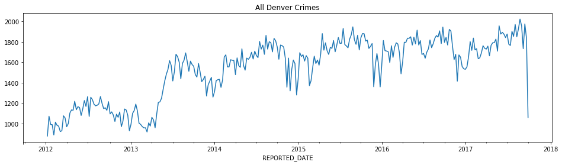
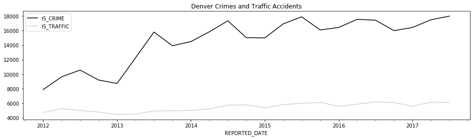

# PRAKTIK BIG DATA PERTEMUAN 13


```python
import pandas as pd
import numpy as np
```


```python
state_fruit = pd.read_csv('data/state_fruit.csv', index_col=0)
state_fruit
```

## Hasil dari source code diatas


<div>
<style scoped>
    .dataframe tbody tr th:only-of-type {
        vertical-align: middle;
    }

    .dataframe tbody tr th {
        vertical-align: top;
    }

    .dataframe thead th {
        text-align: right;
    }
</style>
<table border="1" class="dataframe">
  <thead>
    <tr style="text-align: right;">
      <th></th>
      <th>Apple</th>
      <th>Orange</th>
      <th>Banana</th>
    </tr>
  </thead>
  <tbody>
    <tr>
      <th>Texas</th>
      <td>12</td>
      <td>10</td>
      <td>40</td>
    </tr>
    <tr>
      <th>Arizona</th>
      <td>9</td>
      <td>7</td>
      <td>12</td>
    </tr>
    <tr>
      <th>Florida</th>
      <td>0</td>
      <td>14</td>
      <td>190</td>
    </tr>
  </tbody>
</table>
</div>


```python

```


```python
import pandas as pd
import numpy as np
```


```python
state_fruit = pd.read_csv('data/state_fruit.csv', index_col=0)
state_fruit.stack()
```

## Hasil dari source code diatas


    Texas    Apple      12
             Orange     10
             Banana     40
    Arizona  Apple       9
             Orange      7
             Banana     12
    Florida  Apple       0
             Orange     14
             Banana    190
    dtype: int64


```python

```


```python
import pandas as pd
import numpy as np
```


```python
state_fruit = pd.read_csv('data/state_fruit.csv', index_col=0)
state_fruit_tidy = state_fruit.stack().reset_index()
state_fruit_tidy
```

## Hasil dari source code diatas


<div>
<style scoped>
    .dataframe tbody tr th:only-of-type {
        vertical-align: middle;
    }

    .dataframe tbody tr th {
        vertical-align: top;
    }

    .dataframe thead th {
        text-align: right;
    }
</style>
<table border="1" class="dataframe">
  <thead>
    <tr style="text-align: right;">
      <th></th>
      <th>level_0</th>
      <th>level_1</th>
      <th>0</th>
    </tr>
  </thead>
  <tbody>
    <tr>
      <th>0</th>
      <td>Texas</td>
      <td>Apple</td>
      <td>12</td>
    </tr>
    <tr>
      <th>1</th>
      <td>Texas</td>
      <td>Orange</td>
      <td>10</td>
    </tr>
    <tr>
      <th>2</th>
      <td>Texas</td>
      <td>Banana</td>
      <td>40</td>
    </tr>
    <tr>
      <th>3</th>
      <td>Arizona</td>
      <td>Apple</td>
      <td>9</td>
    </tr>
    <tr>
      <th>4</th>
      <td>Arizona</td>
      <td>Orange</td>
      <td>7</td>
    </tr>
    <tr>
      <th>5</th>
      <td>Arizona</td>
      <td>Banana</td>
      <td>12</td>
    </tr>
    <tr>
      <th>6</th>
      <td>Florida</td>
      <td>Apple</td>
      <td>0</td>
    </tr>
    <tr>
      <th>7</th>
      <td>Florida</td>
      <td>Orange</td>
      <td>14</td>
    </tr>
    <tr>
      <th>8</th>
      <td>Florida</td>
      <td>Banana</td>
      <td>190</td>
    </tr>
  </tbody>
</table>
</div>


```python

```


```python
import pandas as pd
import numpy as np
```


```python
state_fruit = pd.read_csv('data/state_fruit.csv', index_col=0)
state_fruit_tidy.columns = ['state', 'fruit', 'weight']
state_fruit_tidy
```

## Hasil dari source code diatas


<div>
<style scoped>
    .dataframe tbody tr th:only-of-type {
        vertical-align: middle;
    }

    .dataframe tbody tr th {
        vertical-align: top;
    }

    .dataframe thead th {
        text-align: right;
    }
</style>
<table border="1" class="dataframe">
  <thead>
    <tr style="text-align: right;">
      <th></th>
      <th>state</th>
      <th>fruit</th>
      <th>weight</th>
    </tr>
  </thead>
  <tbody>
    <tr>
      <th>0</th>
      <td>Texas</td>
      <td>Apple</td>
      <td>12</td>
    </tr>
    <tr>
      <th>1</th>
      <td>Texas</td>
      <td>Orange</td>
      <td>10</td>
    </tr>
    <tr>
      <th>2</th>
      <td>Texas</td>
      <td>Banana</td>
      <td>40</td>
    </tr>
    <tr>
      <th>3</th>
      <td>Arizona</td>
      <td>Apple</td>
      <td>9</td>
    </tr>
    <tr>
      <th>4</th>
      <td>Arizona</td>
      <td>Orange</td>
      <td>7</td>
    </tr>
    <tr>
      <th>5</th>
      <td>Arizona</td>
      <td>Banana</td>
      <td>12</td>
    </tr>
    <tr>
      <th>6</th>
      <td>Florida</td>
      <td>Apple</td>
      <td>0</td>
    </tr>
    <tr>
      <th>7</th>
      <td>Florida</td>
      <td>Orange</td>
      <td>14</td>
    </tr>
    <tr>
      <th>8</th>
      <td>Florida</td>
      <td>Banana</td>
      <td>190</td>
    </tr>
  </tbody>
</table>
</div>


```python

```


```python
import pandas as pd
import numpy as np
```


```python
state_fruit = pd.read_csv('data/state_fruit.csv', index_col=0)
state_fruit.stack()\
           .rename_axis(['state', 'fruit'])\
```

## Hasil dari source code diatas


    state    fruit 
    Texas    Apple      12
             Orange     10
             Banana     40
    Arizona  Apple       9
             Orange      7
             Banana     12
    Florida  Apple       0
             Orange     14
             Banana    190
    dtype: int64


```python

```


```python
import pandas as pd
import numpy as np
```


```python
state_fruit = pd.read_csv('data/state_fruit.csv', index_col=0)
state_fruit.stack()\
           .rename_axis(['state', 'fruit'])\
           .reset_index(name='weight')
```

## Hasil dari source code diatas


<div>
<style scoped>
    .dataframe tbody tr th:only-of-type {
        vertical-align: middle;
    }

    .dataframe tbody tr th {
        vertical-align: top;
    }

    .dataframe thead th {
        text-align: right;
    }
</style>
<table border="1" class="dataframe">
  <thead>
    <tr style="text-align: right;">
      <th></th>
      <th>state</th>
      <th>fruit</th>
      <th>weight</th>
    </tr>
  </thead>
  <tbody>
    <tr>
      <th>0</th>
      <td>Texas</td>
      <td>Apple</td>
      <td>12</td>
    </tr>
    <tr>
      <th>1</th>
      <td>Texas</td>
      <td>Orange</td>
      <td>10</td>
    </tr>
    <tr>
      <th>2</th>
      <td>Texas</td>
      <td>Banana</td>
      <td>40</td>
    </tr>
    <tr>
      <th>3</th>
      <td>Arizona</td>
      <td>Apple</td>
      <td>9</td>
    </tr>
    <tr>
      <th>4</th>
      <td>Arizona</td>
      <td>Orange</td>
      <td>7</td>
    </tr>
    <tr>
      <th>5</th>
      <td>Arizona</td>
      <td>Banana</td>
      <td>12</td>
    </tr>
    <tr>
      <th>6</th>
      <td>Florida</td>
      <td>Apple</td>
      <td>0</td>
    </tr>
    <tr>
      <th>7</th>
      <td>Florida</td>
      <td>Orange</td>
      <td>14</td>
    </tr>
    <tr>
      <th>8</th>
      <td>Florida</td>
      <td>Banana</td>
      <td>190</td>
    </tr>
  </tbody>
</table>
</div>


```python

```


```python
import pandas as pd
import numpy as np
```


```python
state_fruit2 = pd.read_csv('data/state_fruit2.csv')
state_fruit2
```

## Hasil dari source code diatas


<div>
<style scoped>
    .dataframe tbody tr th:only-of-type {
        vertical-align: middle;
    }

    .dataframe tbody tr th {
        vertical-align: top;
    }

    .dataframe thead th {
        text-align: right;
    }
</style>
<table border="1" class="dataframe">
  <thead>
    <tr style="text-align: right;">
      <th></th>
      <th>State</th>
      <th>Apple</th>
      <th>Orange</th>
      <th>Banana</th>
    </tr>
  </thead>
  <tbody>
    <tr>
      <th>0</th>
      <td>Texas</td>
      <td>12</td>
      <td>10</td>
      <td>40</td>
    </tr>
    <tr>
      <th>1</th>
      <td>Arizona</td>
      <td>9</td>
      <td>7</td>
      <td>12</td>
    </tr>
    <tr>
      <th>2</th>
      <td>Florida</td>
      <td>0</td>
      <td>14</td>
      <td>190</td>
    </tr>
  </tbody>
</table>
</div>


```python

```


```python
import pandas as pd
import numpy as np
```


```python
state_fruit2 = pd.read_csv('data/state_fruit2.csv')
state_fruit2.stack()
```

## Hasil dari source code diatas


    0  State       Texas
       Apple          12
       Orange         10
       Banana         40
    1  State     Arizona
       Apple           9
       Orange          7
       Banana         12
    2  State     Florida
       Apple           0
       Orange         14
       Banana        190
    dtype: object


```python

```


```python
import pandas as pd
import numpy as np
```


```python
state_fruit2 = pd.read_csv('data/state_fruit2.csv')
state_fruit2.set_index('State').stack()
```

## Hasil dari source code diatas


    State          
    Texas    Apple      12
             Orange     10
             Banana     40
    Arizona  Apple       9
             Orange      7
             Banana     12
    Florida  Apple       0
             Orange     14
             Banana    190
    dtype: int64


```python

```


```python
import pandas as pd
import numpy as np
```


```python
state_fruit2 = pd.read_csv('data/state_fruit2.csv')
state_fruit2
```

## Hasil dari source code diatas


<div>
<style scoped>
    .dataframe tbody tr th:only-of-type {
        vertical-align: middle;
    }

    .dataframe tbody tr th {
        vertical-align: top;
    }

    .dataframe thead th {
        text-align: right;
    }
</style>
<table border="1" class="dataframe">
  <thead>
    <tr style="text-align: right;">
      <th></th>
      <th>State</th>
      <th>Apple</th>
      <th>Orange</th>
      <th>Banana</th>
    </tr>
  </thead>
  <tbody>
    <tr>
      <th>0</th>
      <td>Texas</td>
      <td>12</td>
      <td>10</td>
      <td>40</td>
    </tr>
    <tr>
      <th>1</th>
      <td>Arizona</td>
      <td>9</td>
      <td>7</td>
      <td>12</td>
    </tr>
    <tr>
      <th>2</th>
      <td>Florida</td>
      <td>0</td>
      <td>14</td>
      <td>190</td>
    </tr>
  </tbody>
</table>
</div>


```python

```


```python
import pandas as pd
import numpy as np
```


```python
state_fruit2 = pd.read_csv('data/state_fruit2.csv')
state_fruit2.melt(id_vars=['State'],
                 value_vars=['Apple', 'Orange', 'Banana'])
```

## Hasil dari source code diatas


<div>
<style scoped>
    .dataframe tbody tr th:only-of-type {
        vertical-align: middle;
    }

    .dataframe tbody tr th {
        vertical-align: top;
    }

    .dataframe thead th {
        text-align: right;
    }
</style>
<table border="1" class="dataframe">
  <thead>
    <tr style="text-align: right;">
      <th></th>
      <th>State</th>
      <th>variable</th>
      <th>value</th>
    </tr>
  </thead>
  <tbody>
    <tr>
      <th>0</th>
      <td>Texas</td>
      <td>Apple</td>
      <td>12</td>
    </tr>
    <tr>
      <th>1</th>
      <td>Arizona</td>
      <td>Apple</td>
      <td>9</td>
    </tr>
    <tr>
      <th>2</th>
      <td>Florida</td>
      <td>Apple</td>
      <td>0</td>
    </tr>
    <tr>
      <th>3</th>
      <td>Texas</td>
      <td>Orange</td>
      <td>10</td>
    </tr>
    <tr>
      <th>4</th>
      <td>Arizona</td>
      <td>Orange</td>
      <td>7</td>
    </tr>
    <tr>
      <th>5</th>
      <td>Florida</td>
      <td>Orange</td>
      <td>14</td>
    </tr>
    <tr>
      <th>6</th>
      <td>Texas</td>
      <td>Banana</td>
      <td>40</td>
    </tr>
    <tr>
      <th>7</th>
      <td>Arizona</td>
      <td>Banana</td>
      <td>12</td>
    </tr>
    <tr>
      <th>8</th>
      <td>Florida</td>
      <td>Banana</td>
      <td>190</td>
    </tr>
  </tbody>
</table>
</div>


```python

```


```python
import pandas as pd
import numpy as np
```


```python
state_fruit2 = pd.read_csv('data/state_fruit2.csv')
state_fruit2.index=list('abc')
state_fruit2.index.name = 'letter'
state_fruit2
```

## Hasil dari source code diatas


<div>
<style scoped>
    .dataframe tbody tr th:only-of-type {
        vertical-align: middle;
    }

    .dataframe tbody tr th {
        vertical-align: top;
    }

    .dataframe thead th {
        text-align: right;
    }
</style>
<table border="1" class="dataframe">
  <thead>
    <tr style="text-align: right;">
      <th></th>
      <th>State</th>
      <th>Apple</th>
      <th>Orange</th>
      <th>Banana</th>
    </tr>
    <tr>
      <th>letter</th>
      <th></th>
      <th></th>
      <th></th>
      <th></th>
    </tr>
  </thead>
  <tbody>
    <tr>
      <th>a</th>
      <td>Texas</td>
      <td>12</td>
      <td>10</td>
      <td>40</td>
    </tr>
    <tr>
      <th>b</th>
      <td>Arizona</td>
      <td>9</td>
      <td>7</td>
      <td>12</td>
    </tr>
    <tr>
      <th>c</th>
      <td>Florida</td>
      <td>0</td>
      <td>14</td>
      <td>190</td>
    </tr>
  </tbody>
</table>
</div>


```python

```


```python
import pandas as pd
import numpy as np
```


```python
state_fruit2 = pd.read_csv('data/state_fruit2.csv')
state_fruit2.melt(id_vars=['State'],
                 value_vars=['Apple', 'Orange', 'Banana'],
                 var_name='Fruit',
                 value_name='Weight')
```

## Hasil dari source code diatas


<div>
<style scoped>
    .dataframe tbody tr th:only-of-type {
        vertical-align: middle;
    }

    .dataframe tbody tr th {
        vertical-align: top;
    }

    .dataframe thead th {
        text-align: right;
    }
</style>
<table border="1" class="dataframe">
  <thead>
    <tr style="text-align: right;">
      <th></th>
      <th>State</th>
      <th>Fruit</th>
      <th>Weight</th>
    </tr>
  </thead>
  <tbody>
    <tr>
      <th>0</th>
      <td>Texas</td>
      <td>Apple</td>
      <td>12</td>
    </tr>
    <tr>
      <th>1</th>
      <td>Arizona</td>
      <td>Apple</td>
      <td>9</td>
    </tr>
    <tr>
      <th>2</th>
      <td>Florida</td>
      <td>Apple</td>
      <td>0</td>
    </tr>
    <tr>
      <th>3</th>
      <td>Texas</td>
      <td>Orange</td>
      <td>10</td>
    </tr>
    <tr>
      <th>4</th>
      <td>Arizona</td>
      <td>Orange</td>
      <td>7</td>
    </tr>
    <tr>
      <th>5</th>
      <td>Florida</td>
      <td>Orange</td>
      <td>14</td>
    </tr>
    <tr>
      <th>6</th>
      <td>Texas</td>
      <td>Banana</td>
      <td>40</td>
    </tr>
    <tr>
      <th>7</th>
      <td>Arizona</td>
      <td>Banana</td>
      <td>12</td>
    </tr>
    <tr>
      <th>8</th>
      <td>Florida</td>
      <td>Banana</td>
      <td>190</td>
    </tr>
  </tbody>
</table>
</div>


```python

```


```python
import pandas as pd
import numpy as np
```


```python
state_fruit2 = pd.read_csv('data/state_fruit2.csv')
state_fruit2.melt(id_vars=['State'],
                 value_vars=['Apple', 'Orange', 'Banana'],
                 var_name='Fruit',
                 value_name='Weight')
```

## Hasil dari source code diatas


<div>
<style scoped>
    .dataframe tbody tr th:only-of-type {
        vertical-align: middle;
    }

    .dataframe tbody tr th {
        vertical-align: top;
    }

    .dataframe thead th {
        text-align: right;
    }
</style>
<table border="1" class="dataframe">
  <thead>
    <tr style="text-align: right;">
      <th></th>
      <th>State</th>
      <th>Fruit</th>
      <th>Weight</th>
    </tr>
  </thead>
  <tbody>
    <tr>
      <th>0</th>
      <td>Texas</td>
      <td>Apple</td>
      <td>12</td>
    </tr>
    <tr>
      <th>1</th>
      <td>Arizona</td>
      <td>Apple</td>
      <td>9</td>
    </tr>
    <tr>
      <th>2</th>
      <td>Florida</td>
      <td>Apple</td>
      <td>0</td>
    </tr>
    <tr>
      <th>3</th>
      <td>Texas</td>
      <td>Orange</td>
      <td>10</td>
    </tr>
    <tr>
      <th>4</th>
      <td>Arizona</td>
      <td>Orange</td>
      <td>7</td>
    </tr>
    <tr>
      <th>5</th>
      <td>Florida</td>
      <td>Orange</td>
      <td>14</td>
    </tr>
    <tr>
      <th>6</th>
      <td>Texas</td>
      <td>Banana</td>
      <td>40</td>
    </tr>
    <tr>
      <th>7</th>
      <td>Arizona</td>
      <td>Banana</td>
      <td>12</td>
    </tr>
    <tr>
      <th>8</th>
      <td>Florida</td>
      <td>Banana</td>
      <td>190</td>
    </tr>
  </tbody>
</table>
</div>


```python

```


```python
import pandas as pd
import numpy as np
```


```python
state_fruit2 = pd.read_csv('data/state_fruit2.csv')
state_fruit2.melt()
```

## Hasil source code diatas


<div>
<style scoped>
    .dataframe tbody tr th:only-of-type {
        vertical-align: middle;
    }

    .dataframe tbody tr th {
        vertical-align: top;
    }

    .dataframe thead th {
        text-align: right;
    }
</style>
<table border="1" class="dataframe">
  <thead>
    <tr style="text-align: right;">
      <th></th>
      <th>variable</th>
      <th>value</th>
    </tr>
  </thead>
  <tbody>
    <tr>
      <th>0</th>
      <td>State</td>
      <td>Texas</td>
    </tr>
    <tr>
      <th>1</th>
      <td>State</td>
      <td>Arizona</td>
    </tr>
    <tr>
      <th>2</th>
      <td>State</td>
      <td>Florida</td>
    </tr>
    <tr>
      <th>3</th>
      <td>Apple</td>
      <td>12</td>
    </tr>
    <tr>
      <th>4</th>
      <td>Apple</td>
      <td>9</td>
    </tr>
    <tr>
      <th>5</th>
      <td>Apple</td>
      <td>0</td>
    </tr>
    <tr>
      <th>6</th>
      <td>Orange</td>
      <td>10</td>
    </tr>
    <tr>
      <th>7</th>
      <td>Orange</td>
      <td>7</td>
    </tr>
    <tr>
      <th>8</th>
      <td>Orange</td>
      <td>14</td>
    </tr>
    <tr>
      <th>9</th>
      <td>Banana</td>
      <td>40</td>
    </tr>
    <tr>
      <th>10</th>
      <td>Banana</td>
      <td>12</td>
    </tr>
    <tr>
      <th>11</th>
      <td>Banana</td>
      <td>190</td>
    </tr>
  </tbody>
</table>
</div>


```python

```


```python
import pandas as pd
import numpy as np
```


```python
state_fruit2 = pd.read_csv('data/state_fruit2.csv')
state_fruit2.melt(id_vars='State')
```

## Hasil dari code diatas


<div>
<style scoped>
    .dataframe tbody tr th:only-of-type {
        vertical-align: middle;
    }

    .dataframe tbody tr th {
        vertical-align: top;
    }

    .dataframe thead th {
        text-align: right;
    }
</style>
<table border="1" class="dataframe">
  <thead>
    <tr style="text-align: right;">
      <th></th>
      <th>State</th>
      <th>variable</th>
      <th>value</th>
    </tr>
  </thead>
  <tbody>
    <tr>
      <th>0</th>
      <td>Texas</td>
      <td>Apple</td>
      <td>12</td>
    </tr>
    <tr>
      <th>1</th>
      <td>Arizona</td>
      <td>Apple</td>
      <td>9</td>
    </tr>
    <tr>
      <th>2</th>
      <td>Florida</td>
      <td>Apple</td>
      <td>0</td>
    </tr>
    <tr>
      <th>3</th>
      <td>Texas</td>
      <td>Orange</td>
      <td>10</td>
    </tr>
    <tr>
      <th>4</th>
      <td>Arizona</td>
      <td>Orange</td>
      <td>7</td>
    </tr>
    <tr>
      <th>5</th>
      <td>Florida</td>
      <td>Orange</td>
      <td>14</td>
    </tr>
    <tr>
      <th>6</th>
      <td>Texas</td>
      <td>Banana</td>
      <td>40</td>
    </tr>
    <tr>
      <th>7</th>
      <td>Arizona</td>
      <td>Banana</td>
      <td>12</td>
    </tr>
    <tr>
      <th>8</th>
      <td>Florida</td>
      <td>Banana</td>
      <td>190</td>
    </tr>
  </tbody>
</table>
</div>


```python

```


```python
import pandas as pd
import numpy as np
```


```python
movie = pd.read_csv('data/movie.csv')
actor = movie[['movie_title', 'actor_1_name', 'actor_2_name', 'actor_3_name', 
               'actor_1_facebook_likes', 'actor_2_facebook_likes', 'actor_3_facebook_likes']]
actor.head()
```

## Hasil dari source code diatas


<div>
<style scoped>
    .dataframe tbody tr th:only-of-type {
        vertical-align: middle;
    }

    .dataframe tbody tr th {
        vertical-align: top;
    }

    .dataframe thead th {
        text-align: right;
    }
</style>
<table border="1" class="dataframe">
  <thead>
    <tr style="text-align: right;">
      <th></th>
      <th>movie_title</th>
      <th>actor_1_name</th>
      <th>actor_2_name</th>
      <th>actor_3_name</th>
      <th>actor_1_facebook_likes</th>
      <th>actor_2_facebook_likes</th>
      <th>actor_3_facebook_likes</th>
    </tr>
  </thead>
  <tbody>
    <tr>
      <th>0</th>
      <td>Avatar</td>
      <td>CCH Pounder</td>
      <td>Joel David Moore</td>
      <td>Wes Studi</td>
      <td>1000.0</td>
      <td>936.0</td>
      <td>855.0</td>
    </tr>
    <tr>
      <th>1</th>
      <td>Pirates of the Caribbean: At World's End</td>
      <td>Johnny Depp</td>
      <td>Orlando Bloom</td>
      <td>Jack Davenport</td>
      <td>40000.0</td>
      <td>5000.0</td>
      <td>1000.0</td>
    </tr>
    <tr>
      <th>2</th>
      <td>Spectre</td>
      <td>Christoph Waltz</td>
      <td>Rory Kinnear</td>
      <td>Stephanie Sigman</td>
      <td>11000.0</td>
      <td>393.0</td>
      <td>161.0</td>
    </tr>
    <tr>
      <th>3</th>
      <td>The Dark Knight Rises</td>
      <td>Tom Hardy</td>
      <td>Christian Bale</td>
      <td>Joseph Gordon-Levitt</td>
      <td>27000.0</td>
      <td>23000.0</td>
      <td>23000.0</td>
    </tr>
    <tr>
      <th>4</th>
      <td>Star Wars: Episode VII - The Force Awakens</td>
      <td>Doug Walker</td>
      <td>Rob Walker</td>
      <td>NaN</td>
      <td>131.0</td>
      <td>12.0</td>
      <td>NaN</td>
    </tr>
  </tbody>
</table>
</div>


```python

```


```python
import pandas as pd
import numpy as np
```


```python
movie = pd.read_csv('data/movie.csv')
def change_col_name(col_name):
    col_name = col_name.replace('_name', '')
    if 'facebook' in col_name:
        fb_idx = col_name.find('facebook')
        col_name = col_name[:5] + col_name[fb_idx - 1:] + col_name[5:fb_idx-1]
    return col_name
```


```python
actor2 = actor.rename(columns=change_col_name)
actor2.head()
```

## Hasil dari source code diatas


<div>
<style scoped>
    .dataframe tbody tr th:only-of-type {
        vertical-align: middle;
    }

    .dataframe tbody tr th {
        vertical-align: top;
    }

    .dataframe thead th {
        text-align: right;
    }
</style>
<table border="1" class="dataframe">
  <thead>
    <tr style="text-align: right;">
      <th></th>
      <th>movie_title</th>
      <th>actor_1</th>
      <th>actor_2</th>
      <th>actor_3</th>
      <th>actor_facebook_likes_1</th>
      <th>actor_facebook_likes_2</th>
      <th>actor_facebook_likes_3</th>
    </tr>
  </thead>
  <tbody>
    <tr>
      <th>0</th>
      <td>Avatar</td>
      <td>CCH Pounder</td>
      <td>Joel David Moore</td>
      <td>Wes Studi</td>
      <td>1000.0</td>
      <td>936.0</td>
      <td>855.0</td>
    </tr>
    <tr>
      <th>1</th>
      <td>Pirates of the Caribbean: At World's End</td>
      <td>Johnny Depp</td>
      <td>Orlando Bloom</td>
      <td>Jack Davenport</td>
      <td>40000.0</td>
      <td>5000.0</td>
      <td>1000.0</td>
    </tr>
    <tr>
      <th>2</th>
      <td>Spectre</td>
      <td>Christoph Waltz</td>
      <td>Rory Kinnear</td>
      <td>Stephanie Sigman</td>
      <td>11000.0</td>
      <td>393.0</td>
      <td>161.0</td>
    </tr>
    <tr>
      <th>3</th>
      <td>The Dark Knight Rises</td>
      <td>Tom Hardy</td>
      <td>Christian Bale</td>
      <td>Joseph Gordon-Levitt</td>
      <td>27000.0</td>
      <td>23000.0</td>
      <td>23000.0</td>
    </tr>
    <tr>
      <th>4</th>
      <td>Star Wars: Episode VII - The Force Awakens</td>
      <td>Doug Walker</td>
      <td>Rob Walker</td>
      <td>NaN</td>
      <td>131.0</td>
      <td>12.0</td>
      <td>NaN</td>
    </tr>
  </tbody>
</table>
</div>


```python

```


```python
import pandas as pd
import numpy as np
```


```python
movie = pd.read_csv('data/movie.csv')
stubs = ['actor', 'actor_facebook_likes']
actor2_tidy = pd.wide_to_long(actor2, 
                              stubnames=stubs, 
                              i=['movie_title'], 
                              j='actor_num', 
                              sep='_').reset_index()
actor2_tidy.head()
```

## Hasil dari source code diatas


<div>
<style scoped>
    .dataframe tbody tr th:only-of-type {
        vertical-align: middle;
    }

    .dataframe tbody tr th {
        vertical-align: top;
    }

    .dataframe thead th {
        text-align: right;
    }
</style>
<table border="1" class="dataframe">
  <thead>
    <tr style="text-align: right;">
      <th></th>
      <th>movie_title</th>
      <th>actor_num</th>
      <th>actor</th>
      <th>actor_facebook_likes</th>
    </tr>
  </thead>
  <tbody>
    <tr>
      <th>0</th>
      <td>Avatar</td>
      <td>1</td>
      <td>CCH Pounder</td>
      <td>1000.0</td>
    </tr>
    <tr>
      <th>1</th>
      <td>Pirates of the Caribbean: At World's End</td>
      <td>1</td>
      <td>Johnny Depp</td>
      <td>40000.0</td>
    </tr>
    <tr>
      <th>2</th>
      <td>Spectre</td>
      <td>1</td>
      <td>Christoph Waltz</td>
      <td>11000.0</td>
    </tr>
    <tr>
      <th>3</th>
      <td>The Dark Knight Rises</td>
      <td>1</td>
      <td>Tom Hardy</td>
      <td>27000.0</td>
    </tr>
    <tr>
      <th>4</th>
      <td>Star Wars: Episode VII - The Force Awakens</td>
      <td>1</td>
      <td>Doug Walker</td>
      <td>131.0</td>
    </tr>
  </tbody>
</table>
</div>


```python

```


```python
import pandas as pd
import numpy as np
```


```python
df = pd.read_csv('data/stackme.csv')
df
```

## Hasil dari source code diatas


<div>
<style scoped>
    .dataframe tbody tr th:only-of-type {
        vertical-align: middle;
    }

    .dataframe tbody tr th {
        vertical-align: top;
    }

    .dataframe thead th {
        text-align: right;
    }
</style>
<table border="1" class="dataframe">
  <thead>
    <tr style="text-align: right;">
      <th></th>
      <th>State</th>
      <th>Country</th>
      <th>a1</th>
      <th>b2</th>
      <th>Test</th>
      <th>d</th>
      <th>e</th>
    </tr>
  </thead>
  <tbody>
    <tr>
      <th>0</th>
      <td>TX</td>
      <td>US</td>
      <td>0.45</td>
      <td>0.3</td>
      <td>Test1</td>
      <td>2</td>
      <td>6</td>
    </tr>
    <tr>
      <th>1</th>
      <td>MA</td>
      <td>US</td>
      <td>0.03</td>
      <td>1.2</td>
      <td>Test2</td>
      <td>9</td>
      <td>7</td>
    </tr>
    <tr>
      <th>2</th>
      <td>ON</td>
      <td>CAN</td>
      <td>0.70</td>
      <td>4.2</td>
      <td>Test3</td>
      <td>4</td>
      <td>2</td>
    </tr>
  </tbody>
</table>
</div>


```python

```


```python
import pandas as pd
import numpy as np
```


```python
df = pd.read_csv('data/stackme.csv')
df2 = df.rename(columns = {'a1':'group1_a1', 'b2':'group1_b2',
                           'd':'group2_a1', 'e':'group2_b2'})
df2
```

## Hasil source code diatas


<div>
<style scoped>
    .dataframe tbody tr th:only-of-type {
        vertical-align: middle;
    }

    .dataframe tbody tr th {
        vertical-align: top;
    }

    .dataframe thead th {
        text-align: right;
    }
</style>
<table border="1" class="dataframe">
  <thead>
    <tr style="text-align: right;">
      <th></th>
      <th>State</th>
      <th>Country</th>
      <th>group1_a1</th>
      <th>group1_b2</th>
      <th>Test</th>
      <th>group2_a1</th>
      <th>group2_b2</th>
    </tr>
  </thead>
  <tbody>
    <tr>
      <th>0</th>
      <td>TX</td>
      <td>US</td>
      <td>0.45</td>
      <td>0.3</td>
      <td>Test1</td>
      <td>2</td>
      <td>6</td>
    </tr>
    <tr>
      <th>1</th>
      <td>MA</td>
      <td>US</td>
      <td>0.03</td>
      <td>1.2</td>
      <td>Test2</td>
      <td>9</td>
      <td>7</td>
    </tr>
    <tr>
      <th>2</th>
      <td>ON</td>
      <td>CAN</td>
      <td>0.70</td>
      <td>4.2</td>
      <td>Test3</td>
      <td>4</td>
      <td>2</td>
    </tr>
  </tbody>
</table>
</div>


```python

```


```python
import pandas as pd
import numpy as np
```


```python
df = pd.read_csv('data/stackme.csv')
df2 = df.rename(columns = {'a1':'group1_a1', 'b2':'group1_b2',
                           'd':'group2_a1', 'e':'group2_b2'})
pd.wide_to_long(df2, 
                stubnames=['group1', 'group2'], 
                i=['State', 'Country', 'Test'], 
                j='Label', 
                suffix='.+', 
                sep='_')
```

## Hasil dari source code diatas


<div>
<style scoped>
    .dataframe tbody tr th:only-of-type {
        vertical-align: middle;
    }

    .dataframe tbody tr th {
        vertical-align: top;
    }

    .dataframe thead th {
        text-align: right;
    }
</style>
<table border="1" class="dataframe">
  <thead>
    <tr style="text-align: right;">
      <th></th>
      <th></th>
      <th></th>
      <th></th>
      <th>group1</th>
      <th>group2</th>
    </tr>
    <tr>
      <th>State</th>
      <th>Country</th>
      <th>Test</th>
      <th>Label</th>
      <th></th>
      <th></th>
    </tr>
  </thead>
  <tbody>
    <tr>
      <th rowspan="2" valign="top">TX</th>
      <th rowspan="2" valign="top">US</th>
      <th rowspan="2" valign="top">Test1</th>
      <th>a1</th>
      <td>0.45</td>
      <td>2</td>
    </tr>
    <tr>
      <th>b2</th>
      <td>0.30</td>
      <td>6</td>
    </tr>
    <tr>
      <th rowspan="2" valign="top">MA</th>
      <th rowspan="2" valign="top">US</th>
      <th rowspan="2" valign="top">Test2</th>
      <th>a1</th>
      <td>0.03</td>
      <td>9</td>
    </tr>
    <tr>
      <th>b2</th>
      <td>1.20</td>
      <td>7</td>
    </tr>
    <tr>
      <th rowspan="2" valign="top">ON</th>
      <th rowspan="2" valign="top">CAN</th>
      <th rowspan="2" valign="top">Test3</th>
      <th>a1</th>
      <td>0.70</td>
      <td>4</td>
    </tr>
    <tr>
      <th>b2</th>
      <td>4.20</td>
      <td>2</td>
    </tr>
  </tbody>
</table>
</div>


```python

```


```python
import pandas as pd
import numpy as np
```


```python
usecol_func = lambda x: 'UGDS_' in x or x == 'INSTNM'
college = pd.read_csv('data/college.csv', 
                          index_col='INSTNM', 
                          usecols=usecol_func)
college.head()
```

## Hasil dari source code diatas


<div>
<style scoped>
    .dataframe tbody tr th:only-of-type {
        vertical-align: middle;
    }

    .dataframe tbody tr th {
        vertical-align: top;
    }

    .dataframe thead th {
        text-align: right;
    }
</style>
<table border="1" class="dataframe">
  <thead>
    <tr style="text-align: right;">
      <th></th>
      <th>UGDS_WHITE</th>
      <th>UGDS_BLACK</th>
      <th>UGDS_HISP</th>
      <th>UGDS_ASIAN</th>
      <th>UGDS_AIAN</th>
      <th>UGDS_NHPI</th>
      <th>UGDS_2MOR</th>
      <th>UGDS_NRA</th>
      <th>UGDS_UNKN</th>
    </tr>
    <tr>
      <th>INSTNM</th>
      <th></th>
      <th></th>
      <th></th>
      <th></th>
      <th></th>
      <th></th>
      <th></th>
      <th></th>
      <th></th>
    </tr>
  </thead>
  <tbody>
    <tr>
      <th>Alabama A &amp; M University</th>
      <td>0.0333</td>
      <td>0.9353</td>
      <td>0.0055</td>
      <td>0.0019</td>
      <td>0.0024</td>
      <td>0.0019</td>
      <td>0.0000</td>
      <td>0.0059</td>
      <td>0.0138</td>
    </tr>
    <tr>
      <th>University of Alabama at Birmingham</th>
      <td>0.5922</td>
      <td>0.2600</td>
      <td>0.0283</td>
      <td>0.0518</td>
      <td>0.0022</td>
      <td>0.0007</td>
      <td>0.0368</td>
      <td>0.0179</td>
      <td>0.0100</td>
    </tr>
    <tr>
      <th>Amridge University</th>
      <td>0.2990</td>
      <td>0.4192</td>
      <td>0.0069</td>
      <td>0.0034</td>
      <td>0.0000</td>
      <td>0.0000</td>
      <td>0.0000</td>
      <td>0.0000</td>
      <td>0.2715</td>
    </tr>
    <tr>
      <th>University of Alabama in Huntsville</th>
      <td>0.6988</td>
      <td>0.1255</td>
      <td>0.0382</td>
      <td>0.0376</td>
      <td>0.0143</td>
      <td>0.0002</td>
      <td>0.0172</td>
      <td>0.0332</td>
      <td>0.0350</td>
    </tr>
    <tr>
      <th>Alabama State University</th>
      <td>0.0158</td>
      <td>0.9208</td>
      <td>0.0121</td>
      <td>0.0019</td>
      <td>0.0010</td>
      <td>0.0006</td>
      <td>0.0098</td>
      <td>0.0243</td>
      <td>0.0137</td>
    </tr>
  </tbody>
</table>
</div>


```python

```


```python
import pandas as pd
import numpy as np
```


```python
usecol_func = lambda x: 'UGDS_' in x or x == 'INSTNM'
college = pd.read_csv('data/college.csv', 
                          index_col='INSTNM', 
                          usecols=usecol_func)
college_stacked = college.stack()
college_stacked.head(18)
```

## Hasil dari source code diatas


    INSTNM                                         
    Alabama A & M University             UGDS_WHITE    0.0333
                                         UGDS_BLACK    0.9353
                                         UGDS_HISP     0.0055
                                         UGDS_ASIAN    0.0019
                                         UGDS_AIAN     0.0024
                                         UGDS_NHPI     0.0019
                                         UGDS_2MOR     0.0000
                                         UGDS_NRA      0.0059
                                         UGDS_UNKN     0.0138
    University of Alabama at Birmingham  UGDS_WHITE    0.5922
                                         UGDS_BLACK    0.2600
                                         UGDS_HISP     0.0283
                                         UGDS_ASIAN    0.0518
                                         UGDS_AIAN     0.0022
                                         UGDS_NHPI     0.0007
                                         UGDS_2MOR     0.0368
                                         UGDS_NRA      0.0179
                                         UGDS_UNKN     0.0100
    dtype: float64


```python

```


```python
import pandas as pd
import numpy as np
```


```python
usecol_func = lambda x: 'UGDS_' in x or x == 'INSTNM'
college = pd.read_csv('data/college.csv', 
                          index_col='INSTNM', 
                          usecols=usecol_func)
college_stacked.unstack().head()
```

## Hasil dari source code diatas


<div>
<style scoped>
    .dataframe tbody tr th:only-of-type {
        vertical-align: middle;
    }

    .dataframe tbody tr th {
        vertical-align: top;
    }

    .dataframe thead th {
        text-align: right;
    }
</style>
<table border="1" class="dataframe">
  <thead>
    <tr style="text-align: right;">
      <th></th>
      <th>UGDS_WHITE</th>
      <th>UGDS_BLACK</th>
      <th>UGDS_HISP</th>
      <th>UGDS_ASIAN</th>
      <th>UGDS_AIAN</th>
      <th>UGDS_NHPI</th>
      <th>UGDS_2MOR</th>
      <th>UGDS_NRA</th>
      <th>UGDS_UNKN</th>
    </tr>
    <tr>
      <th>INSTNM</th>
      <th></th>
      <th></th>
      <th></th>
      <th></th>
      <th></th>
      <th></th>
      <th></th>
      <th></th>
      <th></th>
    </tr>
  </thead>
  <tbody>
    <tr>
      <th>Alabama A &amp; M University</th>
      <td>0.0333</td>
      <td>0.9353</td>
      <td>0.0055</td>
      <td>0.0019</td>
      <td>0.0024</td>
      <td>0.0019</td>
      <td>0.0000</td>
      <td>0.0059</td>
      <td>0.0138</td>
    </tr>
    <tr>
      <th>University of Alabama at Birmingham</th>
      <td>0.5922</td>
      <td>0.2600</td>
      <td>0.0283</td>
      <td>0.0518</td>
      <td>0.0022</td>
      <td>0.0007</td>
      <td>0.0368</td>
      <td>0.0179</td>
      <td>0.0100</td>
    </tr>
    <tr>
      <th>Amridge University</th>
      <td>0.2990</td>
      <td>0.4192</td>
      <td>0.0069</td>
      <td>0.0034</td>
      <td>0.0000</td>
      <td>0.0000</td>
      <td>0.0000</td>
      <td>0.0000</td>
      <td>0.2715</td>
    </tr>
    <tr>
      <th>University of Alabama in Huntsville</th>
      <td>0.6988</td>
      <td>0.1255</td>
      <td>0.0382</td>
      <td>0.0376</td>
      <td>0.0143</td>
      <td>0.0002</td>
      <td>0.0172</td>
      <td>0.0332</td>
      <td>0.0350</td>
    </tr>
    <tr>
      <th>Alabama State University</th>
      <td>0.0158</td>
      <td>0.9208</td>
      <td>0.0121</td>
      <td>0.0019</td>
      <td>0.0010</td>
      <td>0.0006</td>
      <td>0.0098</td>
      <td>0.0243</td>
      <td>0.0137</td>
    </tr>
  </tbody>
</table>
</div>


```python

```


```python
import pandas as pd
import numpy as np
```


```python
college2 = pd.read_csv('data/college.csv', 
                      usecols=usecol_func)
college2.head()
```

## Hasil dari source code diatas


<div>
<style scoped>
    .dataframe tbody tr th:only-of-type {
        vertical-align: middle;
    }

    .dataframe tbody tr th {
        vertical-align: top;
    }

    .dataframe thead th {
        text-align: right;
    }
</style>
<table border="1" class="dataframe">
  <thead>
    <tr style="text-align: right;">
      <th></th>
      <th>INSTNM</th>
      <th>UGDS_WHITE</th>
      <th>UGDS_BLACK</th>
      <th>UGDS_HISP</th>
      <th>UGDS_ASIAN</th>
      <th>UGDS_AIAN</th>
      <th>UGDS_NHPI</th>
      <th>UGDS_2MOR</th>
      <th>UGDS_NRA</th>
      <th>UGDS_UNKN</th>
    </tr>
  </thead>
  <tbody>
    <tr>
      <th>0</th>
      <td>Alabama A &amp; M University</td>
      <td>0.0333</td>
      <td>0.9353</td>
      <td>0.0055</td>
      <td>0.0019</td>
      <td>0.0024</td>
      <td>0.0019</td>
      <td>0.0000</td>
      <td>0.0059</td>
      <td>0.0138</td>
    </tr>
    <tr>
      <th>1</th>
      <td>University of Alabama at Birmingham</td>
      <td>0.5922</td>
      <td>0.2600</td>
      <td>0.0283</td>
      <td>0.0518</td>
      <td>0.0022</td>
      <td>0.0007</td>
      <td>0.0368</td>
      <td>0.0179</td>
      <td>0.0100</td>
    </tr>
    <tr>
      <th>2</th>
      <td>Amridge University</td>
      <td>0.2990</td>
      <td>0.4192</td>
      <td>0.0069</td>
      <td>0.0034</td>
      <td>0.0000</td>
      <td>0.0000</td>
      <td>0.0000</td>
      <td>0.0000</td>
      <td>0.2715</td>
    </tr>
    <tr>
      <th>3</th>
      <td>University of Alabama in Huntsville</td>
      <td>0.6988</td>
      <td>0.1255</td>
      <td>0.0382</td>
      <td>0.0376</td>
      <td>0.0143</td>
      <td>0.0002</td>
      <td>0.0172</td>
      <td>0.0332</td>
      <td>0.0350</td>
    </tr>
    <tr>
      <th>4</th>
      <td>Alabama State University</td>
      <td>0.0158</td>
      <td>0.9208</td>
      <td>0.0121</td>
      <td>0.0019</td>
      <td>0.0010</td>
      <td>0.0006</td>
      <td>0.0098</td>
      <td>0.0243</td>
      <td>0.0137</td>
    </tr>
  </tbody>
</table>
</div>


```python

```


```python
import pandas as pd
import numpy as np
```


```python
usecol_func = lambda x: 'UGDS_' in x or x == 'INSTNM'
college2 = pd.read_csv('data/college.csv', 
                      usecols=usecol_func)
college_melted = college2.melt(id_vars='INSTNM', 
                               var_name='Race',
                               value_name='Percentage')
college_melted.head()
```


<div>
<style scoped>
    .dataframe tbody tr th:only-of-type {
        vertical-align: middle;
    }

    .dataframe tbody tr th {
        vertical-align: top;
    }

    .dataframe thead th {
        text-align: right;
    }
</style>
<table border="1" class="dataframe">
  <thead>
    <tr style="text-align: right;">
      <th></th>
      <th>INSTNM</th>
      <th>Race</th>
      <th>Percentage</th>
    </tr>
  </thead>
  <tbody>
    <tr>
      <th>0</th>
      <td>Alabama A &amp; M University</td>
      <td>UGDS_WHITE</td>
      <td>0.0333</td>
    </tr>
    <tr>
      <th>1</th>
      <td>University of Alabama at Birmingham</td>
      <td>UGDS_WHITE</td>
      <td>0.5922</td>
    </tr>
    <tr>
      <th>2</th>
      <td>Amridge University</td>
      <td>UGDS_WHITE</td>
      <td>0.2990</td>
    </tr>
    <tr>
      <th>3</th>
      <td>University of Alabama in Huntsville</td>
      <td>UGDS_WHITE</td>
      <td>0.6988</td>
    </tr>
    <tr>
      <th>4</th>
      <td>Alabama State University</td>
      <td>UGDS_WHITE</td>
      <td>0.0158</td>
    </tr>
  </tbody>
</table>
</div>


```python

```


```python
import pandas as pd
import numpy as np
```


```python
usecol_func = lambda x: 'UGDS_' in x or x == 'INSTNM'
college2 = pd.read_csv('data/college.csv', 
                      usecols=usecol_func)
melted_inv = college_melted.pivot(index='INSTNM',
                                  columns='Race',
                                  values='Percentage')
melted_inv.head()
```


<div>
<style scoped>
    .dataframe tbody tr th:only-of-type {
        vertical-align: middle;
    }

    .dataframe tbody tr th {
        vertical-align: top;
    }

    .dataframe thead th {
        text-align: right;
    }
</style>
<table border="1" class="dataframe">
  <thead>
    <tr style="text-align: right;">
      <th>Race</th>
      <th>UGDS_2MOR</th>
      <th>UGDS_AIAN</th>
      <th>UGDS_ASIAN</th>
      <th>UGDS_BLACK</th>
      <th>UGDS_HISP</th>
      <th>UGDS_NHPI</th>
      <th>UGDS_NRA</th>
      <th>UGDS_UNKN</th>
      <th>UGDS_WHITE</th>
    </tr>
    <tr>
      <th>INSTNM</th>
      <th></th>
      <th></th>
      <th></th>
      <th></th>
      <th></th>
      <th></th>
      <th></th>
      <th></th>
      <th></th>
    </tr>
  </thead>
  <tbody>
    <tr>
      <th>A &amp; W Healthcare Educators</th>
      <td>0.0000</td>
      <td>0.0</td>
      <td>0.0000</td>
      <td>0.9750</td>
      <td>0.0250</td>
      <td>0.0</td>
      <td>0.0000</td>
      <td>0.0000</td>
      <td>0.0000</td>
    </tr>
    <tr>
      <th>A T Still University of Health Sciences</th>
      <td>NaN</td>
      <td>NaN</td>
      <td>NaN</td>
      <td>NaN</td>
      <td>NaN</td>
      <td>NaN</td>
      <td>NaN</td>
      <td>NaN</td>
      <td>NaN</td>
    </tr>
    <tr>
      <th>ABC Beauty Academy</th>
      <td>0.0000</td>
      <td>0.0</td>
      <td>0.9333</td>
      <td>0.0333</td>
      <td>0.0333</td>
      <td>0.0</td>
      <td>0.0000</td>
      <td>0.0000</td>
      <td>0.0000</td>
    </tr>
    <tr>
      <th>ABC Beauty College Inc</th>
      <td>0.0000</td>
      <td>0.0</td>
      <td>0.0000</td>
      <td>0.6579</td>
      <td>0.0526</td>
      <td>0.0</td>
      <td>0.0000</td>
      <td>0.0000</td>
      <td>0.2895</td>
    </tr>
    <tr>
      <th>AI Miami International University of Art and Design</th>
      <td>0.0018</td>
      <td>0.0</td>
      <td>0.0018</td>
      <td>0.0198</td>
      <td>0.4773</td>
      <td>0.0</td>
      <td>0.0025</td>
      <td>0.4644</td>
      <td>0.0324</td>
    </tr>
  </tbody>
</table>
</div>


```python

```


```python
import pandas as pd
import numpy as np
```


```python
usecol_func = lambda x: 'UGDS_' in x or x == 'INSTNM'
college2 = pd.read_csv('data/college.csv', 
                      usecols=usecol_func)
melted_inv = college_melted.pivot(index='INSTNM',
                                  columns='Race',
                                  values='Percentage')
college2_replication = melted_inv.loc[college2['INSTNM'], 
                                      college2.columns[1:]]\
                                         .reset_index()
college2.equals(college2_replication)
```


    True


```python

```


```python
import pandas as pd
import numpy as np
```


```python
usecol_func = lambda x: 'UGDS_' in x or x == 'INSTNM'
college2 = pd.read_csv('data/college.csv', 
                      usecols=usecol_func)
melted_inv = college_melted.pivot(index='INSTNM',
                                  columns='Race',
                                  values='Percentage')
college2_replication = melted_inv.loc[college2['INSTNM'], 
                                      college2.columns[1:]]\
                                         .reset_index()
college.stack().unstack(0)
```


<div>
<style scoped>
    .dataframe tbody tr th:only-of-type {
        vertical-align: middle;
    }

    .dataframe tbody tr th {
        vertical-align: top;
    }

    .dataframe thead th {
        text-align: right;
    }
</style>
<table border="1" class="dataframe">
  <thead>
    <tr style="text-align: right;">
      <th>INSTNM</th>
      <th>Alabama A &amp; M University</th>
      <th>University of Alabama at Birmingham</th>
      <th>Amridge University</th>
      <th>University of Alabama in Huntsville</th>
      <th>Alabama State University</th>
      <th>The University of Alabama</th>
      <th>Central Alabama Community College</th>
      <th>Athens State University</th>
      <th>Auburn University at Montgomery</th>
      <th>Auburn University</th>
      <th>...</th>
      <th>MCI Institute of Technology-Boca Raton</th>
      <th>West Coast University-Miami</th>
      <th>National American University-Houston</th>
      <th>Aparicio-Levy Technical College</th>
      <th>Fred D. Learey Technical College</th>
      <th>Hollywood Institute of Beauty Careers-West Palm Beach</th>
      <th>Hollywood Institute of Beauty Careers-Casselberry</th>
      <th>Coachella Valley Beauty College-Beaumont</th>
      <th>Dewey University-Mayaguez</th>
      <th>Coastal Pines Technical College</th>
    </tr>
  </thead>
  <tbody>
    <tr>
      <th>UGDS_WHITE</th>
      <td>0.0333</td>
      <td>0.5922</td>
      <td>0.2990</td>
      <td>0.6988</td>
      <td>0.0158</td>
      <td>0.7825</td>
      <td>0.7255</td>
      <td>0.7823</td>
      <td>0.5328</td>
      <td>0.8507</td>
      <td>...</td>
      <td>0.0199</td>
      <td>0.1522</td>
      <td>0.1858</td>
      <td>0.2431</td>
      <td>0.3731</td>
      <td>0.2182</td>
      <td>0.1200</td>
      <td>0.3284</td>
      <td>0.0</td>
      <td>0.6762</td>
    </tr>
    <tr>
      <th>UGDS_BLACK</th>
      <td>0.9353</td>
      <td>0.2600</td>
      <td>0.4192</td>
      <td>0.1255</td>
      <td>0.9208</td>
      <td>0.1119</td>
      <td>0.2613</td>
      <td>0.1200</td>
      <td>0.3376</td>
      <td>0.0704</td>
      <td>...</td>
      <td>0.2815</td>
      <td>0.1739</td>
      <td>0.6443</td>
      <td>0.1215</td>
      <td>0.1388</td>
      <td>0.4182</td>
      <td>0.3333</td>
      <td>0.1045</td>
      <td>0.0</td>
      <td>0.2508</td>
    </tr>
    <tr>
      <th>UGDS_HISP</th>
      <td>0.0055</td>
      <td>0.0283</td>
      <td>0.0069</td>
      <td>0.0382</td>
      <td>0.0121</td>
      <td>0.0348</td>
      <td>0.0044</td>
      <td>0.0191</td>
      <td>0.0074</td>
      <td>0.0248</td>
      <td>...</td>
      <td>0.6854</td>
      <td>0.6087</td>
      <td>0.0672</td>
      <td>0.6243</td>
      <td>0.3080</td>
      <td>0.2364</td>
      <td>0.4400</td>
      <td>0.4925</td>
      <td>1.0</td>
      <td>0.0359</td>
    </tr>
    <tr>
      <th>UGDS_ASIAN</th>
      <td>0.0019</td>
      <td>0.0518</td>
      <td>0.0034</td>
      <td>0.0376</td>
      <td>0.0019</td>
      <td>0.0106</td>
      <td>0.0025</td>
      <td>0.0053</td>
      <td>0.0221</td>
      <td>0.0227</td>
      <td>...</td>
      <td>0.0132</td>
      <td>0.0217</td>
      <td>0.0079</td>
      <td>0.0055</td>
      <td>0.0000</td>
      <td>0.0182</td>
      <td>0.0000</td>
      <td>0.0149</td>
      <td>0.0</td>
      <td>0.0045</td>
    </tr>
    <tr>
      <th>UGDS_AIAN</th>
      <td>0.0024</td>
      <td>0.0022</td>
      <td>0.0000</td>
      <td>0.0143</td>
      <td>0.0010</td>
      <td>0.0038</td>
      <td>0.0044</td>
      <td>0.0157</td>
      <td>0.0044</td>
      <td>0.0074</td>
      <td>...</td>
      <td>0.0000</td>
      <td>0.0000</td>
      <td>0.0079</td>
      <td>0.0055</td>
      <td>0.0000</td>
      <td>0.0000</td>
      <td>0.0000</td>
      <td>0.0299</td>
      <td>0.0</td>
      <td>0.0034</td>
    </tr>
    <tr>
      <th>UGDS_NHPI</th>
      <td>0.0019</td>
      <td>0.0007</td>
      <td>0.0000</td>
      <td>0.0002</td>
      <td>0.0006</td>
      <td>0.0009</td>
      <td>0.0000</td>
      <td>0.0010</td>
      <td>0.0016</td>
      <td>0.0000</td>
      <td>...</td>
      <td>0.0000</td>
      <td>0.0000</td>
      <td>0.0000</td>
      <td>0.0000</td>
      <td>0.0000</td>
      <td>0.0000</td>
      <td>0.0000</td>
      <td>0.0149</td>
      <td>0.0</td>
      <td>0.0017</td>
    </tr>
    <tr>
      <th>UGDS_2MOR</th>
      <td>0.0000</td>
      <td>0.0368</td>
      <td>0.0000</td>
      <td>0.0172</td>
      <td>0.0098</td>
      <td>0.0261</td>
      <td>0.0000</td>
      <td>0.0174</td>
      <td>0.0297</td>
      <td>0.0000</td>
      <td>...</td>
      <td>0.0000</td>
      <td>0.0435</td>
      <td>0.0751</td>
      <td>0.0000</td>
      <td>0.0022</td>
      <td>0.0000</td>
      <td>0.0400</td>
      <td>0.0149</td>
      <td>0.0</td>
      <td>0.0191</td>
    </tr>
    <tr>
      <th>UGDS_NRA</th>
      <td>0.0059</td>
      <td>0.0179</td>
      <td>0.0000</td>
      <td>0.0332</td>
      <td>0.0243</td>
      <td>0.0268</td>
      <td>0.0000</td>
      <td>0.0057</td>
      <td>0.0397</td>
      <td>0.0100</td>
      <td>...</td>
      <td>0.0000</td>
      <td>0.0000</td>
      <td>0.0000</td>
      <td>0.0000</td>
      <td>0.0000</td>
      <td>0.0182</td>
      <td>0.0000</td>
      <td>0.0000</td>
      <td>0.0</td>
      <td>0.0028</td>
    </tr>
    <tr>
      <th>UGDS_UNKN</th>
      <td>0.0138</td>
      <td>0.0100</td>
      <td>0.2715</td>
      <td>0.0350</td>
      <td>0.0137</td>
      <td>0.0026</td>
      <td>0.0019</td>
      <td>0.0334</td>
      <td>0.0246</td>
      <td>0.0140</td>
      <td>...</td>
      <td>0.0000</td>
      <td>0.0000</td>
      <td>0.0119</td>
      <td>0.0000</td>
      <td>0.1779</td>
      <td>0.0909</td>
      <td>0.0667</td>
      <td>0.0000</td>
      <td>0.0</td>
      <td>0.0056</td>
    </tr>
  </tbody>
</table>
<p>9 rows × 6874 columns</p>
</div>


```python

```


```python
import pandas as pd
import numpy as np
```


```python
usecol_func = lambda x: 'UGDS_' in x or x == 'INSTNM'
college2 = pd.read_csv('data/college.csv', 
                      usecols=usecol_func)
melted_inv = college_melted.pivot(index='INSTNM',
                                  columns='Race',
                                  values='Percentage')
college2_replication = melted_inv.loc[college2['INSTNM'], 
                                      college2.columns[1:]]\
                                         .reset_index()
college.T
```


<div>
<style scoped>
    .dataframe tbody tr th:only-of-type {
        vertical-align: middle;
    }

    .dataframe tbody tr th {
        vertical-align: top;
    }

    .dataframe thead th {
        text-align: right;
    }
</style>
<table border="1" class="dataframe">
  <thead>
    <tr style="text-align: right;">
      <th>INSTNM</th>
      <th>Alabama A &amp; M University</th>
      <th>University of Alabama at Birmingham</th>
      <th>Amridge University</th>
      <th>University of Alabama in Huntsville</th>
      <th>Alabama State University</th>
      <th>The University of Alabama</th>
      <th>Central Alabama Community College</th>
      <th>Athens State University</th>
      <th>Auburn University at Montgomery</th>
      <th>Auburn University</th>
      <th>...</th>
      <th>Strayer University-North Dallas</th>
      <th>Strayer University-San Antonio</th>
      <th>Strayer University-Stafford</th>
      <th>WestMed College - Merced</th>
      <th>Vantage College</th>
      <th>SAE Institute of Technology  San Francisco</th>
      <th>Rasmussen College - Overland Park</th>
      <th>National Personal Training Institute of Cleveland</th>
      <th>Bay Area Medical Academy - San Jose Satellite Location</th>
      <th>Excel Learning Center-San Antonio South</th>
    </tr>
  </thead>
  <tbody>
    <tr>
      <th>UGDS_WHITE</th>
      <td>0.0333</td>
      <td>0.5922</td>
      <td>0.2990</td>
      <td>0.6988</td>
      <td>0.0158</td>
      <td>0.7825</td>
      <td>0.7255</td>
      <td>0.7823</td>
      <td>0.5328</td>
      <td>0.8507</td>
      <td>...</td>
      <td>NaN</td>
      <td>NaN</td>
      <td>NaN</td>
      <td>NaN</td>
      <td>NaN</td>
      <td>NaN</td>
      <td>NaN</td>
      <td>NaN</td>
      <td>NaN</td>
      <td>NaN</td>
    </tr>
    <tr>
      <th>UGDS_BLACK</th>
      <td>0.9353</td>
      <td>0.2600</td>
      <td>0.4192</td>
      <td>0.1255</td>
      <td>0.9208</td>
      <td>0.1119</td>
      <td>0.2613</td>
      <td>0.1200</td>
      <td>0.3376</td>
      <td>0.0704</td>
      <td>...</td>
      <td>NaN</td>
      <td>NaN</td>
      <td>NaN</td>
      <td>NaN</td>
      <td>NaN</td>
      <td>NaN</td>
      <td>NaN</td>
      <td>NaN</td>
      <td>NaN</td>
      <td>NaN</td>
    </tr>
    <tr>
      <th>UGDS_HISP</th>
      <td>0.0055</td>
      <td>0.0283</td>
      <td>0.0069</td>
      <td>0.0382</td>
      <td>0.0121</td>
      <td>0.0348</td>
      <td>0.0044</td>
      <td>0.0191</td>
      <td>0.0074</td>
      <td>0.0248</td>
      <td>...</td>
      <td>NaN</td>
      <td>NaN</td>
      <td>NaN</td>
      <td>NaN</td>
      <td>NaN</td>
      <td>NaN</td>
      <td>NaN</td>
      <td>NaN</td>
      <td>NaN</td>
      <td>NaN</td>
    </tr>
    <tr>
      <th>UGDS_ASIAN</th>
      <td>0.0019</td>
      <td>0.0518</td>
      <td>0.0034</td>
      <td>0.0376</td>
      <td>0.0019</td>
      <td>0.0106</td>
      <td>0.0025</td>
      <td>0.0053</td>
      <td>0.0221</td>
      <td>0.0227</td>
      <td>...</td>
      <td>NaN</td>
      <td>NaN</td>
      <td>NaN</td>
      <td>NaN</td>
      <td>NaN</td>
      <td>NaN</td>
      <td>NaN</td>
      <td>NaN</td>
      <td>NaN</td>
      <td>NaN</td>
    </tr>
    <tr>
      <th>UGDS_AIAN</th>
      <td>0.0024</td>
      <td>0.0022</td>
      <td>0.0000</td>
      <td>0.0143</td>
      <td>0.0010</td>
      <td>0.0038</td>
      <td>0.0044</td>
      <td>0.0157</td>
      <td>0.0044</td>
      <td>0.0074</td>
      <td>...</td>
      <td>NaN</td>
      <td>NaN</td>
      <td>NaN</td>
      <td>NaN</td>
      <td>NaN</td>
      <td>NaN</td>
      <td>NaN</td>
      <td>NaN</td>
      <td>NaN</td>
      <td>NaN</td>
    </tr>
    <tr>
      <th>UGDS_NHPI</th>
      <td>0.0019</td>
      <td>0.0007</td>
      <td>0.0000</td>
      <td>0.0002</td>
      <td>0.0006</td>
      <td>0.0009</td>
      <td>0.0000</td>
      <td>0.0010</td>
      <td>0.0016</td>
      <td>0.0000</td>
      <td>...</td>
      <td>NaN</td>
      <td>NaN</td>
      <td>NaN</td>
      <td>NaN</td>
      <td>NaN</td>
      <td>NaN</td>
      <td>NaN</td>
      <td>NaN</td>
      <td>NaN</td>
      <td>NaN</td>
    </tr>
    <tr>
      <th>UGDS_2MOR</th>
      <td>0.0000</td>
      <td>0.0368</td>
      <td>0.0000</td>
      <td>0.0172</td>
      <td>0.0098</td>
      <td>0.0261</td>
      <td>0.0000</td>
      <td>0.0174</td>
      <td>0.0297</td>
      <td>0.0000</td>
      <td>...</td>
      <td>NaN</td>
      <td>NaN</td>
      <td>NaN</td>
      <td>NaN</td>
      <td>NaN</td>
      <td>NaN</td>
      <td>NaN</td>
      <td>NaN</td>
      <td>NaN</td>
      <td>NaN</td>
    </tr>
    <tr>
      <th>UGDS_NRA</th>
      <td>0.0059</td>
      <td>0.0179</td>
      <td>0.0000</td>
      <td>0.0332</td>
      <td>0.0243</td>
      <td>0.0268</td>
      <td>0.0000</td>
      <td>0.0057</td>
      <td>0.0397</td>
      <td>0.0100</td>
      <td>...</td>
      <td>NaN</td>
      <td>NaN</td>
      <td>NaN</td>
      <td>NaN</td>
      <td>NaN</td>
      <td>NaN</td>
      <td>NaN</td>
      <td>NaN</td>
      <td>NaN</td>
      <td>NaN</td>
    </tr>
    <tr>
      <th>UGDS_UNKN</th>
      <td>0.0138</td>
      <td>0.0100</td>
      <td>0.2715</td>
      <td>0.0350</td>
      <td>0.0137</td>
      <td>0.0026</td>
      <td>0.0019</td>
      <td>0.0334</td>
      <td>0.0246</td>
      <td>0.0140</td>
      <td>...</td>
      <td>NaN</td>
      <td>NaN</td>
      <td>NaN</td>
      <td>NaN</td>
      <td>NaN</td>
      <td>NaN</td>
      <td>NaN</td>
      <td>NaN</td>
      <td>NaN</td>
      <td>NaN</td>
    </tr>
  </tbody>
</table>
<p>9 rows × 7535 columns</p>
</div>


```python

```


```python
import pandas as pd
import numpy as np
```


```python
usecol_func = lambda x: 'UGDS_' in x or x == 'INSTNM'
employee = pd.read_csv('data/employee.csv')
employee.groupby('RACE')['BASE_SALARY'].mean().astype(int)
```


    RACE
    American Indian or Alaskan Native    60272
    Asian/Pacific Islander               61660
    Black or African American            50137
    Hispanic/Latino                      52345
    Others                               51278
    White                                64419
    Name: BASE_SALARY, dtype: int64


```python

```


```python
import pandas as pd
import numpy as np
```


```python
usecol_func = lambda x: 'UGDS_' in x or x == 'INSTNM'
employee = pd.read_csv('data/employee.csv')
agg = employee.groupby(['RACE', 'GENDER'])['BASE_SALARY'].mean().astype(int)
agg
```


    RACE                               GENDER
    American Indian or Alaskan Native  Female    60238
                                       Male      60305
    Asian/Pacific Islander             Female    63226
                                       Male      61033
    Black or African American          Female    48915
                                       Male      51082
    Hispanic/Latino                    Female    46503
                                       Male      54782
    Others                             Female    63785
                                       Male      38771
    White                              Female    66793
                                       Male      63940
    Name: BASE_SALARY, dtype: int64


```python

```


```python
import pandas as pd
import numpy as np
```


```python
usecol_func = lambda x: 'UGDS_' in x or x == 'INSTNM'
employee = pd.read_csv('data/employee.csv')
agg = employee.groupby(['RACE', 'GENDER'])['BASE_SALARY'].mean().astype(int)
agg
```


    RACE                               GENDER
    American Indian or Alaskan Native  Female    60238
                                       Male      60305
    Asian/Pacific Islander             Female    63226
                                       Male      61033
    Black or African American          Female    48915
                                       Male      51082
    Hispanic/Latino                    Female    46503
                                       Male      54782
    Others                             Female    63785
                                       Male      38771
    White                              Female    66793
                                       Male      63940
    Name: BASE_SALARY, dtype: int64


```python

```


```python
import pandas as pd
import numpy as np
```


```python
usecol_func = lambda x: 'UGDS_' in x or x == 'INSTNM'
employee = pd.read_csv('data/employee.csv')
agg = employee.groupby(['RACE', 'GENDER'])['BASE_SALARY'].mean().astype(int)
agg.unstack('GENDER')
```


<div>
<style scoped>
    .dataframe tbody tr th:only-of-type {
        vertical-align: middle;
    }

    .dataframe tbody tr th {
        vertical-align: top;
    }

    .dataframe thead th {
        text-align: right;
    }
</style>
<table border="1" class="dataframe">
  <thead>
    <tr style="text-align: right;">
      <th>GENDER</th>
      <th>Female</th>
      <th>Male</th>
    </tr>
    <tr>
      <th>RACE</th>
      <th></th>
      <th></th>
    </tr>
  </thead>
  <tbody>
    <tr>
      <th>American Indian or Alaskan Native</th>
      <td>60238</td>
      <td>60305</td>
    </tr>
    <tr>
      <th>Asian/Pacific Islander</th>
      <td>63226</td>
      <td>61033</td>
    </tr>
    <tr>
      <th>Black or African American</th>
      <td>48915</td>
      <td>51082</td>
    </tr>
    <tr>
      <th>Hispanic/Latino</th>
      <td>46503</td>
      <td>54782</td>
    </tr>
    <tr>
      <th>Others</th>
      <td>63785</td>
      <td>38771</td>
    </tr>
    <tr>
      <th>White</th>
      <td>66793</td>
      <td>63940</td>
    </tr>
  </tbody>
</table>
</div>


```python

```


```python
import pandas as pd
import numpy as np
```


```python
usecol_func = lambda x: 'UGDS_' in x or x == 'INSTNM'
employee = pd.read_csv('data/employee.csv')
agg = employee.groupby(['RACE', 'GENDER'])['BASE_SALARY'].mean().astype(int)
agg.unstack('RACE')
```


<div>
<style scoped>
    .dataframe tbody tr th:only-of-type {
        vertical-align: middle;
    }

    .dataframe tbody tr th {
        vertical-align: top;
    }

    .dataframe thead th {
        text-align: right;
    }
</style>
<table border="1" class="dataframe">
  <thead>
    <tr style="text-align: right;">
      <th>RACE</th>
      <th>American Indian or Alaskan Native</th>
      <th>Asian/Pacific Islander</th>
      <th>Black or African American</th>
      <th>Hispanic/Latino</th>
      <th>Others</th>
      <th>White</th>
    </tr>
    <tr>
      <th>GENDER</th>
      <th></th>
      <th></th>
      <th></th>
      <th></th>
      <th></th>
      <th></th>
    </tr>
  </thead>
  <tbody>
    <tr>
      <th>Female</th>
      <td>60238</td>
      <td>63226</td>
      <td>48915</td>
      <td>46503</td>
      <td>63785</td>
      <td>66793</td>
    </tr>
    <tr>
      <th>Male</th>
      <td>60305</td>
      <td>61033</td>
      <td>51082</td>
      <td>54782</td>
      <td>38771</td>
      <td>63940</td>
    </tr>
  </tbody>
</table>
</div>


```python

```


```python
import pandas as pd
import numpy as np
```


```python
usecol_func = lambda x: 'UGDS_' in x or x == 'INSTNM'
employee = pd.read_csv('data/employee.csv')
agg2 = employee.groupby(['RACE', 'GENDER'])['BASE_SALARY'].agg(['mean', 'max', 'min']).astype(int)
agg2
```


<div>
<style scoped>
    .dataframe tbody tr th:only-of-type {
        vertical-align: middle;
    }

    .dataframe tbody tr th {
        vertical-align: top;
    }

    .dataframe thead th {
        text-align: right;
    }
</style>
<table border="1" class="dataframe">
  <thead>
    <tr style="text-align: right;">
      <th></th>
      <th></th>
      <th>mean</th>
      <th>max</th>
      <th>min</th>
    </tr>
    <tr>
      <th>RACE</th>
      <th>GENDER</th>
      <th></th>
      <th></th>
      <th></th>
    </tr>
  </thead>
  <tbody>
    <tr>
      <th rowspan="2" valign="top">American Indian or Alaskan Native</th>
      <th>Female</th>
      <td>60238</td>
      <td>98536</td>
      <td>26125</td>
    </tr>
    <tr>
      <th>Male</th>
      <td>60305</td>
      <td>81239</td>
      <td>26125</td>
    </tr>
    <tr>
      <th rowspan="2" valign="top">Asian/Pacific Islander</th>
      <th>Female</th>
      <td>63226</td>
      <td>130416</td>
      <td>26125</td>
    </tr>
    <tr>
      <th>Male</th>
      <td>61033</td>
      <td>163228</td>
      <td>27914</td>
    </tr>
    <tr>
      <th rowspan="2" valign="top">Black or African American</th>
      <th>Female</th>
      <td>48915</td>
      <td>150416</td>
      <td>24960</td>
    </tr>
    <tr>
      <th>Male</th>
      <td>51082</td>
      <td>275000</td>
      <td>26125</td>
    </tr>
    <tr>
      <th rowspan="2" valign="top">Hispanic/Latino</th>
      <th>Female</th>
      <td>46503</td>
      <td>126115</td>
      <td>26125</td>
    </tr>
    <tr>
      <th>Male</th>
      <td>54782</td>
      <td>165216</td>
      <td>26104</td>
    </tr>
    <tr>
      <th rowspan="2" valign="top">Others</th>
      <th>Female</th>
      <td>63785</td>
      <td>63785</td>
      <td>63785</td>
    </tr>
    <tr>
      <th>Male</th>
      <td>38771</td>
      <td>38771</td>
      <td>38771</td>
    </tr>
    <tr>
      <th rowspan="2" valign="top">White</th>
      <th>Female</th>
      <td>66793</td>
      <td>178331</td>
      <td>27955</td>
    </tr>
    <tr>
      <th>Male</th>
      <td>63940</td>
      <td>210588</td>
      <td>26125</td>
    </tr>
  </tbody>
</table>
</div>


```python

```


```python
import pandas as pd
import numpy as np
```


```python
usecol_func = lambda x: 'UGDS_' in x or x == 'INSTNM'
flights = pd.read_csv('data/flights.csv')
flights.head()
```


<div>
<style scoped>
    .dataframe tbody tr th:only-of-type {
        vertical-align: middle;
    }

    .dataframe tbody tr th {
        vertical-align: top;
    }

    .dataframe thead th {
        text-align: right;
    }
</style>
<table border="1" class="dataframe">
  <thead>
    <tr style="text-align: right;">
      <th></th>
      <th>MONTH</th>
      <th>DAY</th>
      <th>WEEKDAY</th>
      <th>AIRLINE</th>
      <th>ORG_AIR</th>
      <th>DEST_AIR</th>
      <th>SCHED_DEP</th>
      <th>DEP_DELAY</th>
      <th>AIR_TIME</th>
      <th>DIST</th>
      <th>SCHED_ARR</th>
      <th>ARR_DELAY</th>
      <th>DIVERTED</th>
      <th>CANCELLED</th>
    </tr>
  </thead>
  <tbody>
    <tr>
      <th>0</th>
      <td>1</td>
      <td>1</td>
      <td>4</td>
      <td>WN</td>
      <td>LAX</td>
      <td>SLC</td>
      <td>1625</td>
      <td>58.0</td>
      <td>94.0</td>
      <td>590</td>
      <td>1905</td>
      <td>65.0</td>
      <td>0</td>
      <td>0</td>
    </tr>
    <tr>
      <th>1</th>
      <td>1</td>
      <td>1</td>
      <td>4</td>
      <td>UA</td>
      <td>DEN</td>
      <td>IAD</td>
      <td>823</td>
      <td>7.0</td>
      <td>154.0</td>
      <td>1452</td>
      <td>1333</td>
      <td>-13.0</td>
      <td>0</td>
      <td>0</td>
    </tr>
    <tr>
      <th>2</th>
      <td>1</td>
      <td>1</td>
      <td>4</td>
      <td>MQ</td>
      <td>DFW</td>
      <td>VPS</td>
      <td>1305</td>
      <td>36.0</td>
      <td>85.0</td>
      <td>641</td>
      <td>1453</td>
      <td>35.0</td>
      <td>0</td>
      <td>0</td>
    </tr>
    <tr>
      <th>3</th>
      <td>1</td>
      <td>1</td>
      <td>4</td>
      <td>AA</td>
      <td>DFW</td>
      <td>DCA</td>
      <td>1555</td>
      <td>7.0</td>
      <td>126.0</td>
      <td>1192</td>
      <td>1935</td>
      <td>-7.0</td>
      <td>0</td>
      <td>0</td>
    </tr>
    <tr>
      <th>4</th>
      <td>1</td>
      <td>1</td>
      <td>4</td>
      <td>WN</td>
      <td>LAX</td>
      <td>MCI</td>
      <td>1720</td>
      <td>48.0</td>
      <td>166.0</td>
      <td>1363</td>
      <td>2225</td>
      <td>39.0</td>
      <td>0</td>
      <td>0</td>
    </tr>
  </tbody>
</table>
</div>


```python

```


```python
import pandas as pd
import numpy as np
```


```python
usecol_func = lambda x: 'UGDS_' in x or x == 'INSTNM'
flights = pd.read_csv('data/flights.csv')
fp = flights.pivot_table(index='AIRLINE', 
                         columns='ORG_AIR', 
                         values='CANCELLED', 
                         aggfunc='sum',
                         fill_value=0).round(2)
fp.head()
```


<div>
<style scoped>
    .dataframe tbody tr th:only-of-type {
        vertical-align: middle;
    }

    .dataframe tbody tr th {
        vertical-align: top;
    }

    .dataframe thead th {
        text-align: right;
    }
</style>
<table border="1" class="dataframe">
  <thead>
    <tr style="text-align: right;">
      <th>ORG_AIR</th>
      <th>ATL</th>
      <th>DEN</th>
      <th>DFW</th>
      <th>IAH</th>
      <th>LAS</th>
      <th>LAX</th>
      <th>MSP</th>
      <th>ORD</th>
      <th>PHX</th>
      <th>SFO</th>
    </tr>
    <tr>
      <th>AIRLINE</th>
      <th></th>
      <th></th>
      <th></th>
      <th></th>
      <th></th>
      <th></th>
      <th></th>
      <th></th>
      <th></th>
      <th></th>
    </tr>
  </thead>
  <tbody>
    <tr>
      <th>AA</th>
      <td>3</td>
      <td>4</td>
      <td>86</td>
      <td>3</td>
      <td>3</td>
      <td>11</td>
      <td>3</td>
      <td>35</td>
      <td>4</td>
      <td>2</td>
    </tr>
    <tr>
      <th>AS</th>
      <td>0</td>
      <td>0</td>
      <td>0</td>
      <td>0</td>
      <td>0</td>
      <td>0</td>
      <td>0</td>
      <td>0</td>
      <td>0</td>
      <td>0</td>
    </tr>
    <tr>
      <th>B6</th>
      <td>0</td>
      <td>0</td>
      <td>0</td>
      <td>0</td>
      <td>0</td>
      <td>0</td>
      <td>0</td>
      <td>0</td>
      <td>0</td>
      <td>1</td>
    </tr>
    <tr>
      <th>DL</th>
      <td>28</td>
      <td>1</td>
      <td>0</td>
      <td>0</td>
      <td>1</td>
      <td>1</td>
      <td>4</td>
      <td>0</td>
      <td>1</td>
      <td>2</td>
    </tr>
    <tr>
      <th>EV</th>
      <td>18</td>
      <td>6</td>
      <td>27</td>
      <td>36</td>
      <td>0</td>
      <td>0</td>
      <td>6</td>
      <td>53</td>
      <td>0</td>
      <td>0</td>
    </tr>
  </tbody>
</table>
</div>


```python

```


```python
import pandas as pd
import numpy as np
```


```python
usecol_func = lambda x: 'UGDS_' in x or x == 'INSTNM'
flights = pd.read_csv('data/flights.csv')
fg = flights.groupby(['AIRLINE', 'ORG_AIR'])['CANCELLED'].sum()
fg.head()
```


    AIRLINE  ORG_AIR
    AA       ATL         3
             DEN         4
             DFW        86
             IAH         3
             LAS         3
    Name: CANCELLED, dtype: int64


```python

```


```python
import pandas as pd
import numpy as np
```


```python
usecol_func = lambda x: 'UGDS_' in x or x == 'INSTNM'
flights = pd.read_csv('data/flights.csv')
fg = flights.groupby(['AIRLINE', 'ORG_AIR'])['CANCELLED'].sum()
fg_unstack = fg.unstack('ORG_AIR', fill_value=0)
fg_unstack.head()
```


<div>
<style scoped>
    .dataframe tbody tr th:only-of-type {
        vertical-align: middle;
    }

    .dataframe tbody tr th {
        vertical-align: top;
    }

    .dataframe thead th {
        text-align: right;
    }
</style>
<table border="1" class="dataframe">
  <thead>
    <tr style="text-align: right;">
      <th>ORG_AIR</th>
      <th>ATL</th>
      <th>DEN</th>
      <th>DFW</th>
      <th>IAH</th>
      <th>LAS</th>
      <th>LAX</th>
      <th>MSP</th>
      <th>ORD</th>
      <th>PHX</th>
      <th>SFO</th>
    </tr>
    <tr>
      <th>AIRLINE</th>
      <th></th>
      <th></th>
      <th></th>
      <th></th>
      <th></th>
      <th></th>
      <th></th>
      <th></th>
      <th></th>
      <th></th>
    </tr>
  </thead>
  <tbody>
    <tr>
      <th>AA</th>
      <td>3</td>
      <td>4</td>
      <td>86</td>
      <td>3</td>
      <td>3</td>
      <td>11</td>
      <td>3</td>
      <td>35</td>
      <td>4</td>
      <td>2</td>
    </tr>
    <tr>
      <th>AS</th>
      <td>0</td>
      <td>0</td>
      <td>0</td>
      <td>0</td>
      <td>0</td>
      <td>0</td>
      <td>0</td>
      <td>0</td>
      <td>0</td>
      <td>0</td>
    </tr>
    <tr>
      <th>B6</th>
      <td>0</td>
      <td>0</td>
      <td>0</td>
      <td>0</td>
      <td>0</td>
      <td>0</td>
      <td>0</td>
      <td>0</td>
      <td>0</td>
      <td>1</td>
    </tr>
    <tr>
      <th>DL</th>
      <td>28</td>
      <td>1</td>
      <td>0</td>
      <td>0</td>
      <td>1</td>
      <td>1</td>
      <td>4</td>
      <td>0</td>
      <td>1</td>
      <td>2</td>
    </tr>
    <tr>
      <th>EV</th>
      <td>18</td>
      <td>6</td>
      <td>27</td>
      <td>36</td>
      <td>0</td>
      <td>0</td>
      <td>6</td>
      <td>53</td>
      <td>0</td>
      <td>0</td>
    </tr>
  </tbody>
</table>
</div>


```python

```


```python
import pandas as pd
import numpy as np
```


```python
usecol_func = lambda x: 'UGDS_' in x or x == 'INSTNM'
flights = pd.read_csv('data/flights.csv')
fg = flights.groupby(['AIRLINE', 'ORG_AIR'])['CANCELLED'].sum()
fg_unstack = fg.unstack('ORG_AIR', fill_value=0)
fp.equals(fg_unstack)
```


    True


```python

```


```python
import pandas as pd
import numpy as np
```


```python
usecol_func = lambda x: 'UGDS_' in x or x == 'INSTNM'
flights = pd.read_csv('data/flights.csv')
fp2 = flights.pivot_table(index=['AIRLINE', 'MONTH'],
                          columns=['ORG_AIR', 'CANCELLED'],
                          values=['DEP_DELAY', 'DIST'],
                          aggfunc=[np.mean, np.sum],
                          fill_value=0)
fp2.head()
```


<div>
<style scoped>
    .dataframe tbody tr th:only-of-type {
        vertical-align: middle;
    }

    .dataframe tbody tr th {
        vertical-align: top;
    }

    .dataframe thead tr th {
        text-align: left;
    }

    .dataframe thead tr:last-of-type th {
        text-align: right;
    }
</style>
<table border="1" class="dataframe">
  <thead>
    <tr>
      <th></th>
      <th></th>
      <th colspan="10" halign="left">mean</th>
      <th>...</th>
      <th colspan="10" halign="left">sum</th>
    </tr>
    <tr>
      <th></th>
      <th></th>
      <th colspan="10" halign="left">DEP_DELAY</th>
      <th>...</th>
      <th colspan="10" halign="left">DIST</th>
    </tr>
    <tr>
      <th></th>
      <th>ORG_AIR</th>
      <th colspan="2" halign="left">ATL</th>
      <th colspan="2" halign="left">DEN</th>
      <th colspan="2" halign="left">DFW</th>
      <th colspan="2" halign="left">IAH</th>
      <th colspan="2" halign="left">LAS</th>
      <th>...</th>
      <th colspan="2" halign="left">LAX</th>
      <th colspan="2" halign="left">MSP</th>
      <th colspan="2" halign="left">ORD</th>
      <th colspan="2" halign="left">PHX</th>
      <th colspan="2" halign="left">SFO</th>
    </tr>
    <tr>
      <th></th>
      <th>CANCELLED</th>
      <th>0</th>
      <th>1</th>
      <th>0</th>
      <th>1</th>
      <th>0</th>
      <th>1</th>
      <th>0</th>
      <th>1</th>
      <th>0</th>
      <th>1</th>
      <th>...</th>
      <th>0</th>
      <th>1</th>
      <th>0</th>
      <th>1</th>
      <th>0</th>
      <th>1</th>
      <th>0</th>
      <th>1</th>
      <th>0</th>
      <th>1</th>
    </tr>
    <tr>
      <th>AIRLINE</th>
      <th>MONTH</th>
      <th></th>
      <th></th>
      <th></th>
      <th></th>
      <th></th>
      <th></th>
      <th></th>
      <th></th>
      <th></th>
      <th></th>
      <th></th>
      <th></th>
      <th></th>
      <th></th>
      <th></th>
      <th></th>
      <th></th>
      <th></th>
      <th></th>
      <th></th>
      <th></th>
    </tr>
  </thead>
  <tbody>
    <tr>
      <th rowspan="5" valign="top">AA</th>
      <th>1</th>
      <td>-3.250000</td>
      <td>0</td>
      <td>7.062500</td>
      <td>0</td>
      <td>11.977591</td>
      <td>-3.0</td>
      <td>9.750000</td>
      <td>0</td>
      <td>32.375000</td>
      <td>0</td>
      <td>...</td>
      <td>135921</td>
      <td>2475</td>
      <td>7281</td>
      <td>0</td>
      <td>129334</td>
      <td>0</td>
      <td>21018</td>
      <td>0</td>
      <td>33483</td>
      <td>0</td>
    </tr>
    <tr>
      <th>2</th>
      <td>-3.000000</td>
      <td>0</td>
      <td>5.461538</td>
      <td>0</td>
      <td>8.756579</td>
      <td>0.0</td>
      <td>1.000000</td>
      <td>0</td>
      <td>-3.055556</td>
      <td>0</td>
      <td>...</td>
      <td>113483</td>
      <td>5454</td>
      <td>5040</td>
      <td>0</td>
      <td>120572</td>
      <td>5398</td>
      <td>17049</td>
      <td>868</td>
      <td>32110</td>
      <td>2586</td>
    </tr>
    <tr>
      <th>3</th>
      <td>-0.166667</td>
      <td>0</td>
      <td>7.666667</td>
      <td>0</td>
      <td>15.383784</td>
      <td>0.0</td>
      <td>10.900000</td>
      <td>0</td>
      <td>12.074074</td>
      <td>0</td>
      <td>...</td>
      <td>131836</td>
      <td>1744</td>
      <td>14471</td>
      <td>0</td>
      <td>127072</td>
      <td>802</td>
      <td>25770</td>
      <td>0</td>
      <td>43580</td>
      <td>0</td>
    </tr>
    <tr>
      <th>4</th>
      <td>0.071429</td>
      <td>0</td>
      <td>20.266667</td>
      <td>0</td>
      <td>10.501493</td>
      <td>0.0</td>
      <td>6.933333</td>
      <td>0</td>
      <td>27.241379</td>
      <td>0</td>
      <td>...</td>
      <td>170285</td>
      <td>0</td>
      <td>4541</td>
      <td>0</td>
      <td>152154</td>
      <td>4718</td>
      <td>17727</td>
      <td>0</td>
      <td>51054</td>
      <td>0</td>
    </tr>
    <tr>
      <th>5</th>
      <td>5.777778</td>
      <td>0</td>
      <td>23.466667</td>
      <td>0</td>
      <td>16.798780</td>
      <td>0.0</td>
      <td>3.055556</td>
      <td>0</td>
      <td>2.818182</td>
      <td>0</td>
      <td>...</td>
      <td>167484</td>
      <td>0</td>
      <td>6298</td>
      <td>0</td>
      <td>110864</td>
      <td>1999</td>
      <td>11164</td>
      <td>0</td>
      <td>40233</td>
      <td>0</td>
    </tr>
  </tbody>
</table>
<p>5 rows × 80 columns</p>
</div>


```python

```


```python
import pandas as pd
import numpy as np
```


```python
usecol_func = lambda x: 'UGDS_' in x or x == 'INSTNM'
flights = pd.read_csv('data/flights.csv')
flights.groupby(['AIRLINE', 'MONTH', 'ORG_AIR', 'CANCELLED'])['DEP_DELAY', 'DIST'] \
       .agg(['mean', 'sum']) \
       .unstack(['ORG_AIR', 'CANCELLED'], fill_value=0) \
       .swaplevel(0, 1, axis='columns') \
       .head()
```


<div>
<style scoped>
    .dataframe tbody tr th:only-of-type {
        vertical-align: middle;
    }

    .dataframe tbody tr th {
        vertical-align: top;
    }

    .dataframe thead tr th {
        text-align: left;
    }

    .dataframe thead tr:last-of-type th {
        text-align: right;
    }
</style>
<table border="1" class="dataframe">
  <thead>
    <tr>
      <th></th>
      <th></th>
      <th colspan="10" halign="left">mean</th>
      <th>...</th>
      <th colspan="10" halign="left">sum</th>
    </tr>
    <tr>
      <th></th>
      <th></th>
      <th colspan="10" halign="left">DEP_DELAY</th>
      <th>...</th>
      <th colspan="10" halign="left">DIST</th>
    </tr>
    <tr>
      <th></th>
      <th>ORG_AIR</th>
      <th colspan="2" halign="left">ATL</th>
      <th colspan="2" halign="left">DEN</th>
      <th colspan="2" halign="left">DFW</th>
      <th colspan="2" halign="left">IAH</th>
      <th colspan="2" halign="left">LAS</th>
      <th>...</th>
      <th colspan="2" halign="left">LAX</th>
      <th colspan="2" halign="left">MSP</th>
      <th colspan="2" halign="left">ORD</th>
      <th colspan="2" halign="left">PHX</th>
      <th colspan="2" halign="left">SFO</th>
    </tr>
    <tr>
      <th></th>
      <th>CANCELLED</th>
      <th>0</th>
      <th>1</th>
      <th>0</th>
      <th>1</th>
      <th>0</th>
      <th>1</th>
      <th>0</th>
      <th>1</th>
      <th>0</th>
      <th>1</th>
      <th>...</th>
      <th>0</th>
      <th>1</th>
      <th>0</th>
      <th>1</th>
      <th>0</th>
      <th>1</th>
      <th>0</th>
      <th>1</th>
      <th>0</th>
      <th>1</th>
    </tr>
    <tr>
      <th>AIRLINE</th>
      <th>MONTH</th>
      <th></th>
      <th></th>
      <th></th>
      <th></th>
      <th></th>
      <th></th>
      <th></th>
      <th></th>
      <th></th>
      <th></th>
      <th></th>
      <th></th>
      <th></th>
      <th></th>
      <th></th>
      <th></th>
      <th></th>
      <th></th>
      <th></th>
      <th></th>
      <th></th>
    </tr>
  </thead>
  <tbody>
    <tr>
      <th rowspan="5" valign="top">AA</th>
      <th>1</th>
      <td>-3.250000</td>
      <td>NaN</td>
      <td>7.062500</td>
      <td>NaN</td>
      <td>11.977591</td>
      <td>-3.0</td>
      <td>9.750000</td>
      <td>NaN</td>
      <td>32.375000</td>
      <td>NaN</td>
      <td>...</td>
      <td>135921.0</td>
      <td>2475.0</td>
      <td>7281.0</td>
      <td>NaN</td>
      <td>129334.0</td>
      <td>NaN</td>
      <td>21018.0</td>
      <td>NaN</td>
      <td>33483.0</td>
      <td>NaN</td>
    </tr>
    <tr>
      <th>2</th>
      <td>-3.000000</td>
      <td>NaN</td>
      <td>5.461538</td>
      <td>NaN</td>
      <td>8.756579</td>
      <td>NaN</td>
      <td>1.000000</td>
      <td>NaN</td>
      <td>-3.055556</td>
      <td>NaN</td>
      <td>...</td>
      <td>113483.0</td>
      <td>5454.0</td>
      <td>5040.0</td>
      <td>NaN</td>
      <td>120572.0</td>
      <td>5398.0</td>
      <td>17049.0</td>
      <td>868.0</td>
      <td>32110.0</td>
      <td>2586.0</td>
    </tr>
    <tr>
      <th>3</th>
      <td>-0.166667</td>
      <td>NaN</td>
      <td>7.666667</td>
      <td>NaN</td>
      <td>15.383784</td>
      <td>NaN</td>
      <td>10.900000</td>
      <td>NaN</td>
      <td>12.074074</td>
      <td>NaN</td>
      <td>...</td>
      <td>131836.0</td>
      <td>1744.0</td>
      <td>14471.0</td>
      <td>NaN</td>
      <td>127072.0</td>
      <td>802.0</td>
      <td>25770.0</td>
      <td>NaN</td>
      <td>43580.0</td>
      <td>NaN</td>
    </tr>
    <tr>
      <th>4</th>
      <td>0.071429</td>
      <td>NaN</td>
      <td>20.266667</td>
      <td>NaN</td>
      <td>10.501493</td>
      <td>NaN</td>
      <td>6.933333</td>
      <td>NaN</td>
      <td>27.241379</td>
      <td>NaN</td>
      <td>...</td>
      <td>170285.0</td>
      <td>NaN</td>
      <td>4541.0</td>
      <td>NaN</td>
      <td>152154.0</td>
      <td>4718.0</td>
      <td>17727.0</td>
      <td>NaN</td>
      <td>51054.0</td>
      <td>NaN</td>
    </tr>
    <tr>
      <th>5</th>
      <td>5.777778</td>
      <td>NaN</td>
      <td>23.466667</td>
      <td>NaN</td>
      <td>16.798780</td>
      <td>NaN</td>
      <td>3.055556</td>
      <td>NaN</td>
      <td>2.818182</td>
      <td>NaN</td>
      <td>...</td>
      <td>167484.0</td>
      <td>NaN</td>
      <td>6298.0</td>
      <td>NaN</td>
      <td>110864.0</td>
      <td>1999.0</td>
      <td>11164.0</td>
      <td>NaN</td>
      <td>40233.0</td>
      <td>NaN</td>
    </tr>
  </tbody>
</table>
<p>5 rows × 80 columns</p>
</div>


```python

```


```python
import pandas as pd
import numpy as np
```


```python
usecol_func = lambda x: 'UGDS_' in x or x == 'INSTNM'
college = pd.read_csv('data/college.csv')
cg = college.groupby(['STABBR', 'RELAFFIL'])['UGDS', 'SATMTMID'] \
            .agg(['count', 'min', 'max']).head(6)
cg
```


<div>
<style scoped>
    .dataframe tbody tr th:only-of-type {
        vertical-align: middle;
    }

    .dataframe tbody tr th {
        vertical-align: top;
    }

    .dataframe thead tr th {
        text-align: left;
    }

    .dataframe thead tr:last-of-type th {
        text-align: right;
    }
</style>
<table border="1" class="dataframe">
  <thead>
    <tr>
      <th></th>
      <th></th>
      <th colspan="3" halign="left">UGDS</th>
      <th colspan="3" halign="left">SATMTMID</th>
    </tr>
    <tr>
      <th></th>
      <th></th>
      <th>count</th>
      <th>min</th>
      <th>max</th>
      <th>count</th>
      <th>min</th>
      <th>max</th>
    </tr>
    <tr>
      <th>STABBR</th>
      <th>RELAFFIL</th>
      <th></th>
      <th></th>
      <th></th>
      <th></th>
      <th></th>
      <th></th>
    </tr>
  </thead>
  <tbody>
    <tr>
      <th rowspan="2" valign="top">AK</th>
      <th>0</th>
      <td>7</td>
      <td>109.0</td>
      <td>12865.0</td>
      <td>0</td>
      <td>NaN</td>
      <td>NaN</td>
    </tr>
    <tr>
      <th>1</th>
      <td>3</td>
      <td>27.0</td>
      <td>275.0</td>
      <td>1</td>
      <td>503.0</td>
      <td>503.0</td>
    </tr>
    <tr>
      <th rowspan="2" valign="top">AL</th>
      <th>0</th>
      <td>71</td>
      <td>12.0</td>
      <td>29851.0</td>
      <td>13</td>
      <td>420.0</td>
      <td>590.0</td>
    </tr>
    <tr>
      <th>1</th>
      <td>18</td>
      <td>13.0</td>
      <td>3033.0</td>
      <td>8</td>
      <td>400.0</td>
      <td>560.0</td>
    </tr>
    <tr>
      <th rowspan="2" valign="top">AR</th>
      <th>0</th>
      <td>68</td>
      <td>18.0</td>
      <td>21405.0</td>
      <td>9</td>
      <td>427.0</td>
      <td>565.0</td>
    </tr>
    <tr>
      <th>1</th>
      <td>14</td>
      <td>20.0</td>
      <td>4485.0</td>
      <td>7</td>
      <td>495.0</td>
      <td>600.0</td>
    </tr>
  </tbody>
</table>
</div>


```python

```


```python
import pandas as pd
import numpy as np
```


```python
usecol_func = lambda x: 'UGDS_' in x or x == 'INSTNM'
college = pd.read_csv('data/college.csv')
cg = college.groupby(['STABBR', 'RELAFFIL'])['UGDS', 'SATMTMID'] \
            .agg(['count', 'min', 'max']).head(6)
cg = cg.rename_axis(['AGG_COLS', 'AGG_FUNCS'], axis='columns')
cg
```


<div>
<style scoped>
    .dataframe tbody tr th:only-of-type {
        vertical-align: middle;
    }

    .dataframe tbody tr th {
        vertical-align: top;
    }

    .dataframe thead tr th {
        text-align: left;
    }

    .dataframe thead tr:last-of-type th {
        text-align: right;
    }
</style>
<table border="1" class="dataframe">
  <thead>
    <tr>
      <th></th>
      <th>AGG_COLS</th>
      <th colspan="3" halign="left">UGDS</th>
      <th colspan="3" halign="left">SATMTMID</th>
    </tr>
    <tr>
      <th></th>
      <th>AGG_FUNCS</th>
      <th>count</th>
      <th>min</th>
      <th>max</th>
      <th>count</th>
      <th>min</th>
      <th>max</th>
    </tr>
    <tr>
      <th>STABBR</th>
      <th>RELAFFIL</th>
      <th></th>
      <th></th>
      <th></th>
      <th></th>
      <th></th>
      <th></th>
    </tr>
  </thead>
  <tbody>
    <tr>
      <th rowspan="2" valign="top">AK</th>
      <th>0</th>
      <td>7</td>
      <td>109.0</td>
      <td>12865.0</td>
      <td>0</td>
      <td>NaN</td>
      <td>NaN</td>
    </tr>
    <tr>
      <th>1</th>
      <td>3</td>
      <td>27.0</td>
      <td>275.0</td>
      <td>1</td>
      <td>503.0</td>
      <td>503.0</td>
    </tr>
    <tr>
      <th rowspan="2" valign="top">AL</th>
      <th>0</th>
      <td>71</td>
      <td>12.0</td>
      <td>29851.0</td>
      <td>13</td>
      <td>420.0</td>
      <td>590.0</td>
    </tr>
    <tr>
      <th>1</th>
      <td>18</td>
      <td>13.0</td>
      <td>3033.0</td>
      <td>8</td>
      <td>400.0</td>
      <td>560.0</td>
    </tr>
    <tr>
      <th rowspan="2" valign="top">AR</th>
      <th>0</th>
      <td>68</td>
      <td>18.0</td>
      <td>21405.0</td>
      <td>9</td>
      <td>427.0</td>
      <td>565.0</td>
    </tr>
    <tr>
      <th>1</th>
      <td>14</td>
      <td>20.0</td>
      <td>4485.0</td>
      <td>7</td>
      <td>495.0</td>
      <td>600.0</td>
    </tr>
  </tbody>
</table>
</div>


```python

```


```python
import pandas as pd
import numpy as np
```


```python
usecol_func = lambda x: 'UGDS_' in x or x == 'INSTNM'
college = pd.read_csv('data/college.csv')
cg = college.groupby(['STABBR', 'RELAFFIL'])['UGDS', 'SATMTMID'] \
            .agg(['count', 'min', 'max']).head(6)
cg = cg.rename_axis(['AGG_COLS', 'AGG_FUNCS'], axis='columns')
cg.stack('AGG_FUNCS').head()
```


<div>
<style scoped>
    .dataframe tbody tr th:only-of-type {
        vertical-align: middle;
    }

    .dataframe tbody tr th {
        vertical-align: top;
    }

    .dataframe thead th {
        text-align: right;
    }
</style>
<table border="1" class="dataframe">
  <thead>
    <tr style="text-align: right;">
      <th></th>
      <th></th>
      <th>AGG_COLS</th>
      <th>UGDS</th>
      <th>SATMTMID</th>
    </tr>
    <tr>
      <th>STABBR</th>
      <th>RELAFFIL</th>
      <th>AGG_FUNCS</th>
      <th></th>
      <th></th>
    </tr>
  </thead>
  <tbody>
    <tr>
      <th rowspan="5" valign="top">AK</th>
      <th rowspan="3" valign="top">0</th>
      <th>count</th>
      <td>7.0</td>
      <td>0.0</td>
    </tr>
    <tr>
      <th>min</th>
      <td>109.0</td>
      <td>NaN</td>
    </tr>
    <tr>
      <th>max</th>
      <td>12865.0</td>
      <td>NaN</td>
    </tr>
    <tr>
      <th rowspan="2" valign="top">1</th>
      <th>count</th>
      <td>3.0</td>
      <td>1.0</td>
    </tr>
    <tr>
      <th>min</th>
      <td>27.0</td>
      <td>503.0</td>
    </tr>
  </tbody>
</table>
</div>


```python

```


```python
import pandas as pd
import numpy as np
```


```python
usecol_func = lambda x: 'UGDS_' in x or x == 'INSTNM'
college = pd.read_csv('data/college.csv')
cg = college.groupby(['STABBR', 'RELAFFIL'])['UGDS', 'SATMTMID'] \
            .agg(['count', 'min', 'max']).head(6)
cg = cg.rename_axis(['AGG_COLS', 'AGG_FUNCS'], axis='columns')
cg.stack('AGG_FUNCS').swaplevel('AGG_FUNCS', 'STABBR', axis='index').head()
```


<div>
<style scoped>
    .dataframe tbody tr th:only-of-type {
        vertical-align: middle;
    }

    .dataframe tbody tr th {
        vertical-align: top;
    }

    .dataframe thead th {
        text-align: right;
    }
</style>
<table border="1" class="dataframe">
  <thead>
    <tr style="text-align: right;">
      <th></th>
      <th></th>
      <th>AGG_COLS</th>
      <th>UGDS</th>
      <th>SATMTMID</th>
    </tr>
    <tr>
      <th>AGG_FUNCS</th>
      <th>RELAFFIL</th>
      <th>STABBR</th>
      <th></th>
      <th></th>
    </tr>
  </thead>
  <tbody>
    <tr>
      <th>count</th>
      <th>0</th>
      <th>AK</th>
      <td>7.0</td>
      <td>0.0</td>
    </tr>
    <tr>
      <th>min</th>
      <th>0</th>
      <th>AK</th>
      <td>109.0</td>
      <td>NaN</td>
    </tr>
    <tr>
      <th>max</th>
      <th>0</th>
      <th>AK</th>
      <td>12865.0</td>
      <td>NaN</td>
    </tr>
    <tr>
      <th>count</th>
      <th>1</th>
      <th>AK</th>
      <td>3.0</td>
      <td>1.0</td>
    </tr>
    <tr>
      <th>min</th>
      <th>1</th>
      <th>AK</th>
      <td>27.0</td>
      <td>503.0</td>
    </tr>
  </tbody>
</table>
</div>


```python

```


```python
import pandas as pd
import numpy as np
```


```python
usecol_func = lambda x: 'UGDS_' in x or x == 'INSTNM'
college = pd.read_csv('data/college.csv')
cg = college.groupby(['STABBR', 'RELAFFIL'])['UGDS', 'SATMTMID'] \
            .agg(['count', 'min', 'max']).head(6)
cg = cg.rename_axis(['AGG_COLS', 'AGG_FUNCS'], axis='columns')
cg.stack('AGG_FUNCS') \
  .swaplevel('AGG_FUNCS', 'STABBR', axis='index') \
  .sort_index(level='RELAFFIL', axis='index') \
  .sort_index(level='AGG_COLS', axis='columns').head(6)
```


<div>
<style scoped>
    .dataframe tbody tr th:only-of-type {
        vertical-align: middle;
    }

    .dataframe tbody tr th {
        vertical-align: top;
    }

    .dataframe thead th {
        text-align: right;
    }
</style>
<table border="1" class="dataframe">
  <thead>
    <tr style="text-align: right;">
      <th></th>
      <th></th>
      <th>AGG_COLS</th>
      <th>SATMTMID</th>
      <th>UGDS</th>
    </tr>
    <tr>
      <th>AGG_FUNCS</th>
      <th>RELAFFIL</th>
      <th>STABBR</th>
      <th></th>
      <th></th>
    </tr>
  </thead>
  <tbody>
    <tr>
      <th rowspan="3" valign="top">count</th>
      <th rowspan="3" valign="top">0</th>
      <th>AK</th>
      <td>0.0</td>
      <td>7.0</td>
    </tr>
    <tr>
      <th>AL</th>
      <td>13.0</td>
      <td>71.0</td>
    </tr>
    <tr>
      <th>AR</th>
      <td>9.0</td>
      <td>68.0</td>
    </tr>
    <tr>
      <th rowspan="3" valign="top">max</th>
      <th rowspan="3" valign="top">0</th>
      <th>AK</th>
      <td>NaN</td>
      <td>12865.0</td>
    </tr>
    <tr>
      <th>AL</th>
      <td>590.0</td>
      <td>29851.0</td>
    </tr>
    <tr>
      <th>AR</th>
      <td>565.0</td>
      <td>21405.0</td>
    </tr>
  </tbody>
</table>
</div>


```python

```


```python
import pandas as pd
import numpy as np
```


```python
usecol_func = lambda x: 'UGDS_' in x or x == 'INSTNM'
college = pd.read_csv('data/college.csv')
cg = college.groupby(['STABBR', 'RELAFFIL'])['UGDS', 'SATMTMID'] \
            .agg(['count', 'min', 'max']).head(6)
cg = cg.rename_axis(['AGG_COLS', 'AGG_FUNCS'], axis='columns')
cg.stack('AGG_FUNCS').unstack(['RELAFFIL', 'STABBR'])
```


<div>
<style scoped>
    .dataframe tbody tr th:only-of-type {
        vertical-align: middle;
    }

    .dataframe tbody tr th {
        vertical-align: top;
    }

    .dataframe thead tr th {
        text-align: left;
    }

    .dataframe thead tr:last-of-type th {
        text-align: right;
    }
</style>
<table border="1" class="dataframe">
  <thead>
    <tr>
      <th>AGG_COLS</th>
      <th colspan="6" halign="left">UGDS</th>
      <th colspan="6" halign="left">SATMTMID</th>
    </tr>
    <tr>
      <th>RELAFFIL</th>
      <th>0</th>
      <th>1</th>
      <th>0</th>
      <th>1</th>
      <th>0</th>
      <th>1</th>
      <th>0</th>
      <th>1</th>
      <th>0</th>
      <th>1</th>
      <th>0</th>
      <th>1</th>
    </tr>
    <tr>
      <th>STABBR</th>
      <th>AK</th>
      <th>AK</th>
      <th>AL</th>
      <th>AL</th>
      <th>AR</th>
      <th>AR</th>
      <th>AK</th>
      <th>AK</th>
      <th>AL</th>
      <th>AL</th>
      <th>AR</th>
      <th>AR</th>
    </tr>
    <tr>
      <th>AGG_FUNCS</th>
      <th></th>
      <th></th>
      <th></th>
      <th></th>
      <th></th>
      <th></th>
      <th></th>
      <th></th>
      <th></th>
      <th></th>
      <th></th>
      <th></th>
    </tr>
  </thead>
  <tbody>
    <tr>
      <th>count</th>
      <td>7.0</td>
      <td>3.0</td>
      <td>71.0</td>
      <td>18.0</td>
      <td>68.0</td>
      <td>14.0</td>
      <td>0.0</td>
      <td>1.0</td>
      <td>13.0</td>
      <td>8.0</td>
      <td>9.0</td>
      <td>7.0</td>
    </tr>
    <tr>
      <th>min</th>
      <td>109.0</td>
      <td>27.0</td>
      <td>12.0</td>
      <td>13.0</td>
      <td>18.0</td>
      <td>20.0</td>
      <td>NaN</td>
      <td>503.0</td>
      <td>420.0</td>
      <td>400.0</td>
      <td>427.0</td>
      <td>495.0</td>
    </tr>
    <tr>
      <th>max</th>
      <td>12865.0</td>
      <td>275.0</td>
      <td>29851.0</td>
      <td>3033.0</td>
      <td>21405.0</td>
      <td>4485.0</td>
      <td>NaN</td>
      <td>503.0</td>
      <td>590.0</td>
      <td>560.0</td>
      <td>565.0</td>
      <td>600.0</td>
    </tr>
  </tbody>
</table>
</div>


```python

```


```python
import pandas as pd
import numpy as np
```


```python
usecol_func = lambda x: 'UGDS_' in x or x == 'INSTNM'
college = pd.read_csv('data/college.csv')
cg = college.groupby(['STABBR', 'RELAFFIL'])['UGDS', 'SATMTMID'] \
            .agg(['count', 'min', 'max']).head(6)
cg = cg.rename_axis(['AGG_COLS', 'AGG_FUNCS'], axis='columns')
cg.stack(['AGG_FUNCS', 'AGG_COLS']).head(12)
```


    STABBR  RELAFFIL  AGG_FUNCS  AGG_COLS
    AK      0         count      UGDS            7.0
                                 SATMTMID        0.0
                      min        UGDS          109.0
                      max        UGDS        12865.0
            1         count      UGDS            3.0
                                 SATMTMID        1.0
                      min        UGDS           27.0
                                 SATMTMID      503.0
                      max        UGDS          275.0
                                 SATMTMID      503.0
    AL      0         count      UGDS           71.0
                                 SATMTMID       13.0
    dtype: float64


```python

```


```python
import pandas as pd
import numpy as np
```


```python
usecol_func = lambda x: 'UGDS_' in x or x == 'INSTNM'
college = pd.read_csv('data/college.csv')
cg = college.groupby(['STABBR', 'RELAFFIL'])['UGDS', 'SATMTMID'] \
            .agg(['count', 'min', 'max']).head(6)
cg = cg.rename_axis(['AGG_COLS', 'AGG_FUNCS'], axis='columns')
cg.rename_axis([None, None], axis='index').rename_axis([None, None], axis='columns')
```


<div>
<style scoped>
    .dataframe tbody tr th:only-of-type {
        vertical-align: middle;
    }

    .dataframe tbody tr th {
        vertical-align: top;
    }

    .dataframe thead tr th {
        text-align: left;
    }
</style>
<table border="1" class="dataframe">
  <thead>
    <tr>
      <th></th>
      <th></th>
      <th colspan="3" halign="left">UGDS</th>
      <th colspan="3" halign="left">SATMTMID</th>
    </tr>
    <tr>
      <th></th>
      <th></th>
      <th>count</th>
      <th>min</th>
      <th>max</th>
      <th>count</th>
      <th>min</th>
      <th>max</th>
    </tr>
  </thead>
  <tbody>
    <tr>
      <th rowspan="2" valign="top">AK</th>
      <th>0</th>
      <td>7</td>
      <td>109.0</td>
      <td>12865.0</td>
      <td>0</td>
      <td>NaN</td>
      <td>NaN</td>
    </tr>
    <tr>
      <th>1</th>
      <td>3</td>
      <td>27.0</td>
      <td>275.0</td>
      <td>1</td>
      <td>503.0</td>
      <td>503.0</td>
    </tr>
    <tr>
      <th rowspan="2" valign="top">AL</th>
      <th>0</th>
      <td>71</td>
      <td>12.0</td>
      <td>29851.0</td>
      <td>13</td>
      <td>420.0</td>
      <td>590.0</td>
    </tr>
    <tr>
      <th>1</th>
      <td>18</td>
      <td>13.0</td>
      <td>3033.0</td>
      <td>8</td>
      <td>400.0</td>
      <td>560.0</td>
    </tr>
    <tr>
      <th rowspan="2" valign="top">AR</th>
      <th>0</th>
      <td>68</td>
      <td>18.0</td>
      <td>21405.0</td>
      <td>9</td>
      <td>427.0</td>
      <td>565.0</td>
    </tr>
    <tr>
      <th>1</th>
      <td>14</td>
      <td>20.0</td>
      <td>4485.0</td>
      <td>7</td>
      <td>495.0</td>
      <td>600.0</td>
    </tr>
  </tbody>
</table>
</div>


```python

```


```python
import pandas as pd
import numpy as np
```


```python
usecol_func = lambda x: 'UGDS_' in x or x == 'INSTNM'
weightlifting = pd.read_csv('data/weightlifting_men.csv')
weightlifting
```


<div>
<style scoped>
    .dataframe tbody tr th:only-of-type {
        vertical-align: middle;
    }

    .dataframe tbody tr th {
        vertical-align: top;
    }

    .dataframe thead th {
        text-align: right;
    }
</style>
<table border="1" class="dataframe">
  <thead>
    <tr style="text-align: right;">
      <th></th>
      <th>Weight Category</th>
      <th>M35 35-39</th>
      <th>M40 40-44</th>
      <th>M45 45-49</th>
      <th>M50 50-54</th>
      <th>M55 55-59</th>
      <th>M60 60-64</th>
      <th>M65 65-69</th>
      <th>M70 70-74</th>
      <th>M75 75-79</th>
      <th>M80 80+</th>
    </tr>
  </thead>
  <tbody>
    <tr>
      <th>0</th>
      <td>56</td>
      <td>137</td>
      <td>130</td>
      <td>125</td>
      <td>115</td>
      <td>102</td>
      <td>92</td>
      <td>80</td>
      <td>67</td>
      <td>62</td>
      <td>55</td>
    </tr>
    <tr>
      <th>1</th>
      <td>62</td>
      <td>152</td>
      <td>145</td>
      <td>137</td>
      <td>127</td>
      <td>112</td>
      <td>102</td>
      <td>90</td>
      <td>75</td>
      <td>67</td>
      <td>57</td>
    </tr>
    <tr>
      <th>2</th>
      <td>69</td>
      <td>167</td>
      <td>160</td>
      <td>150</td>
      <td>140</td>
      <td>125</td>
      <td>112</td>
      <td>97</td>
      <td>82</td>
      <td>75</td>
      <td>60</td>
    </tr>
    <tr>
      <th>3</th>
      <td>77</td>
      <td>182</td>
      <td>172</td>
      <td>165</td>
      <td>150</td>
      <td>135</td>
      <td>122</td>
      <td>107</td>
      <td>90</td>
      <td>82</td>
      <td>65</td>
    </tr>
    <tr>
      <th>4</th>
      <td>85</td>
      <td>192</td>
      <td>182</td>
      <td>175</td>
      <td>160</td>
      <td>142</td>
      <td>130</td>
      <td>112</td>
      <td>95</td>
      <td>87</td>
      <td>70</td>
    </tr>
    <tr>
      <th>5</th>
      <td>94</td>
      <td>202</td>
      <td>192</td>
      <td>182</td>
      <td>167</td>
      <td>150</td>
      <td>137</td>
      <td>120</td>
      <td>100</td>
      <td>90</td>
      <td>75</td>
    </tr>
    <tr>
      <th>6</th>
      <td>105</td>
      <td>210</td>
      <td>200</td>
      <td>190</td>
      <td>175</td>
      <td>157</td>
      <td>142</td>
      <td>122</td>
      <td>102</td>
      <td>95</td>
      <td>80</td>
    </tr>
    <tr>
      <th>7</th>
      <td>105+</td>
      <td>217</td>
      <td>207</td>
      <td>197</td>
      <td>182</td>
      <td>165</td>
      <td>150</td>
      <td>127</td>
      <td>107</td>
      <td>100</td>
      <td>85</td>
    </tr>
  </tbody>
</table>
</div>


```python

```


```python
import pandas as pd
import numpy as np
```


```python
usecol_func = lambda x: 'UGDS_' in x or x == 'INSTNM'
weightlifting = pd.read_csv('data/weightlifting_men.csv')
wl_melt = weightlifting.melt(id_vars='Weight Category', 
                             var_name='sex_age', 
                             value_name='Qual Total')
wl_melt.head()
```


<div>
<style scoped>
    .dataframe tbody tr th:only-of-type {
        vertical-align: middle;
    }

    .dataframe tbody tr th {
        vertical-align: top;
    }

    .dataframe thead th {
        text-align: right;
    }
</style>
<table border="1" class="dataframe">
  <thead>
    <tr style="text-align: right;">
      <th></th>
      <th>Weight Category</th>
      <th>sex_age</th>
      <th>Qual Total</th>
    </tr>
  </thead>
  <tbody>
    <tr>
      <th>0</th>
      <td>56</td>
      <td>M35 35-39</td>
      <td>137</td>
    </tr>
    <tr>
      <th>1</th>
      <td>62</td>
      <td>M35 35-39</td>
      <td>152</td>
    </tr>
    <tr>
      <th>2</th>
      <td>69</td>
      <td>M35 35-39</td>
      <td>167</td>
    </tr>
    <tr>
      <th>3</th>
      <td>77</td>
      <td>M35 35-39</td>
      <td>182</td>
    </tr>
    <tr>
      <th>4</th>
      <td>85</td>
      <td>M35 35-39</td>
      <td>192</td>
    </tr>
  </tbody>
</table>
</div>


```python

```


```python
import pandas as pd
import numpy as np
```


```python
usecol_func = lambda x: 'UGDS_' in x or x == 'INSTNM'
weightlifting = pd.read_csv('data/weightlifting_men.csv')
wl_melt = weightlifting.melt(id_vars='Weight Category', 
                             var_name='sex_age', 
                             value_name='Qual Total')
sex_age = wl_melt['sex_age'].str.split(expand=True)
sex_age.head()
```


<div>
<style scoped>
    .dataframe tbody tr th:only-of-type {
        vertical-align: middle;
    }

    .dataframe tbody tr th {
        vertical-align: top;
    }

    .dataframe thead th {
        text-align: right;
    }
</style>
<table border="1" class="dataframe">
  <thead>
    <tr style="text-align: right;">
      <th></th>
      <th>0</th>
      <th>1</th>
    </tr>
  </thead>
  <tbody>
    <tr>
      <th>0</th>
      <td>M35</td>
      <td>35-39</td>
    </tr>
    <tr>
      <th>1</th>
      <td>M35</td>
      <td>35-39</td>
    </tr>
    <tr>
      <th>2</th>
      <td>M35</td>
      <td>35-39</td>
    </tr>
    <tr>
      <th>3</th>
      <td>M35</td>
      <td>35-39</td>
    </tr>
    <tr>
      <th>4</th>
      <td>M35</td>
      <td>35-39</td>
    </tr>
  </tbody>
</table>
</div>


```python

```


```python
import pandas as pd
import numpy as np
```


```python
usecol_func = lambda x: 'UGDS_' in x or x == 'INSTNM'
weightlifting = pd.read_csv('data/weightlifting_men.csv')
wl_melt = weightlifting.melt(id_vars='Weight Category', 
                             var_name='sex_age', 
                             value_name='Qual Total')
sex_age.columns = ['Sex', 'Age Group']
sex_age.head()
```


<div>
<style scoped>
    .dataframe tbody tr th:only-of-type {
        vertical-align: middle;
    }

    .dataframe tbody tr th {
        vertical-align: top;
    }

    .dataframe thead th {
        text-align: right;
    }
</style>
<table border="1" class="dataframe">
  <thead>
    <tr style="text-align: right;">
      <th></th>
      <th>Sex</th>
      <th>Age Group</th>
    </tr>
  </thead>
  <tbody>
    <tr>
      <th>0</th>
      <td>M35</td>
      <td>35-39</td>
    </tr>
    <tr>
      <th>1</th>
      <td>M35</td>
      <td>35-39</td>
    </tr>
    <tr>
      <th>2</th>
      <td>M35</td>
      <td>35-39</td>
    </tr>
    <tr>
      <th>3</th>
      <td>M35</td>
      <td>35-39</td>
    </tr>
    <tr>
      <th>4</th>
      <td>M35</td>
      <td>35-39</td>
    </tr>
  </tbody>
</table>
</div>


```python

```


```python
import pandas as pd
import numpy as np
```


```python
usecol_func = lambda x: 'UGDS_' in x or x == 'INSTNM'
weightlifting = pd.read_csv('data/weightlifting_men.csv')
wl_melt = weightlifting.melt(id_vars='Weight Category', 
                             var_name='sex_age', 
                             value_name='Qual Total')
sex_age['Sex'] = sex_age['Sex'].str[0]
sex_age.head()
```


<div>
<style scoped>
    .dataframe tbody tr th:only-of-type {
        vertical-align: middle;
    }

    .dataframe tbody tr th {
        vertical-align: top;
    }

    .dataframe thead th {
        text-align: right;
    }
</style>
<table border="1" class="dataframe">
  <thead>
    <tr style="text-align: right;">
      <th></th>
      <th>Sex</th>
      <th>Age Group</th>
    </tr>
  </thead>
  <tbody>
    <tr>
      <th>0</th>
      <td>M</td>
      <td>35-39</td>
    </tr>
    <tr>
      <th>1</th>
      <td>M</td>
      <td>35-39</td>
    </tr>
    <tr>
      <th>2</th>
      <td>M</td>
      <td>35-39</td>
    </tr>
    <tr>
      <th>3</th>
      <td>M</td>
      <td>35-39</td>
    </tr>
    <tr>
      <th>4</th>
      <td>M</td>
      <td>35-39</td>
    </tr>
  </tbody>
</table>
</div>


```python
import pandas as pd
import numpy as np
```


```python
usecol_func = lambda x: 'UGDS_' in x or x == 'INSTNM'
weightlifting = pd.read_csv('data/weightlifting_men.csv')
wl_melt = weightlifting.melt(id_vars='Weight Category', 
                             var_name='sex_age', 
                             value_name='Qual Total')
sex_age['Sex'] = sex_age['Sex'].str[0]
wl_cat_total = wl_melt[['Weight Category', 'Qual Total']]
wl_tidy = pd.concat([sex_age, wl_cat_total], axis='columns')
wl_tidy.head()
```


<div>
<style scoped>
    .dataframe tbody tr th:only-of-type {
        vertical-align: middle;
    }

    .dataframe tbody tr th {
        vertical-align: top;
    }

    .dataframe thead th {
        text-align: right;
    }
</style>
<table border="1" class="dataframe">
  <thead>
    <tr style="text-align: right;">
      <th></th>
      <th>Sex</th>
      <th>Age Group</th>
      <th>Weight Category</th>
      <th>Qual Total</th>
    </tr>
  </thead>
  <tbody>
    <tr>
      <th>0</th>
      <td>M</td>
      <td>35-39</td>
      <td>56</td>
      <td>137</td>
    </tr>
    <tr>
      <th>1</th>
      <td>M</td>
      <td>35-39</td>
      <td>62</td>
      <td>152</td>
    </tr>
    <tr>
      <th>2</th>
      <td>M</td>
      <td>35-39</td>
      <td>69</td>
      <td>167</td>
    </tr>
    <tr>
      <th>3</th>
      <td>M</td>
      <td>35-39</td>
      <td>77</td>
      <td>182</td>
    </tr>
    <tr>
      <th>4</th>
      <td>M</td>
      <td>35-39</td>
      <td>85</td>
      <td>192</td>
    </tr>
  </tbody>
</table>
</div>


```python

```


```python
import pandas as pd
import numpy as np
```


```python
usecol_func = lambda x: 'UGDS_' in x or x == 'INSTNM'
weightlifting = pd.read_csv('data/weightlifting_men.csv')
wl_melt = weightlifting.melt(id_vars='Weight Category', 
                             var_name='sex_age', 
                             value_name='Qual Total')
sex_age['Sex'] = sex_age['Sex'].str[0]
wl_cat_total = wl_melt[['Weight Category', 'Qual Total']]
wl_tidy = pd.concat([sex_age, wl_cat_total], axis='columns')
cols = ['Weight Category', 'Qual Total']
sex_age[cols] = wl_melt[cols]
age_group = wl_melt.sex_age.str.extract('(\d{2}[-+](?:\d{2})?)', expand=False)
sex = wl_melt.sex_age.str[0]
new_cols = {'Sex':sex, 
            'Age Group': age_group}
wl_tidy2 = wl_melt.assign(**new_cols).drop('sex_age', axis='columns')
wl_tidy2.head()
```


<div>
<style scoped>
    .dataframe tbody tr th:only-of-type {
        vertical-align: middle;
    }

    .dataframe tbody tr th {
        vertical-align: top;
    }

    .dataframe thead th {
        text-align: right;
    }
</style>
<table border="1" class="dataframe">
  <thead>
    <tr style="text-align: right;">
      <th></th>
      <th>Weight Category</th>
      <th>Qual Total</th>
      <th>Sex</th>
      <th>Age Group</th>
    </tr>
  </thead>
  <tbody>
    <tr>
      <th>0</th>
      <td>56</td>
      <td>137</td>
      <td>M</td>
      <td>35-39</td>
    </tr>
    <tr>
      <th>1</th>
      <td>62</td>
      <td>152</td>
      <td>M</td>
      <td>35-39</td>
    </tr>
    <tr>
      <th>2</th>
      <td>69</td>
      <td>167</td>
      <td>M</td>
      <td>35-39</td>
    </tr>
    <tr>
      <th>3</th>
      <td>77</td>
      <td>182</td>
      <td>M</td>
      <td>35-39</td>
    </tr>
    <tr>
      <th>4</th>
      <td>85</td>
      <td>192</td>
      <td>M</td>
      <td>35-39</td>
    </tr>
  </tbody>
</table>
</div>


```python

```


```python
import pandas as pd
import numpy as np
```


```python
usecol_func = lambda x: 'UGDS_' in x or x == 'INSTNM'
weightlifting = pd.read_csv('data/weightlifting_men.csv')
wl_melt = weightlifting.melt(id_vars='Weight Category', 
                             var_name='sex_age', 
                             value_name='Qual Total')
sex_age['Sex'] = sex_age['Sex'].str[0]
wl_cat_total = wl_melt[['Weight Category', 'Qual Total']]
wl_tidy = pd.concat([sex_age, wl_cat_total], axis='columns')
cols = ['Weight Category', 'Qual Total']
sex_age[cols] = wl_melt[cols]
age_group = wl_melt.sex_age.str.extract('(\d{2}[-+](?:\d{2})?)', expand=False)
sex = wl_melt.sex_age.str[0]
new_cols = {'Sex':sex, 
            'Age Group': age_group}
wl_tidy2 = wl_melt.assign(**new_cols).drop('sex_age', axis='columns')
wl_tidy2.sort_index(axis=1).equals(wl_tidy.sort_index(axis=1))
```


    False


```python

```


```python
import pandas as pd
import numpy as np
```


```python
usecol_func = lambda x: 'UGDS_' in x or x == 'INSTNM'
inspections = pd.read_csv('data/restaurant_inspections.csv', parse_dates=['Date'])
inspections.head(10)
```


<div>
<style scoped>
    .dataframe tbody tr th:only-of-type {
        vertical-align: middle;
    }

    .dataframe tbody tr th {
        vertical-align: top;
    }

    .dataframe thead th {
        text-align: right;
    }
</style>
<table border="1" class="dataframe">
  <thead>
    <tr style="text-align: right;">
      <th></th>
      <th>Name</th>
      <th>Date</th>
      <th>Info</th>
      <th>Value</th>
    </tr>
  </thead>
  <tbody>
    <tr>
      <th>0</th>
      <td>E &amp; E Grill House</td>
      <td>2017-08-08</td>
      <td>Borough</td>
      <td>MANHATTAN</td>
    </tr>
    <tr>
      <th>1</th>
      <td>E &amp; E Grill House</td>
      <td>2017-08-08</td>
      <td>Cuisine</td>
      <td>American</td>
    </tr>
    <tr>
      <th>2</th>
      <td>E &amp; E Grill House</td>
      <td>2017-08-08</td>
      <td>Description</td>
      <td>Non-food contact surface improperly constructe...</td>
    </tr>
    <tr>
      <th>3</th>
      <td>E &amp; E Grill House</td>
      <td>2017-08-08</td>
      <td>Grade</td>
      <td>A</td>
    </tr>
    <tr>
      <th>4</th>
      <td>E &amp; E Grill House</td>
      <td>2017-08-08</td>
      <td>Score</td>
      <td>9.0</td>
    </tr>
    <tr>
      <th>5</th>
      <td>PIZZA WAGON</td>
      <td>2017-04-12</td>
      <td>Borough</td>
      <td>BROOKLYN</td>
    </tr>
    <tr>
      <th>6</th>
      <td>PIZZA WAGON</td>
      <td>2017-04-12</td>
      <td>Cuisine</td>
      <td>Pizza</td>
    </tr>
    <tr>
      <th>7</th>
      <td>PIZZA WAGON</td>
      <td>2017-04-12</td>
      <td>Description</td>
      <td>Food contact surface not properly washed, rins...</td>
    </tr>
    <tr>
      <th>8</th>
      <td>PIZZA WAGON</td>
      <td>2017-04-12</td>
      <td>Grade</td>
      <td>A</td>
    </tr>
    <tr>
      <th>9</th>
      <td>PIZZA WAGON</td>
      <td>2017-04-12</td>
      <td>Score</td>
      <td>10.0</td>
    </tr>
  </tbody>
</table>
</div>


```python

```


```python
import pandas as pd
import numpy as np
```


```python
usecol_func = lambda x: 'UGDS_' in x or x == 'INSTNM'
inspections = pd.read_csv('data/restaurant_inspections.csv', parse_dates=['Date'])
inspections.pivot(index=['Name', 'Date'], columns='Info', values='Value')
```


    ---------------------------------------------------------------------------

    ValueError                                Traceback (most recent call last)

    ~/miniconda3/lib/python3.6/site-packages/pandas/core/arrays/categorical.py in __init__(self, values, categories, ordered, dtype, fastpath)
        344             try:
    --> 345                 codes, categories = factorize(values, sort=True)
        346             except TypeError:


    ~/miniconda3/lib/python3.6/site-packages/pandas/util/_decorators.py in wrapper(*args, **kwargs)
        177                     kwargs[new_arg_name] = new_arg_value
    --> 178             return func(*args, **kwargs)
        179         return wrapper


    ~/miniconda3/lib/python3.6/site-packages/pandas/core/algorithms.py in factorize(values, sort, order, na_sentinel, size_hint)
        629                                            size_hint=size_hint,
    --> 630                                            na_value=na_value)
        631 


    ~/miniconda3/lib/python3.6/site-packages/pandas/core/algorithms.py in _factorize_array(values, na_sentinel, size_hint, na_value)
        475     labels = table.get_labels(values, uniques, 0, na_sentinel,
    --> 476                               na_value=na_value)
        477 


    pandas/_libs/hashtable_class_helper.pxi in pandas._libs.hashtable.PyObjectHashTable.get_labels()


    ValueError: Buffer has wrong number of dimensions (expected 1, got 2)

    
    During handling of the above exception, another exception occurred:


    NotImplementedError                       Traceback (most recent call last)

    <ipython-input-48-b8df73896f1b> in <module>
          1 usecol_func = lambda x: 'UGDS_' in x or x == 'INSTNM'
          2 inspections = pd.read_csv('data/restaurant_inspections.csv', parse_dates=['Date'])
    ----> 3 inspections.pivot(index=['Name', 'Date'], columns='Info', values='Value')
    

    ~/miniconda3/lib/python3.6/site-packages/pandas/core/frame.py in pivot(self, index, columns, values)
       5192         """
       5193         from pandas.core.reshape.reshape import pivot
    -> 5194         return pivot(self, index=index, columns=columns, values=values)
       5195 
       5196     _shared_docs['pivot_table'] = """


    ~/miniconda3/lib/python3.6/site-packages/pandas/core/reshape/reshape.py in pivot(self, index, columns, values)
        404         else:
        405             index = self[index]
    --> 406         index = MultiIndex.from_arrays([index, self[columns]])
        407 
        408         if is_list_like(values) and not isinstance(values, tuple):


    ~/miniconda3/lib/python3.6/site-packages/pandas/core/indexes/multi.py in from_arrays(cls, arrays, sortorder, names)
       1272         from pandas.core.arrays.categorical import _factorize_from_iterables
       1273 
    -> 1274         labels, levels = _factorize_from_iterables(arrays)
       1275         if names is None:
       1276             names = [getattr(arr, "name", None) for arr in arrays]


    ~/miniconda3/lib/python3.6/site-packages/pandas/core/arrays/categorical.py in _factorize_from_iterables(iterables)
       2541         # For consistency, it should return a list of 2 lists.
       2542         return [[], []]
    -> 2543     return map(list, lzip(*[_factorize_from_iterable(it) for it in iterables]))
    

    ~/miniconda3/lib/python3.6/site-packages/pandas/core/arrays/categorical.py in <listcomp>(.0)
       2541         # For consistency, it should return a list of 2 lists.
       2542         return [[], []]
    -> 2543     return map(list, lzip(*[_factorize_from_iterable(it) for it in iterables]))
    

    ~/miniconda3/lib/python3.6/site-packages/pandas/core/arrays/categorical.py in _factorize_from_iterable(values)
       2513         codes = values.codes
       2514     else:
    -> 2515         cat = Categorical(values, ordered=True)
       2516         categories = cat.categories
       2517         codes = cat.codes


    ~/miniconda3/lib/python3.6/site-packages/pandas/core/arrays/categorical.py in __init__(self, values, categories, ordered, dtype, fastpath)
        355 
        356                 # FIXME
    --> 357                 raise NotImplementedError("> 1 ndim Categorical are not "
        358                                           "supported at this time")
        359 


    NotImplementedError: > 1 ndim Categorical are not supported at this time


```python

```


```python
import pandas as pd
import numpy as np
```


```python
usecol_func = lambda x: 'UGDS_' in x or x == 'INSTNM'
inspections = pd.read_csv('data/restaurant_inspections.csv', parse_dates=['Date'])
inspections.set_index(['Name','Date', 'Info']).head(10)
```


<div>
<style scoped>
    .dataframe tbody tr th:only-of-type {
        vertical-align: middle;
    }

    .dataframe tbody tr th {
        vertical-align: top;
    }

    .dataframe thead th {
        text-align: right;
    }
</style>
<table border="1" class="dataframe">
  <thead>
    <tr style="text-align: right;">
      <th></th>
      <th></th>
      <th></th>
      <th>Value</th>
    </tr>
    <tr>
      <th>Name</th>
      <th>Date</th>
      <th>Info</th>
      <th></th>
    </tr>
  </thead>
  <tbody>
    <tr>
      <th rowspan="5" valign="top">E &amp; E Grill House</th>
      <th rowspan="5" valign="top">2017-08-08</th>
      <th>Borough</th>
      <td>MANHATTAN</td>
    </tr>
    <tr>
      <th>Cuisine</th>
      <td>American</td>
    </tr>
    <tr>
      <th>Description</th>
      <td>Non-food contact surface improperly constructe...</td>
    </tr>
    <tr>
      <th>Grade</th>
      <td>A</td>
    </tr>
    <tr>
      <th>Score</th>
      <td>9.0</td>
    </tr>
    <tr>
      <th rowspan="5" valign="top">PIZZA WAGON</th>
      <th rowspan="5" valign="top">2017-04-12</th>
      <th>Borough</th>
      <td>BROOKLYN</td>
    </tr>
    <tr>
      <th>Cuisine</th>
      <td>Pizza</td>
    </tr>
    <tr>
      <th>Description</th>
      <td>Food contact surface not properly washed, rins...</td>
    </tr>
    <tr>
      <th>Grade</th>
      <td>A</td>
    </tr>
    <tr>
      <th>Score</th>
      <td>10.0</td>
    </tr>
  </tbody>
</table>
</div>


```python

```


```python
import pandas as pd
import numpy as np
```


```python
usecol_func = lambda x: 'UGDS_' in x or x == 'INSTNM'
inspections = pd.read_csv('data/restaurant_inspections.csv', parse_dates=['Date'])
inspections.set_index(['Name','Date', 'Info']).unstack('Info').head()
```


<div>
<style scoped>
    .dataframe tbody tr th:only-of-type {
        vertical-align: middle;
    }

    .dataframe tbody tr th {
        vertical-align: top;
    }

    .dataframe thead tr th {
        text-align: left;
    }

    .dataframe thead tr:last-of-type th {
        text-align: right;
    }
</style>
<table border="1" class="dataframe">
  <thead>
    <tr>
      <th></th>
      <th></th>
      <th colspan="5" halign="left">Value</th>
    </tr>
    <tr>
      <th></th>
      <th>Info</th>
      <th>Borough</th>
      <th>Cuisine</th>
      <th>Description</th>
      <th>Grade</th>
      <th>Score</th>
    </tr>
    <tr>
      <th>Name</th>
      <th>Date</th>
      <th></th>
      <th></th>
      <th></th>
      <th></th>
      <th></th>
    </tr>
  </thead>
  <tbody>
    <tr>
      <th>3 STAR JUICE CENTER</th>
      <th>2017-05-10</th>
      <td>BROOKLYN</td>
      <td>Juice, Smoothies, Fruit Salads</td>
      <td>Facility not vermin proof. Harborage or condit...</td>
      <td>A</td>
      <td>12.0</td>
    </tr>
    <tr>
      <th>A &amp; L PIZZA RESTAURANT</th>
      <th>2017-08-22</th>
      <td>BROOKLYN</td>
      <td>Pizza</td>
      <td>Facility not vermin proof. Harborage or condit...</td>
      <td>A</td>
      <td>9.0</td>
    </tr>
    <tr>
      <th>AKSARAY TURKISH CAFE AND RESTAURANT</th>
      <th>2017-07-25</th>
      <td>BROOKLYN</td>
      <td>Turkish</td>
      <td>Plumbing not properly installed or maintained;...</td>
      <td>A</td>
      <td>13.0</td>
    </tr>
    <tr>
      <th>ANTOJITOS DELI FOOD</th>
      <th>2017-06-01</th>
      <td>BROOKLYN</td>
      <td>Latin (Cuban, Dominican, Puerto Rican, South &amp;...</td>
      <td>Live roaches present in facility's food and/or...</td>
      <td>A</td>
      <td>10.0</td>
    </tr>
    <tr>
      <th>BANGIA</th>
      <th>2017-06-16</th>
      <td>MANHATTAN</td>
      <td>Korean</td>
      <td>Covered garbage receptacle not provided or ina...</td>
      <td>A</td>
      <td>9.0</td>
    </tr>
  </tbody>
</table>
</div>


```python

```


```python
import pandas as pd
import numpy as np
```


```python
usecol_func = lambda x: 'UGDS_' in x or x == 'INSTNM'
inspections = pd.read_csv('data/restaurant_inspections.csv', parse_dates=['Date'])
insp_tidy = inspections.set_index(['Name','Date', 'Info']) \
                               .unstack('Info') \
                               .reset_index(col_level=-1)
insp_tidy.head()
```


<div>
<style scoped>
    .dataframe tbody tr th:only-of-type {
        vertical-align: middle;
    }

    .dataframe tbody tr th {
        vertical-align: top;
    }

    .dataframe thead tr th {
        text-align: left;
    }
</style>
<table border="1" class="dataframe">
  <thead>
    <tr>
      <th></th>
      <th colspan="2" halign="left"></th>
      <th colspan="5" halign="left">Value</th>
    </tr>
    <tr>
      <th>Info</th>
      <th>Name</th>
      <th>Date</th>
      <th>Borough</th>
      <th>Cuisine</th>
      <th>Description</th>
      <th>Grade</th>
      <th>Score</th>
    </tr>
  </thead>
  <tbody>
    <tr>
      <th>0</th>
      <td>3 STAR JUICE CENTER</td>
      <td>2017-05-10</td>
      <td>BROOKLYN</td>
      <td>Juice, Smoothies, Fruit Salads</td>
      <td>Facility not vermin proof. Harborage or condit...</td>
      <td>A</td>
      <td>12.0</td>
    </tr>
    <tr>
      <th>1</th>
      <td>A &amp; L PIZZA RESTAURANT</td>
      <td>2017-08-22</td>
      <td>BROOKLYN</td>
      <td>Pizza</td>
      <td>Facility not vermin proof. Harborage or condit...</td>
      <td>A</td>
      <td>9.0</td>
    </tr>
    <tr>
      <th>2</th>
      <td>AKSARAY TURKISH CAFE AND RESTAURANT</td>
      <td>2017-07-25</td>
      <td>BROOKLYN</td>
      <td>Turkish</td>
      <td>Plumbing not properly installed or maintained;...</td>
      <td>A</td>
      <td>13.0</td>
    </tr>
    <tr>
      <th>3</th>
      <td>ANTOJITOS DELI FOOD</td>
      <td>2017-06-01</td>
      <td>BROOKLYN</td>
      <td>Latin (Cuban, Dominican, Puerto Rican, South &amp;...</td>
      <td>Live roaches present in facility's food and/or...</td>
      <td>A</td>
      <td>10.0</td>
    </tr>
    <tr>
      <th>4</th>
      <td>BANGIA</td>
      <td>2017-06-16</td>
      <td>MANHATTAN</td>
      <td>Korean</td>
      <td>Covered garbage receptacle not provided or ina...</td>
      <td>A</td>
      <td>9.0</td>
    </tr>
  </tbody>
</table>
</div>


```python

```


```python
import pandas as pd
import numpy as np
```


```python
usecol_func = lambda x: 'UGDS_' in x or x == 'INSTNM'
inspections = pd.read_csv('data/restaurant_inspections.csv', parse_dates=['Date'])
insp_tidy = inspections.set_index(['Name','Date', 'Info']) \
                               .unstack('Info') \
                               .reset_index(col_level=-1)
insp_tidy.columns = insp_tidy.columns.droplevel(0).rename(None)
insp_tidy.head()
```


<div>
<style scoped>
    .dataframe tbody tr th:only-of-type {
        vertical-align: middle;
    }

    .dataframe tbody tr th {
        vertical-align: top;
    }

    .dataframe thead th {
        text-align: right;
    }
</style>
<table border="1" class="dataframe">
  <thead>
    <tr style="text-align: right;">
      <th></th>
      <th>Name</th>
      <th>Date</th>
      <th>Borough</th>
      <th>Cuisine</th>
      <th>Description</th>
      <th>Grade</th>
      <th>Score</th>
    </tr>
  </thead>
  <tbody>
    <tr>
      <th>0</th>
      <td>3 STAR JUICE CENTER</td>
      <td>2017-05-10</td>
      <td>BROOKLYN</td>
      <td>Juice, Smoothies, Fruit Salads</td>
      <td>Facility not vermin proof. Harborage or condit...</td>
      <td>A</td>
      <td>12.0</td>
    </tr>
    <tr>
      <th>1</th>
      <td>A &amp; L PIZZA RESTAURANT</td>
      <td>2017-08-22</td>
      <td>BROOKLYN</td>
      <td>Pizza</td>
      <td>Facility not vermin proof. Harborage or condit...</td>
      <td>A</td>
      <td>9.0</td>
    </tr>
    <tr>
      <th>2</th>
      <td>AKSARAY TURKISH CAFE AND RESTAURANT</td>
      <td>2017-07-25</td>
      <td>BROOKLYN</td>
      <td>Turkish</td>
      <td>Plumbing not properly installed or maintained;...</td>
      <td>A</td>
      <td>13.0</td>
    </tr>
    <tr>
      <th>3</th>
      <td>ANTOJITOS DELI FOOD</td>
      <td>2017-06-01</td>
      <td>BROOKLYN</td>
      <td>Latin (Cuban, Dominican, Puerto Rican, South &amp;...</td>
      <td>Live roaches present in facility's food and/or...</td>
      <td>A</td>
      <td>10.0</td>
    </tr>
    <tr>
      <th>4</th>
      <td>BANGIA</td>
      <td>2017-06-16</td>
      <td>MANHATTAN</td>
      <td>Korean</td>
      <td>Covered garbage receptacle not provided or ina...</td>
      <td>A</td>
      <td>9.0</td>
    </tr>
  </tbody>
</table>
</div>


```python

```


```python
import pandas as pd
import numpy as np
```


```python
usecol_func = lambda x: 'UGDS_' in x or x == 'INSTNM'
inspections = pd.read_csv('data/restaurant_inspections.csv', parse_dates=['Date'])
inspections.set_index(['Name','Date', 'Info']) \
          .squeeze() \
          .unstack('Info') \
          .reset_index() \
          .rename_axis(None, axis='columns')
```


<div>
<style scoped>
    .dataframe tbody tr th:only-of-type {
        vertical-align: middle;
    }

    .dataframe tbody tr th {
        vertical-align: top;
    }

    .dataframe thead th {
        text-align: right;
    }
</style>
<table border="1" class="dataframe">
  <thead>
    <tr style="text-align: right;">
      <th></th>
      <th>Name</th>
      <th>Date</th>
      <th>Borough</th>
      <th>Cuisine</th>
      <th>Description</th>
      <th>Grade</th>
      <th>Score</th>
    </tr>
  </thead>
  <tbody>
    <tr>
      <th>0</th>
      <td>3 STAR JUICE CENTER</td>
      <td>2017-05-10</td>
      <td>BROOKLYN</td>
      <td>Juice, Smoothies, Fruit Salads</td>
      <td>Facility not vermin proof. Harborage or condit...</td>
      <td>A</td>
      <td>12.0</td>
    </tr>
    <tr>
      <th>1</th>
      <td>A &amp; L PIZZA RESTAURANT</td>
      <td>2017-08-22</td>
      <td>BROOKLYN</td>
      <td>Pizza</td>
      <td>Facility not vermin proof. Harborage or condit...</td>
      <td>A</td>
      <td>9.0</td>
    </tr>
    <tr>
      <th>2</th>
      <td>AKSARAY TURKISH CAFE AND RESTAURANT</td>
      <td>2017-07-25</td>
      <td>BROOKLYN</td>
      <td>Turkish</td>
      <td>Plumbing not properly installed or maintained;...</td>
      <td>A</td>
      <td>13.0</td>
    </tr>
    <tr>
      <th>3</th>
      <td>ANTOJITOS DELI FOOD</td>
      <td>2017-06-01</td>
      <td>BROOKLYN</td>
      <td>Latin (Cuban, Dominican, Puerto Rican, South &amp;...</td>
      <td>Live roaches present in facility's food and/or...</td>
      <td>A</td>
      <td>10.0</td>
    </tr>
    <tr>
      <th>4</th>
      <td>BANGIA</td>
      <td>2017-06-16</td>
      <td>MANHATTAN</td>
      <td>Korean</td>
      <td>Covered garbage receptacle not provided or ina...</td>
      <td>A</td>
      <td>9.0</td>
    </tr>
    <tr>
      <th>5</th>
      <td>BANGKOK CUISINE</td>
      <td>2017-07-19</td>
      <td>MANHATTAN</td>
      <td>Thai</td>
      <td>Non-food contact surface improperly constructe...</td>
      <td>A</td>
      <td>13.0</td>
    </tr>
    <tr>
      <th>6</th>
      <td>BASIL</td>
      <td>2017-05-03</td>
      <td>BROOKLYN</td>
      <td>Jewish/Kosher</td>
      <td>Cold food item held above 41º F (smoked fish ...</td>
      <td>A</td>
      <td>13.0</td>
    </tr>
    <tr>
      <th>7</th>
      <td>BEIT JEDDO</td>
      <td>2017-03-23</td>
      <td>BROOKLYN</td>
      <td>Middle Eastern</td>
      <td>Thawing procedures improper.</td>
      <td>A</td>
      <td>13.0</td>
    </tr>
    <tr>
      <th>8</th>
      <td>BIG FLEISHIG'S EXPRESS</td>
      <td>2017-02-22</td>
      <td>BROOKLYN</td>
      <td>Jewish/Kosher</td>
      <td>Single service item reused, improperly stored,...</td>
      <td>A</td>
      <td>12.0</td>
    </tr>
    <tr>
      <th>9</th>
      <td>BLOSSOM  ON COLUMBUS</td>
      <td>2017-01-25</td>
      <td>MANHATTAN</td>
      <td>American</td>
      <td>Food contact surface not properly washed, rins...</td>
      <td>A</td>
      <td>10.0</td>
    </tr>
    <tr>
      <th>10</th>
      <td>BON APPETIT RESTAURANT</td>
      <td>2017-06-27</td>
      <td>QUEENS</td>
      <td>Creole</td>
      <td>Lighting inadequate; permanent lighting not pr...</td>
      <td>A</td>
      <td>10.0</td>
    </tr>
    <tr>
      <th>11</th>
      <td>BRANDY'S PIANO BAR</td>
      <td>2017-07-24</td>
      <td>MANHATTAN</td>
      <td>American</td>
      <td>Non-food contact surface improperly constructe...</td>
      <td>A</td>
      <td>9.0</td>
    </tr>
    <tr>
      <th>12</th>
      <td>CADWALADER, WICKERSHAM &amp; TAFT</td>
      <td>2017-06-07</td>
      <td>MANHATTAN</td>
      <td>American</td>
      <td>Sanitized equipment or utensil, including in-u...</td>
      <td>A</td>
      <td>11.0</td>
    </tr>
    <tr>
      <th>13</th>
      <td>CAFE 58</td>
      <td>2017-04-11</td>
      <td>BROOKLYN</td>
      <td>American</td>
      <td>Facility not vermin proof. Harborage or condit...</td>
      <td>A</td>
      <td>11.0</td>
    </tr>
    <tr>
      <th>14</th>
      <td>CAFFEBENE</td>
      <td>2017-08-07</td>
      <td>MANHATTAN</td>
      <td>Café/Coffee/Tea</td>
      <td>Food contact surface not properly washed, rins...</td>
      <td>A</td>
      <td>5.0</td>
    </tr>
    <tr>
      <th>15</th>
      <td>CALL IT A WRAP</td>
      <td>2017-08-24</td>
      <td>STATEN ISLAND</td>
      <td>American</td>
      <td>Cold food item held above 41º F (smoked fish ...</td>
      <td>A</td>
      <td>8.0</td>
    </tr>
    <tr>
      <th>16</th>
      <td>CHARLENA CHATEAU</td>
      <td>2017-02-28</td>
      <td>BROOKLYN</td>
      <td>Caribbean</td>
      <td>Facility not vermin proof. Harborage or condit...</td>
      <td>A</td>
      <td>12.0</td>
    </tr>
    <tr>
      <th>17</th>
      <td>CIBO EXPRESS GOURMET MARKET (VAGABOND)</td>
      <td>2017-05-24</td>
      <td>QUEENS</td>
      <td>American</td>
      <td>Non-food contact surface improperly constructe...</td>
      <td>A</td>
      <td>6.0</td>
    </tr>
    <tr>
      <th>18</th>
      <td>CIPRIANI DOLCI</td>
      <td>2017-01-17</td>
      <td>MANHATTAN</td>
      <td>Italian</td>
      <td>Plumbing not properly installed or maintained;...</td>
      <td>B</td>
      <td>22.0</td>
    </tr>
    <tr>
      <th>19</th>
      <td>COZY CORNER BAR &amp; RESTAURANT</td>
      <td>2017-05-03</td>
      <td>QUEENS</td>
      <td>American</td>
      <td>Food not protected from potential source of co...</td>
      <td>A</td>
      <td>12.0</td>
    </tr>
    <tr>
      <th>20</th>
      <td>D-LITE DONUTS</td>
      <td>2017-06-30</td>
      <td>QUEENS</td>
      <td>American</td>
      <td>Food contact surface not properly washed, rins...</td>
      <td>A</td>
      <td>5.0</td>
    </tr>
    <tr>
      <th>21</th>
      <td>DELI &amp; GRILL</td>
      <td>2017-04-26</td>
      <td>BROOKLYN</td>
      <td>Delicatessen</td>
      <td>Plumbing not properly installed or maintained;...</td>
      <td>A</td>
      <td>10.0</td>
    </tr>
    <tr>
      <th>22</th>
      <td>E &amp; E Grill House</td>
      <td>2017-08-08</td>
      <td>MANHATTAN</td>
      <td>American</td>
      <td>Non-food contact surface improperly constructe...</td>
      <td>A</td>
      <td>9.0</td>
    </tr>
    <tr>
      <th>23</th>
      <td>EMILIO SUPER BAKERY</td>
      <td>2017-04-18</td>
      <td>BRONX</td>
      <td>Bakery</td>
      <td>Plumbing not properly installed or maintained;...</td>
      <td>A</td>
      <td>5.0</td>
    </tr>
    <tr>
      <th>24</th>
      <td>EMIR PALACE</td>
      <td>2017-05-16</td>
      <td>BROOKLYN</td>
      <td>Middle Eastern</td>
      <td>Food contact surface not properly washed, rins...</td>
      <td>A</td>
      <td>9.0</td>
    </tr>
    <tr>
      <th>25</th>
      <td>FIRST STOP BAR &amp; GRILL</td>
      <td>2017-05-11</td>
      <td>QUEENS</td>
      <td>American</td>
      <td>Proper sanitization not provided for utensil w...</td>
      <td>Not Yet Graded</td>
      <td>12.0</td>
    </tr>
    <tr>
      <th>26</th>
      <td>FISH MARKET RESTAURANT</td>
      <td>2017-06-16</td>
      <td>MANHATTAN</td>
      <td>Seafood</td>
      <td>Non-food contact surface improperly constructe...</td>
      <td>B</td>
      <td>24.0</td>
    </tr>
    <tr>
      <th>27</th>
      <td>GOURMET SPRING RESTAURANT</td>
      <td>2017-02-13</td>
      <td>QUEENS</td>
      <td>Chinese</td>
      <td>Non-food contact surface improperly constructe...</td>
      <td>A</td>
      <td>12.0</td>
    </tr>
    <tr>
      <th>28</th>
      <td>HAPPY TOWN CHINESE RESTAURANT</td>
      <td>2017-03-15</td>
      <td>QUEENS</td>
      <td>Chinese</td>
      <td>Non-food contact surface improperly constructe...</td>
      <td>A</td>
      <td>8.0</td>
    </tr>
    <tr>
      <th>29</th>
      <td>HILLSIDE DOSA HUTT</td>
      <td>2017-08-02</td>
      <td>QUEENS</td>
      <td>Vegetarian</td>
      <td>Food not protected from potential source of co...</td>
      <td>A</td>
      <td>8.0</td>
    </tr>
    <tr>
      <th>...</th>
      <td>...</td>
      <td>...</td>
      <td>...</td>
      <td>...</td>
      <td>...</td>
      <td>...</td>
      <td>...</td>
    </tr>
    <tr>
      <th>70</th>
      <td>PRIMA PASTA &amp; CAFE</td>
      <td>2017-01-24</td>
      <td>QUEENS</td>
      <td>Italian</td>
      <td>Food contact surface not properly washed, rins...</td>
      <td>A</td>
      <td>12.0</td>
    </tr>
    <tr>
      <th>71</th>
      <td>PROMDI</td>
      <td>2017-06-13</td>
      <td>QUEENS</td>
      <td>Filipino</td>
      <td>Evidence of mice or live mice present in facil...</td>
      <td>Z</td>
      <td>9.0</td>
    </tr>
    <tr>
      <th>72</th>
      <td>PUNCH LINE JUICE BAR</td>
      <td>2017-08-02</td>
      <td>BROOKLYN</td>
      <td>Juice, Smoothies, Fruit Salads</td>
      <td>No facilities available to wash, rinse and san...</td>
      <td>Not Yet Graded</td>
      <td>31.0</td>
    </tr>
    <tr>
      <th>73</th>
      <td>QUE SABOR BAKERY CAFE</td>
      <td>2017-04-06</td>
      <td>QUEENS</td>
      <td>Latin (Cuban, Dominican, Puerto Rican, South &amp;...</td>
      <td>Non-food contact surface improperly constructe...</td>
      <td>A</td>
      <td>9.0</td>
    </tr>
    <tr>
      <th>74</th>
      <td>ROOM CAFE</td>
      <td>2017-08-01</td>
      <td>QUEENS</td>
      <td>Korean</td>
      <td>Appropriately scaled metal stem-type thermomet...</td>
      <td>A</td>
      <td>10.0</td>
    </tr>
    <tr>
      <th>75</th>
      <td>ROSA MEXICANO TRIBECA</td>
      <td>2017-06-19</td>
      <td>MANHATTAN</td>
      <td>Mexican</td>
      <td>Non-food contact surface improperly constructe...</td>
      <td>A</td>
      <td>5.0</td>
    </tr>
    <tr>
      <th>76</th>
      <td>S &amp; R LE JUICE BAR</td>
      <td>2017-02-10</td>
      <td>BRONX</td>
      <td>Juice, Smoothies, Fruit Salads</td>
      <td>Plumbing not properly installed or maintained;...</td>
      <td>A</td>
      <td>9.0</td>
    </tr>
    <tr>
      <th>77</th>
      <td>SABI SUSHI</td>
      <td>2017-06-19</td>
      <td>MANHATTAN</td>
      <td>Japanese</td>
      <td>Food not cooled by an approved method whereby ...</td>
      <td>B</td>
      <td>14.0</td>
    </tr>
    <tr>
      <th>78</th>
      <td>SAJOMA RESTAURANT &amp; PIZZERIA</td>
      <td>2017-02-13</td>
      <td>BROOKLYN</td>
      <td>Latin (Cuban, Dominican, Puerto Rican, South &amp;...</td>
      <td>Cold food item held above 41º F (smoked fish ...</td>
      <td>B</td>
      <td>23.0</td>
    </tr>
    <tr>
      <th>79</th>
      <td>SCALETTA RISTORANTE</td>
      <td>2017-02-01</td>
      <td>MANHATTAN</td>
      <td>Italian</td>
      <td>Facility not vermin proof. Harborage or condit...</td>
      <td>A</td>
      <td>10.0</td>
    </tr>
    <tr>
      <th>80</th>
      <td>SHENANIGAN'S</td>
      <td>2017-08-16</td>
      <td>QUEENS</td>
      <td>American</td>
      <td>Raw, cooked or prepared food is adulterated, c...</td>
      <td>A</td>
      <td>12.0</td>
    </tr>
    <tr>
      <th>81</th>
      <td>SOLAS</td>
      <td>2017-02-28</td>
      <td>MANHATTAN</td>
      <td>American</td>
      <td>Food contact surface not properly washed, rins...</td>
      <td>A</td>
      <td>5.0</td>
    </tr>
    <tr>
      <th>82</th>
      <td>SOOKK THAI RESTAURANT</td>
      <td>2017-02-23</td>
      <td>MANHATTAN</td>
      <td>Thai</td>
      <td>Facility not vermin proof. Harborage or condit...</td>
      <td>C</td>
      <td>32.0</td>
    </tr>
    <tr>
      <th>83</th>
      <td>SOUTH SLOPE EATERY &amp; JUICEBAR</td>
      <td>2017-07-12</td>
      <td>BROOKLYN</td>
      <td>American</td>
      <td>Wiping cloths soiled or not stored in sanitizi...</td>
      <td>A</td>
      <td>13.0</td>
    </tr>
    <tr>
      <th>84</th>
      <td>SUNBURST ESPRESSO BAR</td>
      <td>2017-03-24</td>
      <td>MANHATTAN</td>
      <td>American</td>
      <td>Cold food item held above 41º F (smoked fish ...</td>
      <td>A</td>
      <td>7.0</td>
    </tr>
    <tr>
      <th>85</th>
      <td>SUSHI Q JAPANESE RESTAURANT</td>
      <td>2017-08-08</td>
      <td>BRONX</td>
      <td>Japanese</td>
      <td>Hot food item not held at or above 140º F.</td>
      <td>A</td>
      <td>7.0</td>
    </tr>
    <tr>
      <th>86</th>
      <td>SUSHI YASAKA</td>
      <td>2017-07-27</td>
      <td>MANHATTAN</td>
      <td>Japanese</td>
      <td>Hot food item not held at or above 140º F.</td>
      <td>A</td>
      <td>12.0</td>
    </tr>
    <tr>
      <th>87</th>
      <td>SWEDISH FOOTBALL CLUB</td>
      <td>2017-01-13</td>
      <td>BROOKLYN</td>
      <td>American</td>
      <td>Food contact surface not properly washed, rins...</td>
      <td>A</td>
      <td>5.0</td>
    </tr>
    <tr>
      <th>88</th>
      <td>TAK KING CHINESE RESTAURANT</td>
      <td>2017-04-19</td>
      <td>BROOKLYN</td>
      <td>Chinese</td>
      <td>Food not cooked to required minimum temperature.</td>
      <td>B</td>
      <td>16.0</td>
    </tr>
    <tr>
      <th>89</th>
      <td>TAQUERIA JIMMY EXPRESS</td>
      <td>2017-03-09</td>
      <td>BROOKLYN</td>
      <td>Mexican</td>
      <td>Non-food contact surface improperly constructe...</td>
      <td>A</td>
      <td>13.0</td>
    </tr>
    <tr>
      <th>90</th>
      <td>TEXAS FRIED CHICKEN AND PIZZA</td>
      <td>2017-03-23</td>
      <td>BROOKLYN</td>
      <td>American</td>
      <td>Cold food item held above 41º F (smoked fish ...</td>
      <td>A</td>
      <td>12.0</td>
    </tr>
    <tr>
      <th>91</th>
      <td>THE CELTIC COVE</td>
      <td>2017-08-09</td>
      <td>QUEENS</td>
      <td>Other</td>
      <td>Raw, cooked or prepared food is adulterated, c...</td>
      <td>A</td>
      <td>10.0</td>
    </tr>
    <tr>
      <th>92</th>
      <td>THE CRAFTSMAN</td>
      <td>2017-09-15</td>
      <td>MANHATTAN</td>
      <td>American</td>
      <td>Evidence of mice or live mice present in facil...</td>
      <td>Not Yet Graded</td>
      <td>32.0</td>
    </tr>
    <tr>
      <th>93</th>
      <td>TOWERS CAFE</td>
      <td>2017-08-16</td>
      <td>BROOKLYN</td>
      <td>American</td>
      <td>Food contact surface not properly washed, rins...</td>
      <td>A</td>
      <td>12.0</td>
    </tr>
    <tr>
      <th>94</th>
      <td>TOWNE DELI &amp; PIZZA</td>
      <td>2017-04-11</td>
      <td>STATEN ISLAND</td>
      <td>Pizza</td>
      <td>Hot food item not held at or above 140º F.</td>
      <td>B</td>
      <td>16.0</td>
    </tr>
    <tr>
      <th>95</th>
      <td>VALL'S PIZZERIA</td>
      <td>2017-03-15</td>
      <td>STATEN ISLAND</td>
      <td>Pizza/Italian</td>
      <td>Wiping cloths soiled or not stored in sanitizi...</td>
      <td>A</td>
      <td>9.0</td>
    </tr>
    <tr>
      <th>96</th>
      <td>VIP GRILL</td>
      <td>2017-06-12</td>
      <td>BROOKLYN</td>
      <td>Jewish/Kosher</td>
      <td>Hot food item not held at or above 140º F.</td>
      <td>A</td>
      <td>10.0</td>
    </tr>
    <tr>
      <th>97</th>
      <td>WAHIZZA</td>
      <td>2017-04-13</td>
      <td>MANHATTAN</td>
      <td>Pizza</td>
      <td>No facilities available to wash, rinse and san...</td>
      <td>A</td>
      <td>10.0</td>
    </tr>
    <tr>
      <th>98</th>
      <td>WANG MANDOO HOUSE</td>
      <td>2017-08-29</td>
      <td>QUEENS</td>
      <td>Korean</td>
      <td>Accurate thermometer not provided in refrigera...</td>
      <td>A</td>
      <td>12.0</td>
    </tr>
    <tr>
      <th>99</th>
      <td>XIAOYAN YABO INC</td>
      <td>2017-08-29</td>
      <td>QUEENS</td>
      <td>Korean</td>
      <td>Evidence of mice or live mice present in facil...</td>
      <td>Z</td>
      <td>49.0</td>
    </tr>
  </tbody>
</table>
<p>100 rows × 7 columns</p>
</div>


```python

```


```python
import pandas as pd
import numpy as np
```


```python
usecol_func = lambda x: 'UGDS_' in x or x == 'INSTNM'
inspections = pd.read_csv('data/restaurant_inspections.csv', parse_dates=['Date'])
inspections.pivot_table(index=['Name', 'Date'], 
                        columns='Info', 
                        values='Value', 
                        aggfunc='first') \
           .reset_index()\
           .rename_axis(None, axis='columns')
```


<div>
<style scoped>
    .dataframe tbody tr th:only-of-type {
        vertical-align: middle;
    }

    .dataframe tbody tr th {
        vertical-align: top;
    }

    .dataframe thead th {
        text-align: right;
    }
</style>
<table border="1" class="dataframe">
  <thead>
    <tr style="text-align: right;">
      <th></th>
      <th>Name</th>
      <th>Date</th>
      <th>Borough</th>
      <th>Cuisine</th>
      <th>Description</th>
      <th>Grade</th>
      <th>Score</th>
    </tr>
  </thead>
  <tbody>
    <tr>
      <th>0</th>
      <td>3 STAR JUICE CENTER</td>
      <td>2017-05-10</td>
      <td>BROOKLYN</td>
      <td>Juice, Smoothies, Fruit Salads</td>
      <td>Facility not vermin proof. Harborage or condit...</td>
      <td>A</td>
      <td>12.0</td>
    </tr>
    <tr>
      <th>1</th>
      <td>A &amp; L PIZZA RESTAURANT</td>
      <td>2017-08-22</td>
      <td>BROOKLYN</td>
      <td>Pizza</td>
      <td>Facility not vermin proof. Harborage or condit...</td>
      <td>A</td>
      <td>9.0</td>
    </tr>
    <tr>
      <th>2</th>
      <td>AKSARAY TURKISH CAFE AND RESTAURANT</td>
      <td>2017-07-25</td>
      <td>BROOKLYN</td>
      <td>Turkish</td>
      <td>Plumbing not properly installed or maintained;...</td>
      <td>A</td>
      <td>13.0</td>
    </tr>
    <tr>
      <th>3</th>
      <td>ANTOJITOS DELI FOOD</td>
      <td>2017-06-01</td>
      <td>BROOKLYN</td>
      <td>Latin (Cuban, Dominican, Puerto Rican, South &amp;...</td>
      <td>Live roaches present in facility's food and/or...</td>
      <td>A</td>
      <td>10.0</td>
    </tr>
    <tr>
      <th>4</th>
      <td>BANGIA</td>
      <td>2017-06-16</td>
      <td>MANHATTAN</td>
      <td>Korean</td>
      <td>Covered garbage receptacle not provided or ina...</td>
      <td>A</td>
      <td>9.0</td>
    </tr>
    <tr>
      <th>5</th>
      <td>BANGKOK CUISINE</td>
      <td>2017-07-19</td>
      <td>MANHATTAN</td>
      <td>Thai</td>
      <td>Non-food contact surface improperly constructe...</td>
      <td>A</td>
      <td>13.0</td>
    </tr>
    <tr>
      <th>6</th>
      <td>BASIL</td>
      <td>2017-05-03</td>
      <td>BROOKLYN</td>
      <td>Jewish/Kosher</td>
      <td>Cold food item held above 41º F (smoked fish ...</td>
      <td>A</td>
      <td>13.0</td>
    </tr>
    <tr>
      <th>7</th>
      <td>BEIT JEDDO</td>
      <td>2017-03-23</td>
      <td>BROOKLYN</td>
      <td>Middle Eastern</td>
      <td>Thawing procedures improper.</td>
      <td>A</td>
      <td>13.0</td>
    </tr>
    <tr>
      <th>8</th>
      <td>BIG FLEISHIG'S EXPRESS</td>
      <td>2017-02-22</td>
      <td>BROOKLYN</td>
      <td>Jewish/Kosher</td>
      <td>Single service item reused, improperly stored,...</td>
      <td>A</td>
      <td>12.0</td>
    </tr>
    <tr>
      <th>9</th>
      <td>BLOSSOM  ON COLUMBUS</td>
      <td>2017-01-25</td>
      <td>MANHATTAN</td>
      <td>American</td>
      <td>Food contact surface not properly washed, rins...</td>
      <td>A</td>
      <td>10.0</td>
    </tr>
    <tr>
      <th>10</th>
      <td>BON APPETIT RESTAURANT</td>
      <td>2017-06-27</td>
      <td>QUEENS</td>
      <td>Creole</td>
      <td>Lighting inadequate; permanent lighting not pr...</td>
      <td>A</td>
      <td>10.0</td>
    </tr>
    <tr>
      <th>11</th>
      <td>BRANDY'S PIANO BAR</td>
      <td>2017-07-24</td>
      <td>MANHATTAN</td>
      <td>American</td>
      <td>Non-food contact surface improperly constructe...</td>
      <td>A</td>
      <td>9.0</td>
    </tr>
    <tr>
      <th>12</th>
      <td>CADWALADER, WICKERSHAM &amp; TAFT</td>
      <td>2017-06-07</td>
      <td>MANHATTAN</td>
      <td>American</td>
      <td>Sanitized equipment or utensil, including in-u...</td>
      <td>A</td>
      <td>11.0</td>
    </tr>
    <tr>
      <th>13</th>
      <td>CAFE 58</td>
      <td>2017-04-11</td>
      <td>BROOKLYN</td>
      <td>American</td>
      <td>Facility not vermin proof. Harborage or condit...</td>
      <td>A</td>
      <td>11.0</td>
    </tr>
    <tr>
      <th>14</th>
      <td>CAFFEBENE</td>
      <td>2017-08-07</td>
      <td>MANHATTAN</td>
      <td>Café/Coffee/Tea</td>
      <td>Food contact surface not properly washed, rins...</td>
      <td>A</td>
      <td>5.0</td>
    </tr>
    <tr>
      <th>15</th>
      <td>CALL IT A WRAP</td>
      <td>2017-08-24</td>
      <td>STATEN ISLAND</td>
      <td>American</td>
      <td>Cold food item held above 41º F (smoked fish ...</td>
      <td>A</td>
      <td>8.0</td>
    </tr>
    <tr>
      <th>16</th>
      <td>CHARLENA CHATEAU</td>
      <td>2017-02-28</td>
      <td>BROOKLYN</td>
      <td>Caribbean</td>
      <td>Facility not vermin proof. Harborage or condit...</td>
      <td>A</td>
      <td>12.0</td>
    </tr>
    <tr>
      <th>17</th>
      <td>CIBO EXPRESS GOURMET MARKET (VAGABOND)</td>
      <td>2017-05-24</td>
      <td>QUEENS</td>
      <td>American</td>
      <td>Non-food contact surface improperly constructe...</td>
      <td>A</td>
      <td>6.0</td>
    </tr>
    <tr>
      <th>18</th>
      <td>CIPRIANI DOLCI</td>
      <td>2017-01-17</td>
      <td>MANHATTAN</td>
      <td>Italian</td>
      <td>Plumbing not properly installed or maintained;...</td>
      <td>B</td>
      <td>22.0</td>
    </tr>
    <tr>
      <th>19</th>
      <td>COZY CORNER BAR &amp; RESTAURANT</td>
      <td>2017-05-03</td>
      <td>QUEENS</td>
      <td>American</td>
      <td>Food not protected from potential source of co...</td>
      <td>A</td>
      <td>12.0</td>
    </tr>
    <tr>
      <th>20</th>
      <td>D-LITE DONUTS</td>
      <td>2017-06-30</td>
      <td>QUEENS</td>
      <td>American</td>
      <td>Food contact surface not properly washed, rins...</td>
      <td>A</td>
      <td>5.0</td>
    </tr>
    <tr>
      <th>21</th>
      <td>DELI &amp; GRILL</td>
      <td>2017-04-26</td>
      <td>BROOKLYN</td>
      <td>Delicatessen</td>
      <td>Plumbing not properly installed or maintained;...</td>
      <td>A</td>
      <td>10.0</td>
    </tr>
    <tr>
      <th>22</th>
      <td>E &amp; E Grill House</td>
      <td>2017-08-08</td>
      <td>MANHATTAN</td>
      <td>American</td>
      <td>Non-food contact surface improperly constructe...</td>
      <td>A</td>
      <td>9.0</td>
    </tr>
    <tr>
      <th>23</th>
      <td>EMILIO SUPER BAKERY</td>
      <td>2017-04-18</td>
      <td>BRONX</td>
      <td>Bakery</td>
      <td>Plumbing not properly installed or maintained;...</td>
      <td>A</td>
      <td>5.0</td>
    </tr>
    <tr>
      <th>24</th>
      <td>EMIR PALACE</td>
      <td>2017-05-16</td>
      <td>BROOKLYN</td>
      <td>Middle Eastern</td>
      <td>Food contact surface not properly washed, rins...</td>
      <td>A</td>
      <td>9.0</td>
    </tr>
    <tr>
      <th>25</th>
      <td>FIRST STOP BAR &amp; GRILL</td>
      <td>2017-05-11</td>
      <td>QUEENS</td>
      <td>American</td>
      <td>Proper sanitization not provided for utensil w...</td>
      <td>Not Yet Graded</td>
      <td>12.0</td>
    </tr>
    <tr>
      <th>26</th>
      <td>FISH MARKET RESTAURANT</td>
      <td>2017-06-16</td>
      <td>MANHATTAN</td>
      <td>Seafood</td>
      <td>Non-food contact surface improperly constructe...</td>
      <td>B</td>
      <td>24.0</td>
    </tr>
    <tr>
      <th>27</th>
      <td>GOURMET SPRING RESTAURANT</td>
      <td>2017-02-13</td>
      <td>QUEENS</td>
      <td>Chinese</td>
      <td>Non-food contact surface improperly constructe...</td>
      <td>A</td>
      <td>12.0</td>
    </tr>
    <tr>
      <th>28</th>
      <td>HAPPY TOWN CHINESE RESTAURANT</td>
      <td>2017-03-15</td>
      <td>QUEENS</td>
      <td>Chinese</td>
      <td>Non-food contact surface improperly constructe...</td>
      <td>A</td>
      <td>8.0</td>
    </tr>
    <tr>
      <th>29</th>
      <td>HILLSIDE DOSA HUTT</td>
      <td>2017-08-02</td>
      <td>QUEENS</td>
      <td>Vegetarian</td>
      <td>Food not protected from potential source of co...</td>
      <td>A</td>
      <td>8.0</td>
    </tr>
    <tr>
      <th>...</th>
      <td>...</td>
      <td>...</td>
      <td>...</td>
      <td>...</td>
      <td>...</td>
      <td>...</td>
      <td>...</td>
    </tr>
    <tr>
      <th>70</th>
      <td>PRIMA PASTA &amp; CAFE</td>
      <td>2017-01-24</td>
      <td>QUEENS</td>
      <td>Italian</td>
      <td>Food contact surface not properly washed, rins...</td>
      <td>A</td>
      <td>12.0</td>
    </tr>
    <tr>
      <th>71</th>
      <td>PROMDI</td>
      <td>2017-06-13</td>
      <td>QUEENS</td>
      <td>Filipino</td>
      <td>Evidence of mice or live mice present in facil...</td>
      <td>Z</td>
      <td>9.0</td>
    </tr>
    <tr>
      <th>72</th>
      <td>PUNCH LINE JUICE BAR</td>
      <td>2017-08-02</td>
      <td>BROOKLYN</td>
      <td>Juice, Smoothies, Fruit Salads</td>
      <td>No facilities available to wash, rinse and san...</td>
      <td>Not Yet Graded</td>
      <td>31.0</td>
    </tr>
    <tr>
      <th>73</th>
      <td>QUE SABOR BAKERY CAFE</td>
      <td>2017-04-06</td>
      <td>QUEENS</td>
      <td>Latin (Cuban, Dominican, Puerto Rican, South &amp;...</td>
      <td>Non-food contact surface improperly constructe...</td>
      <td>A</td>
      <td>9.0</td>
    </tr>
    <tr>
      <th>74</th>
      <td>ROOM CAFE</td>
      <td>2017-08-01</td>
      <td>QUEENS</td>
      <td>Korean</td>
      <td>Appropriately scaled metal stem-type thermomet...</td>
      <td>A</td>
      <td>10.0</td>
    </tr>
    <tr>
      <th>75</th>
      <td>ROSA MEXICANO TRIBECA</td>
      <td>2017-06-19</td>
      <td>MANHATTAN</td>
      <td>Mexican</td>
      <td>Non-food contact surface improperly constructe...</td>
      <td>A</td>
      <td>5.0</td>
    </tr>
    <tr>
      <th>76</th>
      <td>S &amp; R LE JUICE BAR</td>
      <td>2017-02-10</td>
      <td>BRONX</td>
      <td>Juice, Smoothies, Fruit Salads</td>
      <td>Plumbing not properly installed or maintained;...</td>
      <td>A</td>
      <td>9.0</td>
    </tr>
    <tr>
      <th>77</th>
      <td>SABI SUSHI</td>
      <td>2017-06-19</td>
      <td>MANHATTAN</td>
      <td>Japanese</td>
      <td>Food not cooled by an approved method whereby ...</td>
      <td>B</td>
      <td>14.0</td>
    </tr>
    <tr>
      <th>78</th>
      <td>SAJOMA RESTAURANT &amp; PIZZERIA</td>
      <td>2017-02-13</td>
      <td>BROOKLYN</td>
      <td>Latin (Cuban, Dominican, Puerto Rican, South &amp;...</td>
      <td>Cold food item held above 41º F (smoked fish ...</td>
      <td>B</td>
      <td>23.0</td>
    </tr>
    <tr>
      <th>79</th>
      <td>SCALETTA RISTORANTE</td>
      <td>2017-02-01</td>
      <td>MANHATTAN</td>
      <td>Italian</td>
      <td>Facility not vermin proof. Harborage or condit...</td>
      <td>A</td>
      <td>10.0</td>
    </tr>
    <tr>
      <th>80</th>
      <td>SHENANIGAN'S</td>
      <td>2017-08-16</td>
      <td>QUEENS</td>
      <td>American</td>
      <td>Raw, cooked or prepared food is adulterated, c...</td>
      <td>A</td>
      <td>12.0</td>
    </tr>
    <tr>
      <th>81</th>
      <td>SOLAS</td>
      <td>2017-02-28</td>
      <td>MANHATTAN</td>
      <td>American</td>
      <td>Food contact surface not properly washed, rins...</td>
      <td>A</td>
      <td>5.0</td>
    </tr>
    <tr>
      <th>82</th>
      <td>SOOKK THAI RESTAURANT</td>
      <td>2017-02-23</td>
      <td>MANHATTAN</td>
      <td>Thai</td>
      <td>Facility not vermin proof. Harborage or condit...</td>
      <td>C</td>
      <td>32.0</td>
    </tr>
    <tr>
      <th>83</th>
      <td>SOUTH SLOPE EATERY &amp; JUICEBAR</td>
      <td>2017-07-12</td>
      <td>BROOKLYN</td>
      <td>American</td>
      <td>Wiping cloths soiled or not stored in sanitizi...</td>
      <td>A</td>
      <td>13.0</td>
    </tr>
    <tr>
      <th>84</th>
      <td>SUNBURST ESPRESSO BAR</td>
      <td>2017-03-24</td>
      <td>MANHATTAN</td>
      <td>American</td>
      <td>Cold food item held above 41º F (smoked fish ...</td>
      <td>A</td>
      <td>7.0</td>
    </tr>
    <tr>
      <th>85</th>
      <td>SUSHI Q JAPANESE RESTAURANT</td>
      <td>2017-08-08</td>
      <td>BRONX</td>
      <td>Japanese</td>
      <td>Hot food item not held at or above 140º F.</td>
      <td>A</td>
      <td>7.0</td>
    </tr>
    <tr>
      <th>86</th>
      <td>SUSHI YASAKA</td>
      <td>2017-07-27</td>
      <td>MANHATTAN</td>
      <td>Japanese</td>
      <td>Hot food item not held at or above 140º F.</td>
      <td>A</td>
      <td>12.0</td>
    </tr>
    <tr>
      <th>87</th>
      <td>SWEDISH FOOTBALL CLUB</td>
      <td>2017-01-13</td>
      <td>BROOKLYN</td>
      <td>American</td>
      <td>Food contact surface not properly washed, rins...</td>
      <td>A</td>
      <td>5.0</td>
    </tr>
    <tr>
      <th>88</th>
      <td>TAK KING CHINESE RESTAURANT</td>
      <td>2017-04-19</td>
      <td>BROOKLYN</td>
      <td>Chinese</td>
      <td>Food not cooked to required minimum temperature.</td>
      <td>B</td>
      <td>16.0</td>
    </tr>
    <tr>
      <th>89</th>
      <td>TAQUERIA JIMMY EXPRESS</td>
      <td>2017-03-09</td>
      <td>BROOKLYN</td>
      <td>Mexican</td>
      <td>Non-food contact surface improperly constructe...</td>
      <td>A</td>
      <td>13.0</td>
    </tr>
    <tr>
      <th>90</th>
      <td>TEXAS FRIED CHICKEN AND PIZZA</td>
      <td>2017-03-23</td>
      <td>BROOKLYN</td>
      <td>American</td>
      <td>Cold food item held above 41º F (smoked fish ...</td>
      <td>A</td>
      <td>12.0</td>
    </tr>
    <tr>
      <th>91</th>
      <td>THE CELTIC COVE</td>
      <td>2017-08-09</td>
      <td>QUEENS</td>
      <td>Other</td>
      <td>Raw, cooked or prepared food is adulterated, c...</td>
      <td>A</td>
      <td>10.0</td>
    </tr>
    <tr>
      <th>92</th>
      <td>THE CRAFTSMAN</td>
      <td>2017-09-15</td>
      <td>MANHATTAN</td>
      <td>American</td>
      <td>Evidence of mice or live mice present in facil...</td>
      <td>Not Yet Graded</td>
      <td>32.0</td>
    </tr>
    <tr>
      <th>93</th>
      <td>TOWERS CAFE</td>
      <td>2017-08-16</td>
      <td>BROOKLYN</td>
      <td>American</td>
      <td>Food contact surface not properly washed, rins...</td>
      <td>A</td>
      <td>12.0</td>
    </tr>
    <tr>
      <th>94</th>
      <td>TOWNE DELI &amp; PIZZA</td>
      <td>2017-04-11</td>
      <td>STATEN ISLAND</td>
      <td>Pizza</td>
      <td>Hot food item not held at or above 140º F.</td>
      <td>B</td>
      <td>16.0</td>
    </tr>
    <tr>
      <th>95</th>
      <td>VALL'S PIZZERIA</td>
      <td>2017-03-15</td>
      <td>STATEN ISLAND</td>
      <td>Pizza/Italian</td>
      <td>Wiping cloths soiled or not stored in sanitizi...</td>
      <td>A</td>
      <td>9.0</td>
    </tr>
    <tr>
      <th>96</th>
      <td>VIP GRILL</td>
      <td>2017-06-12</td>
      <td>BROOKLYN</td>
      <td>Jewish/Kosher</td>
      <td>Hot food item not held at or above 140º F.</td>
      <td>A</td>
      <td>10.0</td>
    </tr>
    <tr>
      <th>97</th>
      <td>WAHIZZA</td>
      <td>2017-04-13</td>
      <td>MANHATTAN</td>
      <td>Pizza</td>
      <td>No facilities available to wash, rinse and san...</td>
      <td>A</td>
      <td>10.0</td>
    </tr>
    <tr>
      <th>98</th>
      <td>WANG MANDOO HOUSE</td>
      <td>2017-08-29</td>
      <td>QUEENS</td>
      <td>Korean</td>
      <td>Accurate thermometer not provided in refrigera...</td>
      <td>A</td>
      <td>12.0</td>
    </tr>
    <tr>
      <th>99</th>
      <td>XIAOYAN YABO INC</td>
      <td>2017-08-29</td>
      <td>QUEENS</td>
      <td>Korean</td>
      <td>Evidence of mice or live mice present in facil...</td>
      <td>Z</td>
      <td>49.0</td>
    </tr>
  </tbody>
</table>
<p>100 rows × 7 columns</p>
</div>


```python

```


```python
import pandas as pd
import numpy as np
```


```python
usecol_func = lambda x: 'UGDS_' in x or x == 'INSTNM'
cities = pd.read_csv('data/texas_cities.csv')
cities
```


<div>
<style scoped>
    .dataframe tbody tr th:only-of-type {
        vertical-align: middle;
    }

    .dataframe tbody tr th {
        vertical-align: top;
    }

    .dataframe thead th {
        text-align: right;
    }
</style>
<table border="1" class="dataframe">
  <thead>
    <tr style="text-align: right;">
      <th></th>
      <th>City</th>
      <th>Geolocation</th>
    </tr>
  </thead>
  <tbody>
    <tr>
      <th>0</th>
      <td>Houston</td>
      <td>29.7604° N, 95.3698° W</td>
    </tr>
    <tr>
      <th>1</th>
      <td>Dallas</td>
      <td>32.7767° N, 96.7970° W</td>
    </tr>
    <tr>
      <th>2</th>
      <td>Austin</td>
      <td>30.2672° N, 97.7431° W</td>
    </tr>
  </tbody>
</table>
</div>


```python

```


```python
import pandas as pd
import numpy as np
```


```python
usecol_func = lambda x: 'UGDS_' in x or x == 'INSTNM'
cities = pd.read_csv('data/texas_cities.csv')
geolocations = cities.Geolocation.str.split(pat='. ', expand=True)
geolocations.columns = ['latitude', 'latitude direction', 'longitude', 'longitude direction']
geolocations
```


<div>
<style scoped>
    .dataframe tbody tr th:only-of-type {
        vertical-align: middle;
    }

    .dataframe tbody tr th {
        vertical-align: top;
    }

    .dataframe thead th {
        text-align: right;
    }
</style>
<table border="1" class="dataframe">
  <thead>
    <tr style="text-align: right;">
      <th></th>
      <th>latitude</th>
      <th>latitude direction</th>
      <th>longitude</th>
      <th>longitude direction</th>
    </tr>
  </thead>
  <tbody>
    <tr>
      <th>0</th>
      <td>29.7604</td>
      <td>N</td>
      <td>95.3698</td>
      <td>W</td>
    </tr>
    <tr>
      <th>1</th>
      <td>32.7767</td>
      <td>N</td>
      <td>96.7970</td>
      <td>W</td>
    </tr>
    <tr>
      <th>2</th>
      <td>30.2672</td>
      <td>N</td>
      <td>97.7431</td>
      <td>W</td>
    </tr>
  </tbody>
</table>
</div>


```python

```


```python
import pandas as pd
import numpy as np
```


```python
usecol_func = lambda x: 'UGDS_' in x or x == 'INSTNM'
cities = pd.read_csv('data/texas_cities.csv')
geolocations = cities.Geolocation.str.split(pat='. ', expand=True)
geolocations.columns = ['latitude', 'latitude direction', 'longitude', 'longitude direction']
geolocations = geolocations.astype({'latitude':'float', 'longitude':'float'})
geolocations.dtypes
```


    latitude               float64
    latitude direction      object
    longitude              float64
    longitude direction     object
    dtype: object


```python

```


```python
import pandas as pd
import numpy as np
```


```python
usecol_func = lambda x: 'UGDS_' in x or x == 'INSTNM'
cities = pd.read_csv('data/texas_cities.csv')
geolocations = cities.Geolocation.str.split(pat='. ', expand=True)
geolocations.columns = ['latitude', 'latitude direction', 'longitude', 'longitude direction']
geolocations = geolocations.astype({'latitude':'float', 'longitude':'float'})
cities_tidy = pd.concat([cities['City'], geolocations], axis='columns')
cities_tidy
```


<div>
<style scoped>
    .dataframe tbody tr th:only-of-type {
        vertical-align: middle;
    }

    .dataframe tbody tr th {
        vertical-align: top;
    }

    .dataframe thead th {
        text-align: right;
    }
</style>
<table border="1" class="dataframe">
  <thead>
    <tr style="text-align: right;">
      <th></th>
      <th>City</th>
      <th>latitude</th>
      <th>latitude direction</th>
      <th>longitude</th>
      <th>longitude direction</th>
    </tr>
  </thead>
  <tbody>
    <tr>
      <th>0</th>
      <td>Houston</td>
      <td>29.7604</td>
      <td>N</td>
      <td>95.3698</td>
      <td>W</td>
    </tr>
    <tr>
      <th>1</th>
      <td>Dallas</td>
      <td>32.7767</td>
      <td>N</td>
      <td>96.7970</td>
      <td>W</td>
    </tr>
    <tr>
      <th>2</th>
      <td>Austin</td>
      <td>30.2672</td>
      <td>N</td>
      <td>97.7431</td>
      <td>W</td>
    </tr>
  </tbody>
</table>
</div>


```python

```


```python
import pandas as pd
import numpy as np
```


```python
usecol_func = lambda x: 'UGDS_' in x or x == 'INSTNM'
cities = pd.read_csv('data/texas_cities.csv')
geolocations = cities.Geolocation.str.split(pat='. ', expand=True)
geolocations.columns = ['latitude', 'latitude direction', 'longitude', 'longitude direction']
geolocations = geolocations.astype({'latitude':'float', 'longitude':'float'})
cities_tidy = pd.concat([cities['City'], geolocations], axis='columns')
temp = geolocations.apply(pd.to_numeric, errors='ignore')
cities.Geolocation.str.split(pat='° |, ', expand=True)
```


<div>
<style scoped>
    .dataframe tbody tr th:only-of-type {
        vertical-align: middle;
    }

    .dataframe tbody tr th {
        vertical-align: top;
    }

    .dataframe thead th {
        text-align: right;
    }
</style>
<table border="1" class="dataframe">
  <thead>
    <tr style="text-align: right;">
      <th></th>
      <th>0</th>
      <th>1</th>
      <th>2</th>
      <th>3</th>
    </tr>
  </thead>
  <tbody>
    <tr>
      <th>0</th>
      <td>29.7604</td>
      <td>N</td>
      <td>95.3698</td>
      <td>W</td>
    </tr>
    <tr>
      <th>1</th>
      <td>32.7767</td>
      <td>N</td>
      <td>96.7970</td>
      <td>W</td>
    </tr>
    <tr>
      <th>2</th>
      <td>30.2672</td>
      <td>N</td>
      <td>97.7431</td>
      <td>W</td>
    </tr>
  </tbody>
</table>
</div>


```python

```


```python
import pandas as pd
import numpy as np
```


```python
usecol_func = lambda x: 'UGDS_' in x or x == 'INSTNM'
cities = pd.read_csv('data/texas_cities.csv')
geolocations = cities.Geolocation.str.split(pat='. ', expand=True)
geolocations.columns = ['latitude', 'latitude direction', 'longitude', 'longitude direction']
geolocations = geolocations.astype({'latitude':'float', 'longitude':'float'})
cities_tidy = pd.concat([cities['City'], geolocations], axis='columns')
temp = geolocations.apply(pd.to_numeric, errors='ignore')
cities.Geolocation.str.extract('([0-9.]+). (N|S), ([0-9.]+). (E|W)', expand=True)
```


<div>
<style scoped>
    .dataframe tbody tr th:only-of-type {
        vertical-align: middle;
    }

    .dataframe tbody tr th {
        vertical-align: top;
    }

    .dataframe thead th {
        text-align: right;
    }
</style>
<table border="1" class="dataframe">
  <thead>
    <tr style="text-align: right;">
      <th></th>
      <th>0</th>
      <th>1</th>
      <th>2</th>
      <th>3</th>
    </tr>
  </thead>
  <tbody>
    <tr>
      <th>0</th>
      <td>29.7604</td>
      <td>N</td>
      <td>95.3698</td>
      <td>W</td>
    </tr>
    <tr>
      <th>1</th>
      <td>32.7767</td>
      <td>N</td>
      <td>96.7970</td>
      <td>W</td>
    </tr>
    <tr>
      <th>2</th>
      <td>30.2672</td>
      <td>N</td>
      <td>97.7431</td>
      <td>W</td>
    </tr>
  </tbody>
</table>
</div>


```python

```


```python
import pandas as pd
import numpy as np
```


```python
usecol_func = lambda x: 'UGDS_' in x or x == 'INSTNM'
sensors = pd.read_csv('data/sensors.csv')
sensors
```


<div>
<style scoped>
    .dataframe tbody tr th:only-of-type {
        vertical-align: middle;
    }

    .dataframe tbody tr th {
        vertical-align: top;
    }

    .dataframe thead th {
        text-align: right;
    }
</style>
<table border="1" class="dataframe">
  <thead>
    <tr style="text-align: right;">
      <th></th>
      <th>Group</th>
      <th>Property</th>
      <th>2012</th>
      <th>2013</th>
      <th>2014</th>
      <th>2015</th>
      <th>2016</th>
    </tr>
  </thead>
  <tbody>
    <tr>
      <th>0</th>
      <td>A</td>
      <td>Pressure</td>
      <td>928</td>
      <td>873</td>
      <td>814</td>
      <td>973</td>
      <td>870</td>
    </tr>
    <tr>
      <th>1</th>
      <td>A</td>
      <td>Temperature</td>
      <td>1026</td>
      <td>1038</td>
      <td>1009</td>
      <td>1036</td>
      <td>1042</td>
    </tr>
    <tr>
      <th>2</th>
      <td>A</td>
      <td>Flow</td>
      <td>819</td>
      <td>806</td>
      <td>861</td>
      <td>882</td>
      <td>856</td>
    </tr>
    <tr>
      <th>3</th>
      <td>B</td>
      <td>Pressure</td>
      <td>817</td>
      <td>877</td>
      <td>914</td>
      <td>806</td>
      <td>942</td>
    </tr>
    <tr>
      <th>4</th>
      <td>B</td>
      <td>Temperature</td>
      <td>1008</td>
      <td>1041</td>
      <td>1009</td>
      <td>1002</td>
      <td>1013</td>
    </tr>
    <tr>
      <th>5</th>
      <td>B</td>
      <td>Flow</td>
      <td>887</td>
      <td>899</td>
      <td>837</td>
      <td>824</td>
      <td>873</td>
    </tr>
  </tbody>
</table>
</div>


```python

```


```python
import pandas as pd
import numpy as np
```


```python
usecol_func = lambda x: 'UGDS_' in x or x == 'INSTNM'
sensors = pd.read_csv('data/sensors.csv')
sensors.melt(id_vars=['Group', 'Property'], var_name='Year').head(6)
```


<div>
<style scoped>
    .dataframe tbody tr th:only-of-type {
        vertical-align: middle;
    }

    .dataframe tbody tr th {
        vertical-align: top;
    }

    .dataframe thead th {
        text-align: right;
    }
</style>
<table border="1" class="dataframe">
  <thead>
    <tr style="text-align: right;">
      <th></th>
      <th>Group</th>
      <th>Property</th>
      <th>Year</th>
      <th>value</th>
    </tr>
  </thead>
  <tbody>
    <tr>
      <th>0</th>
      <td>A</td>
      <td>Pressure</td>
      <td>2012</td>
      <td>928</td>
    </tr>
    <tr>
      <th>1</th>
      <td>A</td>
      <td>Temperature</td>
      <td>2012</td>
      <td>1026</td>
    </tr>
    <tr>
      <th>2</th>
      <td>A</td>
      <td>Flow</td>
      <td>2012</td>
      <td>819</td>
    </tr>
    <tr>
      <th>3</th>
      <td>B</td>
      <td>Pressure</td>
      <td>2012</td>
      <td>817</td>
    </tr>
    <tr>
      <th>4</th>
      <td>B</td>
      <td>Temperature</td>
      <td>2012</td>
      <td>1008</td>
    </tr>
    <tr>
      <th>5</th>
      <td>B</td>
      <td>Flow</td>
      <td>2012</td>
      <td>887</td>
    </tr>
  </tbody>
</table>
</div>


```python

```


```python
import pandas as pd
import numpy as np
```


```python
usecol_func = lambda x: 'UGDS_' in x or x == 'INSTNM'
sensors = pd.read_csv('data/sensors.csv')
sensors.melt(id_vars=['Group', 'Property'], var_name='Year') \
       .pivot_table(index=['Group', 'Year'], columns='Property', values='value') \
       .reset_index() \
       .rename_axis(None, axis='columns')
```


<div>
<style scoped>
    .dataframe tbody tr th:only-of-type {
        vertical-align: middle;
    }

    .dataframe tbody tr th {
        vertical-align: top;
    }

    .dataframe thead th {
        text-align: right;
    }
</style>
<table border="1" class="dataframe">
  <thead>
    <tr style="text-align: right;">
      <th></th>
      <th>Group</th>
      <th>Year</th>
      <th>Flow</th>
      <th>Pressure</th>
      <th>Temperature</th>
    </tr>
  </thead>
  <tbody>
    <tr>
      <th>0</th>
      <td>A</td>
      <td>2012</td>
      <td>819</td>
      <td>928</td>
      <td>1026</td>
    </tr>
    <tr>
      <th>1</th>
      <td>A</td>
      <td>2013</td>
      <td>806</td>
      <td>873</td>
      <td>1038</td>
    </tr>
    <tr>
      <th>2</th>
      <td>A</td>
      <td>2014</td>
      <td>861</td>
      <td>814</td>
      <td>1009</td>
    </tr>
    <tr>
      <th>3</th>
      <td>A</td>
      <td>2015</td>
      <td>882</td>
      <td>973</td>
      <td>1036</td>
    </tr>
    <tr>
      <th>4</th>
      <td>A</td>
      <td>2016</td>
      <td>856</td>
      <td>870</td>
      <td>1042</td>
    </tr>
    <tr>
      <th>5</th>
      <td>B</td>
      <td>2012</td>
      <td>887</td>
      <td>817</td>
      <td>1008</td>
    </tr>
    <tr>
      <th>6</th>
      <td>B</td>
      <td>2013</td>
      <td>899</td>
      <td>877</td>
      <td>1041</td>
    </tr>
    <tr>
      <th>7</th>
      <td>B</td>
      <td>2014</td>
      <td>837</td>
      <td>914</td>
      <td>1009</td>
    </tr>
    <tr>
      <th>8</th>
      <td>B</td>
      <td>2015</td>
      <td>824</td>
      <td>806</td>
      <td>1002</td>
    </tr>
    <tr>
      <th>9</th>
      <td>B</td>
      <td>2016</td>
      <td>873</td>
      <td>942</td>
      <td>1013</td>
    </tr>
  </tbody>
</table>
</div>


```python

```


```python
import pandas as pd
import numpy as np
```


```python
usecol_func = lambda x: 'UGDS_' in x or x == 'INSTNM'
sensors = pd.read_csv('data/sensors.csv')
sensors.set_index(['Group', 'Property']) \
       .stack() \
       .unstack('Property') \
       .rename_axis(['Group', 'Year'], axis='index') \
       .rename_axis(None, axis='columns') \
       .reset_index()
```


<div>
<style scoped>
    .dataframe tbody tr th:only-of-type {
        vertical-align: middle;
    }

    .dataframe tbody tr th {
        vertical-align: top;
    }

    .dataframe thead th {
        text-align: right;
    }
</style>
<table border="1" class="dataframe">
  <thead>
    <tr style="text-align: right;">
      <th></th>
      <th>Group</th>
      <th>Year</th>
      <th>Flow</th>
      <th>Pressure</th>
      <th>Temperature</th>
    </tr>
  </thead>
  <tbody>
    <tr>
      <th>0</th>
      <td>A</td>
      <td>2012</td>
      <td>819</td>
      <td>928</td>
      <td>1026</td>
    </tr>
    <tr>
      <th>1</th>
      <td>A</td>
      <td>2013</td>
      <td>806</td>
      <td>873</td>
      <td>1038</td>
    </tr>
    <tr>
      <th>2</th>
      <td>A</td>
      <td>2014</td>
      <td>861</td>
      <td>814</td>
      <td>1009</td>
    </tr>
    <tr>
      <th>3</th>
      <td>A</td>
      <td>2015</td>
      <td>882</td>
      <td>973</td>
      <td>1036</td>
    </tr>
    <tr>
      <th>4</th>
      <td>A</td>
      <td>2016</td>
      <td>856</td>
      <td>870</td>
      <td>1042</td>
    </tr>
    <tr>
      <th>5</th>
      <td>B</td>
      <td>2012</td>
      <td>887</td>
      <td>817</td>
      <td>1008</td>
    </tr>
    <tr>
      <th>6</th>
      <td>B</td>
      <td>2013</td>
      <td>899</td>
      <td>877</td>
      <td>1041</td>
    </tr>
    <tr>
      <th>7</th>
      <td>B</td>
      <td>2014</td>
      <td>837</td>
      <td>914</td>
      <td>1009</td>
    </tr>
    <tr>
      <th>8</th>
      <td>B</td>
      <td>2015</td>
      <td>824</td>
      <td>806</td>
      <td>1002</td>
    </tr>
    <tr>
      <th>9</th>
      <td>B</td>
      <td>2016</td>
      <td>873</td>
      <td>942</td>
      <td>1013</td>
    </tr>
  </tbody>
</table>
</div>


```python

```


```python
import pandas as pd
import numpy as np
```


```python
usecol_func = lambda x: 'UGDS_' in x or x == 'INSTNM'
movie = pd.read_csv('data/movie_altered.csv')
movie.head()
```


<div>
<style scoped>
    .dataframe tbody tr th:only-of-type {
        vertical-align: middle;
    }

    .dataframe tbody tr th {
        vertical-align: top;
    }

    .dataframe thead th {
        text-align: right;
    }
</style>
<table border="1" class="dataframe">
  <thead>
    <tr style="text-align: right;">
      <th></th>
      <th>title</th>
      <th>rating</th>
      <th>year</th>
      <th>duration</th>
      <th>director_1</th>
      <th>director_fb_likes_1</th>
      <th>actor_1</th>
      <th>actor_2</th>
      <th>actor_3</th>
      <th>actor_fb_likes_1</th>
      <th>actor_fb_likes_2</th>
      <th>actor_fb_likes_3</th>
    </tr>
  </thead>
  <tbody>
    <tr>
      <th>0</th>
      <td>Avatar</td>
      <td>PG-13</td>
      <td>2009.0</td>
      <td>178.0</td>
      <td>James Cameron</td>
      <td>0.0</td>
      <td>CCH Pounder</td>
      <td>Joel David Moore</td>
      <td>Wes Studi</td>
      <td>1000.0</td>
      <td>936.0</td>
      <td>855.0</td>
    </tr>
    <tr>
      <th>1</th>
      <td>Pirates of the Caribbean: At World's End</td>
      <td>PG-13</td>
      <td>2007.0</td>
      <td>169.0</td>
      <td>Gore Verbinski</td>
      <td>563.0</td>
      <td>Johnny Depp</td>
      <td>Orlando Bloom</td>
      <td>Jack Davenport</td>
      <td>40000.0</td>
      <td>5000.0</td>
      <td>1000.0</td>
    </tr>
    <tr>
      <th>2</th>
      <td>Spectre</td>
      <td>PG-13</td>
      <td>2015.0</td>
      <td>148.0</td>
      <td>Sam Mendes</td>
      <td>0.0</td>
      <td>Christoph Waltz</td>
      <td>Rory Kinnear</td>
      <td>Stephanie Sigman</td>
      <td>11000.0</td>
      <td>393.0</td>
      <td>161.0</td>
    </tr>
    <tr>
      <th>3</th>
      <td>The Dark Knight Rises</td>
      <td>PG-13</td>
      <td>2012.0</td>
      <td>164.0</td>
      <td>Christopher Nolan</td>
      <td>22000.0</td>
      <td>Tom Hardy</td>
      <td>Christian Bale</td>
      <td>Joseph Gordon-Levitt</td>
      <td>27000.0</td>
      <td>23000.0</td>
      <td>23000.0</td>
    </tr>
    <tr>
      <th>4</th>
      <td>Star Wars: Episode VII - The Force Awakens</td>
      <td>NaN</td>
      <td>NaN</td>
      <td>NaN</td>
      <td>Doug Walker</td>
      <td>131.0</td>
      <td>Doug Walker</td>
      <td>Rob Walker</td>
      <td>NaN</td>
      <td>131.0</td>
      <td>12.0</td>
      <td>NaN</td>
    </tr>
  </tbody>
</table>
</div>


```python

```


```python
import pandas as pd
import numpy as np
```


```python
usecol_func = lambda x: 'UGDS_' in x or x == 'INSTNM'
movie = pd.read_csv('data/movie_altered.csv')
movie.insert(0, 'id', np.arange(len(movie)))
movie.head()
```


<div>
<style scoped>
    .dataframe tbody tr th:only-of-type {
        vertical-align: middle;
    }

    .dataframe tbody tr th {
        vertical-align: top;
    }

    .dataframe thead th {
        text-align: right;
    }
</style>
<table border="1" class="dataframe">
  <thead>
    <tr style="text-align: right;">
      <th></th>
      <th>id</th>
      <th>title</th>
      <th>rating</th>
      <th>year</th>
      <th>duration</th>
      <th>director_1</th>
      <th>director_fb_likes_1</th>
      <th>actor_1</th>
      <th>actor_2</th>
      <th>actor_3</th>
      <th>actor_fb_likes_1</th>
      <th>actor_fb_likes_2</th>
      <th>actor_fb_likes_3</th>
    </tr>
  </thead>
  <tbody>
    <tr>
      <th>0</th>
      <td>0</td>
      <td>Avatar</td>
      <td>PG-13</td>
      <td>2009.0</td>
      <td>178.0</td>
      <td>James Cameron</td>
      <td>0.0</td>
      <td>CCH Pounder</td>
      <td>Joel David Moore</td>
      <td>Wes Studi</td>
      <td>1000.0</td>
      <td>936.0</td>
      <td>855.0</td>
    </tr>
    <tr>
      <th>1</th>
      <td>1</td>
      <td>Pirates of the Caribbean: At World's End</td>
      <td>PG-13</td>
      <td>2007.0</td>
      <td>169.0</td>
      <td>Gore Verbinski</td>
      <td>563.0</td>
      <td>Johnny Depp</td>
      <td>Orlando Bloom</td>
      <td>Jack Davenport</td>
      <td>40000.0</td>
      <td>5000.0</td>
      <td>1000.0</td>
    </tr>
    <tr>
      <th>2</th>
      <td>2</td>
      <td>Spectre</td>
      <td>PG-13</td>
      <td>2015.0</td>
      <td>148.0</td>
      <td>Sam Mendes</td>
      <td>0.0</td>
      <td>Christoph Waltz</td>
      <td>Rory Kinnear</td>
      <td>Stephanie Sigman</td>
      <td>11000.0</td>
      <td>393.0</td>
      <td>161.0</td>
    </tr>
    <tr>
      <th>3</th>
      <td>3</td>
      <td>The Dark Knight Rises</td>
      <td>PG-13</td>
      <td>2012.0</td>
      <td>164.0</td>
      <td>Christopher Nolan</td>
      <td>22000.0</td>
      <td>Tom Hardy</td>
      <td>Christian Bale</td>
      <td>Joseph Gordon-Levitt</td>
      <td>27000.0</td>
      <td>23000.0</td>
      <td>23000.0</td>
    </tr>
    <tr>
      <th>4</th>
      <td>4</td>
      <td>Star Wars: Episode VII - The Force Awakens</td>
      <td>NaN</td>
      <td>NaN</td>
      <td>NaN</td>
      <td>Doug Walker</td>
      <td>131.0</td>
      <td>Doug Walker</td>
      <td>Rob Walker</td>
      <td>NaN</td>
      <td>131.0</td>
      <td>12.0</td>
      <td>NaN</td>
    </tr>
  </tbody>
</table>
</div>


```python

```


```python
import pandas as pd
import numpy as np
```


```python
usecol_func = lambda x: 'UGDS_' in x or x == 'INSTNM'
movie = pd.read_csv('data/movie_altered.csv')
movie.insert(0, 'id', np.arange(len(movie)))
stubnames = ['director', 'director_fb_likes', 'actor', 'actor_fb_likes']
movie_long = pd.wide_to_long(movie, 
                                 stubnames=stubnames, 
                                 i='id', 
                                 j='num', 
                                 sep='_').reset_index()
movie_long['num'] = movie_long['num'].astype(int)
movie_long.head(9)
```


<div>
<style scoped>
    .dataframe tbody tr th:only-of-type {
        vertical-align: middle;
    }

    .dataframe tbody tr th {
        vertical-align: top;
    }

    .dataframe thead th {
        text-align: right;
    }
</style>
<table border="1" class="dataframe">
  <thead>
    <tr style="text-align: right;">
      <th></th>
      <th>id</th>
      <th>num</th>
      <th>duration</th>
      <th>title</th>
      <th>year</th>
      <th>rating</th>
      <th>director</th>
      <th>director_fb_likes</th>
      <th>actor</th>
      <th>actor_fb_likes</th>
    </tr>
  </thead>
  <tbody>
    <tr>
      <th>0</th>
      <td>0</td>
      <td>1</td>
      <td>178.0</td>
      <td>Avatar</td>
      <td>2009.0</td>
      <td>PG-13</td>
      <td>James Cameron</td>
      <td>0.0</td>
      <td>CCH Pounder</td>
      <td>1000.0</td>
    </tr>
    <tr>
      <th>1</th>
      <td>0</td>
      <td>2</td>
      <td>178.0</td>
      <td>Avatar</td>
      <td>2009.0</td>
      <td>PG-13</td>
      <td>NaN</td>
      <td>NaN</td>
      <td>Joel David Moore</td>
      <td>936.0</td>
    </tr>
    <tr>
      <th>2</th>
      <td>0</td>
      <td>3</td>
      <td>178.0</td>
      <td>Avatar</td>
      <td>2009.0</td>
      <td>PG-13</td>
      <td>NaN</td>
      <td>NaN</td>
      <td>Wes Studi</td>
      <td>855.0</td>
    </tr>
    <tr>
      <th>3</th>
      <td>1</td>
      <td>1</td>
      <td>169.0</td>
      <td>Pirates of the Caribbean: At World's End</td>
      <td>2007.0</td>
      <td>PG-13</td>
      <td>Gore Verbinski</td>
      <td>563.0</td>
      <td>Johnny Depp</td>
      <td>40000.0</td>
    </tr>
    <tr>
      <th>4</th>
      <td>1</td>
      <td>2</td>
      <td>169.0</td>
      <td>Pirates of the Caribbean: At World's End</td>
      <td>2007.0</td>
      <td>PG-13</td>
      <td>NaN</td>
      <td>NaN</td>
      <td>Orlando Bloom</td>
      <td>5000.0</td>
    </tr>
    <tr>
      <th>5</th>
      <td>1</td>
      <td>3</td>
      <td>169.0</td>
      <td>Pirates of the Caribbean: At World's End</td>
      <td>2007.0</td>
      <td>PG-13</td>
      <td>NaN</td>
      <td>NaN</td>
      <td>Jack Davenport</td>
      <td>1000.0</td>
    </tr>
    <tr>
      <th>6</th>
      <td>2</td>
      <td>1</td>
      <td>148.0</td>
      <td>Spectre</td>
      <td>2015.0</td>
      <td>PG-13</td>
      <td>Sam Mendes</td>
      <td>0.0</td>
      <td>Christoph Waltz</td>
      <td>11000.0</td>
    </tr>
    <tr>
      <th>7</th>
      <td>2</td>
      <td>2</td>
      <td>148.0</td>
      <td>Spectre</td>
      <td>2015.0</td>
      <td>PG-13</td>
      <td>NaN</td>
      <td>NaN</td>
      <td>Rory Kinnear</td>
      <td>393.0</td>
    </tr>
    <tr>
      <th>8</th>
      <td>2</td>
      <td>3</td>
      <td>148.0</td>
      <td>Spectre</td>
      <td>2015.0</td>
      <td>PG-13</td>
      <td>NaN</td>
      <td>NaN</td>
      <td>Stephanie Sigman</td>
      <td>161.0</td>
    </tr>
  </tbody>
</table>
</div>


```python

```


```python
import pandas as pd
import numpy as np
```


```python
usecol_func = lambda x: 'UGDS_' in x or x == 'INSTNM'
movie = pd.read_csv('data/movie_altered.csv')
movie.insert(0, 'id', np.arange(len(movie)))
stubnames = ['director', 'director_fb_likes', 'actor', 'actor_fb_likes']
movie_long = pd.wide_to_long(movie, 
                                 stubnames=stubnames, 
                                 i='id', 
                                 j='num', 
                                 sep='_').reset_index()
movie_long['num'] = movie_long['num'].astype(int)
movie_table = movie_long[['id','title', 'year', 'duration', 'rating']]
director_table = movie_long[['id', 'director', 'num', 'director_fb_likes']]
actor_table = movie_long[['id', 'actor', 'num', 'actor_fb_likes']]
movie_table.head(9)
```


<div>
<style scoped>
    .dataframe tbody tr th:only-of-type {
        vertical-align: middle;
    }

    .dataframe tbody tr th {
        vertical-align: top;
    }

    .dataframe thead th {
        text-align: right;
    }
</style>
<table border="1" class="dataframe">
  <thead>
    <tr style="text-align: right;">
      <th></th>
      <th>id</th>
      <th>title</th>
      <th>year</th>
      <th>duration</th>
      <th>rating</th>
    </tr>
  </thead>
  <tbody>
    <tr>
      <th>0</th>
      <td>0</td>
      <td>Avatar</td>
      <td>2009.0</td>
      <td>178.0</td>
      <td>PG-13</td>
    </tr>
    <tr>
      <th>1</th>
      <td>0</td>
      <td>Avatar</td>
      <td>2009.0</td>
      <td>178.0</td>
      <td>PG-13</td>
    </tr>
    <tr>
      <th>2</th>
      <td>0</td>
      <td>Avatar</td>
      <td>2009.0</td>
      <td>178.0</td>
      <td>PG-13</td>
    </tr>
    <tr>
      <th>3</th>
      <td>1</td>
      <td>Pirates of the Caribbean: At World's End</td>
      <td>2007.0</td>
      <td>169.0</td>
      <td>PG-13</td>
    </tr>
    <tr>
      <th>4</th>
      <td>1</td>
      <td>Pirates of the Caribbean: At World's End</td>
      <td>2007.0</td>
      <td>169.0</td>
      <td>PG-13</td>
    </tr>
    <tr>
      <th>5</th>
      <td>1</td>
      <td>Pirates of the Caribbean: At World's End</td>
      <td>2007.0</td>
      <td>169.0</td>
      <td>PG-13</td>
    </tr>
    <tr>
      <th>6</th>
      <td>2</td>
      <td>Spectre</td>
      <td>2015.0</td>
      <td>148.0</td>
      <td>PG-13</td>
    </tr>
    <tr>
      <th>7</th>
      <td>2</td>
      <td>Spectre</td>
      <td>2015.0</td>
      <td>148.0</td>
      <td>PG-13</td>
    </tr>
    <tr>
      <th>8</th>
      <td>2</td>
      <td>Spectre</td>
      <td>2015.0</td>
      <td>148.0</td>
      <td>PG-13</td>
    </tr>
  </tbody>
</table>
</div>


```python

```


```python
import pandas as pd
import numpy as np
```


```python
usecol_func = lambda x: 'UGDS_' in x or x == 'INSTNM'
movie = pd.read_csv('data/movie_altered.csv')
movie.insert(0, 'id', np.arange(len(movie)))
stubnames = ['director', 'director_fb_likes', 'actor', 'actor_fb_likes']
movie_long = pd.wide_to_long(movie, 
                                 stubnames=stubnames, 
                                 i='id', 
                                 j='num', 
                                 sep='_').reset_index()
movie_long['num'] = movie_long['num'].astype(int)
movie_table = movie_long[['id','title', 'year', 'duration', 'rating']]
director_table = movie_long[['id', 'director', 'num', 'director_fb_likes']]
actor_table = movie_long[['id', 'actor', 'num', 'actor_fb_likes']]
director_table.head(9)
```


<div>
<style scoped>
    .dataframe tbody tr th:only-of-type {
        vertical-align: middle;
    }

    .dataframe tbody tr th {
        vertical-align: top;
    }

    .dataframe thead th {
        text-align: right;
    }
</style>
<table border="1" class="dataframe">
  <thead>
    <tr style="text-align: right;">
      <th></th>
      <th>id</th>
      <th>director</th>
      <th>num</th>
      <th>director_fb_likes</th>
    </tr>
  </thead>
  <tbody>
    <tr>
      <th>0</th>
      <td>0</td>
      <td>James Cameron</td>
      <td>1</td>
      <td>0.0</td>
    </tr>
    <tr>
      <th>1</th>
      <td>0</td>
      <td>NaN</td>
      <td>2</td>
      <td>NaN</td>
    </tr>
    <tr>
      <th>2</th>
      <td>0</td>
      <td>NaN</td>
      <td>3</td>
      <td>NaN</td>
    </tr>
    <tr>
      <th>3</th>
      <td>1</td>
      <td>Gore Verbinski</td>
      <td>1</td>
      <td>563.0</td>
    </tr>
    <tr>
      <th>4</th>
      <td>1</td>
      <td>NaN</td>
      <td>2</td>
      <td>NaN</td>
    </tr>
    <tr>
      <th>5</th>
      <td>1</td>
      <td>NaN</td>
      <td>3</td>
      <td>NaN</td>
    </tr>
    <tr>
      <th>6</th>
      <td>2</td>
      <td>Sam Mendes</td>
      <td>1</td>
      <td>0.0</td>
    </tr>
    <tr>
      <th>7</th>
      <td>2</td>
      <td>NaN</td>
      <td>2</td>
      <td>NaN</td>
    </tr>
    <tr>
      <th>8</th>
      <td>2</td>
      <td>NaN</td>
      <td>3</td>
      <td>NaN</td>
    </tr>
  </tbody>
</table>
</div>


```python

```


```python
import pandas as pd
import numpy as np
```


```python
usecol_func = lambda x: 'UGDS_' in x or x == 'INSTNM'
movie = pd.read_csv('data/movie_altered.csv')
movie.insert(0, 'id', np.arange(len(movie)))
stubnames = ['director', 'director_fb_likes', 'actor', 'actor_fb_likes']
movie_long = pd.wide_to_long(movie, 
                                 stubnames=stubnames, 
                                 i='id', 
                                 j='num', 
                                 sep='_').reset_index()
movie_long['num'] = movie_long['num'].astype(int)
movie_table = movie_long[['id','title', 'year', 'duration', 'rating']]
director_table = movie_long[['id', 'director', 'num', 'director_fb_likes']]
actor_table = movie_long[['id', 'actor', 'num', 'actor_fb_likes']]
actor_table.head(9)
```


<div>
<style scoped>
    .dataframe tbody tr th:only-of-type {
        vertical-align: middle;
    }

    .dataframe tbody tr th {
        vertical-align: top;
    }

    .dataframe thead th {
        text-align: right;
    }
</style>
<table border="1" class="dataframe">
  <thead>
    <tr style="text-align: right;">
      <th></th>
      <th>id</th>
      <th>actor</th>
      <th>num</th>
      <th>actor_fb_likes</th>
    </tr>
  </thead>
  <tbody>
    <tr>
      <th>0</th>
      <td>0</td>
      <td>CCH Pounder</td>
      <td>1</td>
      <td>1000.0</td>
    </tr>
    <tr>
      <th>1</th>
      <td>0</td>
      <td>Joel David Moore</td>
      <td>2</td>
      <td>936.0</td>
    </tr>
    <tr>
      <th>2</th>
      <td>0</td>
      <td>Wes Studi</td>
      <td>3</td>
      <td>855.0</td>
    </tr>
    <tr>
      <th>3</th>
      <td>1</td>
      <td>Johnny Depp</td>
      <td>1</td>
      <td>40000.0</td>
    </tr>
    <tr>
      <th>4</th>
      <td>1</td>
      <td>Orlando Bloom</td>
      <td>2</td>
      <td>5000.0</td>
    </tr>
    <tr>
      <th>5</th>
      <td>1</td>
      <td>Jack Davenport</td>
      <td>3</td>
      <td>1000.0</td>
    </tr>
    <tr>
      <th>6</th>
      <td>2</td>
      <td>Christoph Waltz</td>
      <td>1</td>
      <td>11000.0</td>
    </tr>
    <tr>
      <th>7</th>
      <td>2</td>
      <td>Rory Kinnear</td>
      <td>2</td>
      <td>393.0</td>
    </tr>
    <tr>
      <th>8</th>
      <td>2</td>
      <td>Stephanie Sigman</td>
      <td>3</td>
      <td>161.0</td>
    </tr>
  </tbody>
</table>
</div>


```python

```


```python
import pandas as pd
import numpy as np
```


```python
usecol_func = lambda x: 'UGDS_' in x or x == 'INSTNM'
movie = pd.read_csv('data/movie_altered.csv')
movie.insert(0, 'id', np.arange(len(movie)))
stubnames = ['director', 'director_fb_likes', 'actor', 'actor_fb_likes']
movie_long = pd.wide_to_long(movie, 
                                 stubnames=stubnames, 
                                 i='id', 
                                 j='num', 
                                 sep='_').reset_index()
movie_long['num'] = movie_long['num'].astype(int)
movie_table = movie_long[['id','title', 'year', 'duration', 'rating']]
director_table = movie_long[['id', 'director', 'num', 'director_fb_likes']]
actor_table = movie_long[['id', 'actor', 'num', 'actor_fb_likes']]
movie_table = movie_table.drop_duplicates().reset_index(drop=True)
director_table = director_table.dropna().reset_index(drop=True)
actor_table = actor_table.dropna().reset_index(drop=True)
director_table.head()
```


<div>
<style scoped>
    .dataframe tbody tr th:only-of-type {
        vertical-align: middle;
    }

    .dataframe tbody tr th {
        vertical-align: top;
    }

    .dataframe thead th {
        text-align: right;
    }
</style>
<table border="1" class="dataframe">
  <thead>
    <tr style="text-align: right;">
      <th></th>
      <th>id</th>
      <th>director</th>
      <th>num</th>
      <th>director_fb_likes</th>
    </tr>
  </thead>
  <tbody>
    <tr>
      <th>0</th>
      <td>0</td>
      <td>James Cameron</td>
      <td>1</td>
      <td>0.0</td>
    </tr>
    <tr>
      <th>1</th>
      <td>1</td>
      <td>Gore Verbinski</td>
      <td>1</td>
      <td>563.0</td>
    </tr>
    <tr>
      <th>2</th>
      <td>2</td>
      <td>Sam Mendes</td>
      <td>1</td>
      <td>0.0</td>
    </tr>
    <tr>
      <th>3</th>
      <td>3</td>
      <td>Christopher Nolan</td>
      <td>1</td>
      <td>22000.0</td>
    </tr>
    <tr>
      <th>4</th>
      <td>4</td>
      <td>Doug Walker</td>
      <td>1</td>
      <td>131.0</td>
    </tr>
  </tbody>
</table>
</div>


```python

```


```python
import pandas as pd
import numpy as np
```


```python
usecol_func = lambda x: 'UGDS_' in x or x == 'INSTNM'
movie = pd.read_csv('data/movie_altered.csv')
movie.insert(0, 'id', np.arange(len(movie)))
stubnames = ['director', 'director_fb_likes', 'actor', 'actor_fb_likes']
movie_long = pd.wide_to_long(movie, 
                                 stubnames=stubnames, 
                                 i='id', 
                                 j='num', 
                                 sep='_').reset_index()
movie_long['num'] = movie_long['num'].astype(int)
movie_table = movie_long[['id','title', 'year', 'duration', 'rating']]
director_table = movie_long[['id', 'director', 'num', 'director_fb_likes']]
actor_table = movie_long[['id', 'actor', 'num', 'actor_fb_likes']]
movie_table = movie_table.drop_duplicates().reset_index(drop=True)
director_table = director_table.dropna().reset_index(drop=True)
actor_table = actor_table.dropna().reset_index(drop=True)
movie.memory_usage(deep=True).sum()
```


    2318234


```python

```


```python
import pandas as pd
import numpy as np
```


```python
usecol_func = lambda x: 'UGDS_' in x or x == 'INSTNM'
movie = pd.read_csv('data/movie_altered.csv')
movie.insert(0, 'id', np.arange(len(movie)))
stubnames = ['director', 'director_fb_likes', 'actor', 'actor_fb_likes']
movie_long = pd.wide_to_long(movie, 
                                 stubnames=stubnames, 
                                 i='id', 
                                 j='num', 
                                 sep='_').reset_index()
movie_long['num'] = movie_long['num'].astype(int)
movie_table = movie_long[['id','title', 'year', 'duration', 'rating']]
director_table = movie_long[['id', 'director', 'num', 'director_fb_likes']]
actor_table = movie_long[['id', 'actor', 'num', 'actor_fb_likes']]
movie_table = movie_table.drop_duplicates().reset_index(drop=True)
director_table = director_table.dropna().reset_index(drop=True)
actor_table = actor_table.dropna().reset_index(drop=True)
movie_table.memory_usage(deep=True).sum() + \
director_table.memory_usage(deep=True).sum() + \
actor_table.memory_usage(deep=True).sum()
director_cat = pd.Categorical(director_table['director'])
director_table.insert(1, 'director_id', director_cat.codes)

actor_cat = pd.Categorical(actor_table['actor'])
actor_table.insert(1, 'actor_id', actor_cat.codes)

director_table.head()
```


<div>
<style scoped>
    .dataframe tbody tr th:only-of-type {
        vertical-align: middle;
    }

    .dataframe tbody tr th {
        vertical-align: top;
    }

    .dataframe thead th {
        text-align: right;
    }
</style>
<table border="1" class="dataframe">
  <thead>
    <tr style="text-align: right;">
      <th></th>
      <th>id</th>
      <th>director_id</th>
      <th>director</th>
      <th>num</th>
      <th>director_fb_likes</th>
    </tr>
  </thead>
  <tbody>
    <tr>
      <th>0</th>
      <td>0</td>
      <td>922</td>
      <td>James Cameron</td>
      <td>1</td>
      <td>0.0</td>
    </tr>
    <tr>
      <th>1</th>
      <td>1</td>
      <td>794</td>
      <td>Gore Verbinski</td>
      <td>1</td>
      <td>563.0</td>
    </tr>
    <tr>
      <th>2</th>
      <td>2</td>
      <td>2020</td>
      <td>Sam Mendes</td>
      <td>1</td>
      <td>0.0</td>
    </tr>
    <tr>
      <th>3</th>
      <td>3</td>
      <td>373</td>
      <td>Christopher Nolan</td>
      <td>1</td>
      <td>22000.0</td>
    </tr>
    <tr>
      <th>4</th>
      <td>4</td>
      <td>600</td>
      <td>Doug Walker</td>
      <td>1</td>
      <td>131.0</td>
    </tr>
  </tbody>
</table>
</div>


```python

```


```python
import pandas as pd
import numpy as np
```


```python
usecol_func = lambda x: 'UGDS_' in x or x == 'INSTNM'
movie = pd.read_csv('data/movie_altered.csv')
movie.insert(0, 'id', np.arange(len(movie)))
stubnames = ['director', 'director_fb_likes', 'actor', 'actor_fb_likes']
movie_long = pd.wide_to_long(movie, 
                                 stubnames=stubnames, 
                                 i='id', 
                                 j='num', 
                                 sep='_').reset_index()
movie_long['num'] = movie_long['num'].astype(int)
movie_table = movie_long[['id','title', 'year', 'duration', 'rating']]
director_table = movie_long[['id', 'director', 'num', 'director_fb_likes']]
actor_table = movie_long[['id', 'actor', 'num', 'actor_fb_likes']]
movie_table = movie_table.drop_duplicates().reset_index(drop=True)
director_table = director_table.dropna().reset_index(drop=True)
actor_table = actor_table.dropna().reset_index(drop=True)
movie_table.memory_usage(deep=True).sum() + \
director_table.memory_usage(deep=True).sum() + \
actor_table.memory_usage(deep=True).sum()
director_cat = pd.Categorical(director_table['director'])
director_table.insert(1, 'director_id', director_cat.codes)

actor_cat = pd.Categorical(actor_table['actor'])
actor_table.insert(1, 'actor_id', actor_cat.codes)

actor_table.head()
```


<div>
<style scoped>
    .dataframe tbody tr th:only-of-type {
        vertical-align: middle;
    }

    .dataframe tbody tr th {
        vertical-align: top;
    }

    .dataframe thead th {
        text-align: right;
    }
</style>
<table border="1" class="dataframe">
  <thead>
    <tr style="text-align: right;">
      <th></th>
      <th>id</th>
      <th>actor_id</th>
      <th>actor</th>
      <th>num</th>
      <th>actor_fb_likes</th>
    </tr>
  </thead>
  <tbody>
    <tr>
      <th>0</th>
      <td>0</td>
      <td>824</td>
      <td>CCH Pounder</td>
      <td>1</td>
      <td>1000.0</td>
    </tr>
    <tr>
      <th>1</th>
      <td>0</td>
      <td>2867</td>
      <td>Joel David Moore</td>
      <td>2</td>
      <td>936.0</td>
    </tr>
    <tr>
      <th>2</th>
      <td>0</td>
      <td>6099</td>
      <td>Wes Studi</td>
      <td>3</td>
      <td>855.0</td>
    </tr>
    <tr>
      <th>3</th>
      <td>1</td>
      <td>2971</td>
      <td>Johnny Depp</td>
      <td>1</td>
      <td>40000.0</td>
    </tr>
    <tr>
      <th>4</th>
      <td>1</td>
      <td>4536</td>
      <td>Orlando Bloom</td>
      <td>2</td>
      <td>5000.0</td>
    </tr>
  </tbody>
</table>
</div>


```python

```


```python
import pandas as pd
import numpy as np
```


```python
usecol_func = lambda x: 'UGDS_' in x or x == 'INSTNM'
movie = pd.read_csv('data/movie_altered.csv')
movie.insert(0, 'id', np.arange(len(movie)))
stubnames = ['director', 'director_fb_likes', 'actor', 'actor_fb_likes']
movie_long = pd.wide_to_long(movie, 
                                 stubnames=stubnames, 
                                 i='id', 
                                 j='num', 
                                 sep='_').reset_index()
movie_long['num'] = movie_long['num'].astype(int)
movie_table = movie_long[['id','title', 'year', 'duration', 'rating']]
director_table = movie_long[['id', 'director', 'num', 'director_fb_likes']]
actor_table = movie_long[['id', 'actor', 'num', 'actor_fb_likes']]
movie_table = movie_table.drop_duplicates().reset_index(drop=True)
director_table = director_table.dropna().reset_index(drop=True)
actor_table = actor_table.dropna().reset_index(drop=True)
movie_table.memory_usage(deep=True).sum() + \
director_table.memory_usage(deep=True).sum() + \
actor_table.memory_usage(deep=True).sum()
director_cat = pd.Categorical(director_table['director'])
director_table.insert(1, 'director_id', director_cat.codes)

actor_cat = pd.Categorical(actor_table['actor'])
actor_table.insert(1, 'actor_id', actor_cat.codes)

director_associative = director_table[['id', 'director_id', 'num']]
dcols = ['director_id', 'director', 'director_fb_likes']
director_unique = director_table[dcols].drop_duplicates().reset_index(drop=True)
director_associative.head()    
```


<div>
<style scoped>
    .dataframe tbody tr th:only-of-type {
        vertical-align: middle;
    }

    .dataframe tbody tr th {
        vertical-align: top;
    }

    .dataframe thead th {
        text-align: right;
    }
</style>
<table border="1" class="dataframe">
  <thead>
    <tr style="text-align: right;">
      <th></th>
      <th>id</th>
      <th>director_id</th>
      <th>num</th>
    </tr>
  </thead>
  <tbody>
    <tr>
      <th>0</th>
      <td>0</td>
      <td>922</td>
      <td>1</td>
    </tr>
    <tr>
      <th>1</th>
      <td>1</td>
      <td>794</td>
      <td>1</td>
    </tr>
    <tr>
      <th>2</th>
      <td>2</td>
      <td>2020</td>
      <td>1</td>
    </tr>
    <tr>
      <th>3</th>
      <td>3</td>
      <td>373</td>
      <td>1</td>
    </tr>
    <tr>
      <th>4</th>
      <td>4</td>
      <td>600</td>
      <td>1</td>
    </tr>
  </tbody>
</table>
</div>


```python

```


```python
import pandas as pd
import numpy as np
```


```python
usecol_func = lambda x: 'UGDS_' in x or x == 'INSTNM'
movie = pd.read_csv('data/movie_altered.csv')
movie.insert(0, 'id', np.arange(len(movie)))
stubnames = ['director', 'director_fb_likes', 'actor', 'actor_fb_likes']
movie_long = pd.wide_to_long(movie, 
                                 stubnames=stubnames, 
                                 i='id', 
                                 j='num', 
                                 sep='_').reset_index()
movie_long['num'] = movie_long['num'].astype(int)
movie_table = movie_long[['id','title', 'year', 'duration', 'rating']]
director_table = movie_long[['id', 'director', 'num', 'director_fb_likes']]
actor_table = movie_long[['id', 'actor', 'num', 'actor_fb_likes']]
movie_table = movie_table.drop_duplicates().reset_index(drop=True)
director_table = director_table.dropna().reset_index(drop=True)
actor_table = actor_table.dropna().reset_index(drop=True)
movie_table.memory_usage(deep=True).sum() + \
director_table.memory_usage(deep=True).sum() + \
actor_table.memory_usage(deep=True).sum()
director_cat = pd.Categorical(director_table['director'])
director_table.insert(1, 'director_id', director_cat.codes)

actor_cat = pd.Categorical(actor_table['actor'])
actor_table.insert(1, 'actor_id', actor_cat.codes)

director_associative = director_table[['id', 'director_id', 'num']]
dcols = ['director_id', 'director', 'director_fb_likes']
director_unique = director_table[dcols].drop_duplicates().reset_index(drop=True)
director_unique.head()  
```


<div>
<style scoped>
    .dataframe tbody tr th:only-of-type {
        vertical-align: middle;
    }

    .dataframe tbody tr th {
        vertical-align: top;
    }

    .dataframe thead th {
        text-align: right;
    }
</style>
<table border="1" class="dataframe">
  <thead>
    <tr style="text-align: right;">
      <th></th>
      <th>director_id</th>
      <th>director</th>
      <th>director_fb_likes</th>
    </tr>
  </thead>
  <tbody>
    <tr>
      <th>0</th>
      <td>922</td>
      <td>James Cameron</td>
      <td>0.0</td>
    </tr>
    <tr>
      <th>1</th>
      <td>794</td>
      <td>Gore Verbinski</td>
      <td>563.0</td>
    </tr>
    <tr>
      <th>2</th>
      <td>2020</td>
      <td>Sam Mendes</td>
      <td>0.0</td>
    </tr>
    <tr>
      <th>3</th>
      <td>373</td>
      <td>Christopher Nolan</td>
      <td>22000.0</td>
    </tr>
    <tr>
      <th>4</th>
      <td>600</td>
      <td>Doug Walker</td>
      <td>131.0</td>
    </tr>
  </tbody>
</table>
</div>


```python

```


```python
import pandas as pd
import numpy as np
```


```python
usecol_func = lambda x: 'UGDS_' in x or x == 'INSTNM'
movie = pd.read_csv('data/movie_altered.csv')
movie.insert(0, 'id', np.arange(len(movie)))
stubnames = ['director', 'director_fb_likes', 'actor', 'actor_fb_likes']
movie_long = pd.wide_to_long(movie, 
                                 stubnames=stubnames, 
                                 i='id', 
                                 j='num', 
                                 sep='_').reset_index()
movie_long['num'] = movie_long['num'].astype(int)
movie_table = movie_long[['id','title', 'year', 'duration', 'rating']]
director_table = movie_long[['id', 'director', 'num', 'director_fb_likes']]
actor_table = movie_long[['id', 'actor', 'num', 'actor_fb_likes']]
movie_table = movie_table.drop_duplicates().reset_index(drop=True)
director_table = director_table.dropna().reset_index(drop=True)
actor_table = actor_table.dropna().reset_index(drop=True)
movie_table.memory_usage(deep=True).sum() + \
director_table.memory_usage(deep=True).sum() + \
actor_table.memory_usage(deep=True).sum()
director_cat = pd.Categorical(director_table['director'])
director_table.insert(1, 'director_id', director_cat.codes)

actor_cat = pd.Categorical(actor_table['actor'])
actor_table.insert(1, 'actor_id', actor_cat.codes)

actor_associative = actor_table[['id', 'actor_id', 'num']]
acols = ['actor_id', 'actor', 'actor_fb_likes']
actor_unique = actor_table[acols].drop_duplicates().reset_index(drop=True)
actor_associative.head()
```


<div>
<style scoped>
    .dataframe tbody tr th:only-of-type {
        vertical-align: middle;
    }

    .dataframe tbody tr th {
        vertical-align: top;
    }

    .dataframe thead th {
        text-align: right;
    }
</style>
<table border="1" class="dataframe">
  <thead>
    <tr style="text-align: right;">
      <th></th>
      <th>id</th>
      <th>actor_id</th>
      <th>num</th>
    </tr>
  </thead>
  <tbody>
    <tr>
      <th>0</th>
      <td>0</td>
      <td>824</td>
      <td>1</td>
    </tr>
    <tr>
      <th>1</th>
      <td>0</td>
      <td>2867</td>
      <td>2</td>
    </tr>
    <tr>
      <th>2</th>
      <td>0</td>
      <td>6099</td>
      <td>3</td>
    </tr>
    <tr>
      <th>3</th>
      <td>1</td>
      <td>2971</td>
      <td>1</td>
    </tr>
    <tr>
      <th>4</th>
      <td>1</td>
      <td>4536</td>
      <td>2</td>
    </tr>
  </tbody>
</table>
</div>


```python
import pandas as pd
import numpy as np
```


```python
usecol_func = lambda x: 'UGDS_' in x or x == 'INSTNM'
movie = pd.read_csv('data/movie_altered.csv')
movie.insert(0, 'id', np.arange(len(movie)))
stubnames = ['director', 'director_fb_likes', 'actor', 'actor_fb_likes']
movie_long = pd.wide_to_long(movie, 
                                 stubnames=stubnames, 
                                 i='id', 
                                 j='num', 
                                 sep='_').reset_index()
movie_long['num'] = movie_long['num'].astype(int)
movie_table = movie_long[['id','title', 'year', 'duration', 'rating']]
director_table = movie_long[['id', 'director', 'num', 'director_fb_likes']]
actor_table = movie_long[['id', 'actor', 'num', 'actor_fb_likes']]
movie_table = movie_table.drop_duplicates().reset_index(drop=True)
director_table = director_table.dropna().reset_index(drop=True)
actor_table = actor_table.dropna().reset_index(drop=True)
movie_table.memory_usage(deep=True).sum() + \
director_table.memory_usage(deep=True).sum() + \
actor_table.memory_usage(deep=True).sum()
director_cat = pd.Categorical(director_table['director'])
director_table.insert(1, 'director_id', director_cat.codes)

actor_cat = pd.Categorical(actor_table['actor'])
actor_table.insert(1, 'actor_id', actor_cat.codes)

actor_associative = actor_table[['id', 'actor_id', 'num']]
acols = ['actor_id', 'actor', 'actor_fb_likes']
actor_unique = actor_table[acols].drop_duplicates().reset_index(drop=True)
actor_unique.head()
```


<div>
<style scoped>
    .dataframe tbody tr th:only-of-type {
        vertical-align: middle;
    }

    .dataframe tbody tr th {
        vertical-align: top;
    }

    .dataframe thead th {
        text-align: right;
    }
</style>
<table border="1" class="dataframe">
  <thead>
    <tr style="text-align: right;">
      <th></th>
      <th>actor_id</th>
      <th>actor</th>
      <th>actor_fb_likes</th>
    </tr>
  </thead>
  <tbody>
    <tr>
      <th>0</th>
      <td>824</td>
      <td>CCH Pounder</td>
      <td>1000.0</td>
    </tr>
    <tr>
      <th>1</th>
      <td>2867</td>
      <td>Joel David Moore</td>
      <td>936.0</td>
    </tr>
    <tr>
      <th>2</th>
      <td>6099</td>
      <td>Wes Studi</td>
      <td>855.0</td>
    </tr>
    <tr>
      <th>3</th>
      <td>2971</td>
      <td>Johnny Depp</td>
      <td>40000.0</td>
    </tr>
    <tr>
      <th>4</th>
      <td>4536</td>
      <td>Orlando Bloom</td>
      <td>5000.0</td>
    </tr>
  </tbody>
</table>
</div>


```python

```


```python
import pandas as pd
import numpy as np
```


```python
usecol_func = lambda x: 'UGDS_' in x or x == 'INSTNM'
movie = pd.read_csv('data/movie_altered.csv')
movie.insert(0, 'id', np.arange(len(movie)))
stubnames = ['director', 'director_fb_likes', 'actor', 'actor_fb_likes']
movie_long = pd.wide_to_long(movie, 
                                 stubnames=stubnames, 
                                 i='id', 
                                 j='num', 
                                 sep='_').reset_index()
movie_long['num'] = movie_long['num'].astype(int)
movie_table = movie_long[['id','title', 'year', 'duration', 'rating']]
director_table = movie_long[['id', 'director', 'num', 'director_fb_likes']]
actor_table = movie_long[['id', 'actor', 'num', 'actor_fb_likes']]
movie_table = movie_table.drop_duplicates().reset_index(drop=True)
director_table = director_table.dropna().reset_index(drop=True)
actor_table = actor_table.dropna().reset_index(drop=True)
movie_table.memory_usage(deep=True).sum() + \
director_table.memory_usage(deep=True).sum() + \
actor_table.memory_usage(deep=True).sum()
director_cat = pd.Categorical(director_table['director'])
director_table.insert(1, 'director_id', director_cat.codes)

actor_cat = pd.Categorical(actor_table['actor'])
actor_table.insert(1, 'actor_id', actor_cat.codes)

movie_table.memory_usage(deep=True).sum() + \
director_associative.memory_usage(deep=True).sum() + \
director_unique.memory_usage(deep=True).sum() + \
actor_associative.memory_usage(deep=True).sum() + \
actor_unique.memory_usage(deep=True).sum()
```


    1833402


```python

```


```python
import pandas as pd
import numpy as np
```


```python
usecol_func = lambda x: 'UGDS_' in x or x == 'INSTNM'
movie = pd.read_csv('data/movie_altered.csv')
movie.insert(0, 'id', np.arange(len(movie)))
stubnames = ['director', 'director_fb_likes', 'actor', 'actor_fb_likes']
movie_long = pd.wide_to_long(movie, 
                                 stubnames=stubnames, 
                                 i='id', 
                                 j='num', 
                                 sep='_').reset_index()
movie_long['num'] = movie_long['num'].astype(int)
movie_table = movie_long[['id','title', 'year', 'duration', 'rating']]
director_table = movie_long[['id', 'director', 'num', 'director_fb_likes']]
actor_table = movie_long[['id', 'actor', 'num', 'actor_fb_likes']]
movie_table = movie_table.drop_duplicates().reset_index(drop=True)
director_table = director_table.dropna().reset_index(drop=True)
actor_table = actor_table.dropna().reset_index(drop=True)
movie_table.memory_usage(deep=True).sum() + \
director_table.memory_usage(deep=True).sum() + \
actor_table.memory_usage(deep=True).sum()
director_cat = pd.Categorical(director_table['director'])
director_table.insert(1, 'director_id', director_cat.codes)

actor_cat = pd.Categorical(actor_table['actor'])
actor_table.insert(1, 'actor_id', actor_cat.codes)
movie_table.head()
```


<div>
<style scoped>
    .dataframe tbody tr th:only-of-type {
        vertical-align: middle;
    }

    .dataframe tbody tr th {
        vertical-align: top;
    }

    .dataframe thead th {
        text-align: right;
    }
</style>
<table border="1" class="dataframe">
  <thead>
    <tr style="text-align: right;">
      <th></th>
      <th>id</th>
      <th>title</th>
      <th>year</th>
      <th>duration</th>
      <th>rating</th>
    </tr>
  </thead>
  <tbody>
    <tr>
      <th>0</th>
      <td>0</td>
      <td>Avatar</td>
      <td>2009.0</td>
      <td>178.0</td>
      <td>PG-13</td>
    </tr>
    <tr>
      <th>1</th>
      <td>1</td>
      <td>Pirates of the Caribbean: At World's End</td>
      <td>2007.0</td>
      <td>169.0</td>
      <td>PG-13</td>
    </tr>
    <tr>
      <th>2</th>
      <td>2</td>
      <td>Spectre</td>
      <td>2015.0</td>
      <td>148.0</td>
      <td>PG-13</td>
    </tr>
    <tr>
      <th>3</th>
      <td>3</td>
      <td>The Dark Knight Rises</td>
      <td>2012.0</td>
      <td>164.0</td>
      <td>PG-13</td>
    </tr>
    <tr>
      <th>4</th>
      <td>4</td>
      <td>Star Wars: Episode VII - The Force Awakens</td>
      <td>NaN</td>
      <td>NaN</td>
      <td>NaN</td>
    </tr>
  </tbody>
</table>
</div>


```python

```


```python
import pandas as pd
import numpy as np
```


```python
usecol_func = lambda x: 'UGDS_' in x or x == 'INSTNM'
movie = pd.read_csv('data/movie_altered.csv')
movie.insert(0, 'id', np.arange(len(movie)))
stubnames = ['director', 'director_fb_likes', 'actor', 'actor_fb_likes']
movie_long = pd.wide_to_long(movie, 
                                 stubnames=stubnames, 
                                 i='id', 
                                 j='num', 
                                 sep='_').reset_index()
movie_long['num'] = movie_long['num'].astype(int)
movie_table = movie_long[['id','title', 'year', 'duration', 'rating']]
director_table = movie_long[['id', 'director', 'num', 'director_fb_likes']]
actor_table = movie_long[['id', 'actor', 'num', 'actor_fb_likes']]
movie_table = movie_table.drop_duplicates().reset_index(drop=True)
director_table = director_table.dropna().reset_index(drop=True)
actor_table = actor_table.dropna().reset_index(drop=True)
movie_table.memory_usage(deep=True).sum() + \
director_table.memory_usage(deep=True).sum() + \
actor_table.memory_usage(deep=True).sum()
director_cat = pd.Categorical(director_table['director'])
director_table.insert(1, 'director_id', director_cat.codes)

actor_cat = pd.Categorical(actor_table['actor'])
actor_table.insert(1, 'actor_id', actor_cat.codes)
director_associative = director_table[['id', 'director_id', 'num']]
dcols = ['director_id', 'director', 'director_fb_likes']
director_unique = director_table[dcols].drop_duplicates().reset_index(drop=True)
actor_associative = actor_table[['id', 'actor_id', 'num']]
acols = ['actor_id', 'actor', 'actor_fb_likes']
actor_unique = actor_table[acols].drop_duplicates().reset_index(drop=True)
```


```python
actors = actor_associative.merge(actor_unique, on='actor_id') \
                          .drop('actor_id', 1) \
                          .pivot_table(index='id', columns='num', aggfunc='first')

actors.columns = actors.columns.get_level_values(0) + '_' + \
                 actors.columns.get_level_values(1).astype(str)

directors = director_associative.merge(director_unique, on='director_id') \
                          .drop('director_id', 1) \
                          .pivot_table(index='id', columns='num', aggfunc='first')

directors.columns = directors.columns.get_level_values(0) + '_' + \
                    directors.columns.get_level_values(1).astype(str)
actors.head()
```


<div>
<style scoped>
    .dataframe tbody tr th:only-of-type {
        vertical-align: middle;
    }

    .dataframe tbody tr th {
        vertical-align: top;
    }

    .dataframe thead th {
        text-align: right;
    }
</style>
<table border="1" class="dataframe">
  <thead>
    <tr style="text-align: right;">
      <th></th>
      <th>actor_1</th>
      <th>actor_2</th>
      <th>actor_3</th>
      <th>actor_fb_likes_1</th>
      <th>actor_fb_likes_2</th>
      <th>actor_fb_likes_3</th>
    </tr>
    <tr>
      <th>id</th>
      <th></th>
      <th></th>
      <th></th>
      <th></th>
      <th></th>
      <th></th>
    </tr>
  </thead>
  <tbody>
    <tr>
      <th>0</th>
      <td>CCH Pounder</td>
      <td>Joel David Moore</td>
      <td>Wes Studi</td>
      <td>1000.0</td>
      <td>936.0</td>
      <td>855.0</td>
    </tr>
    <tr>
      <th>1</th>
      <td>Johnny Depp</td>
      <td>Orlando Bloom</td>
      <td>Jack Davenport</td>
      <td>40000.0</td>
      <td>5000.0</td>
      <td>1000.0</td>
    </tr>
    <tr>
      <th>2</th>
      <td>Christoph Waltz</td>
      <td>Rory Kinnear</td>
      <td>Stephanie Sigman</td>
      <td>11000.0</td>
      <td>393.0</td>
      <td>161.0</td>
    </tr>
    <tr>
      <th>3</th>
      <td>Tom Hardy</td>
      <td>Christian Bale</td>
      <td>Joseph Gordon-Levitt</td>
      <td>27000.0</td>
      <td>23000.0</td>
      <td>23000.0</td>
    </tr>
    <tr>
      <th>4</th>
      <td>Doug Walker</td>
      <td>Rob Walker</td>
      <td>NaN</td>
      <td>131.0</td>
      <td>12.0</td>
      <td>NaN</td>
    </tr>
  </tbody>
</table>
</div>


```python

```


```python
import pandas as pd
import numpy as np
```


```python
usecol_func = lambda x: 'UGDS_' in x or x == 'INSTNM'
movie = pd.read_csv('data/movie_altered.csv')
movie.insert(0, 'id', np.arange(len(movie)))
stubnames = ['director', 'director_fb_likes', 'actor', 'actor_fb_likes']
movie_long = pd.wide_to_long(movie, 
                                 stubnames=stubnames, 
                                 i='id', 
                                 j='num', 
                                 sep='_').reset_index()
movie_long['num'] = movie_long['num'].astype(int)
movie_table = movie_long[['id','title', 'year', 'duration', 'rating']]
director_table = movie_long[['id', 'director', 'num', 'director_fb_likes']]
actor_table = movie_long[['id', 'actor', 'num', 'actor_fb_likes']]
movie_table = movie_table.drop_duplicates().reset_index(drop=True)
director_table = director_table.dropna().reset_index(drop=True)
actor_table = actor_table.dropna().reset_index(drop=True)
movie_table.memory_usage(deep=True).sum() + \
director_table.memory_usage(deep=True).sum() + \
actor_table.memory_usage(deep=True).sum()
director_cat = pd.Categorical(director_table['director'])
director_table.insert(1, 'director_id', director_cat.codes)

actor_cat = pd.Categorical(actor_table['actor'])
actor_table.insert(1, 'actor_id', actor_cat.codes)
director_associative = director_table[['id', 'director_id', 'num']]
dcols = ['director_id', 'director', 'director_fb_likes']
director_unique = director_table[dcols].drop_duplicates().reset_index(drop=True)
actor_associative = actor_table[['id', 'actor_id', 'num']]
acols = ['actor_id', 'actor', 'actor_fb_likes']
actor_unique = actor_table[acols].drop_duplicates().reset_index(drop=True)
```


```python
actors = actor_associative.merge(actor_unique, on='actor_id') \
                          .drop('actor_id', 1) \
                          .pivot_table(index='id', columns='num', aggfunc='first')

actors.columns = actors.columns.get_level_values(0) + '_' + \
                 actors.columns.get_level_values(1).astype(str)

directors = director_associative.merge(director_unique, on='director_id') \
                          .drop('director_id', 1) \
                          .pivot_table(index='id', columns='num', aggfunc='first')

directors.columns = directors.columns.get_level_values(0) + '_' + \
                    directors.columns.get_level_values(1).astype(str)
directors.head()
```


<div>
<style scoped>
    .dataframe tbody tr th:only-of-type {
        vertical-align: middle;
    }

    .dataframe tbody tr th {
        vertical-align: top;
    }

    .dataframe thead th {
        text-align: right;
    }
</style>
<table border="1" class="dataframe">
  <thead>
    <tr style="text-align: right;">
      <th></th>
      <th>director_1</th>
      <th>director_fb_likes_1</th>
    </tr>
    <tr>
      <th>id</th>
      <th></th>
      <th></th>
    </tr>
  </thead>
  <tbody>
    <tr>
      <th>0</th>
      <td>James Cameron</td>
      <td>0.0</td>
    </tr>
    <tr>
      <th>1</th>
      <td>Gore Verbinski</td>
      <td>563.0</td>
    </tr>
    <tr>
      <th>2</th>
      <td>Sam Mendes</td>
      <td>0.0</td>
    </tr>
    <tr>
      <th>3</th>
      <td>Christopher Nolan</td>
      <td>22000.0</td>
    </tr>
    <tr>
      <th>4</th>
      <td>Doug Walker</td>
      <td>131.0</td>
    </tr>
  </tbody>
</table>
</div>


```python

```


```python
import pandas as pd
import numpy as np
```


```python
usecol_func = lambda x: 'UGDS_' in x or x == 'INSTNM'
movie = pd.read_csv('data/movie_altered.csv')
movie.insert(0, 'id', np.arange(len(movie)))
stubnames = ['director', 'director_fb_likes', 'actor', 'actor_fb_likes']
movie_long = pd.wide_to_long(movie, 
                                 stubnames=stubnames, 
                                 i='id', 
                                 j='num', 
                                 sep='_').reset_index()
movie_long['num'] = movie_long['num'].astype(int)
movie_table = movie_long[['id','title', 'year', 'duration', 'rating']]
director_table = movie_long[['id', 'director', 'num', 'director_fb_likes']]
actor_table = movie_long[['id', 'actor', 'num', 'actor_fb_likes']]
movie_table = movie_table.drop_duplicates().reset_index(drop=True)
director_table = director_table.dropna().reset_index(drop=True)
actor_table = actor_table.dropna().reset_index(drop=True)
movie_table.memory_usage(deep=True).sum() + \
director_table.memory_usage(deep=True).sum() + \
actor_table.memory_usage(deep=True).sum()
director_cat = pd.Categorical(director_table['director'])
director_table.insert(1, 'director_id', director_cat.codes)

actor_cat = pd.Categorical(actor_table['actor'])
actor_table.insert(1, 'actor_id', actor_cat.codes)
director_associative = director_table[['id', 'director_id', 'num']]
dcols = ['director_id', 'director', 'director_fb_likes']
director_unique = director_table[dcols].drop_duplicates().reset_index(drop=True)
actor_associative = actor_table[['id', 'actor_id', 'num']]
acols = ['actor_id', 'actor', 'actor_fb_likes']
actor_unique = actor_table[acols].drop_duplicates().reset_index(drop=True)
```


```python
actors = actor_associative.merge(actor_unique, on='actor_id') \
                          .drop('actor_id', 1) \
                          .pivot_table(index='id', columns='num', aggfunc='first')

actors.columns = actors.columns.get_level_values(0) + '_' + \
                 actors.columns.get_level_values(1).astype(str)

directors = director_associative.merge(director_unique, on='director_id') \
                          .drop('director_id', 1) \
                          .pivot_table(index='id', columns='num', aggfunc='first')

directors.columns = directors.columns.get_level_values(0) + '_' + \
                    directors.columns.get_level_values(1).astype(str)
movie2 = movie_table.merge(directors.reset_index(), on='id', how='left') \
                    .merge(actors.reset_index(), on='id', how='left')
movie2.head()
```


<div>
<style scoped>
    .dataframe tbody tr th:only-of-type {
        vertical-align: middle;
    }

    .dataframe tbody tr th {
        vertical-align: top;
    }

    .dataframe thead th {
        text-align: right;
    }
</style>
<table border="1" class="dataframe">
  <thead>
    <tr style="text-align: right;">
      <th></th>
      <th>id</th>
      <th>title</th>
      <th>year</th>
      <th>duration</th>
      <th>rating</th>
      <th>director_1</th>
      <th>director_fb_likes_1</th>
      <th>actor_1</th>
      <th>actor_2</th>
      <th>actor_3</th>
      <th>actor_fb_likes_1</th>
      <th>actor_fb_likes_2</th>
      <th>actor_fb_likes_3</th>
    </tr>
  </thead>
  <tbody>
    <tr>
      <th>0</th>
      <td>0</td>
      <td>Avatar</td>
      <td>2009.0</td>
      <td>178.0</td>
      <td>PG-13</td>
      <td>James Cameron</td>
      <td>0.0</td>
      <td>CCH Pounder</td>
      <td>Joel David Moore</td>
      <td>Wes Studi</td>
      <td>1000.0</td>
      <td>936.0</td>
      <td>855.0</td>
    </tr>
    <tr>
      <th>1</th>
      <td>1</td>
      <td>Pirates of the Caribbean: At World's End</td>
      <td>2007.0</td>
      <td>169.0</td>
      <td>PG-13</td>
      <td>Gore Verbinski</td>
      <td>563.0</td>
      <td>Johnny Depp</td>
      <td>Orlando Bloom</td>
      <td>Jack Davenport</td>
      <td>40000.0</td>
      <td>5000.0</td>
      <td>1000.0</td>
    </tr>
    <tr>
      <th>2</th>
      <td>2</td>
      <td>Spectre</td>
      <td>2015.0</td>
      <td>148.0</td>
      <td>PG-13</td>
      <td>Sam Mendes</td>
      <td>0.0</td>
      <td>Christoph Waltz</td>
      <td>Rory Kinnear</td>
      <td>Stephanie Sigman</td>
      <td>11000.0</td>
      <td>393.0</td>
      <td>161.0</td>
    </tr>
    <tr>
      <th>3</th>
      <td>3</td>
      <td>The Dark Knight Rises</td>
      <td>2012.0</td>
      <td>164.0</td>
      <td>PG-13</td>
      <td>Christopher Nolan</td>
      <td>22000.0</td>
      <td>Tom Hardy</td>
      <td>Christian Bale</td>
      <td>Joseph Gordon-Levitt</td>
      <td>27000.0</td>
      <td>23000.0</td>
      <td>23000.0</td>
    </tr>
    <tr>
      <th>4</th>
      <td>4</td>
      <td>Star Wars: Episode VII - The Force Awakens</td>
      <td>NaN</td>
      <td>NaN</td>
      <td>NaN</td>
      <td>Doug Walker</td>
      <td>131.0</td>
      <td>Doug Walker</td>
      <td>Rob Walker</td>
      <td>NaN</td>
      <td>131.0</td>
      <td>12.0</td>
      <td>NaN</td>
    </tr>
  </tbody>
</table>
</div>


```python

```


```python
import pandas as pd
import numpy as np
```


```python
usecol_func = lambda x: 'UGDS_' in x or x == 'INSTNM'
movie = pd.read_csv('data/movie_altered.csv')
movie.insert(0, 'id', np.arange(len(movie)))
stubnames = ['director', 'director_fb_likes', 'actor', 'actor_fb_likes']
movie_long = pd.wide_to_long(movie, 
                                 stubnames=stubnames, 
                                 i='id', 
                                 j='num', 
                                 sep='_').reset_index()
movie_long['num'] = movie_long['num'].astype(int)
movie_table = movie_long[['id','title', 'year', 'duration', 'rating']]
director_table = movie_long[['id', 'director', 'num', 'director_fb_likes']]
actor_table = movie_long[['id', 'actor', 'num', 'actor_fb_likes']]
movie_table = movie_table.drop_duplicates().reset_index(drop=True)
director_table = director_table.dropna().reset_index(drop=True)
actor_table = actor_table.dropna().reset_index(drop=True)
movie_table.memory_usage(deep=True).sum() + \
director_table.memory_usage(deep=True).sum() + \
actor_table.memory_usage(deep=True).sum()
director_cat = pd.Categorical(director_table['director'])
director_table.insert(1, 'director_id', director_cat.codes)

actor_cat = pd.Categorical(actor_table['actor'])
actor_table.insert(1, 'actor_id', actor_cat.codes)
director_associative = director_table[['id', 'director_id', 'num']]
dcols = ['director_id', 'director', 'director_fb_likes']
director_unique = director_table[dcols].drop_duplicates().reset_index(drop=True)
actor_associative = actor_table[['id', 'actor_id', 'num']]
acols = ['actor_id', 'actor', 'actor_fb_likes']
actor_unique = actor_table[acols].drop_duplicates().reset_index(drop=True)
```


```python
actors = actor_associative.merge(actor_unique, on='actor_id') \
                          .drop('actor_id', 1) \
                          .pivot_table(index='id', columns='num', aggfunc='first')

actors.columns = actors.columns.get_level_values(0) + '_' + \
                 actors.columns.get_level_values(1).astype(str)

directors = director_associative.merge(director_unique, on='director_id') \
                          .drop('director_id', 1) \
                          .pivot_table(index='id', columns='num', aggfunc='first')

directors.columns = directors.columns.get_level_values(0) + '_' + \
                    directors.columns.get_level_values(1).astype(str)
movie2 = movie_table.merge(directors.reset_index(), on='id', how='left') \
                    .merge(actors.reset_index(), on='id', how='left')
movie.equals(movie2[movie.columns])
```


    True


```python

```


```python

```


```python
import pandas as pd
import numpy as np
import matplotlib.pyplot as plt
%matplotlib inline
```


```python
names = pd.read_csv('data/names.csv')
names
```


<div>
<style scoped>
    .dataframe tbody tr th:only-of-type {
        vertical-align: middle;
    }

    .dataframe tbody tr th {
        vertical-align: top;
    }

    .dataframe thead th {
        text-align: right;
    }
</style>
<table border="1" class="dataframe">
  <thead>
    <tr style="text-align: right;">
      <th></th>
      <th>Name</th>
      <th>Age</th>
    </tr>
  </thead>
  <tbody>
    <tr>
      <th>0</th>
      <td>Cornelia</td>
      <td>70</td>
    </tr>
    <tr>
      <th>1</th>
      <td>Abbas</td>
      <td>69</td>
    </tr>
    <tr>
      <th>2</th>
      <td>Penelope</td>
      <td>4</td>
    </tr>
    <tr>
      <th>3</th>
      <td>Niko</td>
      <td>2</td>
    </tr>
  </tbody>
</table>
</div>


```python

```


```python
import pandas as pd
import numpy as np
import matplotlib.pyplot as plt
%matplotlib inline
```


```python
names = pd.read_csv('data/names.csv')
new_data_list = ['Aria', 1]
names.loc[4] = new_data_list
names
```


<div>
<style scoped>
    .dataframe tbody tr th:only-of-type {
        vertical-align: middle;
    }

    .dataframe tbody tr th {
        vertical-align: top;
    }

    .dataframe thead th {
        text-align: right;
    }
</style>
<table border="1" class="dataframe">
  <thead>
    <tr style="text-align: right;">
      <th></th>
      <th>Name</th>
      <th>Age</th>
    </tr>
  </thead>
  <tbody>
    <tr>
      <th>0</th>
      <td>Cornelia</td>
      <td>70</td>
    </tr>
    <tr>
      <th>1</th>
      <td>Abbas</td>
      <td>69</td>
    </tr>
    <tr>
      <th>2</th>
      <td>Penelope</td>
      <td>4</td>
    </tr>
    <tr>
      <th>3</th>
      <td>Niko</td>
      <td>2</td>
    </tr>
    <tr>
      <th>4</th>
      <td>Aria</td>
      <td>1</td>
    </tr>
  </tbody>
</table>
</div>


```python
import pandas as pd
import numpy as np
import matplotlib.pyplot as plt
%matplotlib inline
```


```python
names = pd.read_csv('data/names.csv')
new_data_list = ['Aria', 1]
names.loc[4] = new_data_list
names.loc['five'] = ['Zach', 3]
names
```


<div>
<style scoped>
    .dataframe tbody tr th:only-of-type {
        vertical-align: middle;
    }

    .dataframe tbody tr th {
        vertical-align: top;
    }

    .dataframe thead th {
        text-align: right;
    }
</style>
<table border="1" class="dataframe">
  <thead>
    <tr style="text-align: right;">
      <th></th>
      <th>Name</th>
      <th>Age</th>
    </tr>
  </thead>
  <tbody>
    <tr>
      <th>0</th>
      <td>Cornelia</td>
      <td>70</td>
    </tr>
    <tr>
      <th>1</th>
      <td>Abbas</td>
      <td>69</td>
    </tr>
    <tr>
      <th>2</th>
      <td>Penelope</td>
      <td>4</td>
    </tr>
    <tr>
      <th>3</th>
      <td>Niko</td>
      <td>2</td>
    </tr>
    <tr>
      <th>4</th>
      <td>Aria</td>
      <td>1</td>
    </tr>
    <tr>
      <th>five</th>
      <td>Zach</td>
      <td>3</td>
    </tr>
  </tbody>
</table>
</div>


```python

```


```python
import pandas as pd
import numpy as np
import matplotlib.pyplot as plt
%matplotlib inline
```


```python
names = pd.read_csv('data/names.csv')
new_data_list = ['Aria', 1]
names.loc[4] = new_data_list
names.loc['five'] = ['Zach', 3]
names.loc[len(names)] = {'Name':'Zayd', 'Age':2}
names
```


<div>
<style scoped>
    .dataframe tbody tr th:only-of-type {
        vertical-align: middle;
    }

    .dataframe tbody tr th {
        vertical-align: top;
    }

    .dataframe thead th {
        text-align: right;
    }
</style>
<table border="1" class="dataframe">
  <thead>
    <tr style="text-align: right;">
      <th></th>
      <th>Name</th>
      <th>Age</th>
    </tr>
  </thead>
  <tbody>
    <tr>
      <th>0</th>
      <td>Cornelia</td>
      <td>70</td>
    </tr>
    <tr>
      <th>1</th>
      <td>Abbas</td>
      <td>69</td>
    </tr>
    <tr>
      <th>2</th>
      <td>Penelope</td>
      <td>4</td>
    </tr>
    <tr>
      <th>3</th>
      <td>Niko</td>
      <td>2</td>
    </tr>
    <tr>
      <th>4</th>
      <td>Aria</td>
      <td>1</td>
    </tr>
    <tr>
      <th>five</th>
      <td>Zach</td>
      <td>3</td>
    </tr>
    <tr>
      <th>6</th>
      <td>Zayd</td>
      <td>2</td>
    </tr>
  </tbody>
</table>
</div>


```python

```


```python
import pandas as pd
import numpy as np
import matplotlib.pyplot as plt
%matplotlib inline
```


```python
names = pd.read_csv('data/names.csv')
new_data_list = ['Aria', 1]
names.loc[4] = new_data_list
names.loc['five'] = ['Zach', 3]
names.loc[len(names)] = {'Name':'Zayd', 'Age':2}
names.loc[len(names)] = pd.Series({'Age':32, 'Name':'Dean'})
names
```


<div>
<style scoped>
    .dataframe tbody tr th:only-of-type {
        vertical-align: middle;
    }

    .dataframe tbody tr th {
        vertical-align: top;
    }

    .dataframe thead th {
        text-align: right;
    }
</style>
<table border="1" class="dataframe">
  <thead>
    <tr style="text-align: right;">
      <th></th>
      <th>Name</th>
      <th>Age</th>
    </tr>
  </thead>
  <tbody>
    <tr>
      <th>0</th>
      <td>Cornelia</td>
      <td>70</td>
    </tr>
    <tr>
      <th>1</th>
      <td>Abbas</td>
      <td>69</td>
    </tr>
    <tr>
      <th>2</th>
      <td>Penelope</td>
      <td>4</td>
    </tr>
    <tr>
      <th>3</th>
      <td>Niko</td>
      <td>2</td>
    </tr>
    <tr>
      <th>4</th>
      <td>Aria</td>
      <td>1</td>
    </tr>
    <tr>
      <th>five</th>
      <td>Zach</td>
      <td>3</td>
    </tr>
    <tr>
      <th>6</th>
      <td>Zayd</td>
      <td>2</td>
    </tr>
    <tr>
      <th>7</th>
      <td>Dean</td>
      <td>32</td>
    </tr>
  </tbody>
</table>
</div>


```python

```


```python
import pandas as pd
import numpy as np
import matplotlib.pyplot as plt
%matplotlib inline
```


```python
names = pd.read_csv('data/names.csv')
names.append({'Name':'Aria', 'Age':1}, ignore_index=True)
```


<div>
<style scoped>
    .dataframe tbody tr th:only-of-type {
        vertical-align: middle;
    }

    .dataframe tbody tr th {
        vertical-align: top;
    }

    .dataframe thead th {
        text-align: right;
    }
</style>
<table border="1" class="dataframe">
  <thead>
    <tr style="text-align: right;">
      <th></th>
      <th>Name</th>
      <th>Age</th>
    </tr>
  </thead>
  <tbody>
    <tr>
      <th>0</th>
      <td>Cornelia</td>
      <td>70</td>
    </tr>
    <tr>
      <th>1</th>
      <td>Abbas</td>
      <td>69</td>
    </tr>
    <tr>
      <th>2</th>
      <td>Penelope</td>
      <td>4</td>
    </tr>
    <tr>
      <th>3</th>
      <td>Niko</td>
      <td>2</td>
    </tr>
    <tr>
      <th>4</th>
      <td>Aria</td>
      <td>1</td>
    </tr>
  </tbody>
</table>
</div>


```python

```


```python
import pandas as pd
import numpy as np
import matplotlib.pyplot as plt
%matplotlib inline
```


```python
names = pd.read_csv('data/names.csv')
names.index = ['Canada', 'Canada', 'USA', 'USA']
names
```


<div>
<style scoped>
    .dataframe tbody tr th:only-of-type {
        vertical-align: middle;
    }

    .dataframe tbody tr th {
        vertical-align: top;
    }

    .dataframe thead th {
        text-align: right;
    }
</style>
<table border="1" class="dataframe">
  <thead>
    <tr style="text-align: right;">
      <th></th>
      <th>Name</th>
      <th>Age</th>
    </tr>
  </thead>
  <tbody>
    <tr>
      <th>Canada</th>
      <td>Cornelia</td>
      <td>70</td>
    </tr>
    <tr>
      <th>Canada</th>
      <td>Abbas</td>
      <td>69</td>
    </tr>
    <tr>
      <th>USA</th>
      <td>Penelope</td>
      <td>4</td>
    </tr>
    <tr>
      <th>USA</th>
      <td>Niko</td>
      <td>2</td>
    </tr>
  </tbody>
</table>
</div>


```python

```


```python
import pandas as pd
import numpy as np
import matplotlib.pyplot as plt
%matplotlib inline
```


```python
names = pd.read_csv('data/names.csv')
names.index = ['Canada', 'Canada', 'USA', 'USA']
names.append({'Name':'Aria', 'Age':1}, ignore_index=True)
```


<div>
<style scoped>
    .dataframe tbody tr th:only-of-type {
        vertical-align: middle;
    }

    .dataframe tbody tr th {
        vertical-align: top;
    }

    .dataframe thead th {
        text-align: right;
    }
</style>
<table border="1" class="dataframe">
  <thead>
    <tr style="text-align: right;">
      <th></th>
      <th>Name</th>
      <th>Age</th>
    </tr>
  </thead>
  <tbody>
    <tr>
      <th>0</th>
      <td>Cornelia</td>
      <td>70</td>
    </tr>
    <tr>
      <th>1</th>
      <td>Abbas</td>
      <td>69</td>
    </tr>
    <tr>
      <th>2</th>
      <td>Penelope</td>
      <td>4</td>
    </tr>
    <tr>
      <th>3</th>
      <td>Niko</td>
      <td>2</td>
    </tr>
    <tr>
      <th>4</th>
      <td>Aria</td>
      <td>1</td>
    </tr>
  </tbody>
</table>
</div>


```python

```


```python
import pandas as pd
import numpy as np
import matplotlib.pyplot as plt
%matplotlib inline
```


```python
names = pd.read_csv('data/names.csv')
names.index = ['Canada', 'Canada', 'USA', 'USA']
s = pd.Series({'Name': 'Zach', 'Age': 3}, name=len(names))
names.append(s)
```


<div>
<style scoped>
    .dataframe tbody tr th:only-of-type {
        vertical-align: middle;
    }

    .dataframe tbody tr th {
        vertical-align: top;
    }

    .dataframe thead th {
        text-align: right;
    }
</style>
<table border="1" class="dataframe">
  <thead>
    <tr style="text-align: right;">
      <th></th>
      <th>Name</th>
      <th>Age</th>
    </tr>
  </thead>
  <tbody>
    <tr>
      <th>Canada</th>
      <td>Cornelia</td>
      <td>70</td>
    </tr>
    <tr>
      <th>Canada</th>
      <td>Abbas</td>
      <td>69</td>
    </tr>
    <tr>
      <th>USA</th>
      <td>Penelope</td>
      <td>4</td>
    </tr>
    <tr>
      <th>USA</th>
      <td>Niko</td>
      <td>2</td>
    </tr>
    <tr>
      <th>4</th>
      <td>Zach</td>
      <td>3</td>
    </tr>
  </tbody>
</table>
</div>


```python

```


```python
import pandas as pd
import numpy as np
import matplotlib.pyplot as plt
%matplotlib inline
```


```python
names = pd.read_csv('data/names.csv')
names.index = ['Canada', 'Canada', 'USA', 'USA']
s1 = pd.Series({'Name': 'Zach', 'Age': 3}, name=len(names))
s2 = pd.Series({'Name': 'Zayd', 'Age': 2}, name='USA')
names.append([s1, s2])
```


<div>
<style scoped>
    .dataframe tbody tr th:only-of-type {
        vertical-align: middle;
    }

    .dataframe tbody tr th {
        vertical-align: top;
    }

    .dataframe thead th {
        text-align: right;
    }
</style>
<table border="1" class="dataframe">
  <thead>
    <tr style="text-align: right;">
      <th></th>
      <th>Name</th>
      <th>Age</th>
    </tr>
  </thead>
  <tbody>
    <tr>
      <th>Canada</th>
      <td>Cornelia</td>
      <td>70</td>
    </tr>
    <tr>
      <th>Canada</th>
      <td>Abbas</td>
      <td>69</td>
    </tr>
    <tr>
      <th>USA</th>
      <td>Penelope</td>
      <td>4</td>
    </tr>
    <tr>
      <th>USA</th>
      <td>Niko</td>
      <td>2</td>
    </tr>
    <tr>
      <th>4</th>
      <td>Zach</td>
      <td>3</td>
    </tr>
    <tr>
      <th>USA</th>
      <td>Zayd</td>
      <td>2</td>
    </tr>
  </tbody>
</table>
</div>


```python

```


```python
import pandas as pd
import numpy as np
import matplotlib.pyplot as plt
%matplotlib inline
```


```python
bball_16 = pd.read_csv('data/baseball16.csv')
bball_16.head()
```


<div>
<style scoped>
    .dataframe tbody tr th:only-of-type {
        vertical-align: middle;
    }

    .dataframe tbody tr th {
        vertical-align: top;
    }

    .dataframe thead th {
        text-align: right;
    }
</style>
<table border="1" class="dataframe">
  <thead>
    <tr style="text-align: right;">
      <th></th>
      <th>playerID</th>
      <th>yearID</th>
      <th>stint</th>
      <th>teamID</th>
      <th>lgID</th>
      <th>G</th>
      <th>AB</th>
      <th>R</th>
      <th>H</th>
      <th>2B</th>
      <th>...</th>
      <th>RBI</th>
      <th>SB</th>
      <th>CS</th>
      <th>BB</th>
      <th>SO</th>
      <th>IBB</th>
      <th>HBP</th>
      <th>SH</th>
      <th>SF</th>
      <th>GIDP</th>
    </tr>
  </thead>
  <tbody>
    <tr>
      <th>0</th>
      <td>altuvjo01</td>
      <td>2016</td>
      <td>1</td>
      <td>HOU</td>
      <td>AL</td>
      <td>161</td>
      <td>640</td>
      <td>108</td>
      <td>216</td>
      <td>42</td>
      <td>...</td>
      <td>96.0</td>
      <td>30.0</td>
      <td>10.0</td>
      <td>60</td>
      <td>70.0</td>
      <td>11.0</td>
      <td>7.0</td>
      <td>3.0</td>
      <td>7.0</td>
      <td>15.0</td>
    </tr>
    <tr>
      <th>1</th>
      <td>bregmal01</td>
      <td>2016</td>
      <td>1</td>
      <td>HOU</td>
      <td>AL</td>
      <td>49</td>
      <td>201</td>
      <td>31</td>
      <td>53</td>
      <td>13</td>
      <td>...</td>
      <td>34.0</td>
      <td>2.0</td>
      <td>0.0</td>
      <td>15</td>
      <td>52.0</td>
      <td>0.0</td>
      <td>0.0</td>
      <td>0.0</td>
      <td>1.0</td>
      <td>1.0</td>
    </tr>
    <tr>
      <th>2</th>
      <td>castrja01</td>
      <td>2016</td>
      <td>1</td>
      <td>HOU</td>
      <td>AL</td>
      <td>113</td>
      <td>329</td>
      <td>41</td>
      <td>69</td>
      <td>16</td>
      <td>...</td>
      <td>32.0</td>
      <td>2.0</td>
      <td>1.0</td>
      <td>45</td>
      <td>123.0</td>
      <td>0.0</td>
      <td>1.0</td>
      <td>1.0</td>
      <td>0.0</td>
      <td>9.0</td>
    </tr>
    <tr>
      <th>3</th>
      <td>correca01</td>
      <td>2016</td>
      <td>1</td>
      <td>HOU</td>
      <td>AL</td>
      <td>153</td>
      <td>577</td>
      <td>76</td>
      <td>158</td>
      <td>36</td>
      <td>...</td>
      <td>96.0</td>
      <td>13.0</td>
      <td>3.0</td>
      <td>75</td>
      <td>139.0</td>
      <td>5.0</td>
      <td>5.0</td>
      <td>0.0</td>
      <td>3.0</td>
      <td>12.0</td>
    </tr>
    <tr>
      <th>4</th>
      <td>gattiev01</td>
      <td>2016</td>
      <td>1</td>
      <td>HOU</td>
      <td>AL</td>
      <td>128</td>
      <td>447</td>
      <td>58</td>
      <td>112</td>
      <td>19</td>
      <td>...</td>
      <td>72.0</td>
      <td>2.0</td>
      <td>1.0</td>
      <td>43</td>
      <td>127.0</td>
      <td>6.0</td>
      <td>4.0</td>
      <td>0.0</td>
      <td>5.0</td>
      <td>12.0</td>
    </tr>
  </tbody>
</table>
<p>5 rows × 22 columns</p>
</div>


```python

```


```python
import pandas as pd
import numpy as np
import matplotlib.pyplot as plt
%matplotlib inline
```


```python
bball_16 = pd.read_csv('data/baseball16.csv')
data_dict = bball_16.iloc[0].to_dict()
print(data_dict)
```

    {'playerID': 'altuvjo01', 'yearID': 2016, 'stint': 1, 'teamID': 'HOU', 'lgID': 'AL', 'G': 161, 'AB': 640, 'R': 108, 'H': 216, '2B': 42, '3B': 5, 'HR': 24, 'RBI': 96.0, 'SB': 30.0, 'CS': 10.0, 'BB': 60, 'SO': 70.0, 'IBB': 11.0, 'HBP': 7.0, 'SH': 3.0, 'SF': 7.0, 'GIDP': 15.0}


```python

```


```python
import pandas as pd
import numpy as np
import matplotlib.pyplot as plt
%matplotlib inline
```


```python
bball_16 = pd.read_csv('data/baseball16.csv')
data_dict = bball_16.iloc[0].to_dict()
new_data_dict = {k: '' if isinstance(v, str) else np.nan for k, v in data_dict.items()}
print(new_data_dict)
```

    {'playerID': '', 'yearID': nan, 'stint': nan, 'teamID': '', 'lgID': '', 'G': nan, 'AB': nan, 'R': nan, 'H': nan, '2B': nan, '3B': nan, 'HR': nan, 'RBI': nan, 'SB': nan, 'CS': nan, 'BB': nan, 'SO': nan, 'IBB': nan, 'HBP': nan, 'SH': nan, 'SF': nan, 'GIDP': nan}


```python

```


```python
import pandas as pd
import numpy as np
import matplotlib.pyplot as plt
%matplotlib inline
```


```python
bball_16 = pd.read_csv('data/baseball16.csv')
data_dict = bball_16.iloc[0].to_dict()
new_data_dict = {k: '' if isinstance(v, str) else np.nan for k, v in data_dict.items()}
```


```python
random_data = []
for i in range(1000):
    d = dict()
    for k, v in data_dict.items():
        if isinstance(v, str):
            d[k] = np.random.choice(list('abcde'))
        else:
            d[k] = np.random.randint(10)
    random_data.append(pd.Series(d, name=i + len(bball_16)))
    
random_data[0].head()
```


    playerID    b
    yearID      1
    stint       4
    teamID      c
    lgID        b
    Name: 16, dtype: object


```python

```


```python
import pandas as pd
import numpy as np
import matplotlib.pyplot as plt
%matplotlib inline
```


```python
stocks_2016 = pd.read_csv('data/stocks_2016.csv', index_col='Symbol')
stocks_2017 = pd.read_csv('data/stocks_2017.csv', index_col='Symbol')
stocks_2016
```


<div>
<style scoped>
    .dataframe tbody tr th:only-of-type {
        vertical-align: middle;
    }

    .dataframe tbody tr th {
        vertical-align: top;
    }

    .dataframe thead th {
        text-align: right;
    }
</style>
<table border="1" class="dataframe">
  <thead>
    <tr style="text-align: right;">
      <th></th>
      <th>Shares</th>
      <th>Low</th>
      <th>High</th>
    </tr>
    <tr>
      <th>Symbol</th>
      <th></th>
      <th></th>
      <th></th>
    </tr>
  </thead>
  <tbody>
    <tr>
      <th>AAPL</th>
      <td>80</td>
      <td>95</td>
      <td>110</td>
    </tr>
    <tr>
      <th>TSLA</th>
      <td>50</td>
      <td>80</td>
      <td>130</td>
    </tr>
    <tr>
      <th>WMT</th>
      <td>40</td>
      <td>55</td>
      <td>70</td>
    </tr>
  </tbody>
</table>
</div>


```python

```


```python
import pandas as pd
import numpy as np
import matplotlib.pyplot as plt
%matplotlib inline
```


```python
stocks_2016 = pd.read_csv('data/stocks_2016.csv', index_col='Symbol')
stocks_2017 = pd.read_csv('data/stocks_2017.csv', index_col='Symbol')
stocks_2017
```


<div>
<style scoped>
    .dataframe tbody tr th:only-of-type {
        vertical-align: middle;
    }

    .dataframe tbody tr th {
        vertical-align: top;
    }

    .dataframe thead th {
        text-align: right;
    }
</style>
<table border="1" class="dataframe">
  <thead>
    <tr style="text-align: right;">
      <th></th>
      <th>Shares</th>
      <th>Low</th>
      <th>High</th>
    </tr>
    <tr>
      <th>Symbol</th>
      <th></th>
      <th></th>
      <th></th>
    </tr>
  </thead>
  <tbody>
    <tr>
      <th>AAPL</th>
      <td>50</td>
      <td>120</td>
      <td>140</td>
    </tr>
    <tr>
      <th>GE</th>
      <td>100</td>
      <td>30</td>
      <td>40</td>
    </tr>
    <tr>
      <th>IBM</th>
      <td>87</td>
      <td>75</td>
      <td>95</td>
    </tr>
    <tr>
      <th>SLB</th>
      <td>20</td>
      <td>55</td>
      <td>85</td>
    </tr>
    <tr>
      <th>TXN</th>
      <td>500</td>
      <td>15</td>
      <td>23</td>
    </tr>
    <tr>
      <th>TSLA</th>
      <td>100</td>
      <td>100</td>
      <td>300</td>
    </tr>
  </tbody>
</table>
</div>


```python

```


```python
import pandas as pd
import numpy as np
import matplotlib.pyplot as plt
%matplotlib inline
```


```python
stocks_2016 = pd.read_csv('data/stocks_2016.csv', index_col='Symbol')
stocks_2017 = pd.read_csv('data/stocks_2017.csv', index_col='Symbol')
s_list = [stocks_2016, stocks_2017]
pd.concat(s_list)
```


<div>
<style scoped>
    .dataframe tbody tr th:only-of-type {
        vertical-align: middle;
    }

    .dataframe tbody tr th {
        vertical-align: top;
    }

    .dataframe thead th {
        text-align: right;
    }
</style>
<table border="1" class="dataframe">
  <thead>
    <tr style="text-align: right;">
      <th></th>
      <th>Shares</th>
      <th>Low</th>
      <th>High</th>
    </tr>
    <tr>
      <th>Symbol</th>
      <th></th>
      <th></th>
      <th></th>
    </tr>
  </thead>
  <tbody>
    <tr>
      <th>AAPL</th>
      <td>80</td>
      <td>95</td>
      <td>110</td>
    </tr>
    <tr>
      <th>TSLA</th>
      <td>50</td>
      <td>80</td>
      <td>130</td>
    </tr>
    <tr>
      <th>WMT</th>
      <td>40</td>
      <td>55</td>
      <td>70</td>
    </tr>
    <tr>
      <th>AAPL</th>
      <td>50</td>
      <td>120</td>
      <td>140</td>
    </tr>
    <tr>
      <th>GE</th>
      <td>100</td>
      <td>30</td>
      <td>40</td>
    </tr>
    <tr>
      <th>IBM</th>
      <td>87</td>
      <td>75</td>
      <td>95</td>
    </tr>
    <tr>
      <th>SLB</th>
      <td>20</td>
      <td>55</td>
      <td>85</td>
    </tr>
    <tr>
      <th>TXN</th>
      <td>500</td>
      <td>15</td>
      <td>23</td>
    </tr>
    <tr>
      <th>TSLA</th>
      <td>100</td>
      <td>100</td>
      <td>300</td>
    </tr>
  </tbody>
</table>
</div>


```python

```


```python
import pandas as pd
import numpy as np
import matplotlib.pyplot as plt
%matplotlib inline
```


```python
stocks_2016 = pd.read_csv('data/stocks_2016.csv', index_col='Symbol')
stocks_2017 = pd.read_csv('data/stocks_2017.csv', index_col='Symbol')
s_list = [stocks_2016, stocks_2017]
pd.concat(s_list, keys=['2016', '2017'], names=['Year', 'Symbol'])
```


<div>
<style scoped>
    .dataframe tbody tr th:only-of-type {
        vertical-align: middle;
    }

    .dataframe tbody tr th {
        vertical-align: top;
    }

    .dataframe thead th {
        text-align: right;
    }
</style>
<table border="1" class="dataframe">
  <thead>
    <tr style="text-align: right;">
      <th></th>
      <th></th>
      <th>Shares</th>
      <th>Low</th>
      <th>High</th>
    </tr>
    <tr>
      <th>Year</th>
      <th>Symbol</th>
      <th></th>
      <th></th>
      <th></th>
    </tr>
  </thead>
  <tbody>
    <tr>
      <th rowspan="3" valign="top">2016</th>
      <th>AAPL</th>
      <td>80</td>
      <td>95</td>
      <td>110</td>
    </tr>
    <tr>
      <th>TSLA</th>
      <td>50</td>
      <td>80</td>
      <td>130</td>
    </tr>
    <tr>
      <th>WMT</th>
      <td>40</td>
      <td>55</td>
      <td>70</td>
    </tr>
    <tr>
      <th rowspan="6" valign="top">2017</th>
      <th>AAPL</th>
      <td>50</td>
      <td>120</td>
      <td>140</td>
    </tr>
    <tr>
      <th>GE</th>
      <td>100</td>
      <td>30</td>
      <td>40</td>
    </tr>
    <tr>
      <th>IBM</th>
      <td>87</td>
      <td>75</td>
      <td>95</td>
    </tr>
    <tr>
      <th>SLB</th>
      <td>20</td>
      <td>55</td>
      <td>85</td>
    </tr>
    <tr>
      <th>TXN</th>
      <td>500</td>
      <td>15</td>
      <td>23</td>
    </tr>
    <tr>
      <th>TSLA</th>
      <td>100</td>
      <td>100</td>
      <td>300</td>
    </tr>
  </tbody>
</table>
</div>


```python

```


```python
import pandas as pd
import numpy as np
import matplotlib.pyplot as plt
%matplotlib inline
```


```python
stocks_2016 = pd.read_csv('data/stocks_2016.csv', index_col='Symbol')
stocks_2017 = pd.read_csv('data/stocks_2017.csv', index_col='Symbol')
s_list = [stocks_2016, stocks_2017]
pd.concat(s_list, keys=['2016', '2017'], axis='columns', names=['Year', None])
```


<div>
<style scoped>
    .dataframe tbody tr th:only-of-type {
        vertical-align: middle;
    }

    .dataframe tbody tr th {
        vertical-align: top;
    }

    .dataframe thead tr th {
        text-align: left;
    }
</style>
<table border="1" class="dataframe">
  <thead>
    <tr>
      <th>Year</th>
      <th colspan="3" halign="left">2016</th>
      <th colspan="3" halign="left">2017</th>
    </tr>
    <tr>
      <th></th>
      <th>Shares</th>
      <th>Low</th>
      <th>High</th>
      <th>Shares</th>
      <th>Low</th>
      <th>High</th>
    </tr>
  </thead>
  <tbody>
    <tr>
      <th>AAPL</th>
      <td>80.0</td>
      <td>95.0</td>
      <td>110.0</td>
      <td>50.0</td>
      <td>120.0</td>
      <td>140.0</td>
    </tr>
    <tr>
      <th>GE</th>
      <td>NaN</td>
      <td>NaN</td>
      <td>NaN</td>
      <td>100.0</td>
      <td>30.0</td>
      <td>40.0</td>
    </tr>
    <tr>
      <th>IBM</th>
      <td>NaN</td>
      <td>NaN</td>
      <td>NaN</td>
      <td>87.0</td>
      <td>75.0</td>
      <td>95.0</td>
    </tr>
    <tr>
      <th>SLB</th>
      <td>NaN</td>
      <td>NaN</td>
      <td>NaN</td>
      <td>20.0</td>
      <td>55.0</td>
      <td>85.0</td>
    </tr>
    <tr>
      <th>TSLA</th>
      <td>50.0</td>
      <td>80.0</td>
      <td>130.0</td>
      <td>100.0</td>
      <td>100.0</td>
      <td>300.0</td>
    </tr>
    <tr>
      <th>TXN</th>
      <td>NaN</td>
      <td>NaN</td>
      <td>NaN</td>
      <td>500.0</td>
      <td>15.0</td>
      <td>23.0</td>
    </tr>
    <tr>
      <th>WMT</th>
      <td>40.0</td>
      <td>55.0</td>
      <td>70.0</td>
      <td>NaN</td>
      <td>NaN</td>
      <td>NaN</td>
    </tr>
  </tbody>
</table>
</div>


```python

```


```python
import pandas as pd
import numpy as np
import matplotlib.pyplot as plt
%matplotlib inline
```


```python
stocks_2016 = pd.read_csv('data/stocks_2016.csv', index_col='Symbol')
stocks_2017 = pd.read_csv('data/stocks_2017.csv', index_col='Symbol')
s_list = [stocks_2016, stocks_2017]
pd.concat(s_list, join='inner', keys=['2016', '2017'], axis='columns', names=['Year', None])
```


<div>
<style scoped>
    .dataframe tbody tr th:only-of-type {
        vertical-align: middle;
    }

    .dataframe tbody tr th {
        vertical-align: top;
    }

    .dataframe thead tr th {
        text-align: left;
    }

    .dataframe thead tr:last-of-type th {
        text-align: right;
    }
</style>
<table border="1" class="dataframe">
  <thead>
    <tr>
      <th>Year</th>
      <th colspan="3" halign="left">2016</th>
      <th colspan="3" halign="left">2017</th>
    </tr>
    <tr>
      <th></th>
      <th>Shares</th>
      <th>Low</th>
      <th>High</th>
      <th>Shares</th>
      <th>Low</th>
      <th>High</th>
    </tr>
    <tr>
      <th>Symbol</th>
      <th></th>
      <th></th>
      <th></th>
      <th></th>
      <th></th>
      <th></th>
    </tr>
  </thead>
  <tbody>
    <tr>
      <th>AAPL</th>
      <td>80</td>
      <td>95</td>
      <td>110</td>
      <td>50</td>
      <td>120</td>
      <td>140</td>
    </tr>
    <tr>
      <th>TSLA</th>
      <td>50</td>
      <td>80</td>
      <td>130</td>
      <td>100</td>
      <td>100</td>
      <td>300</td>
    </tr>
  </tbody>
</table>
</div>


```python

```


```python
import pandas as pd
import numpy as np
import matplotlib.pyplot as plt
%matplotlib inline
```


```python
stocks_2016 = pd.read_csv('data/stocks_2016.csv', index_col='Symbol')
stocks_2017 = pd.read_csv('data/stocks_2017.csv', index_col='Symbol')
s_list = [stocks_2016, stocks_2017]
stocks_2016.append(stocks_2017)
```


<div>
<style scoped>
    .dataframe tbody tr th:only-of-type {
        vertical-align: middle;
    }

    .dataframe tbody tr th {
        vertical-align: top;
    }

    .dataframe thead th {
        text-align: right;
    }
</style>
<table border="1" class="dataframe">
  <thead>
    <tr style="text-align: right;">
      <th></th>
      <th>Shares</th>
      <th>Low</th>
      <th>High</th>
    </tr>
    <tr>
      <th>Symbol</th>
      <th></th>
      <th></th>
      <th></th>
    </tr>
  </thead>
  <tbody>
    <tr>
      <th>AAPL</th>
      <td>80</td>
      <td>95</td>
      <td>110</td>
    </tr>
    <tr>
      <th>TSLA</th>
      <td>50</td>
      <td>80</td>
      <td>130</td>
    </tr>
    <tr>
      <th>WMT</th>
      <td>40</td>
      <td>55</td>
      <td>70</td>
    </tr>
    <tr>
      <th>AAPL</th>
      <td>50</td>
      <td>120</td>
      <td>140</td>
    </tr>
    <tr>
      <th>GE</th>
      <td>100</td>
      <td>30</td>
      <td>40</td>
    </tr>
    <tr>
      <th>IBM</th>
      <td>87</td>
      <td>75</td>
      <td>95</td>
    </tr>
    <tr>
      <th>SLB</th>
      <td>20</td>
      <td>55</td>
      <td>85</td>
    </tr>
    <tr>
      <th>TXN</th>
      <td>500</td>
      <td>15</td>
      <td>23</td>
    </tr>
    <tr>
      <th>TSLA</th>
      <td>100</td>
      <td>100</td>
      <td>300</td>
    </tr>
  </tbody>
</table>
</div>


```python

```


```python
import pandas as pd
import numpy as np
import matplotlib.pyplot as plt
%matplotlib inline
```


```python
stocks_2016 = pd.read_csv('data/stocks_2016.csv', index_col='Symbol')
stocks_2017 = pd.read_csv('data/stocks_2017.csv', index_col='Symbol')
s_list = [stocks_2016, stocks_2017]
stocks_2015 = stocks_2016.copy()
stocks_2017
```


<div>
<style scoped>
    .dataframe tbody tr th:only-of-type {
        vertical-align: middle;
    }

    .dataframe tbody tr th {
        vertical-align: top;
    }

    .dataframe thead th {
        text-align: right;
    }
</style>
<table border="1" class="dataframe">
  <thead>
    <tr style="text-align: right;">
      <th></th>
      <th>Shares</th>
      <th>Low</th>
      <th>High</th>
    </tr>
    <tr>
      <th>Symbol</th>
      <th></th>
      <th></th>
      <th></th>
    </tr>
  </thead>
  <tbody>
    <tr>
      <th>AAPL</th>
      <td>50</td>
      <td>120</td>
      <td>140</td>
    </tr>
    <tr>
      <th>GE</th>
      <td>100</td>
      <td>30</td>
      <td>40</td>
    </tr>
    <tr>
      <th>IBM</th>
      <td>87</td>
      <td>75</td>
      <td>95</td>
    </tr>
    <tr>
      <th>SLB</th>
      <td>20</td>
      <td>55</td>
      <td>85</td>
    </tr>
    <tr>
      <th>TXN</th>
      <td>500</td>
      <td>15</td>
      <td>23</td>
    </tr>
    <tr>
      <th>TSLA</th>
      <td>100</td>
      <td>100</td>
      <td>300</td>
    </tr>
  </tbody>
</table>
</div>


```python

```


```python
import pandas as pd
import numpy as np

import matplotlib.pyplot as plt
%matplotlib inline
```


```python
from IPython.display import display_html

years = 2016, 2017, 2018
stock_tables = [pd.read_csv('data/stocks_{}.csv'.format(year), index_col='Symbol') 
                for year in years]

def display_frames(frames, num_spaces=0):
    t_style = '<table style="display: inline;"'
    tables_html = [df.to_html().replace('<table', t_style) for df in frames]

    space = '&nbsp;' * num_spaces
    display_html(space.join(tables_html), raw=True)

display_frames(stock_tables, 30)
stocks_2016, stocks_2017, stocks_2018 = stock_tables
```


<table style="display: inline;" border="1" class="dataframe">
  <thead>
    <tr style="text-align: right;">
      <th></th>
      <th>Shares</th>
      <th>Low</th>
      <th>High</th>
    </tr>
    <tr>
      <th>Symbol</th>
      <th></th>
      <th></th>
      <th></th>
    </tr>
  </thead>
  <tbody>
    <tr>
      <th>AAPL</th>
      <td>80</td>
      <td>95</td>
      <td>110</td>
    </tr>
    <tr>
      <th>TSLA</th>
      <td>50</td>
      <td>80</td>
      <td>130</td>
    </tr>
    <tr>
      <th>WMT</th>
      <td>40</td>
      <td>55</td>
      <td>70</td>
    </tr>
  </tbody>
</table>&nbsp;&nbsp;&nbsp;&nbsp;&nbsp;&nbsp;&nbsp;&nbsp;&nbsp;&nbsp;&nbsp;&nbsp;&nbsp;&nbsp;&nbsp;&nbsp;&nbsp;&nbsp;&nbsp;&nbsp;&nbsp;&nbsp;&nbsp;&nbsp;&nbsp;&nbsp;&nbsp;&nbsp;&nbsp;&nbsp;<table style="display: inline;" border="1" class="dataframe">
  <thead>
    <tr style="text-align: right;">
      <th></th>
      <th>Shares</th>
      <th>Low</th>
      <th>High</th>
    </tr>
    <tr>
      <th>Symbol</th>
      <th></th>
      <th></th>
      <th></th>
    </tr>
  </thead>
  <tbody>
    <tr>
      <th>AAPL</th>
      <td>50</td>
      <td>120</td>
      <td>140</td>
    </tr>
    <tr>
      <th>GE</th>
      <td>100</td>
      <td>30</td>
      <td>40</td>
    </tr>
    <tr>
      <th>IBM</th>
      <td>87</td>
      <td>75</td>
      <td>95</td>
    </tr>
    <tr>
      <th>SLB</th>
      <td>20</td>
      <td>55</td>
      <td>85</td>
    </tr>
    <tr>
      <th>TXN</th>
      <td>500</td>
      <td>15</td>
      <td>23</td>
    </tr>
    <tr>
      <th>TSLA</th>
      <td>100</td>
      <td>100</td>
      <td>300</td>
    </tr>
  </tbody>
</table>&nbsp;&nbsp;&nbsp;&nbsp;&nbsp;&nbsp;&nbsp;&nbsp;&nbsp;&nbsp;&nbsp;&nbsp;&nbsp;&nbsp;&nbsp;&nbsp;&nbsp;&nbsp;&nbsp;&nbsp;&nbsp;&nbsp;&nbsp;&nbsp;&nbsp;&nbsp;&nbsp;&nbsp;&nbsp;&nbsp;<table style="display: inline;" border="1" class="dataframe">
  <thead>
    <tr style="text-align: right;">
      <th></th>
      <th>Shares</th>
      <th>Low</th>
      <th>High</th>
    </tr>
    <tr>
      <th>Symbol</th>
      <th></th>
      <th></th>
      <th></th>
    </tr>
  </thead>
  <tbody>
    <tr>
      <th>AAPL</th>
      <td>40</td>
      <td>135</td>
      <td>170</td>
    </tr>
    <tr>
      <th>AMZN</th>
      <td>8</td>
      <td>900</td>
      <td>1125</td>
    </tr>
    <tr>
      <th>TSLA</th>
      <td>50</td>
      <td>220</td>
      <td>400</td>
    </tr>
  </tbody>
</table>


```python

```


```python
import pandas as pd
import numpy as np

import matplotlib.pyplot as plt
%matplotlib inline
```


```python
from IPython.display import display_html

years = 2016, 2017, 2018
stock_tables = [pd.read_csv('data/stocks_{}.csv'.format(year), index_col='Symbol') 
                for year in years]

def display_frames(frames, num_spaces=0):
    t_style = '<table style="display: inline;"'
    tables_html = [df.to_html().replace('<table', t_style) for df in frames]

    space = '&nbsp;' * num_spaces
    display_html(space.join(tables_html), raw=True)

pd.concat(stock_tables, keys=[2016, 2017, 2018])
```


<div>
<style scoped>
    .dataframe tbody tr th:only-of-type {
        vertical-align: middle;
    }

    .dataframe tbody tr th {
        vertical-align: top;
    }

    .dataframe thead th {
        text-align: right;
    }
</style>
<table border="1" class="dataframe">
  <thead>
    <tr style="text-align: right;">
      <th></th>
      <th></th>
      <th>Shares</th>
      <th>Low</th>
      <th>High</th>
    </tr>
    <tr>
      <th></th>
      <th>Symbol</th>
      <th></th>
      <th></th>
      <th></th>
    </tr>
  </thead>
  <tbody>
    <tr>
      <th rowspan="3" valign="top">2016</th>
      <th>AAPL</th>
      <td>80</td>
      <td>95</td>
      <td>110</td>
    </tr>
    <tr>
      <th>TSLA</th>
      <td>50</td>
      <td>80</td>
      <td>130</td>
    </tr>
    <tr>
      <th>WMT</th>
      <td>40</td>
      <td>55</td>
      <td>70</td>
    </tr>
    <tr>
      <th rowspan="6" valign="top">2017</th>
      <th>AAPL</th>
      <td>50</td>
      <td>120</td>
      <td>140</td>
    </tr>
    <tr>
      <th>GE</th>
      <td>100</td>
      <td>30</td>
      <td>40</td>
    </tr>
    <tr>
      <th>IBM</th>
      <td>87</td>
      <td>75</td>
      <td>95</td>
    </tr>
    <tr>
      <th>SLB</th>
      <td>20</td>
      <td>55</td>
      <td>85</td>
    </tr>
    <tr>
      <th>TXN</th>
      <td>500</td>
      <td>15</td>
      <td>23</td>
    </tr>
    <tr>
      <th>TSLA</th>
      <td>100</td>
      <td>100</td>
      <td>300</td>
    </tr>
    <tr>
      <th rowspan="3" valign="top">2018</th>
      <th>AAPL</th>
      <td>40</td>
      <td>135</td>
      <td>170</td>
    </tr>
    <tr>
      <th>AMZN</th>
      <td>8</td>
      <td>900</td>
      <td>1125</td>
    </tr>
    <tr>
      <th>TSLA</th>
      <td>50</td>
      <td>220</td>
      <td>400</td>
    </tr>
  </tbody>
</table>
</div>


```python

```


```python
import pandas as pd
import numpy as np

import matplotlib.pyplot as plt
%matplotlib inline
```


```python
from IPython.display import display_html

years = 2016, 2017, 2018
stock_tables = [pd.read_csv('data/stocks_{}.csv'.format(year), index_col='Symbol') 
                for year in years]

def display_frames(frames, num_spaces=0):
    t_style = '<table style="display: inline;"'
    tables_html = [df.to_html().replace('<table', t_style) for df in frames]

    space = '&nbsp;' * num_spaces
    display_html(space.join(tables_html), raw=True)

pd.concat(dict(zip(years,stock_tables)), axis='columns')
```

    /home/satria/miniconda3/lib/python3.6/site-packages/ipykernel_launcher.py:14: FutureWarning: Sorting because non-concatenation axis is not aligned. A future version
    of pandas will change to not sort by default.
    
    To accept the future behavior, pass 'sort=False'.
    
    To retain the current behavior and silence the warning, pass 'sort=True'.
    
      


<div>
<style scoped>
    .dataframe tbody tr th:only-of-type {
        vertical-align: middle;
    }

    .dataframe tbody tr th {
        vertical-align: top;
    }

    .dataframe thead tr th {
        text-align: left;
    }
</style>
<table border="1" class="dataframe">
  <thead>
    <tr>
      <th></th>
      <th colspan="3" halign="left">2016</th>
      <th colspan="3" halign="left">2017</th>
      <th colspan="3" halign="left">2018</th>
    </tr>
    <tr>
      <th></th>
      <th>Shares</th>
      <th>Low</th>
      <th>High</th>
      <th>Shares</th>
      <th>Low</th>
      <th>High</th>
      <th>Shares</th>
      <th>Low</th>
      <th>High</th>
    </tr>
  </thead>
  <tbody>
    <tr>
      <th>AAPL</th>
      <td>80.0</td>
      <td>95.0</td>
      <td>110.0</td>
      <td>50.0</td>
      <td>120.0</td>
      <td>140.0</td>
      <td>40.0</td>
      <td>135.0</td>
      <td>170.0</td>
    </tr>
    <tr>
      <th>AMZN</th>
      <td>NaN</td>
      <td>NaN</td>
      <td>NaN</td>
      <td>NaN</td>
      <td>NaN</td>
      <td>NaN</td>
      <td>8.0</td>
      <td>900.0</td>
      <td>1125.0</td>
    </tr>
    <tr>
      <th>GE</th>
      <td>NaN</td>
      <td>NaN</td>
      <td>NaN</td>
      <td>100.0</td>
      <td>30.0</td>
      <td>40.0</td>
      <td>NaN</td>
      <td>NaN</td>
      <td>NaN</td>
    </tr>
    <tr>
      <th>IBM</th>
      <td>NaN</td>
      <td>NaN</td>
      <td>NaN</td>
      <td>87.0</td>
      <td>75.0</td>
      <td>95.0</td>
      <td>NaN</td>
      <td>NaN</td>
      <td>NaN</td>
    </tr>
    <tr>
      <th>SLB</th>
      <td>NaN</td>
      <td>NaN</td>
      <td>NaN</td>
      <td>20.0</td>
      <td>55.0</td>
      <td>85.0</td>
      <td>NaN</td>
      <td>NaN</td>
      <td>NaN</td>
    </tr>
    <tr>
      <th>TSLA</th>
      <td>50.0</td>
      <td>80.0</td>
      <td>130.0</td>
      <td>100.0</td>
      <td>100.0</td>
      <td>300.0</td>
      <td>50.0</td>
      <td>220.0</td>
      <td>400.0</td>
    </tr>
    <tr>
      <th>TXN</th>
      <td>NaN</td>
      <td>NaN</td>
      <td>NaN</td>
      <td>500.0</td>
      <td>15.0</td>
      <td>23.0</td>
      <td>NaN</td>
      <td>NaN</td>
      <td>NaN</td>
    </tr>
    <tr>
      <th>WMT</th>
      <td>40.0</td>
      <td>55.0</td>
      <td>70.0</td>
      <td>NaN</td>
      <td>NaN</td>
      <td>NaN</td>
      <td>NaN</td>
      <td>NaN</td>
      <td>NaN</td>
    </tr>
  </tbody>
</table>
</div>


```python

```


```python
import pandas as pd
import numpy as np

import matplotlib.pyplot as plt
%matplotlib inline
```


```python
from IPython.display import display_html

years = 2016, 2017, 2018
stock_tables = [pd.read_csv('data/stocks_{}.csv'.format(year), index_col='Symbol') 
                for year in years]

def display_frames(frames, num_spaces=0):
    t_style = '<table style="display: inline;"'
    tables_html = [df.to_html().replace('<table', t_style) for df in frames]

    space = '&nbsp;' * num_spaces
    display_html(space.join(tables_html), raw=True)

stocks_2016.join(stocks_2017, lsuffix='_2016', rsuffix='_2017', how='outer')
```


<div>
<style scoped>
    .dataframe tbody tr th:only-of-type {
        vertical-align: middle;
    }

    .dataframe tbody tr th {
        vertical-align: top;
    }

    .dataframe thead th {
        text-align: right;
    }
</style>
<table border="1" class="dataframe">
  <thead>
    <tr style="text-align: right;">
      <th></th>
      <th>Shares_2016</th>
      <th>Low_2016</th>
      <th>High_2016</th>
      <th>Shares_2017</th>
      <th>Low_2017</th>
      <th>High_2017</th>
    </tr>
    <tr>
      <th>Symbol</th>
      <th></th>
      <th></th>
      <th></th>
      <th></th>
      <th></th>
      <th></th>
    </tr>
  </thead>
  <tbody>
    <tr>
      <th>AAPL</th>
      <td>80.0</td>
      <td>95.0</td>
      <td>110.0</td>
      <td>50.0</td>
      <td>120.0</td>
      <td>140.0</td>
    </tr>
    <tr>
      <th>GE</th>
      <td>NaN</td>
      <td>NaN</td>
      <td>NaN</td>
      <td>100.0</td>
      <td>30.0</td>
      <td>40.0</td>
    </tr>
    <tr>
      <th>IBM</th>
      <td>NaN</td>
      <td>NaN</td>
      <td>NaN</td>
      <td>87.0</td>
      <td>75.0</td>
      <td>95.0</td>
    </tr>
    <tr>
      <th>SLB</th>
      <td>NaN</td>
      <td>NaN</td>
      <td>NaN</td>
      <td>20.0</td>
      <td>55.0</td>
      <td>85.0</td>
    </tr>
    <tr>
      <th>TSLA</th>
      <td>50.0</td>
      <td>80.0</td>
      <td>130.0</td>
      <td>100.0</td>
      <td>100.0</td>
      <td>300.0</td>
    </tr>
    <tr>
      <th>TXN</th>
      <td>NaN</td>
      <td>NaN</td>
      <td>NaN</td>
      <td>500.0</td>
      <td>15.0</td>
      <td>23.0</td>
    </tr>
    <tr>
      <th>WMT</th>
      <td>40.0</td>
      <td>55.0</td>
      <td>70.0</td>
      <td>NaN</td>
      <td>NaN</td>
      <td>NaN</td>
    </tr>
  </tbody>
</table>
</div>


```python

```


```python
import pandas as pd
import numpy as np

import matplotlib.pyplot as plt
%matplotlib inline
```


```python
from IPython.display import display_html

years = 2016, 2017, 2018
stock_tables = [pd.read_csv('data/stocks_{}.csv'.format(year), index_col='Symbol') 
                for year in years]

def display_frames(frames, num_spaces=0):
    t_style = '<table style="display: inline;"'
    tables_html = [df.to_html().replace('<table', t_style) for df in frames]

    space = '&nbsp;' * num_spaces
    display_html(space.join(tables_html), raw=True)

stocks_2016
```


<div>
<style scoped>
    .dataframe tbody tr th:only-of-type {
        vertical-align: middle;
    }

    .dataframe tbody tr th {
        vertical-align: top;
    }

    .dataframe thead th {
        text-align: right;
    }
</style>
<table border="1" class="dataframe">
  <thead>
    <tr style="text-align: right;">
      <th></th>
      <th>Shares</th>
      <th>Low</th>
      <th>High</th>
    </tr>
    <tr>
      <th>Symbol</th>
      <th></th>
      <th></th>
      <th></th>
    </tr>
  </thead>
  <tbody>
    <tr>
      <th>AAPL</th>
      <td>80</td>
      <td>95</td>
      <td>110</td>
    </tr>
    <tr>
      <th>TSLA</th>
      <td>50</td>
      <td>80</td>
      <td>130</td>
    </tr>
    <tr>
      <th>WMT</th>
      <td>40</td>
      <td>55</td>
      <td>70</td>
    </tr>
  </tbody>
</table>
</div>


```python

```


```python
import pandas as pd
import numpy as np

import matplotlib.pyplot as plt
%matplotlib inline
```


```python
from IPython.display import display_html

years = 2016, 2017, 2018
stock_tables = [pd.read_csv('data/stocks_{}.csv'.format(year), index_col='Symbol') 
                for year in years]

def display_frames(frames, num_spaces=0):
    t_style = '<table style="display: inline;"'
    tables_html = [df.to_html().replace('<table', t_style) for df in frames]

    space = '&nbsp;' * num_spaces
    display_html(space.join(tables_html), raw=True)

other = [stocks_2017.add_suffix('_2017'), stocks_2018.add_suffix('_2018')]
stocks_2016.add_suffix('_2016').join(other, how='outer')
```

    /home/satria/miniconda3/lib/python3.6/site-packages/pandas/core/frame.py:6369: FutureWarning: Sorting because non-concatenation axis is not aligned. A future version
    of pandas will change to not sort by default.
    
    To accept the future behavior, pass 'sort=False'.
    
    To retain the current behavior and silence the warning, pass 'sort=True'.
    
      verify_integrity=True)


<div>
<style scoped>
    .dataframe tbody tr th:only-of-type {
        vertical-align: middle;
    }

    .dataframe tbody tr th {
        vertical-align: top;
    }

    .dataframe thead th {
        text-align: right;
    }
</style>
<table border="1" class="dataframe">
  <thead>
    <tr style="text-align: right;">
      <th></th>
      <th>Shares_2016</th>
      <th>Low_2016</th>
      <th>High_2016</th>
      <th>Shares_2017</th>
      <th>Low_2017</th>
      <th>High_2017</th>
      <th>Shares_2018</th>
      <th>Low_2018</th>
      <th>High_2018</th>
    </tr>
  </thead>
  <tbody>
    <tr>
      <th>AAPL</th>
      <td>80.0</td>
      <td>95.0</td>
      <td>110.0</td>
      <td>50.0</td>
      <td>120.0</td>
      <td>140.0</td>
      <td>40.0</td>
      <td>135.0</td>
      <td>170.0</td>
    </tr>
    <tr>
      <th>AMZN</th>
      <td>NaN</td>
      <td>NaN</td>
      <td>NaN</td>
      <td>NaN</td>
      <td>NaN</td>
      <td>NaN</td>
      <td>8.0</td>
      <td>900.0</td>
      <td>1125.0</td>
    </tr>
    <tr>
      <th>GE</th>
      <td>NaN</td>
      <td>NaN</td>
      <td>NaN</td>
      <td>100.0</td>
      <td>30.0</td>
      <td>40.0</td>
      <td>NaN</td>
      <td>NaN</td>
      <td>NaN</td>
    </tr>
    <tr>
      <th>IBM</th>
      <td>NaN</td>
      <td>NaN</td>
      <td>NaN</td>
      <td>87.0</td>
      <td>75.0</td>
      <td>95.0</td>
      <td>NaN</td>
      <td>NaN</td>
      <td>NaN</td>
    </tr>
    <tr>
      <th>SLB</th>
      <td>NaN</td>
      <td>NaN</td>
      <td>NaN</td>
      <td>20.0</td>
      <td>55.0</td>
      <td>85.0</td>
      <td>NaN</td>
      <td>NaN</td>
      <td>NaN</td>
    </tr>
    <tr>
      <th>TSLA</th>
      <td>50.0</td>
      <td>80.0</td>
      <td>130.0</td>
      <td>100.0</td>
      <td>100.0</td>
      <td>300.0</td>
      <td>50.0</td>
      <td>220.0</td>
      <td>400.0</td>
    </tr>
    <tr>
      <th>TXN</th>
      <td>NaN</td>
      <td>NaN</td>
      <td>NaN</td>
      <td>500.0</td>
      <td>15.0</td>
      <td>23.0</td>
      <td>NaN</td>
      <td>NaN</td>
      <td>NaN</td>
    </tr>
    <tr>
      <th>WMT</th>
      <td>40.0</td>
      <td>55.0</td>
      <td>70.0</td>
      <td>NaN</td>
      <td>NaN</td>
      <td>NaN</td>
      <td>NaN</td>
      <td>NaN</td>
      <td>NaN</td>
    </tr>
  </tbody>
</table>
</div>


```python

```


```python
import pandas as pd
import numpy as np

import matplotlib.pyplot as plt
%matplotlib inline
```


```python
from IPython.display import display_html

years = 2016, 2017, 2018
stock_tables = [pd.read_csv('data/stocks_{}.csv'.format(year), index_col='Symbol') 
                for year in years]

def display_frames(frames, num_spaces=0):
    t_style = '<table style="display: inline;"'
    tables_html = [df.to_html().replace('<table', t_style) for df in frames]

    space = '&nbsp;' * num_spaces
    display_html(space.join(tables_html), raw=True)

other = [stocks_2017.add_suffix('_2017'), stocks_2018.add_suffix('_2018')]
stock_join = stocks_2016.add_suffix('_2016').join(other, how='outer')
stock_concat = pd.concat(dict(zip(years,stock_tables)), axis='columns')
stock_concat.columns = stock_concat.columns.get_level_values(1) + '_' + \
                            stock_concat.columns.get_level_values(0).astype(str)
stock_concat
```

    /home/satria/miniconda3/lib/python3.6/site-packages/ipykernel_launcher.py:16: FutureWarning: Sorting because non-concatenation axis is not aligned. A future version
    of pandas will change to not sort by default.
    
    To accept the future behavior, pass 'sort=False'.
    
    To retain the current behavior and silence the warning, pass 'sort=True'.
    
      app.launch_new_instance()


<div>
<style scoped>
    .dataframe tbody tr th:only-of-type {
        vertical-align: middle;
    }

    .dataframe tbody tr th {
        vertical-align: top;
    }

    .dataframe thead th {
        text-align: right;
    }
</style>
<table border="1" class="dataframe">
  <thead>
    <tr style="text-align: right;">
      <th></th>
      <th>Shares_2016</th>
      <th>Low_2016</th>
      <th>High_2016</th>
      <th>Shares_2017</th>
      <th>Low_2017</th>
      <th>High_2017</th>
      <th>Shares_2018</th>
      <th>Low_2018</th>
      <th>High_2018</th>
    </tr>
  </thead>
  <tbody>
    <tr>
      <th>AAPL</th>
      <td>80.0</td>
      <td>95.0</td>
      <td>110.0</td>
      <td>50.0</td>
      <td>120.0</td>
      <td>140.0</td>
      <td>40.0</td>
      <td>135.0</td>
      <td>170.0</td>
    </tr>
    <tr>
      <th>AMZN</th>
      <td>NaN</td>
      <td>NaN</td>
      <td>NaN</td>
      <td>NaN</td>
      <td>NaN</td>
      <td>NaN</td>
      <td>8.0</td>
      <td>900.0</td>
      <td>1125.0</td>
    </tr>
    <tr>
      <th>GE</th>
      <td>NaN</td>
      <td>NaN</td>
      <td>NaN</td>
      <td>100.0</td>
      <td>30.0</td>
      <td>40.0</td>
      <td>NaN</td>
      <td>NaN</td>
      <td>NaN</td>
    </tr>
    <tr>
      <th>IBM</th>
      <td>NaN</td>
      <td>NaN</td>
      <td>NaN</td>
      <td>87.0</td>
      <td>75.0</td>
      <td>95.0</td>
      <td>NaN</td>
      <td>NaN</td>
      <td>NaN</td>
    </tr>
    <tr>
      <th>SLB</th>
      <td>NaN</td>
      <td>NaN</td>
      <td>NaN</td>
      <td>20.0</td>
      <td>55.0</td>
      <td>85.0</td>
      <td>NaN</td>
      <td>NaN</td>
      <td>NaN</td>
    </tr>
    <tr>
      <th>TSLA</th>
      <td>50.0</td>
      <td>80.0</td>
      <td>130.0</td>
      <td>100.0</td>
      <td>100.0</td>
      <td>300.0</td>
      <td>50.0</td>
      <td>220.0</td>
      <td>400.0</td>
    </tr>
    <tr>
      <th>TXN</th>
      <td>NaN</td>
      <td>NaN</td>
      <td>NaN</td>
      <td>500.0</td>
      <td>15.0</td>
      <td>23.0</td>
      <td>NaN</td>
      <td>NaN</td>
      <td>NaN</td>
    </tr>
    <tr>
      <th>WMT</th>
      <td>40.0</td>
      <td>55.0</td>
      <td>70.0</td>
      <td>NaN</td>
      <td>NaN</td>
      <td>NaN</td>
      <td>NaN</td>
      <td>NaN</td>
      <td>NaN</td>
    </tr>
  </tbody>
</table>
</div>


```python

```


```python
import pandas as pd
import numpy as np

import matplotlib.pyplot as plt
%matplotlib inline
```


```python
from IPython.display import display_html

years = 2016, 2017, 2018
stock_tables = [pd.read_csv('data/stocks_{}.csv'.format(year), index_col='Symbol') 
                for year in years]

def display_frames(frames, num_spaces=0):
    t_style = '<table style="display: inline;"'
    tables_html = [df.to_html().replace('<table', t_style) for df in frames]

    space = '&nbsp;' * num_spaces
    display_html(space.join(tables_html), raw=True)

other = [stocks_2017.add_suffix('_2017'), stocks_2018.add_suffix('_2018')]
stock_join = stocks_2016.add_suffix('_2016').join(other, how='outer')
stock_concat = pd.concat(dict(zip(years,stock_tables)), axis='columns')
stock_concat.columns = stock_concat.columns.get_level_values(1) + '_' + \
                            stock_concat.columns.get_level_values(0).astype(str)
step1 = stocks_2016.merge(stocks_2017, left_index=True, right_index=True, 
                          how='outer', suffixes=('_2016', '_2017'))
stock_merge = step1.merge(stocks_2018.add_suffix('_2018'), 
                          left_index=True, right_index=True, how='outer')

stock_concat.equals(stock_merge)
```

    /home/satria/miniconda3/lib/python3.6/site-packages/ipykernel_launcher.py:16: FutureWarning: Sorting because non-concatenation axis is not aligned. A future version
    of pandas will change to not sort by default.
    
    To accept the future behavior, pass 'sort=False'.
    
    To retain the current behavior and silence the warning, pass 'sort=True'.
    
      app.launch_new_instance()


    True


```python

```


```python
import pandas as pd
import numpy as np

import matplotlib.pyplot as plt
%matplotlib inline
```


```python
from IPython.display import display_html

years = 2016, 2017, 2018
stock_tables = [pd.read_csv('data/stocks_{}.csv'.format(year), index_col='Symbol') 
                for year in years]

def display_frames(frames, num_spaces=0):
    t_style = '<table style="display: inline;"'
    tables_html = [df.to_html().replace('<table', t_style) for df in frames]

    space = '&nbsp;' * num_spaces
    display_html(space.join(tables_html), raw=True)

other = [stocks_2017.add_suffix('_2017'), stocks_2018.add_suffix('_2018')]
stock_join = stocks_2016.add_suffix('_2016').join(other, how='outer')
stock_concat = pd.concat(dict(zip(years,stock_tables)), axis='columns')
stock_concat.columns = stock_concat.columns.get_level_values(1) + '_' + \
                            stock_concat.columns.get_level_values(0).astype(str)
step1 = stocks_2016.merge(stocks_2017, left_index=True, right_index=True, 
                          how='outer', suffixes=('_2016', '_2017'))
stock_merge = step1.merge(stocks_2018.add_suffix('_2018'), 
                          left_index=True, right_index=True, how='outer')

names = ['prices', 'transactions']
food_tables = [pd.read_csv('data/food_{}.csv'.format(name)) for name in names]
food_prices, food_transactions = food_tables
display_frames(food_tables, 30)
```

    /home/satria/miniconda3/lib/python3.6/site-packages/ipykernel_launcher.py:16: FutureWarning: Sorting because non-concatenation axis is not aligned. A future version
    of pandas will change to not sort by default.
    
    To accept the future behavior, pass 'sort=False'.
    
    To retain the current behavior and silence the warning, pass 'sort=True'.
    
      app.launch_new_instance()


<table style="display: inline;" border="1" class="dataframe">
  <thead>
    <tr style="text-align: right;">
      <th></th>
      <th>item</th>
      <th>store</th>
      <th>price</th>
      <th>Date</th>
    </tr>
  </thead>
  <tbody>
    <tr>
      <th>0</th>
      <td>pear</td>
      <td>A</td>
      <td>0.99</td>
      <td>2017</td>
    </tr>
    <tr>
      <th>1</th>
      <td>pear</td>
      <td>B</td>
      <td>1.99</td>
      <td>2017</td>
    </tr>
    <tr>
      <th>2</th>
      <td>peach</td>
      <td>A</td>
      <td>2.99</td>
      <td>2017</td>
    </tr>
    <tr>
      <th>3</th>
      <td>peach</td>
      <td>B</td>
      <td>3.49</td>
      <td>2017</td>
    </tr>
    <tr>
      <th>4</th>
      <td>banana</td>
      <td>A</td>
      <td>0.39</td>
      <td>2017</td>
    </tr>
    <tr>
      <th>5</th>
      <td>banana</td>
      <td>B</td>
      <td>0.49</td>
      <td>2017</td>
    </tr>
    <tr>
      <th>6</th>
      <td>steak</td>
      <td>A</td>
      <td>5.99</td>
      <td>2017</td>
    </tr>
    <tr>
      <th>7</th>
      <td>steak</td>
      <td>B</td>
      <td>6.99</td>
      <td>2017</td>
    </tr>
    <tr>
      <th>8</th>
      <td>steak</td>
      <td>B</td>
      <td>4.99</td>
      <td>2015</td>
    </tr>
  </tbody>
</table>&nbsp;&nbsp;&nbsp;&nbsp;&nbsp;&nbsp;&nbsp;&nbsp;&nbsp;&nbsp;&nbsp;&nbsp;&nbsp;&nbsp;&nbsp;&nbsp;&nbsp;&nbsp;&nbsp;&nbsp;&nbsp;&nbsp;&nbsp;&nbsp;&nbsp;&nbsp;&nbsp;&nbsp;&nbsp;&nbsp;<table style="display: inline;" border="1" class="dataframe">
  <thead>
    <tr style="text-align: right;">
      <th></th>
      <th>custid</th>
      <th>item</th>
      <th>store</th>
      <th>quantity</th>
    </tr>
  </thead>
  <tbody>
    <tr>
      <th>0</th>
      <td>1</td>
      <td>pear</td>
      <td>A</td>
      <td>5</td>
    </tr>
    <tr>
      <th>1</th>
      <td>1</td>
      <td>banana</td>
      <td>A</td>
      <td>10</td>
    </tr>
    <tr>
      <th>2</th>
      <td>2</td>
      <td>steak</td>
      <td>B</td>
      <td>3</td>
    </tr>
    <tr>
      <th>3</th>
      <td>2</td>
      <td>pear</td>
      <td>B</td>
      <td>1</td>
    </tr>
    <tr>
      <th>4</th>
      <td>2</td>
      <td>peach</td>
      <td>B</td>
      <td>2</td>
    </tr>
    <tr>
      <th>5</th>
      <td>2</td>
      <td>steak</td>
      <td>B</td>
      <td>1</td>
    </tr>
    <tr>
      <th>6</th>
      <td>2</td>
      <td>coconut</td>
      <td>B</td>
      <td>4</td>
    </tr>
  </tbody>
</table>


```python

```


```python
import pandas as pd
import numpy as np

import matplotlib.pyplot as plt
%matplotlib inline
```


```python
from IPython.display import display_html

years = 2016, 2017, 2018
stock_tables = [pd.read_csv('data/stocks_{}.csv'.format(year), index_col='Symbol') 
                for year in years]

def display_frames(frames, num_spaces=0):
    t_style = '<table style="display: inline;"'
    tables_html = [df.to_html().replace('<table', t_style) for df in frames]

    space = '&nbsp;' * num_spaces
    display_html(space.join(tables_html), raw=True)

other = [stocks_2017.add_suffix('_2017'), stocks_2018.add_suffix('_2018')]
stock_join = stocks_2016.add_suffix('_2016').join(other, how='outer')
stock_concat = pd.concat(dict(zip(years,stock_tables)), axis='columns')
stock_concat.columns = stock_concat.columns.get_level_values(1) + '_' + \
                            stock_concat.columns.get_level_values(0).astype(str)
step1 = stocks_2016.merge(stocks_2017, left_index=True, right_index=True, 
                          how='outer', suffixes=('_2016', '_2017'))
stock_merge = step1.merge(stocks_2018.add_suffix('_2018'), 
                          left_index=True, right_index=True, how='outer')

names = ['prices', 'transactions']
food_tables = [pd.read_csv('data/food_{}.csv'.format(name)) for name in names]
food_prices, food_transactions = food_tables
food_transactions.merge(food_prices, on=['item', 'store'])
```

    /home/satria/miniconda3/lib/python3.6/site-packages/ipykernel_launcher.py:16: FutureWarning: Sorting because non-concatenation axis is not aligned. A future version
    of pandas will change to not sort by default.
    
    To accept the future behavior, pass 'sort=False'.
    
    To retain the current behavior and silence the warning, pass 'sort=True'.
    
      app.launch_new_instance()


<div>
<style scoped>
    .dataframe tbody tr th:only-of-type {
        vertical-align: middle;
    }

    .dataframe tbody tr th {
        vertical-align: top;
    }

    .dataframe thead th {
        text-align: right;
    }
</style>
<table border="1" class="dataframe">
  <thead>
    <tr style="text-align: right;">
      <th></th>
      <th>custid</th>
      <th>item</th>
      <th>store</th>
      <th>quantity</th>
      <th>price</th>
      <th>Date</th>
    </tr>
  </thead>
  <tbody>
    <tr>
      <th>0</th>
      <td>1</td>
      <td>pear</td>
      <td>A</td>
      <td>5</td>
      <td>0.99</td>
      <td>2017</td>
    </tr>
    <tr>
      <th>1</th>
      <td>1</td>
      <td>banana</td>
      <td>A</td>
      <td>10</td>
      <td>0.39</td>
      <td>2017</td>
    </tr>
    <tr>
      <th>2</th>
      <td>2</td>
      <td>steak</td>
      <td>B</td>
      <td>3</td>
      <td>6.99</td>
      <td>2017</td>
    </tr>
    <tr>
      <th>3</th>
      <td>2</td>
      <td>steak</td>
      <td>B</td>
      <td>3</td>
      <td>4.99</td>
      <td>2015</td>
    </tr>
    <tr>
      <th>4</th>
      <td>2</td>
      <td>steak</td>
      <td>B</td>
      <td>1</td>
      <td>6.99</td>
      <td>2017</td>
    </tr>
    <tr>
      <th>5</th>
      <td>2</td>
      <td>steak</td>
      <td>B</td>
      <td>1</td>
      <td>4.99</td>
      <td>2015</td>
    </tr>
    <tr>
      <th>6</th>
      <td>2</td>
      <td>pear</td>
      <td>B</td>
      <td>1</td>
      <td>1.99</td>
      <td>2017</td>
    </tr>
    <tr>
      <th>7</th>
      <td>2</td>
      <td>peach</td>
      <td>B</td>
      <td>2</td>
      <td>3.49</td>
      <td>2017</td>
    </tr>
  </tbody>
</table>
</div>


```python

```


```python
import pandas as pd
import numpy as np

import matplotlib.pyplot as plt
%matplotlib inline
```


```python
from IPython.display import display_html
from sqlalchemy import create_engine
engine = create_engine('sqlite:///data/chinook.db')
tracks = pd.read_sql_table('tracks', engine)
genres = pd.read_sql_table('genres', engine)
genres.head()
```


<div>
<style scoped>
    .dataframe tbody tr th:only-of-type {
        vertical-align: middle;
    }

    .dataframe tbody tr th {
        vertical-align: top;
    }

    .dataframe thead th {
        text-align: right;
    }
</style>
<table border="1" class="dataframe">
  <thead>
    <tr style="text-align: right;">
      <th></th>
      <th>GenreId</th>
      <th>Name</th>
    </tr>
  </thead>
  <tbody>
    <tr>
      <th>0</th>
      <td>1</td>
      <td>Rock</td>
    </tr>
    <tr>
      <th>1</th>
      <td>2</td>
      <td>Jazz</td>
    </tr>
    <tr>
      <th>2</th>
      <td>3</td>
      <td>Metal</td>
    </tr>
    <tr>
      <th>3</th>
      <td>4</td>
      <td>Alternative &amp; Punk</td>
    </tr>
    <tr>
      <th>4</th>
      <td>5</td>
      <td>Rock And Roll</td>
    </tr>
  </tbody>
</table>
</div>


```python

```


```python
import pandas as pd
import numpy as np

import matplotlib.pyplot as plt
%matplotlib inline
```


```python
from IPython.display import display_html
from sqlalchemy import create_engine
engine = create_engine('sqlite:///data/chinook.db')
tracks = pd.read_sql_table('tracks', engine)
tracks.head()
```


<div>
<style scoped>
    .dataframe tbody tr th:only-of-type {
        vertical-align: middle;
    }

    .dataframe tbody tr th {
        vertical-align: top;
    }

    .dataframe thead th {
        text-align: right;
    }
</style>
<table border="1" class="dataframe">
  <thead>
    <tr style="text-align: right;">
      <th></th>
      <th>TrackId</th>
      <th>Name</th>
      <th>AlbumId</th>
      <th>MediaTypeId</th>
      <th>GenreId</th>
      <th>Composer</th>
      <th>Milliseconds</th>
      <th>Bytes</th>
      <th>UnitPrice</th>
    </tr>
  </thead>
  <tbody>
    <tr>
      <th>0</th>
      <td>1</td>
      <td>For Those About To Rock (We Salute You)</td>
      <td>1</td>
      <td>1</td>
      <td>1</td>
      <td>Angus Young, Malcolm Young, Brian Johnson</td>
      <td>343719</td>
      <td>11170334</td>
      <td>0.99</td>
    </tr>
    <tr>
      <th>1</th>
      <td>2</td>
      <td>Balls to the Wall</td>
      <td>2</td>
      <td>2</td>
      <td>1</td>
      <td>None</td>
      <td>342562</td>
      <td>5510424</td>
      <td>0.99</td>
    </tr>
    <tr>
      <th>2</th>
      <td>3</td>
      <td>Fast As a Shark</td>
      <td>3</td>
      <td>2</td>
      <td>1</td>
      <td>F. Baltes, S. Kaufman, U. Dirkscneider &amp; W. Ho...</td>
      <td>230619</td>
      <td>3990994</td>
      <td>0.99</td>
    </tr>
    <tr>
      <th>3</th>
      <td>4</td>
      <td>Restless and Wild</td>
      <td>3</td>
      <td>2</td>
      <td>1</td>
      <td>F. Baltes, R.A. Smith-Diesel, S. Kaufman, U. D...</td>
      <td>252051</td>
      <td>4331779</td>
      <td>0.99</td>
    </tr>
    <tr>
      <th>4</th>
      <td>5</td>
      <td>Princess of the Dawn</td>
      <td>3</td>
      <td>2</td>
      <td>1</td>
      <td>Deaffy &amp; R.A. Smith-Diesel</td>
      <td>375418</td>
      <td>6290521</td>
      <td>0.99</td>
    </tr>
  </tbody>
</table>
</div>


```python

```


```python
import pandas as pd
import numpy as np

import matplotlib.pyplot as plt
%matplotlib inline
```


```python
from IPython.display import display_html
from sqlalchemy import create_engine
engine = create_engine('sqlite:///data/chinook.db')
tracks = pd.read_sql_table('tracks', engine)
genres = pd.read_sql_table('genres', engine)
genre_track = genres.merge(tracks[['GenreId', 'Milliseconds']], 
                           on='GenreId', how='left') \
                     .drop('GenreId', axis='columns')
genre_track.head()
```


<div>
<style scoped>
    .dataframe tbody tr th:only-of-type {
        vertical-align: middle;
    }

    .dataframe tbody tr th {
        vertical-align: top;
    }

    .dataframe thead th {
        text-align: right;
    }
</style>
<table border="1" class="dataframe">
  <thead>
    <tr style="text-align: right;">
      <th></th>
      <th>Name</th>
      <th>Milliseconds</th>
    </tr>
  </thead>
  <tbody>
    <tr>
      <th>0</th>
      <td>Rock</td>
      <td>343719</td>
    </tr>
    <tr>
      <th>1</th>
      <td>Rock</td>
      <td>342562</td>
    </tr>
    <tr>
      <th>2</th>
      <td>Rock</td>
      <td>230619</td>
    </tr>
    <tr>
      <th>3</th>
      <td>Rock</td>
      <td>252051</td>
    </tr>
    <tr>
      <th>4</th>
      <td>Rock</td>
      <td>375418</td>
    </tr>
  </tbody>
</table>
</div>


```python

```


```python
import pandas as pd
import numpy as np

import matplotlib.pyplot as plt
%matplotlib inline
```


```python
from IPython.display import display_html
from sqlalchemy import create_engine
engine = create_engine('sqlite:///data/chinook.db')
tracks = pd.read_sql_table('tracks', engine)
genres = pd.read_sql_table('genres', engine)
genre_track = genres.merge(tracks[['GenreId', 'Milliseconds']], 
                           on='GenreId', how='left') \
                     .drop('GenreId', axis='columns')
genre_time = genre_track.groupby('Name')['Milliseconds'].mean()
pd.to_timedelta(genre_time, unit='ms').dt.floor('s').sort_values()
```


    Name
    Rock And Roll        00:02:14
    Opera                00:02:54
    Hip Hop/Rap          00:02:58
    Easy Listening       00:03:09
    Bossa Nova           00:03:39
    R&B/Soul             00:03:40
    World                00:03:44
    Pop                  00:03:49
    Latin                00:03:52
    Alternative & Punk   00:03:54
    Soundtrack           00:04:04
    Reggae               00:04:07
    Alternative          00:04:24
    Blues                00:04:30
    Rock                 00:04:43
    Jazz                 00:04:51
    Classical            00:04:53
    Heavy Metal          00:04:57
    Electronica/Dance    00:05:02
    Metal                00:05:09
    Comedy               00:26:25
    TV Shows             00:35:45
    Drama                00:42:55
    Science Fiction      00:43:45
    Sci Fi & Fantasy     00:48:31
    Name: Milliseconds, dtype: timedelta64[ns]


```python

```


```python
import pandas as pd
import numpy as np

import matplotlib.pyplot as plt
%matplotlib inline
```


```python
from IPython.display import display_html
from sqlalchemy import create_engine
engine = create_engine('sqlite:///data/chinook.db')
tracks = pd.read_sql_table('tracks', engine)
genres = pd.read_sql_table('genres', engine)
genre_track = genres.merge(tracks[['GenreId', 'Milliseconds']], 
                           on='GenreId', how='left') \
                     .drop('GenreId', axis='columns')
genre_time = genre_track.groupby('Name')['Milliseconds'].mean()
cust = pd.read_sql_table('customers', engine, 
                         columns=['CustomerId', 'FirstName', 'LastName'])
invoice = pd.read_sql_table('invoices', engine, 
                            columns=['InvoiceId','CustomerId'])
ii = pd.read_sql_table('invoice_items', engine, 
                       columns=['InvoiceId', 'UnitPrice', 'Quantity'])
```


```python
cust_inv = cust.merge(invoice, on='CustomerId') \
               .merge(ii, on='InvoiceId')
total = cust_inv['Quantity'] * cust_inv['UnitPrice']
cols = ['CustomerId', 'FirstName', 'LastName']
cust_inv.assign(Total = total).groupby(cols)['Total'] \
                                  .sum() \
                                  .sort_values(ascending=False).head()
```


    CustomerId  FirstName  LastName  
    6           Helena     Holý          49.62
    26          Richard    Cunningham    47.62
    57          Luis       Rojas         46.62
    46          Hugh       O'Reilly      45.62
    45          Ladislav   Kovács        45.62
    Name: Total, dtype: float64


```python

```


```python
import pandas as pd
import numpy as np

import matplotlib.pyplot as plt
%matplotlib inline
```


```python
from IPython.display import display_html
from sqlalchemy import create_engine
engine = create_engine('sqlite:///data/chinook.db')
pd.read_sql_query('select * from tracks limit 5', engine)
```


<div>
<style scoped>
    .dataframe tbody tr th:only-of-type {
        vertical-align: middle;
    }

    .dataframe tbody tr th {
        vertical-align: top;
    }

    .dataframe thead th {
        text-align: right;
    }
</style>
<table border="1" class="dataframe">
  <thead>
    <tr style="text-align: right;">
      <th></th>
      <th>TrackId</th>
      <th>Name</th>
      <th>AlbumId</th>
      <th>MediaTypeId</th>
      <th>GenreId</th>
      <th>Composer</th>
      <th>Milliseconds</th>
      <th>Bytes</th>
      <th>UnitPrice</th>
    </tr>
  </thead>
  <tbody>
    <tr>
      <th>0</th>
      <td>1</td>
      <td>For Those About To Rock (We Salute You)</td>
      <td>1</td>
      <td>1</td>
      <td>1</td>
      <td>Angus Young, Malcolm Young, Brian Johnson</td>
      <td>343719</td>
      <td>11170334</td>
      <td>0.99</td>
    </tr>
    <tr>
      <th>1</th>
      <td>2</td>
      <td>Balls to the Wall</td>
      <td>2</td>
      <td>2</td>
      <td>1</td>
      <td>None</td>
      <td>342562</td>
      <td>5510424</td>
      <td>0.99</td>
    </tr>
    <tr>
      <th>2</th>
      <td>3</td>
      <td>Fast As a Shark</td>
      <td>3</td>
      <td>2</td>
      <td>1</td>
      <td>F. Baltes, S. Kaufman, U. Dirkscneider &amp; W. Ho...</td>
      <td>230619</td>
      <td>3990994</td>
      <td>0.99</td>
    </tr>
    <tr>
      <th>3</th>
      <td>4</td>
      <td>Restless and Wild</td>
      <td>3</td>
      <td>2</td>
      <td>1</td>
      <td>F. Baltes, R.A. Smith-Diesel, S. Kaufman, U. D...</td>
      <td>252051</td>
      <td>4331779</td>
      <td>0.99</td>
    </tr>
    <tr>
      <th>4</th>
      <td>5</td>
      <td>Princess of the Dawn</td>
      <td>3</td>
      <td>2</td>
      <td>1</td>
      <td>Deaffy &amp; R.A. Smith-Diesel</td>
      <td>375418</td>
      <td>6290521</td>
      <td>0.99</td>
    </tr>
  </tbody>
</table>
</div>


```python

```


```python
import pandas as pd
import numpy as np

import matplotlib.pyplot as plt
%matplotlib inline
```


```python
from IPython.display import display_html
from sqlalchemy import create_engine
engine = create_engine('sqlite:///data/chinook.db')
sql_string1 = '''
select 
    Name, 
    time(avg(Milliseconds) / 1000, 'unixepoch') as avg_time
from (
        select 
            g.Name, 
            t.Milliseconds
        from 
            genres as g 
        join
            tracks as t
            on 
                g.genreid == t.genreid
    )
group by 
    Name
order by 
    avg_time
'''
pd.read_sql_query(sql_string1, engine)
```


<div>
<style scoped>
    .dataframe tbody tr th:only-of-type {
        vertical-align: middle;
    }

    .dataframe tbody tr th {
        vertical-align: top;
    }

    .dataframe thead th {
        text-align: right;
    }
</style>
<table border="1" class="dataframe">
  <thead>
    <tr style="text-align: right;">
      <th></th>
      <th>Name</th>
      <th>avg_time</th>
    </tr>
  </thead>
  <tbody>
    <tr>
      <th>0</th>
      <td>Rock And Roll</td>
      <td>00:02:14</td>
    </tr>
    <tr>
      <th>1</th>
      <td>Opera</td>
      <td>00:02:54</td>
    </tr>
    <tr>
      <th>2</th>
      <td>Hip Hop/Rap</td>
      <td>00:02:58</td>
    </tr>
    <tr>
      <th>3</th>
      <td>Easy Listening</td>
      <td>00:03:09</td>
    </tr>
    <tr>
      <th>4</th>
      <td>Bossa Nova</td>
      <td>00:03:39</td>
    </tr>
    <tr>
      <th>5</th>
      <td>R&amp;B/Soul</td>
      <td>00:03:40</td>
    </tr>
    <tr>
      <th>6</th>
      <td>World</td>
      <td>00:03:44</td>
    </tr>
    <tr>
      <th>7</th>
      <td>Pop</td>
      <td>00:03:49</td>
    </tr>
    <tr>
      <th>8</th>
      <td>Latin</td>
      <td>00:03:52</td>
    </tr>
    <tr>
      <th>9</th>
      <td>Alternative &amp; Punk</td>
      <td>00:03:54</td>
    </tr>
    <tr>
      <th>10</th>
      <td>Soundtrack</td>
      <td>00:04:04</td>
    </tr>
    <tr>
      <th>11</th>
      <td>Reggae</td>
      <td>00:04:07</td>
    </tr>
    <tr>
      <th>12</th>
      <td>Alternative</td>
      <td>00:04:24</td>
    </tr>
    <tr>
      <th>13</th>
      <td>Blues</td>
      <td>00:04:30</td>
    </tr>
    <tr>
      <th>14</th>
      <td>Rock</td>
      <td>00:04:43</td>
    </tr>
    <tr>
      <th>15</th>
      <td>Jazz</td>
      <td>00:04:51</td>
    </tr>
    <tr>
      <th>16</th>
      <td>Classical</td>
      <td>00:04:53</td>
    </tr>
    <tr>
      <th>17</th>
      <td>Heavy Metal</td>
      <td>00:04:57</td>
    </tr>
    <tr>
      <th>18</th>
      <td>Electronica/Dance</td>
      <td>00:05:02</td>
    </tr>
    <tr>
      <th>19</th>
      <td>Metal</td>
      <td>00:05:09</td>
    </tr>
    <tr>
      <th>20</th>
      <td>Comedy</td>
      <td>00:26:25</td>
    </tr>
    <tr>
      <th>21</th>
      <td>TV Shows</td>
      <td>00:35:45</td>
    </tr>
    <tr>
      <th>22</th>
      <td>Drama</td>
      <td>00:42:55</td>
    </tr>
    <tr>
      <th>23</th>
      <td>Science Fiction</td>
      <td>00:43:45</td>
    </tr>
    <tr>
      <th>24</th>
      <td>Sci Fi &amp; Fantasy</td>
      <td>00:48:31</td>
    </tr>
  </tbody>
</table>
</div>


```python

```


```python
import pandas as pd
import numpy as np

import matplotlib.pyplot as plt
%matplotlib inline
```


```python
from IPython.display import display_html
from sqlalchemy import create_engine
engine = create_engine('sqlite:///data/chinook.db')
sql_string2 = '''
select 
      c.customerid, 
      c.FirstName, 
      c.LastName, 
      sum(ii.quantity *  ii.unitprice) as Total
from
     customers as c
join
     invoices as i
          on c.customerid = i.customerid
join
    invoice_items as ii
          on i.invoiceid = ii.invoiceid
group by
    c.customerid, c.FirstName, c.LastName
order by
    Total desc
'''
pd.read_sql_query(sql_string2, engine)
```


<div>
<style scoped>
    .dataframe tbody tr th:only-of-type {
        vertical-align: middle;
    }

    .dataframe tbody tr th {
        vertical-align: top;
    }

    .dataframe thead th {
        text-align: right;
    }
</style>
<table border="1" class="dataframe">
  <thead>
    <tr style="text-align: right;">
      <th></th>
      <th>CustomerId</th>
      <th>FirstName</th>
      <th>LastName</th>
      <th>Total</th>
    </tr>
  </thead>
  <tbody>
    <tr>
      <th>0</th>
      <td>6</td>
      <td>Helena</td>
      <td>Holý</td>
      <td>49.62</td>
    </tr>
    <tr>
      <th>1</th>
      <td>26</td>
      <td>Richard</td>
      <td>Cunningham</td>
      <td>47.62</td>
    </tr>
    <tr>
      <th>2</th>
      <td>57</td>
      <td>Luis</td>
      <td>Rojas</td>
      <td>46.62</td>
    </tr>
    <tr>
      <th>3</th>
      <td>45</td>
      <td>Ladislav</td>
      <td>Kovács</td>
      <td>45.62</td>
    </tr>
    <tr>
      <th>4</th>
      <td>46</td>
      <td>Hugh</td>
      <td>O'Reilly</td>
      <td>45.62</td>
    </tr>
    <tr>
      <th>5</th>
      <td>37</td>
      <td>Fynn</td>
      <td>Zimmermann</td>
      <td>43.62</td>
    </tr>
    <tr>
      <th>6</th>
      <td>24</td>
      <td>Frank</td>
      <td>Ralston</td>
      <td>43.62</td>
    </tr>
    <tr>
      <th>7</th>
      <td>28</td>
      <td>Julia</td>
      <td>Barnett</td>
      <td>43.62</td>
    </tr>
    <tr>
      <th>8</th>
      <td>25</td>
      <td>Victor</td>
      <td>Stevens</td>
      <td>42.62</td>
    </tr>
    <tr>
      <th>9</th>
      <td>7</td>
      <td>Astrid</td>
      <td>Gruber</td>
      <td>42.62</td>
    </tr>
    <tr>
      <th>10</th>
      <td>44</td>
      <td>Terhi</td>
      <td>Hämäläinen</td>
      <td>41.62</td>
    </tr>
    <tr>
      <th>11</th>
      <td>5</td>
      <td>František</td>
      <td>Wichterlová</td>
      <td>40.62</td>
    </tr>
    <tr>
      <th>12</th>
      <td>43</td>
      <td>Isabelle</td>
      <td>Mercier</td>
      <td>40.62</td>
    </tr>
    <tr>
      <th>13</th>
      <td>48</td>
      <td>Johannes</td>
      <td>Van der Berg</td>
      <td>40.62</td>
    </tr>
    <tr>
      <th>14</th>
      <td>20</td>
      <td>Dan</td>
      <td>Miller</td>
      <td>39.62</td>
    </tr>
    <tr>
      <th>15</th>
      <td>34</td>
      <td>João</td>
      <td>Fernandes</td>
      <td>39.62</td>
    </tr>
    <tr>
      <th>16</th>
      <td>1</td>
      <td>Luís</td>
      <td>Gonçalves</td>
      <td>39.62</td>
    </tr>
    <tr>
      <th>17</th>
      <td>3</td>
      <td>François</td>
      <td>Tremblay</td>
      <td>39.62</td>
    </tr>
    <tr>
      <th>18</th>
      <td>4</td>
      <td>Bjørn</td>
      <td>Hansen</td>
      <td>39.62</td>
    </tr>
    <tr>
      <th>19</th>
      <td>17</td>
      <td>Jack</td>
      <td>Smith</td>
      <td>39.62</td>
    </tr>
    <tr>
      <th>20</th>
      <td>22</td>
      <td>Heather</td>
      <td>Leacock</td>
      <td>39.62</td>
    </tr>
    <tr>
      <th>21</th>
      <td>42</td>
      <td>Wyatt</td>
      <td>Girard</td>
      <td>39.62</td>
    </tr>
    <tr>
      <th>22</th>
      <td>15</td>
      <td>Jennifer</td>
      <td>Peterson</td>
      <td>38.62</td>
    </tr>
    <tr>
      <th>23</th>
      <td>19</td>
      <td>Tim</td>
      <td>Goyer</td>
      <td>38.62</td>
    </tr>
    <tr>
      <th>24</th>
      <td>39</td>
      <td>Camille</td>
      <td>Bernard</td>
      <td>38.62</td>
    </tr>
    <tr>
      <th>25</th>
      <td>40</td>
      <td>Dominique</td>
      <td>Lefebvre</td>
      <td>38.62</td>
    </tr>
    <tr>
      <th>26</th>
      <td>51</td>
      <td>Joakim</td>
      <td>Johansson</td>
      <td>38.62</td>
    </tr>
    <tr>
      <th>27</th>
      <td>58</td>
      <td>Manoj</td>
      <td>Pareek</td>
      <td>38.62</td>
    </tr>
    <tr>
      <th>28</th>
      <td>2</td>
      <td>Leonie</td>
      <td>Köhler</td>
      <td>37.62</td>
    </tr>
    <tr>
      <th>29</th>
      <td>8</td>
      <td>Daan</td>
      <td>Peeters</td>
      <td>37.62</td>
    </tr>
    <tr>
      <th>30</th>
      <td>9</td>
      <td>Kara</td>
      <td>Nielsen</td>
      <td>37.62</td>
    </tr>
    <tr>
      <th>31</th>
      <td>10</td>
      <td>Eduardo</td>
      <td>Martins</td>
      <td>37.62</td>
    </tr>
    <tr>
      <th>32</th>
      <td>11</td>
      <td>Alexandre</td>
      <td>Rocha</td>
      <td>37.62</td>
    </tr>
    <tr>
      <th>33</th>
      <td>12</td>
      <td>Roberto</td>
      <td>Almeida</td>
      <td>37.62</td>
    </tr>
    <tr>
      <th>34</th>
      <td>13</td>
      <td>Fernanda</td>
      <td>Ramos</td>
      <td>37.62</td>
    </tr>
    <tr>
      <th>35</th>
      <td>14</td>
      <td>Mark</td>
      <td>Philips</td>
      <td>37.62</td>
    </tr>
    <tr>
      <th>36</th>
      <td>16</td>
      <td>Frank</td>
      <td>Harris</td>
      <td>37.62</td>
    </tr>
    <tr>
      <th>37</th>
      <td>18</td>
      <td>Michelle</td>
      <td>Brooks</td>
      <td>37.62</td>
    </tr>
    <tr>
      <th>38</th>
      <td>21</td>
      <td>Kathy</td>
      <td>Chase</td>
      <td>37.62</td>
    </tr>
    <tr>
      <th>39</th>
      <td>23</td>
      <td>John</td>
      <td>Gordon</td>
      <td>37.62</td>
    </tr>
    <tr>
      <th>40</th>
      <td>27</td>
      <td>Patrick</td>
      <td>Gray</td>
      <td>37.62</td>
    </tr>
    <tr>
      <th>41</th>
      <td>29</td>
      <td>Robert</td>
      <td>Brown</td>
      <td>37.62</td>
    </tr>
    <tr>
      <th>42</th>
      <td>30</td>
      <td>Edward</td>
      <td>Francis</td>
      <td>37.62</td>
    </tr>
    <tr>
      <th>43</th>
      <td>31</td>
      <td>Martha</td>
      <td>Silk</td>
      <td>37.62</td>
    </tr>
    <tr>
      <th>44</th>
      <td>32</td>
      <td>Aaron</td>
      <td>Mitchell</td>
      <td>37.62</td>
    </tr>
    <tr>
      <th>45</th>
      <td>33</td>
      <td>Ellie</td>
      <td>Sullivan</td>
      <td>37.62</td>
    </tr>
    <tr>
      <th>46</th>
      <td>35</td>
      <td>Madalena</td>
      <td>Sampaio</td>
      <td>37.62</td>
    </tr>
    <tr>
      <th>47</th>
      <td>36</td>
      <td>Hannah</td>
      <td>Schneider</td>
      <td>37.62</td>
    </tr>
    <tr>
      <th>48</th>
      <td>38</td>
      <td>Niklas</td>
      <td>Schröder</td>
      <td>37.62</td>
    </tr>
    <tr>
      <th>49</th>
      <td>41</td>
      <td>Marc</td>
      <td>Dubois</td>
      <td>37.62</td>
    </tr>
    <tr>
      <th>50</th>
      <td>47</td>
      <td>Lucas</td>
      <td>Mancini</td>
      <td>37.62</td>
    </tr>
    <tr>
      <th>51</th>
      <td>49</td>
      <td>Stanisław</td>
      <td>Wójcik</td>
      <td>37.62</td>
    </tr>
    <tr>
      <th>52</th>
      <td>50</td>
      <td>Enrique</td>
      <td>Muñoz</td>
      <td>37.62</td>
    </tr>
    <tr>
      <th>53</th>
      <td>52</td>
      <td>Emma</td>
      <td>Jones</td>
      <td>37.62</td>
    </tr>
    <tr>
      <th>54</th>
      <td>53</td>
      <td>Phil</td>
      <td>Hughes</td>
      <td>37.62</td>
    </tr>
    <tr>
      <th>55</th>
      <td>54</td>
      <td>Steve</td>
      <td>Murray</td>
      <td>37.62</td>
    </tr>
    <tr>
      <th>56</th>
      <td>55</td>
      <td>Mark</td>
      <td>Taylor</td>
      <td>37.62</td>
    </tr>
    <tr>
      <th>57</th>
      <td>56</td>
      <td>Diego</td>
      <td>Gutiérrez</td>
      <td>37.62</td>
    </tr>
    <tr>
      <th>58</th>
      <td>59</td>
      <td>Puja</td>
      <td>Srivastava</td>
      <td>36.64</td>
    </tr>
  </tbody>
</table>
</div>


```python

```


```python
import pandas as pd
import numpy as np
import datetime

%matplotlib inline
```


```python
date = datetime.date(year=2013, month=6, day=7)
time = datetime.time(hour=12, minute=30, second=19, microsecond=463198)
dt = datetime.datetime(year=2013, month=6, day=7, 
                       hour=12, minute=30, second=19, microsecond=463198)

print("date is ", date)
print("time is", time)
print("datetime is", dt)
```

    date is  2013-06-07
    time is 12:30:19.463198
    datetime is 2013-06-07 12:30:19.463198


```python

```


```python
import pandas as pd
import numpy as np
import datetime

%matplotlib inline
```


```python
date = datetime.date(year=2013, month=6, day=7)
time = datetime.time(hour=12, minute=30, second=19, microsecond=463198)
td = datetime.timedelta(weeks=2, days=5, hours=10, minutes=20, 
                        seconds=6.73, milliseconds=99, microseconds=8)
print(td)
```

    19 days, 10:20:06.829008


```python

```


```python
import pandas as pd
import numpy as np
import datetime

%matplotlib inline
```


```python
date = datetime.date(year=2013, month=6, day=7)
time = datetime.time(hour=12, minute=30, second=19, microsecond=463198)
td = datetime.timedelta(weeks=2, days=5, hours=10, minutes=20, 
                        seconds=6.73, milliseconds=99, microseconds=8)
print('new date is', date + td)
print('new datetime is', dt + td)
```

    new date is 2013-06-26
    new datetime is 2013-06-26 22:50:26.292206


```python

```


```python
import pandas as pd
import numpy as np
import datetime

%matplotlib inline
```


```python
date = datetime.date(year=2013, month=6, day=7)
time = datetime.time(hour=12, minute=30, second=19, microsecond=463198)
td = datetime.timedelta(weeks=2, days=5, hours=10, minutes=20, 
                        seconds=6.73, milliseconds=99, microseconds=8)
time + td
```


    ---------------------------------------------------------------------------

    TypeError                                 Traceback (most recent call last)

    <ipython-input-40-cc6a8ab357a2> in <module>
          3 td = datetime.timedelta(weeks=2, days=5, hours=10, minutes=20, 
          4                         seconds=6.73, milliseconds=99, microseconds=8)
    ----> 5 time + td
    

    TypeError: unsupported operand type(s) for +: 'datetime.time' and 'datetime.timedelta'


```python

```


```python
import pandas as pd
import numpy as np
import datetime

%matplotlib inline
```


```python
date = datetime.date(year=2013, month=6, day=7)
time = datetime.time(hour=12, minute=30, second=19, microsecond=463198)
pd.Timestamp(year=2012, month=12, day=21, hour=5, minute=10, second=8, microsecond=99)
```


    Timestamp('2012-12-21 05:10:08.000099')


```python

```


```python
import pandas as pd
import numpy as np
import datetime

%matplotlib inline
```


```python
date = datetime.date(year=2013, month=6, day=7)
time = datetime.time(hour=12, minute=30, second=19, microsecond=463198)
pd.Timestamp('2016/1/10')
```


    Timestamp('2016-01-10 00:00:00')


```python

```


```python
import pandas as pd
import numpy as np
import datetime

%matplotlib inline
```


```python
date = datetime.date(year=2013, month=6, day=7)
time = datetime.time(hour=12, minute=30, second=19, microsecond=463198)
pd.Timestamp('2014-5/10')
```


    Timestamp('2014-05-10 00:00:00')


```python

```


```python
import pandas as pd
import numpy as np
import datetime

%matplotlib inline
```


```python
date = datetime.date(year=2013, month=6, day=7)
time = datetime.time(hour=12, minute=30, second=19, microsecond=463198)
pd.Timestamp('Jan 3, 2019 20:45.56')
```


    Timestamp('2019-01-03 20:45:33')


```python

```


```python
import pandas as pd
import numpy as np
import datetime

%matplotlib inline
```


```python
date = datetime.date(year=2013, month=6, day=7)
time = datetime.time(hour=12, minute=30, second=19, microsecond=463198)
pd.Timestamp('2016-01-05T05:34:43.123456789')
```


    Timestamp('2016-01-05 05:34:43.123456789')


```python

```


```python
import pandas as pd
import numpy as np
import datetime

%matplotlib inline
```


```python
date = datetime.date(year=2013, month=6, day=7)
time = datetime.time(hour=12, minute=30, second=19, microsecond=463198)
pd.Timestamp(500)
```


    Timestamp('1970-01-01 00:00:00.000000500')


```python

```


```python
import pandas as pd
import numpy as np
import datetime

%matplotlib inline
```


```python
date = datetime.date(year=2013, month=6, day=7)
time = datetime.time(hour=12, minute=30, second=19, microsecond=463198)
pd.Timestamp(5000, unit='D')
```


    Timestamp('1983-09-10 00:00:00')


```python

```


```python
import pandas as pd
import numpy as np
import datetime

%matplotlib inline
```


```python
date = datetime.date(year=2013, month=6, day=7)
time = datetime.time(hour=12, minute=30, second=19, microsecond=463198)
pd.to_datetime('2015-5-13')
```


    Timestamp('2015-05-13 00:00:00')


```python

```


```python
import pandas as pd
import numpy as np
import datetime

%matplotlib inline
```


```python
date = datetime.date(year=2013, month=6, day=7)
time = datetime.time(hour=12, minute=30, second=19, microsecond=463198)
pd.to_datetime('2015-13-5', dayfirst=True)
```


    Timestamp('2015-05-13 00:00:00')


```python

```


```python
import pandas as pd
import numpy as np
import datetime

%matplotlib inline
```


```python
date = datetime.date(year=2013, month=6, day=7)
time = datetime.time(hour=12, minute=30, second=19, microsecond=463198)
pd.Timestamp('Saturday September 30th, 2017')
```


    Timestamp('2017-09-30 00:00:00')


```python

```


```python
import pandas as pd
import numpy as np
import datetime

%matplotlib inline
```


```python
date = datetime.date(year=2013, month=6, day=7)
time = datetime.time(hour=12, minute=30, second=19, microsecond=463198)
pd.to_datetime('Start Date: Sep 30, 2017 Start Time: 1:30 pm', format='Start Date: %b %d, %Y Start Time: %I:%M %p')
```


    Timestamp('2017-09-30 13:30:00')


```python

```


```python
import pandas as pd
import numpy as np
import datetime

%matplotlib inline
```


```python
date = datetime.date(year=2013, month=6, day=7)
time = datetime.time(hour=12, minute=30, second=19, microsecond=463198)
pd.to_datetime(100, unit='D', origin='2013-1-1')
```


    Timestamp('2013-04-11 00:00:00')


```python

```


```python
import pandas as pd
import numpy as np
import datetime

%matplotlib inline
```


```python
date = datetime.date(year=2013, month=6, day=7)
time = datetime.time(hour=12, minute=30, second=19, microsecond=463198)
s = pd.Series([10, 100, 1000, 10000])
pd.to_datetime(s, unit='D')
```


    0   1970-01-11
    1   1970-04-11
    2   1972-09-27
    3   1997-05-19
    dtype: datetime64[ns]


```python

```


```python
import pandas as pd
import numpy as np
import datetime

%matplotlib inline
```


```python
date = datetime.date(year=2013, month=6, day=7)
time = datetime.time(hour=12, minute=30, second=19, microsecond=463198)
s = pd.Series(['12-5-2015', '14-1-2013', '20/12/2017', '40/23/2017'])
pd.to_datetime(s, dayfirst=True, errors='coerce')
```


    0   2015-05-12
    1   2013-01-14
    2   2017-12-20
    3          NaT
    dtype: datetime64[ns]


```python

```


```python
import pandas as pd
import numpy as np
import datetime

%matplotlib inline
```


```python
date = datetime.date(year=2013, month=6, day=7)
time = datetime.time(hour=12, minute=30, second=19, microsecond=463198)
pd.to_datetime(['Aug 3 1999 3:45:56', '10/31/2017'])
```


    DatetimeIndex(['1999-08-03 03:45:56', '2017-10-31 00:00:00'], dtype='datetime64[ns]', freq=None)


```python

```


```python
import pandas as pd
import numpy as np
import datetime

%matplotlib inline
```


```python
date = datetime.date(year=2013, month=6, day=7)
time = datetime.time(hour=12, minute=30, second=19, microsecond=463198)
pd.Timedelta('12 days 5 hours 3 minutes 123456789 nanoseconds')
```


    Timedelta('12 days 05:03:00.123456')


```python

```


```python
import pandas as pd
import numpy as np
import datetime

%matplotlib inline
```


```python
date = datetime.date(year=2013, month=6, day=7)
time = datetime.time(hour=12, minute=30, second=19, microsecond=463198)
pd.Timedelta(days=5, minutes=7.34)
```


    Timedelta('5 days 00:07:20.400000')


```python

```


```python
import pandas as pd
import numpy as np
import datetime

%matplotlib inline
```


```python
date = datetime.date(year=2013, month=6, day=7)
time = datetime.time(hour=12, minute=30, second=19, microsecond=463198)
pd.Timedelta(100, unit='W')
```


    Timedelta('700 days 00:00:00')


```python

```


```python
import pandas as pd
import numpy as np
import datetime

%matplotlib inline
```


```python
date = datetime.date(year=2013, month=6, day=7)
time = datetime.time(hour=12, minute=30, second=19, microsecond=463198)
pd.to_timedelta('5 dayz', errors='ignore')
```


    '5 dayz'


```python

```


```python
import pandas as pd
import numpy as np
import datetime

%matplotlib inline
```


```python
date = datetime.date(year=2013, month=6, day=7)
time = datetime.time(hour=12, minute=30, second=19, microsecond=463198)
pd.to_timedelta('67:15:45.454')
```


    Timedelta('2 days 19:15:45.454000')


```python

```


```python
import pandas as pd
import numpy as np
import datetime

%matplotlib inline
```


```python
date = datetime.date(year=2013, month=6, day=7)
time = datetime.time(hour=12, minute=30, second=19, microsecond=463198)
s = pd.Series([10, 100])
pd.to_timedelta(s, unit='s')
```


    0   00:00:10
    1   00:01:40
    dtype: timedelta64[ns]


```python

```


```python
import pandas as pd
import numpy as np
import datetime

%matplotlib inline
```


```python
date = datetime.date(year=2013, month=6, day=7)
time = datetime.time(hour=12, minute=30, second=19, microsecond=463198)
time_strings = ['2 days 24 minutes 89.67 seconds', '00:45:23.6']
pd.to_timedelta(time_strings)
```


    TimedeltaIndex(['2 days 00:25:29.670000', '0 days 00:45:23.600000'], dtype='timedelta64[ns]', freq=None)


```python

```


```python
import pandas as pd
import numpy as np
import datetime

%matplotlib inline
```


```python
date = datetime.date(year=2013, month=6, day=7)
time = datetime.time(hour=12, minute=30, second=19, microsecond=463198)
time_strings = ['2 days 24 minutes 89.67 seconds', '00:45:23.6']
pd.Timedelta('12 days 5 hours 3 minutes') * 2
```


    Timedelta('24 days 10:06:00')


```python

```


```python
import pandas as pd
import numpy as np
import datetime

%matplotlib inline
```


```python
date = datetime.date(year=2013, month=6, day=7)
td1 = pd.to_timedelta([10, 100], unit='s')
td2 = pd.to_timedelta(['3 hours', '4 hours'])
td1 + td2
```


    TimedeltaIndex(['03:00:10', '04:01:40'], dtype='timedelta64[ns]', freq=None)


```python

```


```python
import pandas as pd
import numpy as np
import datetime

%matplotlib inline
```


```python
date = datetime.date(year=2013, month=6, day=7)
td1 = pd.to_timedelta([10, 100], unit='s')
td2 = pd.to_timedelta(['3 hours', '4 hours'])
pd.Timedelta('12 days') / pd.Timedelta('3 days')
```


    4.0


```python

```


```python
import pandas as pd
import numpy as np
import datetime

%matplotlib inline
```


```python
date = datetime.date(year=2013, month=6, day=7)
ts = pd.Timestamp('2016-10-1 4:23:23.9')
ts.ceil('h')
```


    Timestamp('2016-10-01 05:00:00')


```python

```


```python
import pandas as pd
import numpy as np
import datetime

%matplotlib inline
```


```python
date = datetime.date(year=2013, month=6, day=7)
ts = pd.Timestamp('2016-10-1 4:23:23.9')
ts.year, ts.month, ts.day, ts.hour, ts.minute, ts.second
```


    (2016, 10, 1, 4, 23, 23)


```python

```


```python
import pandas as pd
import numpy as np
import datetime

%matplotlib inline
```


```python
date = datetime.date(year=2013, month=6, day=7)
ts = pd.Timestamp('2016-10-1 4:23:23.9')
ts.dayofweek, ts.dayofyear, ts.daysinmonth
```


    (5, 275, 31)


```python
import pandas as pd
import numpy as np
import datetime

%matplotlib inline
```


```python
date = datetime.date(year=2013, month=6, day=7)
ts = pd.Timestamp('2016-10-1 4:23:23.9')
ts.to_pydatetime()
```


    datetime.datetime(2016, 10, 1, 4, 23, 23, 900000)


```python

```


```python
import pandas as pd
import numpy as np
import datetime

%matplotlib inline
```


```python
date = datetime.date(year=2013, month=6, day=7)
ts = pd.Timestamp('2016-10-1 4:23:23.9')
td = pd.Timedelta(125.8723, unit='h')
td
```


    datetime.datetime(2016, 10, 1, 4, 23, 23, 900000)


```python

```


```python
import pandas as pd
import numpy as np
import datetime

%matplotlib inline
```


```python
date = datetime.date(year=2013, month=6, day=7)
ts = pd.Timestamp('2016-10-1 4:23:23.9')
td = pd.Timedelta(125.8723, unit='h')
td.round('min')
```


    Timedelta('5 days 05:52:00')


```python

```


```python
import pandas as pd
import numpy as np
import datetime

%matplotlib inline
```


```python
date = datetime.date(year=2013, month=6, day=7)
ts = pd.Timestamp('2016-10-1 4:23:23.9')
td = pd.Timedelta(125.8723, unit='h')
td.components
```


    Components(days=5, hours=5, minutes=52, seconds=20, milliseconds=280, microseconds=0, nanoseconds=0)


```python

```


```python
import pandas as pd
import numpy as np
import datetime

%matplotlib inline
```


```python
date = datetime.date(year=2013, month=6, day=7)
ts = pd.Timestamp('2016-10-1 4:23:23.9')
td = pd.Timedelta(125.8723, unit='h')
td.total_seconds()
```


    453140.28


```python

```


```python
import pandas as pd
import numpy as np
import datetime

%matplotlib inline
```


```python
date = datetime.date(year=2013, month=6, day=7)
date_string_list = ['Sep 30 1984'] * 10000
```


```python
%timeit pd.to_datetime(date_string_list, format='%b %d %Y')
```

    65.5 ms ± 252 µs per loop (mean ± std. dev. of 7 runs, 10 loops each)


```python
%timeit pd.to_datetime(date_string_list)
```

    1.81 s ± 36.5 ms per loop (mean ± std. dev. of 7 runs, 1 loop each)


```python

```


```python
import pandas as pd
import numpy as np
import datetime

%matplotlib inline
```


```python
crime = pd.read_hdf('data/crime.h5', 'crime')
crime.dtypes
```


    OFFENSE_TYPE_ID              category
    OFFENSE_CATEGORY_ID          category
    REPORTED_DATE          datetime64[ns]
    GEO_LON                       float64
    GEO_LAT                       float64
    NEIGHBORHOOD_ID              category
    IS_CRIME                        int64
    IS_TRAFFIC                      int64
    dtype: object


```python

```


```python
import pandas as pd
import numpy as np
import datetime

%matplotlib inline
```


```python
crime = pd.read_hdf('data/crime.h5', 'crime')
crime = crime.set_index('REPORTED_DATE')
crime.head()
```


<div>
<style scoped>
    .dataframe tbody tr th:only-of-type {
        vertical-align: middle;
    }

    .dataframe tbody tr th {
        vertical-align: top;
    }

    .dataframe thead th {
        text-align: right;
    }
</style>
<table border="1" class="dataframe">
  <thead>
    <tr style="text-align: right;">
      <th></th>
      <th>OFFENSE_TYPE_ID</th>
      <th>OFFENSE_CATEGORY_ID</th>
      <th>GEO_LON</th>
      <th>GEO_LAT</th>
      <th>NEIGHBORHOOD_ID</th>
      <th>IS_CRIME</th>
      <th>IS_TRAFFIC</th>
    </tr>
    <tr>
      <th>REPORTED_DATE</th>
      <th></th>
      <th></th>
      <th></th>
      <th></th>
      <th></th>
      <th></th>
      <th></th>
    </tr>
  </thead>
  <tbody>
    <tr>
      <th>2014-06-29 02:01:00</th>
      <td>traffic-accident-dui-duid</td>
      <td>traffic-accident</td>
      <td>-105.000149</td>
      <td>39.745753</td>
      <td>cbd</td>
      <td>0</td>
      <td>1</td>
    </tr>
    <tr>
      <th>2014-06-29 01:54:00</th>
      <td>vehicular-eluding-no-chase</td>
      <td>all-other-crimes</td>
      <td>-104.884660</td>
      <td>39.738702</td>
      <td>east-colfax</td>
      <td>1</td>
      <td>0</td>
    </tr>
    <tr>
      <th>2014-06-29 02:00:00</th>
      <td>disturbing-the-peace</td>
      <td>public-disorder</td>
      <td>-105.020719</td>
      <td>39.706674</td>
      <td>athmar-park</td>
      <td>1</td>
      <td>0</td>
    </tr>
    <tr>
      <th>2014-06-29 02:18:00</th>
      <td>curfew</td>
      <td>public-disorder</td>
      <td>-105.001552</td>
      <td>39.769505</td>
      <td>sunnyside</td>
      <td>1</td>
      <td>0</td>
    </tr>
    <tr>
      <th>2014-06-29 04:17:00</th>
      <td>aggravated-assault</td>
      <td>aggravated-assault</td>
      <td>-105.018557</td>
      <td>39.679229</td>
      <td>college-view-south-platte</td>
      <td>1</td>
      <td>0</td>
    </tr>
  </tbody>
</table>
</div>


```python

```


```python
import pandas as pd
import numpy as np
import datetime

%matplotlib inline
```


```python
crime = pd.read_hdf('data/crime.h5', 'crime')
crime = crime.set_index('REPORTED_DATE')
pd.options.display.max_rows = 4
crime.loc['2016-05-12 16:45:00']
```


<div>
<style scoped>
    .dataframe tbody tr th:only-of-type {
        vertical-align: middle;
    }

    .dataframe tbody tr th {
        vertical-align: top;
    }

    .dataframe thead th {
        text-align: right;
    }
</style>
<table border="1" class="dataframe">
  <thead>
    <tr style="text-align: right;">
      <th></th>
      <th>OFFENSE_TYPE_ID</th>
      <th>OFFENSE_CATEGORY_ID</th>
      <th>GEO_LON</th>
      <th>GEO_LAT</th>
      <th>NEIGHBORHOOD_ID</th>
      <th>IS_CRIME</th>
      <th>IS_TRAFFIC</th>
    </tr>
    <tr>
      <th>REPORTED_DATE</th>
      <th></th>
      <th></th>
      <th></th>
      <th></th>
      <th></th>
      <th></th>
      <th></th>
    </tr>
  </thead>
  <tbody>
    <tr>
      <th>2016-05-12 16:45:00</th>
      <td>traffic-accident</td>
      <td>traffic-accident</td>
      <td>-104.847024</td>
      <td>39.779596</td>
      <td>montbello</td>
      <td>0</td>
      <td>1</td>
    </tr>
    <tr>
      <th>2016-05-12 16:45:00</th>
      <td>traffic-accident</td>
      <td>traffic-accident</td>
      <td>-105.049180</td>
      <td>39.769296</td>
      <td>west-highland</td>
      <td>0</td>
      <td>1</td>
    </tr>
    <tr>
      <th>2016-05-12 16:45:00</th>
      <td>fraud-identity-theft</td>
      <td>white-collar-crime</td>
      <td>-104.931971</td>
      <td>39.717359</td>
      <td>hilltop</td>
      <td>1</td>
      <td>0</td>
    </tr>
  </tbody>
</table>
</div>


```python

```


```python
import pandas as pd
import numpy as np
import datetime

%matplotlib inline
```


```python
crime = pd.read_hdf('data/crime.h5', 'crime')
crime = crime.set_index('REPORTED_DATE')
pd.options.display.max_rows = 4
crime.loc['2016-05-12']
```


<div>
<style scoped>
    .dataframe tbody tr th:only-of-type {
        vertical-align: middle;
    }

    .dataframe tbody tr th {
        vertical-align: top;
    }

    .dataframe thead th {
        text-align: right;
    }
</style>
<table border="1" class="dataframe">
  <thead>
    <tr style="text-align: right;">
      <th></th>
      <th>OFFENSE_TYPE_ID</th>
      <th>OFFENSE_CATEGORY_ID</th>
      <th>GEO_LON</th>
      <th>GEO_LAT</th>
      <th>NEIGHBORHOOD_ID</th>
      <th>IS_CRIME</th>
      <th>IS_TRAFFIC</th>
    </tr>
    <tr>
      <th>REPORTED_DATE</th>
      <th></th>
      <th></th>
      <th></th>
      <th></th>
      <th></th>
      <th></th>
      <th></th>
    </tr>
  </thead>
  <tbody>
    <tr>
      <th>2016-05-12 23:51:00</th>
      <td>criminal-mischief-other</td>
      <td>public-disorder</td>
      <td>-105.017241</td>
      <td>39.705845</td>
      <td>athmar-park</td>
      <td>1</td>
      <td>0</td>
    </tr>
    <tr>
      <th>2016-05-12 18:40:00</th>
      <td>liquor-possession</td>
      <td>drug-alcohol</td>
      <td>-104.995692</td>
      <td>39.747875</td>
      <td>cbd</td>
      <td>1</td>
      <td>0</td>
    </tr>
    <tr>
      <th>...</th>
      <td>...</td>
      <td>...</td>
      <td>...</td>
      <td>...</td>
      <td>...</td>
      <td>...</td>
      <td>...</td>
    </tr>
    <tr>
      <th>2016-05-12 15:59:00</th>
      <td>menacing-felony-w-weap</td>
      <td>aggravated-assault</td>
      <td>-104.935172</td>
      <td>39.723703</td>
      <td>hilltop</td>
      <td>1</td>
      <td>0</td>
    </tr>
    <tr>
      <th>2016-05-12 16:39:00</th>
      <td>assault-dv</td>
      <td>other-crimes-against-persons</td>
      <td>-104.974700</td>
      <td>39.740555</td>
      <td>north-capitol-hill</td>
      <td>1</td>
      <td>0</td>
    </tr>
  </tbody>
</table>
<p>243 rows × 7 columns</p>
</div>


```python

```


```python
import pandas as pd
import numpy as np
import datetime

%matplotlib inline
```


```python
crime = pd.read_hdf('data/crime.h5', 'crime')
crime = crime.set_index('REPORTED_DATE')
pd.options.display.max_rows = 4
crime.loc['2016-05'].shape
```


    (8012, 7)


```python

```


```python
import pandas as pd
import numpy as np
import datetime

%matplotlib inline
```


```python
crime = pd.read_hdf('data/crime.h5', 'crime')
crime = crime.set_index('REPORTED_DATE')
pd.options.display.max_rows = 4
crime.loc['2016'].shape
```


    (91076, 7)


```python

```


```python
import pandas as pd
import numpy as np
import datetime

%matplotlib inline
```


```python
crime = pd.read_hdf('data/crime.h5', 'crime')
crime = crime.set_index('REPORTED_DATE')
pd.options.display.max_rows = 4
crime.loc['2016-05-12 03'].shape
```


    (4, 7)


```python

```


```python
import pandas as pd
import numpy as np
import datetime

%matplotlib inline
```


```python
crime = pd.read_hdf('data/crime.h5', 'crime')
crime = crime.set_index('REPORTED_DATE')
pd.options.display.max_rows = 4
crime.loc['Dec 2015'].sort_index()
```


<div>
<style scoped>
    .dataframe tbody tr th:only-of-type {
        vertical-align: middle;
    }

    .dataframe tbody tr th {
        vertical-align: top;
    }

    .dataframe thead th {
        text-align: right;
    }
</style>
<table border="1" class="dataframe">
  <thead>
    <tr style="text-align: right;">
      <th></th>
      <th>OFFENSE_TYPE_ID</th>
      <th>OFFENSE_CATEGORY_ID</th>
      <th>GEO_LON</th>
      <th>GEO_LAT</th>
      <th>NEIGHBORHOOD_ID</th>
      <th>IS_CRIME</th>
      <th>IS_TRAFFIC</th>
    </tr>
    <tr>
      <th>REPORTED_DATE</th>
      <th></th>
      <th></th>
      <th></th>
      <th></th>
      <th></th>
      <th></th>
      <th></th>
    </tr>
  </thead>
  <tbody>
    <tr>
      <th>2015-12-01 00:48:00</th>
      <td>drug-cocaine-possess</td>
      <td>drug-alcohol</td>
      <td>-104.891681</td>
      <td>39.740155</td>
      <td>east-colfax</td>
      <td>1</td>
      <td>0</td>
    </tr>
    <tr>
      <th>2015-12-01 00:48:00</th>
      <td>theft-of-motor-vehicle</td>
      <td>auto-theft</td>
      <td>-104.891681</td>
      <td>39.740155</td>
      <td>east-colfax</td>
      <td>1</td>
      <td>0</td>
    </tr>
    <tr>
      <th>...</th>
      <td>...</td>
      <td>...</td>
      <td>...</td>
      <td>...</td>
      <td>...</td>
      <td>...</td>
      <td>...</td>
    </tr>
    <tr>
      <th>2015-12-31 23:45:00</th>
      <td>violation-of-restraining-order</td>
      <td>all-other-crimes</td>
      <td>-105.034887</td>
      <td>39.741827</td>
      <td>west-colfax</td>
      <td>1</td>
      <td>0</td>
    </tr>
    <tr>
      <th>2015-12-31 23:50:00</th>
      <td>weapon-poss-illegal-dangerous</td>
      <td>all-other-crimes</td>
      <td>-105.032769</td>
      <td>39.709188</td>
      <td>westwood</td>
      <td>1</td>
      <td>0</td>
    </tr>
  </tbody>
</table>
<p>6907 rows × 7 columns</p>
</div>


```python

```


```python
import pandas as pd
import numpy as np
import datetime

%matplotlib inline
```


```python
crime = pd.read_hdf('data/crime.h5', 'crime')
crime = crime.set_index('REPORTED_DATE')
pd.options.display.max_rows = 4
crime.loc['2016 Sep, 15'].shape
```


    (252, 7)


```python

```


```python
import pandas as pd
import numpy as np
import datetime

%matplotlib inline
```


```python
crime = pd.read_hdf('data/crime.h5', 'crime')
crime = crime.set_index('REPORTED_DATE')
pd.options.display.max_rows = 4
crime.loc['21st October 2014 05'].shape
```


    (4, 7)


```python

```


```python
import pandas as pd
import numpy as np
import datetime

%matplotlib inline
```


```python
crime = pd.read_hdf('data/crime.h5', 'crime')
crime = crime.set_index('REPORTED_DATE')
pd.options.display.max_rows = 4
crime.loc['2015-3-4':'2016-1-1'].sort_index()
```


<div>
<style scoped>
    .dataframe tbody tr th:only-of-type {
        vertical-align: middle;
    }

    .dataframe tbody tr th {
        vertical-align: top;
    }

    .dataframe thead th {
        text-align: right;
    }
</style>
<table border="1" class="dataframe">
  <thead>
    <tr style="text-align: right;">
      <th></th>
      <th>OFFENSE_TYPE_ID</th>
      <th>OFFENSE_CATEGORY_ID</th>
      <th>GEO_LON</th>
      <th>GEO_LAT</th>
      <th>NEIGHBORHOOD_ID</th>
      <th>IS_CRIME</th>
      <th>IS_TRAFFIC</th>
    </tr>
    <tr>
      <th>REPORTED_DATE</th>
      <th></th>
      <th></th>
      <th></th>
      <th></th>
      <th></th>
      <th></th>
      <th></th>
    </tr>
  </thead>
  <tbody>
    <tr>
      <th>2015-03-04 00:11:00</th>
      <td>assault-dv</td>
      <td>other-crimes-against-persons</td>
      <td>-105.021966</td>
      <td>39.770883</td>
      <td>sunnyside</td>
      <td>1</td>
      <td>0</td>
    </tr>
    <tr>
      <th>2015-03-04 00:19:00</th>
      <td>assault-dv</td>
      <td>other-crimes-against-persons</td>
      <td>-104.978988</td>
      <td>39.748799</td>
      <td>five-points</td>
      <td>1</td>
      <td>0</td>
    </tr>
    <tr>
      <th>...</th>
      <td>...</td>
      <td>...</td>
      <td>...</td>
      <td>...</td>
      <td>...</td>
      <td>...</td>
      <td>...</td>
    </tr>
    <tr>
      <th>2016-01-01 23:45:00</th>
      <td>drug-cocaine-possess</td>
      <td>drug-alcohol</td>
      <td>-104.987310</td>
      <td>39.753598</td>
      <td>five-points</td>
      <td>1</td>
      <td>0</td>
    </tr>
    <tr>
      <th>2016-01-01 23:48:00</th>
      <td>drug-poss-paraphernalia</td>
      <td>drug-alcohol</td>
      <td>-104.986020</td>
      <td>39.752541</td>
      <td>five-points</td>
      <td>1</td>
      <td>0</td>
    </tr>
  </tbody>
</table>
<p>75403 rows × 7 columns</p>
</div>


```python

```


```python
import pandas as pd
import numpy as np
import datetime

%matplotlib inline
```


```python
crime = pd.read_hdf('data/crime.h5', 'crime')
crime = crime.set_index('REPORTED_DATE')
pd.options.display.max_rows = 4
crime.loc['2015-3-4 22':'2016-1-1 23:45:00'].sort_index()
```


<div>
<style scoped>
    .dataframe tbody tr th:only-of-type {
        vertical-align: middle;
    }

    .dataframe tbody tr th {
        vertical-align: top;
    }

    .dataframe thead th {
        text-align: right;
    }
</style>
<table border="1" class="dataframe">
  <thead>
    <tr style="text-align: right;">
      <th></th>
      <th>OFFENSE_TYPE_ID</th>
      <th>OFFENSE_CATEGORY_ID</th>
      <th>GEO_LON</th>
      <th>GEO_LAT</th>
      <th>NEIGHBORHOOD_ID</th>
      <th>IS_CRIME</th>
      <th>IS_TRAFFIC</th>
    </tr>
    <tr>
      <th>REPORTED_DATE</th>
      <th></th>
      <th></th>
      <th></th>
      <th></th>
      <th></th>
      <th></th>
      <th></th>
    </tr>
  </thead>
  <tbody>
    <tr>
      <th>2015-03-04 22:25:00</th>
      <td>traffic-accident-hit-and-run</td>
      <td>traffic-accident</td>
      <td>-104.973896</td>
      <td>39.769064</td>
      <td>five-points</td>
      <td>0</td>
      <td>1</td>
    </tr>
    <tr>
      <th>2015-03-04 22:30:00</th>
      <td>traffic-accident</td>
      <td>traffic-accident</td>
      <td>-104.906412</td>
      <td>39.632816</td>
      <td>hampden-south</td>
      <td>0</td>
      <td>1</td>
    </tr>
    <tr>
      <th>...</th>
      <td>...</td>
      <td>...</td>
      <td>...</td>
      <td>...</td>
      <td>...</td>
      <td>...</td>
      <td>...</td>
    </tr>
    <tr>
      <th>2016-01-01 23:40:00</th>
      <td>robbery-business</td>
      <td>robbery</td>
      <td>-105.039236</td>
      <td>39.726157</td>
      <td>villa-park</td>
      <td>1</td>
      <td>0</td>
    </tr>
    <tr>
      <th>2016-01-01 23:45:00</th>
      <td>drug-cocaine-possess</td>
      <td>drug-alcohol</td>
      <td>-104.987310</td>
      <td>39.753598</td>
      <td>five-points</td>
      <td>1</td>
      <td>0</td>
    </tr>
  </tbody>
</table>
<p>75175 rows × 7 columns</p>
</div>


```python

```


```python
import pandas as pd
import numpy as np
import datetime

%matplotlib inline
```


```python
crime = pd.read_hdf('data/crime.h5', 'crime')
crime = crime.set_index('REPORTED_DATE')
mem_cat = crime.memory_usage().sum()
mem_obj = crime.astype({'OFFENSE_TYPE_ID':'object', 
                        'OFFENSE_CATEGORY_ID':'object', 
                        'NEIGHBORHOOD_ID':'object'}).memory_usage(deep=True)\
                                                    .sum()
mb = 2 ** 20
round(mem_cat / mb, 1), round(mem_obj / mb, 1)
```


    (19.4, 112.7)


```python

```


```python
import pandas as pd
import numpy as np
import datetime

%matplotlib inline
```


```python
crime = pd.read_hdf('data/crime.h5', 'crime')
crime = crime.set_index('REPORTED_DATE')
mem_cat = crime.memory_usage().sum()
mem_obj = crime.astype({'OFFENSE_TYPE_ID':'object', 
                        'OFFENSE_CATEGORY_ID':'object', 
                        'NEIGHBORHOOD_ID':'object'}).memory_usage(deep=True)\
                                                    .sum()
mb = 2 ** 20
crime.index[:2]
```


    DatetimeIndex(['2014-06-29 02:01:00', '2014-06-29 01:54:00'], dtype='datetime64[ns]', name='REPORTED_DATE', freq=None)


```python

```


```python
import pandas as pd
import numpy as np
import datetime

%matplotlib inline
```


```python
crime = pd.read_hdf('data/crime.h5', 'crime')
crime = crime.set_index('REPORTED_DATE')
%timeit crime.loc['2015-3-4':'2016-1-1']
```

    13.5 ms ± 302 µs per loop (mean ± std. dev. of 7 runs, 100 loops each)


```python
crime_sort = crime.sort_index()
%timeit crime_sort.loc['2015-3-4':'2016-1-1']
```

    1.9 ms ± 111 µs per loop (mean ± std. dev. of 7 runs, 1000 loops each)


```python
pd.options.display.max_rows = 60
```


```python
import pandas as pd
import numpy as np
import datetime

%matplotlib inline
```


```python
crime = pd.read_hdf('data/crime.h5', 'crime').set_index('REPORTED_DATE')
print(type(crime.index))
```

    <class 'pandas.core.indexes.datetimes.DatetimeIndex'>


```python
crime.between_time('2:00', '5:00', include_end=False).head()
```


<div>
<style scoped>
    .dataframe tbody tr th:only-of-type {
        vertical-align: middle;
    }

    .dataframe tbody tr th {
        vertical-align: top;
    }

    .dataframe thead th {
        text-align: right;
    }
</style>
<table border="1" class="dataframe">
  <thead>
    <tr style="text-align: right;">
      <th></th>
      <th>OFFENSE_TYPE_ID</th>
      <th>OFFENSE_CATEGORY_ID</th>
      <th>GEO_LON</th>
      <th>GEO_LAT</th>
      <th>NEIGHBORHOOD_ID</th>
      <th>IS_CRIME</th>
      <th>IS_TRAFFIC</th>
    </tr>
    <tr>
      <th>REPORTED_DATE</th>
      <th></th>
      <th></th>
      <th></th>
      <th></th>
      <th></th>
      <th></th>
      <th></th>
    </tr>
  </thead>
  <tbody>
    <tr>
      <th>2014-06-29 02:01:00</th>
      <td>traffic-accident-dui-duid</td>
      <td>traffic-accident</td>
      <td>-105.000149</td>
      <td>39.745753</td>
      <td>cbd</td>
      <td>0</td>
      <td>1</td>
    </tr>
    <tr>
      <th>2014-06-29 02:00:00</th>
      <td>disturbing-the-peace</td>
      <td>public-disorder</td>
      <td>-105.020719</td>
      <td>39.706674</td>
      <td>athmar-park</td>
      <td>1</td>
      <td>0</td>
    </tr>
    <tr>
      <th>2014-06-29 02:18:00</th>
      <td>curfew</td>
      <td>public-disorder</td>
      <td>-105.001552</td>
      <td>39.769505</td>
      <td>sunnyside</td>
      <td>1</td>
      <td>0</td>
    </tr>
    <tr>
      <th>2014-06-29 04:17:00</th>
      <td>aggravated-assault</td>
      <td>aggravated-assault</td>
      <td>-105.018557</td>
      <td>39.679229</td>
      <td>college-view-south-platte</td>
      <td>1</td>
      <td>0</td>
    </tr>
    <tr>
      <th>2014-06-29 04:22:00</th>
      <td>violation-of-restraining-order</td>
      <td>all-other-crimes</td>
      <td>-104.972447</td>
      <td>39.739449</td>
      <td>cheesman-park</td>
      <td>1</td>
      <td>0</td>
    </tr>
  </tbody>
</table>
</div>


```python

```


```python
import pandas as pd
import numpy as np
import datetime

%matplotlib inline
```


```python
crime = pd.read_hdf('data/crime.h5', 'crime').set_index('REPORTED_DATE')
crime.at_time('5:47').head()
```


<div>
<style scoped>
    .dataframe tbody tr th:only-of-type {
        vertical-align: middle;
    }

    .dataframe tbody tr th {
        vertical-align: top;
    }

    .dataframe thead th {
        text-align: right;
    }
</style>
<table border="1" class="dataframe">
  <thead>
    <tr style="text-align: right;">
      <th></th>
      <th>OFFENSE_TYPE_ID</th>
      <th>OFFENSE_CATEGORY_ID</th>
      <th>GEO_LON</th>
      <th>GEO_LAT</th>
      <th>NEIGHBORHOOD_ID</th>
      <th>IS_CRIME</th>
      <th>IS_TRAFFIC</th>
    </tr>
    <tr>
      <th>REPORTED_DATE</th>
      <th></th>
      <th></th>
      <th></th>
      <th></th>
      <th></th>
      <th></th>
      <th></th>
    </tr>
  </thead>
  <tbody>
    <tr>
      <th>2013-11-26 05:47:00</th>
      <td>criminal-mischief-other</td>
      <td>public-disorder</td>
      <td>-104.991476</td>
      <td>39.751536</td>
      <td>cbd</td>
      <td>1</td>
      <td>0</td>
    </tr>
    <tr>
      <th>2017-04-09 05:47:00</th>
      <td>criminal-mischief-mtr-veh</td>
      <td>public-disorder</td>
      <td>-104.959394</td>
      <td>39.678425</td>
      <td>university</td>
      <td>1</td>
      <td>0</td>
    </tr>
    <tr>
      <th>2017-02-19 05:47:00</th>
      <td>criminal-mischief-other</td>
      <td>public-disorder</td>
      <td>-104.986767</td>
      <td>39.741336</td>
      <td>north-capitol-hill</td>
      <td>1</td>
      <td>0</td>
    </tr>
    <tr>
      <th>2017-02-16 05:47:00</th>
      <td>aggravated-assault</td>
      <td>aggravated-assault</td>
      <td>-104.934029</td>
      <td>39.732320</td>
      <td>hale</td>
      <td>1</td>
      <td>0</td>
    </tr>
    <tr>
      <th>2017-02-12 05:47:00</th>
      <td>police-interference</td>
      <td>all-other-crimes</td>
      <td>-104.976306</td>
      <td>39.722644</td>
      <td>speer</td>
      <td>1</td>
      <td>0</td>
    </tr>
  </tbody>
</table>
</div>


```python

```


```python
import pandas as pd
import numpy as np
import datetime

%matplotlib inline
```


```python
crime = pd.read_hdf('data/crime.h5', 'crime').set_index('REPORTED_DATE')
crime_sort = crime.sort_index()
pd.options.display.max_rows = 6
crime_sort.first(pd.offsets.MonthBegin(6))
```


<div>
<style scoped>
    .dataframe tbody tr th:only-of-type {
        vertical-align: middle;
    }

    .dataframe tbody tr th {
        vertical-align: top;
    }

    .dataframe thead th {
        text-align: right;
    }
</style>
<table border="1" class="dataframe">
  <thead>
    <tr style="text-align: right;">
      <th></th>
      <th>OFFENSE_TYPE_ID</th>
      <th>OFFENSE_CATEGORY_ID</th>
      <th>GEO_LON</th>
      <th>GEO_LAT</th>
      <th>NEIGHBORHOOD_ID</th>
      <th>IS_CRIME</th>
      <th>IS_TRAFFIC</th>
    </tr>
    <tr>
      <th>REPORTED_DATE</th>
      <th></th>
      <th></th>
      <th></th>
      <th></th>
      <th></th>
      <th></th>
      <th></th>
    </tr>
  </thead>
  <tbody>
    <tr>
      <th>2012-01-02 00:06:00</th>
      <td>aggravated-assault</td>
      <td>aggravated-assault</td>
      <td>-104.816860</td>
      <td>39.796717</td>
      <td>montbello</td>
      <td>1</td>
      <td>0</td>
    </tr>
    <tr>
      <th>2012-01-02 00:06:00</th>
      <td>violation-of-restraining-order</td>
      <td>all-other-crimes</td>
      <td>-104.816860</td>
      <td>39.796717</td>
      <td>montbello</td>
      <td>1</td>
      <td>0</td>
    </tr>
    <tr>
      <th>2012-01-02 00:16:00</th>
      <td>traffic-accident-dui-duid</td>
      <td>traffic-accident</td>
      <td>-104.971851</td>
      <td>39.736874</td>
      <td>cheesman-park</td>
      <td>0</td>
      <td>1</td>
    </tr>
    <tr>
      <th>...</th>
      <td>...</td>
      <td>...</td>
      <td>...</td>
      <td>...</td>
      <td>...</td>
      <td>...</td>
      <td>...</td>
    </tr>
    <tr>
      <th>2012-06-30 23:50:00</th>
      <td>criminal-mischief-mtr-veh</td>
      <td>public-disorder</td>
      <td>-104.838271</td>
      <td>39.788683</td>
      <td>montbello</td>
      <td>1</td>
      <td>0</td>
    </tr>
    <tr>
      <th>2012-06-30 23:54:00</th>
      <td>traffic-accident-hit-and-run</td>
      <td>traffic-accident</td>
      <td>-105.014162</td>
      <td>39.740439</td>
      <td>lincoln-park</td>
      <td>0</td>
      <td>1</td>
    </tr>
    <tr>
      <th>2012-07-01 00:01:00</th>
      <td>robbery-street</td>
      <td>robbery</td>
      <td>-104.924292</td>
      <td>39.767585</td>
      <td>northeast-park-hill</td>
      <td>1</td>
      <td>0</td>
    </tr>
  </tbody>
</table>
<p>27489 rows × 7 columns</p>
</div>


```python

```


```python
import pandas as pd
import numpy as np
import datetime

%matplotlib inline
```


```python
crime = pd.read_hdf('data/crime.h5', 'crime').set_index('REPORTED_DATE')
crime_sort = crime.sort_index()
pd.options.display.max_rows = 6
crime_sort.first(pd.offsets.MonthEnd(6))
```


<div>
<style scoped>
    .dataframe tbody tr th:only-of-type {
        vertical-align: middle;
    }

    .dataframe tbody tr th {
        vertical-align: top;
    }

    .dataframe thead th {
        text-align: right;
    }
</style>
<table border="1" class="dataframe">
  <thead>
    <tr style="text-align: right;">
      <th></th>
      <th>OFFENSE_TYPE_ID</th>
      <th>OFFENSE_CATEGORY_ID</th>
      <th>GEO_LON</th>
      <th>GEO_LAT</th>
      <th>NEIGHBORHOOD_ID</th>
      <th>IS_CRIME</th>
      <th>IS_TRAFFIC</th>
    </tr>
    <tr>
      <th>REPORTED_DATE</th>
      <th></th>
      <th></th>
      <th></th>
      <th></th>
      <th></th>
      <th></th>
      <th></th>
    </tr>
  </thead>
  <tbody>
    <tr>
      <th>2012-01-02 00:06:00</th>
      <td>aggravated-assault</td>
      <td>aggravated-assault</td>
      <td>-104.816860</td>
      <td>39.796717</td>
      <td>montbello</td>
      <td>1</td>
      <td>0</td>
    </tr>
    <tr>
      <th>2012-01-02 00:06:00</th>
      <td>violation-of-restraining-order</td>
      <td>all-other-crimes</td>
      <td>-104.816860</td>
      <td>39.796717</td>
      <td>montbello</td>
      <td>1</td>
      <td>0</td>
    </tr>
    <tr>
      <th>2012-01-02 00:16:00</th>
      <td>traffic-accident-dui-duid</td>
      <td>traffic-accident</td>
      <td>-104.971851</td>
      <td>39.736874</td>
      <td>cheesman-park</td>
      <td>0</td>
      <td>1</td>
    </tr>
    <tr>
      <th>...</th>
      <td>...</td>
      <td>...</td>
      <td>...</td>
      <td>...</td>
      <td>...</td>
      <td>...</td>
      <td>...</td>
    </tr>
    <tr>
      <th>2012-06-29 23:41:00</th>
      <td>robbery-street</td>
      <td>robbery</td>
      <td>-104.991912</td>
      <td>39.756163</td>
      <td>five-points</td>
      <td>1</td>
      <td>0</td>
    </tr>
    <tr>
      <th>2012-06-29 23:57:00</th>
      <td>assault-simple</td>
      <td>other-crimes-against-persons</td>
      <td>-104.987360</td>
      <td>39.715162</td>
      <td>speer</td>
      <td>1</td>
      <td>0</td>
    </tr>
    <tr>
      <th>2012-06-30 00:04:00</th>
      <td>traffic-accident</td>
      <td>traffic-accident</td>
      <td>-104.894697</td>
      <td>39.628902</td>
      <td>hampden-south</td>
      <td>0</td>
      <td>1</td>
    </tr>
  </tbody>
</table>
<p>27332 rows × 7 columns</p>
</div>


```python

```


```python
import pandas as pd
import numpy as np
import datetime

%matplotlib inline
```


```python
crime = pd.read_hdf('data/crime.h5', 'crime').set_index('REPORTED_DATE')
crime_sort = crime.sort_index()
pd.options.display.max_rows = 6
crime_sort.first(pd.offsets.MonthBegin(6, normalize=True))
```


<div>
<style scoped>
    .dataframe tbody tr th:only-of-type {
        vertical-align: middle;
    }

    .dataframe tbody tr th {
        vertical-align: top;
    }

    .dataframe thead th {
        text-align: right;
    }
</style>
<table border="1" class="dataframe">
  <thead>
    <tr style="text-align: right;">
      <th></th>
      <th>OFFENSE_TYPE_ID</th>
      <th>OFFENSE_CATEGORY_ID</th>
      <th>GEO_LON</th>
      <th>GEO_LAT</th>
      <th>NEIGHBORHOOD_ID</th>
      <th>IS_CRIME</th>
      <th>IS_TRAFFIC</th>
    </tr>
    <tr>
      <th>REPORTED_DATE</th>
      <th></th>
      <th></th>
      <th></th>
      <th></th>
      <th></th>
      <th></th>
      <th></th>
    </tr>
  </thead>
  <tbody>
    <tr>
      <th>2012-01-02 00:06:00</th>
      <td>aggravated-assault</td>
      <td>aggravated-assault</td>
      <td>-104.816860</td>
      <td>39.796717</td>
      <td>montbello</td>
      <td>1</td>
      <td>0</td>
    </tr>
    <tr>
      <th>2012-01-02 00:06:00</th>
      <td>violation-of-restraining-order</td>
      <td>all-other-crimes</td>
      <td>-104.816860</td>
      <td>39.796717</td>
      <td>montbello</td>
      <td>1</td>
      <td>0</td>
    </tr>
    <tr>
      <th>2012-01-02 00:16:00</th>
      <td>traffic-accident-dui-duid</td>
      <td>traffic-accident</td>
      <td>-104.971851</td>
      <td>39.736874</td>
      <td>cheesman-park</td>
      <td>0</td>
      <td>1</td>
    </tr>
    <tr>
      <th>...</th>
      <td>...</td>
      <td>...</td>
      <td>...</td>
      <td>...</td>
      <td>...</td>
      <td>...</td>
      <td>...</td>
    </tr>
    <tr>
      <th>2012-06-30 23:44:00</th>
      <td>traffic-accident</td>
      <td>traffic-accident</td>
      <td>-104.987578</td>
      <td>39.711158</td>
      <td>baker</td>
      <td>0</td>
      <td>1</td>
    </tr>
    <tr>
      <th>2012-06-30 23:50:00</th>
      <td>criminal-mischief-mtr-veh</td>
      <td>public-disorder</td>
      <td>-104.838271</td>
      <td>39.788683</td>
      <td>montbello</td>
      <td>1</td>
      <td>0</td>
    </tr>
    <tr>
      <th>2012-06-30 23:54:00</th>
      <td>traffic-accident-hit-and-run</td>
      <td>traffic-accident</td>
      <td>-105.014162</td>
      <td>39.740439</td>
      <td>lincoln-park</td>
      <td>0</td>
      <td>1</td>
    </tr>
  </tbody>
</table>
<p>27488 rows × 7 columns</p>
</div>


```python

```


```python
import pandas as pd
import numpy as np
import datetime

%matplotlib inline
```


```python
crime = pd.read_hdf('data/crime.h5', 'crime').set_index('REPORTED_DATE')
crime_sort = crime.sort_index()
pd.options.display.max_rows = 6
crime_sort.loc[:'2012-06']
```


<div>
<style scoped>
    .dataframe tbody tr th:only-of-type {
        vertical-align: middle;
    }

    .dataframe tbody tr th {
        vertical-align: top;
    }

    .dataframe thead th {
        text-align: right;
    }
</style>
<table border="1" class="dataframe">
  <thead>
    <tr style="text-align: right;">
      <th></th>
      <th>OFFENSE_TYPE_ID</th>
      <th>OFFENSE_CATEGORY_ID</th>
      <th>GEO_LON</th>
      <th>GEO_LAT</th>
      <th>NEIGHBORHOOD_ID</th>
      <th>IS_CRIME</th>
      <th>IS_TRAFFIC</th>
    </tr>
    <tr>
      <th>REPORTED_DATE</th>
      <th></th>
      <th></th>
      <th></th>
      <th></th>
      <th></th>
      <th></th>
      <th></th>
    </tr>
  </thead>
  <tbody>
    <tr>
      <th>2012-01-02 00:06:00</th>
      <td>aggravated-assault</td>
      <td>aggravated-assault</td>
      <td>-104.816860</td>
      <td>39.796717</td>
      <td>montbello</td>
      <td>1</td>
      <td>0</td>
    </tr>
    <tr>
      <th>2012-01-02 00:06:00</th>
      <td>violation-of-restraining-order</td>
      <td>all-other-crimes</td>
      <td>-104.816860</td>
      <td>39.796717</td>
      <td>montbello</td>
      <td>1</td>
      <td>0</td>
    </tr>
    <tr>
      <th>2012-01-02 00:16:00</th>
      <td>traffic-accident-dui-duid</td>
      <td>traffic-accident</td>
      <td>-104.971851</td>
      <td>39.736874</td>
      <td>cheesman-park</td>
      <td>0</td>
      <td>1</td>
    </tr>
    <tr>
      <th>...</th>
      <td>...</td>
      <td>...</td>
      <td>...</td>
      <td>...</td>
      <td>...</td>
      <td>...</td>
      <td>...</td>
    </tr>
    <tr>
      <th>2012-06-30 23:44:00</th>
      <td>traffic-accident</td>
      <td>traffic-accident</td>
      <td>-104.987578</td>
      <td>39.711158</td>
      <td>baker</td>
      <td>0</td>
      <td>1</td>
    </tr>
    <tr>
      <th>2012-06-30 23:50:00</th>
      <td>criminal-mischief-mtr-veh</td>
      <td>public-disorder</td>
      <td>-104.838271</td>
      <td>39.788683</td>
      <td>montbello</td>
      <td>1</td>
      <td>0</td>
    </tr>
    <tr>
      <th>2012-06-30 23:54:00</th>
      <td>traffic-accident-hit-and-run</td>
      <td>traffic-accident</td>
      <td>-105.014162</td>
      <td>39.740439</td>
      <td>lincoln-park</td>
      <td>0</td>
      <td>1</td>
    </tr>
  </tbody>
</table>
<p>27488 rows × 7 columns</p>
</div>


```python

```


```python
import pandas as pd
import numpy as np
import datetime

%matplotlib inline
```


```python
crime = pd.read_hdf('data/crime.h5', 'crime').set_index('REPORTED_DATE')
crime_sort = crime.sort_index()
pd.options.display.max_rows = 6
crime_sort.first('5D')
```


<div>
<style scoped>
    .dataframe tbody tr th:only-of-type {
        vertical-align: middle;
    }

    .dataframe tbody tr th {
        vertical-align: top;
    }

    .dataframe thead th {
        text-align: right;
    }
</style>
<table border="1" class="dataframe">
  <thead>
    <tr style="text-align: right;">
      <th></th>
      <th>OFFENSE_TYPE_ID</th>
      <th>OFFENSE_CATEGORY_ID</th>
      <th>GEO_LON</th>
      <th>GEO_LAT</th>
      <th>NEIGHBORHOOD_ID</th>
      <th>IS_CRIME</th>
      <th>IS_TRAFFIC</th>
    </tr>
    <tr>
      <th>REPORTED_DATE</th>
      <th></th>
      <th></th>
      <th></th>
      <th></th>
      <th></th>
      <th></th>
      <th></th>
    </tr>
  </thead>
  <tbody>
    <tr>
      <th>2012-01-02 00:06:00</th>
      <td>aggravated-assault</td>
      <td>aggravated-assault</td>
      <td>-104.816860</td>
      <td>39.796717</td>
      <td>montbello</td>
      <td>1</td>
      <td>0</td>
    </tr>
    <tr>
      <th>2012-01-02 00:06:00</th>
      <td>violation-of-restraining-order</td>
      <td>all-other-crimes</td>
      <td>-104.816860</td>
      <td>39.796717</td>
      <td>montbello</td>
      <td>1</td>
      <td>0</td>
    </tr>
    <tr>
      <th>2012-01-02 00:16:00</th>
      <td>traffic-accident-dui-duid</td>
      <td>traffic-accident</td>
      <td>-104.971851</td>
      <td>39.736874</td>
      <td>cheesman-park</td>
      <td>0</td>
      <td>1</td>
    </tr>
    <tr>
      <th>...</th>
      <td>...</td>
      <td>...</td>
      <td>...</td>
      <td>...</td>
      <td>...</td>
      <td>...</td>
      <td>...</td>
    </tr>
    <tr>
      <th>2012-01-06 23:30:00</th>
      <td>assault-dv</td>
      <td>other-crimes-against-persons</td>
      <td>-104.958983</td>
      <td>39.674135</td>
      <td>university-park</td>
      <td>1</td>
      <td>0</td>
    </tr>
    <tr>
      <th>2012-01-06 23:44:00</th>
      <td>theft-of-motor-vehicle</td>
      <td>auto-theft</td>
      <td>-104.845356</td>
      <td>39.794035</td>
      <td>montbello</td>
      <td>1</td>
      <td>0</td>
    </tr>
    <tr>
      <th>2012-01-06 23:55:00</th>
      <td>threats-to-injure</td>
      <td>public-disorder</td>
      <td>-105.004788</td>
      <td>39.708714</td>
      <td>athmar-park</td>
      <td>1</td>
      <td>0</td>
    </tr>
  </tbody>
</table>
<p>605 rows × 7 columns</p>
</div>


```python

```


```python
import pandas as pd
import numpy as np
import datetime

%matplotlib inline
```


```python
crime = pd.read_hdf('data/crime.h5', 'crime').set_index('REPORTED_DATE')
crime_sort = crime.sort_index()
pd.options.display.max_rows = 6
crime_sort.first('5B')
```


<div>
<style scoped>
    .dataframe tbody tr th:only-of-type {
        vertical-align: middle;
    }

    .dataframe tbody tr th {
        vertical-align: top;
    }

    .dataframe thead th {
        text-align: right;
    }
</style>
<table border="1" class="dataframe">
  <thead>
    <tr style="text-align: right;">
      <th></th>
      <th>OFFENSE_TYPE_ID</th>
      <th>OFFENSE_CATEGORY_ID</th>
      <th>GEO_LON</th>
      <th>GEO_LAT</th>
      <th>NEIGHBORHOOD_ID</th>
      <th>IS_CRIME</th>
      <th>IS_TRAFFIC</th>
    </tr>
    <tr>
      <th>REPORTED_DATE</th>
      <th></th>
      <th></th>
      <th></th>
      <th></th>
      <th></th>
      <th></th>
      <th></th>
    </tr>
  </thead>
  <tbody>
    <tr>
      <th>2012-01-02 00:06:00</th>
      <td>aggravated-assault</td>
      <td>aggravated-assault</td>
      <td>-104.816860</td>
      <td>39.796717</td>
      <td>montbello</td>
      <td>1</td>
      <td>0</td>
    </tr>
    <tr>
      <th>2012-01-02 00:06:00</th>
      <td>violation-of-restraining-order</td>
      <td>all-other-crimes</td>
      <td>-104.816860</td>
      <td>39.796717</td>
      <td>montbello</td>
      <td>1</td>
      <td>0</td>
    </tr>
    <tr>
      <th>2012-01-02 00:16:00</th>
      <td>traffic-accident-dui-duid</td>
      <td>traffic-accident</td>
      <td>-104.971851</td>
      <td>39.736874</td>
      <td>cheesman-park</td>
      <td>0</td>
      <td>1</td>
    </tr>
    <tr>
      <th>...</th>
      <td>...</td>
      <td>...</td>
      <td>...</td>
      <td>...</td>
      <td>...</td>
      <td>...</td>
      <td>...</td>
    </tr>
    <tr>
      <th>2012-01-08 23:52:00</th>
      <td>theft-other</td>
      <td>larceny</td>
      <td>-104.968227</td>
      <td>39.739752</td>
      <td>cheesman-park</td>
      <td>1</td>
      <td>0</td>
    </tr>
    <tr>
      <th>2012-01-09 00:04:00</th>
      <td>traffic-accident-hit-and-run</td>
      <td>traffic-accident</td>
      <td>-104.973343</td>
      <td>39.760757</td>
      <td>five-points</td>
      <td>0</td>
      <td>1</td>
    </tr>
    <tr>
      <th>2012-01-09 00:05:00</th>
      <td>fraud-criminal-impersonation</td>
      <td>white-collar-crime</td>
      <td>-105.024676</td>
      <td>39.712702</td>
      <td>valverde</td>
      <td>1</td>
      <td>0</td>
    </tr>
  </tbody>
</table>
<p>879 rows × 7 columns</p>
</div>


```python

```


```python
import pandas as pd
import numpy as np
import datetime

%matplotlib inline
```


```python
crime = pd.read_hdf('data/crime.h5', 'crime').set_index('REPORTED_DATE')
crime_sort = crime.sort_index()
pd.options.display.max_rows = 6
crime_sort.first('7W')
```


<div>
<style scoped>
    .dataframe tbody tr th:only-of-type {
        vertical-align: middle;
    }

    .dataframe tbody tr th {
        vertical-align: top;
    }

    .dataframe thead th {
        text-align: right;
    }
</style>
<table border="1" class="dataframe">
  <thead>
    <tr style="text-align: right;">
      <th></th>
      <th>OFFENSE_TYPE_ID</th>
      <th>OFFENSE_CATEGORY_ID</th>
      <th>GEO_LON</th>
      <th>GEO_LAT</th>
      <th>NEIGHBORHOOD_ID</th>
      <th>IS_CRIME</th>
      <th>IS_TRAFFIC</th>
    </tr>
    <tr>
      <th>REPORTED_DATE</th>
      <th></th>
      <th></th>
      <th></th>
      <th></th>
      <th></th>
      <th></th>
      <th></th>
    </tr>
  </thead>
  <tbody>
    <tr>
      <th>2012-01-02 00:06:00</th>
      <td>aggravated-assault</td>
      <td>aggravated-assault</td>
      <td>-104.816860</td>
      <td>39.796717</td>
      <td>montbello</td>
      <td>1</td>
      <td>0</td>
    </tr>
    <tr>
      <th>2012-01-02 00:06:00</th>
      <td>violation-of-restraining-order</td>
      <td>all-other-crimes</td>
      <td>-104.816860</td>
      <td>39.796717</td>
      <td>montbello</td>
      <td>1</td>
      <td>0</td>
    </tr>
    <tr>
      <th>2012-01-02 00:16:00</th>
      <td>traffic-accident-dui-duid</td>
      <td>traffic-accident</td>
      <td>-104.971851</td>
      <td>39.736874</td>
      <td>cheesman-park</td>
      <td>0</td>
      <td>1</td>
    </tr>
    <tr>
      <th>...</th>
      <td>...</td>
      <td>...</td>
      <td>...</td>
      <td>...</td>
      <td>...</td>
      <td>...</td>
      <td>...</td>
    </tr>
    <tr>
      <th>2012-02-18 22:20:00</th>
      <td>traffic-accident-dui-duid</td>
      <td>traffic-accident</td>
      <td>-104.919946</td>
      <td>39.761917</td>
      <td>north-park-hill</td>
      <td>0</td>
      <td>1</td>
    </tr>
    <tr>
      <th>2012-02-18 22:44:00</th>
      <td>criminal-mischief-mtr-veh</td>
      <td>public-disorder</td>
      <td>-105.044984</td>
      <td>39.736776</td>
      <td>west-colfax</td>
      <td>1</td>
      <td>0</td>
    </tr>
    <tr>
      <th>2012-02-18 23:27:00</th>
      <td>theft-items-from-vehicle</td>
      <td>theft-from-motor-vehicle</td>
      <td>-105.009018</td>
      <td>39.708701</td>
      <td>athmar-park</td>
      <td>1</td>
      <td>0</td>
    </tr>
  </tbody>
</table>
<p>6708 rows × 7 columns</p>
</div>


```python

```


```python
import pandas as pd
import numpy as np
import datetime

%matplotlib inline
```


```python
crime = pd.read_hdf('data/crime.h5', 'crime').set_index('REPORTED_DATE')
crime_sort = crime.sort_index()
pd.options.display.max_rows = 6
crime_sort.first('3QS')
```


<div>
<style scoped>
    .dataframe tbody tr th:only-of-type {
        vertical-align: middle;
    }

    .dataframe tbody tr th {
        vertical-align: top;
    }

    .dataframe thead th {
        text-align: right;
    }
</style>
<table border="1" class="dataframe">
  <thead>
    <tr style="text-align: right;">
      <th></th>
      <th>OFFENSE_TYPE_ID</th>
      <th>OFFENSE_CATEGORY_ID</th>
      <th>GEO_LON</th>
      <th>GEO_LAT</th>
      <th>NEIGHBORHOOD_ID</th>
      <th>IS_CRIME</th>
      <th>IS_TRAFFIC</th>
    </tr>
    <tr>
      <th>REPORTED_DATE</th>
      <th></th>
      <th></th>
      <th></th>
      <th></th>
      <th></th>
      <th></th>
      <th></th>
    </tr>
  </thead>
  <tbody>
    <tr>
      <th>2012-01-02 00:06:00</th>
      <td>aggravated-assault</td>
      <td>aggravated-assault</td>
      <td>-104.816860</td>
      <td>39.796717</td>
      <td>montbello</td>
      <td>1</td>
      <td>0</td>
    </tr>
    <tr>
      <th>2012-01-02 00:06:00</th>
      <td>violation-of-restraining-order</td>
      <td>all-other-crimes</td>
      <td>-104.816860</td>
      <td>39.796717</td>
      <td>montbello</td>
      <td>1</td>
      <td>0</td>
    </tr>
    <tr>
      <th>2012-01-02 00:16:00</th>
      <td>traffic-accident-dui-duid</td>
      <td>traffic-accident</td>
      <td>-104.971851</td>
      <td>39.736874</td>
      <td>cheesman-park</td>
      <td>0</td>
      <td>1</td>
    </tr>
    <tr>
      <th>...</th>
      <td>...</td>
      <td>...</td>
      <td>...</td>
      <td>...</td>
      <td>...</td>
      <td>...</td>
      <td>...</td>
    </tr>
    <tr>
      <th>2012-09-30 23:29:00</th>
      <td>theft-of-motor-vehicle</td>
      <td>auto-theft</td>
      <td>-104.988838</td>
      <td>39.686925</td>
      <td>overland</td>
      <td>1</td>
      <td>0</td>
    </tr>
    <tr>
      <th>2012-09-30 23:41:00</th>
      <td>traffic-accident-hit-and-run</td>
      <td>traffic-accident</td>
      <td>-105.087598</td>
      <td>39.638462</td>
      <td>marston</td>
      <td>0</td>
      <td>1</td>
    </tr>
    <tr>
      <th>2012-09-30 23:43:00</th>
      <td>robbery-business</td>
      <td>robbery</td>
      <td>-104.772712</td>
      <td>39.781966</td>
      <td>gateway-green-valley-ranch</td>
      <td>1</td>
      <td>0</td>
    </tr>
  </tbody>
</table>
<p>43045 rows × 7 columns</p>
</div>


```python

```


```python
import pandas as pd
import numpy as np
import datetime

%matplotlib inline
```


```python
crime = pd.read_hdf('data/crime.h5', 'crime').set_index('REPORTED_DATE')
import datetime
crime.between_time(datetime.time(2,0), datetime.time(5,0), include_end=False)
```


<div>
<style scoped>
    .dataframe tbody tr th:only-of-type {
        vertical-align: middle;
    }

    .dataframe tbody tr th {
        vertical-align: top;
    }

    .dataframe thead th {
        text-align: right;
    }
</style>
<table border="1" class="dataframe">
  <thead>
    <tr style="text-align: right;">
      <th></th>
      <th>OFFENSE_TYPE_ID</th>
      <th>OFFENSE_CATEGORY_ID</th>
      <th>GEO_LON</th>
      <th>GEO_LAT</th>
      <th>NEIGHBORHOOD_ID</th>
      <th>IS_CRIME</th>
      <th>IS_TRAFFIC</th>
    </tr>
    <tr>
      <th>REPORTED_DATE</th>
      <th></th>
      <th></th>
      <th></th>
      <th></th>
      <th></th>
      <th></th>
      <th></th>
    </tr>
  </thead>
  <tbody>
    <tr>
      <th>2014-06-29 02:01:00</th>
      <td>traffic-accident-dui-duid</td>
      <td>traffic-accident</td>
      <td>-105.000149</td>
      <td>39.745753</td>
      <td>cbd</td>
      <td>0</td>
      <td>1</td>
    </tr>
    <tr>
      <th>2014-06-29 02:00:00</th>
      <td>disturbing-the-peace</td>
      <td>public-disorder</td>
      <td>-105.020719</td>
      <td>39.706674</td>
      <td>athmar-park</td>
      <td>1</td>
      <td>0</td>
    </tr>
    <tr>
      <th>2014-06-29 02:18:00</th>
      <td>curfew</td>
      <td>public-disorder</td>
      <td>-105.001552</td>
      <td>39.769505</td>
      <td>sunnyside</td>
      <td>1</td>
      <td>0</td>
    </tr>
    <tr>
      <th>...</th>
      <td>...</td>
      <td>...</td>
      <td>...</td>
      <td>...</td>
      <td>...</td>
      <td>...</td>
      <td>...</td>
    </tr>
    <tr>
      <th>2017-09-13 02:21:00</th>
      <td>assault-simple</td>
      <td>other-crimes-against-persons</td>
      <td>-104.925733</td>
      <td>39.654184</td>
      <td>university-hills</td>
      <td>1</td>
      <td>0</td>
    </tr>
    <tr>
      <th>2017-09-13 03:21:00</th>
      <td>traffic-accident-dui-duid</td>
      <td>traffic-accident</td>
      <td>-105.010711</td>
      <td>39.757385</td>
      <td>highland</td>
      <td>0</td>
      <td>1</td>
    </tr>
    <tr>
      <th>2017-09-13 02:15:00</th>
      <td>traffic-accident-hit-and-run</td>
      <td>traffic-accident</td>
      <td>-105.043950</td>
      <td>39.787436</td>
      <td>regis</td>
      <td>0</td>
      <td>1</td>
    </tr>
  </tbody>
</table>
<p>29078 rows × 7 columns</p>
</div>


```python

```


```python
import pandas as pd
import numpy as np
import datetime

%matplotlib inline
```


```python
crime = pd.read_hdf('data/crime.h5', 'crime').set_index('REPORTED_DATE')
first_date = crime_sort.index[0]
first_date
```


    Timestamp('2012-01-02 00:06:00')


```python

```


```python
import pandas as pd
import numpy as np
import datetime

%matplotlib inline
```


```python
crime = pd.read_hdf('data/crime.h5', 'crime').set_index('REPORTED_DATE')
first_date = crime_sort.index[0]
first_date + pd.offsets.MonthBegin(6)
```


    Timestamp('2012-07-01 00:06:00')


```python

```


```python
import pandas as pd
import numpy as np
import datetime

%matplotlib inline
```


```python
crime = pd.read_hdf('data/crime.h5', 'crime').set_index('REPORTED_DATE')
first_date = crime_sort.index[0]
first_date + pd.offsets.MonthEnd(6)
```


    Timestamp('2012-06-30 00:06:00')


```python

```


```python
import pandas as pd
import numpy as np
import datetime

%matplotlib inline
```


```python
crime = pd.read_hdf('data/crime.h5', 'crime').set_index('REPORTED_DATE')
dt = pd.Timestamp('2012-1-16 13:40')
dt + pd.DateOffset(months=1)
```


    Timestamp('2012-02-16 13:40:00')


```python

```


```python
import pandas as pd
import numpy as np
import datetime

%matplotlib inline
```


```python
crime = pd.read_hdf('data/crime.h5', 'crime').set_index('REPORTED_DATE')
do = pd.DateOffset(years=2, months=5, days=3, hours=8, seconds=10)
pd.Timestamp('2012-1-22 03:22') + do
```


    Timestamp('2014-06-25 11:22:10')


```python

```


```python
import pandas as pd
import numpy as np
import datetime

%matplotlib inline
```


```python
crime_sort = pd.read_hdf('data/crime.h5', 'crime') \
               .set_index('REPORTED_DATE') \
               .sort_index()
crime_sort.resample('W')
```


    DatetimeIndexResampler [freq=<Week: weekday=6>, axis=0, closed=right, label=right, convention=start, base=0]


```python

```


```python
import pandas as pd
import numpy as np
import datetime

%matplotlib inline
```


```python
crime_sort = pd.read_hdf('data/crime.h5', 'crime') \
               .set_index('REPORTED_DATE') \
               .sort_index()
weekly_crimes = crime_sort.resample('W').size()
weekly_crimes.head()
```


    REPORTED_DATE
    2012-01-08     877
    2012-01-15    1071
    2012-01-22     991
    2012-01-29     988
    2012-02-05     888
    Freq: W-SUN, dtype: int64


```python

```


```python
import pandas as pd
import numpy as np
import datetime

%matplotlib inline
```


```python
crime_sort = pd.read_hdf('data/crime.h5', 'crime') \
               .set_index('REPORTED_DATE') \
               .sort_index()
weekly_crimes = crime_sort.resample('W').size()
len(crime_sort.loc[:'2012-1-8'])
```


    877


```python
len(crime_sort.loc['2012-1-9':'2012-1-15'])
```


    1071


```python

```


```python
import pandas as pd
import numpy as np
import datetime

%matplotlib inline
```


```python
crime_sort = pd.read_hdf('data/crime.h5', 'crime') \
               .set_index('REPORTED_DATE') \
               .sort_index()
weekly_crimes = crime_sort.resample('W').size()
crime_sort.resample('W-THU').size().head()
```


    REPORTED_DATE
    2012-01-05     462
    2012-01-12    1116
    2012-01-19     924
    2012-01-26    1061
    2012-02-02     926
    Freq: W-THU, dtype: int64


```python

```


```python
import pandas as pd
import numpy as np
import datetime

%matplotlib inline
```


```python
crime_sort = pd.read_hdf('data/crime.h5', 'crime') \
               .set_index('REPORTED_DATE') \
               .sort_index()
weekly_crimes = crime_sort.resample('W').size()
weekly_crimes_gby = crime_sort.groupby(pd.Grouper(freq='W')).size()
weekly_crimes_gby.head()
```


    REPORTED_DATE
    2012-01-08     877
    2012-01-15    1071
    2012-01-22     991
    2012-01-29     988
    2012-02-05     888
    Freq: W-SUN, dtype: int64


```python

```


```python
import pandas as pd
import numpy as np
import datetime

%matplotlib inline
```


```python
crime_sort = pd.read_hdf('data/crime.h5', 'crime') \
               .set_index('REPORTED_DATE') \
               .sort_index()
weekly_crimes = crime_sort.resample('W').size()
weekly_crimes_gby = crime_sort.groupby(pd.Grouper(freq='W')).size()
weekly_crimes.equals(weekly_crimes_gby)
```


    True


```python

```


```python
import pandas as pd
import numpy as np
import datetime

%matplotlib inline
```


```python
crime_sort = pd.read_hdf('data/crime.h5', 'crime') \
               .set_index('REPORTED_DATE') \
               .sort_index()
r = crime_sort.resample('W')
resample_methods = [attr for attr in dir(r) if attr[0].islower()]
print(resample_methods)
```

    ['agg', 'aggregate', 'apply', 'asfreq', 'ax', 'backfill', 'bfill', 'count', 'ffill', 'fillna', 'first', 'get_group', 'groups', 'indices', 'interpolate', 'last', 'max', 'mean', 'median', 'min', 'ndim', 'nearest', 'ngroups', 'nunique', 'obj', 'ohlc', 'pad', 'pipe', 'plot', 'prod', 'sem', 'size', 'std', 'sum', 'transform', 'var']


```python

```


```python
import pandas as pd
import numpy as np
import datetime

%matplotlib inline
```


```python
crime = pd.read_hdf('data/crime.h5', 'crime')
weekly_crimes2 = crime.resample('W', on='REPORTED_DATE').size()
weekly_crimes2.equals(weekly_crimes)
```


    True


```python

```


```python
import pandas as pd
import numpy as np
import datetime

%matplotlib inline
```


```python
crime = pd.read_hdf('data/crime.h5', 'crime')
weekly_crimes_gby2 = crime.groupby(pd.Grouper(key='REPORTED_DATE', freq='W')).size()
weekly_crimes_gby2.equals(weekly_crimes_gby)
```


    True


```python

```


```python
import pandas as pd
import numpy as np
import datetime

%matplotlib inline
```


```python
crime = pd.read_hdf('data/crime.h5', 'crime')
weekly_crimes_gby2 = crime.groupby(pd.Grouper(key='REPORTED_DATE', freq='W')).size()
weekly_crimes.plot(figsize=(16,4), title='All Denver Crimes')
```


    <matplotlib.axes._subplots.AxesSubplot at 0x7f7e1a089710>





```python

```


```python
import pandas as pd
import numpy as np
import datetime

%matplotlib inline
```


```python
crime_sort = pd.read_hdf('data/crime.h5', 'crime') \
               .set_index('REPORTED_DATE') \
               .sort_index()
crime_quarterly = crime_sort.resample('Q')['IS_CRIME', 'IS_TRAFFIC'].sum()
crime_quarterly.head()
```


<div>
<style scoped>
    .dataframe tbody tr th:only-of-type {
        vertical-align: middle;
    }

    .dataframe tbody tr th {
        vertical-align: top;
    }

    .dataframe thead th {
        text-align: right;
    }
</style>
<table border="1" class="dataframe">
  <thead>
    <tr style="text-align: right;">
      <th></th>
      <th>IS_CRIME</th>
      <th>IS_TRAFFIC</th>
    </tr>
    <tr>
      <th>REPORTED_DATE</th>
      <th></th>
      <th></th>
    </tr>
  </thead>
  <tbody>
    <tr>
      <th>2012-03-31</th>
      <td>7882</td>
      <td>4726</td>
    </tr>
    <tr>
      <th>2012-06-30</th>
      <td>9641</td>
      <td>5255</td>
    </tr>
    <tr>
      <th>2012-09-30</th>
      <td>10566</td>
      <td>5003</td>
    </tr>
    <tr>
      <th>2012-12-31</th>
      <td>9197</td>
      <td>4802</td>
    </tr>
    <tr>
      <th>2013-03-31</th>
      <td>8730</td>
      <td>4442</td>
    </tr>
  </tbody>
</table>
</div>


```python

```


```python
import pandas as pd
import numpy as np
import datetime

%matplotlib inline
```


```python
crime_sort = pd.read_hdf('data/crime.h5', 'crime') \
               .set_index('REPORTED_DATE') \
               .sort_index()
crime_quarterly = crime_sort.resample('Q')['IS_CRIME', 'IS_TRAFFIC'].sum()
crime_sort.resample('QS')['IS_CRIME', 'IS_TRAFFIC'].sum().head()
```


<div>
<style scoped>
    .dataframe tbody tr th:only-of-type {
        vertical-align: middle;
    }

    .dataframe tbody tr th {
        vertical-align: top;
    }

    .dataframe thead th {
        text-align: right;
    }
</style>
<table border="1" class="dataframe">
  <thead>
    <tr style="text-align: right;">
      <th></th>
      <th>IS_CRIME</th>
      <th>IS_TRAFFIC</th>
    </tr>
    <tr>
      <th>REPORTED_DATE</th>
      <th></th>
      <th></th>
    </tr>
  </thead>
  <tbody>
    <tr>
      <th>2012-01-01</th>
      <td>7882</td>
      <td>4726</td>
    </tr>
    <tr>
      <th>2012-04-01</th>
      <td>9641</td>
      <td>5255</td>
    </tr>
    <tr>
      <th>2012-07-01</th>
      <td>10566</td>
      <td>5003</td>
    </tr>
    <tr>
      <th>2012-10-01</th>
      <td>9197</td>
      <td>4802</td>
    </tr>
    <tr>
      <th>2013-01-01</th>
      <td>8730</td>
      <td>4442</td>
    </tr>
  </tbody>
</table>
</div>


```python

```


```python
import pandas as pd
import numpy as np
import datetime

%matplotlib inline
```


```python
crime_sort = pd.read_hdf('data/crime.h5', 'crime') \
               .set_index('REPORTED_DATE') \
               .sort_index()
crime_quarterly = crime_sort.resample('Q')['IS_CRIME', 'IS_TRAFFIC'].sum()
crime_sort.loc['2012-4-1':'2012-6-30', ['IS_CRIME', 'IS_TRAFFIC']].sum()
```


    IS_CRIME      9641
    IS_TRAFFIC    5255
    dtype: int64


```python

```


```python
import pandas as pd
import numpy as np
import datetime

%matplotlib inline
```


```python
crime_sort = pd.read_hdf('data/crime.h5', 'crime') \
               .set_index('REPORTED_DATE') \
               .sort_index()
crime_quarterly = crime_sort.resample('Q')['IS_CRIME', 'IS_TRAFFIC'].sum()
crime_quarterly2 = crime_sort.groupby(pd.Grouper(freq='Q'))['IS_CRIME', 'IS_TRAFFIC'].sum()
crime_quarterly2.equals(crime_quarterly)
```


    True


```python

```


```python
import pandas as pd
import numpy as np
import datetime

%matplotlib inline
```


```python
crime_sort = pd.read_hdf('data/crime.h5', 'crime') \
               .set_index('REPORTED_DATE') \
               .sort_index()
crime_quarterly = crime_sort.resample('Q')['IS_CRIME', 'IS_TRAFFIC'].sum()
crime_quarterly2 = crime_sort.groupby(pd.Grouper(freq='Q'))['IS_CRIME', 'IS_TRAFFIC'].sum()
plot_kwargs = dict(figsize=(16,4), 
                   color=['black', 'lightgrey'], 
                   title='Denver Crimes and Traffic Accidents')
crime_quarterly.plot(**plot_kwargs)
```


    <matplotlib.axes._subplots.AxesSubplot at 0x7f7e14641d68>





```python

```
