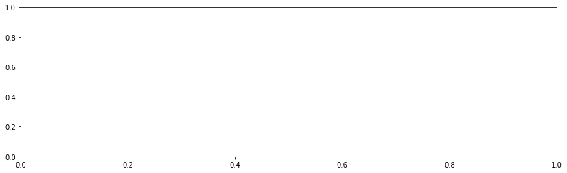
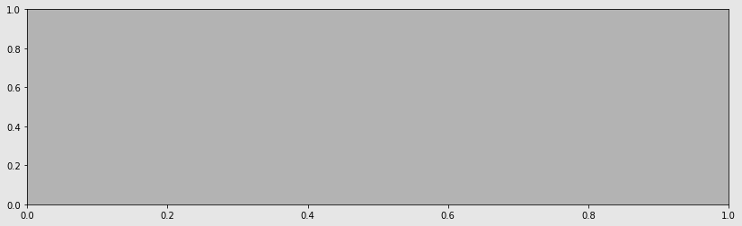

# PRAKTIK BIG DATA PERTEMUAN KE 14
## Chapter 11: Visualization with Matplotlib, Pandas, and Seaborn¶


```python
import pandas as pd
import numpy as np
import datetime

%matplotlib inline
```


```python
x = [-3, 5, 7]
y = [10, 2, 5]

plt.figure(figsize=(15,3))
plt.plot(x, y)
plt.xlim(0, 10)
plt.ylim(-3, 8)
plt.xlabel('X Axis')
plt.ylabel('Y axis')
plt.title('Line Plot')
plt.suptitle('Figure Title', size=20, y=1.03)
```


    Text(0.5, 1.03, 'Figure Title')


```python

```


```python
import pandas as pd
import numpy as np
import datetime

%matplotlib inline
```


```python
x = [-3, 5, 7]
y = [10, 2, 5]

fig, ax = plt.subplots(figsize=(15,3))
ax.plot(x, y)
ax.set_xlim(0, 10)
ax.set_ylim(-3, 8)
ax.set_xlabel('X axis')
ax.set_ylabel('Y axis')
ax.set_title('Line Plot')
fig.suptitle('Figure Title', size=20, y=1.03)
```


    Text(0.5, 1.03, 'Figure Title')


```python

```


```python
import pandas as pd
import numpy as np
import datetime

%matplotlib inline
```


```python
x = [-3, 5, 7]
y = [10, 2, 5]
fig, ax = plt.subplots(nrows=1, ncols=1)
```


```python

```


```python
import pandas as pd
import numpy as np
import datetime

%matplotlib inline
```


```python
x = [-3, 5, 7]
y = [10, 2, 5]

type(fig)
```


    matplotlib.figure.Figure


```python

```


```python
import pandas as pd
import numpy as np
import datetime

%matplotlib inline
```


```python
x = [-3, 5, 7]
y = [10, 2, 5]

type(ax)
```


    matplotlib.axes._subplots.AxesSubplot


```python

```


```python
import pandas as pd
import numpy as np
import datetime

%matplotlib inline
```


```python
x = [-3, 5, 7]
y = [10, 2, 5]

fig.get_size_inches()
```


    array([6., 4.])


```python

```


```python
import pandas as pd
import numpy as np
import datetime

%matplotlib inline
```


```python
x = [-3, 5, 7]
y = [10, 2, 5]

fig.set_size_inches(14, 4)
fig
```





```python

```


```python
import pandas as pd
import numpy as np
import datetime

%matplotlib inline
```


```python
x = [-3, 5, 7]
y = [10, 2, 5]

fig.axes
```


    [<matplotlib.axes._subplots.AxesSubplot at 0x7f7df36ab128>]


```python

```


```python
import pandas as pd
import numpy as np
import datetime

%matplotlib inline
```


```python
x = [-3, 5, 7]
y = [10, 2, 5]

fig.axes[0] is ax
```


    True


```python

```


```python
import pandas as pd
import numpy as np
import datetime

%matplotlib inline
```


```python
fig.set_facecolor('.9')
ax.set_facecolor('.7')
fig
```





```python

```


```python
import pandas as pd
import numpy as np
import datetime

%matplotlib inline
```


```python
spines = ax.spines
spines
```


    OrderedDict([('left', <matplotlib.spines.Spine at 0x7f7df50cd1d0>),
                 ('right', <matplotlib.spines.Spine at 0x7f7df50cd438>),
                 ('bottom', <matplotlib.spines.Spine at 0x7f7df50cde80>),
                 ('top', <matplotlib.spines.Spine at 0x7f7df50cd240>)])


```python

```


```python
import pandas as pd
import numpy as np
import datetime

%matplotlib inline
```


```python
spine_left = spines['left']
spine_left.set_position(('outward', -100))
spine_left.set_linewidth(5)

spine_bottom = spines['bottom']
spine_bottom.set_visible(False)
fig
```


```python

```


```python
import pandas as pd
import numpy as np
import datetime

%matplotlib inline
```


```python
ax.xaxis.grid(True, which='major', linewidth=2, color='black', linestyle='--')
ax.xaxis.set_ticks([.2, .4, .55, .93])
ax.xaxis.set_label_text('X Axis', family='Verdana', fontsize=15)

ax.set_ylabel('Y Axis', family='Calibri', fontsize=20)
ax.set_yticks([.1, .9])
ax.set_yticklabels(['point 1', 'point 9'], rotation=45)
fig
```


```python

```


```python
import pandas as pd
import numpy as np
import datetime

%matplotlib inline
```


```python
ax.xaxis.properties()
```


    {'agg_filter': None,
     'alpha': None,
     'animated': False,
     'children': [Text(0.5, 22.200000000000003, 'X Axis'),
      Text(1, 23.200000000000003, ''),
      <matplotlib.axis.XTick at 0x7f7df50ca048>,
      <matplotlib.axis.XTick at 0x7f7df3617c50>,
      <matplotlib.axis.XTick at 0x7f7e145629e8>,
      <matplotlib.axis.XTick at 0x7f7df5100d68>],
     'clip_box': <matplotlib.transforms.TransformedBbox at 0x7f7df50f4828>,
     'clip_on': True,
     'clip_path': None,
     'contains': None,
     'data_interval': array([ inf, -inf]),
     'figure': <Figure size 1008x288 with 1 Axes>,
     'gid': None,
     'gridlines': <a list of 4 Line2D gridline objects>,
     'in_layout': True,
     'label': Text(0.5, 22.200000000000003, 'X Axis'),
     'label_position': 'bottom',
     'label_text': 'X Axis',
     'major_formatter': <matplotlib.ticker.ScalarFormatter at 0x7f7e1a0ffc88>,
     'major_locator': <matplotlib.ticker.FixedLocator at 0x7f7df5100128>,
     'major_ticks': [<matplotlib.axis.XTick at 0x7f7df50ca048>,
      <matplotlib.axis.XTick at 0x7f7df3617c50>,
      <matplotlib.axis.XTick at 0x7f7e145629e8>,
      <matplotlib.axis.XTick at 0x7f7df5100d68>],
     'majorticklabels': <a list of 4 Text major ticklabel objects>,
     'majorticklines': <a list of 8 Line2D ticklines objects>,
     'majorticklocs': array([0.2 , 0.4 , 0.55, 0.93]),
     'minor_formatter': <matplotlib.ticker.NullFormatter at 0x7f7df50cd080>,
     'minor_locator': <matplotlib.ticker.NullLocator at 0x7f7df50cdfd0>,
     'minor_ticks': [],
     'minorticklabels': <a list of 0 Text minor ticklabel objects>,
     'minorticklines': <a list of 0 Line2D ticklines objects>,
     'minorticklocs': [],
     'minpos': inf,
     'offset_text': Text(1, 23.200000000000003, ''),
     'path_effects': [],
     'picker': None,
     'pickradius': 15,
     'rasterized': None,
     'scale': 'linear',
     'sketch_params': None,
     'smart_bounds': False,
     'snap': None,
     'tick_padding': 3.5,
     'tick_space': 26,
     'ticklabels': <a list of 4 Text major ticklabel objects>,
     'ticklines': <a list of 8 Line2D ticklines objects>,
     'ticklocs': array([0.2 , 0.4 , 0.55, 0.93]),
     'ticks_direction': array(['out', 'out', 'out', 'out'], dtype='<U3'),
     'ticks_position': 'bottom',
     'transform': <matplotlib.transforms.IdentityTransform at 0x7f7df50b4320>,
     'transformed_clip_path_and_affine': (None, None),
     'units': None,
     'url': None,
     'view_interval': array([0., 1.]),
     'visible': True,
     'zorder': 1.5}


```python

```


```python
import pandas as pd
import numpy as np
import datetime

%matplotlib inline
```


```python
movie = pd.read_csv('data/movie.csv')

med_budget = movie.groupby('title_year')['budget'].median() / 1e6
med_budget_roll = med_budget.rolling(5, min_periods=1).mean()
med_budget_roll.tail()
```


    title_year
    2012.0    20.893
    2013.0    19.893
    2014.0    19.100
    2015.0    17.980
    2016.0    17.780
    Name: budget, dtype: float64


```python

```


```python
import pandas as pd
import numpy as np
import datetime

%matplotlib inline
```


```python
movie = pd.read_csv('data/movie.csv')

med_budget = movie.groupby('title_year')['budget'].median() / 1e6
med_budget_roll = med_budget.rolling(5, min_periods=1).mean()
years = med_budget_roll.index.values
years[-5:]
```


    array([2012., 2013., 2014., 2015., 2016.])


```python

```


```python
import pandas as pd
import numpy as np
import datetime

%matplotlib inline
```


```python
movie = pd.read_csv('data/movie.csv')

med_budget = movie.groupby('title_year')['budget'].median() / 1e6
med_budget_roll = med_budget.rolling(5, min_periods=1).mean()
budget = med_budget_roll.values
budget[-5:]
```


    array([20.893, 19.893, 19.1  , 17.98 , 17.78 ])


```python

```


```python
import pandas as pd
import numpy as np
import datetime

%matplotlib inline
```


```python
movie = pd.read_csv('data/movie.csv')

med_budget = movie.groupby('title_year')['budget'].median() / 1e6
med_budget_roll = med_budget.rolling(5, min_periods=1).mean()
budget = med_budget_roll.values
fig, ax = plt.subplots(figsize=(14,4), linewidth=5, edgecolor='.5')
ax.plot(years, budget, linestyle='--', linewidth=3, color='.2', label='All Movies')
text_kwargs=dict(fontsize=20, family='cursive')
ax.set_title('Median Movie Budget', **text_kwargs)
ax.set_ylabel('Millions of Dollars', **text_kwargs)
```


    Text(0, 0.5, 'Millions of Dollars')


```python

```


```python
import pandas as pd
import numpy as np
import datetime

%matplotlib inline
```


```python
movie = pd.read_csv('data/movie.csv')

movie_count = movie.groupby('title_year')['budget'].count()
movie_count.tail()
```


    title_year
    2012.0    191
    2013.0    208
    2014.0    221
    2015.0    192
    2016.0     86
    Name: budget, dtype: int64


```python

```


```python
import pandas as pd
import numpy as np
import datetime

%matplotlib inline
```


```python
movie = pd.read_csv('data/movie.csv')

movie_count = movie.groupby('title_year')['budget'].count()
ct = movie_count.values
ct_norm = ct / ct.max() * budget.max()

fifth_year = (years % 5 == 0) & (years >= 1970)
years_5 = years[fifth_year]
ct_5 = ct[fifth_year]
ct_norm_5 = ct_norm[fifth_year]

ax.bar(years_5, ct_norm_5, 3, facecolor='.5', alpha=.3, label='Movies per Year')
ax.set_xlim(1968, 2017)
for x, y, v in zip(years_5, ct_norm_5, ct_5):
    ax.text(x, y + .5, str(v), ha='center')
ax.legend()
fig
```


```python

```

```python
import pandas as pd
import numpy as np
import datetime

%matplotlib inline
```


```python
movie = pd.read_csv('data/movie.csv')

type(plot_objects)
```


    tuple


```python
import pandas as pd
import numpy as np
import datetime

%matplotlib inline
```


```python
movie = pd.read_csv('data/movie.csv')

plot_objects = plt.subplots()
```


```python

```


```python
import pandas as pd
import numpy as np
import datetime

%matplotlib inline
```


```python
movie = pd.read_csv('data/movie.csv')

fig = plot_objects[0]
ax = plot_objects[1]
plot_objects[1]
```


    array([[<matplotlib.axes._subplots.AxesSubplot object at 0x7f7df4ef1a20>,
            <matplotlib.axes._subplots.AxesSubplot object at 0x7f7df4b8cd30>,
            <matplotlib.axes._subplots.AxesSubplot object at 0x7f7df4c7d2b0>,
            <matplotlib.axes._subplots.AxesSubplot object at 0x7f7df4cca828>],
           [<matplotlib.axes._subplots.AxesSubplot object at 0x7f7df4eb8da0>,
            <matplotlib.axes._subplots.AxesSubplot object at 0x7f7df4dab358>,
            <matplotlib.axes._subplots.AxesSubplot object at 0x7f7df4dd68d0>,
            <matplotlib.axes._subplots.AxesSubplot object at 0x7f7df4e07e10>]],
          dtype=object)


```python

```


```python
import pandas as pd
import numpy as np
import datetime

%matplotlib inline
```


```python
fig.get_axes() == fig.axes
```


    True


```python

```


```python
import pandas as pd
import numpy as np
import datetime

%matplotlib inline
```


```python
fig, ax = plt.subplots()
```


```python

```


```python
import pandas as pd
import numpy as np
import datetime

%matplotlib inline
```


```python
fig.axes == fig.get_axes()
```


    True


```python

```


```python
import pandas as pd
import numpy as np
import datetime

%matplotlib inline
```


```python
ax.xaxis == ax.get_xaxis()
```


    True


```python

```


```python
import pandas as pd
import numpy as np
import datetime

%matplotlib inline
```


```python
ax.yaxis == ax.get_yaxis()
```


    True


```python

```


```python
import pandas as pd
import numpy as np
import datetime

%matplotlib inline
```


```python
movie = pd.read_csv('data/movie.csv')
med_budget = movie.groupby('title_year')['budget'].median() / 1e6
med_budget_roll = med_budget.rolling(5, min_periods=1).mean()
med_budget_roll.tail()
```


    title_year
    2012.0    20.893
    2013.0    19.893
    2014.0    19.100
    2015.0    17.980
    2016.0    17.780
    Name: budget, dtype: float64


```python

```


```python
import pandas as pd
import numpy as np
import datetime

%matplotlib inline
```


```python
movie = pd.read_csv('data/movie.csv')
med_budget = movie.groupby('title_year')['budget'].median() / 1e6
med_budget_roll = med_budget.rolling(5, min_periods=1).mean()
years = med_budget_roll.index.values
years[-5:]
```


    array([2012., 2013., 2014., 2015., 2016.])


```python

```


```python
import pandas as pd
import numpy as np
import datetime

%matplotlib inline
```


```python
movie = pd.read_csv('data/movie.csv')
med_budget = movie.groupby('title_year')['budget'].median() / 1e6
med_budget_roll = med_budget.rolling(5, min_periods=1).mean()
years = med_budget_roll.index.values
budget = med_budget_roll.values
budget[-5:]
```


    array([20.893, 19.893, 19.1  , 17.98 , 17.78 ])


```python

```


```python
import pandas as pd
import numpy as np
import datetime

%matplotlib inline
```


```python
movie = pd.read_csv('data/movie.csv')
med_budget = movie.groupby('title_year')['budget'].median() / 1e6
med_budget_roll = med_budget.rolling(5, min_periods=1).mean()
years = med_budget_roll.index.values
budget = med_budget_roll.values
fig, ax = plt.subplots(figsize=(14,4), linewidth=5, edgecolor='.5')
ax.plot(years, budget, linestyle='--', linewidth=3, color='.2', label='All Movies')
text_kwargs=dict(fontsize=20, family='cursive')
ax.set_title('Median Movie Budget', **text_kwargs)
ax.set_ylabel('Millions of Dollars', **text_kwargs)
```


    Text(0, 0.5, 'Millions of Dollars')


```python

```


```python
import pandas as pd
import numpy as np
import datetime

%matplotlib inline
```


```python
movie = pd.read_csv('data/movie.csv')
movie_count = movie.groupby('title_year')['budget'].count()
movie_count.tail()
```


    title_year
    2012.0    191
    2013.0    208
    2014.0    221
    2015.0    192
    2016.0     86
    Name: budget, dtype: int64


```python

```


```python
import pandas as pd
import numpy as np
import datetime

%matplotlib inline
```


```python
movie = pd.read_csv('data/movie.csv')
movie_count = movie.groupby('title_year')['budget'].count()
ct = movie_count.values
ct_norm = ct / ct.max() * budget.max()

fifth_year = (years % 5 == 0) & (years >= 1970)
years_5 = years[fifth_year]
ct_5 = ct[fifth_year]
ct_norm_5 = ct_norm[fifth_year]

ax.bar(years_5, ct_norm_5, 3, facecolor='.5', alpha=.3, label='Movies per Year')
ax.set_xlim(1968, 2017)
for x, y, v in zip(years_5, ct_norm_5, ct_5):
    ax.text(x, y + .5, str(v), ha='center')
ax.legend()
fig
```


```python

```


```python
import pandas as pd
import numpy as np
import datetime

%matplotlib inline
```


```python
movie = pd.read_csv('data/movie.csv')
top10 = movie.sort_values('budget', ascending=False) \
             .groupby('title_year')['budget'] \
             .apply(lambda x: x.iloc[:10].median() / 1e6)
        
top10_roll = top10.rolling(5, min_periods=1).mean()
top10_roll.tail()
```


    title_year
    2012.0    192.9
    2013.0    195.9
    2014.0    191.7
    2015.0    186.8
    2016.0    189.1
    Name: budget, dtype: float64


```python

```


```python
import pandas as pd
import numpy as np
import datetime

%matplotlib inline
```


```python
movie = pd.read_csv('data/movie.csv')
fig2, ax_array = plt.subplots(2, 1, figsize=(14,6), sharex=True)
ax1 = ax_array[0]
ax2 = ax_array[1]

ax1.plot(years, budget, linestyle='--', linewidth=3, color='.2', label='All Movies')
ax1.bar(years_5, ct_norm_5, 3, facecolor='.5', alpha=.3, label='Movies per Year')
ax1.legend(loc='upper left')
ax1.set_xlim(1968, 2017)
plt.setp(ax1.get_xticklines(), visible=False)

for x, y, v in zip(years_5, ct_norm_5, ct_5):
    ax1.text(x, y + .5, str(v), ha='center')

ax2.plot(years, top10_roll.values, color='.2', label='Top 10 Movies')
ax2.legend(loc='upper left')

fig2.tight_layout()
fig2.suptitle('Median Movie Budget', y=1.02, **text_kwargs)
fig2.text(0, .6, 'Millions of Dollars', rotation='vertical', ha='center', **text_kwargs)

import os
path = os.path.expanduser('~/Desktop/movie_budget.png')
fig2.savefig(path, bbox_inches='tight')
```


```python

```


```python
import pandas as pd
import numpy as np
import datetime

%matplotlib inline
```


```python
movie = pd.read_csv('data/movie.csv')
med_budget_roll.tail()
```


    title_year
    2012.0    20.893
    2013.0    19.893
    2014.0    19.100
    2015.0    17.980
    2016.0    17.780
    Name: budget, dtype: float64


```python

```


```python
import pandas as pd
import numpy as np
import datetime

%matplotlib inline
```


```python
movie = pd.read_csv('data/movie.csv')
med_budget.loc[2012:2016].mean()
```


    17.78


```python

```


```python
import pandas as pd
import numpy as np
import datetime

%matplotlib inline
```


```python
movie = pd.read_csv('data/movie.csv')
med_budget.loc[2011:2015].mean()
```


    17.98


```python

```


```python
import pandas as pd
import numpy as np
import datetime

%matplotlib inline
```


```python
movie = pd.read_csv('data/movie.csv')
med_budget.loc[2010:2014].mean()
```


    19.1


```python

```


```python
import pandas as pd
import numpy as np
import datetime

%matplotlib inline
```


```python
movie = pd.read_csv('data/movie.csv')
os.path.expanduser('~/Desktop/movie_budget.png')
```


    '/home/satria/Desktop/movie_budget.png'


```python

```


```python
import pandas as pd
import numpy as np
import datetime

%matplotlib inline
```


```python
movie = pd.read_csv('data/movie.csv')
cols = ['budget', 'title_year', 'imdb_score', 'movie_title']
m = movie[cols].dropna()

# m = movie[['budget', 'title_year', 'imdb_score', 'movie_title']].dropna()
m['budget2'] = m['budget'] / 1e6
np.random.seed(0)
movie_samp = m.query('title_year >= 2000').sample(100)

fig, ax = plt.subplots(figsize=(14,6))
ax.scatter(x='title_year', y='imdb_score', s='budget2', data=movie_samp)

idx_min = movie_samp['imdb_score'].idxmin()
idx_max = movie_samp['imdb_score'].idxmax()
for idx, offset in zip([idx_min, idx_max], [.5, -.5]):
    year = movie_samp.loc[idx, 'title_year']
    score = movie_samp.loc[idx, 'imdb_score']
    title = movie_samp.loc[idx, 'movie_title']
    ax.annotate(xy=(year, score), 
                xytext=(year + 1, score + offset), 
                s=title + ' ({})'.format(score),
                ha='center',
                size=16,
                arrowprops=dict(arrowstyle="fancy"))
ax.set_title('IMDB Score by Year', size=25)
ax.grid(True)
```


```python

```


```python
import pandas as pd
import numpy as np
import datetime

%matplotlib inline
```


```python
df = pd.DataFrame(index=['Atiya', 'Abbas', 'Cornelia', 'Stephanie', 'Monte'], 
                  data={'Apples':[20, 10, 40, 20, 50],
                        'Oranges':[35, 40, 25, 19, 33]})
df
```


<div>
<style scoped>
    .dataframe tbody tr th:only-of-type {
        vertical-align: middle;
    }

    .dataframe tbody tr th {
        vertical-align: top;
    }

    .dataframe thead th {
        text-align: right;
    }
</style>
<table border="1" class="dataframe">
  <thead>
    <tr style="text-align: right;">
      <th></th>
      <th>Apples</th>
      <th>Oranges</th>
    </tr>
  </thead>
  <tbody>
    <tr>
      <th>Atiya</th>
      <td>20</td>
      <td>35</td>
    </tr>
    <tr>
      <th>Abbas</th>
      <td>10</td>
      <td>40</td>
    </tr>
    <tr>
      <th>Cornelia</th>
      <td>40</td>
      <td>25</td>
    </tr>
    <tr>
      <th>Stephanie</th>
      <td>20</td>
      <td>19</td>
    </tr>
    <tr>
      <th>Monte</th>
      <td>50</td>
      <td>33</td>
    </tr>
  </tbody>
</table>
</div>


```python

```


```python
import pandas as pd
import numpy as np
import datetime

%matplotlib inline
```


```python
df = pd.DataFrame(index=['Atiya', 'Abbas', 'Cornelia', 'Stephanie', 'Monte'], 
                  data={'Apples':[20, 10, 40, 20, 50],
                        'Oranges':[35, 40, 25, 19, 33]})
color = ['.2', '.7']
df.plot(kind='bar', color=color, figsize=(16,4))
```


    <matplotlib.axes._subplots.AxesSubplot at 0x7f7df4d54c18>


```python

```


```python

```


```python
import pandas as pd
import numpy as np
import datetime

%matplotlib inline
```


```python
df = pd.DataFrame(index=['Atiya', 'Abbas', 'Cornelia', 'Stephanie', 'Monte'], 
                  data={'Apples':[20, 10, 40, 20, 50],
                        'Oranges':[35, 40, 25, 19, 33]})
color = ['.2', '.7']
df.plot(kind='kde', color=color, figsize=(16,4))
```


    <matplotlib.axes._subplots.AxesSubplot at 0x7f7df4718128>


```python

```


```python

```


```python
import pandas as pd
import numpy as np
import datetime

%matplotlib inline
```


```python
df = pd.DataFrame(index=['Atiya', 'Abbas', 'Cornelia', 'Stephanie', 'Monte'], 
                  data={'Apples':[20, 10, 40, 20, 50],
                        'Oranges':[35, 40, 25, 19, 33]})
color = ['.2', '.7']
fig, (ax1, ax2, ax3) = plt.subplots(1, 3, figsize=(16,4))
fig.suptitle('One Variable Plots', size=20, y=1.02)
df.plot(kind='kde', color=color, ax=ax1, title='KDE plot')
df.plot(kind='box', ax=ax2, title='Boxplot')
df.plot(kind='hist', color=color, ax=ax3, title='Histogram')
```


    <matplotlib.axes._subplots.AxesSubplot at 0x7f7df44cceb8>


```python

```


```python
import pandas as pd
import numpy as np
import datetime

%matplotlib inline
```


```python
df = pd.DataFrame(index=['Atiya', 'Abbas', 'Cornelia', 'Stephanie', 'Monte'], 
                  data={'Apples':[20, 10, 40, 20, 50],
                        'Oranges':[35, 40, 25, 19, 33]})
color = ['.2', '.7']
fig, (ax1, ax2, ax3) = plt.subplots(1, 3, figsize=(16,4))
df.sort_values('Apples').plot(x='Apples', y='Oranges', kind='line', ax=ax1)
df.plot(x='Apples', y='Oranges', kind='bar', ax=ax2)
df.plot(x='Apples', kind='kde', ax=ax3)
```


    <matplotlib.axes._subplots.AxesSubplot at 0x7f7df44d7390>


```python

```


```python
import pandas as pd
import numpy as np
import datetime

%matplotlib inline
```


```python
flights = pd.read_csv('data/flights.csv')
flights.head()
```


<div>
<style scoped>
    .dataframe tbody tr th:only-of-type {
        vertical-align: middle;
    }

    .dataframe tbody tr th {
        vertical-align: top;
    }

    .dataframe thead th {
        text-align: right;
    }
</style>
<table border="1" class="dataframe">
  <thead>
    <tr style="text-align: right;">
      <th></th>
      <th>MONTH</th>
      <th>DAY</th>
      <th>WEEKDAY</th>
      <th>AIRLINE</th>
      <th>ORG_AIR</th>
      <th>DEST_AIR</th>
      <th>SCHED_DEP</th>
      <th>DEP_DELAY</th>
      <th>AIR_TIME</th>
      <th>DIST</th>
      <th>SCHED_ARR</th>
      <th>ARR_DELAY</th>
      <th>DIVERTED</th>
      <th>CANCELLED</th>
    </tr>
  </thead>
  <tbody>
    <tr>
      <th>0</th>
      <td>1</td>
      <td>1</td>
      <td>4</td>
      <td>WN</td>
      <td>LAX</td>
      <td>SLC</td>
      <td>1625</td>
      <td>58.0</td>
      <td>94.0</td>
      <td>590</td>
      <td>1905</td>
      <td>65.0</td>
      <td>0</td>
      <td>0</td>
    </tr>
    <tr>
      <th>1</th>
      <td>1</td>
      <td>1</td>
      <td>4</td>
      <td>UA</td>
      <td>DEN</td>
      <td>IAD</td>
      <td>823</td>
      <td>7.0</td>
      <td>154.0</td>
      <td>1452</td>
      <td>1333</td>
      <td>-13.0</td>
      <td>0</td>
      <td>0</td>
    </tr>
    <tr>
      <th>2</th>
      <td>1</td>
      <td>1</td>
      <td>4</td>
      <td>MQ</td>
      <td>DFW</td>
      <td>VPS</td>
      <td>1305</td>
      <td>36.0</td>
      <td>85.0</td>
      <td>641</td>
      <td>1453</td>
      <td>35.0</td>
      <td>0</td>
      <td>0</td>
    </tr>
    <tr>
      <th>3</th>
      <td>1</td>
      <td>1</td>
      <td>4</td>
      <td>AA</td>
      <td>DFW</td>
      <td>DCA</td>
      <td>1555</td>
      <td>7.0</td>
      <td>126.0</td>
      <td>1192</td>
      <td>1935</td>
      <td>-7.0</td>
      <td>0</td>
      <td>0</td>
    </tr>
    <tr>
      <th>4</th>
      <td>1</td>
      <td>1</td>
      <td>4</td>
      <td>WN</td>
      <td>LAX</td>
      <td>MCI</td>
      <td>1720</td>
      <td>48.0</td>
      <td>166.0</td>
      <td>1363</td>
      <td>2225</td>
      <td>39.0</td>
      <td>0</td>
      <td>0</td>
    </tr>
  </tbody>
</table>
</div>


```python

```


```python
import pandas as pd
import numpy as np
import datetime

%matplotlib inline
```


```python
flights = pd.read_csv('data/flights.csv')
flights['DELAYED'] = flights['ARR_DELAY'].ge(15).astype(int)
cols = ['DIVERTED', 'CANCELLED', 'DELAYED']
flights['ON_TIME'] = 1 - flights[cols].any(axis=1)

cols.append('ON_TIME')
status = flights[cols].sum()
status
```


    DIVERTED       137
    CANCELLED      881
    DELAYED      11685
    ON_TIME      45789
    dtype: int64


```python

```


```python
import pandas as pd
import numpy as np
import datetime

%matplotlib inline
```


```python
flights = pd.read_csv('data/flights.csv')
flights['DELAYED'] = flights['ARR_DELAY'].ge(15).astype(int)
cols = ['DIVERTED', 'CANCELLED', 'DELAYED']
flights['ON_TIME'] = 1 - flights[cols].any(axis=1)

cols.append('ON_TIME')
status = flights[cols].sum()
fig, ax_array = plt.subplots(2, 3, figsize=(18,8))
(ax1, ax2, ax3), (ax4, ax5, ax6) = ax_array
fig.suptitle('2015 US Flights - Univariate Summary', size=20)

ac = flights['AIRLINE'].value_counts()
ac.plot(kind='barh', ax=ax1, title ='Airline')

oc = flights['ORG_AIR'].value_counts()
oc.plot(kind='bar', ax=ax2, rot=0, title='Origin City')

dc = flights['DEST_AIR'].value_counts().head(10)
dc.plot(kind='bar', ax=ax3, rot=0, title='Destination City')

status.plot(kind='bar', ax=ax4, rot=0, log=True, title='Flight Status')
flights['DIST'].plot(kind='kde', ax=ax5, xlim=(0, 3000),
                     title='Distance KDE')
flights['ARR_DELAY'].plot(kind='hist', ax=ax6, 
                          title='Arrival Delay', range=(0,200))
```


    <matplotlib.axes._subplots.AxesSubplot at 0x7f7df45e0dd8>


```python

```


```python
import pandas as pd
import numpy as np
import datetime

%matplotlib inline
```


```python
flights = pd.read_csv('data/flights.csv')
hour = flights['SCHED_DEP'] // 100
minute = flights['SCHED_DEP'] % 100
df_date = flights[['MONTH', 'DAY']].assign(YEAR=2015, HOUR=hour, MINUTE=minute)
df_date.head()
```


<div>
<style scoped>
    .dataframe tbody tr th:only-of-type {
        vertical-align: middle;
    }

    .dataframe tbody tr th {
        vertical-align: top;
    }

    .dataframe thead th {
        text-align: right;
    }
</style>
<table border="1" class="dataframe">
  <thead>
    <tr style="text-align: right;">
      <th></th>
      <th>MONTH</th>
      <th>DAY</th>
      <th>YEAR</th>
      <th>HOUR</th>
      <th>MINUTE</th>
    </tr>
  </thead>
  <tbody>
    <tr>
      <th>0</th>
      <td>1</td>
      <td>1</td>
      <td>2015</td>
      <td>16</td>
      <td>25</td>
    </tr>
    <tr>
      <th>1</th>
      <td>1</td>
      <td>1</td>
      <td>2015</td>
      <td>8</td>
      <td>23</td>
    </tr>
    <tr>
      <th>2</th>
      <td>1</td>
      <td>1</td>
      <td>2015</td>
      <td>13</td>
      <td>5</td>
    </tr>
    <tr>
      <th>3</th>
      <td>1</td>
      <td>1</td>
      <td>2015</td>
      <td>15</td>
      <td>55</td>
    </tr>
    <tr>
      <th>4</th>
      <td>1</td>
      <td>1</td>
      <td>2015</td>
      <td>17</td>
      <td>20</td>
    </tr>
  </tbody>
</table>
</div>


```python

```


```python
import pandas as pd
import numpy as np
import datetime

%matplotlib inline
```


```python
flights = pd.read_csv('data/flights.csv')
hour = flights['SCHED_DEP'] // 100
minute = flights['SCHED_DEP'] % 100
df_date = flights[['MONTH', 'DAY']].assign(YEAR=2015, HOUR=hour, MINUTE=minute)
flight_dep = pd.to_datetime(df_date)
flight_dep.head()
```


    0   2015-01-01 16:25:00
    1   2015-01-01 08:23:00
    2   2015-01-01 13:05:00
    3   2015-01-01 15:55:00
    4   2015-01-01 17:20:00
    dtype: datetime64[ns]


```python

```


```python
import pandas as pd
import numpy as np
import datetime

%matplotlib inline
```


```python
flights = pd.read_csv('data/flights.csv')
hour = flights['SCHED_DEP'] // 100
minute = flights['SCHED_DEP'] % 100
df_date = flights[['MONTH', 'DAY']].assign(YEAR=2015, HOUR=hour, MINUTE=minute)
flight_dep = pd.to_datetime(df_date)
flights.index = flight_dep
fc = flights.resample('W').size()
fc.plot(figsize=(12,3), title='Flights per Week', grid=True)
```


    <matplotlib.axes._subplots.AxesSubplot at 0x7f7df3c3f828>


```python

```


```python
import pandas as pd
import numpy as np
import datetime

%matplotlib inline
```


```python
flights = pd.read_csv('data/flights.csv')
hour = flights['SCHED_DEP'] // 100
minute = flights['SCHED_DEP'] % 100
df_date = flights[['MONTH', 'DAY']].assign(YEAR=2015, HOUR=hour, MINUTE=minute)
flight_dep = pd.to_datetime(df_date)
flights.index = flight_dep
fc = flights.resample('W').size()
fc_miss = fc.where(fc >  1000)
fc_intp = fc_miss.interpolate(limit_direction='both')

ax = fc_intp.plot(color='black', figsize=(16,4))
fc_intp[fc < 500].plot(linewidth=10, grid=True, 
                       color='.8', ax=ax)

ax.annotate(xy=(.8, .55), xytext=(.8, .77), 
            xycoords='axes fraction', s='missing data', 
            ha='center',  size=20, arrowprops=dict())
ax.set_title('Flights per Week (Interpolated Missing Data)')
```


    Text(0.5, 1.0, 'Flights per Week (Interpolated Missing Data)')


```python

```


```python
import pandas as pd
import numpy as np
import datetime

%matplotlib inline
```


```python
flights = pd.read_csv('data/flights.csv')
flights.groupby('DEST_AIR')['DIST'] \
       .agg(['mean', 'count']) \
       .query('count > 100') \
       .sort_values('mean') \
       .tail(10) \
       .plot(kind='bar', y='mean', legend=False, 
             rot=0, figsize=(14,4),
             title='Average Distance per Destination')
```


    <matplotlib.axes._subplots.AxesSubplot at 0x7f7df3d00eb8>


```python

```


```python
import pandas as pd
import numpy as np
import datetime

%matplotlib inline
```


```python
flights = pd.read_csv('data/flights.csv')
fs = flights.reset_index(drop=True)[['DIST', 'AIR_TIME']].query('DIST <= 2000').dropna()
fs.plot(x='DIST', y='AIR_TIME', kind='scatter', s=1, figsize=(16,4))
```


    <matplotlib.axes._subplots.AxesSubplot at 0x7f7df413cf28>


```python

```


```python
import pandas as pd
import numpy as np
import datetime

%matplotlib inline
```


```python
flights = pd.read_csv('data/flights.csv')
fs = flights.reset_index(drop=True)[['DIST', 'AIR_TIME']].query('DIST <= 2000').dropna()
fs['DIST_GROUP'] = pd.cut(fs['DIST'], bins=range(0, 2001, 250))
fs['DIST_GROUP'].value_counts().sort_index()
```


    (0, 250]         6529
    (250, 500]      12631
    (500, 750]      11506
                    ...  
    (1250, 1500]     3198
    (1500, 1750]     3885
    (1750, 2000]     1815
    Name: DIST_GROUP, Length: 8, dtype: int64


```python

```


```python
import pandas as pd
import numpy as np
import datetime

%matplotlib inline
```


```python
flights = pd.read_csv('data/flights.csv')
fs = flights.reset_index(drop=True)[['DIST', 'AIR_TIME']].query('DIST <= 2000').dropna()
fs['DIST_GROUP'] = pd.cut(fs['DIST'], bins=range(0, 2001, 250))
normalize = lambda x: (x - x.mean()) / x.std()
fs['TIME_SCORE'] = fs.groupby('DIST_GROUP')['AIR_TIME'] \
                     .transform(normalize)

fs.head()
```


<div>
<style scoped>
    .dataframe tbody tr th:only-of-type {
        vertical-align: middle;
    }

    .dataframe tbody tr th {
        vertical-align: top;
    }

    .dataframe thead th {
        text-align: right;
    }
</style>
<table border="1" class="dataframe">
  <thead>
    <tr style="text-align: right;">
      <th></th>
      <th>DIST</th>
      <th>AIR_TIME</th>
      <th>DIST_GROUP</th>
      <th>TIME_SCORE</th>
    </tr>
  </thead>
  <tbody>
    <tr>
      <th>0</th>
      <td>590</td>
      <td>94.0</td>
      <td>(500, 750]</td>
      <td>0.490966</td>
    </tr>
    <tr>
      <th>1</th>
      <td>1452</td>
      <td>154.0</td>
      <td>(1250, 1500]</td>
      <td>-1.267551</td>
    </tr>
    <tr>
      <th>2</th>
      <td>641</td>
      <td>85.0</td>
      <td>(500, 750]</td>
      <td>-0.296749</td>
    </tr>
    <tr>
      <th>3</th>
      <td>1192</td>
      <td>126.0</td>
      <td>(1000, 1250]</td>
      <td>-1.211020</td>
    </tr>
    <tr>
      <th>4</th>
      <td>1363</td>
      <td>166.0</td>
      <td>(1250, 1500]</td>
      <td>-0.521999</td>
    </tr>
  </tbody>
</table>
</div>


```python

```


```python
import pandas as pd
import numpy as np
import datetime

%matplotlib inline
```


```python
flights = pd.read_csv('data/flights.csv')
fs = flights.reset_index(drop=True)[['DIST', 'AIR_TIME']].query('DIST <= 2000').dropna()
fs['DIST_GROUP'] = pd.cut(fs['DIST'], bins=range(0, 2001, 250))
normalize = lambda x: (x - x.mean()) / x.std()
fs['TIME_SCORE'] = fs.groupby('DIST_GROUP')['AIR_TIME'] \
                     .transform(normalize)

ax = fs.boxplot(by='DIST_GROUP', column='TIME_SCORE', figsize=(16,4))
ax.set_title('Z-Scores for Distance Groups')
ax.figure.suptitle('')
```


    Text(0.5, 0.98, '')


```python

```


```python
import pandas as pd
import numpy as np
import datetime

%matplotlib inline
```


```python
flights = pd.read_csv('data/flights.csv')
fs = flights.reset_index(drop=True)[['DIST', 'AIR_TIME']].query('DIST <= 2000').dropna()
fs['DIST_GROUP'] = pd.cut(fs['DIST'], bins=range(0, 2001, 250))
normalize = lambda x: (x - x.mean()) / x.std()
fs['TIME_SCORE'] = fs.groupby('DIST_GROUP')['AIR_TIME'] \
                     .transform(normalize)

outliers = flights.iloc[fs[fs['TIME_SCORE'] > 6].index]
outliers = outliers[['AIRLINE','ORG_AIR', 'DEST_AIR', 'AIR_TIME', 
                     'DIST', 'ARR_DELAY', 'DIVERTED']]
outliers['PLOT_NUM'] = range(1, len(outliers) + 1)
outliers
```


<div>
<style scoped>
    .dataframe tbody tr th:only-of-type {
        vertical-align: middle;
    }

    .dataframe tbody tr th {
        vertical-align: top;
    }

    .dataframe thead th {
        text-align: right;
    }
</style>
<table border="1" class="dataframe">
  <thead>
    <tr style="text-align: right;">
      <th></th>
      <th>AIRLINE</th>
      <th>ORG_AIR</th>
      <th>DEST_AIR</th>
      <th>AIR_TIME</th>
      <th>DIST</th>
      <th>ARR_DELAY</th>
      <th>DIVERTED</th>
      <th>PLOT_NUM</th>
    </tr>
  </thead>
  <tbody>
    <tr>
      <th>16429</th>
      <td>DL</td>
      <td>ATL</td>
      <td>CVG</td>
      <td>121.0</td>
      <td>373</td>
      <td>54.0</td>
      <td>0</td>
      <td>1</td>
    </tr>
    <tr>
      <th>24698</th>
      <td>F9</td>
      <td>MSP</td>
      <td>ATL</td>
      <td>199.0</td>
      <td>907</td>
      <td>79.0</td>
      <td>0</td>
      <td>2</td>
    </tr>
    <tr>
      <th>44676</th>
      <td>UA</td>
      <td>IAH</td>
      <td>MCI</td>
      <td>176.0</td>
      <td>643</td>
      <td>76.0</td>
      <td>0</td>
      <td>3</td>
    </tr>
    <tr>
      <th>54821</th>
      <td>OO</td>
      <td>PHX</td>
      <td>SFO</td>
      <td>164.0</td>
      <td>651</td>
      <td>146.0</td>
      <td>0</td>
      <td>4</td>
    </tr>
    <tr>
      <th>57614</th>
      <td>NK</td>
      <td>ORD</td>
      <td>DFW</td>
      <td>210.0</td>
      <td>802</td>
      <td>98.0</td>
      <td>0</td>
      <td>5</td>
    </tr>
  </tbody>
</table>
</div>


```python

```


```python
import pandas as pd
import numpy as np
import datetime

%matplotlib inline
```


```python
flights = pd.read_csv('data/flights.csv')
fs = flights.reset_index(drop=True)[['DIST', 'AIR_TIME']].query('DIST <= 2000').dropna()
fs['DIST_GROUP'] = pd.cut(fs['DIST'], bins=range(0, 2001, 250))
normalize = lambda x: (x - x.mean()) / x.std()
fs['TIME_SCORE'] = fs.groupby('DIST_GROUP')['AIR_TIME'] \
                     .transform(normalize)

outliers = flights.iloc[fs[fs['TIME_SCORE'] > 6].index]
outliers = outliers[['AIRLINE','ORG_AIR', 'DEST_AIR', 'AIR_TIME', 
                     'DIST', 'ARR_DELAY', 'DIVERTED']]
outliers['PLOT_NUM'] = range(1, len(outliers) + 1)
ax = fs.plot(x='DIST', y='AIR_TIME', 
             kind='scatter', s=1, 
             figsize=(16,4), table=outliers)
outliers.plot(x='DIST', y='AIR_TIME',
              kind='scatter', s=25, ax=ax, grid=True)

outs = outliers[['AIR_TIME', 'DIST', 'PLOT_NUM']]
for t, d, n  in outs.itertuples(index=False):
    ax.text(d + 5, t + 5, str(n))
    
plt.setp(ax.get_xticklabels(), y=.1)
plt.setp(ax.get_xticklines(), visible=False)
ax.set_xlabel('')
ax.set_title('Flight Time vs Distance with Outliers')
```


    Text(0.5, 1.0, 'Flight Time vs Distance with Outliers')


```python

```


```python
import pandas as pd
import numpy as np
import datetime

%matplotlib inline
```


```python
meetup = pd.read_csv('data/meetup_groups.csv', 
                     parse_dates=['join_date'], 
                     index_col='join_date')
meetup.head()
```


<div>
<style scoped>
    .dataframe tbody tr th:only-of-type {
        vertical-align: middle;
    }

    .dataframe tbody tr th {
        vertical-align: top;
    }

    .dataframe thead th {
        text-align: right;
    }
</style>
<table border="1" class="dataframe">
  <thead>
    <tr style="text-align: right;">
      <th></th>
      <th>group</th>
      <th>city</th>
      <th>state</th>
      <th>country</th>
    </tr>
    <tr>
      <th>join_date</th>
      <th></th>
      <th></th>
      <th></th>
      <th></th>
    </tr>
  </thead>
  <tbody>
    <tr>
      <th>2016-11-18 02:41:29</th>
      <td>houston machine learning</td>
      <td>Houston</td>
      <td>TX</td>
      <td>us</td>
    </tr>
    <tr>
      <th>2017-05-09 14:16:37</th>
      <td>houston machine learning</td>
      <td>Houston</td>
      <td>TX</td>
      <td>us</td>
    </tr>
    <tr>
      <th>2016-12-30 02:34:16</th>
      <td>houston machine learning</td>
      <td>Houston</td>
      <td>TX</td>
      <td>us</td>
    </tr>
    <tr>
      <th>2016-07-18 00:48:17</th>
      <td>houston machine learning</td>
      <td>Houston</td>
      <td>TX</td>
      <td>us</td>
    </tr>
    <tr>
      <th>2017-05-25 12:58:16</th>
      <td>houston machine learning</td>
      <td>Houston</td>
      <td>TX</td>
      <td>us</td>
    </tr>
  </tbody>
</table>
</div>


```python

```


```python
import pandas as pd
import numpy as np
import datetime

%matplotlib inline
```


```python
meetup = pd.read_csv('data/meetup_groups.csv', 
                     parse_dates=['join_date'], 
                     index_col='join_date')
group_count = meetup.groupby([pd.Grouper(freq='W'), 'group']).size()
group_count.head()
```


    join_date   group   
    2010-11-07  houstonr     5
    2010-11-14  houstonr    11
    2010-11-21  houstonr     2
    2010-12-05  houstonr     1
    2011-01-16  houstonr     2
    dtype: int64


```python

```


```python
import pandas as pd
import numpy as np
import datetime

%matplotlib inline
```


```python
meetup = pd.read_csv('data/meetup_groups.csv', 
                     parse_dates=['join_date'], 
                     index_col='join_date')
group_count = meetup.groupby([pd.Grouper(freq='W'), 'group']).size()
gc2 = group_count.unstack('group', fill_value=0)
gc2.tail()
```


<div>
<style scoped>
    .dataframe tbody tr th:only-of-type {
        vertical-align: middle;
    }

    .dataframe tbody tr th {
        vertical-align: top;
    }

    .dataframe thead th {
        text-align: right;
    }
</style>
<table border="1" class="dataframe">
  <thead>
    <tr style="text-align: right;">
      <th>group</th>
      <th>houston data science</th>
      <th>houston data visualization</th>
      <th>houston energy data science</th>
      <th>houston machine learning</th>
      <th>houstonr</th>
    </tr>
    <tr>
      <th>join_date</th>
      <th></th>
      <th></th>
      <th></th>
      <th></th>
      <th></th>
    </tr>
  </thead>
  <tbody>
    <tr>
      <th>2017-09-17</th>
      <td>16</td>
      <td>2</td>
      <td>6</td>
      <td>5</td>
      <td>0</td>
    </tr>
    <tr>
      <th>2017-09-24</th>
      <td>19</td>
      <td>4</td>
      <td>16</td>
      <td>12</td>
      <td>7</td>
    </tr>
    <tr>
      <th>2017-10-01</th>
      <td>20</td>
      <td>6</td>
      <td>6</td>
      <td>20</td>
      <td>1</td>
    </tr>
    <tr>
      <th>2017-10-08</th>
      <td>22</td>
      <td>10</td>
      <td>10</td>
      <td>4</td>
      <td>2</td>
    </tr>
    <tr>
      <th>2017-10-15</th>
      <td>14</td>
      <td>13</td>
      <td>9</td>
      <td>11</td>
      <td>2</td>
    </tr>
  </tbody>
</table>
</div>


```python

```


```python
import pandas as pd
import numpy as np
import datetime

%matplotlib inline
```


```python
meetup = pd.read_csv('data/meetup_groups.csv', 
                     parse_dates=['join_date'], 
                     index_col='join_date')
group_count = meetup.groupby([pd.Grouper(freq='W'), 'group']).size()
gc2 = group_count.unstack('group', fill_value=0)
group_total = gc2.cumsum()
group_total.tail()
```


<div>
<style scoped>
    .dataframe tbody tr th:only-of-type {
        vertical-align: middle;
    }

    .dataframe tbody tr th {
        vertical-align: top;
    }

    .dataframe thead th {
        text-align: right;
    }
</style>
<table border="1" class="dataframe">
  <thead>
    <tr style="text-align: right;">
      <th>group</th>
      <th>houston data science</th>
      <th>houston data visualization</th>
      <th>houston energy data science</th>
      <th>houston machine learning</th>
      <th>houstonr</th>
    </tr>
    <tr>
      <th>join_date</th>
      <th></th>
      <th></th>
      <th></th>
      <th></th>
      <th></th>
    </tr>
  </thead>
  <tbody>
    <tr>
      <th>2017-09-17</th>
      <td>2105</td>
      <td>1708</td>
      <td>1886</td>
      <td>708</td>
      <td>1056</td>
    </tr>
    <tr>
      <th>2017-09-24</th>
      <td>2124</td>
      <td>1712</td>
      <td>1902</td>
      <td>720</td>
      <td>1063</td>
    </tr>
    <tr>
      <th>2017-10-01</th>
      <td>2144</td>
      <td>1718</td>
      <td>1908</td>
      <td>740</td>
      <td>1064</td>
    </tr>
    <tr>
      <th>2017-10-08</th>
      <td>2166</td>
      <td>1728</td>
      <td>1918</td>
      <td>744</td>
      <td>1066</td>
    </tr>
    <tr>
      <th>2017-10-15</th>
      <td>2180</td>
      <td>1741</td>
      <td>1927</td>
      <td>755</td>
      <td>1068</td>
    </tr>
  </tbody>
</table>
</div>


```python

```


```python
import pandas as pd
import numpy as np
import datetime

%matplotlib inline
```


```python
meetup = pd.read_csv('data/meetup_groups.csv', 
                     parse_dates=['join_date'], 
                     index_col='join_date')
group_count = meetup.groupby([pd.Grouper(freq='W'), 'group']).size()
gc2 = group_count.unstack('group', fill_value=0)
group_total = gc2.cumsum()
row_total = group_total.sum(axis='columns')
group_cum_pct = group_total.div(row_total, axis='index')
group_cum_pct.tail()
```


<div>
<style scoped>
    .dataframe tbody tr th:only-of-type {
        vertical-align: middle;
    }

    .dataframe tbody tr th {
        vertical-align: top;
    }

    .dataframe thead th {
        text-align: right;
    }
</style>
<table border="1" class="dataframe">
  <thead>
    <tr style="text-align: right;">
      <th>group</th>
      <th>houston data science</th>
      <th>houston data visualization</th>
      <th>houston energy data science</th>
      <th>houston machine learning</th>
      <th>houstonr</th>
    </tr>
    <tr>
      <th>join_date</th>
      <th></th>
      <th></th>
      <th></th>
      <th></th>
      <th></th>
    </tr>
  </thead>
  <tbody>
    <tr>
      <th>2017-09-17</th>
      <td>0.282058</td>
      <td>0.228862</td>
      <td>0.252713</td>
      <td>0.094868</td>
      <td>0.141498</td>
    </tr>
    <tr>
      <th>2017-09-24</th>
      <td>0.282409</td>
      <td>0.227629</td>
      <td>0.252892</td>
      <td>0.095732</td>
      <td>0.141338</td>
    </tr>
    <tr>
      <th>2017-10-01</th>
      <td>0.283074</td>
      <td>0.226829</td>
      <td>0.251914</td>
      <td>0.097703</td>
      <td>0.140481</td>
    </tr>
    <tr>
      <th>2017-10-08</th>
      <td>0.284177</td>
      <td>0.226712</td>
      <td>0.251640</td>
      <td>0.097612</td>
      <td>0.139858</td>
    </tr>
    <tr>
      <th>2017-10-15</th>
      <td>0.284187</td>
      <td>0.226959</td>
      <td>0.251206</td>
      <td>0.098423</td>
      <td>0.139226</td>
    </tr>
  </tbody>
</table>
</div>


```python

```


```python
import pandas as pd
import numpy as np
import datetime

%matplotlib inline
```


```python
meetup = pd.read_csv('data/meetup_groups.csv', 
                     parse_dates=['join_date'], 
                     index_col='join_date')
group_count = meetup.groupby([pd.Grouper(freq='W'), 'group']).size()
gc2 = group_count.unstack('group', fill_value=0)
group_total = gc2.cumsum()
row_total = group_total.sum(axis='columns')
group_cum_pct = group_total.div(row_total, axis='index')
ax = group_cum_pct.plot(kind='area', figsize=(18,4),
                        cmap='Greys', xlim=('2013-6', None), 
                        ylim=(0, 1), legend=False)
ax.figure.suptitle('Houston Meetup Groups', size=25)
ax.set_xlabel('')
ax.yaxis.tick_right()

plot_kwargs = dict(xycoords='axes fraction', size=15)
ax.annotate(xy=(.1, .7), s='R Users', color='w', **plot_kwargs)
ax.annotate(xy=(.25, .16), s='Data Visualization', color='k', **plot_kwargs)
ax.annotate(xy=(.5, .55), s='Energy Data Science', color='k', **plot_kwargs)
ax.annotate(xy=(.83, .07), s='Data Science', color='k', **plot_kwargs)
ax.annotate(xy=(.86, .78), s='Machine Learning', color='w', **plot_kwargs)
```


    Text(0.86, 0.78, 'Machine Learning')


```python

```


```python
import pandas as pd
import numpy as np
import datetime

%matplotlib inline
```


```python
meetup = pd.read_csv('data/meetup_groups.csv', 
                     parse_dates=['join_date'], 
                     index_col='join_date')
group_count = meetup.groupby([pd.Grouper(freq='W'), 'group']).size()
gc2 = group_count.unstack('group', fill_value=0)
group_total = gc2.cumsum()
row_total = group_total.sum(axis='columns')
group_cum_pct = group_total.div(row_total, axis='index')
pie_data = group_cum_pct.asfreq('3MS', method='bfill') \
                        .tail(6).to_period('M').T
pie_data
```


<div>
<style scoped>
    .dataframe tbody tr th:only-of-type {
        vertical-align: middle;
    }

    .dataframe tbody tr th {
        vertical-align: top;
    }

    .dataframe thead th {
        text-align: right;
    }
</style>
<table border="1" class="dataframe">
  <thead>
    <tr style="text-align: right;">
      <th>join_date</th>
      <th>2016-06</th>
      <th>2016-09</th>
      <th>2016-12</th>
      <th>2017-03</th>
      <th>2017-06</th>
      <th>2017-09</th>
    </tr>
    <tr>
      <th>group</th>
      <th></th>
      <th></th>
      <th></th>
      <th></th>
      <th></th>
      <th></th>
    </tr>
  </thead>
  <tbody>
    <tr>
      <th>houston data science</th>
      <td>0.016949</td>
      <td>0.110375</td>
      <td>0.171245</td>
      <td>0.212289</td>
      <td>0.244033</td>
      <td>0.280162</td>
    </tr>
    <tr>
      <th>houston data visualization</th>
      <td>0.337827</td>
      <td>0.306052</td>
      <td>0.277244</td>
      <td>0.261103</td>
      <td>0.242085</td>
      <td>0.230332</td>
    </tr>
    <tr>
      <th>houston energy data science</th>
      <td>0.416025</td>
      <td>0.354467</td>
      <td>0.312271</td>
      <td>0.288859</td>
      <td>0.267576</td>
      <td>0.253758</td>
    </tr>
    <tr>
      <th>houston machine learning</th>
      <td>0.000000</td>
      <td>0.037176</td>
      <td>0.051969</td>
      <td>0.071593</td>
      <td>0.087839</td>
      <td>0.093026</td>
    </tr>
    <tr>
      <th>houstonr</th>
      <td>0.229199</td>
      <td>0.191931</td>
      <td>0.187271</td>
      <td>0.166156</td>
      <td>0.158467</td>
      <td>0.142722</td>
    </tr>
  </tbody>
</table>
</div>


```python

```


```python
import pandas as pd
import numpy as np
import datetime

%matplotlib inline
```


```python
meetup = pd.read_csv('data/meetup_groups.csv', 
                     parse_dates=['join_date'], 
                     index_col='join_date')
group_count = meetup.groupby([pd.Grouper(freq='W'), 'group']).size()
gc2 = group_count.unstack('group', fill_value=0)
group_total = gc2.cumsum()
row_total = group_total.sum(axis='columns')
group_cum_pct = group_total.div(row_total, axis='index')
pie_data = group_cum_pct.asfreq('3MS', method='bfill') \
                        .tail(6).to_period('M').T
from matplotlib.cm import Greys
greys = Greys(np.arange(50,250,40))

ax_array = pie_data.plot(kind='pie', subplots=True, 
                         layout=(2,3), labels=None,
                         autopct='%1.0f%%', pctdistance=1.22,
                         colors=greys)
ax1 = ax_array[0, 0]
ax1.figure.legend(ax1.patches, pie_data.index, ncol=3)
for ax in ax_array.flatten():
    ax.xaxis.label.set_visible(True)
    ax.set_xlabel(ax.get_ylabel())
    ax.set_ylabel('')
ax1.figure.subplots_adjust(hspace=.3)
```

    No handles with labels found to put in legend.
    No handles with labels found to put in legend.
    No handles with labels found to put in legend.
    No handles with labels found to put in legend.
    No handles with labels found to put in legend.
    No handles with labels found to put in legend.


```python

```


```python
import pandas as pd
import numpy as np
import datetime

%matplotlib inline
```


```python
employee = pd.read_csv('data/employee.csv', 
                       parse_dates=['HIRE_DATE', 'JOB_DATE'])
employee.head()
```


<div>
<style scoped>
    .dataframe tbody tr th:only-of-type {
        vertical-align: middle;
    }

    .dataframe tbody tr th {
        vertical-align: top;
    }

    .dataframe thead th {
        text-align: right;
    }
</style>
<table border="1" class="dataframe">
  <thead>
    <tr style="text-align: right;">
      <th></th>
      <th>UNIQUE_ID</th>
      <th>POSITION_TITLE</th>
      <th>DEPARTMENT</th>
      <th>BASE_SALARY</th>
      <th>RACE</th>
      <th>EMPLOYMENT_TYPE</th>
      <th>GENDER</th>
      <th>EMPLOYMENT_STATUS</th>
      <th>HIRE_DATE</th>
      <th>JOB_DATE</th>
    </tr>
  </thead>
  <tbody>
    <tr>
      <th>0</th>
      <td>0</td>
      <td>ASSISTANT DIRECTOR (EX LVL)</td>
      <td>Municipal Courts Department</td>
      <td>121862.0</td>
      <td>Hispanic/Latino</td>
      <td>Full Time</td>
      <td>Female</td>
      <td>Active</td>
      <td>2006-06-12</td>
      <td>2012-10-13</td>
    </tr>
    <tr>
      <th>1</th>
      <td>1</td>
      <td>LIBRARY ASSISTANT</td>
      <td>Library</td>
      <td>26125.0</td>
      <td>Hispanic/Latino</td>
      <td>Full Time</td>
      <td>Female</td>
      <td>Active</td>
      <td>2000-07-19</td>
      <td>2010-09-18</td>
    </tr>
    <tr>
      <th>2</th>
      <td>2</td>
      <td>POLICE OFFICER</td>
      <td>Houston Police Department-HPD</td>
      <td>45279.0</td>
      <td>White</td>
      <td>Full Time</td>
      <td>Male</td>
      <td>Active</td>
      <td>2015-02-03</td>
      <td>2015-02-03</td>
    </tr>
    <tr>
      <th>3</th>
      <td>3</td>
      <td>ENGINEER/OPERATOR</td>
      <td>Houston Fire Department (HFD)</td>
      <td>63166.0</td>
      <td>White</td>
      <td>Full Time</td>
      <td>Male</td>
      <td>Active</td>
      <td>1982-02-08</td>
      <td>1991-05-25</td>
    </tr>
    <tr>
      <th>4</th>
      <td>4</td>
      <td>ELECTRICIAN</td>
      <td>General Services Department</td>
      <td>56347.0</td>
      <td>White</td>
      <td>Full Time</td>
      <td>Male</td>
      <td>Active</td>
      <td>1989-06-19</td>
      <td>1994-10-22</td>
    </tr>
  </tbody>
</table>
</div>


```python

```


```python
import pandas as pd
import numpy as np
import datetime

%matplotlib inline
```


```python
employee = pd.read_csv('data/employee.csv', 
                       parse_dates=['HIRE_DATE', 'JOB_DATE'])
import seaborn as sns
sns.countplot(y='DEPARTMENT', data=employee)
```


    <matplotlib.axes._subplots.AxesSubplot at 0x7f7df3dabcf8>


```python

```


```python
import pandas as pd
import numpy as np
import datetime

%matplotlib inline
```


```python
employee = pd.read_csv('data/employee.csv', 
                       parse_dates=['HIRE_DATE', 'JOB_DATE'])
import seaborn as sns
employee['DEPARTMENT'].value_counts().plot('barh')
```


    <matplotlib.axes._subplots.AxesSubplot at 0x7f7df3ca7ef0>


```python

```


```python
import pandas as pd
import numpy as np
import datetime

%matplotlib inline
```


```python
employee = pd.read_csv('data/employee.csv', 
                       parse_dates=['HIRE_DATE', 'JOB_DATE'])
import seaborn as sns
ax = sns.barplot(x='RACE', y='BASE_SALARY', data=employee)
ax.figure.set_size_inches(16, 4)
```


```python

```


```python
import pandas as pd
import numpy as np
import datetime

%matplotlib inline
```


```python
employee = pd.read_csv('data/employee.csv', 
                       parse_dates=['HIRE_DATE', 'JOB_DATE'])
import seaborn as sns
avg_sal = employee.groupby('RACE', sort=False)['BASE_SALARY'].mean()
ax = avg_sal.plot(kind='bar', rot=0, figsize=(16,4), width=.8)
ax.set_xlim(-.5, 5.5)
ax.set_ylabel('Mean Salary')
```


    Text(0, 0.5, 'Mean Salary')


```python

```


```python
import pandas as pd
import numpy as np
import datetime

%matplotlib inline
```


```python
employee = pd.read_csv('data/employee.csv', 
                       parse_dates=['HIRE_DATE', 'JOB_DATE'])
import seaborn as sns
ax = sns.barplot(x='RACE', y='BASE_SALARY', hue='GENDER', 
                 data=employee, palette='Greys')
ax.figure.set_size_inches(16,4)
```


```python

```


```python
import pandas as pd
import numpy as np
import datetime

%matplotlib inline
```


```python
employee = pd.read_csv('data/employee.csv', 
                       parse_dates=['HIRE_DATE', 'JOB_DATE'])
import seaborn as sns
employee.groupby(['RACE', 'GENDER'], sort=False)['BASE_SALARY'] \
        .mean().unstack('GENDER') \
        .plot(kind='bar', figsize=(16,4), rot=0,
              width=.8, cmap='Greys')
```


    <matplotlib.axes._subplots.AxesSubplot at 0x7f7df171f4e0>


```python

```


```python
import pandas as pd
import numpy as np
import datetime

%matplotlib inline
```


```python
employee = pd.read_csv('data/employee.csv', 
                       parse_dates=['HIRE_DATE', 'JOB_DATE'])
import seaborn as sns
ax = sns.boxplot(x='GENDER', y='BASE_SALARY', data=employee, hue='RACE', palette='Greys')
ax.figure.set_size_inches(14,4)
```


```python

```


```python
import pandas as pd
import numpy as np
import datetime

%matplotlib inline
```


```python
employee = pd.read_csv('data/employee.csv', 
                       parse_dates=['HIRE_DATE', 'JOB_DATE'])
import seaborn as sns
fig, ax_array = plt.subplots(1, 2, figsize=(14,4), sharey=True)
for g, ax in zip(['Female', 'Male'], ax_array):
    employee.query('GENDER== @g') \
            .boxplot(by='RACE', column='BASE_SALARY', ax=ax, rot=20)
    ax.set_title(g + ' Salary')
    ax.set_xlabel('')
fig.suptitle('')
```


    Text(0.5, 0.98, '')


```python

```


```python
import pandas as pd
import numpy as np
import datetime

%matplotlib inline
```


```python
employee = pd.read_csv('data/employee.csv', 
                       parse_dates=['HIRE_DATE', 'JOB_DATE'])
import seaborn as sns
ax = employee.boxplot(by=['GENDER', 'RACE'], 
                      column='BASE_SALARY', 
                      figsize=(16,4), rot=15)
ax.figure.suptitle('')
```


    Text(0.5, 0.98, '')


```python

```


```python
import pandas as pd
import numpy as np
import datetime

%matplotlib inline
```


```python
employee = pd.read_csv('data/employee.csv', 
                       parse_dates=['HIRE_DATE', 'JOB_DATE'])
days_hired = (pd.to_datetime('12-1-2016') - employee['HIRE_DATE'])

one_year = pd.Timedelta(1, unit='Y')
employee['YEARS_EXPERIENCE'] =  days_hired / one_year
employee[['HIRE_DATE', 'YEARS_EXPERIENCE']].head()
```


<div>
<style scoped>
    .dataframe tbody tr th:only-of-type {
        vertical-align: middle;
    }

    .dataframe tbody tr th {
        vertical-align: top;
    }

    .dataframe thead th {
        text-align: right;
    }
</style>
<table border="1" class="dataframe">
  <thead>
    <tr style="text-align: right;">
      <th></th>
      <th>HIRE_DATE</th>
      <th>YEARS_EXPERIENCE</th>
    </tr>
  </thead>
  <tbody>
    <tr>
      <th>0</th>
      <td>2006-06-12</td>
      <td>10.472494</td>
    </tr>
    <tr>
      <th>1</th>
      <td>2000-07-19</td>
      <td>16.369946</td>
    </tr>
    <tr>
      <th>2</th>
      <td>2015-02-03</td>
      <td>1.826184</td>
    </tr>
    <tr>
      <th>3</th>
      <td>1982-02-08</td>
      <td>34.812488</td>
    </tr>
    <tr>
      <th>4</th>
      <td>1989-06-19</td>
      <td>27.452994</td>
    </tr>
  </tbody>
</table>
</div>


```python

```


```python
import pandas as pd
import numpy as np
import datetime

%matplotlib inline
```


```python
employee = pd.read_csv('data/employee.csv', 
                       parse_dates=['HIRE_DATE', 'JOB_DATE'])
days_hired = (pd.to_datetime('12-1-2016') - employee['HIRE_DATE'])

one_year = pd.Timedelta(1, unit='Y')
employee['YEARS_EXPERIENCE'] =  days_hired / one_year
ax = sns.regplot(x='YEARS_EXPERIENCE', y='BASE_SALARY',
                 data=employee)
ax.figure.set_size_inches(14,4)
```


```python

```


```python
import pandas as pd
import numpy as np
import datetime

%matplotlib inline
```


```python
employee = pd.read_csv('data/employee.csv', 
                       parse_dates=['HIRE_DATE', 'JOB_DATE'])
days_hired = (pd.to_datetime('12-1-2016') - employee['HIRE_DATE'])

one_year = pd.Timedelta(1, unit='Y')
employee['YEARS_EXPERIENCE'] =  days_hired / one_year
grid = sns.lmplot(x='YEARS_EXPERIENCE', y='BASE_SALARY',
                  hue='GENDER', palette='Greys',
                  scatter_kws={'s':10}, data=employee)
grid.fig.set_size_inches(14, 4)
type(grid)
```


    seaborn.axisgrid.FacetGrid


```python

```


```python
import pandas as pd
import numpy as np
import datetime

%matplotlib inline
```


```python
employee = pd.read_csv('data/employee.csv', 
                       parse_dates=['HIRE_DATE', 'JOB_DATE'])
days_hired = (pd.to_datetime('12-1-2016') - employee['HIRE_DATE'])

one_year = pd.Timedelta(1, unit='Y')
employee['YEARS_EXPERIENCE'] =  days_hired / one_year
grid = sns.lmplot(x='YEARS_EXPERIENCE', y='BASE_SALARY',
                  hue='GENDER', col='RACE', col_wrap=3,
                  palette='Greys', sharex=False,
                  line_kws = {'linewidth':5},
                  data=employee)
grid.set(ylim=(20000, 120000))
```


    <seaborn.axisgrid.FacetGrid at 0x7f7df14a5b38>


```python

```


```python
import pandas as pd
import numpy as np
import datetime

%matplotlib inline
```


```python
employee = pd.read_csv('data/employee.csv', 
                       parse_dates=['HIRE_DATE', 'JOB_DATE'])
deps = employee['DEPARTMENT'].value_counts().index[:2]
races = employee['RACE'].value_counts().index[:3]
is_dep = employee['DEPARTMENT'].isin(deps)
is_race = employee['RACE'].isin(races)
emp2 = employee[is_dep & is_race].copy()
emp2['DEPARTMENT'] = emp2.DEPARTMENT.str.extract('(HPD|HFD)', expand=True)
emp2.shape
```


    (968, 10)


```python

```


```python
import pandas as pd
import numpy as np
import datetime

%matplotlib inline
```


```python
employee = pd.read_csv('data/employee.csv', 
                       parse_dates=['HIRE_DATE', 'JOB_DATE'])
deps = employee['DEPARTMENT'].value_counts().index[:2]
races = employee['RACE'].value_counts().index[:3]
is_dep = employee['DEPARTMENT'].isin(deps)
is_race = employee['RACE'].isin(races)
emp2 = employee[is_dep & is_race].copy()
emp2['DEPARTMENT'] = emp2.DEPARTMENT.str.extract('(HPD|HFD)', expand=True)
emp2['DEPARTMENT'].value_counts()
```


    HPD    591
    HFD    377
    Name: DEPARTMENT, dtype: int64


```python

```


```python
import pandas as pd
import numpy as np
import datetime

%matplotlib inline
```


```python
employee = pd.read_csv('data/employee.csv', 
                       parse_dates=['HIRE_DATE', 'JOB_DATE'])
deps = employee['DEPARTMENT'].value_counts().index[:2]
races = employee['RACE'].value_counts().index[:3]
is_dep = employee['DEPARTMENT'].isin(deps)
is_race = employee['RACE'].isin(races)
emp2 = employee[is_dep & is_race].copy()
emp2['DEPARTMENT'] = emp2.DEPARTMENT.str.extract('(HPD|HFD)', expand=True)
emp2['RACE'].value_counts()
```


    White                        478
    Hispanic/Latino              250
    Black or African American    240
    Name: RACE, dtype: int64


```python

```


```python
import pandas as pd
import numpy as np
import datetime

%matplotlib inline
```


```python
pd.DataFrame(index=['Student A', 'Student B'], 
             data={'Raw Score': ['50/100', '80/100'], 
                   'Percent Correct':[50,80]}, columns=['Raw Score', 'Percent Correct'])
```


<div>
<style scoped>
    .dataframe tbody tr th:only-of-type {
        vertical-align: middle;
    }

    .dataframe tbody tr th {
        vertical-align: top;
    }

    .dataframe thead th {
        text-align: right;
    }
</style>
<table border="1" class="dataframe">
  <thead>
    <tr style="text-align: right;">
      <th></th>
      <th>Raw Score</th>
      <th>Percent Correct</th>
    </tr>
  </thead>
  <tbody>
    <tr>
      <th>Student A</th>
      <td>50/100</td>
      <td>50</td>
    </tr>
    <tr>
      <th>Student B</th>
      <td>80/100</td>
      <td>80</td>
    </tr>
  </tbody>
</table>
</div>


```python

```


```python
import pandas as pd
import numpy as np
import datetime

%matplotlib inline
```


```python
pd.DataFrame(index=['Student A', 'Student B'], 
             data={'Difficult': ['45/95', '2/5'], 
                   'Easy': ['5/5', '78/95'],
                   'Difficult Percent': [47, 40],
                   'Easy Percent' : [100, 82],
                  'Total Percent':[50, 80]}, 
             columns=['Difficult', 'Easy', 'Difficult Percent', 'Easy Percent', 'Total Percent'])
```


<div>
<style scoped>
    .dataframe tbody tr th:only-of-type {
        vertical-align: middle;
    }

    .dataframe tbody tr th {
        vertical-align: top;
    }

    .dataframe thead th {
        text-align: right;
    }
</style>
<table border="1" class="dataframe">
  <thead>
    <tr style="text-align: right;">
      <th></th>
      <th>Difficult</th>
      <th>Easy</th>
      <th>Difficult Percent</th>
      <th>Easy Percent</th>
      <th>Total Percent</th>
    </tr>
  </thead>
  <tbody>
    <tr>
      <th>Student A</th>
      <td>45/95</td>
      <td>5/5</td>
      <td>47</td>
      <td>100</td>
      <td>50</td>
    </tr>
    <tr>
      <th>Student B</th>
      <td>2/5</td>
      <td>78/95</td>
      <td>40</td>
      <td>82</td>
      <td>80</td>
    </tr>
  </tbody>
</table>
</div>


```python

```


```python
import pandas as pd
import numpy as np
import datetime

%matplotlib inline
```


```python
pd.DataFrame(index=['Student A', 'Student B'], 
             data={'Difficult': ['45/95', '2/5'], 
                   'Easy': ['5/5', '78/95'],
                   'Difficult Percent': [47, 40],
                   'Easy Percent' : [100, 82],
                  'Total Percent':[50, 80]}, 
             columns=['Difficult', 'Easy', 'Difficult Percent', 'Easy Percent', 'Total Percent'])
```


<div>
<style scoped>
    .dataframe tbody tr th:only-of-type {
        vertical-align: middle;
    }

    .dataframe tbody tr th {
        vertical-align: top;
    }

    .dataframe thead th {
        text-align: right;
    }
</style>
<table border="1" class="dataframe">
  <thead>
    <tr style="text-align: right;">
      <th></th>
      <th>Difficult</th>
      <th>Easy</th>
      <th>Difficult Percent</th>
      <th>Easy Percent</th>
      <th>Total Percent</th>
    </tr>
  </thead>
  <tbody>
    <tr>
      <th>Student A</th>
      <td>45/95</td>
      <td>5/5</td>
      <td>47</td>
      <td>100</td>
      <td>50</td>
    </tr>
    <tr>
      <th>Student B</th>
      <td>2/5</td>
      <td>78/95</td>
      <td>40</td>
      <td>82</td>
      <td>80</td>
    </tr>
  </tbody>
</table>
</div>


```python

```


```python
import pandas as pd
import numpy as np
import datetime

%matplotlib inline
```


```python
diamonds = pd.read_csv('data/diamonds.csv')
cut_cats = ['Fair', 'Good', 'Very Good', 'Premium', 'Ideal']
color_cats = ['J', 'I', 'H', 'G', 'F', 'E', 'D']
clarity_cats = ['I1', 'SI2', 'SI1', 'VS2', 'VS1', 'VVS2', 'VVS1', 'IF']
diamonds['cut'] = pd.Categorical(diamonds['cut'],
                                 categories=cut_cats, 
                                 ordered=True)

diamonds['color'] = pd.Categorical(diamonds['color'],
                                   categories=color_cats, 
                                   ordered=True)

diamonds['clarity'] = pd.Categorical(diamonds['clarity'],
                                     categories=clarity_cats, 
                                     ordered=True)
```


```python
fig, (ax1, ax2, ax3) = plt.subplots(1, 3, figsize=(14,4))
sns.barplot(x='color', y='price', data=diamonds, ax=ax1)
sns.barplot(x='cut', y='price', data=diamonds, ax=ax2)
sns.barplot(x='clarity', y='price', data=diamonds, ax=ax3)
fig.suptitle('Price Decreasing with Increasing Quality?')
```


    Text(0.5, 0.98, 'Price Decreasing with Increasing Quality?')


```python

```


```python
import pandas as pd
import numpy as np
import datetime

%matplotlib inline
```


```python
diamonds = pd.read_csv('data/diamonds.csv')
cut_cats = ['Fair', 'Good', 'Very Good', 'Premium', 'Ideal']
color_cats = ['J', 'I', 'H', 'G', 'F', 'E', 'D']
clarity_cats = ['I1', 'SI2', 'SI1', 'VS2', 'VS1', 'VVS2', 'VVS1', 'IF']
diamonds['cut'] = pd.Categorical(diamonds['cut'],
                                 categories=cut_cats, 
                                 ordered=True)

diamonds['color'] = pd.Categorical(diamonds['color'],
                                   categories=color_cats, 
                                   ordered=True)

diamonds['clarity'] = pd.Categorical(diamonds['clarity'],
                                     categories=clarity_cats, 
                                     ordered=True)
```


```python
sns.factorplot(x='color', y='price', col='clarity',
               col_wrap=4, data=diamonds, kind='bar')
```


    <seaborn.axisgrid.FacetGrid at 0x7f7df02655f8>


```python

```


```python
import pandas as pd
import numpy as np
import datetime

%matplotlib inline
```


```python
diamonds = pd.read_csv('data/diamonds.csv')
cut_cats = ['Fair', 'Good', 'Very Good', 'Premium', 'Ideal']
color_cats = ['J', 'I', 'H', 'G', 'F', 'E', 'D']
clarity_cats = ['I1', 'SI2', 'SI1', 'VS2', 'VS1', 'VVS2', 'VVS1', 'IF']
diamonds['cut'] = pd.Categorical(diamonds['cut'],
                                 categories=cut_cats, 
                                 ordered=True)

diamonds['color'] = pd.Categorical(diamonds['color'],
                                   categories=color_cats, 
                                   ordered=True)

diamonds['clarity'] = pd.Categorical(diamonds['clarity'],
                                     categories=clarity_cats, 
                                     ordered=True)
```


```python
sns.factorplot(x='color', y='carat', col='clarity',
               col_wrap=4, data=diamonds, kind='bar')
```


    <seaborn.axisgrid.FacetGrid at 0x7f7df3e76e10>


```python

```


```python
import pandas as pd
import numpy as np
import datetime

%matplotlib inline
```


```python
diamonds = pd.read_csv('data/diamonds.csv')
cut_cats = ['Fair', 'Good', 'Very Good', 'Premium', 'Ideal']
color_cats = ['J', 'I', 'H', 'G', 'F', 'E', 'D']
clarity_cats = ['I1', 'SI2', 'SI1', 'VS2', 'VS1', 'VVS2', 'VVS1', 'IF']
diamonds['cut'] = pd.Categorical(diamonds['cut'],
                                 categories=cut_cats, 
                                 ordered=True)

diamonds['color'] = pd.Categorical(diamonds['color'],
                                   categories=color_cats, 
                                   ordered=True)

diamonds['clarity'] = pd.Categorical(diamonds['clarity'],
                                     categories=clarity_cats, 
                                     ordered=True)
```


```python
fig, (ax1, ax2, ax3) = plt.subplots(1, 3, figsize=(14,4))
sns.barplot(x='color', y='carat', data=diamonds, ax=ax1)
sns.barplot(x='cut', y='carat', data=diamonds, ax=ax2)
sns.barplot(x='clarity', y='carat', data=diamonds, ax=ax3)
fig.suptitle('Diamond size decreases with quality')
```


    Text(0.5, 0.98, 'Diamond size decreases with quality')


```python

```


```python
import pandas as pd
import numpy as np
import datetime

%matplotlib inline
```


```python
diamonds = pd.read_csv('data/diamonds.csv')
cut_cats = ['Fair', 'Good', 'Very Good', 'Premium', 'Ideal']
color_cats = ['J', 'I', 'H', 'G', 'F', 'E', 'D']
clarity_cats = ['I1', 'SI2', 'SI1', 'VS2', 'VS1', 'VVS2', 'VVS1', 'IF']
diamonds['cut'] = pd.Categorical(diamonds['cut'],
                                 categories=cut_cats, 
                                 ordered=True)

diamonds['color'] = pd.Categorical(diamonds['color'],
                                   categories=color_cats, 
                                   ordered=True)

diamonds['clarity'] = pd.Categorical(diamonds['clarity'],
                                     categories=clarity_cats, 
                                     ordered=True)
```


```python
diamonds['carat_category'] = pd.qcut(diamonds.carat, 5)

from matplotlib.cm import Greys
greys = Greys(np.arange(50,250,40))

g = sns.factorplot(x='clarity', y='price', data=diamonds,
                   hue='carat_category', col='color', 
                   col_wrap=4, kind='point') #, palette=greys)
g.fig.suptitle('Diamond price by size, color and clarity',
               y=1.02, size=20)
```

    /home/satria/miniconda3/lib/python3.6/site-packages/seaborn/categorical.py:3666: UserWarning: The `factorplot` function has been renamed to `catplot`. The original name will be removed in a future release. Please update your code. Note that the default `kind` in `factorplot` (`'point'`) has changed `'strip'` in `catplot`.
      warnings.warn(msg)


    Text(0.5, 1.02, 'Diamond price by size, color and clarity')


```python

```


```python
import pandas as pd
import numpy as np
import datetime

%matplotlib inline
```


```python
diamonds = pd.read_csv('data/diamonds.csv')
cut_cats = ['Fair', 'Good', 'Very Good', 'Premium', 'Ideal']
color_cats = ['J', 'I', 'H', 'G', 'F', 'E', 'D']
clarity_cats = ['I1', 'SI2', 'SI1', 'VS2', 'VS1', 'VVS2', 'VVS1', 'IF']
diamonds['cut'] = pd.Categorical(diamonds['cut'],
                                 categories=cut_cats, 
                                 ordered=True)

diamonds['color'] = pd.Categorical(diamonds['color'],
                                   categories=color_cats, 
                                   ordered=True)

diamonds['clarity'] = pd.Categorical(diamonds['clarity'],
                                     categories=clarity_cats, 
                                     ordered=True)
```


```python
g = sns.PairGrid(diamonds,size=5,
                 x_vars=["color", "cut", "clarity"],
                 y_vars=["price"])
g.map(sns.barplot)
g.fig.suptitle('Replication of Step 3 with PairGrid', y=1.02)
```

    /home/satria/miniconda3/lib/python3.6/site-packages/seaborn/axisgrid.py:1241: UserWarning: The `size` paramter has been renamed to `height`; please update your code.
      warnings.warn(UserWarning(msg))


    Text(0.5, 1.02, 'Replication of Step 3 with PairGrid')


```python

```

